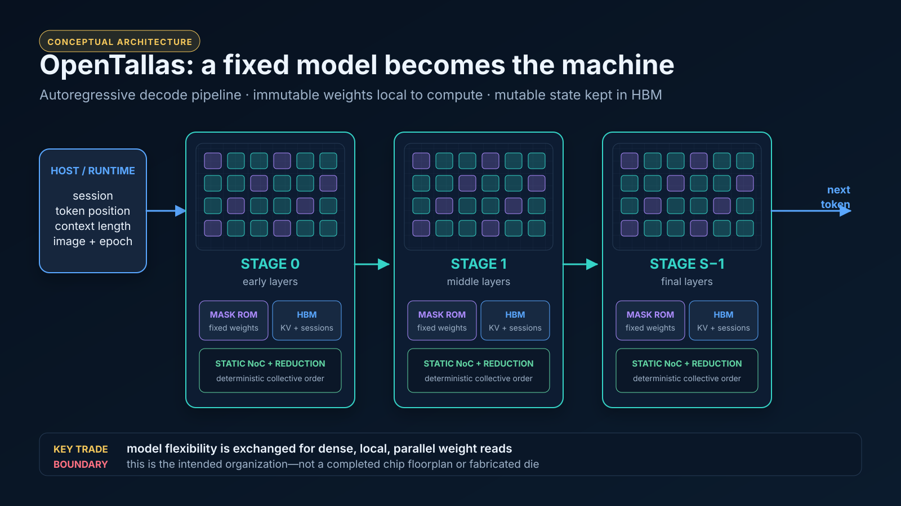

# OpenTallas



> **Research status:** OpenTallas has checked analytical studies, synthesizable
> public-reference RTL, open-tool verification, local open-PDK ROM methodology
> slices, and a partial predictive-PDK digital physical proxy. It does **not**
> have a complete checkpoint-to-physical-image compiler, an operator-complete
> service engine, end-to-end model differential evidence, a target-node ROM
> macro, a full placed-and-routed chip or wafer, or fabricated OpenTallas silicon.
> A deterministic exact-integer compiler/interpreter fixture now proves the first
> artifact path. The official Flash front end additionally locks the expected
> tensors, maps a 1,924-node source graph, and has an independent scalar
> target-format reference. Sixteen of 43 graph operator kinds have unit-qualified
> executable references; the other 27 references and all service-engine/RTL
> implementations remain pending. Current speedups are conditional break-even
> scenarios, not achieved implementation results.

## Start here

- **New to the project?** Read
  [`docs/OVERVIEW.md`](docs/OVERVIEW.md) for the plain-language rationale, a
  one-token walkthrough, architecture and layout views, simulation results, the
  exact 9,399-tokens/s derivation, and a clear “built versus not built” boundary.
- **Using a figure?** Read the
  [`visual asset provenance contract`](docs/assets/README.md). It labels each
  image as conceptual, simulation-derived, or rendered from archived physical
  geometry and records the forbidden interpretations.
- **Reviewing the headline studies?** Use the N7/HBM2e/A100
  [`architecture-attribution report`](results/iso-node/n7_architecture_attribution/REPORT.md)
  and the N4-class/HBM3e/B300
  [`market report`](results/iso-node/leading_node_market/REPORT.md).
- **Implementing or auditing the design?** Start at the governed
  [`executable-system recovery plan`](docs/EXECUTABLE_SYSTEM_RECOVERY_PLAN.md)
  and [`specification index`](spec/README.md), then consult the
  [`methodology`](docs/METHODOLOGY.md), [`sources`](docs/SOURCES.md), and
  [`assumptions`](docs/ASSUMPTIONS.md).
- **Running the executable fixture?** See the compiler/runtime scope and commands
  in [`compiler/README.md`](compiler/README.md). It is unit-test evidence, not a
  transformer or DeepSeek validation.

OpenTallas is a reproducible, CPU-capable evaluation of model-specific inference
silicon whose weights live in mask ROM.  It implements the analytical and
architecture-simulation work described in
[`rom-inference-program-plan.md`](rom-inference-program-plan.md).

The project is deliberately evidence graded:

- `measured` values come from official configs or safetensors headers;
- `published` values come from an official model report or hardware source;
- `assumed` values are explicit sweep inputs, never silently presented as facts;
- `synthetic` traces exercise the design but are not substitutes for production
  router traces.

The normative comparison method is in [`docs/METHODOLOGY.md`](docs/METHODOLOGY.md),
the primary-source register is in [`docs/SOURCES.md`](docs/SOURCES.md), and every
runtime/cost convention is recorded in [`docs/ASSUMPTIONS.md`](docs/ASSUMPTIONS.md).
Reported cost is explicitly partial
TCO (hardware/NRE amortization plus active electricity), not a complete business
case or cloud price.

The authoritative generated comparisons are deliberately separated by technology
generation:

- [`results/iso-node/n7_architecture_attribution/REPORT.md`](results/iso-node/n7_architecture_attribution/REPORT.md): N6/N7-class ROM plus HBM2e-era interfaces versus A100 80 GB, with WSE-2 only as a wafer-feasibility anchor;
- [`results/iso-node/leading_node_market/REPORT.md`](results/iso-node/leading_node_market/REPORT.md): N4-class ROM plus HBM3e versus B300 4NP/HBM3e, with WSE-3 only as a physical-feasibility anchor.

The hardware-independent weight/KV matrix is in
[`results/model-traffic/REPORT.md`](results/model-traffic/REPORT.md), and the
phase/gate disposition is in
[`results/PRE_NDA_READINESS.md`](results/PRE_NDA_READINESS.md). The direct mapping
from the requested re-baseline and the eight public program deliverables to
repository evidence is in
[`results/REQUIREMENT_AUDIT.md`](results/REQUIREMENT_AUDIT.md).

The custom-transistor methodology vehicle is documented in
[`docs/OPEN_PDK_SELECTION.md`](docs/OPEN_PDK_SELECTION.md). The governed SKY130A
run now has zero Magic DRC errors, a unique Netgen LVS match, an audited
one-via programming difference, capacitance extraction, and 33/33 deterministic
extracted-layout PVT/load cases. A separate fixed-seed campaign enables the
installed per-instance mismatch equations at nominal TT: 256/256 local modeled
samples pass, the same seed replays exactly, and cross-seed variation is
observed. A complementary full-RC campaign preserves all extracted resistor
segments across five declared Magic interconnect styles: 165/165 deterministic
electrical cases and all five fresh-directory semantic extraction replays pass.
The nominal local delay is 0.0412 ns versus 0.0354 ns for the capacitance-only
baseline; this is a local methodology comparison, not a product timing value. See
[`results/spice/sky130_physical/REPORT.md`](results/spice/sky130_physical/REPORT.md)
and
[`results/spice/SKY130_EXTRACTED_PVT_REPORT.md`](results/spice/SKY130_EXTRACTED_PVT_REPORT.md),
plus
[`results/spice/SKY130_EXTRACTED_MISMATCH_REPORT.md`](results/spice/SKY130_EXTRACTED_MISMATCH_REPORT.md)
and
[`results/spice/sky130_resistance/REPORT.md`](results/spice/sky130_resistance/REPORT.md).
The independent IHP SG13G2 replication is governed end to end. The pinned
v0.3.0 checkout is semantically locked, all four official Verilog-A modules
compile twice byte-identically for generic x86-64, and the official 1.2-V
device smoke passes. The separately implemented controlled-via slice then
closes zero-error DRC, unique ten-port LVS, the exact 6-versus-5 via invariant,
capacitance PEX, and 33/33 deterministic PVT/load cases. Its five-style
detailed-RC campaign preserves 10 MOS, 41 resistor, and 68 capacitor elements,
passes all five fresh-directory semantic replays, retains all six extracted
NMOS body-resistance paths, and closes 165/165 electrical cases. See the
[`IHP device-smoke`](results/spice/ihp_device_smoke/REPORT.md),
[`physical`](results/spice/ihp_sg13g2_physical/REPORT.md),
[`capacitance-PVT`](results/spice/IHP_SG13G2_EXTRACTED_PVT_REPORT.md), and
[`detailed-RC`](results/spice/ihp_sg13g2_resistance/REPORT.md) reports. These
are local open-PDK circuit results, not silicon-yield evidence, a compact ROM
macro, or N7/N4 scaling anchors.

`results/standard/` and `results/sensitivity/` are retained as legacy exploratory
artifacts. Their B200/B300-versus-single-midpoint figures are superseded and must
not be quoted as the current comparison. The focused Qwen3-8B control remains in
[`results/standard/QWEN3_8B_ADDENDUM.md`](results/standard/QWEN3_8B_ADDENDUM.md)
as a legacy architecture-control study, not a product result.

The simulator is model-general. The authoritative iso-node studies currently use
DeepSeek V4 Flash and Pro at 8K, 32K, 200K, and 1M resident context and batch 1,
8, 32, and 64. They inventory released tensors and exact operator shapes, retain
DeepSeek's official FP8/MXFP4/BF16/FP32 roles, keep immutable ROM weights separate
from mutable SRAM/HBM KV state, and expose weight, KV, compute, communication,
pipeline, capacity, and thermal terms. Kimi K3 and Qwen3-8B remain useful controls
in the legacy/general simulator but are not part of the two current comparator
matrices.

The reported compute interval prices format-specific tensor contractions only.
Selected normalization, nonlinear, softmax/index-score, compressor, top-k, and
Sinkhorn work is now stage-partitioned and reported as break-even service-rate
requirements without inventing a vector roof. Those paths—and the still-incomplete
auxiliary operator ledger—do not yet contribute modeled time or energy, so all
token rates and ROM/GPU ratios remain conditional under `COMP-01`.

The architecture/specification gate has passed for public-reference RTL only. The
checked `ot_*` hierarchy is now a controlled implementation baseline with strict
static/CDC/RDC, formal, dual-simulator, and source-hashed evidence. A warning-clean,
source-checked campaign also closes 87 enumerated public RTL fault/containment sites
under both Icarus and pinned Verilator 5.050; this is not physical or ATPG coverage.
The governed seven-case Nangate45 implementation campaign also closes from an
isolated clean baseline: mapped synthesis and complete proxy STA cover 7/7 cases,
with 2/2 generic equivalence, 1/1 actual mapped equivalence, 2/2 physical proxies,
2/2 post-route equivalence, and 386 hash-verified referenced artifacts. See the
[`implementation report`](results/rtl/IMPLEMENTATION_REPORT.md) and
[`clean replay`](results/rtl/CLEAN_BASELINE_REPLAY.md). The small legacy tile,
open-library implementation, and open-PDK transistor experiments remain
methodology/feasibility proxies. None authorizes product silicon: target numerical
qualification, target macros/PDK, full-chip or wafer physical design, package,
manufacturing, and foundry signoff remain mandatory gates.

## Quick start

```bash
python3 -m pip install -e .
python3 tools/profile_hf.py --all
python3 tools/build_iso_node_studies.py --write
python3 tools/run_iso_node_studies.py
PYTHONPATH=src pytest -q tests/test_iso_node_studies.py
make fault-campaign
make verify
```

The optional custom-transistor campaign requires the pinned public SKY130A and
IHP SG13G2 PDKs, Magic, VLSI Netgen, ngspice 43 with OSDI, and the pinned patched
OpenVAF compiler. It is deliberately outside the generic `make verify`
dependency set:

```bash
tools/bootstrap_sky130_pdk.sh
tools/bootstrap_sky130_physical_tools.sh
tools/bootstrap_ihp_pdk.sh
tools/bootstrap_ihp_model_tools.sh
make spice-pdk
```

The fault plan is machine-readable in
[`spec/fault_campaign.json`](spec/fault_campaign.json); canonical evidence is in
[`results/rtl/FAULT_REPORT.md`](results/rtl/FAULT_REPORT.md). Rebuild the pinned
timed-bench simulator with `tools/bootstrap_verilator_5_050.sh` when it is absent.
The controlled source and bench inventory is documented in
[`rtl/README.md`](rtl/README.md).

No model checkpoint is downloaded. The profiler uses small HTTP range requests
to read safetensors metadata. A full standard run is intended to fit on a CPU
workstation.

## What a result means

The code can validate accounting, architecture trends, constraint interactions,
and sensitivity to hardware assumptions. It cannot establish leading-node ROM
density, read bandwidth, yield, price, or packaging feasibility; those remain
foundry/OSAT measurements. See `docs/` and the generated result report for the
precise boundary between demonstrated, simulated, and unknown claims.
