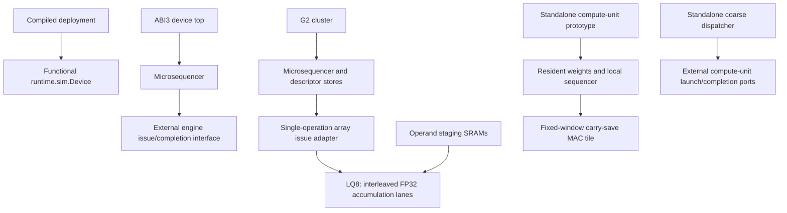

# Architecture integration review: first findings

2026-09-22. Source snapshot: `results/architecture/integration_map.json`, generated
by `python3 tools/audit_architecture_integration.py`. This is a static source
review, not a completed workload performance study or elaborated netlist audit.

## The measured components do not yet form one accelerator

The fast compute unit is not instantiated by `ot_a3_g2_cluster`, and the coarse
dispatcher is not in its control path. `ot_a3_device_top` itself instantiates
control and exposes engine interfaces. Functional token correctness is obtained
through the Python device, not execution of the fast RTL prototype. These paths
prove different things; their best results cannot be combined as one machine.

The G2 array adapter accepts one operation only while idle. It is a contraction
vehicle, not an integrated implementation of every engine family. Its comments
and RTL also identify a limited resolved-view interface: full operand dimensions
and numerical binding are not conveyed as a complete per-operation bundle.
Before queueing operations, capture a self-contained command and associate all
resolved views, faults and completion with that command's identity.

## Numerical behavior constrains the architecture

`ot_a3_lane_pipelined` preserves the specified accumulation order and FP32 RNE
behavior, using independent output accumulators to hide recurrence latency.
`ot_mac_tile` uses a shared fixed-point window, exact carry-save accumulation and
an explicit dropped-term flag. These are different arithmetic contracts.

For example, products `[1, 2^-24, -1]` yield zero under sequential FP32 RNE,
but `2^-24` under exact accumulation followed by rounding. All three products
can be formed from BF16 operands. This example does not depend on window loss.
The audit emits the example as arithmetic evidence; it does not claim these
values fit an arbitrary selected prototype window.

Decision: retain the ABI3 numerical contract for integration. Transfer reuse,
local sequencing and scheduling techniques into that path. Do not substitute
the fixed-window prototype on the strength of its frequency. A different
numerical mode would need an explicit contract and independent qualification.

Further workload inspection qualifies that decision: the current Qwen graph and
rebuilt deployment use `bf16_bf16_fp32_blocked_rne_v1`, with no compiler numeric
substitutions. The functional engine permits an implementation-declared,
deterministic blocked association, and records backend identity. LQ8 documents
the sequential contract. Therefore **LQ8 is also not automatically a qualified
implementation of the current functional Qwen path**. Preserve the requested
contract explicitly: retain sequential behavior where requested, and declare
and qualify a hardware association for blocked mode. Do not claim equivalence
to the current BLAS backend without testing. An exact fixed-point sum is still
not a binary32 blocked accumulation implementation merely because it is faster.

## First memory-architecture restriction

`ot_a3_g2_array_staging` gangs two single-port 512x128 SRAMs into a 1024-word
weight window. Both share the selected address. `w_busy = w_rd_en` blocks every
host weight write during a read, including writes to the other physical bank.
Thus it has storage banking but not independent refill/compute bank service.

The enclosing cluster imposes an even stronger restriction: `host_ready =
!busy`, and every program, descriptor, staging and symbol write is gated through
that signal. Consequently changing staging arbitration alone cannot create any
runtime overlap. The deployment loader and runtime operand service must be
separated. Preserve the loader's idle-only protection for program/descriptor/
symbol state; add a distinct credit-driven refill interface whose admission is
controlled by tile ownership, not by global cluster idle.

The first architecture implementation candidate is independent bank arbitration
and a bank-ownership protocol for resident and filling tiles. Merely changing
the write enable is insufficient for a complete streaming design. Required work:

1. Give each macro its own address selection. Allow opposite-bank read/write;
   retain read priority and explicit refusal on a same-bank conflict.
2. Define ownership, tile identity, fill completion and final-byte visibility.
   Never overwrite a bank whose resident tile still has consumers. A current
   read address alone does not prove the other bank is free.
3. Coordinate producer credits and descriptor admission with residency. The
   LQ8 read port cannot stall, so launch only when its required service is
   guaranteed; do not treat a window-fault counter as safe flow control.
4. Include activation and scale delivery. Overlapping weights while scales or
   activations serialize can simply move the bottleneck.
5. Verify multiple consecutive dependent operations, skewed refill, same-bank
   conflicts, reset, faults and exact completion. Measure total cycles, bytes,
   buffer occupancy and useful issue cycles before and after.

The theoretical two-bank benefit is bounded: serialized fill plus compute is
`Tfill + Tcompute`; ideal steady-state overlap is at best
`max(Tfill, Tcompute)`, before startup, drain, shared-port and dependency costs.
No speedup is claimed until the integrated service schedule demonstrates it.

## Control architecture follows the dataflow

Capture full immutable operation records, then put local tile-loop expansion
behind the dependence-checked command boundary. Size queues to absorb real
producer/consumer bursts. Do not use queue depth to mask a sustained service
deficit. Multiple pending commands can overlap preparation and refill, but a
single LQ8 still executes one contraction at a time unless the execution
architecture itself changes.

For prefill/batched workloads, assess reuse across independent output rows while
preserving each accumulator's K order. For decode, retain efficient activation
broadcast across output columns. Count scale traffic, activation filling,
writeback and downstream reduction/vector capacity in both cases.

## What is still needed before selecting the full organization

- Bind each supported deployment/configuration to a real RTL integration target;
  list absent engines and unsupported operator modes explicitly.
- Extract actual decode, prefill and long-context operator traces. Attribute
  latency to useful compute, memory service, recurrence, control and transport.
- Reproduce the documented low cycle-model utilization example. Current source
  contains different costing logic from historical reports; the 3.4% figure
  must not be treated as a fresh measurement or fixed by changing a rate knob.
- Evaluate sustainable issue/service rates and area for the complete engine mix.
- Choose the clock organization only after these service budgets are known.

The full architecture review remains open. The immediate implementation target
is banked operand delivery with ownership and integrated scheduling evidence,
followed by coarse local dispatch and reuse where traces show value. Component
pipelining resumes after these architectural decisions, across every selected
component rather than just the prototypes with favorable frequency results.

## Current workload replay changes the utilization diagnosis

The old `qwen3-8b-single-chip-w95` deployment fails current capability admission.
Rebuilt `build/ir-v3/qwen3-8b/kernel_ir.v3.json` with
`tools/build_hbm_sram_deployment.py`, the current single-chip capability and
`--check-determinism` into `build/architecture/qwen3-current-baseline`. It is
admitted, passes the checker and is byte-identical across repeated compilation.
Checkpoint shards are symlinked from the local pinned Qwen snapshot
`b968826d9c46dd6066d109eabc6255188de91218`; they were not copied or modified.

The initial two-symbol request stopped after four tensor operations and trapped.
Its retained `qwen_decode_current_cycle_baseline.json` is failed diagnostic
evidence only. The sweep tool prints timing ratios even for failed executions;
those ratios must not be used as workload performance. The successful replay
uses the complete historical symbol set, recorded in
`qwen_decode_full_symbols_cycle_baseline.json` together with the command.

Both tables execute 36 attention operations, 254 tensor operations and 691
commands, select one token, and report SUCCESS with all 36 architectural counters
identical. This is a synthetic-input functional replay, not an external-oracle
token qualification or a long-context benchmark.

| Current model | Total cycles | Tensor busy cycles | DMA busy cycles | Tensor service efficiency relative to table |
|---|---:|---:|---:|---:|
| ASAP7 v1 cost table | 103,126,781 | 61,577,458 | 39,292,516 | 96.0% |
| ASAP7 v2 cost table | 218,830,185 | 176,048,322 | 39,292,516 | 97.1% |

Efficiency here is useful multiply/add count divided by tensor busy cycles,
lane count and the table's work-unit rate. It is **not** physical MAC utilization.
The old 3.4% observation is not reproduced by the current model and cannot be
used to justify scheduling changes today. DMA service is material, but summed
engine busy cycles are not an additive critical-path decomposition. The v2
1.28745 GHz table clock also does not establish G2 cluster closure.

The source-bound attribution is retained in
`results/architecture/qwen_current_bottleneck_attribution.json`. Next, expand to
prefill and long-context traces and account for actual refill/compute dependency
edges before sizing buffers or assigning an overlap speedup.

## Prefill extension and selected delivery architecture

Eight- and 128-token prefill replays now report SUCCESS across all 36 layers;
the eight-token sweep also checks identical architectural counters under both
tables. `results/architecture/qwen_span_service_comparison.json` binds their
records and compares the v2 table results:

| Span | Total cycles | Tensor busy cycles | DMA busy cycles |
|---|---:|---:|---:|
| 1 | 218,830,185 | 176,048,322 | 39,292,516 |
| 8 | 1,308,335,818 | 1,275,526,587 | 39,308,756 |
| 128 | 20,344,327,372 | 20,123,725,497 | 39,588,192 |

These are synthetic-input cycle-model runs. Busy times can overlap and cannot
be summed into elapsed time. DMA busy time is not all operand traffic: the
tensor engine also reads memory. The 128-token run is not full long-context
decode qualification. The result supports reviewing row reuse and tensor
service together, rather than expecting refill overlap alone to fix prefill.

The selected direction and implementable interface/ownership rules are in
`RUNTIME_OPERAND_ARCHITECTURE.md`. The IR-driven staging-demand audit shows that
none of the 253 whole BF16 contractions fits the current G2 window. That audit
is explicitly not a simulation of the compiler's tiled schedule. It exposes
the missing tile-service boundary, including accumulator continuity, rather
than prescribing a whole-operator SRAM allocation.

The first ownership-controller RTL is implemented and tested. It remains
separate from the cluster until staged-memory integration and safe issue
backpressure are verified. No integrated speedup or architecture completion is
claimed from this controller.
