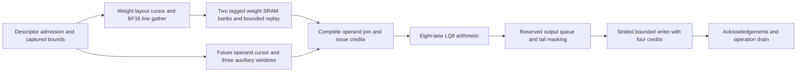

# Accelerator architecture review and optimization priorities

Date: 2026-09-22. Implementation baseline: commit `45e43800`.

## Assessment

The project has meaningful, measured improvements, but significant architectural
limits remain. It is not yet demonstrated to be well optimized across all targets.
Most recent implementation and loaded evidence cover optional G2/LQ8 runtime
operation. Complete current-source G2 physical closure and broader deployment
qualification remain open. This review supersedes earlier status summaries in the
[detailed evidence history](REFINED_ARCHITECTURE_AND_OPTIMIZATION_REPORT.md).

## Refined architecture: implemented today

The runtime separates descriptor admission, memory transport, SRAM reuse,
operand issue, arithmetic and output drain:

- Two 512x128 weight banks overlap refill and execution. Rows of at most
  1,024 packed words can remain resident for replay across output rows.
- Optional descriptor resolution captures A/B object identity, capacity and
  strides. The integrated weight path reads actual BF16 object bytes, including
  strided views, through a bounded cached gather. This mode requires group one;
  it does not establish general activation or all-format input transport.
- Three auxiliary windows and a future operand cursor reduce activation/scale
  refills and prepare operands ahead of issue.
- Issue requires complete operands and reserved output capacity. Generation
  ownership, fault priority and cancellation acknowledgement protect operation
  boundaries, including pending external reads.
- The output writer uses descriptor-owned capacity, strided addresses, tail
  masks and four outstanding write credits. Completion includes final responses
  and drain. Sequential FP32 RNE arithmetic association is preserved.

These choices support efficient acceleration through reuse and overlapped work.
Their efficiency still depends on workload size, memory service and engine balance.
Runtime features remain opt-in; their results do not qualify the legacy default.

## Improvements against recorded earlier versions

Each row is a separate experiment; percentages must not be added together.
Campaign cycles include faults, aborts and recovery, and are not inference latency.

| Improvement | Earlier result | Refined result | Scope and qualification |
|---|---:|---:|---|
| Resident weight replay | 1,440 weight fills | 240 fills | M6/N24/K80: 83.3% fewer first-operation fills |
| Rolling activation windows | 1,440 fills; 35,175 cycles | 720 fills; 30,723 cycles | M6/N56/K80: 50% fewer fills, 12.66% fewer campaign cycles |
| BF16 line retention | 67,840 weight bytes; 269,291 cycles | 8,480 bytes; 82,676 cycles | Matched contiguous-object experiment: 87.5% fewer first-operation bytes; historical source checkpoint |
| Gather output/input handoff with replay | 110,614 cycles | 105,552 cycles | Matched strided M6/N53/K80 campaign: 4.58% reduction, unchanged traffic |
| Gather handoff without replay | 387,169 cycles | 361,689 cycles | Matched streaming campaign: 6.58% reduction, unchanged traffic |
| Writer handoff | 24 cycles | 17 cycles | Eight continuous beats with same-edge acknowledgements; credit depths 2/4/8 |
| Layout admission pipeline | −0.191066 ns setup slack | +0.0561202 ns | Standalone cursor at 1 ns; five admission cycles, unchanged streaming rate; refined CTS12 passes reported checks |
| Gather invariant bound capture | 6,295.850 µm²; −0.107403 ns setup | 6,094.540 µm²; −0.0237331 ns | Containing transport at 1 ns: 3.20% less cell area, but still fails setup and slew |
| Sinkhorn handoffs with pipelined divider | 1,129,736 cycles | 1,105,554 cycles | 36-matrix corpus: 2.14% reduction; current recorded parent route passes at 2 ns |

The strided handoff campaigns each verify 2,234 outputs and 295 write
acknowledgements. Latest lane final-line flags remove a wide address comparison
from miss selection without adding cycles; physical benefit is still unproven.

## Highest-priority architectural correction

Whole-row replay has a capacity cliff. The current M6/N53 experiments show:

| Depth K | Packed words per weight row | First-operation weight fills | Object bytes | Campaign cycles |
|---|---:|---:|---:|---:|
| 144 | 1,008 | 1,008 | 31,164 | 196,707 |
| 160 | 1,120 | 6,720 | 207,336 | 708,336 |

These are different shapes, so this is not a matched speedup comparison. The
measurements expose repeated fetching after the 1,024-word capacity boundary.

The next proposed design is **column-pass-first reuse across output rows**.
At K160, a pass covering three local column groups requires 480 packed words,
which fits one 512-word bank. Replaying a whole-K pass across rows can preserve
each output's sequential K association without spilling partial accumulators.
The weight cursor, future operand cursor and arithmetic lane now implement and
test this alternative order behind `PASS_FIRST`. A separate pass scheduler now
verifies multirow reuse through the SRAM bank service, reducing the K160 example
from 6,720 to 1,120 fills. The complete integrated schedule is still unfinished. See
[the implementation checkpoint](G2_DESCRIPTOR_INPUT_TRANSPORT_PLAN.md).

It requires coordinated changes to issue order, weight and auxiliary cursors,
bank ownership, output addresses, tail masking and writer sequence validation.
Activation traffic must be measured again because changing loop order changes
activation locality. Passes that exceed bank capacity require depth tiling and
an explicit FP32 partial-accumulator storage budget. Changing only the weight
scheduler would leave the architecture inconsistent.

## Architecture-first implementation plan

| Priority | Work | Acceptance evidence |
|---|---|---|
| 1 | Implement and compare pass-first multirow weight reuse | Matched above-capacity workloads; fewer bytes per useful output; preserved numerical order, tail behavior and cancellation; bounded storage; activation traffic and total cycles included |
| 2 | Complete descriptor-driven input transport and supported-format mapping | Actual activation/weight objects, nonzero bases and strides, capacity failures, realistic stalls, physical-memory binding and end-to-end reference agreement |
| 3 | Establish budgets for every target and balance its engines | Workload-specific bandwidth, SRAM capacity/banking, occupancy, starvation, lane utilization and service rates; select queues and concurrency from measurements |
| 4 | Optimize every instantiated component against its containing critical paths | Pipeline arithmetic/address/control paths where achieved clock and added cycles improve throughput or latency within area/storage budgets; verify backpressure and recurrences |
| 5 | Qualify the complete implementation per deployment and technology | Current-source integrated functional results and routed setup/hold, slew, capacitance, fanout, DRC and antenna checks; include SRAM and clock-tree costs |

Target-specific work in priority 3 remains open:

| Target | Architectural focus |
|---|---|
| Dense decode | Weight bandwidth, bounded prefetch and occupied arithmetic lanes |
| Dense prefill | Multirow tile reuse and explicitly budgeted accumulators |
| MoE | Expert grouping, skew, dispatch/gather queues and weight locality |
| Attention/KV | Cache layout and banking, append/read bandwidth and reduction throughput across context lengths |
| Vector/reduction | Service rates matched to tensor production, including pipeline latency |
| Distributed execution | Transfer credits, congestion, operation ownership and cancellation/drain |
| Technology/deployment variants | Realizable memory organization, configuration coverage and separate clock/area budgets |

## Physical status and limits

Recorded ASAP7 TT routes pass all reported checks at 1 ns for the operand
service, output writer and standalone layout cursor, and at 2 ns for the current
Sinkhorn configuration. These are block/configuration results, not a whole-chip
clock guarantee or measured silicon performance.

The latest completed final-line containing weight-transport route has
+0.0547659 ns setup slack but nine slew violations at 1 ns. A current-source
route with 10% slew repair margin is active; the acceptance limits are unchanged. Two integrated G2 runs also remain
active; their launch sources predate the current input transport, so they can
provide historical baselines only. Current-source integrated G2 routing is still
required. No energy percentage or all-target completion is established.

Evidence: [capacity boundary](../results/rtl/g2_weight_replay_capacity_boundary.json),
[resident handoff comparison](../results/rtl/g2_weight_word_handoff_comparison.json),
[streaming handoff comparison](../results/rtl/g2_streamed_weight_handoff_comparison.json),
[input transport design and route records](G2_DESCRIPTOR_INPUT_TRANSPORT_PLAN.md),
and [full implementation history](REFINED_ARCHITECTURE_AND_OPTIMIZATION_REPORT.md).
