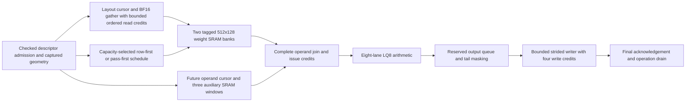

# Accelerator architecture review and optimization priorities

Report date: 2026-09-23. Implementation checkpoint: `93b7a08e` on
`token-path-end-to-end`. This report consolidates the implemented refinements,
measured comparisons and remaining architecture-first work. Each measurement
qualifies its recorded source/configuration; there is no single universal
“previous version.” The [detailed report](REFINED_ARCHITECTURE_AND_OPTIMIZATION_REPORT.md)
retains experiment history; this document supersedes its older status summaries.

## Assessment

**Significant architectural performance problems have been addressed, but the
project is not yet demonstrated to be a well-optimized accelerator across all
targets.** The largest measured gains come from reducing repeated weight
movement and choosing an execution order that fits local memory. These gains
support prioritizing architecture before individual module pipelines.

The strongest evidence covers optional G2/LQ8 runtime execution. Dense/MoE,
attention/KV, vector/reduction and distributed execution still require deployment
mapping, service-rate budgets and integrated qualification. Physical jobs for
current transport, runtime operands, state control and G2 remain in progress;
no final acceptance records were available for those configurations at this
review. A 1 ns target is not yet an achieved whole-accelerator clock.

## Refined architecture implemented today

The schedule selection shown above happens before elaboration in the loaded
runner. It is not a runtime-adaptive hardware controller. Generation ownership,
cancellation and fault drain apply across the transport and execution path.

| Decision | Earlier behavior | Implemented refinement |
|---|---|---|
| Reuse and loop order | Replay requires a whole weight row to fit 1,024 packed words; larger rows repeat fetches | Optional pass-first execution reuses a whole-K column pass across output rows; oversized passes stream and tails are considered separately |
| Pass width | Coupled to adder pipeline depth | Independent `PASS_COLUMNS` and `ADDER_STAGES`; residency can improve without changing arithmetic latency |
| Storage and numerical association | Capacity cliff at the full row | Reuses the same two weight banks; resident whole-K passes add no SRAM or accumulator spill and preserve sequential FP32 RNE association |
| Schedule policy | Manual selection | Configuration-time heuristic chooses the widest supported resident pass up to three columns; retains row-first for one row, resident whole rows, or depth beyond one-column residency |
| Weight read overlap | One outstanding line read | Optional 1–8 ordered read credits within a coordinate; default remains one; no out-of-order response support or next-coordinate prefetch |
| Auxiliary delivery | Repeated preparation and activation fills | Future-address cursor, rolling activation reuse and three auxiliary windows overlap preparation with execution |
| Partial-row replay | A short final row can reject a valid prefix or strand a retained bank | Bounded-prefix acquisition and next-row-aware bank release; no added state, storage or cycles |
| Publication and completion | Row-first publication and handoff bubbles | Pass-aware strided addressing, reserved output capacity, four ordered write credits and ownership through final acknowledgements |
| Optional state control | Combinational 33-bit modulo and admission-dependent payload writes | Sequential modulo with power-of-two bypass; independent free-entry capture and validity count; removes reset from 1,088 payload bits |

BF16 weight-object reads currently cover group one and strided views. General
activation-object transport and broader input-format coverage remain open.
Lane pass widths 1–7 are supported subject to accumulator capacity; the loaded
runner exposes 1/2/3. Optional features do not automatically qualify every
legacy default or production deployment.

## Measured changes compared with earlier versions

M/N/K denote output rows, output columns and reduction depth. Comparisons are
matched within each experiment, and percentages must not be added together.
Campaign cycles include faults, aborts, recovery and drain. Successful-phase
cycles cover operation kick through completion under the modeled external
service. Neither is whole-model inference latency. Traffic figures below are
first-operation counters.

| Matched experiment | Earlier result | Refined result | Demonstrated change |
|---|---:|---:|---|
| M6/N53/K160, row-first → pass-first3, campaign cycles | 708,336 | 203,111 | 71.33% fewer cycles; weight bytes 207,336 → 34,556 |
| K342, pass3 → pass2 with the same three-stage adder, median successful-phase cycles | 200,641.5 | 67,785.5 | 66.22% fewer cycles; weight bytes 404,340 → 73,140 |
| K513, pass2 → pass1, median successful-phase cycles | 300,448.5 | 143,226.5 | 52.33% fewer cycles; weight bytes 604,752 → 109,392 |
| K343, manual pass3 → automatic pass2, median successful-phase cycles | 201,466.5 | 68,181.5 | 66.16% fewer cycles; validates the capacity heuristic at another boundary |
| K344, one → four read credits, same external queue4 and response delay12, median successful-phase cycles | 109,884 | 80,903.5 | 26.37% fewer cycles; same 73,564 weight bytes and 8,256 activation fills |
| Earlier M6/N56/K80 rolling activation-window experiment, campaign cycles | 35,175 | 30,723 | 12.66% fewer cycles; activation fills 1,440 → 720 |
| Writer handoff, eight continuous beats with same-edge acknowledgements | 24 cycles | 17 cycles | Removes handoff bubbles at credit depths 2/4/8 |

At K342, three columns require 1,026 packed words, just beyond the 1,024-word
capacity. Two columns require 684 and can replay. Changing this architectural
choice avoids repeated external traffic without needing a faster adder.
There is a real tradeoff: activation fills rise 6,156 → 8,208. At K513,
one-column passes raise activation fills 12,312 → 21,546. These costs are
included in the measured operation latency.

More concurrency is not universally useful. At K160 with a single-request
external service, increasing credits from one to eight reduces median cycles
only 27,645.5 → 27,587 (0.21%); observed concurrency remains one. This supports
keeping the default at one until workload benefit and physical costs justify
more. The earlier resident K80 comparison also shows that pass-first can
increase activation traffic while providing little successful-operation benefit.

The loaded comparisons check 2,234 exact outputs and 295 writes/acknowledgements
per full campaign, including stalls, bounds, abort/restart and fault recovery.
Credit ownership tests pass Icarus and Verilator at 1/2/4/8 credits, including
errors overlapping held and newly accepted requests. Partial replay has 172
passing tests, including 72 partial-row cases. These are retained verification
results; this report refresh does not rerun RTL regressions.

Evidence: [pass-width comparison](../results/rtl/g2_single_column_residency_comparison.json),
[capacity policy](../results/rtl/g2_capacity_policy_comparison.json),
[read credits](../results/rtl/g2_gather_read_credits_comparison.json),
[service boundaries](../results/rtl/g2_gather_credit_service_boundaries.json),
[ownership checks](../results/rtl/gather_credit_ownership_cross_simulator.json),
[partial replay](../results/rtl/partial_replay_extent_gap/fixed.json).

## High-clock-rate implementation: evidence and limits

The ASAP7 compute/local-control engineering target remains 1 ns (1 GHz).
Higher targets should follow demonstrated system benefit. Supporting engines
need an explicit service budget and implemented clock boundary if they run
slower; a paper clock-domain split does not solve the integration problem.

| Block / configuration | Evidence | Qualification limit |
|---|---|---|
| Partial-replay pass scheduler | Final extracted route at 1 ns; area 1,393.780 µm²; setup +0.033745 ns, hold +0.051384 ns; zero reported timing/physical violations | Scheduler source hashes rechecked against this workspace; does not qualify prefetch or G2 |
| Pass-first output writer | Recorded route at 1 ns; area 1,682.200 µm²; setup +0.026359 ns, hold +0.050804 ns | Block/configuration evidence |
| Sinkhorn with pipelined divider | Recorded route at 2 ns; area 3,099.550 µm²; setup +0.092189 ns, hold +0.027670 ns | Separate engine configuration; not 1 GHz integration |
| Current weight transport, one/four credits | Synthesis available; final route pending | Older passing compact-transport route predates credits and is historical |
| Current runtime operand service and integrated G2 | Physical jobs in progress | No current integrated timing closure claim; state-disabled and state-enabled builds need separate qualification |
| Current state controller | Synthesis and functional checks available; final route pending | Earlier sequential variant still missed timing at intermediate CTS |

Areas above are standard-cell area, excluding SRAM unless separately accounted.
Positive slack is margin at the tested period, not a measured higher Fmax.

The [matched synthesis checkpoint](../results/physical_abi3/asap7/optimization_synthesis_checkpoint/comparison.json)
shows state-controller mapped area 3,919.979 → 3,573.645 → 3,492.799 µm²
for combinational modulo, sequential modulo, then independent payload capture.
These are 8.84% and a further 2.26% reductions. General ring modulo now takes
35 apply cycles instead of one; power-of-two/non-ring paths retain one cycle.
The four inspected frozen deployment bundles contain no STATE descriptors,
so this is not evidence of a speedup for those deployments.

Four-credit transport maps to 5,973.586 µm² versus 6,031.746 µm² for one
credit, despite adding fifteen flops. The 0.96% mapped-area reduction is a
synthesis outcome, not proof that larger queues inherently cost less. Neither
these figures nor removed resets establish routed area or energy savings.

Evidence: [scheduler route audit](../results/physical_abi3/asap7/weight_pass_scheduler/partial_replay_route_audit.json),
[writer route audit](../results/physical_abi3/asap7/output_writer_handoff/pass_first_route_audit.json),
[state verification](../results/rtl/state_payload_capture/verification.json),
[control campaign](../results/rtl/abi3_state_payload_campaign.json).

## Architecture-first optimization targets and execution order

1. **Close the current integrated evidence gap.** Finish existing physical jobs,
   inspect final extracted critical paths, and bind results to source hashes,
   parameters, actual elaborated hierarchy and memory macros. Qualify G2 with
   state disabled/enabled and relevant read-credit counts separately. Historical
   jobs remain useful comparisons, but cannot certify later RTL.
2. **Finish memory organization and scheduling decisions.** Move the runner's
   capacity heuristic into production compiler/runtime selection with measured
   activation, weight and service costs. Evaluate depth tiling when even one
   whole-K column exceeds local capacity, including accumulator storage and
   numerical association. Same-line gather coalescing now has matched functional evidence (checkpoint
   below); finish its containing transport and G2 physical qualification.
3. **Complete descriptor-driven input delivery.** Extend real activation and
   weight transport across required formats, strides and capacity bounds. Size
   queues from sustainable memory service and measured occupancy/starvation.
   Evaluate next-coordinate prefetch only with an explicit ownership/storage
   budget and measured end-to-end benefit.
4. **Balance the remaining accelerator targets.** Use actual deployed operator
   traces and finite resource budgets as listed below. Choose reuse, banking,
   engine replication and clock organization before tuning individual modules.
5. **Optimize every selected component in its containing configuration.** Use
   measured critical paths to choose pipelining, arithmetic restructuring,
   control fanout reduction and storage mapping. Check initiation interval,
   recurrence spacing, latency, backpressure and area together; extra stages
   alone do not establish higher useful throughput.
6. **Validate complete workloads and technologies.** Refresh compiled programs
   and cycle calibration; require exact numerical behavior, final-write drain,
   setup/hold and physical checks. Report latency, throughput, traffic, useful
   utilization, complete area and activity-based energy for each deployment.

| Target | Architectural decision to resolve | Required acceptance evidence |
|---|---|---|
| Dense decode | Weight delivery, local reuse and bounded prefetch | Bytes per useful output, starvation and latency under actual memory stalls |
| Dense prefill | Multirow pass/depth tiling and accumulator capacity | Residency boundaries, activation/weight tradeoff and sustained throughput |
| MoE | Expert grouping, dispatch/gather capacity and locality | Expert skew, queue occupancy, backpressure and token latency |
| Attention / KV | Cache layout/banking, append/read overlap and reduction capacity | Context-length scaling, bank conflicts and sustained service rates |
| Vector / reduction | Service capacity matched to tensor production | Producer/consumer rates, recurrence and complete transaction latency |
| Distributed execution | Injection/receive bandwidth, collective schedules and ownership | Congestion, finite credits, cancellation and final destination completion |
| Every technology / deployment | Implementable memories, clock domains and selected configurations | Separate hierarchy coverage, total area and current-source integrated closure |

This organization follows modern accelerator principles: maximize useful local
reuse, overlap bounded transport with execution, keep repeated scheduling near
engines, and balance compute against memory and supporting services. The
remaining acceptance requirement is to demonstrate those properties across the
supported deployments. The broader optimization task remains unfinished.

The [architecture-first plan](ARCHITECTURE_FIRST_OPTIMIZATION_PLAN.md) defines
full-scope acceptance, and the [transport plan](G2_DESCRIPTOR_INPUT_TRANSPORT_PLAN.md)
retains detailed implementation checkpoints and source snapshots.

## Same-line gather coalescing checkpoint (2026-09-23)

The gather now issues one read for active lanes sharing a 16-byte line and
fills their existing per-lane caches together. Seven registered adjacent-line
boundaries encode alias groups for unsigned monotonic lane addresses, including
sparse masks. This adds seven payload bits, no SRAM and no pipeline cycle.
The ordered read queue retains one lane identity per accepted line; pending
ownership covers all member lanes until the response retires.

Matched M6/N53/K2 loaded campaigns with four read credits, external queue four
and twelve-cycle response delay reduce median successful-phase cycles
704.5 → 570.5 (19.02%). First-operation reads fall 53 → 14 and weight bytes
836 → 212 (74.64% less). Both campaigns check 2,234 exact outputs and 295
writes/acknowledgements. This is a shallow supported contraction, not evidence
of the same gain on larger reduction depths.

Directed zero-stride and stride-two workloads reduce 64 reads to 8 and 16;
at four credits and delay32, cycles fall 661 → 329 and 346 respectively.
Distinct-line traffic retains its prior cycle counts. Tests cover small-stride
alignments, sparse/empty masks, retained replay, truncated final lines,
zero-latency responses, concurrent faults and cancellation. A pre-existing
shallow-workload abort-test issue was reproduced with the retained old gather:
waiting for operand issue before waiting for a pending memory read could allow
output before abort. The fixture now aborts at the first pending object read.
The original bench and both failures are retained.

Evidence: [coalescing comparison](../results/rtl/gather_coalescing/comparison.json).
A new four-credit containing transport route targets 1 ns. Its final physical
cost and timing are pending; earlier credit transport/G2 launches now qualify
their pre-coalescing sources. The all-target architecture and qualification
requirements above remain open.

## Physical cost and sparse-attention control checkpoint

Matched four-credit transport synthesis shows coalescing changes mapped cell
area 5,973.586 → 6,036.849 µm² (+1.06%) and adds exactly seven ordinary
flops. This is an intermediate synthesis cost, not routed area or energy.
See the [retained checkpoint](../results/physical_abi3/asap7/optimization_synthesis_checkpoint/coalescing/comparison.json).

The broader record audit was refreshed after coalescing, before the subsequent
KV-index edit. It finds 57 ASAP7 records with passing routed checks, matching
sources and retained artifacts among 232 routed records. These are records,
not unique modules or proof of elaborated all-target coverage. Historical
snapshots, changed sources and missing artifacts prevent many older records
from qualifying the current design. Its exact scope is in
[current evidence inventory](../results/physical_abi3/current_evidence_after_coalescing.json).

That audit identified a sparse-attention control path worth simplifying:
`ot_a3_attention_kv_index` previously gated publication through a population
count, despite admitting only nonempty prefix masks with trailing padding.
The retained 4 ns route's worst path crosses popcount arithmetic from an index
input to the published lane mask. The implementation now encodes the unique
live-to-padding boundary and checks emptiness with a mask reduction. It
preserves index order, range-error priority, fail-closed outputs and the
one-cycle latency/initiation interval. It adds no pipeline stage.

Both Icarus and Verilator pass 2,618 cases each across SLOTS 1/3/8/64/65/128,
including exhaustive small masks, randomized larger masks, legal prefixes,
range refusals, consecutive requests, idle stability and reset. Every result
is checked against independent mask rules and the retained previous RTL.
Matched 1 ns flow synthesis is essentially area-neutral: 707.611 → 708.661 µm².
The candidate and retained baseline are both in physical implementation at
1 ns; no improved routed clock or area is claimed yet. The old KV-index route
is now historical. Evidence: [KV-index verification](../results/rtl/kv_index_prefix_count/verification.json).

The containing sparse-attention bench also passes all nine transactions
bit-identically against `sparse_attention_bf16_codes`, including multirow and
multiblock operation, duplicate indices, bounds, saturation and counters.
Its source inventory, vectors, compilation and simulation logs are retained
with the KV-index verification. This is functional integration evidence;
physical qualification remains pending.

## State admission lookup checkpoint

The historical sequential-modulo state-controller run has reached global
routing. Its intermediate worst path still misses the 1 ns target by 0.88730 ns,
from a descriptor-table register through selected fields and commit arithmetic
to the commit counter's admission enable. This predates the payload-capture
variant and is not a final routed result.

The next refinement reads cursor, capacity, policy and open state directly
from the descriptor match mask. Encoded slot indices remain for table writes;
the read path avoids encoding a hit and then multiplexing the same table.
Allocation only occurs on a miss, so used descriptor identities are unique.
The non-saturating capacity check also uses the request span directly (or zero
for unstaged policy), keeping the saturating clamp out of a bounds check that
saturating commits bypass. Staged row payload still uses the required clamp.
No request or apply cycles are added.

Cycle equivalence passes 10,800 multi-slot stimulus cycles per simulator in
Icarus and Verilator, including public outputs, stored slot fields, pending
payloads and descriptor uniqueness. The 255-case cursor suite with 34 cancel
positions and the full control-plane campaign pass both simulators too.
Evidence: [parallel admission verification](../results/rtl/state_parallel_admission/verification.json).
A new 1 ns CTS12 physical run is active; synthesis/routed benefit and current
state-enabled integration remain pending. Earlier state jobs continue against
their own launch sources.

The parallel state-admission flow has completed synthesis. At matched 1 ns
CTS12 settings, mapped cell area falls 3,492.799 → 3,448.841 µm² (1.26%),
with unchanged 2,618 reset and 1,088 ordinary flops. Source-bound artifacts are
in the [state synthesis comparison](../results/rtl/state_parallel_admission/synthesis/comparison.json).
This does not establish final routed area, timing or energy. Early floorplan
repair now reports paths ending at the byte-written counter, whose apply path
contains a 32-by-32 row-byte product followed by a 64-bit accumulation. Final
extracted timing must determine whether and how to pipeline that accounting
while preserving transaction completion and statistics semantics.

## Sparse-attention service attribution

The containing sparse-attention bench now exposes optional `+profile` counters.
All nine reference-checked transactions pass, and phase totals reconcile with
2,443,487 active RTL cycles. Softmax exponential wait accounts for 2,248,054
cycles (92.00%), nested within the denominator phase's 2,269,923 cycles.
QK uses 52,882 cycles, AV 38,146, epilogue 76,607 and index delivery 5,760.
These nested counters must not be summed twice. They measure these fixtures,
not whole-model inference or a physically qualified clock.

The full/multiple-block cases spend about 94.6–96.0% in exponential wait;
the single-valid case spends only 0.03%, so the bottleneck is shape dependent.
The architecture priority for substantial sparse-attention latency reduction is
therefore exact exponential service: evaluate reusable certified results and
bounded concurrent service with an explicit area budget, ordered lane result
association, fault semantics and unchanged numerical contracts. Index-path
simplification remains relevant to clock feasibility, but optimizing index
cycles alone cannot materially improve this corpus's latency. Replication is
not yet implemented or assigned an assumed linear speedup.

Evidence and source inventory are retained in
[attention service profile](../results/rtl/attention_service_profile/summary.json).
`tools/summarize_attention_service_profile.py` requires all nine successful
transactions, verifies phase sums and nested wait bounds, and emits the
reproducible attribution. The testbench retains its numerical, memory-bound,
counter and saturation assertions.

## Final historical state-controller route

The sequential-modulo state-controller run has finished at the tested 1 ns
period. Final extracted setup slack is **−0.843259 ns**, with 1,895 setup
violations; hold slack is +0.0560803 ns. Reported DRC, antenna, slew,
capacitance and fanout violations are zero. Routed standard-cell area is
4,409.300 µm². The design is physically clean but **does not meet timing**.
Its worst path starts at `op_descriptor_id[2]` and ends at `count_commits[26]`,
confirming that descriptor admission remains a timing bottleneck after replacing
combinational modulo.

The route predates independent payload capture and parallel admission. Its
controller hash matches the retained `state_payload_capture/before.sv`, not
current RTL. All seven retained artifacts were hash-verified and the historical
source binding is recorded in the
[final route audit](../results/physical_abi3/asap7/state_controller/sequential_modulo_route_audit.json).
The later candidates remain in physical implementation. The report's derived
Fmax is not treated as a tested operating frequency or as closure.

## Exact softmax exponential reuse

The softmax block now retains one successful certified exponential argument
and result (64 payload bits plus validity). Bit-identical lane offsets reuse
that value across lanes and block starts. Errors never install entries; reset
invalidates them. Arithmetic configuration and operation are immutable, so
reuse preserves the exact numerical contract. Logical `exp_count` includes
hits, while the testbench separately counts physical service requests.
`EXP_REUSE=0` removes the cache for matched comparisons.

The nine-case softmax corpus and two refusals pass with reuse enabled and
disabled. Physical exponential evaluations fall 397 → 276 and campaign cycles
1,115,880 → 767,158 (31.25% less). Complete sparse attention still passes all
nine reference-checked transactions: aggregate active cycles improve 2.24%,
with the duplicate-index fixture improving 49,181 → 20,341 (58.64%). Several
full/multiblock fixtures are unchanged. The cache therefore helps repeated
arguments, but does not resolve general exponential throughput demand.
Only the softmax RTL differs between the recorded attention source manifests.

Both Icarus and Verilator also pass directed cache tests for repeated failed
service, successful-result reuse and reset. These protocol tests use a
fault-controllable service; numerical tests use the actual certifying RTL.
Matched containing-softmax synthesis/STA jobs at 1 ns are active for reuse
on/off. No physical area, routed timing or energy benefit is claimed.
Evidence: [reuse comparison](../results/rtl/softmax_exp_reuse/comparison.json).

## Small-divisor storage reuse

The exponential's small-divisor unit now shares one shift register between
unconsumed dividend bits and accumulated quotient bits. Quotient bits enter
below the remaining dividend and cannot reach the consumed high chunk before
the last step. This removes redundant state without changing restoring steps,
quotient, inexact flag or latency.

At WIDTH=163, DIVISOR_BITS=6 and BITS_PER_STEP=10, matched synthesis reduces
cell area 330.457 → 251.898 µm² (23.77%) and sequential cells 500 → 347.
The RTL removes a 170-bit logical register; synthesis already eliminated some
constant stages, so mapped savings are 153 flops. Both ten-step configurations
miss the tested 1 ns pre-layout target; no routed clock claim is made.
A four-bit-per-step candidate is routing at 1 ns. Its additional cycles must
be weighed against clock improvement before changing any consumer default.

Both Icarus and Verilator pass 354 arguments at six step widths (2,124
quotient/inexact comparisons each). The containing softmax's nine reference
cases and two refusals also pass with exactly the prior 767,158 cycles,
276 physical exponential evaluations and 121 cache hits.
Evidence: [shared-shift comparison](../results/rtl/small_divider_shared_shift/comparison.json).
Earlier softmax synthesis jobs bind their pre-shared-shift launch sources;
they remain useful for the isolated cache comparison, not current closure.

The historical KV-index baseline also terminated at pin placement (2,189 pins,
1,976 positions). Its corrected 22%-utilization retry is now active alongside
the matching prefix-count retry. Neither failure is a timing verdict.

## Matched containing-softmax synthesis cost

The reuse-on/off synthesis and pre-layout STA runs are complete. With reuse
disabled/enabled, mapped area is 12,291.810 / 12,252.096 µm² (−0.32%) and
sequential cell count is 8,907 / 8,971 (+64). Mapping changes combinational
logic as well as storage; this is effectively area-neutral, not evidence that
adding a cache inherently reduces hardware cost.

Both configurations fail the 1 ns pre-layout target: worst setup slack is
−8.2461 / −8.8373 ns. The enabled design's worst path is a control-register
self-loop through two gates; its flop-output net has 498 connected cell
terminals and the following NAND net 497. The NAND alone reports 7.2056 ns
delay before placement/buffering. This is an actionable fanout concern, but
not a routed timing comparison or a tested maximum clock.

These launches predate shared divider shift storage. Their divider source hash
matches `small_divider_shared_shift/before.sv`; the remaining launch sources
match the inspected workspace. Source bindings, synthesis reports, constraints
and critical paths are retained in the
[softmax physical checkpoint](../results/rtl/softmax_exp_reuse/physical_checkpoint/comparison.json).
The cache's numerical and service-cycle gains remain demonstrated; current
containing physical qualification and general exponential throughput remain open.

## Four-credit transport baseline closes at 1 ns

The pre-coalescing transport with `PASS_FIRST=1`, `COMPACT_PASS_REUSE=1`
and `READ_CREDITS=4` has completed final extracted routing at the tested 1 ns
period on ASAP7 TT. Setup slack is +0.0427878 ns and hold slack +0.0337075 ns,
with zero setup/hold, DRC, antenna, slew, capacitance and fanout violations.
Routed standard-cell area is 6,411.720 µm². This establishes a viable block
clock for the concurrent ordered-read architecture under the recorded boundary
constraints; it is not an integrated G2 or current coalesced-source result.

All three launch sources are bound to retained matching RTL, including
`before_gather_coalescing/gather.sv`, and all seven retained physical artifacts
were hash-verified. The matched single-credit and coalesced four-credit routes
remain live; their final results are needed to assess incremental routed cost.
See the [baseline route audit](../results/physical_abi3/asap7/bf16_weight_transport/credits4_before_coalescing_route_audit.json).

## Balanced multiplier and wider-chunk softmax experiment

The recovered `ot_wide_mul_tree_seq` candidate reduces independent partial
products and the redundant accumulator with a balanced 3:2 compressor tree.
At the default sixteen multiplier bits per step, reduction depth is six
compressor levels rather than sixteen serial levels. The transaction and bit
emission interfaces retain the existing multiplier's cycle count.

The candidate now has cycle-by-cycle chain-reference checks in addition to the
independent full-width product oracle. Six configurations pass in each of
Icarus and Verilator 5.050: three operand/split widths, with chunk sets
2/4/8/16 and 2/4/8/32. This is 4,072 product comparisons per simulator,
including repeated smaller-chunk checks. Both busy/done timing and completed
results agree with the existing chain multiplier.

An isolated containing-softmax experiment uses the tree with 32-bit chunks,
reducing multiplier transaction steps from 21 to 11 for the 163×161-bit
product. The nine numerical-reference cases and two refusals still pass.
With exponential reuse enabled in both runs, cycles fall **767,158 → 594,908
(22.45%)**, while physical exponential evaluations remain 276 and cache hits
121. The shared small-divider implementation is unchanged. Retained Verilator
source-content hashes agree for the other parsed dependencies; candidate
consumer snapshots preserve the existing workspace changes and alter only the
multiplier chunk parameter. This is a simulation-cycle benefit, not measured
wall-clock accelerator throughput or whole-attention qualification.

The old tree route uses a different source hash and is not accepted as closure
of this candidate. Fresh matched 1 ns routes are active for chain16, tree16
and tree32, with CTS cluster size 12 and the same fanout/transition constraints.
Production consumers retain their current implementation pending the routed
area/timing tradeoff and containing-engine qualification. The experiment,
source snapshots and logs are retained in the
[multiplier comparison](../results/rtl/wide_mul_tree_qualification/comparison.json).

## Local softmax lane writes

Softmax probability storage now uses one shared 32-bit value bus and a local
write enable for each lane, replacing variable part-select writes into the
full output vector. Invalid lanes need no separate zero write: operation start
clears all entries and each lane is visited once. The lane cursor now has
`clog2(LANES+1)` bits (seven at LANES=64), preserving the terminal sentinel.
No pipeline stages or service cycles are added.

Ten tests pass across Icarus and Verilator. Cycle-by-cycle comparison against
retained previous RTL covers every public output during 24 transactions at
each of LANES=1,3,64,65, including reset interruption, admission refusals and
service failures. The real softmax's nine reference cases and two refusals
pass at exactly 767,158 cycles, 276 physical evaluations and 121 cache hits.
All nine containing sparse-attention transactions pass, with every recorded
phase count identical to before (2,388,699 aggregate active cycles).

Matched current-source synthesis/STA runs before and after this change are
active. They include shared-divider storage; the older cache on/off timing records
were launched before that divider change. Consequently the older fanout self-loop is
a historical warning, not a demonstrated current critical path. No mapped
area reduction or clock improvement is claimed for local lane writes until
the new records complete. See [lane-write comparison](../results/rtl/softmax_lane_write/comparison.json).

## Current multiplier mapped-area tradeoff

Matched ORFS synthesis from the live chain16/tree16/tree32 routes gives
1,583.301 / 1,595.110 / 2,654.683 µm² standard-cell area, respectively.
Tree16 is 0.75% larger than chain16; tree32 is 67.67% larger. These are
pre-CTS mapped costs, not final routed results. The tree32 softmax's measured
22.45% cycle reduction must be weighed against complete-engine area and
extracted timing before selecting production chunk width. The default has
not changed. Reports and configurations are retained in the
[mapped multiplier checkpoint](../results/rtl/wide_mul_tree_qualification/mapped_checkpoint/comparison.json).

## Current softmax lane-write cost

Matched synthesis is complete with the shared-shift divider: old/local lane
writes map to 12,088.974 / 12,070.904 µm² (0.15% less) and 8,665 / 8,576
sequential cells (89 fewer). Pre-layout worst slack at 1 ns worsens from
−7.5201 to −8.3641 ns. Local enables are therefore a bounded-state and small
area simplification, not demonstrated clock improvement. The candidate's
worst path still has large unbuffered control loads: its launch and following
NAND nets connect 484 and 482 cell terminals. Current physical implementation
must resolve this; a pre-layout slack-derived frequency is not a clock result.
Both records predate the divisor capture below. Source bindings, constraints,
mapping reports and critical paths are retained in the
[lane-write physical checkpoint](../results/rtl/softmax_lane_write/physical_checkpoint/comparison.json).

## Small-divider operand capture after failed four-step route

The four-bit shared-shift divider completed final extracted routing at 1 ns:
setup slack −0.105676 ns with nine violations, hold +0.0529275 ns, area
323.399 µm². DRC, antenna, slew, capacitance and fanout checks are clean.
Its worst setup path starts at external `divisor[4]` and ends at `rem[5]`.
All source and retained artifact hashes are verified in the
[route audit](../results/physical_abi3/asap7/small_divider/step4_route_audit.json).

The divider now captures the divisor on the existing start edge. This adds
six payload flops in the measured configuration and removes the external
operand from the restoring-chain timing path without adding a transaction
cycle. The payload needs no reset because every accepted operation writes it
before use. The resulting interface also permits changing both external
operands after acceptance.

Four tests pass across Icarus and Verilator: 354 arguments at six chunk sizes
for each of two divisor widths, totaling 4,248 numerical comparisons per
simulator. Tests change operands immediately after acceptance and compare
busy/done timing with the previous stable-input implementation. The containing
softmax passes nine reference cases and two refusals at the same 767,158 cycles,
276 evaluations and 121 hits. A matched four-step 1 ns route is active; no new
clock claim or consumer step-width default change is made.
See [operand-capture evidence](../results/rtl/small_divider_operand_capture/comparison.json).

## Single-credit transport route fails capacitance acceptance

The matched pre-coalescing single-credit transport completed at 1 ns with
+0.0525722 ns setup and +0.0398299 ns hold slack, zero setup/hold violations,
and 6,462.820 µm² routed cell area. It has two maximum-capacitance violations:
24.65 and 24.06 against a 23.04 limit in report units. Other physical checks
are clean. Its engineering verdict is NOT_MET because of capacitance, despite
meeting timing; the driver's generic trailing timing-failure label should not
be interpreted as the specific failure. The four-credit baseline remains a
passing recorded configuration. Neither result proves current coalesced
transport closure. All source and seven artifact bindings are verified in the
[single-credit audit](../results/physical_abi3/asap7/bf16_weight_transport/credits1_before_coalescing_route_audit.json).

## Current KV prefix-count block closes at 1 ns

The prefix-count KV-index implementation has completed final extracted routing
on ASAP7 TT at 1 ns, using the corrected 22%-utilization floorplan required by
its IO-pin count. Setup slack is +0.145303 ns, hold slack +0.0567208 ns, and
routed standard-cell area 911.483 µm². All reported setup/hold, DRC, antenna,
slew, capacitance and fanout violations are zero. The worst setup path now
runs from `cfg_kv_rows[29]` to `error_code[2]`.

Both source hashes match current RTL and all seven retained artifacts verify.
This establishes block closure for the optimized prefix-count implementation,
not complete-attention closure. The matched old popcount baseline remains
active; a comparative routed area/timing claim awaits its final result.
See the [KV final-route audit](../results/physical_abi3/asap7/a3_attention_kv_index/prefix_count_route_audit.json).

The physical driver's failure message now says "failed engineering acceptance"
instead of unconditionally saying "did NOT meet timing". This reflects the
single-credit transport's capacitance-only failure without changing any verdict
criteria. The existing physical environment/acceptance tests pass.

## Matched KV routes confirm area and timing improvement

The old population-count KV-index baseline has now completed with the same
1 ns period, 22% utilization, CTS and signal-integrity constraints as the
current prefix-count design. Baseline setup slack is −0.139148 ns with 72
violations; current setup slack is +0.145303 ns with zero violations. Routed
cell area falls 1,080.380 → 911.483 µm² (**15.63%**), and setup margin improves
by 0.284451 ns. Both have clean hold, DRC, antenna, slew, capacitance and
fanout checks. Source bindings and all seven artifacts per route verify.

This supports retaining the prefix-boundary count: it closes the tested block
period with less routed area and no functional latency change. It remains
block evidence, not integrated attention closure. See the
[matched route comparison](../results/physical_abi3/asap7/a3_attention_kv_index/prefix_count_matched_comparison.json).

## Historical state payload-capture route

The payload-capture state controller completed final routing at 1 ns with
−0.911364 ns setup slack and 1,319 setup violations, hold +0.0469687 ns,
and 4,238.700 µm² routed cell area. Other physical checks are clean. The
worst setup path is `op_descriptor_id[3]` → `count_commits[25]`, so the
payload-storage area change alone did not resolve descriptor admission timing.
Its controller source matches `state_parallel_admission/before.sv`; all seven
retained artifacts verify. The later parallel-admission implementation remains
in routing and must be judged from its own result. See the
[payload-capture route audit](../results/physical_abi3/asap7/state_controller/payload_capture_route_audit.json).

## Wide-divider storage reuse

The sigmoid transform's wide divider now stores emitted quotient bits in the
consumed portion of the numerator shift register. With 328 numerator bits and
a 163-bit quotient window, this removes the separate quotient register while
preserving every restoring step and the output cycle. Wider-than-numerator
quotient configurations retain a separate register as a compatibility branch.

Matched synthesis reduces cell area 626.633 → 546.518 µm² (12.785%) and
sequential cells 829 → 667 (162 fewer). Both fail the tested 1 ns pre-layout
target: worst setup slack improves −10.2250 → −6.2810 ns but remains negative.
The remaining pre-layout worst path includes high-fanout control nets, so this
is an area/control-load improvement, not a routed frequency result. A fresh
1 ns route and containing-softmax synthesis with both divider updates are active.

The full containing exponential/sigmoid corpus passes 4,200 cases, including
2,100 sigmoid cases, with 6,637,132 checks. The normalized summary matches the
recorded reference campaign: 4,155 accepted, 45 refused, 1,534 output stalls,
maximum latency 3,212 cycles and 23 active-reset cycles. This is a reusable
arithmetic corpus, not whole-model or exhaustive binary32 qualification.

All ten unit configurations now pass across Icarus and Verilator, each checking
146 completed divisions and 14 reset interruptions against both old RTL and
an independent division/modulo oracle. Tests compare all public outputs each
cycle and include partial chunks and wider quotient fallback. Two large Icarus
cases initially hit a 120-second wall limit; both completed successfully after
raising it to 600 seconds. No test case or arithmetic scope was removed.
Source manifests, reports and logs are retained in the
[wide-divider checkpoint](../results/rtl/wide_divider_shared_shift/checkpoint.json).

The current containing-softmax checkpoint after both divider updates maps to
12,063.627 µm² and 8,584 sequential cells, versus 12,070.904 µm² and 8,576
before. Pre-layout setup slack worsens to −10.4575 ns at 1 ns. This is
essentially unchanged mapped cost and does not demonstrate a softmax clock
benefit. The wide transform-divider saving is a standalone result; softmax
fixes the operation to EXP_NONPOS and does not exercise sigmoid service.
Current-source bindings and reports are retained in the
[containing checkpoint](../results/rtl/wide_divider_shared_shift/containing_softmax/comparison.json).

## Current coalesced four-credit transport closes at 1 ns

The current coalesced transport completed final extracted routing on ASAP7 TT
at 1 ns with +0.0478301 ns setup and +0.0309717 ns hold slack. All reported
setup/hold, DRC, antenna, slew, capacitance and fanout violations are zero.
Routed standard-cell area is 6,461.390 µm² versus 6,411.720 µm² for the
matched pre-coalescing four-credit baseline: **0.77% more area**. Both pass
the tested period under identical recorded floorplan/CTS/transition/fanout
settings and transport parameters. All three source hashes match current RTL,
and all seven retained artifacts verify.

This qualifies the block clock for the coalescing architecture whose measured
K2 fixture reduced cycles 704.5 → 570.5 (19.02%) and weight bytes 836 → 212
(74.64%). The deeper K344 fixture was unchanged, so these benefits remain
workload-specific. The worst routed setup path is now `cursor.depth[8]` →
`cursor.remaining_words[27]`. Integrated G2 qualification remains separate.
See the [coalesced route audit and baseline comparison](../results/physical_abi3/asap7/bf16_weight_transport/coalesced_credits4_route_audit.json).

## Captured-divisor four-step route and next step-width experiment

Capturing the small divisor at acceptance improves final extracted four-step
setup slack from −0.105676 to −0.0896121 ns at 1 ns, but nine setup violations
remain. Hold slack is +0.0545568 ns; DRC, antenna, slew, capacitance and fanout
checks are clean. Routed cell area is 322.480 µm² versus 323.399 µm² before.
The worst path now runs `rem[2]` → `rem[0]`, moving the bottleneck from an
external operand path into arithmetic feedback. All current source and seven
artifact hashes verify in the [route audit](../results/physical_abi3/asap7/small_divider/captured_divisor_step4_route_audit.json).

The captured-operand implementation is retained, but four steps cannot be
called 1 ns closed. A matched three-step route is now active. At WIDTH=163,
three steps require 55 iterations versus 41 for four; at the negative-exp
consumer's 168-bit dividend, three requires 56 versus 17 for its current
ten-step default. Complete softmax latency is being measured alongside the
route so a shorter path is not mistaken for higher useful throughput.
Production consumer defaults are unchanged. Four added tests pass across
Icarus and Verilator at six chunk sizes including three and both 6-/9-bit
divisors, preserving quotient/inexact and handshake timing under input changes.

The three-step containing-softmax experiment is complete: all nine numerical
cases and two refusals pass, but cycles increase **767,158 → 1,356,253
(76.79%)**, with the same 276 exponential evaluations and 121 cache hits.
It therefore needs more than 1.768× complete-engine clock improvement to
reduce this corpus's elapsed accelerator time. Neither step width has current
containing routed closure. This evidence prevents selecting a shorter
combinational path while overlooking its service-rate cost. The production
ten-step default remains unchanged; the three-step block route is active.
See the [step-width comparison](../results/rtl/small_divider_step3/comparison.json).

## Small-divider idle enables and softmax service specialization target

Removing idle hold enables from the small divider's reinitialized scratch
registers reduces matched four-step mapped area 230.481 → 217.184 µm²
(5.77%) and improves pre-layout slack −1.0746 → −0.5103 ns at 1 ns.
Eight dual-simulator configurations pass with all public outputs compared
every cycle; the containing softmax retains its nine passing cases, two
refusals and 767,158 cycles. A matched route is active. Internal scratch state
can switch while idle, so no energy reduction is claimed. See the
[idle-enable comparison](../results/rtl/small_divider_idle_enable/comparison.json).

Source attribution now identifies both endpoints of the containing softmax's
−10.4575 ns pre-layout path as registers in `ot_wide_div_seq`, the sigmoid
transform service. A rerun retaining source attributes has exactly the same
netlist lines as the timing record (only final assignment ordering differs).
Softmax requests only EXP_NONPOS, yet this wide-divider hardware remains.
The next architecture change is explicit exp-only elaboration specialization
that removes the unused transform service while preserving the full engine's
sigmoid default, followed by numerical and containing physical qualification.
See the [source attribution](../results/rtl/softmax_control_attribution/finding.json).

## Exponential-only softmax specialization removes unused sigmoid service

The certifying engine now has `ENABLE_SIGMOID=1` by default. Softmax explicitly
sets it to zero, structurally omitting both wide sigmoid-transform dividers
and refusing any unsupported sigmoid request before fast paths. The final
squaring transition also excludes sigmoid-transform states in this configuration.
The full engine retains sigmoid behavior by default.

Matched synthesis with identical current divider implementations reduces
softmax mapped cell area **12,050.452 → 10,895.162 µm² (9.59%)** and sequential
cells **8,584 → 7,247 (1,337 fewer)**. Hierarchy output confirms the wide-divider
module is removed. Both configurations fail the 1 ns pre-layout target:
slack −10.5775 / −10.1004 ns. This is an architectural area reduction, not
clock closure; a current specialized-softmax 1 ns route is active.

Ten protocol/equivalence tests pass. Real softmax retains nine passing numerical
cases, two refusals and exactly 767,158 cycles. All nine complete attention
transactions pass with identical phase counts and 2,388,699 active cycles.
Direct specialized-engine testing covers 4,200 requests: unchanged exponential
vectors and explicit refusals for all 2,100 sigmoid requests, plus reset and
output stalls. The task-only committed engine with full support enabled passes
the original 4,200-case corpus and 6,637,132 checks with the same summary.

Pre-existing workspace divisor-width edits were preserved and excluded from
the engine commit. Matched physical measurements use that workspace variant;
both the measured engine and task-only committed engine snapshots are retained
with source inventories. See the [specialization comparison](../results/rtl/softmax_exp_only/comparison.json)
and [reproduction notes](../results/rtl/softmax_exp_only/reproduce.md).

## Balanced multiplier selected after matched final routes

Current matched chain16/tree16 final extracted routes establish the tree's
benefit at the tested 1 ns ASAP7 TT point. Chain16 has −0.312287 ns setup
slack and 323 setup violations; tree16 has +0.117856 ns and zero. Both have
clean hold and physical checks. Routed cell area falls 1,745.660 → 1,714.480
µm² (1.79%). All source bindings and seven retained artifacts per route verify.

The balanced compressor reduction is now integrated into `ot_wide_mul_seq`,
retaining its public interface, sixteen-bit consumer chunk defaults and
transaction cycles. Its arithmetic body matches the qualified tree candidate
exactly after removing comments/whitespace. The differential candidate test now
uses the retained historical chain, avoiding accidental self-comparison.
The integrated Icarus exact-product test passes 169 products at four chunks;
full exp/sigmoid passes 4,200 cases and 6,637,132 checks; real softmax passes
nine cases plus two refusals at the unchanged 767,158 cycles. This is a
standalone timing improvement with containing functional validation; integrated
engine physical closure remains open. Tree32 is still routing and is not selected.
See the [integration decision](../results/rtl/wide_mul_tree_integration/route_decision.json).

The other completed arithmetic routes refine the remaining work. Captured
divisor step3 passes 1 ns with +0.0411121 ns setup, +0.0515423 ns hold and
313.834 µm² area, but applies to the pre-idle-enable source and retains the
measured consumer latency penalty. Current idle-advance step4 has 295.580 µm²
area (8.34% below the captured step4 route), but setup remains −0.0891867 ns
with nine violations. Neither justifies changing the consumer default yet.
The current shared-storage wide divider meets setup/hold at 1 ns with
+0.0484149 / +0.0412938 ns and 827.809 µm² area, but fails one clock-tree fanout
check (19 loads against limit 16). A CTS-cluster-size-8 retry is active; the
completed cluster-size-12 route is correctly retained as NOT_MET. All five
route audits are linked by the integration decision.

## Parallel-admission state route and apply pipeline candidate

Current parallel-admission state RTL completed extracted 1 ns routing with
−0.663333 ns setup slack and 1,319 setup violations, versus −0.911364 ns for
the historical payload-capture baseline. Routed cell area falls 4,238.700 →
4,182.110 µm². Hold and all reported physical checks are clean, but timing
still fails. The new worst path is `apply_index[1]` → `count_bytes_written[63]`,
through payload selection, multiplication and byte accumulation. Sources and
all seven retained artifacts verify in the
[state route audit](../results/physical_abi3/asap7/state_controller/pnr_parallel_admission_cts12_1ns_audit.json).

An isolated candidate splits apply into selected-operand capture, registered
product and retirement. It adds two cycles per applied entry. Both simulators
pass 90 three-entry transactions across all policies and both ring types,
comparing committed tables/counters to prior RTL and byte totals to an
independent arithmetic oracle. Cancellation in each new stage prevents stale
retirement. Mapped area is 3,438.838 µm²; pre-layout slack remains −3.2941 ns.
A matched route is active. Production RTL is unchanged until routed benefit
and containing-controller validation justify the latency tradeoff. See the
[apply-pipeline candidate](../results/rtl/state_apply_pipeline/comparison.json).

Tree32 also completed: 2,877.580 µm², setup −0.0000481837 ns (one violation),
hold +0.0500621 ns, and one fanout violation (`place3995/Y`, 17 vs limit 16).
Despite the very small setup miss, it is NOT_MET. It costs 67.84% more routed
area than passing tree16, so tree16 remains selected. Its source and seven
artifact hashes verify in the
[tree32 audit](../results/physical_abi3/asap7/wide_mul_tree/pnr_step32_cts12_1ns_audit.json).

## Wide-divider clock-tree repair closes the tested block

The shared-storage wide divider's CTS8 retry completes final extracted ASAP7 TT
routing at 1 ns with +0.0480609 ns setup slack, +0.0452266 ns hold slack and zero
setup, hold, DRC, antenna, slew, capacitance or fanout violations. The earlier
CTS12 route met setup/hold but failed one clock fanout check. Both runs have
identical RTL source hashes and mapped-netlist hashes; the fanout limit remains
16. Reducing the clock-tree cluster size from 12 to 8 increases routed cell area
827.809 → 843.205 µm² (1.86%) and resolves that acceptance failure. This is a
standalone block result at the tested period, not containing-engine closure.
The current source and all seven retained artifact hashes verify in the
[CTS8 audit](../results/physical_abi3/asap7/wide_divider/shared_shift_cts8_1ns_audit.json).

The existing exponential-only softmax route is still live and predates tree16
multiplier integration. A separate current-tree-containing 1 ns route now runs
in `build/physical_softmax_exp_only_tree16_cts12_1ns`, targeting
`a3_attention_softmax_block/exp_only_tree16_cts12_1ns.json`. This will assess the
combined implementation rather than projecting standalone multiplier timing
onto the engine. The apply-pipeline state-controller route is also confirmed live;
neither pending run supplies a final result yet.

## Small-divider scratch-reset candidate reduces control overhead

An isolated candidate removes reset muxing from the dividend/quotient shift bank
and partial remainder. Every accepted request initializes both before protocol
state permits completion; public outputs and protocol state retain asynchronous
reset. No transaction cycles are added. At WIDTH163 / DIVISOR_BITS6 / STEP4,
matched synthesis reduces mapped area 217.184 → 202.226 µm² (6.89%). Pre-layout
1 ns slack improves −0.510295 → −0.417783 ns but still fails; a matched route
is active and production RTL remains unchanged pending qualification.

Sixteen parameterized tests pass across production and candidate, both simulators,
six-/nine-bit divisors and two six-chunk sets. Each checks 354 arithmetic arguments
and four reset interruptions, including start during reset, stale-completion
checks and restart, while comparing all public outputs each cycle to historical
RTL. The candidate's containing softmax passes nine numerical cases and two
refusals with unchanged 767,158 cycles, 276 physical evaluations and 121 hits.
The [comparison and source inventory](../results/rtl/small_divider_scratch_reset/comparison.json)
retain the candidate, baseline, synthesis paths and verification logs. Softmax
validation uses the recorded workspace engine with pre-existing divisor tuning.

## Overlap independent state-apply calculations

A second isolated apply candidate starts ring remainder and byte accounting
together. Retirement waits for both. The general-ring case returns to the
production controller's 35 cycles per entry, versus 37 for the first pipeline
candidate; non-ring and power-of-two cases remain three cycles versus production's
one. This removes unnecessary serialization while preserving the registered
selection/product/accumulation boundaries.

Both candidates now pass explicit latency assertions across 90 three-entry
transactions in each simulator, plus seven cancellation points covering capture,
product and early/middle/final remainder steps before first retirement. Exact
committed tables/counters and the independent 64-bit byte oracle agree. The
new candidate also passes the full 65-case microsequencer campaign with 4,555
checks per simulator; all recorded source hashes verify.

Mapped area falls 3,438.838 → 3,384.849 µm² (1.57%), but pre-layout setup slack
regresses −3.2941 → −3.66799 ns at the 1 ns target. Both candidates are retained
and a matched overlapping-candidate route is running; neither replaces production
without the routed timing/latency decision. See the
[overlap comparison](../results/rtl/state_apply_overlap/comparison.json).

## Two-column runtime operand service: setup closed, hold repair pending

The completed partial-pass2 operand-service route binds to all eleven current
RTL sources, including the pass scheduler. At ASAP7 TT and 1 ns, final extracted
setup slack is +0.00657485 ns with zero setup violations; routed standard-cell
area is 4,694.630 µm². DRC, antenna, slew, capacitance and fanout checks are clean.
One hold violation remains at −0.000369649 ns on
`weight_response_data[37]` → `prefetch.banks.bank[0].memory`, so the engineering
verdict remains NOT_MET despite the small miss. This is the operand subsystem
with retained SRAM and two-column scheduling, not the full G2 cluster.

All source hashes and seven retained artifacts verify in the
[operand-service audit](../results/physical_abi3/asap7/runtime_operand_service/pnr_partial_pass2_cts8_1ns_audit.json).
A source/configuration-matched retry now requests 0.02 ns positive hold repair
margin, leaving the tested 1 ns period, interface delays, fanout and transition
constraints unchanged. Its output is
`runtime_operand_service/pnr_partial_pass2_hold20_cts8_1ns.json`. The repair must
also preserve setup and physical acceptance; a positive margin request is not
itself proof of closure.

The setup critical path is the already registered admission extent product,
`admission.depth_words[6]` → `admission.stream_extent[43]`. The existing admission
architecture separates row/column and depth products across clock edges. This
route provides evidence for that integrated pipeline at the tested block scope;
it does not justify adding another admission cycle before a current full-G2
route demonstrates a need.

## Scratch-reset removal selected after final route

The small-divider candidate completes final extracted ASAP7 TT at the tested
WIDTH163 / DIVISOR_BITS6 / STEP4, 1 ns configuration with +0.00501976 ns setup
and +0.0466076 ns hold slack. Timing, DRC, antenna, slew, capacitance and fanout
violations are all zero. Routed cell area falls 295.580 → 278.303 µm² (5.85%).
The setup margin is narrow and does not qualify other configurations or the
containing arithmetic engine. All seven retained artifact hashes verify in the
[scratch-reset route audit](../results/physical_abi3/asap7/small_divider/scratch_unreset_step4_cts12_1ns_audit.json).

The exact candidate is now integrated into `ot_wide_div_small_seq`; consumer
step widths and transaction cycles remain unchanged. Sixteen parameterized
Icarus/Verilator tests pass after integration. Full Verilator exp/sigmoid testing
passes 4,200 cases and 6,637,132 checks, including reset and output stalls,
with maximum 3,212 cycles. The prior containing softmax candidate test uses this
identical module body and retains 767,158 cycles. Source inventories and logs
are retained alongside the [updated selection](../results/rtl/small_divider_scratch_reset/comparison.json).
The active tree16-containing softmax route predates this small-divider integration
and must retain that historical source binding when it completes.

## Check the divider at the containing engine's default geometry

Matched WIDTH168 / DIVISOR_BITS6 / STEP10 synthesis confirms that scratch-reset
removal also reduces area at the current workspace transcendental engine's
default geometry: 247.687 → 231.397 µm² (6.58%). However, pre-layout 1 ns slack
slightly worsens −1.241563 → −1.287785 ns. The STEP4 route therefore must not be
used to claim default-engine clock closure. A current STEP10/WIDTH168 1 ns route
is running to measure this configuration directly.

Eight additional parameterized tests pass across Icarus/Verilator, six-/nine-bit
divisors and integrated/retained candidate sources at WIDTH168. Each exercises
354 arguments with chunk widths 10/2/4/8/16/32, compares every public output to
historical RTL, and tests reset interruption/restart. The new geometry supplements
the existing WIDTH163 tests. Consumer step widths remain unchanged. See the
[default-geometry comparison](../results/rtl/small_divider_scratch_reset/default_step10/comparison.json).

## Target late admission into the state commit counter

The first apply pipeline's intermediate CTS report moves the worst path to
slot-descriptor matching through admission into `count_commits[8]`; final routing
remains pending. A new isolated candidate, based on overlapping apply, expresses
increment bits as old counter bits XOR parallel lower-bit carry predicates.
This adds no state or transaction latency. At the commit-counter endpoints,
matched pre-layout slack improves −1.579195 → −1.484960 ns. Global pre-layout
slack improves −3.667991 → −3.602740 ns; mapped area grows 3,384.849 →
3,394.953 µm² (0.30%). All still fail the 1 ns target.

Six directed tests pass for the three apply candidates in both simulators,
including every commit-counter carry depth and 32-bit wraparound, 90 transactions
and seven cancellations per test. The new candidate's full microsequencer campaign
passes 65 cases and 4,555 checks per simulator with verified source hashes.
The [counter candidate](../results/rtl/state_apply_counter/comparison.json) retains
endpoint-specific timing scripts/reports and a matched route is active. Production
state RTL remains unchanged pending a routed timing/latency decision.

## Current-source route audit separates usable evidence from historical coverage

`tools/audit_current_asap7_routes.py` checks current workspace RTL hashes, exact
recorded parameters, finite tested clock periods, explicit passing extracted
setup/hold/physical checks, and hashes of seven required retained artifacts.
It does not use slack-derived Fmax or infer elaborated child coverage from a
source-level instantiation graph. That distinction matters when sources change
or generate parameters disable hardware beneath a historically closed top.

The initial audit finds eight eligible configurations among 252 route-bearing
records: KV prefix count, credit4 coalesced weight transport, pass-first output
writer, pass-first operand cursor, pipelined Sinkhorn, pass scheduler, shared
wide divider and the tree multiplier candidate module. All are tested at 1 ns
except Sinkhorn at 2 ns. This is not a module completion count or whole-chip
clock claim. The conservative path rule excludes experimental-source records,
including the small-divider route whose exact candidate was subsequently copied
into production; that integration's separate identity proof remains valid.
Historical-source and incomplete-artifact records are also excluded, not erased.
Full G2 and current softmax closure are not established by this inventory.

The [source-current inventory](../results/physical_abi3/asap7/current_source_route_inventory.json)
retains per-record exclusion reasons, parameters and hashes. A regression verifies
that modified source/artifacts, negative or nonfinite slack, physical violations,
invalid periods, pre-layout-only evidence and experimental source paths cannot
be admitted. Refresh the inventory after source changes before using it for
qualification planning; it describes the workspace at generation, not future RTL.

## Current step4 softmax tradeoff measured before changing defaults

A matched current-workspace softmax comparison uses the integrated tree16
multiplier and scratch-reset divider in both runs. The only changed configuration
is the exponential service's small-divider step width, 10 → 4. Both pass nine
numerical cases and two refusals with identical 276 exponential evaluations and
121 cache hits. Cycles increase 767,158 → 1,144,783 (49.22%). The complete engine
therefore needs more than 1.492× clock improvement to reduce elapsed time for
this corpus. This is less overhead than the historical step3 experiment, but
still cannot be justified from a standalone divider timing pass.

Matched WIDTH168 / DIVISOR_BITS6 STEP4 and STEP10 routes are active; the earlier
passing STEP4 route used WIDTH163. Production step defaults remain unchanged.
The [current step comparison](../results/rtl/small_divider_step4_current/comparison.json)
retains both numerical logs, exact source/vector hashes and the isolated softmax
configuration. Current softmax source hashes include the pre-existing workspace
engine tuning. This comparison is operator-corpus evidence, not model throughput.

## Apply candidates now verify reset, clear and discard restart

All three isolated apply candidates pass expanded cancellation checks in Icarus
and Verilator (six tests total). Each retains 90 transaction/carry/latency checks
and now covers 21 cancellations: seven positions across capture/product and
ring-remainder stages, each under discard, clear and asynchronous reset. The
reset case checks publication state immediately between clock edges. Every case
waits 40 cycles to detect stale completion and then commits a fresh operation
without another clear, checking exact row, byte and applied-commit counters.
The scope is cancellation before first retirement; existing partial-retirement
semantics are not changed. See the
[cancellation evidence](../results/rtl/state_apply_cancellation/validation.json).

The first apply pipeline route is still live in global-route timing repair; its
intermediate worst path remains in the commit counter. The overlap and counter
candidates and operand-service hold retry remain in physical implementation.
None of those intermediate stages is a final timing-acceptance result.

## Prior-session series-divider tuning is now committed

The two exponential engines' previously uncommitted divisor-width and step-size
changes are now integrated into main. Default 56-term series use six divisor
bits instead of nine, with width derived as `$clog2(SERIES_TERMS + 2)` so larger
supported series retain enough bits. Both engines expose `DIV_BITS_PER_STEP`
with the existing default 10. This closes the gap between recent measured
workspace implementations and the committed source without changing their
current arithmetic or cycle behavior. Unrelated workspace edits remain separate.

Eight differential tests pass for both engines at 56, 64 and 254 terms with
step10, and 56 terms with step4; they compare results, certification and handshake
timing with nine-bit references. The positive-exponential Verilator corpus
passes 2,201 exact arguments and four refusal/overflow checks. RTL and vector
hashes also verify that the prior full 4,200-case exp/sigmoid run with 6,637,132
checks, reset and output stalls used exactly these current sources. The positive
corpus does not add reset/backpressure coverage of that engine. No new physical
clock claim follows from committing these changes; engine routes remain pending.
Before snapshots, exact source inventories, vectors and logs are retained in the
[series tuning integration](../results/rtl/series_divisor_integration/integration.json).

## Matched positive-engine sizing result and protocol validation

With identical current tree multiplier and scratch-reset small divider, matched
positive-engine synthesis changes mapped area 8,139.934 → 8,141.105 µm² when
integrating the series-width tuning: effectively unchanged (+0.0144%), not an
engine area reduction. Pre-layout 1 ns worst slack improves −8.150277 →
−7.497389 ns and remains NOT_MET. Retained timing reports include the actual
mapped paths; neither this slack nor inferred Fmax establishes routed frequency.
See the [matched comparison](../results/rtl/series_divisor_integration/positive_matched/comparison.json).

New positive-engine protocol tests pass in both Icarus and Verilator. They reset
during range multiplication, term multiplication, term division and a stalled
output, verify immediate output invalidation and 4,000 cycles without a stale
result, then restart with exact exp(1). Each restart holds the output for nine
cycles while another input is offered, checking result stability and blocked
admission, then verifies retirement. This supplements the 2,201-case arithmetic
corpus; no RTL behavior changed in this validation step.
