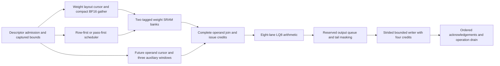

# Accelerator architecture review and optimization priorities

Report date: 2026-09-22. Reviewed implementation: `142416c0`.
Measured comparisons below refer to their recorded source versions, not one
universal baseline. This report supersedes the opening status statements in the
[detailed experiment history](REFINED_ARCHITECTURE_AND_OPTIMIZATION_REPORT.md).

## Assessment

**The architecture has improved substantially, but the project is not yet
qualified as a well-optimized accelerator across all targets.** The strongest
verified improvement comes from changing weight reuse and execution order.
Component tuning alone would not remove the earlier SRAM-capacity cliff.

The implemented G2/LQ8 runtime now supports pass-first execution end to end,
including weight fetch, SRAM replay, operand issue, arithmetic and output writes.
Pass width is independent of arithmetic pipeline depth. These are optional
configurations; their evidence does not qualify every default or deployment.
Runtime schedule adaptation, general activation-object transport, broader format
coverage and current-source integrated physical closure remain open.

## Refined architecture implemented today

| Architectural decision | Earlier behavior | Implemented refinement and purpose |
|---|---|---|
| Reuse unit | Whole weight row must fit 1,024 packed words to replay | A whole-K column pass can replay across output rows; oversized passes stream and the tail is evaluated separately |
| Execution order | Finish a row before advancing to another row | Optional pass-first order finishes a column pass across rows before advancing; preserves each output's sequential FP32 RNE association |
| Pass width | Coupled to adder pipeline depth | Independent `PASS_COLUMNS` and `ADDER_STAGES`; residency can change without changing arithmetic latency |
| External weight fetch | Repeated row fetch when the full weight row exceeds capacity | Compact fetch visits each reusable pass once; logical issue addresses remain continuous across replay |
| Local storage | Two 512x128 weight banks | Reuses these banks without adding SRAM or spilling partial accumulators for resident whole-K passes |
| Operand delivery | Execution depends on weight and auxiliary availability | Future cursor, three auxiliary windows and complete-operand issue credits overlap preparation and execution |
| Result publication | Row-first output order | Writer validates pass/row publication order while deriving the correct strided physical output address |
| Ownership and completion | Work can remain in transport after arithmetic ends | Generation ownership, cancellation and reserved drain persist through pending reads, queued writes and final acknowledgements |

The pass scheduler has a registered elastic tile handoff and retains command
ownership until the final staged tile is accepted. The writer retains four
ordered write credits and descriptor-owned capacity checks. Tail masking and
fault priority remain part of the composed path.

Input-object evidence currently covers BF16 weights with group one, including
strided views. It does not establish general strided activation transport or
all input formats. Lane pass widths 1–7 are supported subject to accumulator
capacity; loaded runner configurations currently expose widths 1, 2 and 3.

## What improved compared with earlier versions

M/N/K denote output rows, output columns and reduction depth. Each comparison is
matched within its own experiment. Percentages are not additive. Weight bytes
and activation fills below are first-operation counters. Campaign cycles include
faults, aborts, recovery and drain; successful-phase cycles measure operation
kick through completion under the modeled memory/stall service. Neither is
whole-model inference latency.

| Matched experiment | Earlier result | Refined result | Interpretation |
|---|---:|---:|---|
| M6/N53/K160, row-first → pass-first, campaign cycles | 708,336 | 203,111 | 71.33% fewer campaign cycles |
| Same experiment, weight bytes / fills | 207,336 / 6,720 | 34,556 / 1,120 | 83.33% lower weight traffic; activation fills rise 2,496 → 2,880 |
| M6/N53/K342, three-column → two-column passes with the same three-stage adder, median successful-phase cycles | 200,641.5 | 67,785.5 | 66.22% fewer cycles through better SRAM residency |
| Same experiment, weight bytes / fills | 404,340 / 12,654 | 73,140 / 2,394 | Activation fills rise 6,156 → 8,208; this cost is included in the measured phase latency |
| M6/N53/K80, row-first → pass-first, campaign cycles | 105,552 | 99,777 | Small benefit when weights already fit; weight bytes stay 17,596 and activation fills double 720 → 1,440 |
| Earlier rolling activation-window experiment, M6/N56/K80 | 1,440 fills; 35,175 campaign cycles | 720 fills; 30,723 cycles | 50% fewer activation fills and 12.66% fewer campaign cycles |
| Writer handoff, eight continuous beats with same-edge acknowledgements | 24 cycles | 17 cycles | Removes handoff bubbles at credit depths 2/4/8 |
| Sinkhorn handoffs with pipelined divider, 36-matrix corpus | 1,129,736 cycles | 1,105,554 cycles | 2.14% fewer cycles; divider pipeline also improves timing at a one-cycle division cost |

The residency mechanism explains the largest gain. At K342, a three-column
pass needs 1,026 packed words, just beyond the 1,024-word capacity; a two-column
pass needs 684 and can replay. No faster adder or larger SRAM is needed for this
change. Conversely, the K80 result shows why pass-first should not be assumed
optimal for all workloads. Its first-success cumulative counter changes only
13,734 → 13,600; the campaign percentage also reflects fault/recovery work.

A subsequent current-source K513 comparison confirms one-column residency:
median successful-phase cycles fall 300,448.5 → 143,226.5 (52.33%) versus
two-column passes, with the same three-stage adder. Weight bytes fall
604,752 → 109,392 while activation fills rise 75%. Both full campaigns pass
after correcting the testbench final-output hold for pass width one. See the
[single-column comparison](../results/rtl/g2_single_column_residency_comparison.json).

The loaded comparisons each check 2,234 exact outputs and 295 writes and
acknowledgements, with reference arithmetic, stalls, abort/restart, generation,
bounds and late-fault checks. The earlier table measurements predate the latest scheduler
extent-selection change; the K513 comparison verifies current sources. Each
remains evidence for its exact recorded sources.

Evidence:
[row/pass comparison](../results/rtl/g2_pass_first_comparison.json),
[independent pass width](../results/rtl/g2_independent_pass_width_comparison.json),
[resident workload](../results/rtl/g2_pass_first_resident_shape_comparison.json),
[oversized-pass fallback](../results/rtl/g2_pass_first_oversized_comparison.json).

## Component optimization and physical status

These are extracted-route ASAP7 TT predictive-PDK results for specific blocks
and configurations. A 1 ns passing route establishes that tested block target;
it does not establish a 1 GHz complete accelerator or measured silicon speed.
Areas are standard-cell area and exclude SRAM unless separately stated.

| Block / configuration | Tested period | Cell area, µm² | Setup / hold slack, ns | Status |
|---|---:|---:|---:|---|
| Compact pass weight transport | 1 ns | 6,324.760 | +0.072825 / +0.032072 | Pass; source and retained-artifact audit recorded |
| Pass-first output writer | 1 ns | 1,682.200 | +0.026359 / +0.050804 | Pass; 12.81% more area than recorded row-first writer |
| Earlier runtime operand service | 1 ns | 3,807.230, plus 5,586 SRAM | +0.009551 / +0.021035 | Pass for its recorded configuration; does not qualify current pass-first integration |
| Sinkhorn with pipelined divider | 2 ns | 3,099.550 | +0.092189 / +0.027670 | Pass for recorded configuration |
| Pass scheduler after split tile increment | 1 ns | 1,429.280 | −0.056566 / +0.051760 | Historical setup failure |
| Pass scheduler with parallel extent selection | 1 ns | 1,380.650 | +0.029694 / +0.051666 | Historical pass before partial-row fix; seven retained artifacts verified |
| Pass scheduler with partial-row ownership fix | 1 ns | 1,393.780 | +0.033745 / +0.051384 | Current-source pass; seven retained artifacts verified |

The scheduler's split tile increment improves setup by 49.26 ps against the
preceding elastic-handoff version, at 0.33% more cell area and no added cycles.
Parallel extent selection replaces serial minima with parallel comparisons
and masked selection. It passes 93 scheduler/bank/runtime tests and 3,664
independent extent cases. Its completed route improves setup by another
86.26 ps and reduces cell area by 3.40% without added cycles. All reported
timing and physical checks pass at the tested 1 ns period.

Existing integrated two- and three-column G2 physical jobs also remain active.
Their launch sources predate subsequent scheduler changes; they can establish
historical integration evidence, not current-source closure. No all-target
closure or activity-qualified energy improvement is claimed.

Evidence: [transport audit](../results/physical_abi3/asap7/bf16_weight_transport/compact_pass_route_audit.json),
[writer audit](../results/physical_abi3/asap7/output_writer_handoff/pass_first_route_audit.json),
[scheduler route audit](../results/physical_abi3/asap7/weight_pass_scheduler/parallel_extent_route_audit.json),
[extent verification](../results/rtl/weight_parallel_extent.json).

## Architectural gaps and optimization targets

1. **Finish schedule policy and qualify the repaired replay contract.** The
   generic 92-word command over a stored 31-word row now passes. Prefetch accepts
   a bounded prefix; the scheduler retains each bank only if its corresponding
   start in the next row is needed. A second bank omitted by the final partial
   row releases during the preceding row. The 172 passing tests include 72
   partial-row cases and final bank-release checks; its scheduler physical
   route passes at 1 ns. Prefetch and integrated qualification remain open. Select row-first/pass-first and pass width from capacity and measured
   service cost. The loaded runner now offers a configuration-time capacity
   heuristic; runtime adaptation and production compiler integration remain open. For workloads exceeding even a
   one-column whole-K pass, evaluate depth tiling with an explicit accumulator
   budget.
2. **Complete actual input transport.** Extend descriptor-driven activation and
   weight paths across required formats, bases, strides, capacities and physical
   bindings. Validate through real dispatch with delayed memory responses.
3. **Balance every target before tuning its modules.** Establish bandwidth,
   storage, queue occupancy, starvation and engine service-rate budgets using
   representative workloads. The table below defines the remaining scope.
4. **Optimize components on measured containing-block paths.** Start with the
   scheduler replay/extent/address path. Pipeline long arithmetic, address and
   control paths where clock improvement outweighs added latency and storage.
   Verify recurrence spacing, stall propagation, reset, faults and ownership.
5. **Qualify each complete configuration.** After the architecture stabilizes,
   rerun current-source loaded workloads and integrated physical implementation.
   Require setup/hold, slew, capacitance, fanout, DRC and antenna closure with
   SRAM and clock-tree costs. Compare traffic, throughput, latency, area and
   activity-based energy; clock period alone is not the objective.

| Target | Architectural optimization target | Required measurement |
|---|---|---|
| Dense decode | Weight bandwidth, bounded prefetch and lane utilization | Bytes per useful output, starvation and latency under memory stalls |
| Dense prefill | Multirow pass/tile reuse and accumulator capacity | Residency boundaries, activation/weight tradeoff and sustained throughput |
| MoE | Expert grouping, dispatch/gather capacity and weight locality | Expert skew, queue occupancy, backpressure and token latency |
| Attention / KV | Cache layout, banking, append/read traffic and reductions | Context-length scaling, bank conflicts and sustained service rates |
| Vector / reduction | Supporting-engine throughput matched to tensor production | Producer/consumer rates including pipeline and transaction latency |
| Distributed execution | Transfer credits and ownership through congestion/drain | Congestion, delayed responses, cancellation and final-write completion |
| Every technology / deployment | Realizable memory and clock organization | Separate configuration coverage, clock/area budgets and integrated closure |

These targets align the design with modern accelerator practice: local data
reuse, overlapped transport, bounded credits and balanced engines. The remaining
work is to demonstrate that balance and physical feasibility across all targets.

The [original partial-row failure](../results/rtl/partial_replay_extent_gap/result.json)
is retained alongside [the fix evidence](../results/rtl/partial_replay_extent_gap/fixed.json). Detailed implementation checkpoints and
source snapshots are in the [input transport plan](G2_DESCRIPTOR_INPUT_TRANSPORT_PLAN.md).

The partial-row repair changes scheduler and prefetch RTL after the recorded
K513 loaded comparisons and scheduler route. Those results now qualify their
retained historical sources. A current-source loaded K514 campaign passes
2,234 exact outputs and 295 write acknowledgements. The repaired scheduler
passes its 1 ns block route; integrated physical requalification is underway. The standalone transport and writer sources are unchanged.

A configuration-time capacity policy is now available through the loaded
runner's `--auto-schedule`. At K343 it selects two-column residency and reduces
median successful-phase cycles 201,466.5 → 68,181.5 against manual three-column
passes, with matching sources and full fault/recovery checks. It selects
row-first for a resident K80 workload. See the
[policy comparison](../results/rtl/g2_capacity_policy_comparison.json). This is
a capacity heuristic, not an automatic runtime controller or a global optimum.
