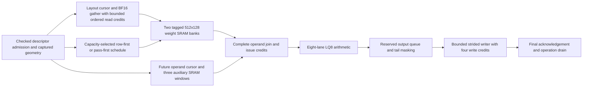

# Accelerator architecture review and optimization priorities

Report date: 2026-09-23. Implementation checkpoint: `93b7a08e` on
`token-path-end-to-end`. This report consolidates the implemented refinements,
measured comparisons and remaining architecture-first work. Each measurement
qualifies its recorded source/configuration; there is no single universal
“previous version.” The [detailed report](REFINED_ARCHITECTURE_AND_OPTIMIZATION_REPORT.md)
retains experiment history; this document supersedes its older status summaries.

## Assessment

**Significant architectural performance problems have been addressed, but the
project is not yet demonstrated to be a well-optimized accelerator across all
targets.** The largest measured gains come from reducing repeated weight
movement and choosing an execution order that fits local memory. These gains
support prioritizing architecture before individual module pipelines.

The strongest evidence covers optional G2/LQ8 runtime execution. Dense/MoE,
attention/KV, vector/reduction and distributed execution still require deployment
mapping, service-rate budgets and integrated qualification. Physical jobs for
current transport, runtime operands, state control and G2 remain in progress;
no final acceptance records were available for those configurations at this
review. A 1 ns target is not yet an achieved whole-accelerator clock.

## Refined architecture implemented today

The schedule selection shown above happens before elaboration in the loaded
runner. It is not a runtime-adaptive hardware controller. Generation ownership,
cancellation and fault drain apply across the transport and execution path.

| Decision | Earlier behavior | Implemented refinement |
|---|---|---|
| Reuse and loop order | Replay requires a whole weight row to fit 1,024 packed words; larger rows repeat fetches | Optional pass-first execution reuses a whole-K column pass across output rows; oversized passes stream and tails are considered separately |
| Pass width | Coupled to adder pipeline depth | Independent `PASS_COLUMNS` and `ADDER_STAGES`; residency can improve without changing arithmetic latency |
| Storage and numerical association | Capacity cliff at the full row | Reuses the same two weight banks; resident whole-K passes add no SRAM or accumulator spill and preserve sequential FP32 RNE association |
| Schedule policy | Manual selection | Configuration-time heuristic chooses the widest supported resident pass up to three columns; retains row-first for one row, resident whole rows, or depth beyond one-column residency |
| Weight read overlap | One outstanding line read | Optional 1–8 ordered read credits within a coordinate; default remains one; no out-of-order response support or next-coordinate prefetch |
| Auxiliary delivery | Repeated preparation and activation fills | Future-address cursor, rolling activation reuse and three auxiliary windows overlap preparation with execution |
| Partial-row replay | A short final row can reject a valid prefix or strand a retained bank | Bounded-prefix acquisition and next-row-aware bank release; no added state, storage or cycles |
| Publication and completion | Row-first publication and handoff bubbles | Pass-aware strided addressing, reserved output capacity, four ordered write credits and ownership through final acknowledgements |
| Optional state control | Combinational 33-bit modulo and admission-dependent payload writes | Sequential modulo with power-of-two bypass; independent free-entry capture and validity count; removes reset from 1,088 payload bits |

BF16 weight-object reads currently cover group one and strided views. General
activation-object transport and broader input-format coverage remain open.
Lane pass widths 1–7 are supported subject to accumulator capacity; the loaded
runner exposes 1/2/3. Optional features do not automatically qualify every
legacy default or production deployment.

## Measured changes compared with earlier versions

M/N/K denote output rows, output columns and reduction depth. Comparisons are
matched within each experiment, and percentages must not be added together.
Campaign cycles include faults, aborts, recovery and drain. Successful-phase
cycles cover operation kick through completion under the modeled external
service. Neither is whole-model inference latency. Traffic figures below are
first-operation counters.

| Matched experiment | Earlier result | Refined result | Demonstrated change |
|---|---:|---:|---|
| M6/N53/K160, row-first → pass-first3, campaign cycles | 708,336 | 203,111 | 71.33% fewer cycles; weight bytes 207,336 → 34,556 |
| K342, pass3 → pass2 with the same three-stage adder, median successful-phase cycles | 200,641.5 | 67,785.5 | 66.22% fewer cycles; weight bytes 404,340 → 73,140 |
| K513, pass2 → pass1, median successful-phase cycles | 300,448.5 | 143,226.5 | 52.33% fewer cycles; weight bytes 604,752 → 109,392 |
| K343, manual pass3 → automatic pass2, median successful-phase cycles | 201,466.5 | 68,181.5 | 66.16% fewer cycles; validates the capacity heuristic at another boundary |
| K344, one → four read credits, same external queue4 and response delay12, median successful-phase cycles | 109,884 | 80,903.5 | 26.37% fewer cycles; same 73,564 weight bytes and 8,256 activation fills |
| Earlier M6/N56/K80 rolling activation-window experiment, campaign cycles | 35,175 | 30,723 | 12.66% fewer cycles; activation fills 1,440 → 720 |
| Writer handoff, eight continuous beats with same-edge acknowledgements | 24 cycles | 17 cycles | Removes handoff bubbles at credit depths 2/4/8 |

At K342, three columns require 1,026 packed words, just beyond the 1,024-word
capacity. Two columns require 684 and can replay. Changing this architectural
choice avoids repeated external traffic without needing a faster adder.
There is a real tradeoff: activation fills rise 6,156 → 8,208. At K513,
one-column passes raise activation fills 12,312 → 21,546. These costs are
included in the measured operation latency.

More concurrency is not universally useful. At K160 with a single-request
external service, increasing credits from one to eight reduces median cycles
only 27,645.5 → 27,587 (0.21%); observed concurrency remains one. This supports
keeping the default at one until workload benefit and physical costs justify
more. The earlier resident K80 comparison also shows that pass-first can
increase activation traffic while providing little successful-operation benefit.

The loaded comparisons check 2,234 exact outputs and 295 writes/acknowledgements
per full campaign, including stalls, bounds, abort/restart and fault recovery.
Credit ownership tests pass Icarus and Verilator at 1/2/4/8 credits, including
errors overlapping held and newly accepted requests. Partial replay has 172
passing tests, including 72 partial-row cases. These are retained verification
results; this report refresh does not rerun RTL regressions.

Evidence: [pass-width comparison](../results/rtl/g2_single_column_residency_comparison.json),
[capacity policy](../results/rtl/g2_capacity_policy_comparison.json),
[read credits](../results/rtl/g2_gather_read_credits_comparison.json),
[service boundaries](../results/rtl/g2_gather_credit_service_boundaries.json),
[ownership checks](../results/rtl/gather_credit_ownership_cross_simulator.json),
[partial replay](../results/rtl/partial_replay_extent_gap/fixed.json).

## High-clock-rate implementation: evidence and limits

The ASAP7 compute/local-control engineering target remains 1 ns (1 GHz).
Higher targets should follow demonstrated system benefit. Supporting engines
need an explicit service budget and implemented clock boundary if they run
slower; a paper clock-domain split does not solve the integration problem.

| Block / configuration | Evidence | Qualification limit |
|---|---|---|
| Partial-replay pass scheduler | Final extracted route at 1 ns; area 1,393.780 µm²; setup +0.033745 ns, hold +0.051384 ns; zero reported timing/physical violations | Scheduler source hashes rechecked against this workspace; does not qualify prefetch or G2 |
| Pass-first output writer | Recorded route at 1 ns; area 1,682.200 µm²; setup +0.026359 ns, hold +0.050804 ns | Block/configuration evidence |
| Sinkhorn with pipelined divider | Recorded route at 2 ns; area 3,099.550 µm²; setup +0.092189 ns, hold +0.027670 ns | Separate engine configuration; not 1 GHz integration |
| Current weight transport, one/four credits | Synthesis available; final route pending | Older passing compact-transport route predates credits and is historical |
| Current runtime operand service and integrated G2 | Physical jobs in progress | No current integrated timing closure claim; state-disabled and state-enabled builds need separate qualification |
| Current state controller | Synthesis and functional checks available; final route pending | Earlier sequential variant still missed timing at intermediate CTS |

Areas above are standard-cell area, excluding SRAM unless separately accounted.
Positive slack is margin at the tested period, not a measured higher Fmax.

The [matched synthesis checkpoint](../results/physical_abi3/asap7/optimization_synthesis_checkpoint/comparison.json)
shows state-controller mapped area 3,919.979 → 3,573.645 → 3,492.799 µm²
for combinational modulo, sequential modulo, then independent payload capture.
These are 8.84% and a further 2.26% reductions. General ring modulo now takes
35 apply cycles instead of one; power-of-two/non-ring paths retain one cycle.
The four inspected frozen deployment bundles contain no STATE descriptors,
so this is not evidence of a speedup for those deployments.

Four-credit transport maps to 5,973.586 µm² versus 6,031.746 µm² for one
credit, despite adding fifteen flops. The 0.96% mapped-area reduction is a
synthesis outcome, not proof that larger queues inherently cost less. Neither
these figures nor removed resets establish routed area or energy savings.

Evidence: [scheduler route audit](../results/physical_abi3/asap7/weight_pass_scheduler/partial_replay_route_audit.json),
[writer route audit](../results/physical_abi3/asap7/output_writer_handoff/pass_first_route_audit.json),
[state verification](../results/rtl/state_payload_capture/verification.json),
[control campaign](../results/rtl/abi3_state_payload_campaign.json).

## Architecture-first optimization targets and execution order

1. **Close the current integrated evidence gap.** Finish existing physical jobs,
   inspect final extracted critical paths, and bind results to source hashes,
   parameters, actual elaborated hierarchy and memory macros. Qualify G2 with
   state disabled/enabled and relevant read-credit counts separately. Historical
   jobs remain useful comparisons, but cannot certify later RTL.
2. **Finish memory organization and scheduling decisions.** Move the runner's
   capacity heuristic into production compiler/runtime selection with measured
   activation, weight and service costs. Evaluate depth tiling when even one
   whole-K column exceeds local capacity, including accumulator storage and
   numerical association. Same-line gather coalescing now has matched functional evidence (checkpoint
   below); finish its containing transport and G2 physical qualification.
3. **Complete descriptor-driven input delivery.** Extend real activation and
   weight transport across required formats, strides and capacity bounds. Size
   queues from sustainable memory service and measured occupancy/starvation.
   Evaluate next-coordinate prefetch only with an explicit ownership/storage
   budget and measured end-to-end benefit.
4. **Balance the remaining accelerator targets.** Use actual deployed operator
   traces and finite resource budgets as listed below. Choose reuse, banking,
   engine replication and clock organization before tuning individual modules.
5. **Optimize every selected component in its containing configuration.** Use
   measured critical paths to choose pipelining, arithmetic restructuring,
   control fanout reduction and storage mapping. Check initiation interval,
   recurrence spacing, latency, backpressure and area together; extra stages
   alone do not establish higher useful throughput.
6. **Validate complete workloads and technologies.** Refresh compiled programs
   and cycle calibration; require exact numerical behavior, final-write drain,
   setup/hold and physical checks. Report latency, throughput, traffic, useful
   utilization, complete area and activity-based energy for each deployment.

| Target | Architectural decision to resolve | Required acceptance evidence |
|---|---|---|
| Dense decode | Weight delivery, local reuse and bounded prefetch | Bytes per useful output, starvation and latency under actual memory stalls |
| Dense prefill | Multirow pass/depth tiling and accumulator capacity | Residency boundaries, activation/weight tradeoff and sustained throughput |
| MoE | Expert grouping, dispatch/gather capacity and locality | Expert skew, queue occupancy, backpressure and token latency |
| Attention / KV | Cache layout/banking, append/read overlap and reduction capacity | Context-length scaling, bank conflicts and sustained service rates |
| Vector / reduction | Service capacity matched to tensor production | Producer/consumer rates, recurrence and complete transaction latency |
| Distributed execution | Injection/receive bandwidth, collective schedules and ownership | Congestion, finite credits, cancellation and final destination completion |
| Every technology / deployment | Implementable memories, clock domains and selected configurations | Separate hierarchy coverage, total area and current-source integrated closure |

This organization follows modern accelerator principles: maximize useful local
reuse, overlap bounded transport with execution, keep repeated scheduling near
engines, and balance compute against memory and supporting services. The
remaining acceptance requirement is to demonstrate those properties across the
supported deployments. The broader optimization task remains unfinished.

The [architecture-first plan](ARCHITECTURE_FIRST_OPTIMIZATION_PLAN.md) defines
full-scope acceptance, and the [transport plan](G2_DESCRIPTOR_INPUT_TRANSPORT_PLAN.md)
retains detailed implementation checkpoints and source snapshots.

## Same-line gather coalescing checkpoint (2026-09-23)

The gather now issues one read for active lanes sharing a 16-byte line and
fills their existing per-lane caches together. Seven registered adjacent-line
boundaries encode alias groups for unsigned monotonic lane addresses, including
sparse masks. This adds seven payload bits, no SRAM and no pipeline cycle.
The ordered read queue retains one lane identity per accepted line; pending
ownership covers all member lanes until the response retires.

Matched M6/N53/K2 loaded campaigns with four read credits, external queue four
and twelve-cycle response delay reduce median successful-phase cycles
704.5 → 570.5 (19.02%). First-operation reads fall 53 → 14 and weight bytes
836 → 212 (74.64% less). Both campaigns check 2,234 exact outputs and 295
writes/acknowledgements. This is a shallow supported contraction, not evidence
of the same gain on larger reduction depths.

Directed zero-stride and stride-two workloads reduce 64 reads to 8 and 16;
at four credits and delay32, cycles fall 661 → 329 and 346 respectively.
Distinct-line traffic retains its prior cycle counts. Tests cover small-stride
alignments, sparse/empty masks, retained replay, truncated final lines,
zero-latency responses, concurrent faults and cancellation. A pre-existing
shallow-workload abort-test issue was reproduced with the retained old gather:
waiting for operand issue before waiting for a pending memory read could allow
output before abort. The fixture now aborts at the first pending object read.
The original bench and both failures are retained.

Evidence: [coalescing comparison](../results/rtl/gather_coalescing/comparison.json).
A new four-credit containing transport route targets 1 ns. Its final physical
cost and timing are pending; earlier credit transport/G2 launches now qualify
their pre-coalescing sources. The all-target architecture and qualification
requirements above remain open.

## Physical cost and sparse-attention control checkpoint

Matched four-credit transport synthesis shows coalescing changes mapped cell
area 5,973.586 → 6,036.849 µm² (+1.06%) and adds exactly seven ordinary
flops. This is an intermediate synthesis cost, not routed area or energy.
See the [retained checkpoint](../results/physical_abi3/asap7/optimization_synthesis_checkpoint/coalescing/comparison.json).

The broader record audit was refreshed after coalescing, before the subsequent
KV-index edit. It finds 57 ASAP7 records with passing routed checks, matching
sources and retained artifacts among 232 routed records. These are records,
not unique modules or proof of elaborated all-target coverage. Historical
snapshots, changed sources and missing artifacts prevent many older records
from qualifying the current design. Its exact scope is in
[current evidence inventory](../results/physical_abi3/current_evidence_after_coalescing.json).

That audit identified a sparse-attention control path worth simplifying:
`ot_a3_attention_kv_index` previously gated publication through a population
count, despite admitting only nonempty prefix masks with trailing padding.
The retained 4 ns route's worst path crosses popcount arithmetic from an index
input to the published lane mask. The implementation now encodes the unique
live-to-padding boundary and checks emptiness with a mask reduction. It
preserves index order, range-error priority, fail-closed outputs and the
one-cycle latency/initiation interval. It adds no pipeline stage.

Both Icarus and Verilator pass 2,618 cases each across SLOTS 1/3/8/64/65/128,
including exhaustive small masks, randomized larger masks, legal prefixes,
range refusals, consecutive requests, idle stability and reset. Every result
is checked against independent mask rules and the retained previous RTL.
Matched 1 ns flow synthesis is essentially area-neutral: 707.611 → 708.661 µm².
The candidate and retained baseline are both in physical implementation at
1 ns; no improved routed clock or area is claimed yet. The old KV-index route
is now historical. Evidence: [KV-index verification](../results/rtl/kv_index_prefix_count/verification.json).

The containing sparse-attention bench also passes all nine transactions
bit-identically against `sparse_attention_bf16_codes`, including multirow and
multiblock operation, duplicate indices, bounds, saturation and counters.
Its source inventory, vectors, compilation and simulation logs are retained
with the KV-index verification. This is functional integration evidence;
physical qualification remains pending.

## State admission lookup checkpoint

The historical sequential-modulo state-controller run has reached global
routing. Its intermediate worst path still misses the 1 ns target by 0.88730 ns,
from a descriptor-table register through selected fields and commit arithmetic
to the commit counter's admission enable. This predates the payload-capture
variant and is not a final routed result.

The next refinement reads cursor, capacity, policy and open state directly
from the descriptor match mask. Encoded slot indices remain for table writes;
the read path avoids encoding a hit and then multiplexing the same table.
Allocation only occurs on a miss, so used descriptor identities are unique.
The non-saturating capacity check also uses the request span directly (or zero
for unstaged policy), keeping the saturating clamp out of a bounds check that
saturating commits bypass. Staged row payload still uses the required clamp.
No request or apply cycles are added.

Cycle equivalence passes 10,800 multi-slot stimulus cycles per simulator in
Icarus and Verilator, including public outputs, stored slot fields, pending
payloads and descriptor uniqueness. The 255-case cursor suite with 34 cancel
positions and the full control-plane campaign pass both simulators too.
Evidence: [parallel admission verification](../results/rtl/state_parallel_admission/verification.json).
A new 1 ns CTS12 physical run is active; synthesis/routed benefit and current
state-enabled integration remain pending. Earlier state jobs continue against
their own launch sources.

The parallel state-admission flow has completed synthesis. At matched 1 ns
CTS12 settings, mapped cell area falls 3,492.799 → 3,448.841 µm² (1.26%),
with unchanged 2,618 reset and 1,088 ordinary flops. Source-bound artifacts are
in the [state synthesis comparison](../results/rtl/state_parallel_admission/synthesis/comparison.json).
This does not establish final routed area, timing or energy. Early floorplan
repair now reports paths ending at the byte-written counter, whose apply path
contains a 32-by-32 row-byte product followed by a 64-bit accumulation. Final
extracted timing must determine whether and how to pipeline that accounting
while preserving transaction completion and statistics semantics.

## Sparse-attention service attribution

The containing sparse-attention bench now exposes optional `+profile` counters.
All nine reference-checked transactions pass, and phase totals reconcile with
2,443,487 active RTL cycles. Softmax exponential wait accounts for 2,248,054
cycles (92.00%), nested within the denominator phase's 2,269,923 cycles.
QK uses 52,882 cycles, AV 38,146, epilogue 76,607 and index delivery 5,760.
These nested counters must not be summed twice. They measure these fixtures,
not whole-model inference or a physically qualified clock.

The full/multiple-block cases spend about 94.6–96.0% in exponential wait;
the single-valid case spends only 0.03%, so the bottleneck is shape dependent.
The architecture priority for substantial sparse-attention latency reduction is
therefore exact exponential service: evaluate reusable certified results and
bounded concurrent service with an explicit area budget, ordered lane result
association, fault semantics and unchanged numerical contracts. Index-path
simplification remains relevant to clock feasibility, but optimizing index
cycles alone cannot materially improve this corpus's latency. Replication is
not yet implemented or assigned an assumed linear speedup.

Evidence and source inventory are retained in
[attention service profile](../results/rtl/attention_service_profile/summary.json).
`tools/summarize_attention_service_profile.py` requires all nine successful
transactions, verifies phase sums and nested wait bounds, and emits the
reproducible attribution. The testbench retains its numerical, memory-bound,
counter and saturation assertions.

## Final historical state-controller route

The sequential-modulo state-controller run has finished at the tested 1 ns
period. Final extracted setup slack is **−0.843259 ns**, with 1,895 setup
violations; hold slack is +0.0560803 ns. Reported DRC, antenna, slew,
capacitance and fanout violations are zero. Routed standard-cell area is
4,409.300 µm². The design is physically clean but **does not meet timing**.
Its worst path starts at `op_descriptor_id[2]` and ends at `count_commits[26]`,
confirming that descriptor admission remains a timing bottleneck after replacing
combinational modulo.

The route predates independent payload capture and parallel admission. Its
controller hash matches the retained `state_payload_capture/before.sv`, not
current RTL. All seven retained artifacts were hash-verified and the historical
source binding is recorded in the
[final route audit](../results/physical_abi3/asap7/state_controller/sequential_modulo_route_audit.json).
The later candidates remain in physical implementation. The report's derived
Fmax is not treated as a tested operating frequency or as closure.

## Exact softmax exponential reuse

The softmax block now retains one successful certified exponential argument
and result (64 payload bits plus validity). Bit-identical lane offsets reuse
that value across lanes and block starts. Errors never install entries; reset
invalidates them. Arithmetic configuration and operation are immutable, so
reuse preserves the exact numerical contract. Logical `exp_count` includes
hits, while the testbench separately counts physical service requests.
`EXP_REUSE=0` removes the cache for matched comparisons.

The nine-case softmax corpus and two refusals pass with reuse enabled and
disabled. Physical exponential evaluations fall 397 → 276 and campaign cycles
1,115,880 → 767,158 (31.25% less). Complete sparse attention still passes all
nine reference-checked transactions: aggregate active cycles improve 2.24%,
with the duplicate-index fixture improving 49,181 → 20,341 (58.64%). Several
full/multiblock fixtures are unchanged. The cache therefore helps repeated
arguments, but does not resolve general exponential throughput demand.
Only the softmax RTL differs between the recorded attention source manifests.

Both Icarus and Verilator also pass directed cache tests for repeated failed
service, successful-result reuse and reset. These protocol tests use a
fault-controllable service; numerical tests use the actual certifying RTL.
Matched containing-softmax synthesis/STA jobs at 1 ns are active for reuse
on/off. No physical area, routed timing or energy benefit is claimed.
Evidence: [reuse comparison](../results/rtl/softmax_exp_reuse/comparison.json).

## Small-divisor storage reuse

The exponential's small-divisor unit now shares one shift register between
unconsumed dividend bits and accumulated quotient bits. Quotient bits enter
below the remaining dividend and cannot reach the consumed high chunk before
the last step. This removes redundant state without changing restoring steps,
quotient, inexact flag or latency.

At WIDTH=163, DIVISOR_BITS=6 and BITS_PER_STEP=10, matched synthesis reduces
cell area 330.457 → 251.898 µm² (23.77%) and sequential cells 500 → 347.
The RTL removes a 170-bit logical register; synthesis already eliminated some
constant stages, so mapped savings are 153 flops. Both ten-step configurations
miss the tested 1 ns pre-layout target; no routed clock claim is made.
A four-bit-per-step candidate is routing at 1 ns. Its additional cycles must
be weighed against clock improvement before changing any consumer default.

Both Icarus and Verilator pass 354 arguments at six step widths (2,124
quotient/inexact comparisons each). The containing softmax's nine reference
cases and two refusals also pass with exactly the prior 767,158 cycles,
276 physical exponential evaluations and 121 cache hits.
Evidence: [shared-shift comparison](../results/rtl/small_divider_shared_shift/comparison.json).
Earlier softmax synthesis jobs bind their pre-shared-shift launch sources;
they remain useful for the isolated cache comparison, not current closure.

The historical KV-index baseline also terminated at pin placement (2,189 pins,
1,976 positions). Its corrected 22%-utilization retry is now active alongside
the matching prefix-count retry. Neither failure is a timing verdict.
