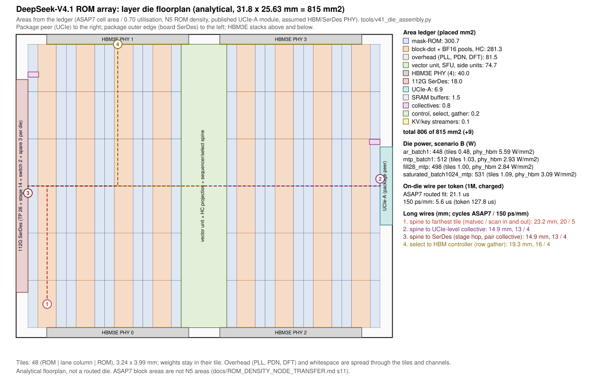

# Does the DeepSeek-V4.1 layer die close? An analytical whole-die assembly

Status: analytical assembly on committed evidence, 2026-09-28. No routed die exists for the V4.1 ROM array, and
nothing in this document is a routed die. It assembles one from the evidence the repository holds: routed
ASAP7 blocks, the memory compilers' macros, the adopted design point, the power scenarios and published PHY
footprints. Each input carries its evidence class, and the gaps are named.

- Model: `tools/v41_die_assembly.py`, recorded in `results/arch/v41_die_assembly.json`, tested by
  `tests/test_v41_die_assembly.py`.
- Figure: `results/arch/figures/v41_die_floorplan.svg` (Figure D-1).
- Inputs: the design point (`results/arch/v41_latency_ladder.json`, top rung with the adopted levers, and the
  R-L9 lane split of `results/arch/v41_lanes.json`); die placement and ROM capacity
  (`results/arch/v41_die_placement.json`); power (`results/arch/power_scenarios.json`,
  `results/arch/arch_budget_v41.json` `power`); routed blocks (`results/physical_abi3/asap7/**`); memory macros
  (`physical/asap7_memory_macros/`); the rack (`results/arch/v41_rack.json`).

**Answer.** The layer die closes **conditionally**. It fits 815 mm² with **9.2 mm²** of whitespace <!-- figure: 9.2 src="results/arch/v41_die_assembly.json#ledger.layer.whitespace_mm2" name="layer die whitespace mm2" -->,
but only if the logic places at 0.68 utilisation or better <!-- figure: 0.68 src="results/arch/v41_die_assembly.json#ledger.sensitivities.break_even_utilisation" name="break-even placement utilisation" -->,
and the MTP lane multiplier (m = 2) is what fills it. Every long wire closes timing once it is pipelined, and
the design point now charges the latency that costs: **21.1 µs** <!-- figure: 21.1 src="results/arch/v41_die_assembly.json#long_wires.by_model.asap7_routed_fit.exposed_us_per_token" name="on-die wire us per token, ASAP7 fit" -->
of the 142.7 µs token at 1M on the ASAP7 routed-wire model, which takes the headline from 8,246 to **7,049** tokens/s per user <!-- figure: 7,049 src="results/arch/v41_die_assembly.json#long_wires.by_model.asap7_routed_fit.rate" name="1M rate with ASAP7 on-die wire charged" -->.
Power closes on **liquid**, the V4.1 baseline cooling (user decision 2026-09-28), at every operating point:
checked at the hottest die, with the adopted stage rebalancing spreading layer 20's index scan over S14, S13 and
S12 (and the ratio-2 scans of layers 2, 8 and 14 in MTP verify passes; `results/arch/v41_stage_rebalance.json`),
scenario B stays within 474.6 W per die everywhere and exceeds the 374.6 W air limit (the sensitivity) everywhere;
scenario A fails everywhere. IR closes only with a denser top grid than the
repository's die grid. The clock closes only as regional trees with mesochronous crossings.

## 1. The problem

The V4.1 ROM array is specified top-down (`docs/ARCH_SPEC_V41.md`), and its adopted design point is priced by
one budget model (`tools/arch_budget_v41.py`). Both check the engines' area against the analytical design's
328.9 mm² N5 compute envelope. Neither has placed the blocks on a die. Four questions stay open until someone
does:

1. **Area.** Do the engines, the ROM that holds 2.71 GB of weights, the buffers, four HBM3E PHYs, the UCIe link
   to the package peer, 45 board SerDes lanes and the overhead fit in one reticle? The envelope comparison used
   standard-cell area. A die is built from placed area.
2. **Long wires.** A 31.8 × 25.6 mm die at 1.087 GHz is many cycles across, and the token's critical path
   crosses it hundreds of times. The budget's dependency graph charged no on-die wire until this study; the
   design point now charges every traversal below on its DAG (`tools/arch_lanes_v41.wire_mutation`).
3. **Power density.** The per-die cooling limits are die averages of shipping packages. The engines, the ROM and
   the PHYs have very different power densities, and the dies do not do equal work: the placement cuts the
   layers at equal ROM bytes, not equal time, so the power check must be the hottest die's.
4. **Power delivery and clock.** What does the die grid drop at the hot spot? Can one clock tree span the die?

## 2. Principles

- **Evidence classes, stated per row.** `routed-closed` (a routed ASAP7 block that met timing at its target),
  `routed-not-closed`, `synthesis-only`, `analytical-macro` (the memory compilers' abstract views on the
  measured ASAP7 bitcell), `derived` (a stated formula on graded constants), `published`, `assumed` and
  `estimate`. "`routed-closed` (unit) × width" means a routed unit replicated to the design point's width. The
  pool itself has not been routed.
- **No ASAP7 area is an N5 area.** The repository's rule is that only ratios transfer between nodes
  (`docs/ROM_DENSITY_NODE_TRANSFER.md` §11, `docs/CHIP_ARCHITECTURE_DESIGN.md` §0). The ledger therefore carries
  ASAP7 areas unscaled, which is conservative, because ASAP7 is a 7 nm-class predictive PDK and N5 is denser.
  The N5 logic-density credit (`technology.json` `nodes.N5.logic_density_vs_n7`, published 1.8×) appears only
  as a labelled sensitivity bound.
- **Weights never cross the die.** The ROM is weight-stationary, so each ROM bank sits beside the lane group
  that consumes it, in a tile. Only activations (a few KB per matvec) and partial sums travel. This is the
  floorplan form of the ROM premise: HC1 reads each weight next to its multiplier.
- **PHYs go where the package puts their partner.** HBM3E sits on the long edges, as B200-class packages
  place their stacks. UCIe faces the package peer on the shared short edge
  (`technology.json` `links.rom_package_ucie`). The board SerDes goes on the package's outer edge.
- **Every inter-region wire is registered at its per-cycle reach.** Nothing crosses a region
  combinationally, so timing closes by construction and the cost appears as latency, which is then counted.

## 3. Method

**Area ledger.**
- **Engines.** These are the design point's pooled widths (`tools/arch_lanes_v41.design_point`: 529,920
  block-dot MACs, 83,328 BF16 MACs, 2,048 light and 512 SFU vector lanes, 5,120 HC lanes and 64 select lanes)
  at the MTP multiplier m = 2, priced at the budget's ASAP7 unit areas. The engine cell area is **248.9 mm²** <!-- figure: 248.9 src="results/arch/v41_die_assembly.json#design_point.engine_cell_area_mm2_m2" name="engine cell area m=2 mm2" -->,
  the ladder's own figure.
- **Side units.** The units the budget prices in time but not in area are added from their routed records:
  the Sinkhorn units, sqrt(softplus), the top-6 select, the quantisers, the indexer's head-sum, key-control and
  tail units, the KV streamers, the 128-lane one-shot collective engine, the package controller, the router,
  the link endpoints and the Engram gather slices.
- **Placed area.** Placed area = cell area / placement utilisation. The utilisation is **0.70** (assumed); the
  repository's routed V4.1 blocks sit at a median of 0.38 on generous small floorplans, and the budgeted
  matrix-engine block at 0.43. The utilisation absorbs routing channels and repeaters, so the analytical
  design's separate 8% interconnect allocation is not charged again.
- **ROM.** The ROM holds the per-die capacity (checkpoint bytes / 188 = 2.714 GB, official precision) with the
  memory compiler's SECDED word (266/256). It is priced at the model's N5 density, 75.0 Mbit/mm² (6T cell
  0.021 µm² × ROM/SRAM 0.33 / array efficiency 0.52, the ROMA-derived quotient of `technology.json`). The
  result is **300.7 mm²** <!-- figure: 300.7 src="results/arch/v41_die_assembly.json#ledger.layer.rom_mm2" name="ROM array mm2" -->.
  Without ECC this is exactly the analytical design's 289.4 mm². Two cross-checks follow in §4.1.
- **SRAM.** The SRAM is priced on this repository's ASAP7 SRAM compiler macros, plus 15% for placement. It
  covers:
  - KV row staging, 338 KB × 2 (prefetch) × 2 (doubled pools);
  - HBM queues (64 beats × 32 pseudo-channels × 4 stacks);
  - vector memory for six MTP positions;
  - chaining buffers;
  - the adopted collective levers' queues.
- **PHYs.**
  - HBM3E: 4 × the `ot_hbm3e_phy` abstract, 12.0 × 0.83 mm, 10 mm² each (assumed, 8-15).
  - UCIe-A: 17 modules of 388.8 × 1,043 µm (published: UCIe Hot Chips 2023 tutorial, electrical summary),
    enough for the 4.2 TB/s per direction the link entry carries.
  - Board SerDes: 45 lanes of 112G PAM4 at 0.40 mm² each. This is **assumed**: no primary area source for an
    LR lane with DSP is committed here.
- **Overhead.** `technology.json` `floorplan.overhead_area_fraction` 0.10 (assumed) covers PLLs, the PDN, DFT,
  the host interface and test.

**Floorplan and wires.**
- **Tiles.** The core between the PHY strips holds a central spine (the vector unit, the HC projection, the
  sequencer and the select) and 48 tiles. Each tile is ROM | lane column | ROM, 3.24 × 3.99 mm.
- **Collective engines.** These sit at the two link edges: the in-package level at the UCIe edge and the
  package-pair level at the SerDes edge.
- **Wire models.** Wires are priced two ways:
  - the ASAP7 buffered-wire fit to the routed express-link records
    (`tools/chip_assembly/floorplans.wire_delay_model`: 0.60 ps/µm plus 190 ps of flop overhead, a reach of
    1.22 mm per 920 ps cycle);
  - `technology.json` `latency.global_wire_delay_s_per_mm` (150 ps/mm, assumed, 100-250; a reach of 4.87 mm).
- **Traversals on the DAG.** Each traversal class (`TRAVERSALS` in the tool) is registered at its per-cycle
  reach and charged as latency on the edges of the DAG nodes that make it (`wire_in` / `wire_out`,
  `tools/decode_critical_path.Graph.solve`, category `on_die_wire`): the operand broadcast from the spine to
  the farthest tile and the result's return on every matvec and KV/index scan (the pooled lanes live in the
  tiles); half the spine's length each way on every reduction and into every select; the path to the
  collective engine at the package edge and back on every collective; the SerDes edge to and from the spine
  on every stage hop; and the select-to-controller request of every data-dependent row gather. Two classes
  overlap with compute and are not charged: ROM to lane inside a tile, and the static-address KV and
  index-key rows, both issued ahead of the activation. The DAG then decides what is exposed: on the design
  point every charged traversal is on the critical path at 1M (281 matvecs, 48 scans, 164 reductions, 96
  selects, 177 collectives, 29 hops, 8 gathers), so nothing overlaps.

**Power, IR and clock.**
- **Power map.** The map takes `power_scenarios.json`'s die dynamic energy per component, per token, for the
  design point at 1M, times the hottest die's share and rate. It spreads that over the floorplan's regions:
  - MAC to the tiles;
  - ROM read to the ROM;
  - stream work to the spine;
  - the HBM die share (controller + PHY + I/O, 10.19 pJ/b) to the HBM PHY strips, which is the pessimistic
    placement.

  Static power is re-priced on the ledger's areas at 1.087 GHz (leakage 0.10 W/mm² of logic, clock
  8.5 × 10⁻¹¹ J/mm²/cycle, ungated). The always-on SerDes (30.6 W), UCIe idle and HBM idle come from the budget.
- **IR.** The IR drop is the closed-form drop of a uniformly loaded sheet fed by a square bump array: the disk
  approximation of a bump cell, checked against numerical integration in the test. It is computed on the
  repository's die grid (`tools/chip_assembly/tcl/pdn_die.tcl`: M8/M9 stripes 1.0 µm wide at a 40 µm pitch per
  net) with the ASAP7 layer resistances (ORFS `setRC.tcl`: 0.34/0.36 Ω/□). Supply is VDD 0.7 V (the ASAP7 TT
  library). One micro-bump in four is VDD, at the 45 µm UCIe-A bump pitch. The budget is 5% of VDD.
- **Clock.** The clock plan prices a global H-tree to 64 region roots on the same wire models. Skew is scaled
  by the routed matrix engine's measured skew/insertion ratio (96/538 ps).

## 4. Results

### 4.1 Area ledger (layer die, placed mm², ASAP7 unscaled)

| block | cell mm² | placed mm² | evidence |
|---|---:|---:|---|
| block-dot pool (FP8/FP4 weights + FP4 indexer), 1,059,840 MACs | 83.2 | 118.8 | routed-closed unit × width (`ot_hdc_blockdot`, 1,196 MHz) |
| BF16 pool (BF16 weights, wo_a, attention), 166,656 MACs | 84.9 | 121.3 | routed-closed unit × width (BF16 MAC, 1,040 MHz) |
| pool operand muxes (10%) | 16.8 | 24.0 | estimate |
| HC projection, 10,240 FP32 lanes | 12.0 | 17.1 | routed-not-closed units |
| vector unit, light lanes (4,096) | 16.7 | 23.9 | estimate (no routed light lane) |
| vector unit, SFU lanes (1,024) | 35.3 | 50.4 | synthesis-only |
| 16 side units (select, Sinkhorn, softplus, quantisers, indexer, KV streamers, one-shot, controllers, router, link, Engram gather) | 1.2 | 1.7 | mostly routed-closed; one-shot, KV streamer, Sinkhorn, select, link not closed |
| SRAM (2.7 MB of buffers + collective queues) | 1.4 | 1.5 | analytical-macro; queues estimate |
| mask-ROM array, 2.714 GB + SECDED | 300.7 | 300.7 | derived (model density) |
| HBM3E PHY + controller, 4 | 40.0 | 40.0 | assumed (abstract) |
| UCIe-A, 17 × x64 modules | 6.9 | 6.9 | published module |
| 112G SerDes, 45 lanes | 18.0 | 18.0 | assumed |
| overhead (PLL, PDN, DFT, host, test) | | 81.5 | assumed |
| **total** | | **805.8** <!-- figure: 805.8 src="results/arch/v41_die_assembly.json#ledger.layer.placed_total_mm2" name="layer die placed total mm2" --> | of 815 |

By evidence class, the placed area splits as follows:

| evidence class | placed mm² |
|---|---:|
| derived (the ROM) | 300.7 |
| routed-closed units replicated | 240.5 |
| assumed (PHYs and overhead) | 139.5 |
| synthesis-only | 50.4 |
| estimate | 48.4 |
| routed-not-closed | 18.3 |
| published | 6.9 |
| analytical-macro | 1.0 |

**The head die** is the same die plus the rack's draft-window SRAM block (1.87 mm², rack C10). Its engines are
unchanged, because the wide-head lever's 4 × spec BF16 engine equals the design point's m = 2 BF16 pool. It
places **807.7 mm²** <!-- figure: 807.7 src="results/arch/v41_die_assembly.json#ledger.head.placed_total_mm2" name="head die placed total mm2" -->,
with 7.3 mm² to spare.

**Against the analytical split.**
- The analytical design allots 289.4 mm² of ROM, 328.9 of compute, 65.2 of interconnect, 50.0 of HBM PHY (five
  stacks) and 81.5 of overhead.
- The ledger's logic places 357 mm², which is above the 328.9 compute envelope. With the SRAM, UCIe and SerDes
  it reaches 384 mm², against the analytical 394 of compute plus interconnect.
- The earlier "~246 mm² inside the 328.9 mm² envelope" statement compared cell area with a placed-area
  envelope. At any achievable utilisation the m = 2 engines exceed the envelope. The die still closes, because
  the four-stack PHY and the absent separate interconnect allocation give the area back.

**What moves the closure** (whitespace, mm²; `ledger.sensitivities`):

| change | whitespace |
|---|---:|
| as assumed (0.70 utilisation, m = 2) | +9.2 |
| utilisation 0.60 | −50.3 |
| utilisation 0.37 (the median of the routed V4.1 blocks) | −309.3 |
| utilisation 0.80 | +53.9 |
| MTP lane multiplier m = 1 | **+187.0** <!-- figure: 187.0 src="results/arch/v41_die_assembly.json#ledger.sensitivities.m1_core.whitespace_mm2" name="whitespace at m=1" --> |
| N5 logic credit 1.8× (a bound, not an N5 area) | +167.9 <!-- figure: 167.9 src="results/arch/v41_die_assembly.json#ledger.sensitivities.n5_logic_credit.whitespace_mm2" name="whitespace with N5 logic credit" --> |
| ROM at the ASAP7 ROM compiler's density (153.6 Mbit/mm², analytical macro) | +163.0 |
| SerDes lane 0.25 / 0.60 mm² | +16.0 / +0.2 |
| HBM3E PHY 8 / 15 mm² per stack | +17.2 / −10.8 |

**The ROM against the only shipping reference.** Taalas HC1 stores Llama-3.1-8B (3.5 bits per weight,
`technology.json`, assumed 3-6) on an 815 mm² die: 4.31 MB of weights per mm² of whole die. This die stores
3.33. The ROM premise is therefore not more aggressive than the shipping part.

### 4.2 Floorplan



*Figure D-1.* The die is 31.8 × 25.63 mm. HBM3E PHYs sit on both long edges, with 48 mm of beachfront, 42% of
the perimeter (the shipping ceiling is 60%). UCIe (6.6 mm of shoreline) faces the package peer. The 18 mm
SerDes strip is on the package's outer edge. There are 48 tiles, each ROM | lane column | ROM, around a
3.86 mm vector/control spine. The dashed lines are the critical path's longest traversals.

### 4.3 Long wires against the 1.087 GHz clock

| traversal (on-path nodes at 1M) | length | cycles, ASAP7 fit / 150 ps/mm | exposed µs per token, ASAP7 fit |
|---|---:|---:|---:|
| ROM bank → its tile's lanes (static addresses: overlaps, not charged) | 3.6 mm | 3 / 1 | — |
| HBM PHY → tiles, static KV rows and index keys (prefetched: overlaps, not charged) | 16.1 mm | 14 / 4 | — |
| spine ↔ farthest tile, operand in and result out (281 matvecs) | 23.2 mm | 20 / 5 each way | 10.34 |
| the same for KV and index scans (48) | 23.2 mm | 20 / 5 each way | 1.77 |
| spine reduction to its root and back (164) | 12.0 mm | 10 / 3 each way | 3.02 |
| spine lanes → select (96) | 12.0 mm | 10 / 3 | 0.88 |
| spine ↔ collective engine at the UCIe / SerDes edge (177) | 14.9 mm | 13 / 4 each way | 4.23 |
| SerDes edge ↔ spine, stage hop (29) | 14.9 mm | 13 / 4 each way | 0.69 |
| select → HBM controller, row-gather request (8) | 19.3 mm | 16 / 4 | 0.12 |
| **total** | | | **21.05** |

- **What timing closure costs.** Registered at its reach, every path closes timing, and the cost is latency,
  now charged in the design point: 21.1 µs of the 142.7 µs token at 1M (14.8%) on the ASAP7 routed-wire model,
  5.6 µs <!-- figure: 5.6 src="results/arch/v41_die_assembly.json#long_wires.by_model.tech_global_wire.exposed_us_per_token" name="on-die wire us per token, 150 ps/mm" -->
  on the 150 ps/mm technology entry and 8.9 µs at its 250 ps/mm high end.
- **Effect on the headline.** The 1M per-user rate is 7,049 tokens/s (15,890 with MTP at the measured
  τ = 3.65) with the wire on the ASAP7 fit, the headline, and 7,882 <!-- figure: 7,882 src="results/arch/v41_die_assembly.json#long_wires.by_model.tech_global_wire.rate" name="1M rate at 150 ps/mm on-die wire" -->
  on 150 ps/mm (7,682 at 250 ps/mm); without any on-die wire it would be 8,246
  (`results/arch/v41_lanes.json` `on_die_wire`). At 200K the same wire takes 8,568 to 7,286.
- **What overlaps.** Nothing that is charged: the DAG exposes every charged traversal (exposed = charged in
  full, 21.05 µs), because the token is one dependency chain and every traversal sits on an edge of it. Only
  the two static-address streams overlap, and they are not charged.
- **The earlier estimate.** The first version of this study charged a narrower set in full (matvec in/out,
  collectives, KV rows once, hops: 16.0 µs, 7,237 tokens/s). The DAG adds the scans' operand broadcast and the
  spine's own reductions and selects, which that estimate omitted.
- **Which model is closer.** The ASAP7 fit is ASAP7's thin M2-M7 routing, measured only up to 3 mm; a
  production die routes these buses on thick top metal, so the 150 ps/mm entry is the optimistic bracket.
  The levers are vector sub-spines per half-die and collective engines at the tile rows.

### 4.4 Power map and hot spots (hottest layer die, 1M)

Every point is the **hottest die** (`tools/power_scenarios.v41_hottest_die`): each layer die's own operators at
its die share, in the placement's stages, with the adopted stage rebalancing's scan shares on the helper stages. At
1M the hottest die is a die of S9, which holds layer 14's uncapped index scan (layer 20's, which made S14 the
hottest at 6.9× the mean before the rebalancing, is now split over S14, S13 and S12), except at the fill and the
saturated batch with MTP (S14) and at batch 1 with MTP, where it is a head die (the draft, priced from the
drafter's own ops). The saturated points run the 866 users the HBM holds after the 0.9 capacity reserve.

| point | hottest die | scenario B die W | tiles W/mm² | hottest region W/mm² | cooling (liquid baseline; air a sensitivity) | scenario A die W | A tiles W/mm² |
|---|---|---:|---:|---:|---|---:|---:|
| batch 1 | S9 | 382 | 0.45 | HBM PHY 4.09 | liquid | 2,044 | 6.36 |
| batch 1 + MTP | head | 454 | 1.24 | SerDes PHY 1.89 | liquid | 5,166 | 17.70 |
| 28-user fill | S9 | 382 | 0.45 | HBM PHY 4.09 | liquid | 2,044 | 6.36 |
| fill + MTP | S14 | 425 | 0.84 | SerDes PHY 2.42 | liquid | 4,643 | 15.84 |
| saturated (866 users) | S9 | 459 | 0.55 | HBM PHY 5.47 | liquid | 2,757 | 8.72 |
| saturated + MTP | S14 | **470** <!-- figure: 470 src="results/arch/v41_die_assembly.json#power.points.B_proposed_production.saturated_batch1024_mtp.die_w" name="scenario B worst die W" --> | 0.97 | SerDes PHY 2.53 | liquid | 5,521 | 18.93 |

The die limits are 474.6 W (liquid, the V4.1 baseline) and 374.6 W (air, the sensitivity): a two-die shipping
package's rating less its stacks, per die. The only published per-mm² reference is H200's die average, 0.675 W/mm².

- **How this map compares with the scenarios.** The map runs 1.4 W below `power_scenarios`' hottest-die figure
  at every point (it re-prices the clock at 1.087 GHz). Before this change both were the average over the
  layer dies (the earlier 218-350 W); the array average is still 192-286 W.
- **Scenario B**, the proposed production MAC energies:
  - **Liquid at every point, air at none at 1M.** With the adopted stage rebalancing the hottest die fits the
    474.6 W liquid limit at every operating point from 200K to 1M (`results/arch/v41_stage_rebalance.json`
    `cooling_sweep`); before it, the stage holding layer 20's scan exceeded liquid with MTP and at saturation
    (490-533 W). The 374.6 W air limit, the sensitivity, is exceeded at every 1M point.
  - **The engine tiles stay near 1 W/mm²** at every point.
  - **The PHY strips are the hot spots: 1.9-5.5 W/mm².** The HBM figure places the die's whole share of the HBM
    path energy (10.19 pJ/b) on the PHY macros, the pessimistic placement, and on these dies that share is the
    index scan's; with MTP the SerDes PHY (the always-on lanes) is the hottest region.
  - No committed source gives a sustainable hot-spot flux (`configs/hardware/power_scenarios.json`: "none
    found"), so the flux is flagged, not failed; the die totals fail.
- **Scenario A**, the measured ASAP7 MAC at 11.5 pJ, **fails at every point** (the 1M rate is capped at 1,211
  tokens/s with liquid and 839 with air).

### 4.5 IR drop of the die grid

| scenario B point | tile current density | drop (VDD + VSS) | budget | M8/M9 coverage per net to close |
|---|---:|---:|---:|---:|
| batch 1 | 0.64 A/mm² | 26 mV | 35 mV | 1.9% |
| batch 1 + MTP (head die) | 1.77 A/mm² | 72 mV | 35 mV | 5.2% |
| saturated + MTP | 1.39 A/mm² | **57 mV** <!-- figure: 57 src="results/arch/v41_die_assembly.json#ir_drop.points.B_proposed_production.saturated_batch1024_mtp.drop_mv" name="scenario B saturated + MTP IR drop mV" --> | 35 mV | 4.1% |

- **What closes it.** The repository's die grid gives each net 2.5% of M8 and M9. On ASAP7's thin top metals
  (13.9 Ω/□ effective per net) it fails every MTP point of the hottest die. A 5.2% grid closes it.
- **Current per bump.** Per VDD bump the current is 14 mA at the worst point, and the die draws about 650 A.
- **Scenario A** drops 372-1,107 mV, which no grid fixes.
- **Scope.** A production N5 stack's thick top metal and redistribution layer lower the sheet resistance by an
  order of magnitude, so this is an ASAP7 statement, not an N5 one.
- **Not modelled.** The local M1-M6 grid, the interposer and package, and transient droop are not modelled.
  The droop is the first-order PDN risk of a design whose stage clock gating wakes a whole die in one step.

### 4.6 Clock distribution

- **The global tree.** A global H-tree to 64 region roots is 291 mm of wire, and its root-to-leaf path is
  25.1 mm. Its insertion is 15.6 ns on the ASAP7 fit and 4.3 ns on 150 ps/mm, plus the 538 ps of local tree
  the routed matrix engine measured.
- **Skew.** At that block's measured skew/insertion ratio (0.18), one tree would carry 2.79 ns or **769 ps** <!-- figure: 769 src="results/arch/v41_die_assembly.json#clock.by_wire_model.tech_global_wire.skew_ps_if_one_tree" name="one-tree skew ps at 150 ps/mm" -->
  of skew against a 920 ps period.
- **The plan.** One PLL per die, from the tray reference. A global tree runs to the region roots, and each tile,
  the spine and each PHY region has its own balanced local tree with an integrated clock gate for stage
  gating. Region-to-region paths are the pipelined long wires of §4.3, timed mesochronously through a small
  bisynchronous FIFO or a per-region skew adjust, so global skew never sits on a single-cycle path. The rack
  already runs every link plesiochronously (`results/rtl/v41_link_cdc_campaign.json`, K3 PASS).
- **Clock power.** The global tree's wire power is small (0.05 W). Clock power sits in the leaves: the
  repository's clock constant charges 51.7 W on the ledger's area ungated, which is why idle-stage gating is a
  requirement (`docs/ARCH_SPEC_V41.md` §6 item 12).

## 5. Verdict

| criterion | verdict | condition |
|---|---|---|
| area | conditional | placement utilisation ≥ 0.68 at m = 2 (assumed 0.70); m = 1 or the N5 credit leave > 150 mm² |
| long-wire timing | closes by pipelining; latency charged | 21.1 µs per 1M token in the headline (ASAP7 fit; 5.6 µs at 150 ps/mm) |
| power | closes on liquid (the V4.1 baseline) | hottest die, B, with the adopted stage rebalancing: within liquid at every point (worst 470 W vs 474.6 liquid), over the 374.6 W air sensitivity at every 1M point; A fails |
| IR | closes with a denser grid | 72 mV vs 35 mV at 2.5% M8/M9 coverage (batch 1 + MTP, a head die); 5.2% closes it |
| clock | regional trees only | one tree's skew is 0.8-3.0 periods |

**Top risks**, in order of consequence:

1. **The hottest die.** The index-scan stages carry several times the mean layer die's work. The adopted stage
   rebalancing spreads layer 20's scan over S14, S13 and S12 (and, in MTP verify passes, the ratio-2 scans of
   layers 2, 8 and 14 to the stage upstream of each), which keeps the hottest die within the liquid limit at
   every point, with 3-4 W of margin at the tightest (saturated with MTP at 1M, 471 W on `power_scenarios`), and
   no longer lets S14 bind the filled pipeline; air is exceeded at every 1M point.
2. **Area rests on one assumed number.** At 0.60 utilisation the die is 50 mm² over, and at the routed blocks'
   median it is 309 mm² over. The MTP lane multiplier fills the die. This is the first physical fact the next
   route must establish.
3. **On-die wire is 15% of the token**, charged in the headline on a wire model fitted only to 3 mm; the matvec
   broadcasts and returns carry half of it.
4. **The PHY strips are the hot spots.** Their flux rests on a pessimistic HBM energy placement.
5. **Scenario A.** If the lane energy stays at the measured ASAP7 11.5 pJ per MAC, no cooling class carries the
   die.
6. **PDN.** The repository's die grid is too thin at the MTP points, and the stage-gating wake-up transient is
   unanalysed.
7. **Evidence.** 139.5 mm² of the die is assumed (PHYs and overhead), and 98.8 mm² is estimate or synthesis-only
   (the vector unit and the pool muxes).

## 6. Missing hierarchical routes and next physical steps

Missing routes, the prerequisites of rack step K2 (layer-die and head-die P&R):

| block | status |
|---|---|
| block-dot tile with its ROM banks and read network (the die's repeated unit) | one `wgt_qtile` closed at 1,090 MHz; no tile with ROM exists |
| BF16 pool tile | only the single MAC is routed |
| vector unit (light and SFU lanes, reducer, chaining) | light lane unrouted; SFU lane synthesis only |
| HC projection block | boundary characterisation only |
| 4 × 16 select | `tselect_w16` 1,087 MHz, not closed |
| one-shot die engine (`ot_rom_oneshot_die_px`) | being routed on claude/px-physical; d32 1,006 MHz, not closed |
| KV/key streamer | 1,128 MHz, not closed |
| Sinkhorn | 152 MHz; needs a multicycle-constrained route |
| pipelined long wires (5-25 mm) | express-link records reach only 3 mm |
| V4.1 tile, spine and die assembly (`tools/chip_assembly` levels 2-3) | no V4.1 tile or die: the wrappers around the superseded core were retired, and the build is rejected until `ot_hdc_core_v41x` is integrated; the flow is reusable |
| ROM and SRAM macros, HBM3E PHY | abstract views only |
| PDN / IR sign-off | none has run on any design here |

Next steps, in order:

1. Route one block-dot tile with its ROM banks at 1.087 GHz. This fixes the utilisation that decides area.
2. Route a 5-10 mm pipelined express link on M8/M9 and re-fit the wire model.
3. Recover the charged traversals (now in the design point): replicated vector sub-spines per half-die and
   collective engines placed at the tile rows; re-place the index-scan layers by time to cool the hottest die.
4. Decide m = 2 against the die area.
5. Integrate `ot_hdc_core_v41x` into a V4.1 tile and die, then run them through `tools/chip_assembly` and a die-level PDN analysis on the abstracts.
6. Source a 112G SerDes lane area and an HBM3E PHY footprint.

## 7. Proposed atlas additions (partly made)

- A layer-die panel: Figure D-1 with the ledger by group and evidence class.
- The on-die wire term per token (ASAP7 fit and 150 ps/mm), beside the collective and hop terms: made (atlas
  §8.4, §8.5 and the token time budget of Figure 6-4).
- The die power map for scenarios A and B, with the tile and PHY-strip fluxes and the H200 die-average
  reference.
- The m = 2 area caveat: engine cell area against placed area at the stated utilisation.
- The missing-routes table as the prerequisites of K2.

## Appendix A. Reproduction and limits

```bash
python3 tools/v41_die_assembly.py
python3 -m pytest -q tests/test_v41_die_assembly.py
```

The tool imports the budget, utilisation, ladder and lanes models and rebuilds the design point in about two
seconds. It reads the ASAP7 layer resistances from the ORFS platform when present and otherwise uses the same
values committed in the tool.

Limits:
- **Not a routed die.** The floorplan is a region model: tiles are drawn at the core's geometry, and the
  overhead and whitespace are spread through them.
- **Engine areas.** The engine areas replicate routed units and do not include pool-level wiring beyond the
  utilisation.
- **The hottest die.** Power is the hottest layer die at 1M (`power_scenarios.v41_hottest_die`). The batch-1
  points are its power over its active window, the longer of the pass over 28 stages and its stage's busy time.
- **Assumed constants.** The IR and clock figures are ASAP7-derived. The bump allocation, contact radius, IR
  budget, repeater factor, SerDes lane area and placement utilisation are assumed, and graded in the record's
  `constants`.
