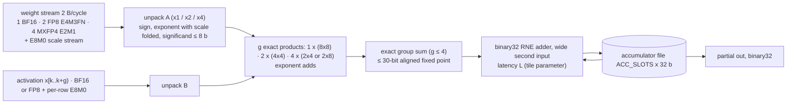
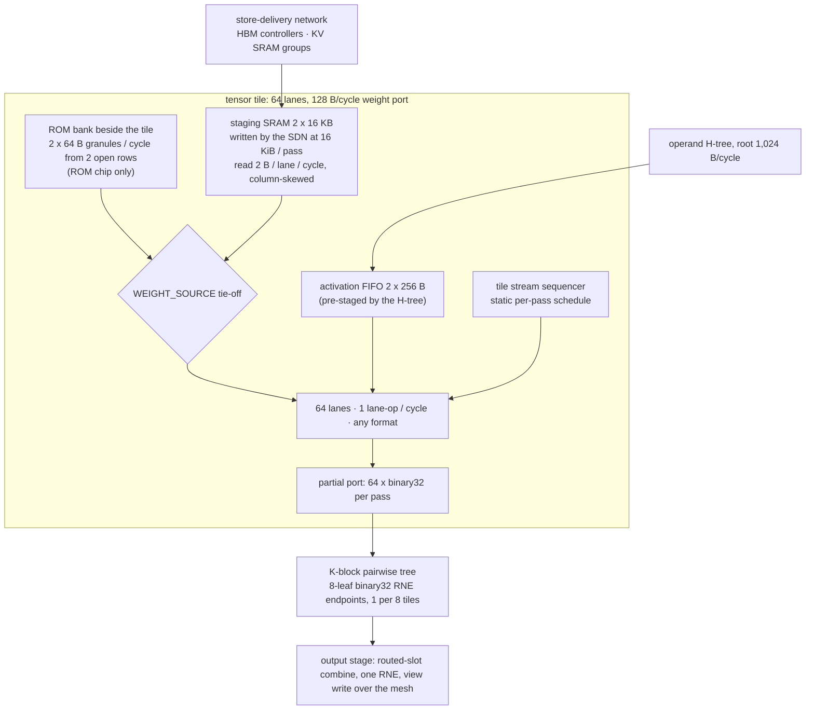
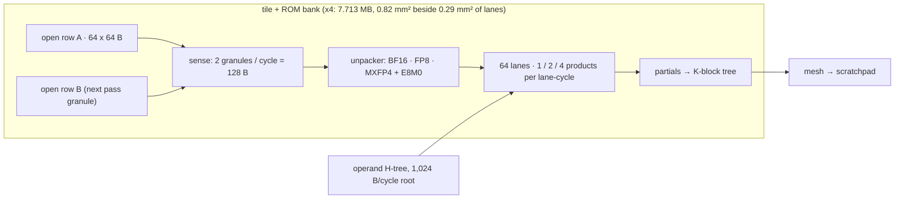
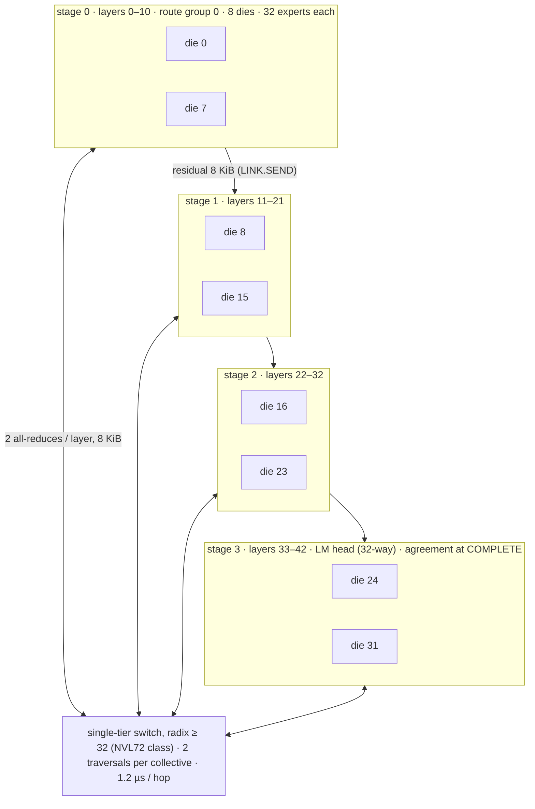
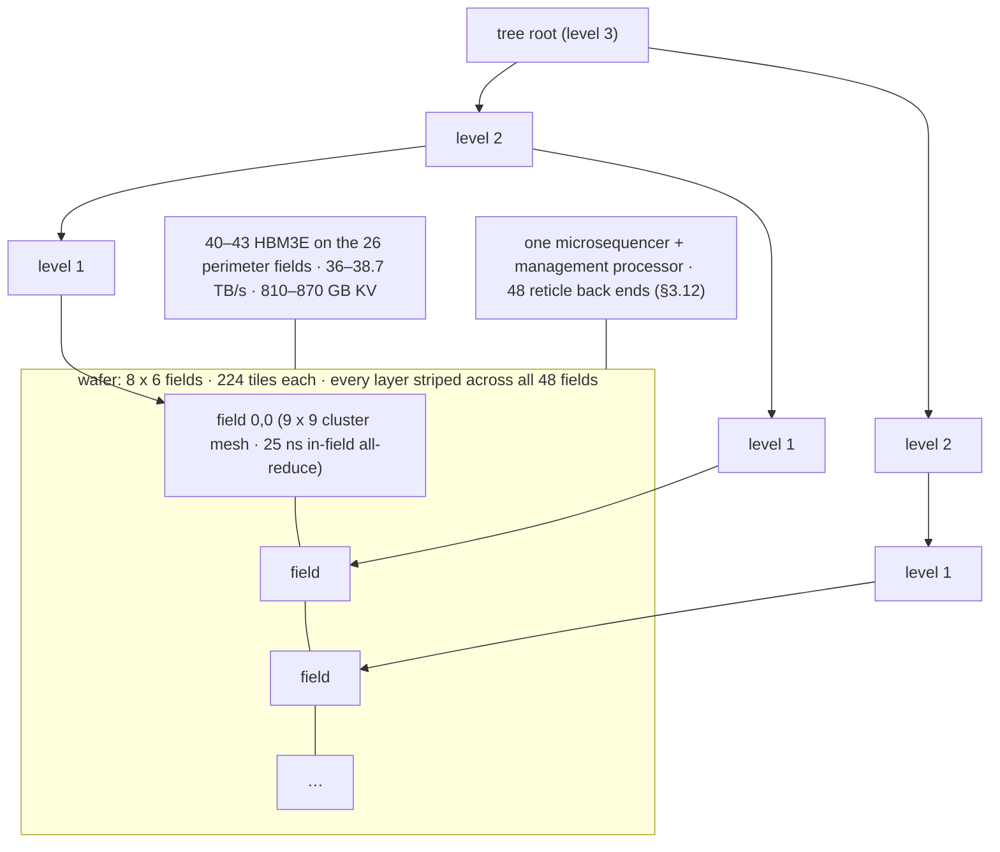
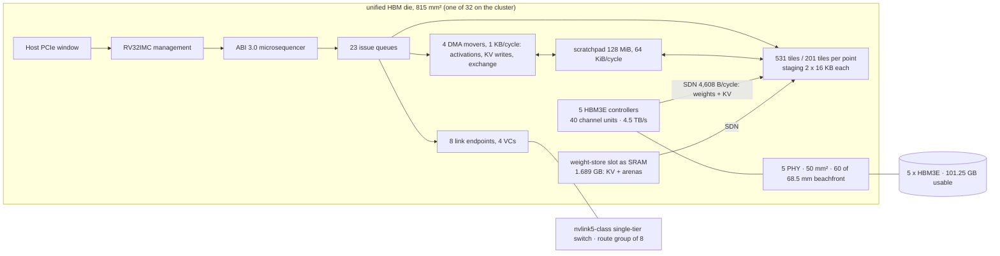
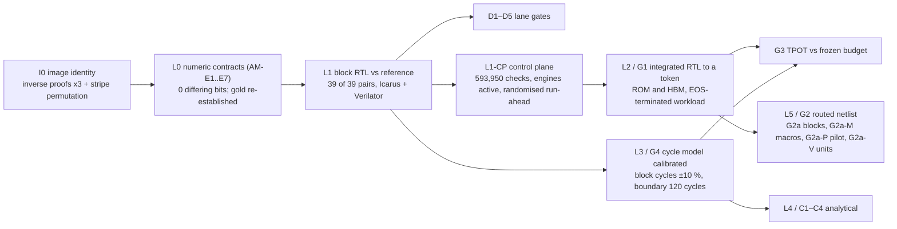

# OpenTallas Chip Architecture Design

*ROM-weight and HBM-weight accelerators for Qwen3-8B, DeepSeek-V4-Flash and DeepSeek-V4-Pro on one control plane, one engine set, one memory system and one network, drivable by ABI 3.0 with named amendments.*

Status: design document, integrated from five designed sections and five reviews (Appendix A lists every finding and its disposition). No RTL follows from this document until it is approved. It is written so that an RTL engineer can start tomorrow morning from §11.6 without this conversation.

---

## 0. Purpose, scope, and what this document may and may not claim

**Purpose.** The shipped OpenTallas design is four to five orders of magnitude below its 10,000 tok/s north star (`docs/PERFORMANCE_DESIGN_POSTMORTEM.md`), has no synthesisable top, one MAC at 0.2 MAC/cycle, and 26 of 37 issued opcode pairs with no datapath (`docs/OPENTALLAS_REDESIGN_PLAN.md`). This document is the architecture that replaces it: the datapath, the control path from Kernel IR v3 through ABI 3.0 `program.bin`/`descriptors.bin` to microcode and engines, the weight stores, the KV stores, the networks between dies, reticle fields and wafers, and the plan by which it is implemented as routable tiles under the hierarchical ORFS flow and validated on Icarus 11 and Verilator 5.050.

**Scope.** Three models (`configs/models/*.json`), two weight stores, and five machine shapes:

| target | store | shape | analytical anchor (`results/roofline/n5_vs_b200/analytical.json`) |
| --- | --- | --- | --- |
| Qwen3-8B | ROM | 4 dies tensor-parallel (derived anchor); 5 dies pipeline (recommended) | `ROM-N5-native-HBMKV-array-tensor-x4` 3,911.3 tok/s; `ROM-N5-native-SRAMKV-array-pipeline-x5-romfill` 4,941.0 tok/s |
| Qwen3-8B | HBM | 1 unified chip; 4 chips (iso-area twin); 5 chips (twin of the recommendation) | `b200_sxm-x2-tensor` 693.6 tok/s (external calibration) |
| DeepSeek-V4-Flash | ROM | 32-die array (hybrid 4 x 8); 30-die SRAM-KV variant; one 48-field wafer | `...array-hybrid-x32` 2,627.4 per user / 10,509.5 aggregate; `...wafer-tensor-x1` 4,707.9 |
| DeepSeek-V4-Flash | HBM | 32 unified chips | `b200_sxm-x16-hybrid` 1,499.3 (iso-area of ROM x32) |
| DeepSeek-V4-Pro | ROM / HBM | 4 wafers pipeline (this design); 32 or 48 unified HBM chips | `...wafer-hybrid-x3` 2,648.8 (the study's 3-wafer point does not fit the stitched grid, §5.5) |

**What this document may claim.** Every number carries one of the five grades of `configs/hardware/technology.json#grade_definitions` — `measured`, `published`, `executed`, `derived`, `assumed` — and a source. The N5 machine is the derived one (`results/derived/qwen3_n5_design_target_machine_pair.json`: 33,968 MAC/cycle per 815 mm² device at 1 GHz). sky130hd and asap7 are implementation vehicles: the same architecture at a routable tile count, reporting per-MAC area and per-MAC period as the node-portable figures. No sky130/asap7 figure is scaled to N5 (METHODOLOGY §9). Nothing derived here is called characterized.

**What it may not claim.** (1) *As adopted on 2026-09-04:* no control-plane block, no pipelined lane, no binary32 pairwise endpoint, no 512-bit router and no vehicle memory macro had been synthesised or routed. *Revised 2026-09-05:* the pipelined lane and LQ8 are routed at asap7 (neither closed; §4.2, §11.1) and the lane at sky130hd; the microsequencer front end is routed and **closed at 4.4 ns and 2.2 ns** at asap7 (`results/physical_abi3/asap7/a3_microsequencer/pnr.json`, §11.1) — narrower than this document's CP-FE row, and alone; no pairwise endpoint, router, memory macro or assembled netlist exists, and gate G2 is red. Every remaining cell count in §8 and §11 is `assumed` from executed seeds and becomes `executed` only under the gates named in §11.5. (2) The only executed binary32 RNE adder evidence in the repository is a sky130hd synthesis probe at 59.57 ns that did not meet 30 ns (`results/physical_abi3/sky130hd/a3_numeric_probes/fp32_add.json`); the single-cycle accumulate at 1 GHz N5 is `assumed`, and the vehicles will run at an accumulator latency L ≥ 2 fixed by the first routed lane (§4.2). (3) Every tok/s figure in this document is a derived band computed by the analytical study's own step rule from the design's own engine arithmetic; where the design's arithmetic gives a lower number than the analytical anchor, the lower number is reported as the design's (§8.5). (4) The recommended Qwen ROM design is **compute-bound once attention is priced**, not weight-read-bound as the analytical point says, and reaches ~3,500 tok/s, not 4,941 (§5.2). (5) No priced design reaches the 10,000 tok/s north star on the link classes the study prices; the designs that exceed it (Qwen x8 on-package, the Flash wafer with a field-level tree) rest on two `assumed` constants named in §13. (6) DSpark speculative decoding is served at the opcode level and is otherwise **outside the acceptance profile** (§9.6).

**How the document is organised.** §2.1 is the single frozen parameter table of the shared core; every later section cites it by row and never restates a value. §7 is the complete diff between the ROM and HBM designs. §10 is the amendment registry, one namespace (`AM-*`), with the section-local names of the drafts retired. Appendix A is the review ledger.

---

## 1. Requirements

### 1.1 The three models

| model | layers | hidden | attention | experts | weights | active | context priced | KV per token read / stored per user | source |
| --- | --- | --- | --- | --- | --- | --- | --- | --- | --- |
| Qwen3-8B | 36 | 4,096 | GQA 32/8 heads, head_dim 128 | dense | 16,381,470,720 B checkpoint; 15,136,811,008 B streamed BF16 | 7,568,405,504 params | 8,192 (cap 8,256) | 1,207,959,552 B / 1,207,959,552 B | `configs/models/qwen3-8b.json`, `analytical.json#model_summaries` — executed/published |
| DeepSeek-V4-Flash-0731 | 43 (21 csa) | 4,096 | MLA sparse: 64 heads x 512 latent, window 128, csa top-512, hca-128; 3 hash-routed layers | 256 / 6 per token (+1 shared) | 166,878,536,440 B (dense FP8 7,768,281,308; routed MXFP4 147,169,738,752; draft 10,862,838,300; resident-only 1,077,678,080) | 13.0e9 params | 200,000 (built at 262,144; model max 1,048,576) | 317,456,384 B / 1,381,646,336 B | same — executed/published |
| DeepSeek-V4-Pro-0813 | 61 (30 csa) | 7,168 | as Flash (by declared analogy, `assumed`) | 384 / 6 | 892,727,580,904 B (dense 26.82 GB; routed 822.05 GB; draft 41.98 GB) | 49.0e9 params | 1,000,000 | 2,207,468,544 B / 9,856,011,264 B | same — Pro KV entry sizes `assumed`; no Pro rung executed |

Formats the datapath must serve: BF16 x BF16; FP8 E4M3FN x FP8 E4M3FN with 128 x 128 weight scale tiles and per-row 128-K activation scales; MXFP4 E2M1 weights (32-element E8M0 blocks) x FP8 activations; BF16 x FP8 (DeepSeek output_a groups); and — under AM-E7 — MXFP4-resident index keys x BF16 queries. Two attention families: GQA (Qwen) and sparse MLA (DeepSeek). Every contraction contract is binary32 accumulation, RNE, one output rounding (`runtime/sim/engines/tensor.py`, A7).

### 1.2 The analytical anchors, read as requirements

Batch-1 component times in µs from `analytical.json#points[*].component_times_s` (derived). The step rule (`results/derived/qwen3_n5_design_target_reconciliation.json#combination_rule`): step = max(memory, compute) / stage_balance + link + layer_fixed, memory = max(weight, kv) when the stores are separate arrays (ROM designs) and weight + kv when they share one path (HBM designs); stage_balance 0.9 for more than one device; no derate on a single device.

| point | devices | weight | kv | compute | link | layer_fixed | step | tok/s (per user) | binding | link share |
| --- | ---: | ---: | ---: | ---: | ---: | ---: | ---: | ---: | --- | ---: |
| Qwen ROM x4 tensor (derived anchor) | 4 | 34.47 | 67.12 | 55.70 | 174.27 | 6.82 | 255.67 | 3,911.3 | link_latency | 68.2 % |
| Qwen ROM x5 pipeline romfill (recommended) | 5 | 171.66 | 46.37 | 158.62 | 4.84 | 6.82 | 202.39 | 4,941.0 | weight_read | 2.4 % |
| Qwen b200_sxm-x2-tensor | 2 | 1,051.2 | 83.9 | 6.1 | 173.8 | 6.82 | 1,441.8 | 693.6 | weight_read | 12.1 % |
| Flash ROM x32 hybrid 4x8 | 32 | 137.86 | 8.82 | 100.46 | 215.04 | 12.39 | 380.61 | 2,627.4 (10,509 aggregate) | link_latency | 56.5 % |
| Flash ROM x30 SRAMKV romfill | 30 | 137.86 | 8.52 | 105.42 | 215.04 | 12.39 | 380.61 | 2,627.4 | link_latency | 56.5 % |
| Flash ROM wafer tensor x1 | 1 | 34.47 | 8.20 | 2.54 | 165.55 | 12.39 | 212.41 | 4,707.9 | link_latency | 77.9 % |
| Flash b200_sxm-x16-hybrid | 16 | 394.0 | 5.5 | 2.2 | 210.6 | 12.39 | 667.0 | 1,499.3 | weight_read | 31.6 % |
| Pro ROM wafer hybrid x3 | 3 | 103.40 | 57.04 | 49.61 | 245.04 | 17.61 | 377.53 | 2,648.8 | link_latency | 64.9 % |

Three readings that shape the design. (i) The network is the binding constraint of every tensor-parallel design; the two planning documents this design replaces contain no network section, and §5.6–5.7 is where it lives. (ii) The Flash compute term (100.46 µs) already contains attention and index scoring at the study's w4a8 density; the Qwen compute term (55.70 µs) is the weight-streaming time and contains no attention arithmetic, which the design adds (§4.8). (iii) The ROM designs are charged a full-array sweep of 34.47 µs per slot (`rom_sweeps_per_step 1`) whether or not the array can consume it; this design replaces the sweep by the engaged read wherever the engaged bytes are addressable as row ranges (§5.1), and reports both.

### 1.3 Targets per design point

| design point | this document's target (batch 1, per user) | budget frozen for G3 | store the design must exploit |
| --- | --- | --- | --- |
| Qwen ROM x4 tensor, nvlink5 | 3,390–3,580 tok/s (§8.5); analytical 3,911 | 255.669 µs x 1.5 (`configs/gates/tpot_budget_provisional.json`) | 118,824 B/cycle of ROM per device (derived pair) |
| Qwen ROM x5 pipeline | 3,380–3,680 tok/s (compute-bound); analytical 4,941 | to be frozen from §8.5 | 95,431 B/cycle per die |
| Qwen HBM x1 / x4 / x5 (unified) | 274 / 833 / 266 tok/s | 1,441.784 µs x 1.5 for the x2-area class | 4,500 B/cycle per die (5 stacks) |
| Flash ROM x32 hybrid | 2,430–2,510 tok/s; analytical 2,627 | 380.6 µs (proposed freeze) | engaged bytes at the lane rate (§5.1) |
| Flash ROM wafer | 3,760–4,250 (mesh) / 6,000–7,600 (field tree) | 212.4 µs (proposed) | 4.84e15 B/s striped read |
| Flash HBM x32 (unified) | 788 (hybrid) / 1,147 (tensor-32) | 667.0 µs (iso-area class; proposed) | 32 x 4,500 B/cycle |
| Pro ROM 4 wafers | 2,180–2,380 (mesh) / 3,170–3,610 (tree) | null until AM-R1 exists | as wafer |
| Pro HBM x32 | 612 (hybrid) / 812 (tensor-32), assumed grade | null | as cluster |

The north star of 10,000 tok/s is met only by Qwen x8 tensor-parallel on an on-package hop of 300 ns (`assumed`) and by the Flash wafer with the field-level tree (`assumed` level count); both are reported as ladders, never as anchors (§5.7, §13).

### 1.4 Link classes and the physical ceilings inherited from the repository

Link classes (`technology.json#links`): on_wafer_n5 2.675e16 B/s, hop 125 ns derived (band 75–250); on_package 1e13 B/s published, hop 300 ns `assumed` (band 0.1–1.0 µs); nvlink5 9e11 B/s, hop 1.2091 µs derived from a measured 8-GPU all-reduce; nvlink5_nvl72 the same hop over a 72-wide single tier; inter_wafer 1.5e11 B/s derived, hop 5 µs assumed (1–10); infiniband_ndr 5e10 B/s, hop 2.03 µs measured.

Physical ceilings: the pinned ORFS flow routes about 1–1.5 M standard cells flat in ~5.5 h and the front end binds (synth -flatten plus one ABC pass went 27x slower for 4x the design); the largest routed local block is 65,476 cells (`results/physical_abi3/asap7/matmul_bf16_sram_engine/pnr.json`); ORFS hierarchical assembly (BLOCKS, generate_abstract, per-tile .lef/.lib/.gds) exists in the pinned container but has never been run here. Hence the tile-based decomposition of §11.1. Two views, sky130hd (four corners) and asap7 (one corner), both full P&R, via the pinned container with the repository mounted read-only at /src.

---

## 2. The unified core

The unified core is the part of the chip that is byte-identical on the ROM design and the HBM design at a given design point: the ABI 3.0 microsequencer and everything that turns `program.bin` + `descriptors.bin` into engine work; the engine set behind it; the scratchpad, HBM controllers, HOST window and KV interfaces; the four on-chip networks; the host queue and management processor; counters, traps and the completion record. The weight store — mask-ROM banks or the same footprint populated with SRAM for KV and arenas — is the only thing that differs, and it sits behind one store port per tile (§4.4). §7 is the complete diff.

### 2.1 The frozen shared-core parameter table

This table is the single source for every structural value in this document. §3–§9 cite it by row (`[T2.1-n]`) and do not restate values. Per-design-point rows (tiles, ROM bytes, KV SRAM, HBM stacks, topology) are the only rows that vary across design points; they are identical between the ROM chip and its HBM twin at the same point. Grades: **P** published (capability or registry), **D** derived, **A** assumed, **E** executed.

| n | parameter | value | grade | source / derivation | which side's need set it |
| ---: | --- | --- | --- | --- | --- |
| 1 | Tensor lane | one binary32 RNE accumulator consuming **2 B of weight per cycle in every format**: 1 BF16, 2 FP8 E4M3FN or 4 MXFP4 E2M1 products per cycle, fused exactly before one rounding (§4.2, AM-E1) | D | `tensor.py` product exactness (A7); ROM sweep exploitation (§5.1); analytical w4a8 density 2.83x BF16 (`analytical.json#technology_derivations.compute_ops_s_per_mm2`) | ROM (store exploitation); neutral for HBM |
| 2 | Accumulator latency L | non-architectural tile parameter; N5 planning value 1 (A); vehicles fixed by the first routed lane (gate D4); pass latency 128·L cycles, throughput 1 lane-op/cycle at any L | A | `fp32_add.json` 59.57 ns synth-only sky130hd (E); no asap7 binary32 adder evidence | — |
| 3 | Tile | 64 lanes; weight port 128 B/cycle; staging 2 x 16 KB; K-block 128; pass = 64 columns x 128 K; ACC_SLOTS 64 (N5) / 8 (vehicle) | D/A | §4.4 | both |
| 4 | Tile area (N5) | 0.2913 mm² (tensor share 154.7 of the anchor's 181.67 mm² compute, apportioned by cell ratio, uniform cell area assumed) | A | §8.1 | — |
| 5 | Tiles per device by design point | Qwen x4 531 (33,984 lanes); Qwen x5 746 (47,744); Flash x32/x30 201 (12,864); wafer field 224 (14,336 per field, 688,128 per 48-field wafer); Pro wafer field 224 | D | §4.6 | both (identical per point) |
| 6 | Tile cluster / mesh endpoint | 8 tiles (512 lanes, 1 KB/cycle weight port aggregate); 67 clusters per 531-tile die; 28 per 224-tile field | D | §2.5 | both |
| 7 | Attention | on the tensor tiles (`shared_with: tensor`), 64 head controllers, 2 queues | D | §4.8 | both |
| 8 | Vector engine | 16 tiles x 128 binary32 FMA lanes = 2,048; 4 queues; transcendental and divide units per tile **provisional 16 + 16** until `ot_a3_fp32_transcendental_cr_rne` and `ot_a3_fp32_div_rne` are synthesised (gate G2a-V) | A | §4.9 | both (DeepSeek chain latency) |
| 9 | Reduction engine | 2 tiles x 128 binary32 adder lanes; 2 queues; plus the embedded K-block trees (8-leaf endpoints, one per 8 tiles) | D | §4.10 | both |
| 10 | Route engine | 4 tiles x 256 key lanes + 1 x 384-candidate selector each; 1 queue | D | §4.11 | both |
| 11 | Selection engine | 1 tile, **64 lanes** (T1-routable); ARGMAX Qwen 2,374 / DeepSeek 2,020 cycles; 1 queue, depth 4 | D | §4.12; physical review (256 lanes ≈ 90–110k cells) | both |
| 12 | DMA engine | 4 movers x 256 B/cycle = 1,024 B/cycle; activations, KV writes, exchange, host, EMBED/GATHER/SCATTER movement only; **no weight or KV-read traffic** | D | §2.5 (weights and KV reads use the SDN, row 22) | HBM need removed from DMA by design |
| 13 | Link endpoints | 8 per node; 512-bit flits; 4 VCs; credit 32 / chunk 65,536 B (array, cluster); 8 / 4,096 (wafer); retry 3; CRC32C; receiver rendezvous (AM-C8) | P/D | `configs/hardware/abi3_capability/*.json#link`; `rtl/abi3/ot_a3_link_endpoint.sv` seed | both |
| 14 | Issue queues | tensor 4, vector 4, attention 2, reduction 2, route 1, selection 1, dma 4, link 4 (= VC), state 1 = 23 queues; depth 16 (selection, state 4) | D | §3.8 | both |
| 15 | Outstanding operations (ABI level) | 16 per queue; 32 per die (Issue Record Store 32 x 512 B); wafer: 32 per reticle back end, 1,536 per wafer (AM-C9) | D | §3.6 | both |
| 16 | Intra-operation prefetch (tensor) | tile-local double buffer: tiles x 2 passes of 16 KiB in flight (531 x 32 KiB = 17.0 MB, 31x the HBM bandwidth-delay product of 540 KB) — a capability field `engines.tensor.prefetch_passes`, independent of row 15 | D | §6.3 | HBM (weight arrival); ROM (KV prefetch) |
| 17 | Event scoreboard | 2,048 events x {pending, signalled, published} (AM-C1) | D | 192K speculative program signals 1,486 IDs (E) | both |
| 18 | Loop stack / symbol file | depth 4; 32-bit trips; `max_loop_trip` 16,777,216; 16 x 64-bit symbols with bound bits | P/D | A29 values are u64 (`runtime/abi3/records.py`) | both |
| 19 | Program store / descriptor store | 16,384 x 36 B SECDED = 589,824 B; 4 MiB records (8 banks, 64-B granules) + 64 KiB index, 5 ports x 256 B, 2-cycle | D | shipped tables 32.6 KB–520 KB, 192K speculative 1.14 MB (E) | both |
| 20 | Scratchpad SRAM | 128 MiB = 32 banks x 4 MiB; **2 ports x 1,024 B per bank, 64 KiB/cycle aggregate**, 2-cycle access; bank groups 0–15 of StorageClass.SRAM (2 banks each); HOST region banks 30–31 (8 MiB); net program-visible 120 MiB | D/A | demand sum §4.13 (vector 24.6 KB + broadcast ≤ 4 KB + route/selection 2 KB + DMA 1 KB ≈ 32 KB/cycle); area 41.6 mm² (§8.1) | both |
| 21 | KV SRAM (SRAMKV points only) | Qwen x5: 272 banks x 0.89 MB x 128 B/cycle = 241.6 MB, 26.05 TB/s at 0.75; Flash x30: 46 MB in 11.9 mm²; presented as bank groups 16–31 of StorageClass.SRAM (17 banks per group) | D | §5.2 | ROM (weight-store choice); twin gets the same in its slot |
| 22 | Store-delivery network (SDN) | 8 pipelined spines x 576 B/cycle = **4,608 B/cycle** from the HBM controllers and KV SRAM groups into the tile staging write ports; identical on both chips | D/A | HBM twin needs ≥ 4,500 B/cycle of weights; ROM HBMKV needs 4,500 B/cycle of KV | HBM (weights) = ROM (KV) |
| 23 | Operand broadcast H-tree | root **1,024 B/cycle** (one scratchpad bank port), 8 levels, pre-stages the activation slice before the pass: a 24 KB x lands in 24 root cycles | D | throughput review (32 B/cycle root would add 83 µs per Qwen token) | both |
| 24 | Control tree / completion tree | 8 levels each way, 512-bit issue packets, 1 cycle per level; on the wafer extended over inter-reticle links with delegated dependence resolution (§3.12) | A | — | both |
| 25 | Data mesh | 12 x 12 `ot_a3_mesh_router` (5-port XY, 4-bit coordinates), **512-bit flits, 4 VCs x 4 flits per port, 2 physical planes**, 64 B/cycle per port per direction, 2 cycles per hop, bisection 3 KB/cycle; ~55k cells per router | D/A | physical review (buffered router = 40,960 flops + crossbar) | both |
| 26 | HBM | 5 HBM3E stacks per 815 mm² die (beachfront 114.19 x 0.6 / 12 mm = 5.71); 1.0e12 B/s and 22.5 GB per stack; 4.5 TB/s achievable at 0.9; **101.25 GB usable** (capability 96 GiB); 40 channel units x 112.5 B/cycle; 256-B interleave; 64-B bursts; read latency 120 cycles (A) | D/A | `technology.json#hbm.hbm3e`; `results/tensor_accelerator/qwen3_rtl_dma_campaign.json#correlation.hbm_burst_bytes` (E) | both; populated 0 stacks on the Qwen x5 ROM die |
| 27 | ROM sense interface (ROM chip only) | `ot_rom_read_service` sense: 4,096-B rows, 64-B granule, **2 granules per cycle per tile bank** from 2 open rows (interface amendment, §5.1); pass-granule-major word order fixed at mask time | E/D | `rtl/rom/ot_rom_pkg.sv`, `ot_rom_read_service.sv` (E, IHP-routed 56,292 cells) | ROM |
| 28 | Clock | one fabric clock: 1 GHz N5 (A; 3 sequencer cycles per `latency.sequencer_issue_decode_s` 3 ns); 4.4 ns asap7 tile-class and 25–28 ns sky130hd (E closures of the add engine); asynchronous HBM PHY, SerDes, PCIe, management (500 MHz, A) | A/E | `technology.json#power.fabric_clock_hz` | both |
| 29 | Management processor | one RV32IMC (M-mode, PMP) per node; SHA-256 x2, CRC32C engines; host rings 128 B; 8 sessions | P | ADR-003 §4 | both |
| 30 | Counters / traps | 124 x 64-bit saturating counters (`spec/abi3/counters.json`); 13 trap classes; 16 snapshot slots | P | wire format §8 | both |
| 31 | Capability limits | max_instructions 16,384; max_descriptors 16,384; max_descriptor_bytes 4,194,304; max_events 2,048; max_loop_depth 4; max_loop_trip 16,777,216; max_outstanding_per_queue 16; max_outstanding_operations 32 (x reticle_count on the wafer); max_context_positions 262,144 (1,048,576 Pro); max_expert_ids 4,096; max_topk 16; max_vocabulary 262,144; max_sessions 8; max_state_resources 16; symbol_count 16; watchdog_classes [0, 1] | P | §2.8 | both |
| 32 | Topology per design point | Qwen x4/x5: CLUSTER_N (N = 4 / 5, AM-R1); Flash array: CLUSTER_32 (hybrid 4 x 8 via AM-R4); wafer: WAFER_LOGICAL_DEVICE; Pro: CLUSTER_N of 4 wafer-class nodes | P/D | §5, §10 | both |
| 33 | Per-boundary exposed latency (N5) | **120 cycles** (band 107–137): control tree 8 + fill 36 + K-block tree 25–35 + mesh/broadcast 20–50 + completion tree 8; boundaries per layer 4 (Qwen) / 5 (DeepSeek) (`technology.json#latency.array_pass_boundaries_per_layer_by_model`) | A | §3.6; the analytical `layer_fixed_latency` 6.82 / 12.39 / 17.61 µs assumes 36.3 ns per boundary | both |

### 2.2 Decisions this core makes, and why

| decision | choice | why (numbers in the named subsection) |
| --- | --- | --- |
| Issue model | in-order issue, asynchronous completion, bounded outstanding operations [T2.1-15], hardware memory-range dependence table with frontier streaming (§3.6) | the golden model and the RTL run to completion (`ot_a3_microsequencer.sv` header: "issue_ready is completion"); at ~35 cycles per instruction that is 74 µs of serial control per Qwen token and ~480–500 µs per DeepSeek token (§3.3); the shipped wait sets encode first-trip dependencies only (A24 levels), so overlap needs a hazard mechanism the compiler did not emit |
| Retirement and `retired_work` | an engine instruction retires at completion; `first_fault_instruction` and `retired_work` are made deterministic by the issue-serial rule (§3.2 item 5); node-band-predicated instructions retire as no-ops (AM-R4) so `retired_work` is identical on every node | co-simulation compares retire counts (`results/rtl/abi3_deployment_campaign.json`, 593,950 checks) |
| Events | A24 levels unchanged; 2,048 IDs with a `pending` bit (AM-C1) | the 192K speculative program signals 1,486 IDs and cannot admit at 1,023 |
| FENCE | a real drain; scope = the wait set's `scope` byte; **ENGINE scope when the FENCE carries no wait set** (AM-C2) | 190 of the HBM cluster program's 191 static FENCEs carry no wait set; a SYSTEM default would make them cluster barriers (4.9 ms per token) |
| Integrity | per-record CRC32C and the four SHA-256 digests verified once at LOAD/ACTIVATE by hardware engines; authenticated images in ECC SRAM; fetch 1 instruction/cycle | the wire format requires the checks "before work is issued" (§2 of `docs/TENSOR_ACCELERATOR_ABI_3_WIRE_FORMAT.md`); the 8-cycle serial CRC per fetch is an RTL choice |
| Descriptors | resident on-chip store [T2.1-19]; no cache; no HBM dependency for control | 0.5 MB per DeepSeek deployment; 13,221–14,511 view resolutions per decode token |
| Weight and KV-read delivery | the SDN [T2.1-22], not the DMA movers and not the scratchpad | 4,500 B/cycle cannot pass a 1,024 B/cycle DMA engine or a 512 B/cycle bank port; both chips need it (weights on HBM, KV on HBMKV ROM) |
| Consensus | each node branches on its own flag copy and keeps a control-flow digest; one implicit 16-byte all-gather at COMPLETE; trap 13 on disagreement (AM-C6) — the only mechanism | a per-predicate all-reduce would cost 43 x 2.4 µs = 103 µs per DeepSeek token |
| Host queue | owned by the RV32IMC per node; node 0 owns the logical-device queue; one per wafer with 48 reticle back ends | ADR-003 §4 |
| Checkpoint | CHECKPOINT_SESSION / RESTORE_SESSION not served (FAILED, class 4); host tooling | 3.3 GB (Qwen) / 2.45 TB (32-node DeepSeek) images cannot cross a 1–2 MB host window |
| STATE family | `ot_a3_state_controller` elaborated (feature bit 6 mandatory); acceptance deployments issue no STATE instruction | admission identity with the golden model |
| DSpark | opcodes served (DSPARK_WINDOW_INDEX, PARTITION_SUM, 5 x ARGMAX/TOKEN_APPEND); the path is outside the acceptance profile (§9.6) | verification/acceptance undefined by the pinned model code; draft tokens not host-visible in any shipped bundle |

### 2.3 Control plane (summary; §3 is the full specification)


### 2.4 Memory system (summary; §3.9 and §6.2–6.4 are the specifications)

| store | geometry | per-device bandwidth | granule | what lives there | grade |
| --- | --- | --- | ---: | --- | --- |
| Scratchpad SRAM | [T2.1-20] | 64 KiB/cycle | 128 B | activations, staging regions, rope rows, DeepSeek 128-slot window rings (5.5 MiB for 43 layers), flags, snapshot slots, LOAD staging | geometry P, bandwidth A, area D |
| KV SRAM | [T2.1-21] | 26 KB/cycle (Qwen x5) | 128 B | Qwen KV [8256,8,128] BF16 K‖V rows of 4,096 B per (layer, position) | D |
| HBM | [T2.1-26] | 4,500 B/cycle | 32 B (KV), 64 B bursts | HBM chip: weights and arenas; ROM chip (HBMKV points): KV, arenas, flags | D/A |
| HOST region | scratchpad banks 30–31 through the management IOMMU | PCIe Gen5 x16 ~64 GB/s (published class) | 64 B | input window, logits, token ring, request-symbol pool | P |
| ROM | [T2.1-27]; column-local banks, one per tile; `bank_or_tile` = bank group (AM-C4); read-service tables in a 64 KiB SRAM macro (+2 cycles) | 118,824 B/cycle (x4) … 144,160 (Flash) sustained | 64 B | weights, constants, rope tables, index tables | E (interface), D (rate) |
| Weight-store slot on the HBM twin | the ROM footprint populated with 4 MiB SRAM banks (StorageClass.SRAM bank groups 16–31): 436.63 mm² → 1.689 GB at x4; weights and scales refused there at admission (manifest check) | as scratchpad | 128 B | KV and arenas only | D |

### 2.5 Networks

Five networks, all byte-identical across the two chips.

1. **Store-delivery network (SDN)** [T2.1-22]. Eight pipelined spines of 576 B/cycle (4,608 bits wide each, repeatered every ~1 mm, 36,864 wires per die in two upper metal layers) run the die width, one per two tile-row bands, with a tap at each tile cluster; each HBM controller and each KV SRAM group injects into any spine through an edge crossbar. It carries store-to-staging traffic only: weights on the HBM chip, KV blocks for attention on both chips at the HBMKV points, KV from the KV SRAM at the SRAMKV points. Because striping is static (pass p of an object lands on tile p mod T), the controller computes the destination from the address; no arbitration on the spine, credits per tap. Cost: repeaters + taps ≈ 5 mm² at N5 (A).
2. **Operand broadcast H-tree** [T2.1-23]. Forward plane only; root 1,024 B/cycle from one scratchpad bank port; K-block-addressed slices delivered to every tile assigned to the block; the slice is pre-staged in the tile's activation FIFO (2 x 256 B) before the pass, so a 24 KB x (K = 12,288) costs 24 root cycles per operator, overlapped with the previous pass. No reverse arithmetic plane: under AM-E1 K is split within a column group and N across tiles, so no cross-column reduction exists inside a device.
3. **Control tree and completion tree** [T2.1-24].
4. **Data mesh** [T2.1-25]. Endpoints: 67 tile clusters, 32 scratchpad banks, 16 KV groups (SRAMKV), 5 HBM controllers, 4 DMA movers, 8 link endpoints, HOST, control plane, management = 135 ≤ 144. Traffic: activations and partial/result vectors (≤ 1 KB/cycle in decode), KV writes (2 KB per layer per token), DMA, host. The mesh carries no weight and no KV-read traffic on either chip; the 4.5 KB/cycle weight stream that the HBM chip moves is on the SDN.
5. **Link endpoints** [T2.1-13] and the collective engine (§5.6): `ot_a3_link_endpoint` pipelined to the tile clock and widened to 512-bit flits (≥ 15k cells each with 8,192 buffer flops and a 64-B/cycle CRC32C), `ot_a3_collective_engine` (recursive doubling / halving-doubling, PAIRWISE_TREE over ascending rank; cycle-identical on both simulators, `results/rtl/a3_link_campaign.json`).

### 2.6 Clock plan

[T2.1-28]. The sequencer runs at 1:1 with the tile clock; its critical paths are a 64-bit compare, a 2-stage 32 x 32 multiply and an 11-level mux (2,048:1 scoreboard read), all shorter than the pipelined binary32 adder stage. Determinism does not depend on the asynchronous domains (HBM PHY, SerDes, PCIe, management): ordering is enforced by the scoreboard and the dependence table (§3.2 item 4).

### 2.7 Host queue and management processor

One RV32IMC [T2.1-29] per node; on the array/cluster node 0 owns the logical-device queue; on the wafer one processor owns the wafer and the 48 reticle back ends have none. It never interprets the graph, executes no engine arithmetic, and produces no token. Its per-token work is GENERATE admission (A29 identities, session generation, symbol file on every node, HOST window replication) and completion assembly after COMPLETE and the agreement collective: ~2 µs of firmware plus 3.6 µs of fabric traversals on a 32-node design plus the host's own PCIe round trip (2–5 µs, A) — 3.6–6 % of a 100 µs budget, 1–2 % of the Flash step. Watchdog: class 0 = retired-work bound only; class 1 = retired-work bound plus `deadline_cycles` when nonzero (0 means no deadline — every shipped header carries class 1 and every driver submission carries deadline 0, `runtime/driver.py:441`); AM-C5. The submission's `generation_policy_id` may be NO_ID (use the entrypoint's) or must equal it, matching `prepare_request`.

### 2.8 The capability record

One `opentallas.abi3.capability.v1` record family drives every deployment. Per-design-point profiles differ only in `topology_class`, `limits.max_nodes`, the `link` entry, `engines.tensor.tiles` (and therefore `lanes`), `memory.rom` (present on the ROM chip), `memory.sram_kv` (SRAMKV points), `memory.hbm.physical_stacks` (0 on the Qwen x5 ROM die) and feature bits 8/9 by topology. Fixed values are [T2.1-8…31]. Fields not in today's records are added by AM-C3 (`engines.<family>.queue_depth`, `engines.tensor.{tile_lanes, tiles, acc_slots, k_block, prefetch_passes, format_group}`, `engines.<family>.shared_with`, `limits.max_outstanding_operations`, `limits.max_descriptor_bytes`, `limits.symbol_count`, `limits.watchdog_classes`, `memory.program_store_bytes`, `memory.descriptor_store_bytes`, `memory.sram.{port_bytes, bank_group_table, host_region_banks}`, `memory.sram_kv`, `memory.hbm.{stacks, channels_per_stack, interleave_bytes, stack_bandwidth_bytes_s, achievable_fraction}`, `memory.rom.{bank_group_table, row_bytes, sense_bytes}`, `noc.*`, `sdn.bytes_per_cycle`, `clock.timebase_hz`, `link.classes[]`). The verifier already narrows `max_outstanding` by `engines.<family>.queue_depth` (`runtime/abi3/verifier.py:1530-1580`), so publishing queue_depth 16 makes the shipped HBM bundles' `max_outstanding` 64 an admission failure until re-emitted (§3.8, gate C2).

### 2.9 What is shared and what is not

Shared byte for byte: everything in [T2.1] except rows 5, 21, 26 (stack population), 27 and 32, which are per design point and identical between twins at a point. §7 lists every difference between the ROM chip and its twin with its citation.

---

## 3. The control path end to end

### 3.1 The frozen artifacts as the hardware reads them

The control plane consumes the frozen ABI 3.0 wire format (`spec/abi3/records.json`, `spec/abi3/descriptor_payloads.json`) unchanged. A field marked *refused* is checked at admission and fails the deployment closed (class 1/4) before activation. Every refusal below was checked against the seven shipped bundles: none is triggered by any of them.

**Program header (256 B).** magic `OTTA3PG\0`, ABI 3.0, header_bytes 256, instruction_bytes 32 (refused if not exact, class 1); instruction_count ≤ 16,384 [T2.1-31]; the 256-bit feature vector (bit 11 SIGNED_DEPLOYMENT not advertised); the four SHA-256 digests recomputed at LOAD; `max_retired_work` (issue-serial bound, trap 10); `watchdog_class` (AM-C5); entrypoint-table and signature descriptor IDs (signature must be NO_ID); 48 reserved bytes zero; CRC32C (reflected Castagnoli, CRC field zeroed).

**Instruction (32 B).** `major`/`sub` decode against the family/subopcode bound table of `ot_a3_pkg.sv` with the ROUTE bound raised to 0x07 (AM-E6); `flags` bits 0–3 (PREDICATED, PREDICATE_INVERT, WAIT_ACQUIRE, SIGNAL_RELEASE) acted on, bit 6 TRACE_BOUNDARY honoured under TRACE_ENABLE, bits 4/5/7 refused (no frozen semantics; no shipped program sets them), bits 8–15 zero; `predicate_id`, `descriptor_id`, `wait_set_id`, `signal_event_id` < 2,048; `control_id` (branch target; LOOP_CONTROL id for LOOP_SETUP/LOOP_NEXT, `runtime/sim/device.py:1000-1002`); `source_operation_id` (fault record only); `instruction_crc` (verified at LOAD, thereafter SECDED).

**Descriptor header (64 B) and payloads.** Header fields verified at LOAD; `permissions` enforced by the memory system on every resolved view, link endpoint and host access (class 3/11 on violation). Per type:

| type | read by | ignored / refused |
| --- | --- | --- |
| MEMORY_OBJECT | storage_class, base_address, size_bytes, bank_or_tile (bank group under AM-C4; placement hint for HBM objects under AM-H1), alignment_log2 (≥ 6; HBM objects ≥ 8 on both chips after the ROM backend allocator change of §10.3), content_digest, node_id | replica_group_id; integrity_mode checked at LOAD only |
| TENSOR_VIEW | every field incl. the four terms, A15 scale geometry, A26 edge mask, A18 extent, `stride_shift` (AM-R5) | CONSTANT term kind refused |
| NUMERIC | dtype/rounding/order/epsilon/scale fields and the 32-byte contract digest (engine CAM, §4.9) | flags |
| SCHEDULE | engine_family, queue_index, issue_window, tile_rows/cols/depth, bank_mask, port_mask, noc_route_class, max_outstanding (§3.8) | priority, resource_bound |
| TOPOLOGY | all counts, digests, epoch; stored at full 256 B | local ids (straps) |
| COMMUNICATION | all; symbol-affine extent (AM-R3) | integrity_mode ≠ CRC32C refused; timeout_class |
| STATE | all (state controller) | — |
| EVENT_WAIT_SET | producers, count, ordering, **scope (FENCE only)** | condition must be ALL and required_count = producer_count (AM-C7; every shipped set conforms) |
| LOOP_CONTROL | all | predicate_id must be NO_ID |
| OPERATOR | family/sub, numeric_profile_id, schedule_id, views, aux, counter_class_id | flags |
| GENERATION_POLICY | selection_mode 0, EOS set, max_new_tokens, vocabulary_size, token_ring_object_id, counter_class_id | tie_rule must be 0; rng_seed |
| COUNTER_CLASS, PREDICATE, ENTRYPOINT_TABLE | all | PREDICATE kinds ENGINE_STATUS / ROUTE_VALID trap 4 at evaluation |
| SIGNATURE_METADATA | — | refused |

**Request-symbol descriptor (A29).** Read entirely by the management processor: SHA-256 and CRC32C in hardware; each of the 15 symbols exactly once; monotonic id; one live per session; consumed once by the GENERATE that names it; the coherence identities of `runtime/abi3/verifier.py verify_request_symbol_descriptor` and `runtime/sim/device.py prepare_request` (POSITION_END = POSITION_START + SPAN_TOKENS, CONTEXT_LENGTH = POSITION_END, SPAN_LAST_INDEX = SPAN_TOKENS − 1, NODE_ID = 0 at the queue, NODE_COUNT = admitted nodes, PHASE = entrypoint phase, GENERATION_INDEX = committed count, BATCH, 1 ≤ MAX_NEW_TOKENS ≤ policy ceiling).

**Submission / completion (128 B).** Every submission field is read (§2.7); every completion field is written, including `final_token_id` (offset 104), `eos_reason` (108), `retired_work` (112), `committed_token_position`, `produced_token_count`, trap and fault fields, `counter_snapshot_id`, `trace_id`, `completion_timestamp` in device cycles of the published `clock.timebase_hz` (AM-C3), and the flags.

**Control-store sizes** (E: `ls -l build/abi3/*/program.bin descriptors.bin`): Qwen HBM 2,624 / 32,640 B; Qwen ROM 2,656 / 35,712 B; DeepSeek ROM wafer 42,592 / 516,160 B (3,405 records, 151.6 B average); HBM cluster 41,408 / 509,824 B; ROM array-32 43,328 / 520,320 B; 192K speculative 2,954 instructions / 7,514 descriptors (~94.5 KB / 1.14 MB).

### 3.2 The cycle-level contract

1. **Program order.** Fetch, predicate, wait, resolve and issue strictly in program order; at most one engine issue per cycle. CONTROL executes and retires in the front end.
2. **Asynchronous completion.** An engine instruction leaves the front end at issue with serial S and completes asynchronously; at most 16 outstanding per queue and 32 per die [T2.1-15]; issue stalls at either bound, so bounded queue occupancy is a hardware property (ADR-003 §9).
3. **Retirement.** At completion without fault; its signal event goes pending → signalled → published then. `instructions.issued` counts at issue, `instructions.retired` at completion; `retired_work` = retirements at COMPLETE, the golden model's definition. A node-band-predicated instruction (AM-R4) retires as a no-op on the nodes outside its band and is counted in `retired`, not `predicated_off`, so `retired_work` is identical on every node of a pipeline.
4. **Determinism (feature bit 2).** Every issued operation, resolved view, predicate outcome, written byte, counter outside group 0x0c, `final_token_id`, `eos_reason` and `retired_work` are functions of (program, descriptors, symbols, memory). Only run-ahead depth and the 0x0c latency counters are timing-dependent; hazards between overlapped operations are excluded by the dependence table (§3.6).
5. **Faults.** A precise front-end trap (classes 1–5, 10, 13) stops fetch at the faulting pc; an asynchronous engine fault (3, 6, 7, 8, 11) stops issue in the cycle it is reported. Outstanding operations complete or fault; `first_fault_instruction` = the lowest issue serial among faulting instructions (or the pc of a precise trap); `retired_work` counts retirements with lower serial; **`instructions.fetched/issued/predicated_off` are frozen at the faulting serial** so a FAILED transaction's counters equal the golden model's, which stops at the faulting pc; prepared STATE resources are discarded; `fault.traps` and `fault.poisoned_transactions` increment; completion FAILED with class and `fault_descriptor_id`.
6. **Watchdog.** Issue serial vs `max_retired_work` every cycle (trap 10); transaction cycle counter vs `deadline_cycles` when nonzero (trap 10, drain, FAILED).
7. **Predicated-off** instructions are dropped at the predicate stage: never waited, issued or retired; counted in `predicated_off`.
8. **CONTROL.** NOP retires and publishes. BRANCH forward only (admission-proved), 2-cycle redirect. LOOP_SETUP/LOOP_NEXT §3.3. WAIT retires after its wait set passes. FENCE drains (AM-C2). ASSERT retires. COMPLETE: implicit SYSTEM drain, staged STATE apply, agreement all-gather (AM-C6), completion record. TRAP: class 5.

### 3.3 The microsequencer pipeline and its cost per token

| stage | work | cycles (shipped shapes) | cycles (ABI maximum) | today's RTL (`ot_a3_microsequencer.sv` FSM) |
| --- | --- | ---: | ---: | ---: |
| F fetch | program store, SECDED, bounds | 1 | 1 | 3 + 8 CRC beats + 2 |
| D decode | family/sub, flags, descriptor-type check | 1 | 1 | 1 |
| P predicate | NO_ID 0; PHASE_IS / COMPARE_SYMBOL / COMPARE_LOOP / LOOP_FIRST / LOOP_LAST: fetch 2 + compare 1; BOOLEAN_OBJECT / EOS_MEMBER: + value-cache hit 1 or memory read (SRAM 2, HBM ~120) | 0–3 (+1) | ~125 | ~4 + round trip |
| L loop | LOOP_SETUP: fetch 2 + trip (power-of-two fast path 2; general 2 x 33 pipelined) + push 1; LOOP_NEXT 1 + 2-cycle redirect | 5 / 3 | 71 / 3 | ~90–100 / ~3 |
| W wait | wait-set fetch 2 + 12-producer parallel lookup 1 (stall while any producer is pending) | 3 | 3 | fetch + 1 per producer + 2 |
| R resolve | OPERATOR fetch 2 ‖ six TENSOR_VIEW fetches 2; terms 1 each (≤ 2 shipped); A13/A18/A26 extent 2; bounding range 2 — three pipeline stages, occupancy = max stage | **4** occupancy / 10 latency | 6 / 16 | serial per view, 2 x 64 per A18 term |
| H hazard | dependence-table check, 2 views/cycle against 128 ranges | 2–3 | 3 | — |
| I issue | serial, queue select, IRS write, counters | 1 | 1 | ≥ 2, blocked until completion |

Occupancy per decode token from the static decode walks (`scratchpad/arch/decode_walk.py`, evaluated as `runtime/sim/device.py` at SPAN_TOKENS = 1; engine issue 4 cycles, CONTROL 2, predicated-off 1, FENCE = a drain, §3.6). Grade: derived from executed instruction counts and assumed stage costs. Basis is named per row because the RTL campaign's DeepSeek decode case (`results/rtl/abi3_deployment_campaign.json` depth_reached: 4,490 issues, 12,929 retired) was run at a different context than the 200K walk (ring-boundary predicates differ).

| decode token | basis | retired | engine issues | CONTROL | FENCE | pred-off | views | occupancy @ 1 GHz | drains | today's serial RTL |
| --- | --- | ---: | ---: | ---: | ---: | ---: | ---: | ---: | ---: | ---: |
| Qwen3-8B (ROM = HBM program) | walk (executed artifact: 2,105 retired, `results/abi3/accelerator_tokens/qwen3_8b_rom_chat1.json`; the walk's 2,104 omits the COMPLETE retirement) | 2,105 | 691 | 1,413 | 1 | 0 | 2,143 | **5.6 µs** | 0.04 µs | 74 µs |
| Qwen3-8B on CLUSTER_N x4 (re-lowered, +72 LINK.COLLECTIVE SUM, +72 wait sets) | derived | ~2,250 | 763 | 1,485 | 1 | 0 | ~2,290 | ~6.0 µs | — | — |
| Flash ROM wafer | 200K walk / campaign context | 12,184 / 12,929 | 3,807 / 4,490 | 8,377 / 8,439 | 3 | 1,853 | 13,221 | **33.9 / 36.8 µs** | 3 x ≥ 40 cycles | 491 µs |
| Flash ROM array-32 | walk | 12,419 | 3,956 | 8,451 | 3 | 1,853 | ~13,500 | **34.6 µs** | — | 499 µs |
| Flash HBM cluster-32 | walk | 11,662 | 4,659 | 7,003 | 2,042 | 1,983 | 14,511 | **35.0 µs occupancy + ≥ 82 µs of drains = ≥ 117 µs** | 2,042 x ≥ 40 cycles (up to the longest outstanding MATMUL, 512–1,024 cycles) | 478 µs |

Readings. (i) The front end overlaps engine execution and binds only when it exceeds the engine critical path: 5.6–6.0 µs is 2 % of the Qwen x4 step; 34–37 µs is 9–10 % of the Flash step. (ii) The HBM cluster program's 2,042 dynamic FENCEs per token (190 of 191 static ones without a wait set, hence ENGINE-scope drains under AM-C2) expose ≥ 40 cycles each and make its control cost ≥ 117 µs — a lowering choice (OI-19) removed by the compiler change of §10.3 (drop the pack → collective → unpack FENCEs; the dependence table orders them), after which the cluster program costs 35 µs; the 4,534 LOOP_SETUP/LOOP_NEXT pairs around single-trip bodies cost a further 9 µs and are removed by row-batching. (iii) Exposed dependent-chain latency is a different quantity from occupancy (§3.6).

**Loop stack.** Four slots, each {loop id, lower, step, trip, current, body_start, body_end, bound symbol, divisor, cached A13 operands}. LOOP_SETUP: trip = max(ceil(span / step), 0), span = upper − lower or ceil(symbol / max(divisor, 1)) − lower; trip > the LOOP_CONTROL's own `max_iterations` traps 4 (the runtime check is against the descriptor, `device.py`; the verifier proves max_iterations ≤ `max_loop_trip`); trip 0 skips to body_end + 1; stack full, body_start ≠ pc + 1, or LOOP_NEXT naming a non-innermost loop traps 5. Power-of-two fast path for every shipped divisor (1, 512, 1,024, 32,768, 65,536, 131,072, 262,144) and step; the 33-cycle pipelined radix-4 divider only at LOOP_SETUP. The shipped ROM programs' 18 per-token loops declare `max_iterations` 4,096; raising `max_loop_trip` to 16,777,216 does not lift that horizon — the ROM bundles are re-emitted with the HBM backend's 262,144 (§10.3).

**Symbol file.** Sixteen 64-bit entries with bound bits (A29 values are u64; the RTL's 32-bit file widens). NODE_ID is bound per node by the management processor; the resolver substitutes the device's own node id for a NODE_ID term of an engine instruction and 0 for CONTROL, STATE and LINK (the golden model's rebinding, `device.py:703-711`); the **predicate unit reads the per-node NODE_ID for COMPARE_SYMBOL predicates on engine-family and LINK.SEND instructions and 0 otherwise** (AM-R4), which is what makes node-band predication expressible. COMPARE_SYMBOL compares 64 bits against the u64 immediate.

### 3.4 Program store and descriptor store

[T2.1-19]. Program store: 16,384 x 32 B SECDED (36 B per record), one read port, 1-cycle; written only by the management processor after the body SHA-256 and every instruction CRC have passed; a double-bit error traps 2. Descriptor store: a 64 KiB index (offset[23:0], type[7:0]) and a 4 MiB record SRAM in 8 banks interleaved at 64-byte granules; records at native size, 64-B aligned; five 256-B read ports (two for the front end, two for the resolver bank — six views x 3 granules = 18 bank reads over 8 banks x 2 ports = 2 cycles — one for the engine controllers); 2-cycle latency; SECDED. Per-token traffic (derived): Qwen ~5,600 records (1.1 MB), DeepSeek 32,600–36,600 (6.3–7.0 MB), ~0.35 records per cycle against 5 ports. No descriptor cache, no HBM-backed path: control never depends on HBM, which keeps the Qwen x5 ROM die (0 stacks) free of it. At LOAD the bundle is staged in HBM or in scratchpad banks 30–31, hashed, then copied into the two stores.

### 3.5 View resolvers

Six lanes, one per operand slot, each a three-stage pipeline: **T** (≤ 4 dynamic terms, selector value x 32-bit stride ≪ `stride_shift` accumulated into a 64-bit element offset; one pipelined 32 x 32 multiplier), **X** (A13 partial-final-iteration clamp; A18 affine extent with the power-of-two fast path; A26 edge mask; "smallest partial extent wins"), **B** (bounding byte range for the dependence table: base = element_offset x element_bytes, span = Σ (dim_i − 1) x |stride_i| x element_bytes + element_bytes, plus the scale object's range). Semantics are `runtime/sim/memory.py ViewResolver.resolve`; MXFP4 sub-byte addressing (low nibble first) and A15 scale geometry pass to the engine unchanged. Occupancy 4 cycles per engine issue for shipped shapes, 6 at the ABI maximum: 1.5 views/cycle aggregate against the 0.145 views/cycle a 100 µs DeepSeek token needs. One 64-bit radix-4 pipelined divider (33 cycles, II 1) shared with the loop stack; no shipped resolution enters it. An 8-entry A18 extent cache per lane serves the 236–284 A18 views and 408 edge-masked views per DeepSeek program (three decode extents: 128, 128 + C/4, 128 + C/128). Cost (assumed, corrected): a pipelined 32 x 32 multiplier is ~7k cells (1.78x the partial products of the executed 24 x 24 `fp32_mul` probe's 5,165), so a lane is ~17k and the bank ~100–120k — three T1 blocks of two lanes (§11.1).

### 3.6 Events, the dependence table, frontier streaming, FENCE, and the exposed chain

**Scoreboard** [T2.1-17]. Issue sets `pending`; completion sets `signalled` and, for every retiring instruction naming a signal event, `published`. A wait set passes when every producer is `signalled` (and `published` under WAIT_ACQUIRE / ACQUIRE ordering); it stalls while any producer is `pending`; it traps 13 if a producer is neither — the golden model's "wait on an unsignalled event" preserved; only the case the golden model cannot exhibit (issued, not yet complete) becomes a stall. Twelve producers looked up in parallel over three cycles; ~31k cells (6,144 flops + 4 ports x 3 bits x 2,047 mux2, assumed 1 cell per mux2). Release: an engine's writes are acknowledged by the bank, channel or endpoint before `signalled`.

**Why levels are not enough.** Events are single-assigned levels never lowered inside a transaction, so the shipped wait sets encode first-trip dependencies only: Qwen pc 8 (layer l + 1) waits on event 1 (embedding) and not on event 20 (layer l's residual ADD at pc 62); trip i + 1 of pc 11 waits on event 2 that trip i already raised (`build/abi3/qwen3-8b-hbm-tokens`). Under asynchronous completion those instructions would read before the write lands.

**Dependence table.** 32 entries (one per outstanding operation), each up to 4 ranges {object[13:0], byte lo[39:0], byte hi[39:0], write bit, frontier[39:0]} from the operation's resolved views (a fifth or sixth view merges into an existing entry on the same object or enters as a whole-object range — conservative, never unsafe), plus the COMMUNICATION descriptor's local range for LINK and the resource's objects for STATE. An instruction issues only when no read range overlaps an outstanding write (RAW) and no write range overlaps an outstanding write (WAW) or read (WAR); overlap = object equality and interval intersection, two views per cycle against 128 entries (~51k cells, assumed). BOOLEAN_OBJECT / EOS_MEMBER reads and the TOKEN_APPEND read-back are checked the same way. Every engine touches memory only through resolved views (`runtime/sim/engine.py` EngineContext), so the table is complete.

*Proof for the shipped programs (intra-node).* For A before B with a true data dependence through memory: either B's wait set names A's event (B stalls until A is signalled) or A is outstanding when B reaches issue (complete → no hazard; not complete → A's ranges are in the table and B stalls). CONTROL touches no memory except FENCE/COMPLETE, which drain. Deadlock freedom: outstanding operations never wait on the front end; LINK operations are issued in the same program order on every node (SPMD argument).

*Cross-node (AM-C8).* The golden model issues a LINK only after every node has retired everything before it (`device.py:1067-1100`), and a collective writes participant k's slot directly into node k's arena. Dropping that barrier exposes a remote-initiated WAR: the root's SCATTER data can arrive while a lagging receiver still reads the same destination (the HBM program reuses one 4 MiB `link_stage` region every layer). The link endpoint therefore implements a **receiver rendezvous**: inbound payload for a COMMUNICATION descriptor lands in the endpoint's landing buffer (chunk x credit = 2 MiB per endpoint on the array/cluster, 32 KiB on the wafer) and commits to the destination object only after the local front end has issued the matching LINK instruction and its dependence entry is clear; a full landing buffer withholds credits (the sender stalls; no extra traversal when the receiver issued first). Message and byte counts are unchanged, so group 0x0a counters stay identical to the golden model. LINK.BARRIER remains a NODE-scope drain before issue.

**Frontier streaming (non-architectural).** Tensor, vector, attention, reduction, EMBED_LOOKUP, DMA.TRANSFER and DMA.FILL write outputs in ascending address order; their table entries expose a frontier (highest committed byte); a consumer whose read is ascending along the same object issues with the dependence demoted to a frontier watch, consuming 64-B granules below the frontier and stalling per granule thereafter. DMA.SCATTER, LINK and non-ascending producers expose frontier 0. Correctness: only final bytes are read; determinism: only timing changes. A gate (§11.5, L1-CP) runs the two-simulator co-simulation with randomised run-ahead depth and requires identical bytes and counters outside 0x0c.

**The exposed dependent chain.** With streaming, each true pass boundary exposes [T2.1-33] ~120 cycles: control tree 8, tile fill 36 (`fixed_latency_cycles` of the derived machine), K-block pairwise tree 25–35 (5–7 levels x (L + ~4 hop cycles)), mesh return and next-operand broadcast 20–50, completion tree 8. Per token: Qwen 36 x 4 x 120 = **17.3 µs** (band 15–20), Flash 43 x 5 x 120 = **25.8 µs** (22–28), Pro 61 x 5 x 120 = **36.6 µs** — against the analytical `layer_fixed_latency` of 6.82 / 12.39 / 17.61 µs, which assumes 36.3 ns per boundary. Unstreamed (every dependent operation paying the full fill) the figures would be 28.8 / 186 µs. Gate G4 compares the RTL-measured boundary against this 120-cycle figure; `technology.json#latency` must be re-derived from these structures or the design's boundary shortened before G4 can pass at ±10 %.

**FENCE (AM-C2).** A drain whose scope is the wait set's `scope` byte (ENGINE 0, SRAM_BANK 1, HBM_WINDOW 2, STATE_RESOURCE 3, NODE 4, CLUSTER 5, RETICLE 6, WAFER_DEVICE 7, SYSTEM 8; `runtime/abi3/constants.py Scope`) and **ENGINE when the FENCE has no wait set**. ENGINE: every operation issued by this node's front end completes and its writes are visible in this node's SRAM, HBM and HOST windows. NODE adds remote-initiated link writes. CLUSTER / WAFER_DEVICE / SYSTEM add a zero-payload fabric barrier. The token-step fence as shipped (Qwen pc 71, wait set {20, 24}, scope 0; DeepSeek HBM pc 1283) is an ENGINE drain that makes ARGMAX's U32, the KV appends and the ring writes visible on this node before TOKEN_APPEND; the cluster is covered by the agreement at COMPLETE (§3.7). COMPLETE is an implicit SYSTEM drain; OBSERVATION.COUNTER_SNAPSHOT an ENGINE drain.

### 3.7 Predicates, node-band predication, and cross-node consensus

The predicate unit implements ALWAYS, PHASE_IS, COMPARE_SYMBOL (six comparisons, u64), COMPARE_LOOP, LOOP_FIRST, LOOP_LAST, BOOLEAN_OBJECT and EOS_MEMBER with PREDICATE_INVERT; unbound symbol traps 3; ENGINE_STATUS / ROUTE_VALID trap 4 (`device.py _evaluate_predicate`). The flag word read goes through the memory system with permission check and the dependence table (it stalls behind the DMA.FILL / DMA.TRANSFER that materialises the flag at the wafer program's pc 688/689). A 16-entry predicate value cache, invalidated by any completed or outstanding write covering the word, makes the DeepSeek ring-boundary predicates cost one cycle after the first read per layer; the first read costs ~2 cycles from SRAM and ~120 from HBM (as compiled; §10.3 asks the compiler to place four-byte flag objects in SRAM).

**Node-band predication (AM-R4).** A COMPARE_SYMBOL predicate on NODE_ID attached to an engine-family or LINK.SEND instruction is evaluated per node against the per-node symbol (§3.3); on nodes outside the band the instruction retires as a no-op (counted retired, §3.2 item 3), raises its signal event, and touches no memory. CONTROL instructions keep the single-program rule (identical on every node, trap 13 on divergence). Admission proves that the band predicates of a program partition the node set. This is what lets one program run pipeline stages owning disjoint layer bands (Qwen x5, Flash 4 x 8, Pro 4 wafers) without a host per-stage loop.

**Consensus (AM-C6).** Every node evaluates data-dependent predicates on its own flag copy (computed by the program from replicated symbols) and keeps a control-flow digest: CRC32C over (pc, outcome) of every BOOLEAN_OBJECT / EOS_MEMBER evaluation and over every appended token. At COMPLETE, after the SYSTEM drain, the device performs one implicit all-gather of {digest, final_token_id, eos_reason, retired_work[47:0]} over the topology's participants; node 0 compares and traps class 13 on any mismatch, in which case the completion is FAILED, the session is marked failed and every node's ring write and produced list of the transaction are dead (the session position does not advance). Cost: one traversal pair — 2.4 µs nvlink5-class, 0.6 µs on-package, 0 on a single die or wafer — counted in `latency.node_skew`. This is the only agreement mechanism; the token-step FENCE performs none.

### 3.8 Engine queues and how SCHEDULE is honoured

| family (capability lanes) | instances [T2.1] | queues | depth | outstanding/queue | issues per decode token: Qwen / DS-wafer / DS-HBM | pairs |
| --- | --- | ---: | ---: | ---: | --- | --- |
| tensor (33,984 at x4) | 531 tiles | 4 | 16 | 16 | 254 / 864 / 864 | MATMUL, ROUTED_MATMUL, EMBED_LOOKUP (+ GROUPED_MATMUL) |
| attention (shared with tensor) | 64 head controllers | 2 | 16 | 16 | 36 / 43 / 43 | GQA, SPARSE (+ DENSE) |
| vector (2,048) | 16 tiles | 4 | 16 | 16 | 325 / 1,288 / 1,288 | the twelve VECTOR pairs; COMPRESS-project, MHC pre/head and INDEX_SCORE dots on the tiles under the vector controller |
| reduction (256) | 2 blocks | 2 | 16 | 16 | 0 / 363 / 363 | ORDERED_SUM, EXPERT_SUM, GROUPED_CONCAT (+ PARTITION_SUM, VOCAB_GATHER) |
| route (1,024 key lanes) | 4 tiles | 1 | 16 | 16 | 0 / 210 / 210 | BIASED_TOPK, WEIGHT_NORMALIZE, EXPERT_DISPATCH, INDEX_TOPK, WINDOW_INDEX (+ TOPK, HASH_ROUTE, DSPARK_WINDOW_INDEX) |
| selection (64) | 1 tile | 1 | 4 | 4 | 2 / 2 / 2 | ARGMAX, TOKEN_APPEND; SAMPLE traps 4 |
| dma (8 lanes, 1,024 B/cycle) | 4 movers | 4 | 16 | 16 (queue 3: 1 when SCHEDULE says so) | 74 / 899 / 1,544 | TRANSFER, FILL, GATHER, SCATTER |
| link (8 endpoints) | 8 + 1 collective engine | 4 = VC | 16 | 16 | 0 / 138 / 345 | SEND, MULTICAST, GATHER, SCATTER, COLLECTIVE, BARRIER; RECEIVE / REMOTE_DMA served, never issued |
| state | 1 controller, 16 slots | 1 | 4 | 4 | 0 | READ/PREPARE/COMMIT/DISCARD/GENERATION_ADVANCE |

Queue entries are 6-bit pointers into the Issue Record Store (32 x 512 B: decoded operator, six resolved views, schedule/numeric ids, serial, NODE_ID binding; a modelled SRAM macro at the vehicles). **SCHEDULE fields.** `queue_index` selects the queue (admission checks it against the capability's count). `issue_window` and `max_outstanding` bound intra-operation tile concurrency in the engine controller; the unified record publishes 16, and every bundle is re-emitted with **one emission rule on both backends: tile_rows = rows, tile_cols = 64, tile_depth = 128, issue_window = max_outstanding = 16** (AM-E9) — today the ROM backend emits issue_window = max_outstanding (`compiler/backends/rom/common/program.py:1797`) and the HBM backend issue_window = queue count (`hbm_sram/lower.py:1359`), which would leave a 4x column-group asymmetry, and the C2 audit does not yet test tile_depth. `bank_mask` bit b = bank group b of the storage class of the operator's streamed (weight-like) operand, `port_mask` bit p = port p (AM-C4); on the HBM chip the eight staging regions are scratchpad bank groups 0–7 under the same rule. `noc_route_class` selects the mesh plane / VC. `priority` and `resource_bound` are ignored. The cluster's exchange queue 3 (issue_window 1 / max_outstanding 1, `_verify_hbm_exchange_schedule`) is retained as a legal SCHEDULE but is removed from the DeepSeek programs by the unified lowering of §10.3, so that both DeepSeek programs are lowered identically before gate C2 is evaluated.

### 3.9 The memory system as the control path sees it

Storage classes HOST 0, HBM 1, SRAM 2, ROM 3, STATE 4 map to §2.4. Every view is permission- and bounds-checked (class 3/7). KV interfaces: ATTENTION.GQA reads K and V views (aux2 = CONTEXT_LENGTH bounds the valid rows, aux3 = POSITION_START places query 0) through the SDN into tile staging in 2,048-B rows (16 x 128-B granules from the KV SRAM; 64 x 32-B sectors over 8 channels from HBM); ATTENTION.SPARSE gathers 1,024-B fused rows in blocks of 64 through the SDN from the compressed cache in HBM and the 128-slot window in scratchpad; INDEX_SCORE streams the index keys one query row at a time (A27); KV writes are DMA.SCATTER with range-checked U32 indices over the mesh. DMA movers: four, each 256 B/cycle with a 16-entry rank-6 address generator on both sides, an index FIFO (trap 3 on out-of-range), a fill register, stride-zero source reads; per-mover counters. The HOST region (banks 30–31) holds input windows, logits, token rings and the request-symbol pool; the verifier gains a HOST-capacity check (§10.3).

### 3.10 The 37 opcode pairs, each served

The shipped programs issue 37 engine (family, subopcode) pairs (`results/rtl/abi3_deployment_campaign.json#engine_coverage`, executed); the speculative builds add REDUCTION.PARTITION_SUM and ROUTE.DSPARK_WINDOW_INDEX. All are served; the seven CONTROL pairs execute in the front end; STATE (5), OBSERVATION (2) and RECOVERY (3) are sequencer-executed as in `runtime/sim/engine.py SEQUENCER_FAMILIES`.

| family | pairs | served by | queues | reference |
| --- | --- | --- | --- | --- |
| DMA 0x10 | TRANSFER, FILL, GATHER, SCATTER (4) | four movers | 4 | `runtime/sim/engines/dma.py` |
| TENSOR 0x20 | MATMUL, ROUTED_MATMUL, EMBED_LOOKUP (3) | tile array; EMBED_LOOKUP by the row loader, no arithmetic | 4 | §4.4–4.7 |
| VECTOR 0x30 | RMS_NORM, HEAD_RMS_NORM, ROPE, ADD, SILU_MUL, CONVERT, SCALE, COMPRESS, MHC, HADAMARD, INDEX_SCORE, SQRT_SOFTPLUS (12) | vector engine; dot phases on the tiles | 4 | §4.9 |
| ATTENTION 0x40 | GQA, SPARSE (2) | 64 head controllers on tile columns | 2 | §4.8 |
| ROUTE 0x50 | BIASED_TOPK, WEIGHT_NORMALIZE, EXPERT_DISPATCH, INDEX_TOPK, WINDOW_INDEX (5) + DSPARK_WINDOW_INDEX | route engine | 1 | §4.11 |
| REDUCTION 0x60 | ORDERED_SUM, EXPERT_SUM, GROUPED_CONCAT (3) + PARTITION_SUM | reduction blocks; GROUPED_CONCAT via movement | 2 | §4.10 |
| SELECTION 0x70 | ARGMAX, TOKEN_APPEND (2) | selection engine | 1 | §4.12 |
| LINK 0x90 | SEND, MULTICAST, GATHER, SCATTER, COLLECTIVE, BARRIER (6) | endpoints + collective engine (reduction lanes for SUM/MAX/MIN) | 4 | `runtime/sim/engines/link.py`, §5.6 |

Decodable and served but never issued: TENSOR.GROUPED_MATMUL, ATTENTION.DENSE, ROUTE.TOPK / HASH_ROUTE, REDUCTION.VOCAB_GATHER, VECTOR.SOFTMAX, LINK.RECEIVE / REMOTE_DMA. Refused (class 4): SELECTION.SAMPLE, predicate kinds ENGINE_STATUS and ROUTE_VALID.

### 3.11 IR → ABI 3.0 → microcode → execution

```mermaid
sequenceDiagram
  participant IR as Kernel IR v3
  participant BE as compiler/backends/{rom,hbm_sram}
  participant B as program.bin + descriptors.bin
  participant H as Host driver
  participant M as Management processor (per node)
  participant S as Microsequencer (per node)
  participant E as Engines / DMA / LINK
  IR->>BE: KernelGraph: tensors, kernels with kinds, iteration domains, phase symbols
  BE->>BE: KERNEL_TO_ENGINE (compiler/ir/v3/lowering.py) maps every kind to (family, sub, arity); layer runs -> CONSTANT loops; 512-token blocks -> SPAN_TOKENS loops (both backends); views, schedules (AM-E9 rule), wait sets, predicates (incl. node bands), objects, topology, comms (AM-R3 extents), policy
  BE->>B: DeploymentBuilder: 256 B header + 32 B instructions; 64 B-aligned descriptors; manifest with content-bound sources
  H->>M: LOAD_DEPLOYMENT -> SHA-256 x4, CRC32C, verifier proofs; ACTIVATE -> stores loaded, weights DMA'd (HBM) or ROM member digests checked (BIST)
  H->>M: CREATE_SESSION; host_write(prompt ids at input element 0); A29 descriptor; GENERATE(entrypoint 0, PREFILL)
  M->>S: symbol file on every node (NODE_ID per node), input window replicated, start at first_instruction
  S->>E: prefill: ceil(span/512) block trips through the layers; KV appended by DMA.SCATTER; LM head over SPAN_LAST_INDEX; ARGMAX; FENCE (ENGINE drain); TOKEN_APPEND
  S->>M: COMPLETE: SYSTEM drain, agreement all-gather, completion {final_token_id, eos_reason, retired_work, position}
  M->>H: completion ring + interrupt (first token produced inside prefill)
  loop until OFFICIAL_EOS or MAX_NEW_TOKENS
    H->>M: host_write(last token); A29 (SPAN 1, POSITION_START p, GENERATION_INDEX n); GENERATE(entrypoint 1, DECODE)
    M->>S: symbols; start at 0 (same program; PHASE selects paths)
    S->>E: one decode step (§9.3 / §9.4)
    S->>M: COMPLETE -> completion
    M->>H: completion; host reads final_token_id
  end
```

The lowering table (`compiler/ir/v3/lowering.py KERNEL_TO_ENGINE`) is the single source shared by exporters, backends and engines; a kind absent from it is a compile error. Both product backends drive `runtime/abi3/builder.DeploymentBuilder`; the ROM family differs from the HBM family "in storage class, placement and topology, and in nothing else" (ROM backend docstring), which gate C2 audits per deployment after the unified lowering of §10.3. Numeric contracts reach the engines as the NUMERIC digest after `compiler/backends/numeric_contracts.py`'s substitution table.

### 3.12 The wafer: delegated dependence resolution

The wafer is one ABI node with one microsequencer whose issue tree extends over the inter-reticle links to 48 reticle back ends; the farthest back end is ~12 field traversals away (1.5 µs), so a centrally resolved dependence would put ~3 µs on every boundary (43 x 5 x 3 = 645 µs per token). Instead: every operation is striped over every field (§5.4), so each back end executes a slice of every producer and observes its local completion. The front end issues an operation as soon as the *ABI-level* hazards (wait sets, WAW/WAR on whole objects) permit, tagging it with the serial of the producer it depends on; the back end holds it until its local slice of that serial has completed and its local frontier permits (the frontier watch of §3.6, evaluated locally). Cross-field data (all-reduces) are the sync point and cost the collective (§5.4); no issue-tree round trip sits on the chain. Each back end keeps its own 32-entry IRS and dependence table replica; the capability publishes `max_outstanding_operations` = 32 x reticle_count (AM-C9). This is the Cerebras data-arrival-triggered execution model under one architectural sequencer, and it is the reason the wafer's control plane is not its binding term.

---

## 4. The engine datapaths

One engine set, byte-identical on both chips; the only per-chip difference inside an engine is the tile's weight-port source tie-off (ROM sense stream or staging SRAM, §4.4). Requirements the datapaths are sized against: 33,968 MAC/cycle sustained BF16 per 815 mm² device at the Qwen x4 anchor (`results/derived/qwen3_n5_design_target_machine_pair.json#derived_facts`, derived); the ROM delivery of 118,824 B/cycle per device (derived); the HBM delivery of 4,500 B/cycle per die (derived); the analytical Flash device roof 62.31 mm² x 1.9231e12 x 0.55 = 6.591e13 ops/s (derived, w4a8 density); the exact-product / binary32-RNE / one-rounding contract (A7, executed); GQA and sparse-MLA attention; and the 36 registered pairs of the six arithmetic families.

### 4.1 The organisation, and the alternatives priced

| organisation | batch-1 decode (weight-read bound) | prefill / batch ≥ 64 | contract | verdict |
| --- | --- | --- | --- | --- |
| A. weight-stationary systolic (TPU MXU) | a loaded N x N tile serves one activation row: sustained rate = the weight-load port; on a ROM device delivering 59,412 BF16 weights/cycle the array shape is irrelevant (128 x 128 → 0.78 % utilisation) | reaches its roof once M ≳ N | K-ordered within a tile; cross-tile partials need a declared combine | rejected for decode; its reuse is kept as the prefill mode of C |
| B. K-serial streaming lanes, no K split (the shipped `ot_a3_mac_lane` walked this way) | each output element's whole K chain on one lane: a pass over K = 4,096 needs ≥ 4,096 x L cycles and only N columns are busy (W_q: 1,024 of 33,984 lanes); ≥ 885 µs per Qwen token → ≤ 1,130 tok/s | same bound | satisfies `bf16_bf16_fp32_sequential_rne_v1` exactly | rejected as the production mode; retained as the qualification schedule (§4.7) |
| **C. output-stationary streaming lanes with a 128-element K-block association and per-format fused groups (chosen)** | each lane owns one output column for one K-block; every weight byte consumed once at 2 B/lane/cycle from a tile-local bank or staging; all lanes busy on any pass with ≥ 64 x (tiles) (columns x K-blocks) — every shipped contraction qualifies | the same lane switches to an activation-block-stationary schedule (64 resident rows, reuse 64 ≥ the 15 the HBM chip needs) and runs at the lane roof from either store | the blocked contracts with the association published as the implementation identity (AM-E1) | chosen |
| D. analog / select-MAC compute-in-ROM | cannot meet a bit-exact binary32 RNE contract; the E2M1 pre-compute/select trick saves nothing on a lane that must carry an 8 x 8 multiplier for BF16 | — | — | rejected (`docs/COMPUTE_IN_ROM_MECHANISM.md` §5) |

Why C fits the ROM store: the bank's word order is chosen at mask time (the read service already maps object bytes onto placement resources and sense granules), so a bank delivers every cycle one lane-cycle of weight for each of 32 lanes at the same k with no transposition and no arbitration — a Groq-style static stream. Why it fits the HBM store: the tile staging SRAM is written n-major by 64-byte bursts over the SDN and read one lane-cycle per lane per cycle; HBM's variable latency is absorbed by the double-buffered staging, never by the lanes.

### 4.2 The lane



* **Format-scaled rate.** A lane consumes 2 B of weight per cycle in every format [T2.1-1]: one BF16 product, two FP8 products, or four MXFP4 products per cycle. The g products of a group share their E8M0 scales (weight block 32, activation block 128, both ≥ 4), are exact (BF16 8 x 8, E4M3FN 4 x 4, E2M1 x E4M3FN 2 x 4, E2M1 x BF16 2 x 8 — every product fits binary32's 24-bit significand; 0 inexact products in 1,500,149 BF16 trials, redesign plan §1.2), and are summed exactly in an aligned ~30-bit fixed-point group adder before **one** RNE into the binary32 accumulator: acc ← RNE32(acc + Σ_{j<g} p_j). This is the association change the engine draft named as the alternative ("as GPU tensor cores do") and did not adopt; it is adopted here because it is the only way the ROM store's FP8 and MXFP4 sweep is consumed at the port rate (§4.14) and the only way the analytical w4a8 density (2.83x BF16 ops/mm²) is reproduced under a per-MAC binary32 contract. The multiplier array is one reconfigurable 8 x 8 partial-product field (four 2 x 8 sub-fields = 64 partial-product bits = one 8 x 8), so the format costs no multiplier area; the group aligner and the wide-input adder cost ~600 cells (assumed).
* **Block scales.** E8M0 applied as an exponent add in the unpacker; overflow to ±Inf → trap 6; a scaled operand in the binary32 subnormal range is RNE-rounded to that subnormal before the product (`np.float32` semantics; pinned by a directed test before the unpacker is frozen); reserved E8M0 `0xff` and E4M3FN `0x7f/0xff` → trap 6.
* **Adder and L.** One binary32 RNE adder with a wide second input. The **only executed binary32 adder evidence** is `fp32_add.json` (2,014 cells, 59.57 ns critical path at sky130hd, synthesis only, not met at 30 ns) and the sequential lane's pre-layout 57.39 ns on the accumulator path; the 4.4 ns asap7 / 28 ns sky130hd closures cited by the engine draft belong to `ot_bf16_add_rne.sv`, a BF16 adder, and are not evidence for a binary32 accumulate. L is therefore a tile parameter fixed per view by the first routed pipelined lane (gate D4): planning values sky130hd L = 3 at 25–28 ns, asap7 L = 2–3 at 4.4 ns, N5 L = 1 at 1 GHz — all `assumed`. At L > 1 the lane interleaves L output columns; throughput stays one lane-op per cycle, pass latency becomes 128·L cycles, and no result bit changes (interleaving different output elements reorders nothing, redesign plan §1.1).
* **Accumulator file.** ACC_SLOTS 64 x 32 bit at N5 (prefill mode), 8 at the T1 vehicle. The single RNE to BF16 (or FP32 pass-through for router scores) happens once after the K-block tree, never per lane.
* **Cells per lane (assumed, from executed sky130 probes):** 8 x 8 reconfigurable multiply + exponent/scale/normalise ~900; `fp32_add_rne` 2,014 + group aligner ~600; pipeline registers for L ≥ 3 ~200; 8 accumulator slots ~320; FIFOs ~100 → **≈ 4,100 cells/lane** at the vehicle. LQ8 (8 lanes + ~8k control) ≈ 41k (T1); LQ16 ≈ 75k (T2).
* **Executed 2026-09-05, superseding the line above** (`results/physical_abi3/asap7/a3_lane_pipelined/pnr.json`, `results/physical_abi3/sky130hd/a3_lane_pipelined/pnr.json`, tag `phys-asap7-0e4222e`, clean tree, pinned ORFS): the lane as written is **30,173 cells pre-layout and 65,384 routed at asap7** (6,849 µm², utilisation 0.41), **70,871 at sky130hd** (486,077 µm²) — 7x the assumption. Both routes are DRC 0 / antenna 0 and **neither closes**: asap7 meets 8.5 ns pre-layout (WNS +1.33 ns, search minimum 6.84 ns) and fails it post-route (setup WNS −6.45 ns, 66.9 MHz); sky130hd fails 28 ns at 17.99 MHz static and 10.34 MHz post-route. The critical path is not the adder. It is `scale_index()` (`rtl/abi3/ot_a3_lane_pipelined.sv:225-227`): three combinational 32-bit divisions from the configuration inputs (`cfg_block_rows_b[12]` → flop, 151 cells of MAJ/OA21 ripple-divider logic, 7.17 ns pre-layout) computing the E8M0 scale address per element, plus the admission-time `%` checks at lines 586–594. A divider has no place in a lane's timing path; the fix is §13 item 11. The per-MAC comparison against the baseline is still favourable at both views (asap7: 6,849 µm² and 14.95 ns at fmax against 48,274 µm² and 104.1 ns) but gate D4 accepts only a closed result, and it fails.

### 4.3 The association — the implementation identity (AM-E1)

For every blocked contraction contract the hardware fixes one association and publishes it in the capability (`numeric_contracts[*].association`) so that the functional simulator's blocked backend, both chips, Icarus and Verilator are bit-identical by construction:

1. **K-block** = 128 elements. Inside a block, accumulation is ascending-k binary32 RNE from +0.0 in **groups of g** (BF16 g = 1, FP8 g = 2, MXFP4 g = 4; each group summed exactly, one rounding per group). For g = 1 this is exactly `bf16_bf16_fp32_sequential_rne_v1` restricted to the block. A final short block (unscaled formats only) is accumulated the same way.
2. **Block partials** combined by `ReductionOrder.PAIRWISE_TREE` over ascending block index ("fold adjacent pairs, odd tail carried", `runtime/sim/engines/reduction.py`), each add binary32 RNE.
3. **Routed slots** weighted by RNE32(w_slot x acc_slot), summed in ascending slot order from +0.0; one RNE to the output dtype.
4. **One rounding** at the output; BF16 saturation counted in `tensor.saturations`.

Why 128: it equals the FP8 activation scale block and the weight scale tile edge, is a multiple of the MXFP4 block (32) and of every g, equals the HBM backend's `tile_depth` (128) and divides the ROM backend's (2,048), and every shipped K (1,024 … 12,288) is a multiple of it. The contract digests do not change; `runtime/sim/backend.py`'s blocked backend adopts the association (a simulator change recorded in `implementation_identity()`), so the golden model becomes the oracle for the RTL. The gold tokens ([1654, 525, 2661, 1447] Qwen; [13806, 345, 7472, 55560] DeepSeek) must be re-established under the amended contracts and may differ at the 1-ulp level from the HF reference on some prompts (risk, §13).

### 4.4 The tile and the K-block tree



* **Pass geometry (decode).** One tile-pass = 64 output columns x one 128-element K-block = 8,192 products, reading 16,384 B of weights in **128 (BF16) / 64 (FP8) / 32 (MXFP4) cycles** (x L); the port is 128 B/cycle in every format. Activation slice per pass 256 B (BF16) or 128 B + scale (FP8), shared by all 64 lanes. Partials out 256 B per pass. Weight bytes per pass in the MXFP4 case include 1,024 B of E8M0 scales, delivered on the same port as an interleaved stream (the scale bytes are placed adjacent to their 32-element blocks by the ROM plan's pass-granule rule, §5.1 — a ROM-plan rule not yet written, risk).
* **Weight port.** ROM chip: two 64-B sense granules per cycle from the tile-local bank, from two open rows; a granule holds **32 lanes x one lane-cycle of weight** (32 BF16 at one k; 32 x 2 FP8 at k, k+1; 32 x 4 MXFP4 at k..k+3), so the bank's natural sense sequence is the lanes' consumption sequence. This requires the ROM plan to place weights pass-granule-major (16 KiB pass granules, lane-major inside; §5.1) and the sense interface to sustain two granules per cycle from two open rows — an amendment to the one-outstanding-access `ot_rom_read_service` boundary [T2.1-27]. HBM chip: the staging SRAM is 64 sub-banks (one per lane) written row-major by the SDN, read one lane-cycle per sub-bank per cycle, double-buffered so the SDN fills pass p + 1 while the lanes consume pass p.
* **Broadcast.** The activation slice for K-block b is delivered to every tile assigned to block b by the H-tree [T2.1-23] and pre-staged in the tile's activation FIFO; a 24 KB x (K = 12,288) costs 24 root cycles overlapped with the previous pass.
* **The tree.** The K/128 tiles holding the same 64 columns form a column group; their partial vectors are combined by 8-leaf binary32 RNE endpoints chained as the pairwise tree over block index (K = 4,096: 32 leaves = 4 endpoints + 1; K = 12,288: 96 leaves → 12 + 6 → 3 → 2 → 1, tail carried as `reduction.py` does). Latency 5–7 levels x (L + ~4 hop cycles) ≈ 25–35 cycles at N5 (assumed). New binary32 RTL, ~17k cells per endpoint (assumed; the executed `ot_reduction_endpoint` is integer and source-ID-ordered and gives no timing evidence).
* **Output stage.** Routed-slot buffer (max_topk 16 x 64 x 4 B = 4 KB per column group), single RNE, +0.0 emission for non-local expert rows, view write over the mesh (W_q on one x4 device: 16 B/cycle).
* **Placement rule.** A column group's tiles form one physical row so the tree is a linear H-tree; **every weight object is striped across all tiles of the device at 16 KiB pass granules** (§5.1), so any operand — dense or one routed expert — streams at the device's aggregate rate. One expert on one 16 MiB tile would stream at 128 B/cycle = 98 µs; striped over 201 tiles it is 12.58 MB / 25,728 B/cycle = 489 cycles.

### 4.5 Prefill mode (activation-block-stationary)

The same lane, a different static schedule: the tile's staging holds an activation block A[64 rows, 128 K] (16 KB BF16), the lane owns one column and 64 accumulator slots, the loop is k outer / m inner, so every (m, n) chain still sees k ascending within the block and the association is unchanged. Each weight lane-cycle is held for 64 cycles (reuse 64 ≥ the 15 the HBM chip needs at 4,500 B/cycle); the device consumes 531 x 2 = 1,062 B/cycle of weights, so **prefill runs at the lane roof on both chips**. Rows ≤ 16 (decode, batch, DSpark k ≤ 16) use the decode schedule with rows as slots.

TTFT (derived, at 100 % lane occupancy; 0.55 in brackets): Qwen 8,192-token prefill on the 4-die ROM machine = (8,192 x 6.946e9 + 9.9e12 attention) MAC / 135,936 MAC/cycle = 0.49 s (0.89 s); the unified HBM twin at the same device count is the same 0.49 s (both compute-bound); two B200 at their published 2.25e15 BF16 roof ≈ 27 ms — an 18x (33x) prefill deficit no gate measures (risk). DeepSeek-Flash 200,000-token prefill on the 32-node array under the hybrid partition ≈ 4.2e15 MAC at the format-scaled rates ≈ **1.7 s (3.1 s)**. Per-position prefill MACs: Qwen 6,946,340,864 (36 x 192,937,984 + LM head once per transaction); the decode token contracts 7,568,405,504 MACs (= active parameters), which is what the weight-streaming times use.

### 4.6 Sizing per design point

| design point | tensor area (mm²) | tiles | lanes | BF16 / FP8 / MXFP4 MAC/cycle | weight stream consumed (B/cycle) | store sustained (B/cycle) | in-pass store duty |
| --- | ---: | ---: | ---: | --- | ---: | ---: | ---: |
| Qwen ROM x4 (anchor) | 154.7 | **531** | 33,984 (+0.05 % vs 33,968) | 33,984 / 67,968 / 135,936 | 67,968 | 118,824 (ROM) | 57.2 % |
| Qwen ROM x5 romfill | 217.3 | **746** (sweep-matched: 95,488 vs 95,431 B/cycle) | 47,744 | 47,744 / … | 95,488 | 95,431 | 100 % |
| Qwen ROM x8 tensor (ladder only) | 384.0 | 1,318 | 84,352 | 84,352 / … | 168,704 | 59,413 | array 2.8x over the store; pass floors bind (§5.2) |
| Flash ROM x32 / x30 | 58.55 | **201** | 12,864 | 12,864 / 25,728 / 51,456 (Flash MAC-mix blend ≈ 2.65x → 34,090 ≈ the analytical 32,955) | 25,728 | 144,160 (x32) | 17.8 % |
| Flash wafer (48 fields) | 65.3 per field | **224** per field, 10,752 per wafer | 688,128 | 0.69 M / 1.38 M / 2.75 M | 1.38 MB/cycle | 7.87 MB/cycle | 17.5 % |
| Pro 4 wafers | as wafer | as wafer | 688,128 per wafer | as wafer | as wafer | as wafer | as wafer |
| unified HBM twin at any point | identical tiles | identical | identical | identical | 4,500 (HBM) | 4,500 | 100 % of HBM; lanes 6.6 / 13.2 / 26.5 % (BF16 / FP8 / MXFP4) |

Commitments. TILES = 531 at the x4 anchor reproduces the derived machine (109/114 parameters identical) and the un-quantised analytical compute term (3.784e9 B / 67,968 B/cycle = 55.68 µs vs 55.703, relative error 4e-4). The Flash die carries 201 tiles, not the 531 of the Qwen die and not the ~110 that the analytical 62.31 mm² compute fraction would hold at 0.2913 mm² per tile: 201 tiles at the format-scaled rate reproduce the analytical w4a8 device roof (34,090 vs 32,955 blended MAC/cycle, +3.4 %), and the 23 mm² of compute above the analytical fraction (85.6 vs 62.31 mm² including the non-tensor engines) is taken from ROM with the consequence stated in §5.3 (4.997 GB per die; the 10.86 GB DSpark draft is not ROM-resident on 32 dies). The tile is a generate parameter; the HBM twin carries the identical count at every point (gates C1/D3).

**Pass quantisation.** The 64-column x 128-K pass and the per-operator round-up set a floor that the un-quantised streaming time hides. Qwen x4, per layer per device (columns sharded 4-way): q 512 passes → 1 round of 531 = 128 cycles; k, v 128 passes each → 128 each; o 512 → 128; gate, up, down 1,536 each → 3 rounds = 384 each: 1,664 cycles per layer on one queue, 1,536 with q‖k‖v and gate‖up co-issued on distinct queues; LM head 18,992 passes → 36 rounds = 4,608. Per token **59.9–64.5 µs** (sustained 29,300–31,600 MAC/cycle), against the 55.7 µs ideal; the difference between the ends of the band is the compiler's queue assignment (§10.3). Qwen x5 per slot: 34.9–36.2 µs against 31.7 ideal. Flash x32 per node per token (8-way column sharding, co-issued): dense FP8 ≈ 36 µs (47 on one queue), routed MXFP4 15.4 µs, LM head 1.4 µs. Wafer: every dense operator of a layer is at most one round on 10,752 tiles, so a layer costs ~8 dependent passes x 64–128 cycles ≈ 1,000 cycles — a pass-floor term of ~43 µs per Flash token that the analytical 2.54 µs compute term does not contain.

### 4.7 Per-subopcode service

| pair | datapath | fail-closed |
| --- | --- | --- |
| TENSOR.MATMUL | tile passes + tree + output stage | dtype contradicting NUMERIC → 3; rounding ≠ RNE or accumulator ≠ FP32 → 6; reduction extent not a multiple of the scale block or view not last-axis-contiguous → 3; NaN / reserved code / non-finite → 6; unknown contract and order ≠ SEQUENTIAL_ASCENDING → 4 |
| TENSOR.GROUPED_MATMUL (never issued) | same launcher; groups partition rows ascending | counts ≠ rows → 3 |
| TENSOR.ROUTED_MATMUL | per (row, slot): expert id read, bound check, local-ownership test [NODE_ID x E_local, +E_local), pass over the expert's striped rows (a row-range read of the bank, §5.1), slot combine in the output stage; non-local rows emit +0.0 with no pass | id ≥ aux0 → 3; scale_block_rows ≠ 1 on a row-selected block-scaled operand → 4 |
| TENSOR.EMBED_LOOKUP | row gather on the DMA move path under the TENSOR queue, dtype preserved | id ≥ vocabulary → 3 |

Counters are computed by the launcher from the resolved extents (`tensor.multiplications = rows x cols x depth + scale multiplications`, `additions = rows x cols x (depth − 1)`, `routed_launches` = rows contracted locally), never from lane events; padding lanes appear only in `tile_padding_work` (0x0c).

**Qualification mode.** `bf16_bf16_fp32_sequential_rne_v1` (the oracle) is served by the same lanes with K_BLOCK = K and g = 1 (organisation B): ~30x slower on decode, a schedule bit, not hardware. A profile naming no known contract executes sequentially only if it declares SEQUENTIAL_ASCENDING, else trap 4.

### 4.8 The attention engine (on the tensor tiles)

Attention is served by the tensor tiles (BF16 x BF16, g = 1, exact products) with the softmax arithmetic on the vector engine; the capability advertises `attention.lanes` = the tensor lane count with `shared_with: tensor` so the cycle model serialises the two families. At the analytical KV rate a device needs ≈ 9,000 MAC/cycle of attention — 140 tiles' worth — and no floorplan has room for a second array.

**Qwen GQA at 8,192 — contract v2 (AM-E2).** v1 (`qwen3_gqa_fp32_softmax_bf16_v1`) accumulates PV over the whole bounded context (8,192 dependent adds per channel: 8.2 µs per layer at L = 1, 295 µs per token, a 3,390 tok/s ceiling) and the denominator in 1,024 dependent adds per lane. v2 accumulates PV per 128-position block (sequential from +0.0) combined PAIRWISE_TREE over blocks, and the denominator PAIRWISE_TREE per block then over blocks; everything else (QK order, BF16 score rounding, `0xff7f` mask add, correctly-rounded exp with zero at ≤ −104, one reciprocal, BF16 probabilities, one output rounding) is v1's; v1 stays executable as the qualification schedule. Job = (KV head, query head of its group, 64-position block): QK 64 lanes = 64 positions x a 128-chain (one K-block, no tree) 128 cycles; softmax on the vector engine; PV lane = channel over 64 positions, 2 rounds x 64 = 128 cycles: 256 tile-cycles per job. Per x4 device (8 query / 2 KV heads): 1,024 jobs per layer on 531 tiles = 2 rounds = 512 cycles per layer = **18.4 µs** MAC time per token (= 2.416e9 MAC / 4 / 33,984), plus **~7 µs** of softmax on 2,048 vector lanes (65,536 scores x ~5 ops per layer + CR-exp latency): 25.6 µs per token. Per x5 die (32 heads): 4,096 jobs / 746 tiles = 6 rounds = 1,536 cycles per layer, ~12 µs per slot. **KV prefetch (ROM chip only, and only at the HBMKV points):** the 17.0 MB tile staging pool holds the next layer's 8.4 MB KV slice (8,192 x 2 KV heads x 512 B at x4) prefetched over the SDN during the current layer's ~2,200 cycles of work (3,800 B/cycle, 84 % of the HBM rate); on the HBM twin the same pool is the weight double buffer and KV is read serially on the shared path — which is exactly the analytical "shared path" rule, and the reason the prefetch is entered in §7 as a consequence of the weight store, not a shared property. The SINGLE_CHIP Qwen program's 33.5 MB per layer does not fit the pool (risk).

**DeepSeek sparse MLA.** Reference `opentallas.deepseek_v4_sparse_attention_numeric.v1` (`runtime/reference/sparse_attention.py`): rows gathered in blocks of 64 in producer order; per head QK = ordered binary32 dot over 512 x scale `0x3d3504f3`; online softmax with running max and CR exp; block probability sum by a balanced 64-lane tree; probabilities converted once to BF16; AV by the exact product-add in slot order; sink added after all blocks; one rounding; padding lanes never gathered. Job = (head, 64-row block) of 1,024 tile-cycles (QK 64 rows x a 512-chain = 4 K-blocks serially on one lane — the "ordered dot over 512", no tree; AV 512 channels x 64 rows / 64 lanes = 8 rounds x 64). Jobs are split into 16-row quarter-jobs (256 tile-cycles) when the job count does not fill the array, which is a schedule choice, not a contract change. Decode rows per layer at 200,000: window 128 (2 layers), csa 640 (21), hca 1,690 (20). Per node with heads sharded 8-way on 201 tiles: hca 1,280, csa 512, window 256 cycles per layer → **36.9 µs** per token (ideal 30 µs at 3.9e8 MAC per node); with all 64 heads on one node (the shipped expert-parallel partition) 4.4x that. Critical-path latency under v1 (blocks sequential through the running max): ~91 cycles per block → 68 µs per Flash token, and **402 µs for Pro at 1,000,000** (hca 7,940 rows = 125 blocks x 31 layers), exceeding Pro's step; hence **AM-E5** (`…sparse_attention_numeric.v2`): blocks processed in parallel with local maxima combined by a fixed pairwise rescale tree (flash-attention split-K form), ~700 cycles per layer, mandatory for Pro, optional for Flash. Fail-closed as the reference: interleaved padding or selected row ≥ kv_rows → 3; a query selecting no row, non-finite intermediate, non-positive denominator, exp overflow → 6. DENSE is GQA with group 1.

### 4.9 The vector engine

[T2.1-8]: 16 tiles x 128 binary32 FMA lanes (true fused multiply-add, 24 x 24 significands, one rounding — required because the DeepSeek contracts multiply a BF16 activation by a binary32 weight), pack/unpack for BF16/FP8/MXFP4/E8M0, compare/max/min, integer exponent extraction; per tile a provisional 16 correctly-rounded exp/log units and 16 IEEE divide/sqrt/rsqrt units, 2 read + 1 write ports of 512 B/cycle to the scratchpad, and a microcode store with one microprogram per numeric contract with every rounding point explicit. The only correctly-rounded exp RTL in the repository, `rtl/abi3/ot_a3_fp32_transcendental_cr_rne.sv`, is table-free interval arithmetic at FRAC_BITS = 160 with 56 series terms — a sequential unit on ~160-bit multiplies with no physical result; the unit count, area and issue rate above are therefore **provisional until `ot_a3_fp32_transcendental_cr_rne` and `ot_a3_fp32_div_rne` are synthesised at sky130hd (gate G2a-V, §11.5)**; if a CR unit is large, a few are shared per tile and the softmax / Sinkhorn cycle counts below are re-derived. Contract dispatch: the NUMERIC digest resolves in a 64-entry SHA-256 CAM (16 known today) to a contract id; an unknown digest resolves to "no contract" and the operator refuses (trap 4).

Sizing: Qwen's 1.85 M vector elements per token at ~3 ops each ≈ 3 µs; DeepSeek's shipped (dense-replicated) ~49 M FMA per token ≈ 24 µs, ~3 µs under the hybrid partition. Area 24.1 mm² by cell ratio (FMA lane ≈ 7,453 cells = 2.2 tensor lanes; assumed uniform cell area) plus a provisional 3 mm² for the CR and divide units charged to the shared-core row of §8.1. Each CR32 function is proven by an exhaustive 2^32-input comparison against `runtime/reference/transcendental.py` (an executed artifact and a named gate, not yet run).

| pair (contract) | microprogram (rounding points as the reference) | fail-closed |
| --- | --- | --- |
| RMS_NORM `qwen3_rmsnorm_fp32_bf16_v1` | square; PAIRWISE_TREE row sum; ÷ width; + ε; exact-integer rsqrt; normalised value rounded to BF16; x gain; second BF16 rounding | ε_bits 0, order ≠ PAIRWISE_TREE, unknown digest → 4 |
| RMS_NORM `deepseek_rmsnorm_binary32_v1` | same to the rsqrt; gain in binary32; one BF16 rounding | as above |
| HEAD_RMS_NORM weighted / unweighted | the RMSNorm per head row / x·x → BF16, balanced sum, mean → BF16, + ε (BF16), bf16_rsqrt, x·inv → BF16 | width/gain mismatch → 3; ε ≠ HEAD_RMS_NORM_EPSILON_BF16 → 4 |
| ROPE `qwen3_rope_fp32_bf16_v1` / `rope_apply_bf16_v1` / inverse | pair i with i + 64, products rounded to BF16 before the sum, coefficients narrowed in-engine / suffix-64 as 32 complex pairs, one BF16 rounding, prefix copied; inverse negates sine with +0 canonicalisation | coefficient width ≠ 256 → 3; aux0 ≠ 64 → 3 |
| ADD | one binary32 add, one RNE, saturation counted | shape → 3 |
| SILU_MUL (Qwen / clamped FP8, MXFP4 forms) | binary32 sigmoid with the `0xBB80` correction, SiLU materialised in BF16 / gate clamped at ±10, CR logistic, one BF16 rounding | three-operand form → 4 / out1 bound → 4 |
| CONVERT 1→1 / 2,3→1 / 1→2 | widen; dequantise with optional carried plane; quantise by NUM-3.3 searched scale, pinned FP8_QDQ block-64, FP4_QDQ block-32 (RNE E2M1 ties-to-even) | geometry → 3; saturation → 6; unknown rule → 4 |
| SCALE aux0 0/1/2 | x scale_bits / gain / exact logistic sigmoid; one rounding | unnamed aux with one operand → 3 |
| SOFTMAX (never issued) | max, CR exp, declared-order denominator, reciprocal, one rounding | non-positive denominator → 6 |
| SQRT_SOFTPLUS | CR exp, 1+, CR log, CR sqrt, each rounded once | — |
| HADAMARD | 128-point, seven butterfly stages, signed zero canonicalised, scale, one rounding | width ≠ 128 → 3 |
| COMPRESS project (aux0 0) | **on the tensor tiles under AM-E3** (BF16 x BF16, K-block association); v1 sequential 4,096-chain as qualification | order mismatch → 4 |
| COMPRESS pool / state-update | softmax over P with CR exp, APE row, regroup | state-update at start ≠ 0 → 4 |
| MHC pre / post / head / **combine (aux0 3, AM-E4)** | 16,384-stream RMS-normalise; 24-mix projection in the AM-E3 blocked form (3,072 chains of 128 / 2,048 lanes = 256 cycles per site); Sinkhorn 20 stages as its own operator so it overlaps the branch | ε ≠ `0x358637bd`, iterations ≠ 20, hc_mult ≠ 4 → 4 |
| INDEX_SCORE | per (head, candidate) a 128-chain of exact products on the tiles — **MXFP4-resident keys x BF16 query at g = 4 under AM-E7** (the QDQ keys are exactly MXFP4 x 2^s, so the products are the reference's); ReLU in BF16; head-weight x pre-scaled scale_bits product rounded; 64-head NUM-6.1 balanced tree on the vector engine | scale_bits ≠ `0x3c3504f3` → 4 |

Latency findings resolved by amendment: `hyper_connection_hc_pre` v1 is a 16,384-element fused chain (16.4 µs per site, 86 sites, 1.4 ms per token) → AM-E3 (128-element blocks, PAIRWISE_TREE over blocks): 22 µs per token, which stays on the dependent chain (§8.5); `compression_project` 86 µs → 2.7 µs; the Sinkhorn normalisation (~1.4 µs per pre site, 120 µs per token) is on the critical path only because one OPERATOR produces both the pre-weights and the combination matrix → AM-E4 splits it. INDEX_SCORE at 200,000: 4.1e8 exact MACs per csa layer per query, candidate-sharded 8-way on 201 tiles at g = 4 → 1,000 cycles per layer, 21 µs per token, plus the 64-head combine on the vector engine (≈ 610 cycles per layer per node, 13 µs per token); with BF16-resident keys it would be 84 µs (the fallback if AM-E7 is refused).

### 4.10 The reduction engine

Two kinds of hardware, one arithmetic definition: (1) the embedded K-block trees (§4.4), also used for the attention v2 block combines and the AM-E3 chain combines; (2) two standalone tiles of 128 binary32 adder lanes with the three architectural orders as microprogrammed schedules of one adder array — SEQUENTIAL_ASCENDING, PAIRWISE_TREE, BLOCKED_ASCENDING (8 lanes over i, i+8, …, tail to lanes, fold 8-4-2-1; fewer than 8 terms = sequential); other orders → 3; overflow → 6; optional binary32 weights per term; base FIRST (ORDERED_SUM residual, EXPERT_SUM default) or AFTER the tree under `dispatch_reduce_expert_outputs_bf16_v1`; PARTITION_SUM bounded by the named symbol. The same lane RTL is instantiated in the collective engine for SUM/MAX/MIN in ascending participant order. GROUPED_CONCAT (axis 0/1, ≤ 4 inputs) and VOCAB_GATHER are movement on the DMA path under the REDUCTION queue. Throughput, corrected: a per-token EXPERT_SUM (6 rows x 4,096 + base ≈ 28,672 adds) is **112–224 cycles per dispatch** on 128–256 lanes (not ~25); 363 reduction issues per DeepSeek token cost 13–26 µs of reduction-engine occupancy and ~0.3–0.6 µs per layer on the dependent chain (each layer's EXPERT_SUM precedes the residual). Area 1.5 mm² by cell ratio.

### 4.11 The route engine

Four tiles, each a 256-lane 16/32-bit key streamer and one 384-candidate (key, index) selector; one queue. Ranking is descending key, ties to the lower index (`np.argsort(-keys, stable)`); ids outside bounds count `route.rejected_ids` then trap 3; PHASE read from the symbol file must be PREFILL or DECODE.

| pair | mechanism | cost (N5, derived) | fail-closed |
| --- | --- | --- | --- |
| TOPK / BIASED_TOPK (≤ 384 experts, k ≤ 16) | key = score (+ bias, one RNE add); k rounds of a 384-wide max tree with mask-and-repeat; unbiased scores to out1, ids to out0; > 384 streamed with a running top-k | ~72 cycles per row; a 512-row prefill block in 9.2k cycles on 4 tiles | NaN/Inf → 6; k > max_topk → 4 |
| WEIGHT_NORMALIZE | ordered sum in the profile's order; IEEE divide per weight; x scale_bits | ~40 cycles per row | non-positive-finite sum → 6 |
| EXPERT_DISPATCH | row replication on the DMA path; out1 expert per dispatched row; aux0 mandatory | 25.2 MB per 512-row block at the move rate | id ≥ aux0 → 3 |
| INDEX_TOPK ranked (k = 512 of ≤ (p+1)//r) | radix select on the order-preserving transform of the BF16 key (high-byte histogram, low-byte histogram in the boundary bin → exact threshold, n_gt, n_eq; ascending-index emit of key > T then the first k − n_gt with key = T — the lowest-index tie rule); rebase; join with ≤ 128 window rows; tail 0xffffffff | 3 passes x 50,000 / 256 + prefix sums ≈ 0.7 µs per csa layer (15 µs per token unsharded) | empty joined row → 6; NaN → 6 |
| INDEX_TOPK dense form (A20) | counter stream, rebased | ≤ 2,048 per row | — |
| WINDOW_INDEX / DSPARK_WINDOW_INDEX (A30) | integer generators (absolute in prefill; position mod window oldest → newest in decode; DSpark: arange(0, min(window, p+1)) ‖ window + arange(block), decode only) | ≤ 128 cycles per row | DSPARK in prefill → trap; aux unbound → 3 |
| HASH_ROUTE (never issued) | frozen mix32 mod slots | 1 per cycle | — |

`ot_a3_pkg.sv`'s ROUTE subopcode bound is raised to 0x07 (AM-E6). Area 0.9 mm² (~45k cells per tile, assumed). Radix select must be proven equal to `np.argsort(-keys, stable)` including negative zero, NaN detection and the (p+1)//r horizon (risk).

### 4.12 The selection engine

One tile of **64 lanes** [T2.1-11] plus the TOKEN_APPEND sequencer (the 256-lane draft was ~90–110k cells, above T1). ARGMAX streams logits from the HOST-visible object at 64 elements per cycle; each lane widens to binary32, keeps (max, first index) with strict-greater replace and a per-lane equal count; a 6-level fold selects the maximum and among equals the lowest index (lane l holds indices ≡ l mod 64); NaN/Inf sets a sticky flag → trap 6, no token written. Qwen 151,936 / 64 = 2,374 cycles; DeepSeek 129,280 / 64 = 2,020 (2.0–2.4 µs, not on any store path). TOKEN_APPEND reads the one U32 back; requires GREEDY_ARGMAX_LOWEST_ID (else 4); 1 ≤ MAX_NEW_TOKENS ≤ ceiling (else 4); token < vocabulary (else `selection.invalid_tokens` + 6); appends; writes out0 through the view-write path; tests the ≤ 8 EOS ids → OFFICIAL_EOS, else MAX_NEW_TOKENS when generated + produced ≥ the request limit. SAMPLE → trap 4.

### 4.13 Operand delivery and the ports that supply it (Qwen x4 device)

| stream | B/cycle | supplier |
| --- | ---: | --- |
| weights into lanes, decode | 67,968 (531 x 128) | ROM chip: 1,062 sense granules per cycle, tile-local; HBM chip: 4,500 over the SDN into staging, lanes then read staging at 128 B/cycle per active tile |
| weights, prefill | 1,062 | either store |
| KV blocks into staging | 4,500 (HBMKV) / 26,000 (SRAMKV x5) | SDN from the HBM controllers or the KV SRAM groups |
| activation broadcast root | ≤ 1,024 | one scratchpad bank port |
| partials into the K-block trees | ≤ 1,062 | tile partial ports (local H-tree rows) |
| contraction outputs | ≤ 16 (decode) / ≤ 1,062 (prefill) | output stages → scratchpad over the mesh |
| vector engine | 24,576 (16 x 3 x 512) | 24 of the 64 scratchpad bank ports |
| route / selection | ≤ 1,024 each | one bank port each |
| DMA, host, KV writes | ≤ 1,024 | mesh |

Sum of scratchpad demand ≈ 32 KB/cycle against 64 KiB/cycle [T2.1-20]; the KV stream never touches the scratchpad. The tile staging pool is 531 x 32 KB = 17.0 MB (0.55 mm² inside the tile area).

### 4.14 What the two stores get from these engines

* **ROM chip.** Weights are read once per token at 2 B per lane per cycle from tile-local banks whose word order is the lanes' order; no staging, no arbitration, no refresh. Every format consumes the port at 100 %; the store's sustained rate above the port (x4: 224 B/cycle per bank vs 128 consumed; Flash: 721 vs 128) is a ceiling the design does not pay for. MoE experts are row-range reads of striped banks, so the design reads the engaged bytes (Qwen 92.4 % of stored per token; Flash ~350 MB per node per token) and the analytical full-array sweep is a ceiling reported beside the engaged figure (§5.1, §8.6).
* **HBM chip.** Identical engines at 6.6 / 13.2 / 26.5 % lane occupancy in decode, at the roof in prefill and beyond the batch crossover (BF16 and FP8: 2 x 33,984 / 4,500 = 15.1 tokens per weight read; MXFP4 x FP8: 4 x 33,984 / 9,000 = 15.1 as well under the format-scaled lane — the draft's 10.7 assumed a 2.83x density); weights and KV share the SDN so their times add.

### 4.15 Coverage of every registered pair

TENSOR 4, VECTOR 13, ATTENTION 3, ROUTE 8, REDUCTION 5, SELECTION 3 = 36 registered arithmetic pairs; the shipped programs issue 27 of them (TENSOR 3, VECTOR 12, ATTENTION 2, ROUTE 5, REDUCTION 3, SELECTION 2); all 36 have a named datapath except SELECTION.SAMPLE, which is refused. With DMA (4) and LINK (6) the issued total is 37; PARTITION_SUM and DSPARK_WINDOW_INDEX (speculative builds) make 39 served.

---

## 5. The ROM designs and their network

Three decisions the repository has taken are inherited: the machine is batched (mask ROM feeding a digital array, `docs/COMPUTE_IN_ROM_MECHANISM.md` §5); weights go to ROM and KV goes where its own arithmetic says (`docs/FIRST_PRINCIPLES_MEMORY_DESIGN.md` §2–§4: W:KV read ratio 12.5 Qwen, 35.3 Flash, 18–84 Pro); the network binds every tensor-parallel design.

### 5.1 The ROM bank and the read path (common to every ROM design)

**Density chain (N5, derived).** Capacity 7.5036e7 bit/mm² = 9.3795 MB/mm² (1e6 / (0.021 µm² x 0.33 / 0.52)); peak read-bandwidth density 3.6286e11 B/s/mm² (YOLoC anchor x 6.048); sustained 0.75 (assumed) → 2.7215e11 B/s/mm². Full-array sweep = capacity / sustained bandwidth = 34.47 µs at any array size (`technology_derivations.rom_sweep_note`); the measured cell-ratio band 0.125–0.25 would move it to 45.5–91.0 µs and the capacities down 1.3–2.5x (reported, never blended).

**The bank beside the tile.** One ROM bank per tile [T2.1-27]; bank capacity is a design-point parameter (device ROM / tiles): Qwen x4 7.713 MB (0.822 mm²), Qwen x5 4.55 MB (0.485 mm²), Flash x32 24.9 MB (2.65 mm²), wafer field 25.6–27.3 MB. Rows of 4,096 B (the repair unit), 64-B sense granules, **two open rows and two granules per cycle** (128 B/cycle per bank), row activation pipelined behind the 64 granules of the open row (activation ~8 cycles, assumed, hidden by the second open row), 1 % spare rows with a floor, 8 spare bit-columns, a quarantine list, and the read service's per-resource translation tables in a 64 KiB SRAM macro (+2 cycles). Sustained tile rate from the declared bank: 2 x 64 B x 64/(64) = 128 B/cycle with hidden activation; density-derived bank capability: x4 224 B/cycle, x5 132, Flash 721 — the port, not the density chain, sets what the lanes consume, and lanes are sized from the port. The 16 MiB `TILE_ROM_BYTES` of `compiler/backends/rom/deepseek_v4.py` becomes the **placement/repair region unit** (a region spans 2.2 x4 banks or 0.64 Flash banks), not the tile.

**Placement: pass-granule-major striping.** A weight object is striped across every tile of its device at **16 KiB pass granules** (pass p of the object lands on tile p mod T), and inside a granule the word order is lane-major (granule g of a pass holds lanes 32(g mod 2)…+31 at lane-cycle g div 2). Every object larger than one stripe (T x 16 KiB = 8.5 MB at x4, 3.2 MB at Flash x32, 172 MB on the wafer) engages every tile, which is what the derived machine's `rom.interleave_bytes = rom.bytes_per_cycle_per_array` rule requires; smaller objects (Qwen's 8.4 MB K/V projections at x4: one stripe) engage fewer tiles — the `residuals[interleave_granularity]` of the derived pair. The mask image contract of §9.1 and `check_rom_inverse` are extended to reconstruct through this permutation (AM-T2); the compiled wafer plan's one-expert-per-tile placement and the Qwen role-striped 8 GiB banks are replaced (§10.3).

**Sweep versus engaged read.** With pass-granule striping, reading only the routed experts is a row-range read, not a random access: expert e of layer l is 3,072 x 16 KiB granules of the object, T-way interleaved, i.e. 3,072/T contiguous rows per bank. The design's read path serves both modes through the existing `(object, offset, length)` service; ROUTED_MATMUL's expert-id operand selects the rows. **The design charges the engaged read at the lane rate** (the stream is the compute: 2 B per lane per cycle), and reports the analytical full sweep (34.47 µs per slot) beside it as the ceiling the store could deliver. On Qwen (92.4 % of stored bytes engaged per token) the two coincide within the array-over-store ratio; on Flash the engaged read is 350 MB per node per token (2.4 µs at the store's 144 KB/cycle, 13.6 µs at the lanes' 25.7 KB/cycle) against a 34.47 µs sweep that the lanes could not consume (a 5 GB MXFP4 sweep at 51,456 MAC/cycle is 194 µs).



### 5.2 Qwen3-8B: four dies tensor-parallel, five dies pipeline, eight dies on a package

**No single N5 die holds Qwen.** A whole 815 mm² of ROM is 7.644 GB; the checkpoint is 16,381,470,720 B. The shipped `qwen3-8b-rom` (`TopologyClass.SINGLE_CHIP`, 16 GiB declared ROM) is therefore a logical-device view that no die realises. **This design exposes the Qwen ROM machines as `CLUSTER_N` (AM-R1) with one microsequencer per die**, and re-lowers both Qwen bundles (ROM and the HBM twin) identically: the x4 machine with two LINK.COLLECTIVE SUM per layer (72 per token, 8 KiB payloads) on the o- and down-projection boundaries, the x5 machine with node-band predication (AM-R4) selecting each die's layer band, one LINK.SEND of the 8 KiB residual (or 24 KiB SILU_MUL output) per stage boundary, and per-die KV objects placed through `MEMORY_OBJECT.node_id`. The "collapsed to one logical device" framing and the "all-reduce inside the engine" framing of the drafts are withdrawn: one sequencer's control tree cannot cross 1.2 µs die-to-die hops, and ADR-003 §8.8/§9 forbid collectives not bound in the deployment. The instruction-for-instruction identity of the ROM and HBM Qwen programs is re-established under gate C2 after the re-lowering (§3.3: ~2,250 retired per token at x4).

**Per-die floorplan** (mm² of 815; analytical fractions derived, 0.08/0.10 assumed; tiles from the tensor area at 0.2913 mm²):

| design | ROM → capacity | tensor (tiles) | other engines | scratchpad + core (in the 18 % fixed) | KV SRAM | HBM PHY | tiles | ROM sustained B/cycle | lanes consume |
| --- | --- | --- | --- | --- | --- | --- | ---: | ---: | ---: |
| x4 tensor, HBM KV (anchor) | 436.63 → 4.095 GB | 154.7 (531) | 27.0 | 146.7 | 0 | 50.0 (5 stacks) | 531 | 118,826 | 67,968 |
| **x5 pipeline, SRAM KV, romfill (recommended)** | 361.6 → 3.392 GB (analytical 350.66 + 10.9 of compute slack) | 217.3 (746) | 27.0 | 146.7 | 62.44 → 241.6 MB | 0 | 746 | 98,400 | 95,488 |
| x8 tensor, SRAM KV (ladder) | 218.3 → 2.048 GB | 384.0 (1,318) | 27.0 | 146.7 | 39.0 → 151 MB | 0 | 1,318 | 59,413 | 168,704 |

**Stage plan on the five-die pipeline.** Stage cuts fall inside layers at matrix boundaries (36 layers do not divide by 5); layer bytes q 33,554,432 · k 8,388,608 · v 8,388,608 · o 33,554,432 · gate/up/down 100,663,296 each (385,875,968 per layer); embedding and LM head 1,244,659,712 each.

| die | contents | bytes | slack vs 3.392 GB |
| ---: | --- | ---: | ---: |
| 0 | embedding + layers 0–4 + layer 5 {q,k,v,o} | 3.258 GB | 134 MB |
| 1 | layer 5 {gate,up,down} + layers 6–12 + layer 13 {q,k,v,o,gate,up} | 3.288 GB | 104 MB |
| 2 | layer 13 {down} + layers 14–21 + layer 22 {q,k,v,o} | 3.272 GB | 120 MB |
| 3 | layer 22 {gate,up,down} + layers 23–29 + layer 30 {q,k,v,o,gate,up} | 3.288 GB | 104 MB |
| 4 | layer 30 {down} + layers 31–35 + LM head | 3.275 GB | 117 MB |

The 100+ MB per-die slack (3 %) covers the 1 % spare rows and quarantine; the x6-romfill (4,890 mm², 4,990.6 tok/s analytical) is the same design with more. Compiler consequence: `compiler/backends/rom/qwen3.py`'s role-striped layout (14 banks of 8 GiB) becomes stage-striped: bank = die, `BANK_BYTES` = 3,392 MB, each object striped over the die's 746 tiles at 16 KiB granules.

**KV on the x5 pipeline** [T2.1-21]: each die holds the KV of its 7.2 layers: 7.2 x 8,256 x 4,096 B = 242 MB in 62.44 mm² at 3.869 MB/mm² (assumed density); 272 banks of 0.89 MB at 128 B/cycle each = 34.8 KB/cycle peak, 26.05 TB/s at 0.75, so a stage reads its share in 9.27 µs (the artifact's 46.4 µs over five slots); presented as bank groups 16–31 of StorageClass.SRAM; written by the two DMA.SCATTERs per layer, read by ATTENTION.GQA over the SDN. **KV on the x4 anchor:** 5 HBM3E stacks per die, 20 stacks = 18 TB/s and 405 GB at 0.9 → 335 resident 8K sessions; KV read 1.208 GB / 18 TB/s = 67.1 µs, overlapped with the weight stream by the KV prefetch into tile staging (§4.8).

**The network, with the arithmetic.** Payload per collective is one BF16 hidden vector, 8,192 B; the all-reduce rule moves 3 x (p−1)/p of it (`roofline.py:link_event_cost_s`): 20 ns at 900 GB/s. Latency is the whole cost. Steps use the design's compute terms of §8.5 (pass-quantised streaming + attention) and the design's own boundary term (17.3 µs, analytical 6.82 in brackets).

| Qwen topology | link class (hop, grade) | hop events / token | link µs | compute term µs | step µs | tok/s | note |
| --- | --- | ---: | ---: | ---: | ---: | ---: | --- |
| x5 pipeline | nvlink5 (1.2 µs, derived) | 4 p2p | 4.84 | 5 x 47.1–49.3 = 235–246 | 283–296 (272–286) | **3,380–3,680** | compute-bound; analytical 4,941 weight-read-bound |
| x5 pipeline | on_package (0.3 µs, assumed) | 4 | 1.20 | same | 280–292 (269–281) | 3,430–3,720 | |
| x4 tensor, HBM KV | nvlink5 | 72 all-reduce x 2 | 174.27 | 88.5–93.1 | 290–295 (279–285) | **3,390–3,580** | analytical 3,911 |
| x4 tensor, HBM KV | on_package | 72 x 2 | 43.3 | same | 159–164 (148–153) | 6,100–6,780 | |
| x4 tensor, SRAM KV | on_package | 72 x 2 | 43.3 | same | 159–164 | 6,100–6,780 | KV not binding |
| x8 tensor, SRAM KV, 6,520 mm² | nvlink5 | 72 x 2 | 174.5 | 45 (pass floors on 1,318 tiles; ROM floor 31.8) | 242 | 4,140 | |
| x8 tensor, SRAM KV | on_package | 72 x 2 | 43.3 | 45 | 111 (100) | **9,000–10,000** | the only Qwen path to the north star; rests on the assumed hop |

Two conclusions. (i) **The recommended x5 design is compute-bound once attention is priced** (235–246 µs of engine time against a 171.7 µs weight stream); restoring weight-read binding would need ~1,035 tiles (301 mm²) beside 361.6 mm² of ROM and 62.4 mm² of KV SRAM, which does not fit; the x6-romfill is the fallback and gate C3 is expected to report a binding-regime difference for this point. (ii) The north star is reachable for Qwen only by eight dies tensor-parallel on a sub-microsecond hop with KV on die, at the low end of the boundary-latency band; on NVLink-5-class hops the same dies give ~4,140.

### 5.3 DeepSeek-V4-Flash on 32 dies: the array

**Per-die floorplan** (mm²): ROM 532.7 → 4.997 GB; tensor 58.55 (201 tiles); other engines 27.0; scratchpad + core inside the fixed 146.7; HBM PHY 50.0 (5 stacks); total 815.0. The analytical `...hybrid-x32` point has compute 62.31 and ROM 555.99 (5.215 GB); the design spends 23.3 mm² more on compute to reproduce the analytical w4a8 roof with a binary32-per-MAC lane (§4.6) and holds 32 x 4.997 = 159.9 GB: the 156.02 GB main image plus 1 % spare rows (157.6 GB) fits with 2.3 GB of slack (72 MB per die); **the 10.86 GB DSpark draft is not ROM-resident on 32 dies** (it would need 35; on the acceptance profile it is out of scope, §9.6). The x30 SRAM-KV variant: ROM 570.8 → 5.354 GB (x30 = 160.6 GB), KV 46 MB in 11.9 mm², no PHY.

**Partition: hybrid 4 x 8, experts sharded inside the tensor group.** Four pipeline stages of 11/11/11/10 layers; inside a stage the 8 dies column-shard every dense matrix (AM-E9's 64-column granule x 8), own 32 of each layer's 256 experts each, and shard the embedding and LM head 32-way with one gather each per token. Per die: routed 147.17 / 32 = 4.599 GB; dense 7.768 / 32 = 0.243 GB; embedding + LM head 2.12 / 32 = 0.066 GB; total 4.908 GB (1.8 % slack). This resolves the compiled array's `dense_replication_factor 32` (13.445 GB per node, an implied 1,109–1,533 mm² die). Expert dispatch is a zero-traffic operation at batch 1: after the attention all-reduce every die of the group holds the full hidden state and the replicated router (2 MB per layer), so each die computes the selected experts it owns and the expert sum is the layer's second all-reduce; the shipped `LINK.SCATTER CONCAT` of the 25,165,824-B dispatch buffer and its `LINK.COLLECTIVE SUM` collapse into two 8 KiB collectives under AM-R3. The stage bands are selected by node-band predication (AM-R4); without it CLUSTER_32 expresses only tensor-32 (589 µs of link) or expert-parallel-32 (dense replication).

**KV**: 160 stacks = 144 TB/s and 3.24 TB → 2,345 resident 200K sessions; per-token KV read 317.5 MB → 8.8 µs per slot; the csa layers' index keys (256 B entries at 32 B granules) and the 128 ns sparse-index dependency stay in the HBM of the die that owns the head slice.

**Network.** The capability already declares it: 8 endpoints, 31 peers, 4 route groups, 64 bisection links, 4 VCs (`rom_deepseek_v4_array_32.json#link` = `hbm_sram_cluster_32.json`). The design commits to one switch tier of radix ≥ 32 (NVL72 class, "one hop wide"), rejecting a torus (~1.1 x diameter off-package hops per collective) and on-die Ethernet (5 µs hop). Per collective at p = 8: 2 x 1.2091 + 3 x 8,192 x 7/8 / 9e11 = 2.424 µs. Events per token: 86 in-group all-reduces + 3 stage point-to-point + the LM-head all-gather and embedding gather (one traversal each, omitted by the analytical count) = 91 events, 217.5 µs (analytical 215.04). The per-token barrier of the shipped programs is replaced by the COMPLETE agreement collective (AM-C6, 2.4 µs).

| Flash 32-die network | link (hop, grade) | events | link µs | compute chain µs (§8.5) | step µs | tok/s | source |
| --- | --- | ---: | ---: | ---: | ---: | ---: | --- |
| hybrid 4 x 8, stages across InfiniBand | nvlink5 + infiniband_ndr (2.03 µs, measured) | 91 | 217.5 | 151.5 | 411.6 (398.2) | **2,430–2,510** | design; analytical 2,627 |
| hybrid 4 x 8, all 32 in one NVL72 tier | nvlink5_nvl72 | 91 | 214.5 | 151.5 | 408.6 | 2,447 | derived |
| hybrid 4 x 8, 8-die groups on package | on_package in-group + nvlink5 stage hops | 91 | 56.6 | 151.5 | 250.7 (237.3) | **3,990–4,210** | assumed hop |
| flat tensor-32 (contrast) | nvlink5 + infiniband_ndr | 172 | 589.3 | ~120 | 748 | 1,337 | analytical 1,562 |
| **as compiled** (`deepseek-v4-flash-rom-array-32`) | nvlink5 | 43 collectives + 23 barriers + … ≥ 253 traversals | ≥ 304 + 4.7 ms of bytes | replicated dense 204 + attention 163 + index 252 | ≥ 5.4 ms | **≈ 185** | executed counts, §7.3 |

The expert-gather row of the draft (5,573 tok/s) is withdrawn: the compute chain, not the sweep, is the inner term, so gathering changes the weight term only.



### 5.4 DeepSeek-V4-Flash on one wafer

**Geometry.** The compiler's 8 x 6 grid of 26 x 33 mm fields (41,184 mm² stitched; the analytical 46,225 mm² includes 5,041 mm² of edge strips outside the exposure grid, `deepseek_v4.py:wafer_geometry`) is the ABI-visible geometry (TOPOLOGY `reticle_count` 48, `tiles_per_reticle` 224 — a u16 build input, not an amendment). Per field: fixed 18 % = 154.4 mm² (scratchpad, core, mesh, trees); other engines 27.0; tensor 65.3 (224 tiles, 28 clusters on a 9 x 9 cluster mesh); HBM PHY 16.5 on each of the 26 perimeter fields (430 mm² total, 40–43 stacks); ROM 611.3 (interior, 22 fields) / 594.8 (perimeter) = 28,914 mm² = **271.2 GB per wafer**. Flash's 166.9 GB (with the draft) fills 62 %; the remainder is spare/quarantine margin, not replication.

**Placement: stripe every layer across every field.** The compiled wafer places one layer per field (a pipeline of fields: `SRAMKV-wafer-pipeline-x1` is 504.5 tok/s because one field's 224 x 128 B/cycle = 28.7 KB/cycle reads a 3.6 GB layer in 125 µs). Striping every object across all 10,752 tiles reads a layer at 1.38 MB/cycle and the token's engaged 11.2 GB in 8 µs; the wafer is one tensor-parallel group of 48 column-sharded slices, expert dispatch is implicit as in §5.3, and the two per-layer collectives span the wafer as RETICLE-scope (48 participants, `ParticipantScope.RETICLE`, A14) services rather than TILE-scope over one field.

**The two-level fabric.** Inside a field the cluster mesh (`ot_a3_mesh_router`, 512-bit flits) carries activations, partials and KV; a hop is 1.96 mm x 150 ps/mm (assumed) + one router cycle = 1.3 ns; an in-field all-reduce at 1.1 x diameter (16 hops on the 9 x 9 cluster mesh) is ~25 ns. Across fields the 2-D mesh is what the analytical model charges: an all-reduce over 48–57 regions costs 15.4 traversals x 125 ns = 1.925 µs, 86 of them = 165.6 µs (78 % of the analytical step); Cerebras measures 1.1 x diameter for a hand-written kernel and ~2x for the library. The design adds a **field-level reduction/broadcast tree**: radix-4 over the 48 fields (3 levels up, 3 down; the WaferFabric barrier of `runtime/cycle/fabric.py` already uses this shape), each level dedicated repeatered global wires crossing one field with a binary32 adder per node (PAIRWISE_TREE over ascending field rank, the order `ot_a3_collective_engine` implements), charged one 125 ns field traversal per level: 0.75 µs per all-reduce (level count assumed; wire floor ~70 ns). Message counts of the tree (2(P−1)) differ from the ring formula and are bound per route class by AM-R6.

| Flash wafer | fabric | link µs | compute chain µs (pass floors, §4.6) | boundaries µs | step µs | tok/s |
| --- | --- | ---: | ---: | ---: | ---: | ---: |
| analytical `HBMKV-wafer-tensor-x1` | 2-D mesh, 15.4 traversals | 165.6 | 2.54 | 12.39 | 212.4 | 4,708 |
| design, 2-D mesh | same | 165.6 | 55–75 | 25.8 (12.39) | 248–266 | **3,760–4,030** |
| design, mesh at the low hop band (75 ns) | same | 99.3 | 55–75 | 25.8 | 180–200 | 5,000–5,550 |
| design, **field tree** | 6 levels x 125 ns | 64.5 | 55–75 | 25.8 (12.39) | 145–166 | **6,000–6,900** |

The wafer is link-bound in every row; the tree more than halves the link term, and the pass-floor compute chain (a skinny matrix costs at least one 64–128-cycle pass whatever the tile count) is the reason the design's wafer sits below the analytical point. The ROM read term is 8 µs (engaged, striped) — the 34.47 µs sweep of the analytical row is a ceiling the wafer never pays.

**KV on the wafer.** 40–43 stacks on the perimeter fields (36–38.7 TB/s, 810–870 GB usable) → 586–630 resident 200K sessions; the sparse gather crosses ≤ 107 mm of mesh (16 ns per direction at 150 ps/mm); the SRAMKV romfill variant keeps one session's 1.382 GB in 357 mm² of SRAM.



### 5.5 DeepSeek-V4-Pro: four wafers, and why 32 dies and three stitched wafers cannot hold it

**Capacity says wafer.** Pro's 892,727,580,904 B at 9.3795 MB/mm² is 95,178 mm² of bare ROM, 2.3 stitched wafers of ROM alone. An 815 mm² die holds at most 5.25–7.64 GB: 32 dies = 168 GB = 19 % of Pro. **`CLUSTER_32` cannot place Pro; the 32-node Pro ROM capability (`rom_deepseek_v4_pro_array_32.json`, 85.9 GB per node) is a placeholder to retire.** The analytical recommendation (`...wafer-hybrid-x3`, 297.6 GB per wafer) uses the full 46,225 mm² including the unexposable edge strips; on the 48-field stitched grid three wafers hold 3 x 271.2 = 813.6 GB, short of the 850.7 GB main image plus spare rows (859 GB). **The design targets four wafers** (1,085 GB, 82 % fill including the 42 GB draft), pipeline stages of 16/15/15/15 layers (13.916 GB per layer: 222.7 / 208.7 / 208.7 / 208.7 GB plus 1.85 GB embedding on wafer 0, 1.85 GB LM head on wafer 3, and the draft split four ways), 224 tiles per field as for Flash (the 32 MiB Pro tile of the draft is unnecessary now that the tile is not the placement unit), and records the 155–170-die array (analytical 1,037–1,053 tok/s, link 93 % of the step) as the fallback if stitched wafers are not manufacturable.

**KV.** 4 x 43 stacks = 3.48 TB usable → 353 resident 1M sessions at 9.856 GB; per-token KV read 2.2075 GB over each wafer's 38.7 TB/s in proportion to its layers = 57.0 µs per token, overlapped with compute on the SDN (Pro KV entry sizes are `assumed` by analogy to Flash; no Pro rung has been executed; every Pro figure inherits that grade).

**Network and step.** Inside each wafer the 122 all-reduces per token (2 x 61 layers) span the 48 fields: mesh 122 x 1.925 = 234.9 µs, tree 122 x 0.75 = 91.5 µs; between wafers 3 point-to-point hops on `inter_wafer` (150 GB/s derived, 5 µs hop assumed): 3 x (5 + 14,336 / 1.5e11) = 15.3 µs. Compute chain per token (pass floors 61 x ~1,400 cycles, attention v2 at 1,000,000 with quarter-jobs ≈ 31.5 µs, index at g = 4 ≈ 27 µs) ≈ **145 µs** (band 120–155). Step (four devices, /0.9) = max(145, 57) / 0.9 + link + 36.6 (analytical 17.61).

| Pro machine | link µs | step µs | tok/s (per user) | aggregate | source |
| --- | ---: | ---: | ---: | ---: | --- |
| analytical 3 wafers, 2-D mesh | 245.0 | 377.5 | 2,649 | 7,946 | artifact (unstitched area) |
| design 4 wafers, 2-D mesh | 250.2 | 420–459 | **2,180–2,380** | 8,700–9,500 | derived |
| design 4 wafers, field tree | 106.8 | 277–315 | **3,170–3,610** | 12,700–14,400 | derived |
| 170-die array, tensor (analytical) | 893.4 | 949.3 | 1,053 | — | artifact |
| 170-die array, hybrid 5 x 34 in NVL72-class domains | ~300 | ~512 | ~1,950 | — | derived |

**What the ABI needs for Pro** (AM-R1, AM-R5, capability values): `CLUSTER_N` with N = 4 and a node-class field saying each node is a wafer logical device (feature bits 8 and 9 both required), `ParticipantScope.WAFER = 3` for the inter-wafer hand-off, `max_context_positions` 1,048,576, and a `stride_shift` term because one layer's routed region is 384 x 3,072 x 7,168 = 8,455,716,864 elements, 1.97x the 32-bit dynamic-term stride (= 1,056,964,608 ≪ 3).

### 5.6 Collectives at the LINK engine

The LINK engine is the same digital endpoint on every die and wafer (ADR-003 §8.8): `ot_a3_link_endpoint` (64-bit flits, 8 credits, CRC32C, sequence, bounded go-back-N; 5,667 cells, closes at 25 ns at IHP sg13g2 — pipelined and widened to 512-bit flits here, ≥ 15k cells), `ot_a3_mesh_router`, `ot_a3_collective_engine` (recursive doubling / halving-doubling, PAIRWISE_TREE over ascending rank; cycle-identical on both simulators). On top of that RTL the design fixes:

* **Participants and order.** `sorted(members)` of the route group named by the COMMUNICATION descriptor, derived from the single admitted TOPOLOGY (node_count / reticle_count / reticle_count x tiles_per_reticle for NODE / RETICLE / TILE scope). Arithmetic collectives reduce in binary32 under the `reduction_numeric_id` profile's order and round once into the storage dtype; PAIRWISE_TREE and BLOCKED_ASCENDING are honoured, SEQUENTIAL_ASCENDING refused (trap 11) because a sequential order on a fabric is Θ(P) traversals.
* **Switched domain.** SUM/MAX/MIN and ALL_GATHER as Rabenseifner reduce-scatter + all-gather in radix P: two traversals whatever the width; message and byte counts are exactly the functional model's ring formulas (SUM 2P(P−1) messages of ⌈E/P⌉ bytes; ALL_GATHER P(P−1) x E), so group 0x0a stays identical to `runtime/sim/engines/link.py` while the latency is 2 hops, not 2(P−1) ring steps (a 32-way ring at 1.2 µs would be 74 µs). MULTICAST/BROADCAST/SCATTER/GATHER: one traversal. BARRIER keeps dissemination semantics (⌈log₂P⌉ rounds; 5 rounds = 6 µs on 32 dies); the compiler contract is at most one per token, and the acceptance programs use the COMPLETE agreement instead.
* **Wafer.** Inside a field the mesh runs the existing algorithms; across fields the tree of §5.4 is a reduce-then-broadcast with 2(P−1) messages, bound per route class by AM-R6 so functional, cycle and RTL counters stay identical (ADR-003 §13).
* **Receiver rendezvous (AM-C8, §3.6)** and **credits, chunks, replay**: `chunk_bytes` 65,536 (array/cluster) / 4,096 (wafer), `credit_bound` 32 / 8, `retry_bound` 3, CRC32C per packet, bounded replay then fail-stop trap 11; `link.credit_stalls` counted when ⌈extent / chunk⌉ > credit_bound, which with symbol-affine decode extents (≤ 48 KiB) never happens at decode.
* **Bandwidth is never the decode term.** The largest decode payload after AM-R3 is the expert SUM's 48 KiB per participant (1.7 µs serialised over 31 messages at 900 GB/s); every attention/TP collective is 8–14 KiB. The link bandwidth classes matter for prefill blocks (2.1 MB KV all-gathers, 24 MB dispatch buffers per 512-token block).

### 5.7 The per-token link budget, all designs

The analytical rule is two all-reduces per layer per token inside one domain, two traversals each on a switch, 1.1 x diameter on a mesh, one point-to-point per pipeline boundary. The design's counts add the LM-head and embedding gathers of the sharded tails.

| design | intra link (hop) | hop events | traversals | link µs | share of design step | inside the analytical budget? |
| --- | --- | ---: | ---: | ---: | ---: | --- |
| Qwen x5 pipeline | nvlink5 | 4 p2p | 4 | 4.84 | 1.7 % | yes (compute-bound, §5.2) |
| Qwen x4 tensor (anchor) | nvlink5 | 72 | 144 | 174.27 | 60 % | equal to the budget; nothing cheaper than one switch tier exists |
| Qwen x4 / x8 on package | on_package (assumed) | 72 | 144 | 43.3 | 27–40 % | 4.0x under the anchor's term |
| Flash x32 hybrid | nvlink5(_nvl72) | 91 | 179 | 217.5 | 53 % | +2.5 µs over the budget (tail gathers) |
| Flash x32 hybrid, groups on package | on_package + nvlink5 | 91 | 179 | 56.6 | 23 % | 3.8x under |
| Flash x32 as compiled | nvlink5 | 43 collectives + 23 barriers + … | ≥ 253 | ≥ 304 + 4.7 ms bytes | — | no; compiler contract required (§7.3) |
| Flash wafer, mesh | on_wafer_n5 (125 ns) | 86 | 1,324 | 165.6 | 62–67 % | equal |
| Flash wafer, field tree | on_wafer_n5 | 86 | 516 | 64.5 | 39–44 % | 2.6x under (level count assumed) |
| Pro 4 wafers, mesh | on_wafer_n5 + inter_wafer | 122 + 3 | 1,881 | 250.2 | 56 % | equal |
| Pro 4 wafers, field tree | same | 122 + 3 | 734 | 106.8 | 35 % | 2.3x under |

**On the link classes the study prices, the design stays exactly inside the analytical budget and cannot go under it**: the budget is two traversals per collective and the hardware has nothing cheaper than one switch tier. Going under it needs a different link class (on-package at 300 ns, or the field tree), and both constants are `assumed`.

---

## 6. The unified HBM accelerator

### 6.1 What "unified" means

The unified HBM accelerator is the ROM chip with its weight store swapped: one die, one netlist, one capability family (`compiler/backends/hbm_sram/capability.py`, profiles differing only in `PROFILE_VARIANT_FIELDS = ("topology_class", "limits.max_nodes", "link")`), deployed alone for Qwen3-8B, as 4 or 5 twins of the Qwen ROM designs, and as 32 byte-identical copies for DeepSeek-V4-Flash. The analytical study already defines its comparator this way ("N copies of one unified HBM die, N chosen so the silicon matches", `analytical.json#design_selection.iso_area_convention`) and prices it with B200 figures; this section replaces it with a die built from [T2.1] and keeps the B200 rows beside it as the external calibration. Gate C1 (`tools/derive_cycle_machine.py --check`) compares 114 parameters, finds 109 identical, and permits five differences on the weight path; §7 keeps that allowlist and shows that at equal device count even its first entry collapses.

### 6.2 The die

Both dies are 815 mm² with the same tile grid. The per-device split is the design point's (§8.1). The **weight-store slot**: every tile carries one macro footprint for its storage bank; on the ROM die it holds a mask-ROM bank presenting [T2.1-27]; on the HBM die the same footprint holds 4 MiB SRAM banks of the scratchpad's RTL, exposed as StorageClass.SRAM bank groups 16–31 — 436.63 mm² → 1.689 GB at the Qwen x4 split (3.869e6 B/mm², assumed density), 532.7 mm² → 2.06 GB at the Flash split. Two rules keep the variable clean: (1) a weight or scale object placed in SRAM is refused at ACTIVATE on the HBM comparator target by a manifest/`deployment.json` role check (the wire format carries no role; a Groq-shaped third machine is out of scope); (2) the twin's KV store follows the ROM point it is compared against: KV in HBM against the HBMKV x4 anchor, KV in the slot SRAM against the SRAMKV x5 recommendation. **At x5 the twin needs the 50 mm² HBM PHY the ROM die does not populate; it comes from the slot** (300.7 mm² of slot SRAM, 1.16 GB, still ≥ the 242 MB per-die KV), so the twin stays iso-floorplan at 815 mm².

What the die is not: a B200 (1,600 mm² per package, 8 stacks, 2.25e15 BF16 ops/s published). Its claim is different: at batch 1 an HBM-weight machine is bound by weight bytes per second, so a modest array behind a well-fed HBM system reproduces the B200's decode rate per unit of HBM bandwidth (§6.5).



### 6.3 The HBM subsystem and the weight path

**Stacks per die** [T2.1-26]: 4 x sqrt(815) = 114.19 mm of perimeter (a 26 x 31.35 mm rectangle gives 114.7 mm and the same count) x 0.6 usable / 12 mm per stack = 5.71 → 5; the compiler already declares `HBM_STACKS_PER_NODE = 5`. Beachfront scales as the square root of area, so 4 x 815 mm² carries 20 stacks (6.13 per 1,000 mm²) where 2 x 1,600 mm² B200 packages carry 16 (5.0); this is the only reason the 4-chip unified Qwen machine beats the B200 pair, and it is derived-from-assumed.

**Rate, capacity.** 1.0e12 B/s and 22.5 GB per stack (derived from B200's 8 TB/s / 8 and 180 GB / 8; Micron's 36 GB 12-high part would raise capacity only and is not used); per die 5.0e12 B/s peak, 4.5e12 achievable at 0.9; 112.5 GB raw, 101.25 GB usable at 0.9; the capability declares 96 GiB. The unified-core draft's "180 GB" is corrected to this figure everywhere. At 1 GHz: 4,500 B/cycle = 2,250 BF16 / 4,500 FP8 / 9,000 MXFP4 weights per cycle per die.

**Channels, address map, walk order.** 40 channel units of 112.5 B/cycle (8 per derated stack; the derived pair's `hbm.channels` 160 for four dies); physically 16 x 64-bit channels per JEDEC HBM3 stack at ~7.8 Gb/s per pin (published, recalled — to be source-locked in `docs/SOURCES.md` before the capability cites it), mapped 2:1 onto the modelled units. 64-B transactions (characterized, `qwen3_rtl_dma_campaign.json`). Address map: 4 KiB pages striped across the 5 stacks; **channel-in-stack = addr[19:12] XOR addr[11:8]** (page index folded into the 256-B interleave) so that an n-major tile whose rows sit 2K bytes apart engages all 8 channels rather than one (with a pure 256-B low-order interleave, K = 4,096 rows land on channel 0 of every stack); the tile walk is k-major with the double buffer of every tile in flight (1,062 passes device-wide ≫ the 8 k-blocks per column group needed to cover the channels). Read latency 120 cycles (assumed; the derived pair's 6 is not physical). The controller supports tagged out-of-order requests per channel, ECC/CRC status, backpressure and per-object accounting (`docs/HBM_SRAM_TENSOR_ACCELERATOR_IMPLEMENTATION_PLAN.md` §3.2); deterministic issue is preserved above the staging boundary, never below it. `MEMORY_OBJECT.bank_or_tile` is a placement hint for HBM objects (AM-H1): honouring the compiler's "home channel = index mod 8" would stream a 3.6 GB matrix from one channel unit.

**The weight path.** HBM controllers → SDN [T2.1-22] → tile staging write ports; no DMA mover, no scratchpad bank, no `weight_stage` region in the stream. Prefetch depth is the tile-local double buffer [T2.1-16]: 1,062 passes of 16 KiB = 17.0 MB in flight, 31x the bandwidth-delay product (4,500 B/cycle x 120 cycles = 540 KB); it is published as `engines.tensor.prefetch_passes` and is independent of the ABI-level outstanding bound (16 per queue), which bounds operations, not passes. At decode one 16 KiB pass is 8,192 products = 0.24 cycles of the 33,984-lane array but 3.64 cycles of HBM: the array idles 93.4 % of the time by the nature of the store, and prefetch guarantees it never idles for any other reason, which is what makes the HBM figure a clean bandwidth bound. The HBM backend's `_allocate_sram` regions (activation_stage, accumulator, vector_stream, attention_working, route_index, state_stage, link_stage) remain scratchpad bank groups 0–7; `weight_stage` becomes unused and its 4 MiB returns to the allocator.

**Batched consumption.** With a 512-token block the same pass is reused across 8 row tiles of 64 (§4.5): 4.2e6 products = 124 cycles per 3.64 cycles of HBM, so the array is compute-bound and the store idles; the crossover is 2 x 33,984 / 4,500 = 15.1 tokens per weight read in every format under the format-scaled lane. Accumulators for a 64 x 128 FP32 output tile are 32 KiB in `accumulator`; activation row tiles stream from `activation_stage`.

**What the hardware reads from the descriptors on this die:** storage_class (ROM refused at admission on this target), base_address/size/node_id (node-private arenas), alignment_log2 ≥ 8 for HBM objects (both chips, after the ROM backend's HBM allocator moves to 256-B alignment, §10.3), integrity_mode (per-transfer CRC/ECC policy), SCHEDULE fields per §3.8; `replica_group_id`, `content_digest` (admission only), `resource_bound`, `priority` ignored.

### 6.4 KV in HBM

Qwen keeps one direct HBM buffer of 1,217,396,736 B (36 x 8,256 x 4,096 B; K and V interleaved per (layer, position) row; MEMORY_OBJECT 17 of `qwen3-8b-rom`; no STATE descriptors). Per token per layer ATTENTION.GQA reads 2 x 8,192 x 2,048 B = 33.5 MB, 1.208 GB per token at 8,192 (`kv_read_bytes_per_user_token`); rows are contiguous so the 32-B granule is never wasted; DMA.SCATTER appends 147 KB per token. On the HBM twin the 1.208 GB shares the 4.5 TB/s path with the 15.137 GB of weights (+0.268 ms per token); with KV in the slot SRAM (1.217 GB < 1.689 GB) it leaves the HBM path. DeepSeek-Flash keeps per layer a 128-slot window ring BF16 [128,512] (128 KB, in scratchpad), per csa layer a compressed history [65536,512] (67 MB) plus index keys [65536,128] (16.8 MB as BF16; 4.2 MB + scales as MXFP4 under AM-E7), per hca-128 layer [2048,512]; executed per-token KV read 317,435,904 B at 200K (`results/abi3/deepseek_v4_reference_oracle_context_ladder.json`, 0.008 % from the profile). ATTENTION.SPARSE gathers 1 KiB rows in blocks of 64 (16 contiguous 64-B bursts each, random across the history) — the access pattern HBM serves and ROM cannot, so on both the ROM array and the HBM cluster the KV lives in HBM. Per node per user at 200K: 43 MB; capacity (101.25 − 4.99) x 32 / 1.38 = 2,230 resident users on the cluster (2,345 on the ROM array).

### 6.5 Qwen: one chip, four chips, five chips, and the B200 comparator

Per token Qwen reads 15,136,811,008 B of BF16 weights. The comparator's own term (`points[Qwen3-8B/b200_sxm-x2-tensor]`): weight_read 1.0512 ms (15.137e9 / 1.44e13), kv 0.0839, link 0.1738, compute 0.0061, layer_fixed 0.0068; step 1.4418 ms; 693.6 tok/s; weight_read 72.9 % of the step; the 2 x 2.25e15 ops/s roof is 0.23 % utilised. At batch 1 the ceiling is achievable bytes/s / bytes per weight / weights per token regardless of compute: one B200 package 7.2e12 / 2 / 7.568e9 = 476 tok/s before KV, link and layer terms; one unified die 4.5e12 / 2 / 7.568e9 = 297.

**One unified chip** (`hbm_sram_single_chip`): 15.137 GB in 101.25 GB with 71 resident 8K sessions to spare. Steps with the design's 17.3 µs boundary term; MFU = delivered MACs / (33,984 x 1e9 per device).

| batch | KV in HBM: memory / compute / step (ms) | per user | aggregate | MFU (physical lanes) | KV in slot SRAM: step (ms), per user, aggregate, MFU |
| ---: | --- | ---: | ---: | ---: | --- |
| 1 | 3.632 / 0.223 / 3.650 | 274.0 | 274.0 | 6.1 % | 3.381, 295.8, 295.8, 6.6 % |
| 8 | 5.511 / 1.782 / 5.528 | 180.9 | 1,447 | 32 % | 3.381, 295.8, 2,366, 53 % |
| 16 | 7.659 / 3.565 / 7.676 | 130.3 | 2,085 | 46 % | 3.582, 279.2, 4,467, 99 % (compute-bound) |
| 64 | 20.544 / 14.260 / 20.561 | 48.6 | 3,113 | 69 % | 14.277, 70.0, 4,482, 100 % |

With KV in HBM at 8K the machine never becomes compute-bound (KV grows 1.208 GB per user per token); with KV in the slot the array saturates at batch 16 (the crossover of §6.3). A single B200 package on the same rule is 439 tok/s at batch 1 (the study prices no single-package Qwen point).

**Four unified chips tensor-parallel, iso-area with the ROM x4 anchor (3,260 mm²)**, same hop arithmetic (72 events x 2.4205 µs = 174.27 µs):

| machine | mm² | stacks / B/s | weight / kv / link / boundaries / step (µs) | per user tok/s | binding | source |
| --- | ---: | --- | --- | ---: | --- | --- |
| Qwen ROM x4 (design) | 3,260 | 20 / 1.8e13 (KV only) | (88.5–93.1 compute) / 67.1 / 174.3 / 17.3 / 290–295 | **3,390–3,580** | link (60 %) | §5.2 |
| Qwen ROM x4 (analytical) | 3,260 | same | 34.5 / 67.1 / 174.3 / 6.8 / 255.7 | 3,911 | link (68 %) | artifact |
| **Unified HBM x4 tensor, KV in HBM** | 3,260 | 20 / 1.8e13 (weights + KV) | 841.0 / 67.1 / 174.3 / 17.3 / 1,200.6 | **833** | weight_read (70 %) | this section |
| b200_sxm-x2-tensor | 3,200 | 16 / 1.44e13 | 1,051.2 / 83.9 / 173.8 / 6.8 / 1,441.8 | 693.6 | weight_read (73 %) | artifact |
| b200_sxm-x3-tensor | 4,800 | 24 / 2.16e13 | 700.8 / 55.9 / 174.1 / 6.8 / 1,022 | 978.7 | weight_read | artifact |
| **Unified HBM x5 pipeline, KV in slot SRAM** (twin of the recommendation) | 4,075 | 25 / 2.25e13 | 5 x 673 = 3,364 / 0 / 4.84 / 17.3 / 3,760 | **266** | weight_read (89 %) | this section; a pipeline serialises the HBM reads, so the twin's best 4–5-die shape is tensor-parallel (833) |
| Unified HBM x1, KV in HBM | 815 | 5 / 4.5e12 | 3,364 / 268 / 0 / 17.3 / 3,650 | 274.0 | weight_read (92 %) | this section |

ROM-over-unified at iso-area and iso-fabric: x4 **4.1–4.3** (analytical ROM over B200 x2: 5.64); x5 pipeline **13–14** (the twin's pipeline shape; against the twin's best 4–5-die shape 4.2). The whole gap is the weight term: 59.9–64.5 µs of ROM stream against 841 µs of HBM stream for the same 15.137 GB. Batched, the unified x4 stays memory-bound through batch 64 (5.886 ms, 169.9 per user, 10,873 aggregate); the ROM x4 goes thermal-bound at batch 8 (`design_selection.batch_regimes`, not re-derived). The B200 x2 at batch 64 is 129.4 per user, 8,283 aggregate, 2.8 % of its published roof: a large array behind a fixed HBM rate buys nothing at these batches, which is why the unified die carries the ROM die's array.

### 6.6 The 32-node cluster

**Link class and topology.** nvlink5-class inside a route group (9e11 B/s per node per direction; hop 1.2091 µs derived from a measured 8-GPU all-reduce; domain 8) and infiniband_ndr between groups (5e10 B/s derived, hop 2.03 µs measured); the shipped TOPOLOGY carries `route_group_count 4, bisection_link_count 64`. Four groups of 8 on their own single-tier switches joined by the inter-domain fabric; a radix-≥ 32 single tier (NVL72 class) is the sensitivity (§5.3 row 2), not the base case. The hybrid 4 x 8 shape needs AM-R4 exactly as on the ROM array; without it CLUSTER_32 programs express only tensor-32 or expert-parallel-32.

**Hop arithmetic, identical to §5.3**: hybrid 91 events = 217.5 µs; tensor-32 = 208.45 + 86 x 4.4286 (span-4 inter-domain ring) = 589.3 µs; pipeline-32 = 28 nvlink5 + 3 infiniband_ndr p2p = 40.4 µs.

**Expert dispatch and reduction.** Each route group owns ~11 layers; its 8 nodes hold 32 experts per layer each (5.21 GB per node of 101.25 GB); per MoE layer: replicated router score after the column-shard all-gather, BIASED_TOPK, per-node ROUTED_MATMUL over the local expert bank (non-local rows +0.0), LINK.COLLECTIVE SUM, EXPERT_SUM with the shared-expert base, the residual all-reduce — the analytical 2 collectives per layer, both 8-participant on one switch (2 traversals), the ring formulas of `link.py` executed by the collective engine with reductions in ascending participant order.

**The numbers.** Effective weight bandwidth follows the study's expert-coverage convention: `b200_sxm-x32-hybrid` reports `effective_weight_read_bytes_s` 7.85e13 against 2.30e14 of derated stacks (coverage 0.3407; taken by ratio, not re-derived — risk); the unified cluster has 32 x 5 x 0.9e12 = 1.44e14 and 4.906e13 effective; engaged bytes 11,217,572,060 per token; per-user weight latency = engaged x 4 slots / effective = 914.6 µs.

| machine (Flash, 200K, batch 1) | mm² | weight / kv / link / boundaries / step (µs) | per user | aggregate | binding | source |
| --- | ---: | --- | ---: | ---: | --- | --- |
| Flash ROM x32 hybrid (design) | 26,080 | (151.5 compute) / 8.8 / 217.5 / 25.8 / 411.6 | **2,430–2,510** | 9,700–10,000 | link (53 %) | §5.3 |
| Flash ROM x32 hybrid (analytical) | 26,080 | 137.9 / 8.8 / 215.0 / 12.4 / 380.6 | 2,627 | 10,509 | link (56 %) | artifact |
| **Unified HBM x32 hybrid 4 x 8** | 26,080 | 914.6 / 8.8 / 217.5 / 25.8 / 1,269 | **788** | 3,152 | weight_read (72 %) | this section |
| Unified HBM x32 tensor-32 | 26,080 | 228.6 / 2.2 / 589.3 / 25.8 / 871.5 | **1,147** | 1,147 | link (68 %) | this section |
| Flash ROM x32 tensor-32 (analytical) | 26,080 | 34.5 / 2.2 / 589.3 / 12.4 / 640.0 | 1,562 | 1,562 | link (92 %) | artifact |
| b200_sxm-x32-hybrid | 51,200 | 572.0 / 5.5 / 215.0 / 12.4 / 869.0 | 1,150.8 | 4,603 | weight_read | artifact |
| b200_sxm-x16-hybrid (iso-area of ROM x32) | 25,600 | 394.0 / 5.5 / 210.6 / 12.4 / 667.0 | 1,499.3 | 2,998 | weight_read | artifact |

ROM-over-unified: **3.1–3.2** (hybrid) and **1.2–1.4** (tensor-32), against the study's 1.75 for ROM x32 over B200 x16. The unified cluster loses per user to 16 B200 packages at iso-area because 8-stack packages need 2 pipeline slots for 166.9 GB where 5-stack dies need 4; this is reported, not hidden: at 32 devices the unified HBM cluster is best run tensor-32 if per-user rate is the metric and hybrid if throughput is.

**Batched (hybrid 4 x 8).** Convention as the study's pipelined microbatch: compute(B) = B x per-slot lane time (38 µs per token per slot on this array), weight(B) = engaged(B) x 4 / 4.906e13 with engaged from the study's `b200_sxm-x32-hybrid` points (1.122e10, 1.459e10, 2.109e10, 3.32e10, 5.424e10, 1.227e11 at B = 1, 8, 16, 32, 64, 256), aggregate = B / step, lane-busy = compute(B) / step.

| batch | weight / compute / step (ms) | per user | aggregate | binding | lane-busy |
| ---: | --- | ---: | ---: | --- | ---: |
| 1 | 0.915 / 0.038 / 1.269 | 788 | 788 | weight | 3 % |
| 8 | 1.190 / 0.304 / 1.574 | 635 | 5,083 | weight | 19 % |
| 16 | 1.720 / 0.608 / 2.163 | 462 | 7,397 | weight | 28 % |
| 32 | 2.716 / 1.216 / 3.261 | 307 | 9,813 | weight | 37 % |
| 64 | 4.431 / 2.432 / 5.166 | 194 | 12,390 | weight | 47 % |
| 256 | 10.013 / 9.728 / 11.369 | 88 | 22,517 | weight | 86 % |

Weight-bound throughout; the compute crossover is near batch 270. The ROM x32 on the same convention is compute-bound from batch 2 (step = 38B/0.9 + 243 µs: batch 8 → 1,721 per user / 13,770 aggregate; batch 64 → 340 / 21,700; ceiling 23,700) and thermal-bound at batch 8 per the study. The draft's batch-256 aggregate of 106,286 (above the B200 x32's own 49,954) and its 2.828x "w4a8 peak" MFU column are withdrawn.

**As compiled.** The shipped `deepseek-v4-flash-hbm-tokens` program is expert-parallel over 32 nodes with dense contractions column-sharded only where 32 divides the column count into whole 128-row scale tiles; its three executed defects and their owners are tabulated with the ROM array's in §7.3. Until they land the executable 32-node HBM figure is link-bandwidth-bound near 6.8 ms per token (~147 tok/s).

### 6.7 DeepSeek-V4-Pro on unified HBM nodes

By capacity Pro fits 32 nodes: 892.7 / 32 = 27.9 GB per node of 101.25, leaving 73.4 GB for KV → 238 resident 1M users. By ABI it fits CLUSTER_32 as the ROM Pro array does: 32-way node sharding brings the per-layer expert stride to 264,241,152 elements, inside the 32-bit stride; max_expert_ids 4,096 and max_topk 16 admit 384 and 6; max_vocabulary admits 129,280; `max_context_positions` must be 2^20 (capability value). The as-compiled partition (dense replicated per node, 26.8 GB + 12 experts x 2.14 GB + 262K-token arenas at hidden 7,168) needs 48 nodes (`DEEPSEEK_V4_ROM_ARRAY_IMPLEMENTATION_PLAN.md` §5.2) and therefore CLUSTER_N; after the row-sharding fix of §7.3 and arena aliasing, 32. Priced on the same rule (derived, no expert-coverage correction, optimistic): engaged 39,666,603,980 B per token, KV 2.207 GB, link hybrid 122 x 2.4418 + 3 x 2.193 = 304.5 µs or tensor-32 871.9 µs, boundaries 36.6 µs: hybrid step ~1,633 µs → **612 per user / 2,450 aggregate**; tensor-32 ~1,232 µs → **812**. The study's iso-area comparator of its 3-wafer Pro point is `b200_sxm-x87-tensor` at 746.8 per user on 139,200 mm². No Pro rung exists; every Pro figure is `assumed`.

---

## 7. Comparability: the complete diff between the ROM design and the unified HBM design

### 7.1 Every difference, cited

| # | difference | ROM chip | HBM twin | cited to | in the C1 allowlist? |
| ---: | --- | --- | --- | --- | --- |
| 1 | weight-store slot population | mask-ROM banks presenting [T2.1-27] | 4 MiB SRAM banks (bank groups 16–31), KV and arenas only; weights refused | the weight store itself; `spare_area_policy: sram` (`analytical.json#points[*]`) | `rom.arrays`, `rom.bytes_per_cycle_per_array`, `rom.interleave_bytes`, `rom.transaction_bytes` (inert on HBM) — yes |
| 2 | tile WEIGHT_SOURCE tie-off | ROM sense stream (2 granules/cycle) | staging SRAM written by the SDN | consequence of 1 | yes (same entries) |
| 3 | SDN sources | HBM controllers (KV, HBMKV points) or KV SRAM groups (SRAMKV points) | HBM controllers (weights + KV) or KV SRAM in the slot | consequence of 1: the analytical "shared path" rule (`combination_rule`) | not a parameter (same hardware, different traffic) |
| 4 | tile staging pool use | KV prefetch of the next layer (HBMKV points) | weight double buffer; KV read serially on the shared path | consequence of 1 (§4.8) | not a parameter; entered here so gate C1 sees it |
| 5 | `memory.rom.bytes` | per design point | null | declared capacity asymmetry (derived pair `justification`) | declared, not a cost parameter |
| 6 | `memory.sram.bytes` (slot) | 128 MiB (+ KV SRAM at SRAMKV points) | 128 MiB + slot (1.689 / 2.06 GB) | consequence of 1 | declared |
| 7 | HBM PHY population at the Qwen x5 point | 0 stacks (`hbm_phy 0.0`) | 5 stacks, 50 mm² taken from the slot | the analytical x5 point's `area_fractions.hbm_phy 0.0` | `hbm.channels` — at equal device count the counts are equal (160 vs 160 at x4); the allowlist entry is kept with the note "role differs (KV only vs weights + KV), count equal", and `tools/derive_cycle_machine.py` is regenerated at equal device count |
| 8 | feature bits | [0,1,2,3,4,5,6,7,8,10] on both | same | the DeepSeek ROM array record already advertises them | none |
| 9 | program | Qwen: identical after re-lowering (§5.2); DeepSeek: one lowering for both (§10.3) | same | gate C2 | — |

Nothing else differs: [T2.1] rows 1–25 and 28–33 are identical; the per-design-point rows (5, 21, 26 count, 32) are identical between twins at a point.

### 7.2 Shared-block sizing: which side set each value

| shared block | ROM need | HBM need | unified value | set by |
| --- | --- | --- | --- | --- |
| tile / lane / association | consume the sweep at the port rate in every format | consume 4,500 B/cycle | [T2.1-1,3] | ROM (format-scaled lane); HBM indifferent |
| SDN | 4,500 B/cycle of KV (HBMKV) / 26 KB/cycle (SRAMKV) | ≥ 4,500 B/cycle of weights (+ KV) | 4,608 B/cycle [T2.1-22] | HBM = ROM (both need it) |
| intra-operation prefetch | next-layer KV prefetch (8.4 MB) | ≥ 33 passes (BDP) | 17.0 MB / 1,062 passes [T2.1-16] | both; 31x the HBM BDP |
| ABI outstanding bound | dependence table | as ROM | 16 / 32 [T2.1-15] | neither side's binding path (prefetch decoupled) |
| DMA engine | activations, KV writes | same | 1,024 B/cycle [T2.1-12] | both (weights removed from DMA) |
| scratchpad ports | vector 24.6 KB + broadcast 1 KB + … | same | 64 KiB/cycle [T2.1-20] | both |
| data mesh planes | activations/partials | same (weights on the SDN) | 2 planes, 3 KB/cycle bisection [T2.1-25] | both |
| scoreboard, stores, queues, resolvers | speculative program | same | [T2.1-14,15,17,19] | both |
| SCHEDULE emission | one rule (AM-E9) | same | tile 64 x 128, issue_window = max_outstanding = 16 | compiler; removes the postmortem's 2x lanes / 16x column groups / 2048-vs-128 depth by construction |

No shared parameter is below either side's requirement; the previous defect (the shipped comparison handed ROM a 2x tensor-lane and 16x column-group advantage) and its mirror (shared values set where ROM is indifferent and HBM bound: the draft's 1,024 B/cycle DMA and 16-pass prefetch would have throttled the HBM chip 4.4x and ~2x) are both removed.

### 7.3 Compiler debt, one table for both compiled programs

| defect (executed) | ROM array (`deepseek-v4-flash-rom-array-32`) | HBM cluster (`deepseek-v4-flash-hbm-tokens`) | ideal | owner / fix |
| --- | --- | --- | --- | --- |
| per-node weight bytes per token | 9.12 GB of ROM read per node per transaction (`rom.bytes_read` 1,167,163,159,424 / 32 / 4); dense_replication_factor 32 (13.4 GB per node stored) | 5,662,683,136 B of weight views (16.2x ideal); dense replicated where N/32 is not a multiple of 128 | ~350 MB | compiler: hybrid 4 x 8 with dense column-sharded 8-way (WP-D2), row-sharding with REDUCE_SCATTER where needed; AM-R4 for the bands |
| collectives per token | 43 collectives + 23 barriers (`link.collectives` 172 / 4, `link.barriers` 92 / 4) | 301 collectives (1,204 / 4), 7 per layer | 86 + 5 (+ 1 agreement) | compiler: Megatron column/row pairing, fused expert + residual all-reduce; barrier → COMPLETE agreement |
| fabric bytes per token (static byte_extent) | 134.3 GB per transaction (537,303,449,600 / 4): 4.2 GB per node, 4.7 ms at 9e11 | 196.8 GB (787,342,241,792 / 4): 6.15 GB per node, 6.83 ms | ROM ~4 MB per node (43 expert SUMs x 3.05 MB ring / 32); HBM ~12 MB with all-gathers: 4.5 / 13.3 µs | AM-R3 (symbol-affine extent) |
| FENCEs per token | 3 | 2,042 (≥ 82 µs of drains) | ≤ 3 | compiler |
| per-token single-row loops | 4,015 loop iterations | 4,534 LOOP pairs (9 µs) | row-batched | compiler |
| link scope / extents / block loops | TILE-scope 256-participant, 65,536-B placeholder extents, whole-context blocks | NODE-scope 32-participant, 25–50 MiB data-bearing extents, 512-token blocks | one lowering: RETICLE/NODE scope by topology, symbol-affine extents, 512-token blocks on both | compiler (OI-19), gate C2 |
| executable figure as compiled | ≈ 185 tok/s (link bytes 4.7 ms + replicated compute) | ≈ 147 tok/s (link bytes 6.83 ms) | 2,430–2,510 / 788 | — |

Both programs share every defect; the narrative of the drafts, which itemised the HBM side more fully, is replaced by this table.

**Audited 2026-09-05 (gate C2, `results/derived/*_deployment_audit.json`, `b8e5a95`/`adf7a33`).** The shipped Qwen pair (`qwen3-8b-rom-rowfold-v1` against `qwen3-8b-hbm-exact8k-b1-lane0`), matched operator for operator, carries **31 cost-bearing SCHEDULE asymmetries** and is **not comparable**: tensor `tile_depth` 2,048 vs 128 (neutral only inside the parity band [256, 273.07) work/lane-cycle; 16x in ROM's favour at the wafer cells' rates), `tile_cols x issue_window` 512x16 vs 128x4 (effective tensor width 1,024 vs 512, 2x to ROM; contraction cycles per step 57,760 vs 115,488), attention tiles 128x128x64 vs 64x128x128 (2x to HBM), vector 128x256 vs 64x128 (2x each way on different terms), DMA shapes that cancel to 1.0005x, selection `max_outstanding` 1 vs 64 (8x to HBM), tensor/dma/vector on 2 queues vs 1 (2x to ROM), and `bank_mask`/`port_mask` differing in every family. The postmortem's "2x lane / 16x column group" was the visible part of this list. The audit's own conclusion is this section's: these are SCHEDULE fields, no machine file can correct them, and the deployments must be re-emitted under AM-E9 — one rule, both backends — which is the one comparability item still open and is scheduled for the moment the RTL needs a re-lowered deployment, so the re-run of every source-bound record is paid once.

---

## 8. Area, engine and bandwidth budgets per target; N5 derived versus the vehicles

### 8.1 Area per device (mm² of 815; wafer field of 858)

The analytical fractions are kept for ROM, HBM PHY, compute and the 18 % fixed (interconnect 0.08 + overhead 0.10, both assumed); the fixed 146.7 mm² is now decomposed explicitly so that the unified core's memories and networks are visibly funded (all rows assumed unless noted). Cell-to-area at N5 uses the tensor apportionment (33,984 lanes x 3,400 cells in 154.7 mm² = 0.75 M cells/mm², assumed uniform cell area).

| row | Qwen x4 ROM | Qwen x4 HBM twin | Qwen x5 ROM | Qwen x5 twin | Flash x32 ROM | Flash x32 twin | Flash x30 ROM | wafer field (interior / perimeter) |
| --- | ---: | ---: | ---: | ---: | ---: | ---: | ---: | ---: |
| ROM (→ capacity) | 436.63 (4.095 GB) | — | 361.6 (3.392 GB) | — | 532.7 (4.997 GB) | — | 570.8 (5.354 GB) | 611.3 / 594.8 (5.73 / 5.58 GB) |
| weight-store slot as SRAM | — | 436.63 (1.689 GB) | — | 311.6 (1.21 GB) | — | 532.7 (2.06 GB) | — | — |
| tensor tiles (count) | 154.7 (531) | 154.7 (531) | 217.3 (746) | 217.3 (746) | 58.55 (201) | 58.55 (201) | 58.55 (201) | 65.3 (224) |
| vector 2,048 FMA / reduction 256 / route 4 tiles / selection 64 | 24.1 / 1.5 / 0.9 / 0.15 (+0.3 spare = 27.0) | 27.0 | 27.0 | 27.0 | 27.0 | 27.0 | 27.0 | 27.0 |
| KV SRAM | — | — | 62.44 (241.6 MB) | 62.44 | — | — | 11.9 (46 MB) | — |
| HBM PHY (stacks) | 50.0 (5) | 50.0 (5) | 0 | 50.0 (5, from the slot) | 50.0 (5) | 50.0 (5) | 0 | 0 / 16.5 |
| fixed 18 %: scratchpad 41.6 · control stores 1.5 · control-plane + MGMT logic 0.5 · data mesh (288 routers) 21.1 · SDN 5.0 · H-tree + control trees 3.0 · link endpoints 0.2 · CR/divide units 3.0 · PCIe, PLLs, power, DFT, clock, spare 70.8 | 146.7 | 146.7 | 146.7 | 146.7 | 146.7 | 146.7 | 146.7 | 154.4 |
| total | 815.0 | 815.0 | 815.0 | 815.0 | 815.0 | 815.0 | 815.0 | 858 |

Tile pitch including the bank beside it: x4 sqrt(0.2913 + 0.822) = 1.06 mm; Flash 1.71 mm; both above the 0.35 mm behind the analytical 0.23 pJ/B operand-delivery constant (energy must be re-priced; not done here).

### 8.2 Engines per device

| engine | instances | queues | cells (vehicle, assumed) | block class | N5 area |
| --- | --- | ---: | --- | --- | ---: |
| tensor lane | 33,984 (x4) / 47,744 (x5) / 12,864 (Flash) / 688,128 (wafer) | 4 | ~4,100 per lane; LQ8 ~41k (T1); LQ16 ~75k (T2); T64 = 8 x LQ8 + ~10k control ≈ 340k (BLOCKS assembly) | T1 / T2 | 0.2913 per tile |
| K-block tree endpoint | 1 per 8 tiles (67 at x4) | — | ~17k (7 x 2,014 + registers) | T1 | in tile area |
| attention head controller | 64 | 2 | ~5k each | T1 (16 per block) | in tile area |
| vector tile | 16 x 128 FMA | 4 | VT4 (4 lanes) ~55k (T1); VT8 ~91k (T2); CR exp / divide units unsized (gate G2a-V) | T1/T2 | 24.1 + 3.0 provisional |
| reduction tile | 2 x 128 | 2 | RE8 endpoint ~17k; tile ~70k | T1 | 1.5 |
| route tile | 4 | 1 | ~45k | T1 | 0.9 |
| selection tile | 1 x 64 lanes | 1 | ~28k (64 x ~250 + fold + append) | T1 | 0.15 |
| DMA mover | 4 x 256 B/cycle | 4 | ≥ 30k each (2,048-bit alignment shifter ~16k mux2 + ≥ 4k flops + rank-6 generators; seed `ot_a3_dma_index_mover` 13,049 moves one 32-bit word) | T1 (one per block) | 0.2 |
| link endpoint | 8 | 4 | ≥ 15k (8,192 buffer flops + 64-B/cycle CRC32C; seed 5,667 at 64 bits) | T1 (4 per block) | 0.2 |
| mesh router | 288 (2 planes) | — | ~55k (5 ports x 4 VCs x 4 flits x 512 b = 40,960 flops + 512-bit 5 x 5 crossbar + VC allocation; the existing `ot_a3_mesh_router` is unbuffered) | T1 each; pair T2 | 21.1 |
| control plane | CP-FE ~51k; CP-RES 3 x ~37k; CP-DEP ~58k; CP-CNT+STATE ~26k; MGMT ~60k | — | ~300k total | 7 T1 blocks | 0.5 |

### 8.3 Bandwidth per device (B/cycle at 1 GHz)

| path | Qwen x4 ROM | Qwen x5 ROM | Flash x32 ROM | wafer (per wafer) | HBM twin (any point) |
| --- | ---: | ---: | ---: | ---: | ---: |
| ROM sustained (density chain) | 118,826 | 98,400 | 144,160 | 7.87 M | — |
| lanes consume (2 B/lane) | 67,968 | 95,488 | 25,728 | 1.38 M | 4,500 (HBM-fed) |
| HBM achievable | 4,500 (KV) | 0 | 4,500 (KV) | 36–39 K (40–43 stacks) | 4,500 (weights + KV) |
| SDN | 4,608 | 4,608 | 4,608 | 4,608 per field | 4,608 |
| KV SRAM | — | 34,800 peak / 26,050 sustained | — (x30: 12,300) | — | in slot (same ports) |
| scratchpad | 65,536 | 65,536 | 65,536 | 65,536 per field | 65,536 |
| operand H-tree root | 1,024 | 1,024 | 1,024 | 1,024 per field | 1,024 |
| data mesh bisection | 3,072 | 3,072 | 3,072 | 3,072 per field | 3,072 |
| link endpoints | 8 x 900 | 8 x 900 | 8 x 900 | 26.75 M (on-wafer) | 8 x 900 |

### 8.4 N5 derived versus the vehicles

Node-portable quantities are cell counts per block (executed pairs agree within ~7 % between asap7 and sky130hd: 7,507 / 7,035 and 17,617 / 16,523 for identical RTL), per-MAC area and per-MAC period within one view, and cycle counts per token at a declared lane count. Nothing else travels.

| quantity | N5 (derived machine) | asap7 vehicle (prediction, assumed; D4 baseline executed) | sky130hd vehicle (prediction, assumed) |
| --- | --- | --- | --- |
| clock | 1 GHz (A) | 4.4 ns tile class (E for the BF16 add engine; binary32 adder at L = 2–3, unmeasured) | 25–28 ns (E for the BF16 add engine); binary32 accumulate L = 3 at 28 ns or L = 1 at ≥ 60 ns (`fp32_add` probe 59.57 ns, E) |
| lanes per device / per vehicle top | 33,984 | G2 top 64 lanes (1 T64); G1 top 512 lanes (8 T64) | same block list as asap7 |
| per-MAC period | — | **executed 2026-09-05: 14.95 ns at post-route fmax 66.9 MHz, target 8.5 ns not closed** (pre-layout 7.17 ns met; search 6.84 ns) vs baseline 104.1 ns (`results/physical_abi3/asap7/matmul_bf16_sram_engine/pnr.json`); the 4.4 ns prediction was wrong by 3.4x and the reason is the §4.2 divider path | **executed: 96.7 ns post-route (10.34 MHz), 55.6 ns static, target 28 ns not closed**; the 28 ns prediction assumed the adder was the limiter |
| per-MAC area | — | **executed: 6,849 µm² routed at 0.41 utilisation, 65,384 cells** vs baseline 48,274 µm² per MAC/cycle (7.0x better); the ~1,370 µm² prediction was wrong by 5x | **executed: 486,077 µm², 70,871 cells** (no sky130hd baseline for the matmul engine exists; recorded, not compared) |
| ROM bank abstract | density chain 9.3795 MB/mm² | asap7 predictive bitcells 2,916 / 5,832 nm² (ratios 0.125 / 0.25) reported side by side, never blended; footprint-only abstract under the amended memory lock | no sky130 ROM bitcell density exists: footprint-only placeholder (assumed); the ROM-bank evidence is carried at IHP sg13g2 (0.39015 µm² bitcell, ratio 0.1298, 26–31 % routed macro efficiency) |
| vehicle bank capacity | 7.713 MB (x4) | 64 KiB per tile | 64 KiB per tile |
| vehicle capability values | [T2.1-31] | max_instructions 128 (4 KiB program store), max_descriptors 256 (64 KiB), IRS 8 entries, staging 2 x 2 KB per T64, scratchpad 4 banks x 32 KiB, events 256 | same |

### 8.5 The headline step table (batch 1, per user; design's own arithmetic)

Compute chain = pass-quantised weight streaming (§4.6) + attention (§4.8) + index scoring and its combine + MHC/compress chains (AM-E3) + vector; boundaries per [T2.1-33] (analytical layer_fixed in brackets); grades: derived from assumed stage and boundary costs.

| design point | weight stream µs | attention µs | index + combine µs | MHC + compress + vector µs | compute chain µs | kv µs (path) | link µs | boundaries µs | step µs | **tok/s** | analytical | binding (design) |
| --- | ---: | ---: | ---: | ---: | ---: | ---: | ---: | ---: | ---: | ---: | ---: | --- |
| Qwen ROM x4, nvlink5 | 59.9–64.5 | 25.6 | — | 3 | 88.5–93.1 | 67.1 (HBM, overlapped) | 174.27 | 17.3 (6.8) | 290–295 (279–285) | **3,390–3,580** | 3,911 | link |
| Qwen ROM x5, nvlink5 | 5 x 34.9–36.2 | 5 x 11.6–12.5 | — | 5 x 0.6 | 235–246 | 46.4 (SRAM, overlapped) | 4.84 | 17.3 (6.8) | 283–296 (272–286) | **3,380–3,680** | 4,941 | compute |
| Qwen ROM x8, on_package | 33 | 9.2 | — | 3 | 45 | 18.5 | 43.3 | 17.3 (6.8) | 111 (100) | **9,000–10,000** | (nearest priced 4,895) | link |
| Qwen HBM x1 | 3,364 | (in compute 223) | — | — | 223 | 268 (shared) | 0 | 17.3 | 3,650 | **274** | (B200 x1 439) | weight |
| Qwen HBM x4 tensor | 841 | — | — | — | 90 | 67.1 (shared) | 174.27 | 17.3 | 1,201 | **833** | 693.6 (B200 x2) | weight |
| Qwen HBM x5 pipeline | 3,364 | — | — | — | 240 | 0 (slot) | 4.84 | 17.3 | 3,760 | **266** | 978.7 (B200 x3) | weight |
| Flash ROM x32 hybrid, nvlink5 | 36 + 15.4 + 1.4 | 36.9 | 21 + 13 | 22 + 2.7 + 3 | 151.5 | 8.8 (HBM) | 217.5 | 25.8 (12.4) | 411.6 (398.2) | **2,430–2,510** | 2,627 | link; compute inside the max() |
| Flash ROM x32 hybrid, on_package groups | same | | | | 151.5 | 8.8 | 56.6 | 25.8 (12.4) | 250.7 (237.3) | **3,990–4,210** | — | link/compute |
| Flash HBM x32 hybrid | 914.6 | — | — | — | 38 per slot | 8.8 (shared) | 217.5 | 25.8 | 1,269 | **788** | 1,499 (B200 x16) | weight |
| Flash HBM x32 tensor-32 | 228.6 | — | — | — | 120 | 2.2 | 589.3 | 25.8 | 871.5 | **1,147** | 1,562 (ROM tensor-32) | link |
| Flash wafer, mesh | 8 | ≈ 11 | ≈ 5 | ≈ 3 | 55–75 (pass floors) | 8.2 (HBM) | 165.6 | 25.8 (12.4) | 248–266 (235–253) | **3,760–4,250** | 4,708 | link |
| Flash wafer, field tree | same | | | | 55–75 | 8.2 | 64.5 | 25.8 (12.4) | 145–166 (132–152) | **6,000–7,600** | — | link |
| Pro 4 wafers, mesh | 61 x 1.4 (pass floors) | 31.5 | 27 | in floors | 120–155 | 57 (HBM) | 250.2 | 36.6 (17.6) | 420–459 | **2,180–2,380** | 2,649 (x3) | link |
| Pro 4 wafers, field tree | same | | | | 120–155 | 57 | 106.8 | 36.6 (17.6) | 277–315 | **3,170–3,610** | — | link |
| Pro HBM x32 hybrid / tensor-32 | 3,223 / 806 | | | | | 2,207 (shared) | 304.5 / 871.9 | 36.6 | 1,633 / 1,232 | **612 / 812** | 746.8 (B200 x87) | weight / link (assumed grade) |

Reading the table against the brief's questions: the ROM designs bind on link (every tensor-parallel shape) with compute, not weight_read, as the inner term wherever attention and pass floors are priced; the HBM designs bind on weight_read except tensor-32. Gate C3 will therefore agree with the analytical binding at the top level for every point except the Qwen x5 pipeline (compute vs weight_read), which is reported as a known regime difference.

### 8.6 Store duty and MFU

| point (batch) | store | in-pass duty | time-averaged duty over the step vs sustained (vs peak) | lanes busy | MFU vs physical BF16-equivalent lanes | binding |
| --- | --- | ---: | ---: | ---: | ---: | --- |
| Qwen ROM x4 (1) | ROM | 57.2 % | 3.784 GB / (292 µs x 118.8 KB/cycle) = 10.9 % (8.2 %) | 30 % | 2.5e9 MAC / (33,984 x 292 µs) = 25 % | link |
| Qwen ROM x5 (1) | ROM | 100 % | one slot of five active: 3.03 GB / (290 µs x 98.4 KB) = 10.6 % | 16 % | 15 % | compute (engine) |
| Qwen ROM x8 on-package (1) | ROM | 100 % (of a 2.8x over-provisioned array's need) | 1.89 GB / (111 µs x 59.4 KB) = 29 % | 40 % | 14 % | link |
| Flash ROM x32 hybrid (1) | ROM | 17.8 % | 350 MB / (412 µs x 144 KB) = 0.6 % (engaged); the 34.47 µs sweep would be 8.4 % and 93 % discarded | 37 % | 15 % | link |
| Flash ROM x32 hybrid (8 / 64) | ROM | 17.8 % | 3.4 % / 7 % (engaged experts grow toward the full 5 GB) | 85 % / 96 % | 42 % / 48 % | compute from batch 2; thermal at 8 |
| Flash wafer, tree (1) | ROM | 17.5 % | 11.2 GB / (160 µs x 7.87 MB) = 0.9 % | 35–47 % | 4 % | link |
| Qwen HBM x1 (1 / 64) | HBM | 100 % | 92 % (83 % of peak) / 21 % of peak | 6.6 % / 69 % | 6.1 % / 69 % | weight / weight |
| Qwen HBM x4 (1) | HBM | 100 % | 76 % | 7.5 % | 4.6 % | weight |
| Flash HBM x32 hybrid (1 / 64 / 256) | HBM | 100 % | 72 % / 86 % / 88 % | 3 % / 47 % / 86 % | 3 % / 44 % / 80 % | weight throughout |

The plain statement: the ROM designs exploit their store at 100 % of the port inside a pass in every format, but the batch-1 token step idles the store 89–99 % of the time because link latency (and on Flash, the array) sets the step; the HBM designs exploit their store at 72–92 % of the step at batch 1 with the array at 3–8 %. "Maximally exploits" is true of the port on the ROM side and of the step on the HBM side, and the table is where a reader sees which.

---

### 8.7 ROM-over-unified at every fabric rung

The fabric, not the store, is what moves between rungs; the ratio is reported at each so that a reader can see it. Unified-twin rows use the same hop constants and the same step rule as the ROM rows.

| rung (batch 1) | ROM design tok/s | unified twin tok/s (same shape, same fabric) | ROM / unified | study's ROM / B200 at the nearest point |
| --- | ---: | ---: | ---: | ---: |
| Qwen x4 tensor, nvlink5 | 3,390–3,580 | 833 | 4.1–4.3 | 5.64 |
| Qwen x4 tensor, on_package (assumed hop) | 6,100–6,780 | (841 + 67.1) / 0.9 + 43.3 + 17.3 = 1,070 µs → 935 | 6.5–7.3 | — |
| Qwen x5 pipeline, nvlink5 | 3,380–3,680 | 266 (pipeline); 833 as tensor-x4 | 12.7–13.8 (4.1–4.4 vs the twin's best 4–5-die shape) | 5.05 |
| Qwen x8 tensor, on_package | 9,000–10,000 | (1.892e9 + 0.151e9) / 4.5e12 = 454 µs / 0.9 + 43.3 + 17.3 = 565 µs → 1,770 | 5.1–5.6 | — |
| Flash x32 hybrid, nvlink5 | 2,430–2,510 | 788 | 3.1–3.2 | 1.75 (ROM x32 / B200 x16) |
| Flash x32 hybrid, groups on package | 3,990–4,210 | 923.5 / 0.9 + 56.6 + 25.8 = 1,108 µs → 902 | 4.4–4.7 | — |
| Flash x32 tensor-32, nvlink5 | ~1,340 | 1,147 | 1.2 | — |
| Flash wafer (mesh / tree) | 3,760–4,250 / 6,000–7,600 | no unified comparator (a wafer has no HBM-store twin of equal shape); compare only to the study's b200 rows | — | — |
| Pro 4 wafers (mesh / tree) | 2,180–2,380 / 3,170–3,610 | no unified comparator; unified x32 / x48 rows in §6.7 (612 / 812, assumed grade) | — | — |

---

## 9. End to end: the life of a token on each design, and DSpark

A token is correct only when it equals the external reference oracle's token for the same governed workload (`results/abi3/accelerator_tokens/README.md`; gate G1). Everything the host does is write an authenticated window and submit a 128-byte record; everything else — weight binding, prefill, decode, selection, state append, EOS, agreement — is the device's.

### 9.1 Before any request: the ROM image is bound to the checkpoint

1. **Checkpoint lock** (executed): every tensor of the pinned snapshot is hashed (Qwen 399 tensors, 16,381,470,720 B; Flash 68,214 placed tensors, 156,015,698,140 B).
2. **Kernel IR v3 bindings**: each weight tensor carries a `CheckpointBinding`; a ROM `MEMORY_OBJECT` (`READ | IMMUTABLE`) names an ordered list of authenticated byte ranges; no bytes are copied.
3. **Region plan** (`plan_rom_image`): regions of identical slots (one operand of every layer of a run), so the layer index is a LOOP_INDUCTION term with a slot stride; 4,096-B rows; 16 MiB placement/repair regions; spare rows 1 % with a floor; 8 spare columns per bank; quarantine; zero-filled pads. **Extended by this design** with the pass-granule-major stripe of §5.1 (16 KiB granules over all tiles of the device, lane-major inside) and, for Qwen, stage-striped banks (bank = die).
4. **Mask image**: a pure function of the plan: per bank, data rows hold the region bytes in *stripe order* (the permutation is a declared part of the plan, `opentallas.rom.stripe.v1`), then spare rows (zero) and pads (zero); the repair map is programmed after wafer test into the read service's translation tables (`ot_rom_read_service.sv`), emitted as `opentallas.rom.repair_map.v1` with an empty activation set at mask time. No mask-set generator exists; its contract is exactly this image.
5. **Inverse proof** (`check_rom_inverse`, executed for the array: 156,015,698,140 B reconstructed bit-identically, 68,214 tensors, 228 regions, 609 banks, `all_padding_zero: true`, 211.5 s, deployment `06534dab…`): eight properties, extended to reconstruct through the stripe permutation (AM-T2). The Qwen ROM and wafer proofs have no committed artifact (ladder rung I0).
6. **Hardware image-identity check** (design): a ROM BIST sweeps every bank through the ordinary sense path and computes SHA-256 per member against a member digest table derivable from `rom_plan` + the checkpoint lock, both bound by the deployment SHA-256 (AM-T2); mismatch → trap 2 at LOAD. Cost with one SHA-256 core per bank at one 64-B block per 64 cycles (assumed): the largest x4 bank (7.713 MB) 7.7 ms, a Flash bank (24.9 MB) 25 ms, all banks in parallel; mandatory at manufacturing test, a policy option at LOAD.

**The HBM twin** consumes the same manifest: each HBM object is DMA'd from the host into its `base_address` and SHA-256-verified per segment; at PCIe Gen5 x16 (~64 GB/s, the one host class this document uses — the draft's 8 GB/s figure is withdrawn) that is 0.24 s for Qwen and 1.4 s per DeepSeek node (32 links in parallel), with 8 SHA-256 cores per node.

### 9.2 LOAD and ACTIVATE

`LOAD_DEPLOYMENT` (0x01): header (magic, ABI 3.0, instruction_bytes 32, CRC32C), the four SHA-256 digests against the delivered bytes and the capability digest identity, every instruction and descriptor CRC32C, then the verifier's proof list in firmware (features; instruction/descriptor/work/event/state/vocabulary/max_new_tokens bounds; exactly one TOPOLOGY with node_count = max_nodes; per-family descriptor types; loop body/nesting/trip proofs; proved retired work = Σ products of enclosing trips ≤ header ≤ capability — 24,088 Qwen, 1,774,525 wafer, 4,206,473 array, 139,340,050 cluster; forward-only BRANCH; single COMPLETE last and outside loops; every wait producer signalled earlier; single assignment; ROM never written; placement within capacity and disjoint, including the HOST region; node_segments symmetry; node-band partition (AM-R4); schedule completeness with queue_index < queues and max_outstanding ≤ 16; participant scope legality; entrypoint agreement; on-device selection present). SHA-256 of the 559 KB DeepSeek bundle at 32 GB/s: 17.5 µs; the proofs over 3,405 descriptors: milliseconds. `ACTIVATE_DEPLOYMENT` (0x02): stores loaded, entrypoint registers, topology/health digests bound to the fabric tables, IOMMU windows, weights DMA'd or ROM digests checked, writable objects zero-filled, HOST layout replicated. `CREATE_SESSION` (0x10): session id at generation 1, position 0.

### 9.3 One request on the Qwen3-8B ROM machine (CLUSTER_N = 4)

The host writes the 93 prompt ids of TA-QW-CHAT-1 as U32 at element 0 of the HOST input window (object 20 on `qwen3-8b-rom`, which the GENERATION_POLICY also names as its token ring) through `host_write`, registers an A29 descriptor (SPAN_TOKENS 93, POSITION_START 0, POSITION_END 93, CONTEXT_LENGTH 93, PHASE 0, GENERATION_INDEX 0, MAX_NEW_TOKENS ≤ 8,256, BATCH 1, NODE_ID 0, NODE_COUNT 4, LAYER_COUNT 36, VOCABULARY_PARTITIONS 1, SPAN_LAST_INDEX 92), and submits GENERATE (entrypoint 0, PREFILL_PHASE). Node 0's management processor checks the identities, refuses a stale generation or finished session (trap 9), writes the symbol file on all four nodes (NODE_ID 0..3), replicates the window, and starts every sequencer at pc 0. The re-lowered program (§5.2) is the shipped 74-instruction body plus 72 LINK.COLLECTIVE SUM sites; decode cycle classes are one x4 device's (§4.6, §4.8).

| pc (shipped numbering) | instruction | engine → queue | waits on | control-plane action | dependence / streaming | cycles (decode) |
| ---: | --- | --- | --- | --- | --- | ---: |
| 0–2 | LOOP(SPAN/512) / DMA.GATHER rope rows by POSITION_START / LOOP_NEXT | dma → Q0 | — | trip 1 in decode, 1 in this prefill (93 ≤ 512), 17 at 8,256 | — | ~200 |
| 3–5 | LOOP / TENSOR.EMBED_LOOKUP (HOST U32 x ROM BF16[151936,4096], 32-way … 4-way sharded rows) / LOOP_NEXT | tensor → Q0 | — | 3 views | — | ~8 |
| 6 | LOOP_SETUP(19) CONSTANT 0..36 | front end | — | slot 0; weight views carry a slot-0 term with stride = one layer slot | — | 5 |
| 7–9 | LOOP / VECTOR.RMS_NORM / LOOP_NEXT | vector → Q0 | 1 | table stall on the residual written at pc 62 of the previous layer (the RAW the wait set does not express) | — | 40 |
| 10–18 | MATMUL q ‖ k ‖ v (column-sharded 4-way: 1,024 / 256 / 256 columns per node) | tensor → Q0 ‖ Q1 ‖ Q2 | 2 | 3 views each; distinct queues (§10.3) | frontier watch on the norm output | 128 ‖ 128 ‖ 128 |
| 19–30 | HEAD_RMS_NORM q, k; ROPE q, k | vector → Q0/Q1 | 3, 4; 0 | streams per head | — | 40 each |
| 31–36 | DMA.SCATTER k, v → KV [8256,2,128] per node at POSITION_START | dma → Q0/Q1 | 9, 5 | index range-checked | frontier 0 | ~16 |
| 37–39 | ATTENTION.GQA (8 query / 2 KV heads per node), aux (4, causal, CONTEXT_LENGTH, POSITION_START) | attention → Q0 (32 head controllers) | 8, 10, 11 | 5 views; KV rows via the SDN from HBM (prefetched into staging during pc 10–36) | pass boundary | 512 + ~200 softmax |
| 40–42 | MATMUL o (row-sharded: 4,096 columns x K/4) | tensor → Q0 | 12 | — | frontier watch | 128 |
| **+** | **LINK.COLLECTIVE SUM** (8 KiB, 4 participants, PAIRWISE_TREE) | link → Q0 | 13 | COMMUNICATION descriptor; rendezvous (AM-C8) | boundary + 2 traversals | 2.42 µs |
| 43–48 | VECTOR.ADD residual; RMS_NORM | vector | 1, 13'; 14 | — | streams / full-row barrier | 40, 40 |
| 49–54 | MATMUL gate ‖ up (3,072 columns each per node) | tensor → Q0 ‖ Q1 | 15 | — | frontier watch | 384 ‖ 384 |
| 55–57 | SILU_MUL | vector → Q0 | 16, 17 | — | streams | 40 |
| 58–60 | MATMUL down (row-sharded) | tensor → Q0 | 18 | — | frontier watch | 384 |
| **+** | **LINK.COLLECTIVE SUM** | link → Q0 | 19 | — | boundary + 2 traversals | 2.42 µs |
| 61–63 | VECTOR.ADD residual → scratchpad | vector → Q0 | 14, 19' | — | streams | 40 |
| 64 | LOOP_NEXT(19) → pc 7 while < 36 | front end | — | — | — | 3 |
| 65–68 | final RMS_NORM; DMA.GATHER row SPAN_LAST_INDEX | vector; dma | — ; 21 | — | table stall on pc 62 | 40; ~8 |
| 69 | MATMUL LM head ([1,4096] x BF16[37,984 rows per node,4096] → HOST logits partition) + **LINK.COLLECTIVE ALL_GATHER** (76 KB) | tensor → Q0; link | 22 | output object HOST class | frontier watch | 4,608 + 2.42 µs |
| 70 | SELECTION.ARGMAX HOST BF16[151936] → SRAM U32[1] | selection → Q0 | 23 | 64 lanes | streams behind the gather | 2,374 |
| 71 | CONTROL.FENCE (wait set {20, 24}, scope 0 → ENGINE drain) | front end | 20, 24 | all outstanding complete, writes visible on this node | — | ~40 |
| 72 | SELECTION.TOKEN_APPEND SRAM U32[1] → HOST object 229 (4 B, no dynamic term) | selection → Q0 | 24, 25 | policy check; EOS {151645, 151643}; MAX_NEW_TOKENS | read-back through memory | ~20 |
| 73 | CONTROL.COMPLETE | front end | — | SYSTEM drain; 16-byte agreement all-gather over 4 nodes (2.42 µs); completion | — | ~50 + host path |

Per decode token: ~2,250 retired (2,105 shipped + LINK sites and their waits), 763 engine issues, ~2,290 views; the prefill of 93 tokens retires the same count with block trips of 1; an 8,000-position prefill retires ~24,300 (16 block trips) and is compute-bound at 0.446 s at roof (8,000 x 6.946e9 MAC / 135,936 MAC/cycle) against 470 µs of ROM re-sweeps. **Completion**: status SUCCESS, committed_token_position 93, produced_token_count 1, final_token_id 1654, eos_reason NONE, retired_work checked against 24,088 (re-proved after re-lowering), completion_timestamp in cycles of `clock.timebase_hz`. **Readback on the Qwen builds is the completion's `final_token_id`**: TOKEN_APPEND's out0 view (230 → object 229) is a 4-byte HOST object with no dynamic term, the policy's `token_ring_object_id` 20 is the input window, and the 303,872-B object the drafts called the ring (214) is the logits object; multi-append rings need unrolled views with static element offsets (§9.6). **Decode loop**: the host writes the last token to element 0, registers A29 (SPAN_TOKENS 1, POSITION_START 93, POSITION_END = CONTEXT_LENGTH = 94, PHASE 1, GENERATION_INDEX 1, SPAN_LAST_INDEX 0), submits GENERATE (entrypoint 1, DECODE_PHASE); the device runs the same program from pc 0 with every block loop at trip 1, sweeps 15,136,811,008 B once (3.784 GB per node), reads KV 36 x 94 x 4,096 B now and 1.18 GB at position 8,000, writes 147,456 B, and completes with the next token; the executed workload continues 525, 2661, 1447 and stops by the request bound (MAX_NEW_TOKENS); a real answer stops at 151645 with OFFICIAL_EOS, the EOS token in the produced list, the session finished, and any further GENERATE refused (trap 9). The host never computes a token.

### 9.4 One request on the DeepSeek-V4-Flash ROM array (CLUSTER_32, hybrid 4 x 8)

One submission to node 0; 32 sequencers each run the unified program (one lowering for ROM and HBM, §10.3: 512-token block loops, NODE-scope 8-participant collectives, symbol-affine extents, node bands by AM-R4); the window (2,097,152 B) is replicated to every node's arena; the symbol file carries NODE_COUNT 32, ACTIVE_EXPERT_COUNT 6, LAYER_COUNT 43 and a per-node NODE_ID; 5 tensor-view terms read NODE_ID to select the node's expert shard and stage band.

**Prefill (TA-DS-CHAT-1-P32, 32 tokens; a 200,000-token prompt is the same transaction with 391 block trips).** Prefix: EMBED_LOOKUP (32-way sharded, one gather), hash-route table lookups for the three hash-routed layers, position and HC stream expansion. Layer runs: constant loop trip 2 (window layers), one unrolled layer, constant loop trip 20 whose body holds a ratio-4 csa layer and a ratio-128 hca layer. Per layer on the 8 dies of the owning stage: MHC pre (AM-E3 blocked; combine as its own operator, AM-E4) → EXPERT_SUM → RMS_NORM → CONVERT FP8 → MATMUL q_a (8-way columns) → RMS_NORM → CONVERT → MATMUL q_b → HEAD_RMS_NORM → ROPE → MATMUL kv → RMS_NORM → ROPE → CONVERT quantise/dequantise → WINDOW_INDEX → DMA.SCATTER the 1,024-B latent row into the scratchpad window ring at position mod 128 → COMPRESS project (on the tiles, AM-E3) → the compressor block predicated on the BOOLEAN_OBJECT flag the program materialises (flag in SRAM after §10.3) → LINK.COLLECTIVE ALL_GATHER (8 KiB, 8 participants) → INDEX_TOPK → BRANCH on PHASE_IS to the prefill / decode GROUPED_CONCAT ([current | compressed] / [window 128 | compressed]) → ATTENTION.SPARSE (8 heads per node) → ROPE inverse → head regroup → 8 x MATMUL output_a (four queues) → GROUPED_CONCAT → MATMUL output_b → MHC post → attention all-reduce (LINK.COLLECTIVE SUM, 8 KiB) → MHC pre → EXPERT_SUM → RMS_NORM → MATMUL router (replicated 2 MB) → SQRT_SOFTPLUS → BIASED_TOPK k = 6 → WEIGHT_NORMALIZE → SCALE → EXPERT_DISPATCH (local rows only) → CONVERT → ROUTED_MATMUL gate ‖ up against the node's 32 experts (rows routed elsewhere +0.0) → SILU_MUL → SCALE → CONVERT → ROUTED_MATMUL down → shared expert (2 x MATMUL, SILU_MUL, MATMUL) → EXPERT_SUM → expert all-reduce (LINK.COLLECTIVE SUM, 48 KiB per participant under AM-R3) → MHC post → at a stage boundary LINK.SEND of the residual to the next group. The hca layer adds the sparse indexer (MATMUL BF16[64,4096], HADAMARD, MXFP4 QDQ of the index keys — stored MXFP4-resident under AM-E7 — INDEX_SCORE candidate-sharded 8-way, INDEX_TOPK). Tail on stage 3: MHC head, final norm, LM head (32-way sharded; LINK.COLLECTIVE ALL_GATHER of the 129,280 x 4 B logits partitions, one traversal), ARGMAX on every node, predicated CONTROL.WAITs, CONTROL.FENCE (ENGINE), TOKEN_APPEND (vocabulary 129,280, EOS {1}), COMPLETE with the 32-node agreement (2.4 µs). Whole-context prefill in one transaction is legal once the per-token loops declare `max_iterations` 262,144 and the arenas are block-bounded (the HBM backend's shape: the shipped ROM array's 178.3 GB of 262,144-row arenas per node does not fit 101.25 GB of HBM and is replaced by the 512-row arenas of the unified lowering); COMPRESS state-update runs at start position 0, so no chunked-prefill amendment is needed; a session cannot be resumed mid-prefill (out of scope).

**Per decode transaction** on the functional device as shipped (`deepseek_v4_flash_rom_array_p32.json`, tokens [13806, 345, 7472, 55560] = gold on wafer, array and HBM cluster): 12,184 retired per decode token; under the unified lowering the count changes and is re-established with the gold tokens under AM-E1 (§4.3). The as-compiled link traffic (134.3 GB per transaction, 149 ms at 9e11 B/s) is the reason the decode loop is not a design until AM-R3 lands; with it the expert SUM carries 49,152 B per participant, ~4 MB per node per token, 4.5 µs.

**Cross-node agreement** is AM-C6 at COMPLETE (§3.7), not a FENCE-time all-reduce: every node selects its own token; the all-gather of {digest, token, eos_reason, retired_work} costs 2.4 µs; on inequality the completion is FAILED and no node's ring write survives (session failed). Divergence is detected at the token boundary, never silently.

### 9.5 Failure, end to end

Admission defects are precise traps (1, 2, 3, 5) before work is issued. During a transaction: unbound symbol 3; ENGINE_STATUS / ROUTE_VALID 4; wait on an unsignalled event 13; trip > max_iterations 4; non-finite logits or out-of-vocabulary token 6; out-of-range index 3; link CRC or credit failure after 3 retries 11; retired_work > header 10; deadline expiry 10; cross-node disagreement 13. On any trap: issue stops, the first faulting serial is recorded, outstanding operations drain, the transaction's writes are dead (no ring slot, no session advance; scattered KV rows are logically dead), `fault.traps` and `fault.poisoned_transactions` increment, completion FAILED. No retry of a layer or token; a failed session yields fresh arenas only through DESTROY/CREATE_SESSION. CHECKPOINT_SESSION / RESTORE_SESSION are host tooling (`runtime/sim/checkpoint.py`; `results/abi3/restart_exactness_deepseek_rom_p32.json`, pass) outside the acceptance profile.

### 9.6 DSpark: what is served, and what is outside the acceptance profile

Served: `ROUTE.DSPARK_WINDOW_INDEX` (A30; ROUTE bound 0x07, AM-E6), `REDUCTION.PARTITION_SUM`, five ARGMAX/TOKEN_APPEND pairs per transaction, and the draft bundles' opcodes (`…rom-array-32-dspark-draft` 306 instructions / 1,231 descriptors / max_retired_work 74,140; HBM 447 / 1,435 / 618). The 192K speculative main program (2,954 instructions, 1,486 event IDs) admits under AM-C1.

Not framed, stated plainly, so that no claim rests on it: (1) the pinned model code "produces five DSpark draft samples and confidence but does not define target verification or speculative acceptance" (`compiler/frontend/deepseek_v4_graph.py:2531`); (2) in every shipped bundle the five draft TOKEN_APPENDs write one non-HOST 4-byte object (view 1213 → object 1073 on the array draft; object 1004 on the c192k main program), so the host receives only `produced_token_count` 5 and `final_token_id` — the drafts are not readable from any ring (GENERATION_INDEX is a request symbol constant within a transaction; slot + i addressing needs unrolled views with static element offsets); (3) `runtime/sim/device.py:957-968` appends every produced token to `session.generated` and finishes the session on any OFFICIAL_EOS, so drafts would be committed, count against MAX_NEW_TOKENS and could end a session; (4) DRAFT/VERIFY entrypoint phases would trap in the route engine (`route.py:398-404`, PHASE ∉ {PREFILL, DECODE}); (5) a verify transaction with SPAN_TOKENS = 1 + B at a nonzero position traps at COMPRESS state-update (`deepseek_vector.py:725-733`); (6) the draft bundle's HOST objects total 27,787,264 B, above the 8 MiB HOST region, and its per-node ROM is 3,019,526,160 B as compiled (dense-replicated); (7) the main → draft hidden-state hand-off across deployments is unspecified. **Decision: DSpark is outside the acceptance profile.** AM-T1 records the bounded amendment that would frame it (HOST-visible draft ring views per append; provisional-token session semantics; `SELECTION.ACCEPT`; draft/verify selected by entrypoint `first_instruction` under PHASE = DECODE; the compressor group-commit rule for multi-row decode spans; draft placement on 35 dies, in HBM, or on the wafer's spare ROM) and prices nothing.

---

## 10. ABI amendments required, precisely stated

One namespace. The section-local names of the drafts (A31–A35 of the engine draft, A31/A32 of the token-flow draft, A-COMM-EXTENT, A-HBM-PLACE, A-SCHED-BANKGROUP, CAP-HBM-GEOM, A-PIPE-GROUP) are retired; the mapping is in the last column. Every amendment is bounded to the files named; nothing changes the 32-byte instruction, the 64-byte descriptor header, any payload offset, A24 level events, the wait-on-unsignalled trap, the loop-trip formulae, the predicate outcomes, the 15-symbol A29 descriptor, the 128-byte host records, the counter registry's ids, or the golden model's retire count at COMPLETE.

### 10.1 The registry

| id | amendment | kind | bounded change | retires |
| --- | --- | --- | --- | --- |
| AM-C1 | `limits.max_event_id` 1,023 → 2,047, `max_events` 2,048; scoreboard entries gain `pending` | capability value (A23-style) | `configs/hardware/abi3_capability/*.json`, `ot_a3_pkg.sv A3_EVENT_COUNT`, verifier bound | H's "max_events stays 1,024" |
| AM-C2 | CONTROL.FENCE is a drain scoped by its wait set's `scope` byte (registry ENGINE..SYSTEM); **ENGINE scope when no wait set**; COMPLETE = SYSTEM drain; LINK.BARRIER = NODE drain before issue; OBSERVATION.COUNTER_SNAPSHOT = ENGINE drain | wire-format §8/§12 text; golden model `_execute_control` | no field moves; shipped programs unchanged | C's SYSTEM default |
| AM-C3 | capability schema fields listed in §2.8, including `engines.tensor.{tile_lanes 64, tiles, acc_slots, k_block 128, acc_latency, prefetch_passes, format_group {bf16 1, fp8 2, mxfp4 4}}`, `engines.<family>.{queue_depth, shared_with}`, `memory.hbm.{stacks, channels_per_stack, interleave_bytes, stack_bandwidth_bytes_s, achievable_fraction}`, `sdn.bytes_per_cycle`, `clock.timebase_hz`, `link.classes[]` | capability schema | `runtime/abi3/capability.py REQUIRED_LIMITS`; validator requires stacks x channels_per_stack = channels; cycle-model `queue_depth` default 8 → published 16 | CAP-HBM-GEOM |
| AM-C4 | SCHEDULE `bank_mask` bit b = bank group b of the storage class of the operator's streamed operand; `port_mask` bit p = port p; a bank-group table (≤ 32 groups, sizes may differ) published per store; per-tile placement stays in the ROM plan (`route_table_digest`) | operator-conventions / wire-format §12 text | compiler `_bank_mask` computes group index | A-SCHED-BANKGROUP (withdrawn) |
| AM-C5 | watchdog class table {class, default_deadline_cycles, drain_policy}; class 0 retired-work only; class 1 retired-work + `deadline_cycles` when nonzero (0 = none); trap 10 with the class's drain policy | capability + wire-format §6 text | management firmware | — |
| AM-C6 | implicit 16-byte all-gather at COMPLETE on multi-node topologies {control digest, final_token_id, eos_reason, retired_work}; trap 13 on disagreement; latency in `latency.node_skew`; the only agreement mechanism | wire-format §7/§8 text | replaces `_node_agreement` | token-flow's FENCE-time all-reduce |
| AM-C7 | admission refusals frozen: EVENT_WAIT_SET condition ALL and required_count = producer_count; instruction flags 4/5/7; LOOP_CONTROL predicate; SIGNATURE_METADATA; COMMUNICATION integrity ≠ CRC32C; GENERATION_POLICY tie_rule ≠ 0; `generation_policy_id` NO_ID or equal to the entrypoint's | verifier rules | every shipped program conforms | — |
| AM-C8 | LINK receiver rendezvous: inbound payload commits to the destination only after the local front end has issued the matching LINK op and its dependence entry is clear; landing buffer = chunk x credit; credits withheld while full; message/byte counts unchanged | wire-format §8.8 text; link endpoint contract | `ot_a3_link_endpoint` + collective engine | golden model's global LINK barrier (kept only for BARRIER) |
| AM-C9 | wafer: `limits.max_outstanding_operations` = 32 x reticle_count; per-reticle IRS and dependence-table replicas; delegated frontier resolution (§3.12) | capability values + wire-format §9 text | wafer profile | — |
| AM-E1 | association identity for the blocked contracts: `association {k_block 128, in_block: sequential ascending in exact groups of g = format_group, one RNE per group, over_blocks: pairwise_tree ascending, routed_slots: sequential ascending}`; verifier refuses a mismatch; `runtime/sim/backend.py` blocked backend adopts it | capability + simulator | contract digests unchanged; gold tokens re-established | engine draft A31 |
| AM-E2 | `qwen3_gqa_fp32_softmax_bf16_v2`: PV per 128-position block (sequential from +0.0) combined PAIRWISE_TREE; denominator PAIRWISE_TREE per block then over blocks; v1 as qualification schedule | new contract name + digest in `runtime/tensor_accelerator/attention.py`, compiler EXECUTION_CONTRACT, capability list; Qwen token campaign re-run | — | engine draft A32 |
| AM-E3 | `compression_project_*_v2` (on the tiles) and `hyper_connection_hc_pre_v2` (128-element sequential-fused blocks, PAIRWISE_TREE over blocks) | reference + compiler + capability + oracle re-run | — | engine draft A33 |
| AM-E4 | `HYPER_CONNECT_COMBINE` as VECTOR.MHC aux0 = 3 (Sinkhorn combination alone) | operator conventions §3; `compiler/ir/v3/lowering.py` (HYPER_CONNECT_PRE lowers to two operators) | — | engine draft A34 |
| AM-E5 | `opentallas.deepseek_v4_sparse_attention_numeric.v2`: parallel 64-row blocks with local maxima combined by a fixed pairwise rescale tree; mandatory for Pro, optional for Flash | reference + compiler + capability | — | engine draft A35 |
| AM-E6 | `ot_a3_pkg.sv` ROUTE subopcode bound 0x06 → 0x07 | RTL | one line | — |
| AM-E7 | `index_score_v2`: index keys stored MXFP4-resident (E2M1 + E8M0) after QDQ; products E2M1 x BF16 exact, in-block groups of 4 (AM-E1 form); the 64-head combine unchanged | reference + compiler (key object dtype MXFP4, 4.2 MB + scales per csa layer) + capability | fallback: BF16 keys at g = 1 (+63 µs per Flash token) | new |
| AM-E8 | capability `engines` values: tensor lanes = tiles x 64 per point (4 queues), attention shared (2), vector 2,048 (4), reduction 256 (2), route 1,024 (1), selection 64 (1), dma 8 (4), link 8 (4), state 8 (1); `numeric_contracts` CAM image | capability | one record family drives every deployment | H's shipped SHARED_ENGINES |
| AM-E9 | SCHEDULE emission rule for both backends: tile_rows = rows, tile_cols = 64, tile_depth = 128, issue_window = max_outstanding = 16; the C2 deployment audit compares tile_depth, tile_rows and issue_window field by field | compiler + `tools/derive_cycle_machine.py` audit | no wire change | C.8's per-store tile_depth |
| AM-R1 | `TopologyClass.CLUSTER_N = 3`: node count a capability value (4 / 5 / 8 Qwen; 4 wafer-class nodes Pro); two-level fabric fields `fabric.cluster.{domain_size, domains, inter_domain_class}`; `experts_per_node` divisibility; node-class field (die / wafer logical device, feature bits 8 and 9 together); `ParticipantScope.WAFER = 3` | wire format (topology payload) + capability + verifier + golden model + RTL decoder | `Capability.validate` already requires exactly 32 for CLUSTER_32 (`runtime/abi3/capability.py:155-160`) | R.9-1 |
| AM-R2 | capability `link.classes[] {class_id, bytes_per_cycle, hop_latency_cycles, domain_size, switch_radix, algorithm}` bound by `COMMUNICATION.route_class` and `SCHEDULE.noc_route_class` | capability | lets the cycle model price the fabric (derived pair residual 1) | R.9-2 |
| AM-R3 | symbol-affine `COMMUNICATION.byte_extent`: extent_symbol u16, extent_unit u32, extent_numerator u32, extent_bias u32 in reserved bytes 84–99 (A18 form); `byte_extent` remains the admitted maximum; zero extent refused | wire format (reserved bytes) + verifier + link engine | decode collectives carry one row (48 KiB per participant) | A-COMM-EXTENT |
| AM-R4 | node-band predication: COMPARE_SYMBOL on NODE_ID evaluated per node on engine-family and LINK.SEND instructions; off-band instructions retire as no-ops (counted retired) and raise their events; CONTROL keeps the single-program rule; admission proves the bands partition the node set | wire-format §7 text + golden model (`device.py` NODE_ID binding for predicates) + verifier | required for Qwen x5, Flash 4 x 8, Pro | A-PIPE-GROUP |
| AM-R5 | TENSOR_VIEW term `stride_shift` in the term's unused kind high byte: effective stride = stride ≪ shift | wire format (unused byte) + resolver | Pro's 8,455,716,864-element expert region | R.9-5 |
| AM-R6 | collective-algorithm binding per route class in `spec/abi3/counters.json` group 0x0a: ring / radix-P reduce-scatter (2P(P−1), P(P−1)) or wafer field tree (2(P−1)) | counter registry | functional, cycle and RTL counters identical (ADR-003 §13) | R.9-6 |
| AM-H1 | `MEMORY_OBJECT.bank_or_tile` is a placement hint for HBM objects; HBM objects require alignment_log2 ≥ 8 on both chips; the interleave is the capability's | operator conventions text; `runtime/cycle/model.py` channel selection | ROM backend HBM allocator moves to 256-B alignment | A-HBM-PLACE |
| AM-T1 | DSpark verify/accept (recorded, not adopted): HOST-visible draft ring views per append; provisional-token session semantics; `SELECTION.ACCEPT = 0x03`; draft/verify selected by entrypoint `first_instruction` under PHASE = DECODE; compressor group-commit for multi-row decode spans; an acceptance oracle | — | outside the acceptance profile | token-flow A32 |
| AM-T2 | ROM image identity: `opentallas.rom.stripe.v1` (pass-granule-major permutation) as part of `rom_plan`; per-member digest table in the deployment manifest; `check_rom_inverse` reconstructs through the permutation; on-chip BIST compares | deployment-v1 manifest extension (same mechanism as node_segments); no wire change | — | token-flow "ROM image identity" |

Withdrawn: token-flow A31 (chunked prefill) — the unified 512-token-block lowering makes whole-context prefill one transaction; a resumable prefill is out of scope.

### 10.2 Capability values that change (no schema change)

`max_context_positions` 1,048,576 for a Pro profile; `tiles_per_reticle` 224 (TOPOLOGY u16, build input); ROM bank geometry of `rom_qwen3` (5 stage banks of 3,392 MB); `rom_deepseek_v4_pro_array_32` retired as a placeholder; HBM `bytes` 96 GiB with the stack geometry beside it; `sram.ports 2`, `port_bytes 1,024`, `hbm.interleave_bytes 256` on both sides of the derived N5 pair, regenerated at equal device count so the allowlist entry `hbm.channels` reads "role differs, count equal".

### 10.3 Compiler-side changes (no ABI change), and what each shipped bundle loses

1. **One lowering for both stores**: 512-token block loops, per-token loops with `max_iterations` 262,144, NODE/RETICLE-scope collectives by topology, symbol-affine extents, block-bounded arenas (the ROM array's 178.3 GB of 262,144-row arenas per node becomes the HBM program's shape), hybrid 4 x 8 partition with node bands (AM-R4), 2 collectives per layer + LM-head and embedding gathers + stage SENDs, no per-token BARRIER, no exchange-queue pack/unpack, FENCEs only where a wait set cannot order (≤ 3 per token); dense column-sharded (WP-D2), row-sharded with REDUCE_SCATTER where N/8 is not a multiple of 128.
2. **Re-emit every bundle** against the unified record: SCHEDULE per AM-E9 (queue_index within the published counts — wafer VECTOR queue_index up to 3 is legal at 4 queues; TENSOR/DMA 3 legal; ROUTE 1 → 0; max_outstanding 32/64 → 16; tile_* to 64 x 128), event space ≤ 2,048, HBM objects aligned 256 B.
3. **Placement**: pass-granule-major striping over every tile of a device (the wafer's one-expert-per-tile and Qwen's role-striped 8 GiB banks replaced); Qwen stage-striped banks; scratchpad allocator with explicit `base_address` within 120 MiB (HOST region excluded; RomTargetPolicy `sram_budget_bytes` 128 MiB on wafer and array, so the wafer's 8.585 GB of SRAM-class arenas and the array's 256 MiB objects move to HBM or block-bounded scratchpad; the Qwen ROM program's 133.7 MB of activation objects re-placed: prefill activation blocks beyond 120 MiB go to HBM at x4 or shrink to 512-row blocks); four-byte flag objects in scratchpad; index keys MXFP4-resident (AM-E7).
4. **Queue assignment**: independent operators (q/k/v, gate/up, the eight output_a groups, shared expert ‖ routed experts) to distinct `queue_index` values (the HBM backend emits queue 0 for everything).
5. **Row-batch** the per-token single-row loops (EXPERT_SUM, route gathers: 4,534 LOOP pairs per HBM token).
6. **Qwen CLUSTER_N re-lowering** of both bundles identically (§5.2).
7. **Verifier additions**: HOST-region capacity (`memory_key` has no HOST entry today); node-band partition proof; AM-E1 association check; AM-C7 refusals.

None of these changes a bit of any token except through AM-E1–E3/E5/E7, which re-establish the gold.

### 10.4 Deliberately unchanged

The instruction and descriptor formats and every payload offset; A24 events; the fail-closed trap classes; every predicate outcome; the loop-trip formulae; the A29 descriptor; the 128-byte host records; the counter registry ids; the golden model's retire count at COMPLETE. The existing RTL (`ot_a3_instruction_decoder`, `ot_a3_loop_stack`, `ot_a3_view_resolver` semantics, `ot_a3_event_scoreboard`, `ot_a3_state_controller`, `ot_a3_descriptor_record_validator`, `ot_a3_program_header`, `ot_a3_link_endpoint`, `ot_a3_mesh_router`, `ot_a3_dma_index_mover`, `ot_a3_selection_argmax`, `ot_rom_read_service`) is the seed of every block; the 593,950-check two-simulator co-simulation is the regression every block must keep passing.

---

## 11. Implementation plan

### 11.1 Tile decomposition for the hierarchical flow

Every hardened unit is a block under ORFS BLOCKS / generate_abstract inside class **T1** (≤ ~65,000 cells flat; local evidence 65,476 cells routed at asap7) or **T2** (≤ ~200,000, published ORFS capacity, behind a hardening gate); nothing ≥ 250k is planned flat. Cell counts are `assumed` (seeds executed where named) and become `executed` under gate G2a.

| block | contents | cells | class | memory (modelled) |
| --- | --- | ---: | --- | --- |
| LQ8 | 8 format-scaled lanes (§4.2) + stream control | ~~~41k~~ **143,350 pre-layout, 238,757 routed on the divider-free lane** (asap7, `results/physical_abi3/asap7/a3_lq8_array/pnr.json` at `2f6b0a4`: 27,843 µm², DRC 0, antenna 0, 8 lanes verified by instance and net name; **16 ns closed with +8.74 ns slack**, pre-layout search minimum 4.66 ns, 3,480 µm² per MAC/cycle; 59 min in the flow). Before item 11 (`pnr_prev_da66772.json`): 346,589 cells, 16 ns missed by 0.47 ns, 4,675 µm²/MAC. The remaining worst path is an I/O-bounded workspace address adder, 4.06 ns of which 3.2 ns is the SDC external input delay | **T2 as routed** (238,757), assembled from hardened lanes | — |
| LQ16 | 16 lanes | ~~~75k~~ **≈ 350k projected from LQ8** | **not flat-routable; BLOCKS assembly of two LQ8s** | — |
| T64 | 8 x LQ8 (or 4 x LQ16) + tile stream sequencer, unpacker, staging control (~10k) | ~~~340k~~ **≈ 1.4M projected** | BLOCKS assembly of hardened LQ8s **only**; a flat T64 exceeds the flow's ceiling by 1.4x | staging 2 x 16 KB (vehicle 2 x 2 KB) |
| *note* | every count in this table was `assumed` at 4,100 cells/lane; the executed lane is 30,173 pre-layout (§4.2). Rows below LQ8 are re-budgeted here by the same 7x until each is synthesised under G2a; the lane's own count will fall when the §13 item 11 divider leaves it | | | |
| RE8 | 8-leaf binary32 pairwise endpoint | ~17k | T1 | — |
| AHC16 | 16 attention head controllers | ~80k | T2 | — |
| VT4 / VT8 | 4 / 8 FMA lanes + microcode; CR / divide units separately (G2a-V) | ~55k / ~91k | T1 / T2 | microcode store 8 KiB |
| RT | route tile (256 key lanes + 384 selector) | ~45k | T1 | — |
| SEL64 | selection tile, 64 lanes + append | ~28k | T1 | — |
| DMA1 | one mover (256 B/cycle, rank-6 both sides, index FIFO) | ≥ 30k | T1 (one per block) | index FIFO 4 KiB |
| CP-FE | fetch/decode (~2k, seed `ot_a3_instruction_decoder`), loop stack (~6k), symbol file (~2k), predicate unit + cache (~5k), scoreboard 2,048 x 3 with four read ports (~31k), control (~5k) | ~51k assumed; **executed 2026-09-05: 45,414 mapped, 66,098 routed at asap7, closed at 4.4 ns (fmax 511 MHz, WNS +2.44 ns) and at 2.2 ns (548 MHz, WNS +0.38 ns), DRC 0, antenna 0, 8,438 µm²** (`results/physical_abi3/asap7/a3_microsequencer/pnr.json`, tag at 1004397, clean) — but the routed block is `ot_a3_microsequencer` at STATE_COMPAT = 0 as it exists today: scoreboard 1,024 x 2 with one read port, no predicate value cache, no symbol-file array, one view-resolver lane; the 2.2 ns limiter is that resolver's shared 32 x 32 multiplier. The row as specified is not yet built | T1 (executed for the narrower block) | program store (vehicle 4 KiB) |
| CP-RES-A/B/C | two resolver lanes each (2 x ~17k) + share of the divider | ~37k each | T1 | descriptor store (vehicle 64 KiB, 1 port) |
| CP-DEP | dependence table (~51k), IRS control, 23 queue pointer FIFOs (~4k), issue/serial (~3k) | ~58k | T1 | IRS (vehicle 8 x 512 B) |
| CP-CNT | counter file 124 x 65 b + 4 saturating adders (~10k), snapshot, trace, trap unit (~8k), state controller (~8k) | ~26k | T1 | snapshot slots |
| MGMT | RV32IMC (~25k), SHA-256 x2 (~24k), CRC32C (~1k), rings/IOMMU (~10k) | ~60k | T1 | 64 KiB IMEM + 64 KiB DMEM |
| NOC-R | one buffered 5-port 512-bit router, 4 VCs x 4 flits | ~55k | T1 (pair T2, gated) | — |
| LINK-EP4 | four widened endpoints (≥ 15k each) | ~60k | T1 | landing buffers (vehicle 4 KiB) |
| SDN-T | one spine segment with 8 taps and repeaters | ~10k | T1 (merged) | — |

Vehicle scratchpad: 4 banks x 32 KiB (sky130hd OpenRAM 1rw1r 32 x 256 macros ganged). Every count above must be replaced by the routed block's before lanes-per-block is frozen.

### 11.2 Vehicle memory plan, per view

| memory | N5 design | sky130hd vehicle (OpenRAM `sky130_sram_1kbyte_1rw1r_32x256_8`, 0.1907 mm² each; 32-bit wide, 1rw1r) | asap7 vehicle | IHP sg13g2 |
| --- | --- | --- | --- | --- |
| program store | 589,824 B SECDED | 4 KiB = 4 macros (0.76 mm²), 1 port | modelled-memory abstract under the amended `configs/pdk/asap7_physical_lock.json` (provenance fields: source, LEF/LIB origin, GDS-less), must pass `tools/run_asap7_physical.py` memory_placeholder_audit | — |
| descriptor store | 4 MiB + 64 KiB index, 5 ports | 64 KiB = 64 macros (12.2 mm²) ganged to one 256-B port (a 5-port image would need 3x replication, 37 mm²; the vehicle serialises) | abstract | — |
| IRS | 32 x 512 B | 8 x 512 B = 4 macros | abstract | — |
| tile staging | 2 x 16 KB per T64 | 2 x 2 KB = 4 macros per T64 (0.76 mm²) | abstract | — |
| scratchpad | 128 MiB | 4 x 32 KiB = 128 macros (24 mm²) — the largest vehicle memory; pilot-gated | abstract | — |
| ROM bank per tile | 7.713 MB (x4) | **footprint-only placeholder, grade assumed**: no sky130 ROM bitcell density exists (the repository holds a 10-device via-programmed slice and `results/spice/sky130_rom_read.json`) | predictive bitcells 2,916 / 5,832 nm² (ratios 0.125 / 0.25) reported side by side, never blended; footprint abstract with the sense-interface pins (2 granules/cycle) and an assumed arc | **the ROM-bank evidence carrier**: 64 KiB bank at 0.39015 µm² bitcell, ratio 0.1298, 26–31 % routed efficiency; `ot_rom_read_service` already routed here (56,292 cells); register IHP in `run_abi3_physical.py` |
| read-service tables | 64 KiB SRAM macro | 4 macros | abstract | IHP macro |

Every macro instance is placed with MACRO_PLACE_HALO under SYNTH_HIERARCHICAL = 1; macro placement and PDN have never been exercised in this flow (macro_count 0 in every pnr.json), so the macro-bearing pilot (G2a-M) precedes any claim that a store or staging SRAM is routable.

### 11.3 The vehicle tops and their staging

* **Pilot P0 (G2a-P)**: 2 x LQ8 + 1 RE8 + CP-FE + 1 NOC-R + 1 OpenRAM macro under BLOCKS at both views; records parent wall time, glue cells, DRC/antenna, and the abstract round-trip. Nothing about tile counts is quoted before P0's parent cost is measured (the largest ORFS reference places 2 blocks; no BLOCKS run has ever been executed here).
* **G2 top**: one T64 (8 LQ8), 1 RE8, CP-FE + CP-RES-A/B/C + CP-DEP + CP-CNT, MGMT, 4 NOC-R, 1 LINK-EP4, 1 DMA1, vehicle memories: ~20 abstracts in one parent; the routed netlist gate G2 requires a block named `microsequencer` in `results/physical_abi3/*/*/pnr.json`, DRC 0, antenna 0. sky130hd die area ≈ 3 mm² of logic + 14 mm² of macros; asap7 ≈ 0.4 mm² + abstracts.
* **G1 top (simulation only)**: 8 T64 (512 lanes), 8 RE8, 2 AHC16, 4 VT4, 1 RT, 1 SEL64, 4 DMA1, the control plane, 16 NOC-R, 2 LINK-EP4, SDN model, ROM/HBM/scratchpad behavioural models — the top whose token-level co-simulation is G1; its physical hardening is not a gate.

### 11.4 The RTL module order

1. `rtl/abi3/ot_a3_lane_pipelined.sv` — the format-scaled lane (§11.6); `ot_a3_mac_lane.sv` untouched as reference.
2. `ot_a3_lq8.sv`, `ot_a3_tree_endpoint_fp32.sv` (RE8), `ot_a3_tile64.sv` with the stream sequencer and staging.
3. The OI-43 import fix (`pkg::name` references in eight modules) — a two-line change per file, prerequisite to any control-plane synthesis.
4. `rtl/abi3/ot_a3_device_top.sv` — the synthesisable replacement for the 926-line testbench `rtl/test/a3_shipped_prefix_top.sv`, first with stubbed engines (L1-CP), then with the asynchronous front end: `ot_a3_issue_record_store`, `ot_a3_dependence_table`, the widened scoreboard, the six-lane resolver bank, the shared divider.
5. `ot_a3_sdn_spine.sv`, staging write path, HBM controller boundary, KV SRAM group boundary.
6. `ot_a3_vector_tile.sv` (VT4) with the contract microcode; `ot_a3_fp32_transcendental_cr_rne` and `ot_a3_fp32_div_rne` synthesised first (G2a-V).
7. `ot_a3_attention_controller.sv` (job scheduler over tile columns; v2 block combine on RE8).
8. `ot_a3_reduction_tile.sv`, `ot_a3_route_tile.sv` (radix select, 384 selector), `ot_a3_selection_tile.sv` (64 lanes; seed `ot_a3_selection_argmax`).
9. `ot_a3_dma_mover.sv` (256 B/cycle; seed `ot_a3_dma_index_mover`).
10. `ot_a3_mesh_router.sv` widened to 512 bits with VC buffers; `ot_a3_link_endpoint.sv` pipelined and widened with the rendezvous landing buffer; collective engine with the tree algorithm.
11. `ot_rom_bank_abstract` per view and the `ot_rom_read_service` sense-interface amendment (2 granules/cycle, 2 open rows, pass-granule permutation, SRAM-backed tables).
12. Management processor integration (host rings, admission firmware, symbol file, agreement collective).
13. Wafer reticle back end (`ot_a3_reticle_backend.sv`: IRS/dependence replica, field-tree endpoint).

### 11.5 The validation ladder, mapped to the gates



| rung / gate | proves | simulator or flow | number it must reach | today |
| --- | --- | --- | --- | --- |
| I0 | inverse proof for all three ROM products through the stripe permutation; member digest table; BIST spec | `tools/build_rom_deployment.py --inverse`, `check_rom_inverse` | `bit_identical: true`, `all_padding_zero: true` for Qwen ROM (399 tensors, 16,381,470,720 B), wafer (68,214 / 156,015,698,140 B) and array | array committed (211.5 s); Qwen and wafer absent |
| L0 | every contract the programs name (67 in `spec/abi3/numeric_contract_union.json`) bit-exact against the references after AM-E1–E3/E5/E7; the association published as the implementation identity | `runtime/reference`, `runtime/sim/engines`, `results/abi3/numeric_contract_qualification.json` | 0 differing bits over the swept space; every unknown digest refused; gold tokens re-established and recorded with their oracle | contracts qualified for v1; no association declared by any RTL |
| L1 | one correlated datapath per issued pair plus PARTITION_SUM and DSPARK_WINDOW_INDEX; block cycles recorded | Icarus 11.0 + Verilator 5.050 identical normalised observations (`tools/rtl_abi3_engine_campaign.py`) | **39 of 39** (11 today); every fail-closed mode a distinct trap | 11 correlated |
| D1–D5 | pipelined lane vs `ot_a3_mac_lane.sv` | `results/rtl/*pipelined_lane*.json`; `results/physical_abi3/*/*lane*/pnr.json` | D1 `bit_identity.equal = true` (BF16, g = 1, K_BLOCK = K); D2 `mac_per_lane_cycle ≥ 1.0` (and products per lane-cycle 1 / 2 / 4 reported); D3 `design.lanes ≥ 2` (LQ8: 8); D4 per-MAC area < 48,274 µm² and period < 104.1 ns at asap7; D5 `all_distinct = true` | all FAIL by absence |
| G2a / G2a-V / G2a-M / G2a-P | each block within its class at both views, DRC 0, antenna 0, cell counts within 7 % between views; CR/divide units synthesised; macro-bearing pilot; BLOCKS pilot with parent wall time | pinned container | per §11.1–11.3 | none; OI-43 blocks synthesis |
| L1-CP | the asynchronous front end re-correlated against the golden device at whole-transaction depth on all deployments, both entrypoints, with engines active and randomised run-ahead; golden retire semantics updated in lockstep | `tools/rtl_abi3_deployment_campaign.py`, both simulators | 0 divergences over ≥ 593,950 checks; retire counts reproduced; counters identical outside 0x0c | 593,950 checks per simulator pass through `ot_a3_device_top` with zero change in observation (`bcdc5c6`); the 595,020 first quoted here belonged to the pre-`6633a3b` vector set and is not reproducible at HEAD on any top |
| L2 / G1 | `ot_a3_device_top` runs the re-lowered Qwen bundles on a **governed short workload (≤ 8-token prompt) whose gold ends in OFFICIAL_EOS, followed by a post-EOS GENERATE expected to fail with trap 9**, on both simulators; TA-QW-CHAT-1 as a Verilator-only supplementary run (recorded, not a gate) | `results/rtl/*token*.json`, `record.oracle.agreement = true`, workload_digest-matched | oracle tokens on ROM and HBM; per-step retired_work; final_token_id / eos_reason / retired_work fields correct; no OFFICIAL_EOS run exists in `results/abi3/accelerator_tokens/` today | "no RTL path reaches a token" |
| L2-DS | one array node in RTL with 31 behavioural peers; then the wafer back end | same | tokens [13806, 345, 7472, 55560] (re-established under AM-E1); all 32 agree at COMPLETE | none |
| L3 / G4, C3, C4 | `tools/derive_cycle_machine.py` machine re-parameterised from L1 block cycles | `runtime/cycle`, `results/derived/*reconciliation*.json` | block cycles within ±10 % of L1; the 120-cycle boundary within ±10 % or `technology.json#latency` re-derived; `same_regime = true` (Qwen x5 exception recorded); `total_over_binding_floor ≤ 100` | regime half met; calibration absent |
| L4 / C1, C2 | one derivation for ROM and HBM at equal device count; deployment parity incl. tile_depth, tile_rows, issue_window | `tools/derive_cycle_machine.py --check` | exit 0; `comparable = true` with only the weight-path allowlist differing | C1 passes; C2 does not test tile_depth |
| G3 | correctness-qualified TPOT from `completion_timestamp` ticks on the published `clock.timebase_hz` | artifact contract of `tools/check_abi3_correctness_qualified_tpot.py`: a raw `target_timing_trace.v1` (request and token-commit ticks), an immutable execution release with `tpot_acceptance`, per-engine bit/cycle equivalence digests for accelerated co-simulation; `results/tpot/*.json` | Qwen ROM ≤ 255.669 µs x 1.5; Qwen HBM ≤ 1,441.784 x 1.5; Flash rows frozen at 380.6 / 212.4 / 667.0 µs from the analytical points with the design bands of §8.5 recorded beside them; Pro null (FAIL) until AM-R1 | budget frozen for Qwen only; no artifact |
| L5 / G2 | routed netlist with tile array + memory system + microsequencer | ORFS BLOCKS / abstract, sky130hd (4 corners) + asap7 | DRC 0, antenna 0, block `microsequencer` present; D3, D4 | no control-plane block routed |

Feasibility of G1: at 512 lanes one Qwen decode token is 7.568e9 / 512 = 1.48e7 cycles and the 93-token TA-QW-CHAT-1 prefill 1.29e9 cycles — ~3.6 h on Verilator at 1e5 cycles/s and ~15 days on Icarus at 1e3 (assumed rates), which is why the gate workload is the ≤ 8-token prompt (~1.5e8 cycles: 25 min / 42 h) on both simulators. The DeepSeek node run is 6.06e10 multiplications per node per transaction → 1.2e8 cycles at 512 lanes.

### 11.6 The first module and the first test

The critical path is D1–D5 → G1 → G2 → G3, and nothing above L0 exists until a lane retires one lane-op per cycle bit-identically. **The first module** is `rtl/abi3/ot_a3_lane_pipelined.sv`: the reconfigurable 8 x 8 significand field with exponent add and E8M0 folding, the exact group aligner for g ∈ {1, 2, 4}, an L-stage binary32 RNE adder with L output columns interleaved, the 64-slot (8 at the vehicle) accumulator file, and the retained subnormal / reserved-code / range-exit fail-closed paths — with `rtl/abi3/ot_a3_mac_lane.sv` untouched as its reference. **The first test** is gate D1: the same swept operand space the sequential lane was qualified on (directed corners, the seeded spread, the 1,500,149-product BF16 sweep, reserved E4M3FN/E8M0 codes, every range exit) in BF16 with g = 1 and K_BLOCK = K, on Icarus 11 and Verilator 5.050, emitting `results/rtl/abi3_pipelined_lane.json` with `bit_identity.equal = true`, `measured.mac_per_lane_cycle ≥ 1.0` and `failure_modes.all_distinct = true`; then the FP8 and MXFP4 group modes against the AM-E1 reference (a new sweep, `results/rtl/abi3_pipelined_lane_groups.json`). One differing bit, or 0.99 lane-ops per cycle, is a FAIL. The first *integration* module follows immediately: `rtl/abi3/ot_a3_device_top.sv`, whose first test is L1-CP with engines still stubbed — the control plane crosses from testbench to design with zero change in observation before a single datapath is wired to it.

---

## 12. Borrowed designs and why each fits

| source | what is borrowed | where | why it fits a ROM-weight or an HBM-weight machine |
| --- | --- | --- | --- |
| Groq LPU / TSP (Abts et al., ISCA 2020/2022; recalled — source-lock pending in `docs/SOURCES.md`) | compile-time-fixed, arbiter-free operand streaming below one architectural sequencer; deterministic issue above the staging boundary | §4.1, §4.4, §3.2 | a mask ROM has no refresh, conflicts or writes, so the bank's mask-time word order *is* a static per-cycle stream; on the HBM chip determinism holds above the staging SRAM and never below it |
| Cerebras WSE-2/3 (Lie, IEEE Micro 2023; Rocki et al. SC20; Hot Chips 2021/2024) | tile = local memory + MAC column + accumulator + router port; data-arrival-triggered execution under one sequencer; the 1.1 x diameter mesh all-reduce cost; the 125 ns field traversal; SwarmX-style tree | §3.12, §5.4, §2.5 | the wafer's reticle back ends resolve dependences locally; the mesh cost is charged and then beaten only by the declared field tree |
| Google TPU MXU / ICI (Jouppi et al., ISCA 2017/2023) | weight-stationary reuse rejected for batch-1 decode and re-expressed as activation-block-stationary reuse for prefill; the torus rejected for the 32-die array | §4.1, §4.5, §5.3 | at batch 1 the weight port is the machine on both stores; a torus costs ~diameter hops per decode collective |
| Tenstorrent Tensix (Vasiljevic et al., IEEE Micro 2021; Hot Chips 2024) | the unpacker: decode BF16 / FP8 / MXFP4 + E8M0 once at the bank or staging output, never per MAC | §4.2 | identical on both chips; the ROM bank output is the natural unpack point |
| NVIDIA Hopper / Blackwell (TMA, mbarriers, HBM3E, NVLink5 / NVSwitch, MX formats) | descriptor-driven bulk DMA with completion events (the ABI's DMA/EVENT shape); multi-channel HBM3E with tagged out-of-order controllers, 64-B bursts, 256-B interleave; the single-tier switch's two traversals per collective; MX-format native decode; the beachfront rule calibrated on B200's 8 stacks; the 2x/4x format-rate lane adopted with an exact group association | §3.6, §6.3, §5.3, §4.2 | HBM's variable latency is absorbed by prefetch depth; the switch class is what the study prices on both sides; the format-rate lane is what lets a binary32-per-MAC array consume an MXFP4 sweep |
| Graphcore IPU BSP (Knowles, Hot Chips 2021) | compute phase / global sync / scheduled exchange | §3.6, §5.6 | the token step as engine work, scoped FENCE drain, static collectives and one agreement per token — latency-bound on both stores |
| CDC 6600 scoreboard / load-store-queue memory disambiguation | in-order issue with asynchronous completion and address-range RAW/WAW/WAR checking at tensor-view granularity | §3.6 | the shipped wait sets encode first-trip dependencies only; both stores need the hazard table |
| Rabenseifner / Thakur et al. (IJHPCA 2005) | reduce-scatter + all-gather in the fabric's radix | §5.6 | message counts coincide with the functional model's ring formulas while costing two traversals |
| Flash-attention split-K combine (Dao et al. 2022) | parallel blocks with local maxima and a fixed pairwise rescale tree | §4.8 (AM-E5) | Pro's 1M context would otherwise put 402 µs of sequential blocks on the chain |
| Radix select (GPU/database top-k) | two-byte histogram select + ascending-index emit realising the descending-key / lowest-index tie rule exactly | §4.11 | INDEX_TOPK over 50,000–65,536 candidates per csa layer |
| Megatron-LM column/row sharding pairing | pairs each column-sharded projection with a row-sharded successor so its all-gather disappears | §7.3 | reduces the compiled 7 collectives per layer to the analytical 2 on both stores |
| Memory BIST with a cryptographic digest | hash the fabricated array through the sense path against deployment-bound member digests | §9.1 | the silicon half of the inverse-reconstruction proof |
| RISC-V RV32IMC management processor | as mandated by ADR-003 §4 | §2.7 | — |
| Compute-in-memory literature (`docs/COMPUTE_IN_ROM_MECHANISM.md`) | analog CIM and per-stream compute-in-ROM rejected; batched ROM + MAC machine adopted | §4.1 | bit-exact binary32 RNE contracts |
| Existing repository RTL | every seed named in §10.4 | §11.4 | — |

---

## 13. Open decisions and risks, honestly

**Decisions still open (owner: the approving reviewer of this document).**

1. **Accumulator latency L per view** — fixed only by the first routed lane (D4). If N5 needs L = 2, every pass latency doubles and the exposed chain grows by ~35 cycles per boundary (+5 µs per Qwen token, +7.5 per Flash).
2. **AM-E7 (MXFP4-resident index keys)** — accept, or pay +63 µs per Flash token (index scoring at g = 1) and +130 µs per Pro token.
3. **The scratchpad's bandwidth-vs-density claim** — 64 KiB/cycle from 128 MiB at +20 % area is `assumed`; the alternative (16 KiB/cycle within the density chain) halves the vector engine's usable rate and doubles the broadcast latency.
4. **Flash DSpark draft placement** — 35 dies, HBM-resident draft weights, or the wafer's spare ROM; not needed while DSpark is outside the acceptance profile.
5. **Field tree versus mesh on the wafer** — the tree's 6-level count is `assumed`; without it the wafer stays at 3,760–4,250 tok/s.
6. **Pro: four stitched wafers versus the 170-die array** — neither is manufacturable by anything in this repository.
7. **Qwen x5 is compute-bound** — accept ~3,500 tok/s, move to x6-romfill, or restore weight binding by giving up KV SRAM (HBMKV x5).
8. **The G1 governed workload** — its prompt, gold and OFFICIAL_EOS ending must be registered before L2. **Settled 2026-09-04:** `TA-QW-EOS-1` (`compiler/workloads/qwen3.py`), the user turn "Reply with OK." under the official chat template with thinking disabled: 16 prompt tokens, gold `[3925, 13, 151645]` (`OK`, `.`, `<|im_end|>`) by greedy lowest-id argmax on the pinned Qwen3-8B, 19 passes in all, stop reason `eos` (`results/abi3/qwen3_reference_oracle_eos.json`, CPU bfloat16). Chosen by a search over eight tiny prompts as the shortest EOS-terminated gold; "Name one color." ties at 19 and was not chosen because its check is less unambiguous than "the first token decodes to OK".
9. **`hbm.channels` in the C1 allowlist** — keep with the role note or drop after regenerating the pair at equal device count.
10. **Transcendental unit count** — after G2a-V.
13. **Re-derive the per-boundary latency from a measured structure (opened 2026-09-05 by the L3 calibration).** `results/derived/qwen3_n5_design_target_calibration.json` (`c0ad8ca`) charges the cycle model with the L1 block records and finds it reproduces the lane's, the group modes' and LQ8's measured cycles to within 0.1% across 108 ratios — steady state and per pass exactly, whole runs within the fill-and-drain difference — and reproduces the analytical compute term at relative error 0.0. It fails gate G4 on two counts the design must now own. First, the model charges **39 cycles** per dependent boundary (`fixed_latency` 36 + wait check 1 + queue transit 2) where [T2.1-33] assumes **120** (band 107–137): ratio 0.325, outside every band, and `technology.json#latency.pipeline_fill_drain_s` is still graded `assumed`. Neither number is measured, because no boundary structure exists — no tile sequencer, K-block tree, mesh return or completion tree has been simulated or routed. Second, the control plane records no cycles at all: L1-CP counts checks, fetches and retirements, never cycles, so its rung cannot be calibrated until the campaign harness counts them. Acceptance for the first: RE8 and T64 exist (§11.4 items 2), a two-tile dependent chain is simulated on both simulators, its measured boundary replaces both the 39 and the 120, and `technology.json#latency` is re-derived from it with the grade `executed`. For the second: the deployment campaign records cycles per case and the calibration's control-plane ratio stops being null.
12. **Load the control stores through the design's own host interface (opened 2026-09-05).** `ot_a3_device_top` exposes the program-store, descriptor-store and symbol-file ports, and L1-CP passes through it with zero change in observation (593,950 checks per simulator, `results/rtl/abi3_deployment_campaign.json` at `bcdc5c6`) — but both verification wrappers still fill those stores by `$readmemh` from the bench, not through the host load path the design describes in §2.7 and §9.2. Until the wrapper loads `program.bin` and `descriptors.bin` through the design's interface, the host path is specified and unexercised. Acceptance: the same campaign, same observations, with the wrapper's `$readmemh` removed.
11. **CLOSED 2026-09-05 (`7a01ce5` RTL; `2f6b0a4` evidence; routes `372b230`, `af05a08`, `39b9615`).** The divisions moved into a sixteen-step multi-cycle admission unit inside the lane (the form the item permitted; the design's long-term home for them, the tile stream sequencer, is decided at T64, §11.4 item 2), so the per-cycle path carries adders only; the lane's port list did not change, and first issue moved from 1 to 18 cycles after start. D1 re-run bit-identical on both simulators over the full 1,500,149-product sweep; D2 1.0; D5 all distinct. Routed: lane closed at 6.0 ns asap7 (3,790 µm²/MAC, 12.7x and 17.4x the baseline) and at 46 ns sky130hd; LQ8 closed at 16 ns asap7 with +8.74 ns slack (3,480 µm²/MAC). Cells fell 65,384 → 32,909 (asap7 lane), 346,589 → 238,757 (LQ8). D4 met. The original text follows for the record. **Take the divider out of the lane (opened 2026-09-05 by the first routed record).** `scale_index()` at `rtl/abi3/ot_a3_lane_pipelined.sv:225-227` computes the E8M0 scale address with three combinational 32-bit divisions of configuration values, and the admission checks at lines 586–594 use `%` on them; that path (151 cells, `cfg_block_rows_b[12]` → flop) is the lane's limiter at both views and is why D4 fails (§4.2, §8.4). The fix is structural, not a retiming: block geometry is fixed for a whole pass, so the quotients belong to the tile stream sequencer, computed once per pass (or once per configuration by a multi-cycle unit that stalls issue), and delivered to the lane as registered strides and a per-element scale-address increment. The lane then carries only adders on its timing path. Acceptance: D1 re-run bit-identical on both simulators (the arithmetic does not change), then re-route at asap7 and sky130hd; D4 closes or the next path is named. Expected side effect: the lane's cell count falls materially, and the LQ8/T64 re-budget in §11.1 is redone from the new record.

**Risks, each with its consequence.**

* The on-package hop (300 ns, band 0.1–1.0 µs) carries the entire Qwen path to 10,000 tok/s; at 1.0 µs the x8 design falls to ~5,900. No 3,260–6,520 mm² package of active silicon is established here.
* The field-tree level count and the ROM density chain (0.33 / 0.52) are `assumed`/`derived`; at the repository's measured ratios (0.25 asap7, 0.1298 IHP) every capacity falls 1.3–2.5x, the Qwen x5 stage plan breaks, Flash needs 42–80 dies, Pro 5–10 wafers.
* The format-scaled lane (AM-E1 per-format groups) changes the FP8 and MXFP4 associations; the DeepSeek gold tokens must be re-established and may differ at the 1-ulp level from the HF reference; the reference's behaviour at the E8M0-scaled subnormal boundary must be pinned by a directed test.
* The binary32 accumulate at 1 GHz is unmeasured; the only executed evidence is 57–60 ns at sky130hd synthesis.
* The 120-cycle boundary is assumed from unrouted structures; G4 at ±10 % fails unless `technology.json#latency` is re-derived or the structures are measured; the analytical layer_fixed term (6.82 / 12.39 / 17.61 µs) is 2–2.5x smaller than the design's.
* Every cell count is assumed; CP-RES, the router and the DMA mover were under-counted 2–4x in the drafts and are re-budgeted here, but nothing has been synthesised; the OI-43 import fix must land first; gate G2 stays FAIL until then.
* The ROM sense interface at 2 granules per cycle from 2 open rows, the pass-granule-major mask permutation, and the SDN's 36,864 die-spanning wires are new declarations with no RTL or physical evidence.
* Every shipped program contradicts the network and placement contract this design assumes (§7.3); until the compiler emits the unified lowering, no executed run can approach §8.5 (the executable figures are ~185 and ~147 tok/s for the 32-node ROM and HBM programs).
* Three amendments are load-bearing, not optional: AM-R1 (no priced Qwen or Pro design has a legal topology today), AM-R4 (pipeline stages inside one program), AM-R3 (a decode step otherwise moves the prefill block's bytes). Each changes the verifier, the golden model and the RTL decoder.
* The dependence table is object-range conservative; on the DeepSeek arenas (407 buffers aliased into 83 slots) false stalls could push the compressor and MoE blocks toward run-to-completion; the 0x0c counters measure it.
* Frontier streaming is non-architectural; an engine writing out of order without exposing frontier 0 is a silent hazard; the randomised-run-ahead co-simulation is the guard.
* The Flash x32 zero-slack ROM placement (4.997 GB per die, 1.8 % slack) has no room for the draft or for quarantine beyond 1 % spare rows; the x30 romfill and the wafer are the practical parts.
* No Pro rung has been executed; every Pro figure is `assumed`; the 1M-context build (arenas of tens of GB at 262,144 already) has never been admitted.
* Prefill is 18–33x slower than two B200s and no gate measures TTFT; power and thermal are the analytical study's (Qwen x5 395.8 W, Flash x32 2,404 W, wafer 4,772 W, Pro 10,554 W) and are not re-derived; the tile pitch (1.06–1.71 mm including the bank) triples the operand-delivery energy constant's assumption and is not re-priced.
* G1's Icarus leg is feasible only on the short governed workload; the source-locks for the recalled vendor figures (JEDEC HBM3 channels, Groq, Cerebras, TPU, Tenstorrent, NVIDIA, flash-attention, radix select) are pending in `docs/SOURCES.md`.

---

## Appendix A. Review findings and their disposition

Legend: **applied** = the correction is in the document as the reviewer proposed; **applied (variant)** = the finding is accepted but resolved differently, with the reason; **rejected** = not applied, with the reason.

### A.1 Throughput arithmetic (sound_with_corrections)

| # | finding | disposition |
| --- | --- | --- |
| T1 | two tiles / three MAC figures (blocking) | **applied (variant)**: one tile [T2.1-3,5]; the 16 MiB unit is a placement/repair region; tiles per die from the tensor area. Variant: the lane consumes 2 B/cycle in every format (1/2/4 products) under AM-E1 rather than 1 MAC/lane/cycle in every format — the reviewer's tile-count arithmetic is kept (1 lane per 2 B/cycle), the rate follows the store-utilisation review's blocking finding S1 |
| T2 | pass quantisation of the compute term | **applied**: §4.6, §8.5 bands (59.9–64.5 µs x4; 34.9–36.2 per x5 slot) |
| T3 | x5 is compute-bound | **applied**: §5.2 conclusion (i), x6 fallback, C3 exception recorded |
| T4 | Flash x32 / Pro compute terms ignore attention, index, vector | **applied**: §8.5 compute chain 151.5 µs (Flash) incl. the AM-E3 MHC chain; Pro 120–155 µs; the expert-gather row withdrawn |
| T5 | batched table convention and engaged-bytes column | **applied**: §6.6 (compute = per-slot lane time x B, aggregate = B / step, engaged column corrected) |
| T6 | broadcast root 32 vs 4,096 B/cycle | **applied**: 1,024 B/cycle with pre-staging [T2.1-23] |
| T7 | scratchpad specified four ways; KV geometry twice | **applied**: one geometry 64 KiB/cycle [T2.1-20] with the density chain declared not applicable to a banked scratchpad (assumed, +20 % area, pilot-gated); KV geometry once [T2.1-21] |
| T8 | vector / route / selection / tensor declared three ways | **applied (variant)**: E's counts adopted in one record (AM-E8), except selection 64 lanes (P7) |
| T9 | exposed chain per boundary 107–137 cycles; registered counts 4/5 | **applied**: [T2.1-33], §3.6, §8.5 |
| T10 | FENCE = drain, ≥ 117 µs on the HBM cluster | **applied**: §3.3 |
| T11 | issue-count basis; 2,104 vs 2,105 | **applied**: §3.3 (both bases quoted; executed artifact authoritative) |
| T12 | EXPERT_SUM 112–224 cycles | **applied**: §4.10 |
| T13 | decode MACs 7.568e9; prefill per position 6.946e9 | **applied**: §4.5, §11.5 |
| T14 | decode link bytes after the extent amendment | **applied**: §7.3 (~4 MB ROM array, ~12 MB HBM per node) |
| T15 | HBM controllers' mesh injection | **applied (variant)**: the weight stream is removed from the mesh entirely (SDN [T2.1-22]) |
| T16 | x8 weight-stream floor; x5 on-package row | **applied**: §5.2 (x8 45 µs compute incl. pass floors; 9,000–10,000) |

### A.2 ABI usability (sound_with_corrections)

| # | finding | disposition |
| --- | --- | --- |
| A1 | no single capability record; two bank-mask amendments (blocking) | **applied**: §2.1/§2.8 the one record; AM-C4 kept, A-SCHED-BANKGROUP withdrawn; per-bundle re-emission changes listed in §10.3 |
| A2 | Qwen ROM has three incompatible ABI shapes (blocking) | **applied**: CLUSTER_N chosen and traced (§5.2, §9.3); the SINGLE_CHIP-over-4-dies and "LINK SUM inside the engine" framings withdrawn |
| A3 | wait-set-less FENCE = SYSTEM barrier | **applied**: ENGINE default (AM-C2), re-costed (§3.3) |
| A4 | shipped ROM bundles cannot be placed on the scratchpad | **applied**: §10.3 item 3 and item 7 (allocator, HOST capacity check, wafer arenas) |
| A5 | DSpark "expressible without amendment" is false | **applied**: §9.6; AM-T1 records the draft-ring views; DSpark outside the profile |
| A6 | watchdog class 1 / generation_policy_id would refuse every submission | **applied**: §2.7, AM-C5, AM-C7 |
| A7 | NODE_ID seen by the predicate unit; retired_work in the agreement record | **applied (variant)**: the predicate unit reads the per-node NODE_ID for engine-family/LINK.SEND (§3.3); instead of removing `retired_work` from the record, off-band instructions **retire as no-ops** (§3.2 item 3) so `retired_work` stays identical across nodes and the verifier's single product-of-trips bound holds; the golden-model change is named in AM-R4 |
| A8 | cross-node WAR without the golden model's LINK barrier | **applied**: AM-C8 receiver rendezvous (§3.6) |
| A9 | wafer outstanding bound binds the wafer | **applied**: AM-C9 and delegated resolution (§3.12) |
| A10 | max_loop_trip does not lift the 4,096 horizon | **applied**: §3.3, §10.3 |
| A11 | alignment ≥ 8 refuses the ROM bundles | **applied**: both chips, ROM backend allocator moves to 256 B (AM-H1) |
| A12 | DRAFT/VERIFY phases trap in the route engine | **applied**: §9.6 (4), AM-T1 |
| A13 | duplicate amendment numbers; stale validate note; symbol width | **applied**: one namespace (§10.1); note deleted (AM-R1 row); 64-bit symbols [T2.1-18] |
| A14 | fault-path counters differ from the golden model | **applied**: frozen at the faulting serial (§3.2 item 5) |
| A15 | 27 not 26; weight-in-SRAM role check; token-flow mechanism mismatch | **applied**: §4.15; §6.2 (manifest check); §9.4 cites AM-C6 |

### A.3 Physical feasibility (sound_with_corrections)

| # | finding | disposition |
| --- | --- | --- |
| P1 | binary32 adder period cited from a BF16 adder (blocking) | **applied**: §4.2, [T2.1-2]; every pass and endpoint latency stated as 128·L / (L + hops); the 4.4 / 28 ns figures no longer cited as binary32 evidence; D4 fixes L per view |
| P2 | scratchpad three ways, above the density chain (blocking) | **applied (variant)**: one geometry, but 64 KiB/cycle, **not** the reviewer's 16 KiB/cycle — **rejected value**: 16 KiB/cycle cannot serve the vector engine's 24.6 KB/cycle or the broadcast root, and the density chain is a large-macro figure; the banked scratchpad's bandwidth is declared `assumed` with +20 % area and the OpenRAM macro-bearing pilot as its gate. E.8's "128 bank-ports x 4,096 B" removed; KV geometry once (R.2's) |
| P3 | router under-counted; plane count inconsistent; interconnect over-subscribed | **applied**: ~55k cells, T1 each, 2 planes (288 routers, 21.1 mm²) with weights off the mesh; explicit interconnect rows in §8.1; LINK-EP ≥ 15k |
| P4 | tile defined three ways; sense interface conflict | **applied**: one tile; the sense-interface amendment is explicit [T2.1-27] |
| P5 | no vehicle memory plan | **applied**: §11.2, vehicle capability values in §8.4, gate G2a-M |
| P6 | ROM abstract has no density source at sky130hd | **applied**: §8.4, §11.2 (IHP carries the ROM-bank evidence; asap7 ratios side by side; sky130hd placeholder) |
| P7 | block budgets contradict their seeds | **applied**: §8.2 / §11.1 (DMA ≥ 30k one per block; selection 64 lanes ~28k; CP-RES as three T1 blocks; multiplier ~7k; LQ8 at T1, LQ16 T2) |
| P8 | transcendental / divide units unsized | **applied**: provisional counts, gate G2a-V, area charged to the fixed row |
| P9 | no vehicle top or pilot | **applied**: §11.3 (P0 pilot, G2 top, G1 top); the 512-lane G1 top is simulation-only and its hardening is not a gate |
| P10 | memories missing from the die sums; Pro field over 858; pitch | **applied**: §8.1 explicit rows; Pro field re-planned at 224 tiles (sums to 858); pitch including the bank |
| P11 | cell-ratio apportionment graded derived; multiplier scaling backwards | **applied**: labelled assumed; corrected |
| P12 | die aspect; wafer PHY on perimeter fields | **applied**: §6.3, §5.4 |

### A.4 Comparability (unsound)

| # | finding | disposition |
| --- | --- | --- |
| C1 | shared core written three ways (blocking) | **applied (variant)**: [T2.1] is the one table; H's 256-lane gauge, the 1,024-event and 64-outstanding values, the 64-bit flit and the 32 B/cycle root are gone. Variant: the reviewer asked to delete the per-format lane counts and the 2.0x/2.828x rate; instead the format-scaled rate is **adopted symmetrically on both dies** under AM-E1, which removes the asymmetry the reviewer objected to while meeting S1 |
| C2 | shared values throttle the HBM chip's weight path (blocking) | **applied**: SDN; prefetch decoupled from the ABI bound [T2.1-16]; DMA scoped to non-weight traffic; §7.2 records which side set each value |
| C3 | tile depth and issue window after re-emission | **applied**: AM-E9 one emission rule; the C2 audit extended |
| C4 | no unified twin at the recommended x5 point | **applied**: §6.5 row (266 tok/s; PHY from the slot) |
| C5 | link-class ladders priced for ROM only | **applied**: §8.7 ROM-over-unified at every rung; wafer marked "no unified comparator" |
| C6 | Flash twin's compute area and format rate differ from the ROM node | **applied**: both dies 201 tiles at the same rate; the ROM Flash die re-floorplanned (§5.3) |
| C7 | bank_mask has two amendments | **applied**: AM-C4 only |
| C8 | TTFT at unequal device counts | **applied**: §4.5 |
| C9 | defect table one-sided | **applied**: §7.3 |
| C10 | hbm.channels allowlist entry | **applied**: §7.1 row 7 (kept with the role note; pair regenerated at equal device count) |
| C11 | exchange queue retained asymmetrically | **applied**: §3.8, §7.3 |
| C12 | staging pool used differently per store | **applied**: §4.8, §7.1 row 4 |

### A.5 End-to-end completeness (unsound)

| # | finding | disposition |
| --- | --- | --- |
| E1 | recommended Qwen machines have no end-to-end path (blocking) | **applied**: option (a): CLUSTER_N, per-die sequencers, AM-R4 bands, per-die KV, LINK sites, re-lowered identity (§5.2, §9.3) |
| E2 | the priced 200K context is unreachable on the ROM designs (blocking) | **applied**: path (i): whole-context prefill in one transaction under the unified 512-block lowering with `max_iterations` 262,144; HBM published once at 101.25 GB; arenas block-bounded; token-flow A31 withdrawn (§9.4, §10.3) |
| E3 | DSpark incomplete and self-contradictory (blocking) | **applied**: outside the acceptance profile; every gap listed (§9.6); AM-T1 records the bounded amendment; max_events one value (2,048) |
| E4 | agreement specified twice | **applied**: AM-C6 only; FENCE ENGINE (§3.6–3.7, §9.4) |
| E5 | memory geometry four ways; Qwen ROM 133.7 MB does not fit | **applied**: [T2.1-20/21]; net 120 MiB published; Qwen re-placement in §10.3 |
| E6 | ladder not executable (G3 contract, two-simulator rule, EOS, PARTITION_SUM) | **applied**: §11.5 (artifact contract, `clock.timebase_hz`, EOS-terminated governed workload on both simulators with a post-EOS trap-9 check, TA-QW-CHAT-1 supplementary, 39 pairs) |
| E7 | readback objects misdescribed | **applied**: §9.3 (objects 20 / 214 / 229; token from `final_token_id`) |
| E8 | host bandwidth twice | **applied**: PCIe Gen5 x16 (§9.1) |
| E9 | tail collectives missing | **applied**: 91 events (§5.3, §5.7) |

### A.6 Store utilisation (unsound)

| # | finding | disposition |
| --- | --- | --- |
| S1 | no mechanism consumes the FP8/MXFP4 sweep; two tiles (blocking) | **applied**: option (a) — format-scaled lanes with per-format exact groups under AM-E1 [T2.1-1]; R.1's "sweep is the compute" restated quantitatively (§5.1, §8.6) |
| S2 | Flash node compute area / the "3.1 %" roof claim (blocking) | **applied**: 201 tiles at the format rate reproduce the roof (+3.4 %, mechanism stated); ROM 4.997 GB per die; draft excluded; the twin identical (§4.6, §5.3) |
| S3 | the HBM weight path capped by DMA / bank ports / 16 outstanding (blocking) | **applied**: one path (HBM → SDN → staging), prefetch as a capability field, DMA re-scoped, `weight_stage` deleted (§6.3) |
| S4 | channel interleave vs the tile access pattern | **applied**: XOR-folded channel index and k-major walk (§6.3); the in-flight passes cover the channels |
| S5 | MFU denominators fictional; batched rows exceed the lanes | **applied (variant)**: MFU vs physical lanes; rows recomputed; 2.828x withdrawn. Variant: the MXFP4 crossover is 15.1 (not the reviewer's 3.8) because the lane rate scales with the format under AM-E1 |
| S6 | store duty never stated; sweep-vs-gather contradiction | **applied**: §8.6; the gather rule fixed in §5.1 |
| S7 | lane-major ROM word order vs the mask contract and inverse proof | **applied**: the stripe permutation is part of the plan and the proof (AM-T2); the sense boundary amended |
| S8 | tile rate derived from density, not the declared bank | **applied**: §5.1 |
| S9 | KV prefetch is ROM-only | **applied**: §4.8, §7.1 row 4 |

### A.7 Corrections rejected, in one place

1. P2's scratchpad value of 16 KiB/cycle (reason above).
2. A7's removal of `retired_work` from the agreement record (replaced by the no-op-retire rule).
3. C1's and T1's request to delete per-format lane rates (adopted symmetrically instead; the objection was asymmetry, and the store-utilisation review's blocking finding requires the rate).
4. S5's MXFP4 crossover of 3.8 (the format-scaled lane makes it 15.1).
5. E2's chunked-prefill option (ii) (option (i) chosen; not a rejection of the finding).
6. T15's "two injection routers per HBM controller" (superseded by the SDN).
7. P3's "one plane fits" reading (two planes chosen because activations, KV writes and partials still cross the mesh; the weight stream was the reason one plane could not).

## Appendix B. Independent review, and the decision to proceed

This appendix was written by the reviewer who commissioned the document, after the six
adversarial reviews in Appendix A and separately from them. It checks the document against
ground truth extracted from the repository by other means, not against the document's own
accounting. Its script and inputs are retained under the session scratchpad
(`arch/review_design.py`, `arch/opcode_pairs_ground_truth.json`).

| check | method | result |
| --- | --- | --- |
| operator coverage | every `(family, subopcode)` OPERATOR pair decoded from the five shipped deployments (`runtime.abi3.deployment`), not from any list in prose: **31 distinct pairs** (Qwen 12, DeepSeek 29) | all 31 land on a named engine in §3.10. The document's 37 is these 31 plus the 6 LINK pairs, which are COMMUNICATION-driven and not OPERATOR descriptors; its 39 adds the two speculative-only pairs. Reconciled. |
| compute roof | recomputed from `results/derived/qwen3_n5_design_target_machine_pair.json` | 531 tiles x 64 lanes = 33,984 lanes against the derived 33,968 (+0.05 %); 55.70 µs compute term reproduced |
| anchors | every headline tokens/s quoted against `analytical.json` | 3,911.3 / 693.6 / 4,941.0 / 2,627.4 present and correct; the design's own figures reported lower where its arithmetic says so (§0 item 3) |
| forbidden claims | scan for any sky130/asap7 figure scaled to N5 | none; the one match is the prohibition restated (§0) |
| comparability | §7.1 diff and §7.2 sizing table | nine differences, each the weight store or cited; every shared value records which side's need set it; the postmortem's 2x lane / 16x column-group defect removed by AM-E9 by construction |
| routability | §11.1 against the flow's measured ceiling | every block T1 (≤ 65k, evidenced) or T2 (gated); T64 assembled from hardened LQ8s |
| numerics | §4.2–4.4 against gate D1 | BF16 group size 1 is the sequential contract exactly; D1 is defined in that mode; FP8/MXFP4 grouping is a declared association (AM-E1) with gold re-establishment as its gate |

**Decision.** The design is adopted as the basis for implementation. The open decisions of
§13 are real; items 1 and 10 are settled by the implementation itself (gates D4, G2a-V),
item 8 is scheduled immediately after D1, and none blocks the first module. Implementation
begins at §11.6: `rtl/abi3/ot_a3_lane_pipelined.sv` with the sequential lane untouched as
its reference, gate D1 on both simulators, then LQ8 for D3 and the routed lane for D4.

*End of document.*
