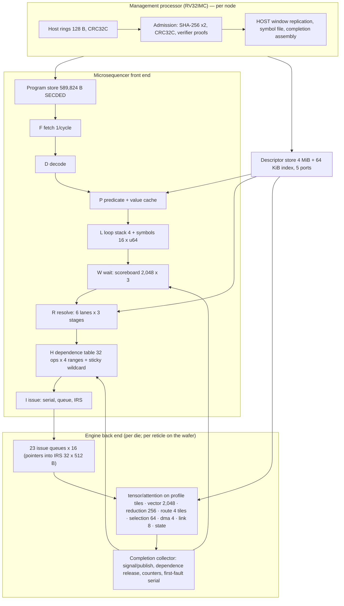
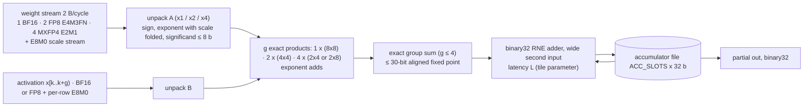

# OpenTallas Chip Architecture Design

*ROM-weight and HBM-weight accelerators for Qwen3-8B, DeepSeek-V4-Flash and DeepSeek-V4-Pro on one control plane, one engine set, one memory system and one network, drivable by ABI 3.0 with named amendments.*

Status: revised implementation proposal. The checked resource contract in [CHIP_RESOURCE_BUDGETS.md](CHIP_RESOURCE_BUDGETS.md) and `configs/architecture/chip_design_v2.json` supersedes the original sizing and performance claims. [CHIP_ARCHITECTURE_REVIEW_HANDOFF.md](CHIP_ARCHITECTURE_REVIEW_HANDOFF.md) records fixes and worker acceptance tasks. An amendment listed here is not automatically an implemented capability. Appendix A/B are historical review records.

---

## 0. Purpose, scope, and what this document may and may not claim

**Purpose.** Specify the proposed replacement chip and its path from Kernel IR v3 through ABI 3.0 to engines, stores and networks. The initial postmortem describes the starting implementation; current lane, control-plane and physical progress must be read from source-bound artifacts, not that historical baseline.

**Scope.** Three models (`configs/models/*.json`), two weight stores, and five machine shapes:

| target | store | shape | analytical anchor (`results/roofline/n5_vs_b200/analytical.json`) |
| --- | --- | --- | --- |
| Qwen3-8B | ROM | 4 dies tensor-parallel (derived anchor); 5 dies pipeline (recommended) | `ROM-N5-native-HBMKV-array-tensor-x4` 3,911.3 tok/s; `ROM-N5-native-SRAMKV-array-pipeline-x5-romfill` 4,941.0 tok/s |
| Qwen3-8B | HBM | 1 unified chip; 4 chips (iso-area twin); 5 chips (twin of the recommendation) | `b200_sxm-x2-tensor` 693.6 tok/s (external calibration) |
| DeepSeek-V4-Flash | ROM | 32-die array (hybrid 4 x 8); 30-die SRAM-KV variant; one 48-field wafer | `...array-hybrid-x32` 2,627.4 per user / 10,509.5 aggregate; `...wafer-tensor-x1` 4,707.9 |
| DeepSeek-V4-Flash | HBM | 32 unified chips | `b200_sxm-x16-hybrid` 1,499.3 (iso-area of ROM x32) |
| DeepSeek-V4-Pro | ROM / HBM | 4 wafers pipeline (this design); 32 or 48 unified HBM chips | `...wafer-hybrid-x3` 2,648.8 (the study's 3-wafer point does not fit the stitched grid, §5.5) |

**What this document may claim.** Grades are `measured`, `published`, `executed`, `derived`, and `assumed` (`configs/hardware/technology.json`). The revised N5 floorplan is arithmetic derived from assumed densities, 1 GHz timing and block areas. The historical 33,968-MAC/cycle analytical machine is a separate study. ASAP7 and sky130hd are implementation vehicles; no area or clock is scaled from either to N5.

**What it may not claim.** Resource consistency does not establish integrated functionality, macro closure, qualified TPOT, MFU or a ROM/HBM speedup. The former chip throughput tables are withdrawn because exact KV ownership, SDN service, scalar reduction, scale traffic and endpoint serialization were missing or inconsistent. Block routing evidence is summarized with source freshness in [CHIP_RESOURCE_BUDGETS.md](CHIP_RESOURCE_BUDGETS.md); it is not an integrated chip result. N5 accumulator latency one remains assumed. DSpark acceptance remains outside scope (§9.6).

**How the document is organised.** §2.1 specifies the shared core; generated resource budgets own per-profile arithmetic. §7 is the complete diff between the ROM and HBM designs. §10 is the amendment registry, one namespace (`AM-*`), with the section-local names of the drafts retired. Appendix A is the review ledger.

---

## 1. Requirements

### 1.1 The three models

| model | layers | hidden | attention | experts | weights | active | context priced | KV per token read / stored per user | source |
| --- | --- | --- | --- | --- | --- | --- | --- | --- | --- |
| Qwen3-8B | 36 | 4,096 | GQA 32/8 heads, head_dim 128 | dense | 16,381,470,720 B checkpoint; 15,136,811,008 B streamed BF16 | 7,568,405,504 params | 8,192 (cap 8,256) | 1,207,959,552 B / 1,207,959,552 B | `configs/models/qwen3-8b.json`, `analytical.json#model_summaries` — executed/published |
| DeepSeek-V4-Flash-0731 | 43 (21 csa) | 4,096 | MLA sparse: 64 heads x 512 latent, window 128, csa top-512, hca-128; 3 hash-routed layers | 256 / 6 per token (+1 shared) | 166,878,536,440 B (dense FP8 7,768,281,308; routed MXFP4 147,169,738,752; draft 10,862,838,300; resident-only 1,077,678,080) | 13.0e9 params | 200,000 (built at 262,144; model max 1,048,576) | 317,456,384 B / 1,381,646,336 B | same — executed/published |
| DeepSeek-V4-Pro-0813 | 61 (30 csa) | 7,168 | as Flash (by declared analogy, `assumed`) | 384 / 6 | 892,727,580,904 B (dense 26.82 GB; routed 822.05 GB; draft 41.98 GB) | 49.0e9 params | 1,000,000 | 2,207,468,544 B / 9,856,011,264 B | same — Pro KV entry sizes `assumed`; no Pro rung executed |

Formats the datapath must serve: BF16 x BF16; FP8 E4M3FN x FP8 E4M3FN with 128 x 128 weight scale tiles and per-row 128-K activation scales; MXFP4 E2M1 weights (32-element E8M0 blocks) x FP8 activations; BF16 x FP8 (DeepSeek output_a groups); and BF16-resident index keys x BF16 queries at group one. AM-E7 is disabled; the current lane rejects grouped BF16. Two attention families: GQA (Qwen) and sparse MLA (DeepSeek). Every contraction contract is binary32 accumulation, RNE, one output rounding (`runtime/sim/engines/tensor.py`, A7).

### 1.2 The analytical anchors, read as requirements

**Historical analytical requirements, not predictions of the revised chip.** Batch-1 component times in µs from `analytical.json#points[*].component_times_s` (derived). The step rule (`results/derived/qwen3_n5_design_target_reconciliation.json#combination_rule`): step = max(memory, compute) / stage_balance + link + layer_fixed, memory = max(weight, kv) when the stores are separate arrays (ROM designs) and weight + kv when they share one path (HBM designs); stage_balance 0.9 for more than one device; no derate on a single device.

| point | devices | weight | kv | compute | link | layer_fixed | step | tok/s (per user) | binding | link share |
| --- | ---: | ---: | ---: | ---: | ---: | ---: | ---: | ---: | --- | ---: |
| Qwen ROM x4 tensor (derived anchor) | 4 | 34.47 | 67.12 | 55.70 | 174.27 | 6.82 | 255.67 | 3,911.3 | link_latency | 68.2 % |
| Qwen ROM x5 pipeline romfill (recommended) | 5 | 171.66 | 46.37 | 158.62 | 4.84 | 6.82 | 202.39 | 4,941.0 | weight_read | 2.4 % |
| Qwen b200_sxm-x2-tensor | 2 | 1,051.2 | 83.9 | 6.1 | 173.8 | 6.82 | 1,441.8 | 693.6 | weight_read | 12.1 % |
| Flash ROM x32 hybrid 4x8 | 32 | 137.86 | 8.82 | 100.46 | 215.04 | 12.39 | 380.61 | 2,627.4 (10,509 aggregate) | link_latency | 56.5 % |
| Flash ROM x30 SRAMKV romfill | 30 | 137.86 | 8.52 | 105.42 | 215.04 | 12.39 | 380.61 | 2,627.4 | link_latency | 56.5 % |
| Flash ROM wafer tensor x1 | 1 | 34.47 | 8.20 | 2.54 | 165.55 | 12.39 | 212.41 | 4,707.9 | link_latency | 77.9 % |
| Flash b200_sxm-x16-hybrid | 16 | 394.0 | 5.5 | 2.2 | 210.6 | 12.39 | 667.0 | 1,499.3 | weight_read | 31.6 % |
| Pro ROM wafer hybrid x3 | 3 | 103.40 | 57.04 | 49.61 | 245.04 | 17.61 | 377.53 | 2,648.8 | link_latency | 64.9 % |

Three readings that shape the design. (i) The network is the binding constraint of every tensor-parallel design; the two planning documents this design replaces contain no network section, and §5.6–5.7 is where it lives. (ii) The Flash compute term (100.46 µs) already contains attention and index scoring at the study's w4a8 density; the Qwen compute term (55.70 µs) is the weight-streaming time and contains no attention arithmetic, which the design adds (§4.8). (iii) The ROM designs are charged a full-array sweep of 34.47 µs per slot (`rom_sweeps_per_step 1`) whether or not the array can consume it; this design replaces the sweep by the engaged read wherever the engaged bytes are addressable as row ranges (§5.1), and reports both.

### 1.3 Targets per design point

All revised chip profiles have `qualified_tpot_us: null` and `production_ready: false`. The 10,000 tok/s north star is a research target. The existing provisional gate budgets remain governed inputs; this correction does not silently relax them.

Qwen x4, x5 and x8 have checked capacity/floorplan proposals (§5.2). DeepSeek array, wafer and HBM proposals need exact node placement and recosting before they can acquire a new implementation performance target. The old analytical anchors in §1.2 remain reproducible historical studies.

### 1.4 Link classes and the physical ceilings inherited from the repository

Link classes (`technology.json#links`): on_wafer_n5 2.675e16 B/s, hop 125 ns derived (band 75–250); on_package 1e13 B/s published, hop 300 ns `assumed` (band 0.1–1.0 µs); nvlink5 9e11 B/s, hop 1.2091 µs derived from a measured 8-GPU all-reduce; nvlink5_nvl72 the same hop over a 72-wide single tier; inter_wafer 1.5e11 B/s derived, hop 5 µs assumed (1–10); infiniband_ndr 5e10 B/s, hop 2.03 µs measured.

Physical ceilings: the pinned ORFS flow routes about 1–1.5 M standard cells flat in ~5.5 h and the front end binds (synth -flatten plus one ABC pass went 27x slower for 4x the design); routed block counts are tracked in the source-bound physical records (§11.1); ORFS hierarchical assembly (BLOCKS, generate_abstract, per-tile .lef/.lib/.gds) exists in the pinned container and was first run here on 2026-09-05 (§4.4): one LQ8 hardens into an abstract and eight are placed in a parent, but the assembly has not yet left global routing, and neither hardened abstract is DRV-clean (§13 item 21). Hence the tile-based decomposition of §11.1. Two views, sky130hd (four corners) and asap7 (one corner), both full P&R, via the pinned container with the repository mounted read-only at /src.

---

## 2. The unified core

The unified core is the part of the chip that is byte-identical on the ROM design and the HBM design at a given design point: the ABI 3.0 microsequencer and everything that turns `program.bin` + `descriptors.bin` into engine work; the engine set behind it; the scratchpad, HBM controllers, HOST window and KV interfaces; the four on-chip networks; the host queue and management processor; counters, traps and the completion record. The weight store — mask-ROM banks or the same footprint populated with SRAM for KV and arenas — is the only thing that differs, and it sits behind one store port per tile (§4.4). §7 is the complete diff.

### 2.1 The frozen shared-core parameter table

This table specifies structure; `configs/architecture/chip_design_v2.json` and its checked report own Qwen per-profile resource values. §3–§9 cite it by row (`[T2.1-n]`) and do not restate values. Per-design-point rows (tiles, ROM bytes, KV SRAM, HBM stacks, topology) are the only rows that vary across design points; they are identical between the ROM chip and its HBM twin at the same point. Grades: **P** published (capability or registry), **D** derived, **A** assumed, **E** executed.

| n | parameter | value | grade | source / derivation | which side's need set it |
| ---: | --- | --- | --- | --- | --- |
| 1 | Tensor lane | peak 1 BF16, 2 FP8 or 4 MXFP4×FP8 products per cycle; any BF16 operand requires g=1; port and tree service also constrain sustained rate | E/A | §4.2, §4.4; N5 clock assumed | both |
| 2 | Accumulator latency L | tile parameter; N5 planning value 1; vehicles use the parameters and clock in their own routed records | A/E | §4.2, checked physical snapshot | both |
| 3 | Tile | 64 lanes; weight port 128 B/cycle; staging 2 x 16 KB; K-block 128; pass = 64 columns x 128 K; ACC_SLOTS 64 (N5) / 8 (vehicle) | D/A | §4.4 | both |
| 4 | Tile area (N5) | 0.2913 mm² (tensor share 154.7 of the anchor's 181.67 mm² compute, apportioned by cell ratio, uniform cell area assumed) | A | §8.1 | — |
| 5 | Tiles per device | Qwen x4 488; x5 649; x8 1,211; generated from residual area including repair, KV, mesh and extra RE8 resources. DeepSeek counts provisional pending the same derivation | D/A | CHIP_RESOURCE_BUDGETS.md | both, identical per point |
| 6 | Tile cluster / mesh endpoint | up to 8 tiles (512 lanes); cluster count = ceil(tiles/8) | D | checked profile report | both |
| 7 | Attention | on the tensor tiles (`shared_with: tensor`), 64 head controllers, 2 queues | D | §4.8 | both |
| 8 | Vector engine | 16 tiles x 128 binary32 FMA lanes = 2,048; 4 queues; transcendental and divide units per tile **provisional 16 + 16** until `ot_a3_fp32_transcendental_cr_rne` and `ot_a3_fp32_div_rne` are synthesised (gate G2a-V) | A | §4.9 | both (DeepSeek chain latency) |
| 9 | Reduction engine | 2 standalone tiles × 128 adder lanes; embedded scalar RE8 endpoints: 2 per 8-tile cluster including upper-tree resources, each with 4 KiB buffer | D/A | §4.4; second endpoint and buffers charged separately | both |
| 10 | Route engine | 4 tiles x 256 key lanes + 1 x 384-candidate selector each; 1 queue | D | §4.11 | both |
| 11 | Selection engine | 1 tile, **64 lanes** (T1-routable); ARGMAX Qwen 2,374 / DeepSeek 2,020 cycles; 1 queue, depth 4 | D | §4.12; physical review (256 lanes ≈ 90–110k cells) | both |
| 12 | DMA engine | 4 movers x 256 B/cycle = 1,024 B/cycle; activations, KV writes, exchange, host, EMBED/GATHER/SCATTER movement only; **no weight or KV-read traffic** | D | §2.5 (weights and KV reads use the SDN, row 22) | HBM need removed from DMA by design |
| 13 | Link endpoints | 8 per node; 512-bit flits; 4 VCs; credit 32 / chunk 65,536 B (array, cluster); 8 / 4,096 (wafer); retry 3; CRC32C; receiver rendezvous (AM-C8) | P/D | `configs/hardware/abi3_capability/*.json#link`; `rtl/abi3/ot_a3_link_endpoint.sv` seed | both |
| 14 | Issue queues | tensor 4, vector 4, attention 2, reduction 2, route 1, selection 1, dma 4, link 4 (= VC), state 1 = 23 queues; depth 16 (selection, state 4) | D | §3.8 | both |
| 15 | Outstanding operations (ABI level) | 16 per queue; 32 per die (Issue Record Store 32 x 512 B); wafer: 32 per reticle back end, 1,536 per wafer (AM-C9) | D | §3.6 | both |
| 16 | Intra-operation prefetch | tile-local 2 × 16 KiB staging; any overlap requires a finite-buffer occupancy and bandwidth proof | D/A | §4.8, §6.3 | both |
| 17 | Event scoreboard | 2,048 events x {pending, signalled, published} (AM-C1) | D | 192K speculative program signals 1,486 IDs (E) | both |
| 18 | Loop stack / symbol file | depth 4; 32-bit trips; `max_loop_trip` 16,777,216; 16 x 64-bit symbols with bound bits | P/D | A29 values are u64 (`runtime/abi3/records.py`) | both |
| 19 | Program store / descriptor store | 16,384 x 36 B SECDED = 589,824 B; 4 MiB records (8 banks, 64-B granules) + 64 KiB index, 5 ports x 256 B, 2-cycle | D | shipped tables 32.6 KB–520 KB, 192K speculative 1.14 MB (E) | both |
| 20 | Scratchpad SRAM | 128 MiB = 32 banks x 4 MiB; **2 ports x 1,024 B per bank, 64 KiB/cycle aggregate**, 2-cycle access; bank groups 0–15 of StorageClass.SRAM (2 banks each); HOST region banks 30–31 (8 MiB); net program-visible 120 MiB | D/A | demand sum §4.13 (vector 24.6 KB + broadcast ≤ 4 KB + route/selection 2 KB + DMA 1 KB ≈ 32 KB/cycle); area 41.6 mm² (§8.1) | both |
| 21 | KV SRAM | Qwen x5 320 MiB/die (272 source banks); x8 160 MiB/die (136 source banks), grouped into 16 bank groups; maximum x5 owner needs 304,349,184 B | D/A | checked exact placement; geometry/density assumed | both twins retain same allocation |
| 22 | Store-delivery network (SDN) | 8 pipelined spines x 576 B/cycle = **4,608 B/cycle** from the HBM controllers and KV SRAM groups into the tile staging write ports; identical on both chips | D/A | HBM twin needs ≥ 4,500 B/cycle of weights; ROM HBMKV needs 4,500 B/cycle of KV | HBM (weights) = ROM (KV) |
| 23 | Operand broadcast H-tree | root **1,024 B/cycle** (one scratchpad bank port), 8 levels, pre-stages the activation slice before the pass: a 24 KB x lands in 24 root cycles | D | throughput review (32 B/cycle root would add 83 µs per Qwen token) | both |
| 24 | Control tree / completion tree | 8 levels each way, 512-bit issue packets, 1 cycle per level; on the wafer extended over inter-reticle links with delegated dependence resolution (§3.12) | A | — | both |
| 25 | Data mesh | Qwen x4 12×12, x5 13×13, x8 16×16; 4-bit coordinates; 512-bit flits, 4 VCs × 4 flits per port, 2 planes; 64 B/cycle per direction per port; 2 cycles/hop assumed | D/A | generated endpoint and router-area checks | both |
| 26 | HBM | 5 HBM3E stacks per 815 mm² die (beachfront 114.19 x 0.6 / 12 mm = 5.71); 1.0e12 B/s and 22.5 GB per stack; 4.5 TB/s achievable at 0.9; **101.25 GB usable** (capability 96 GiB); 40 channel units x 112.5 B/cycle; 256-B interleave; 64-B bursts; read latency 120 cycles (A) | D/A | `technology.json#hbm.hbm3e`; `results/tensor_accelerator/qwen3_rtl_dma_campaign.json#correlation.hbm_burst_bytes` (E) | both; populated 0 stacks on the Qwen x5 ROM die |
| 27 | ROM sense interface (ROM chip only) | `ot_rom_read_service` sense: 4,096-B rows, 64-B granule, **2 granules per cycle per tile bank** from 2 open rows (interface amendment, §5.1); pass-granule-major word order fixed at mask time | E/D | `rtl/rom/ot_rom_pkg.sv`, `ot_rom_read_service.sv` (E, IHP-routed 56,292 cells) | ROM |
| 28 | Clock | N5 1 GHz assumed; each vehicle uses its recorded routed target and closure verdict; PHY/management asynchronous | A/E | generated physical snapshot | both |
| 29 | Management processor | one RV32IMC (M-mode, PMP) per node; SHA-256 x2, CRC32C engines; host rings 128 B; 8 sessions | P | ADR-003 §4 | both |
| 30 | Counters / traps | 124 x 64-bit saturating counters (`spec/abi3/counters.json`); 13 trap classes; 16 snapshot slots | P | wire format §8 | both |
| 31 | Capability limits | max_instructions 16,384; max_descriptors 16,384; max_descriptor_bytes 4,194,304; max_events 2,048; max_loop_depth 4; max_loop_trip 16,777,216; max_outstanding_per_queue 16; max_outstanding_operations 32 (x reticle_count on the wafer); max_context_positions 262,144 (1,048,576 Pro); max_expert_ids 4,096; max_topk 16; max_vocabulary 262,144; max_sessions 8; max_state_resources 16; symbol_count 16; watchdog_classes [0, 1] | P | §2.8 | both |
| 32 | Topology per design point | Qwen x4/x5: CLUSTER_N (N = 4 / 5, AM-R1); Flash array: CLUSTER_32 (hybrid 4 x 8 via AM-R4); wafer: WAFER_LOGICAL_DEVICE; Pro: CLUSTER_N of 4 wafer-class nodes | P/D | §5, §10 | both |
| 33 | Dependent boundary | unmeasured; neither historical 39 nor 120 cycles is calibrated; no frontier overlap credited | A | §3.6; §13 item 13 | both |

### 2.2 Decisions this core makes, and why

| decision | choice | why (numbers in the named subsection) |
| --- | --- | --- |
| Issue model | in-order issue, asynchronous completion, bounded outstanding operations [T2.1-15], hardware memory-range dependence table with sticky global overflow and no frontier streaming (§3.6) | the golden model and the RTL run to completion (`ot_a3_microsequencer.sv` header: "issue_ready is completion"); **measured 2026-09-06**: one Qwen decode token is **80,663** clock cycles <!-- figure: 80663 src="results/rtl/abi3_deployment_campaign.json#control_plane_cycles.per_simulator[simulator=iverilog].cases[index=1].rtl_transaction_cycles" tol="exact" name="measured control-plane transaction cycles, Qwen decode" --> of serial control, 80.8 per fetched instruction and 170 µs at 1 GHz, against the ~35 cycles / 74 µs this row estimated; DeepSeek is 1,021–1,202 µs (§3.3); the shipped wait sets encode first-trip dependencies only (A24 levels), so overlap needs a hazard mechanism the compiler did not emit |
| Retirement and `retired_work` | an engine instruction retires at completion; `first_fault_instruction` and `retired_work` are made deterministic by the issue-serial rule (§3.2 item 5); node-band-predicated instructions retire as no-ops (AM-R4) so `retired_work` is identical on every node | co-simulation compares retire counts (`results/rtl/abi3_deployment_campaign.json`, 594,004 checks at zero run-ahead and again on every seeded run-ahead pair) |
| Events | A24 levels unchanged; 2,048 IDs with a `pending` bit (AM-C1) | the 192K speculative program signals 1,486 IDs and cannot admit at 1,023 |
| FENCE | a real drain; scope = the wait set's `scope` byte; **ENGINE scope when the FENCE carries no wait set** (AM-C2) | 190 of the HBM cluster program's 191 static FENCEs carry no wait set; a SYSTEM default would make them cluster barriers (4.9 ms per token) |
| Integrity | per-record CRC32C and the four SHA-256 digests verified once at LOAD/ACTIVATE by hardware engines; authenticated images in ECC SRAM; fetch 1 instruction/cycle | the wire format requires the checks "before work is issued" (§2 of `docs/TENSOR_ACCELERATOR_ABI_3_WIRE_FORMAT.md`); the 8-cycle serial CRC per fetch is an RTL choice |
| Descriptors | resident on-chip store [T2.1-19]; no cache; no HBM dependency for control | 0.5 MB per DeepSeek deployment; 13,221–14,511 view resolutions per decode token |
| Weight and KV-read delivery | the SDN [T2.1-22], not the DMA movers and not the scratchpad | 4,500 B/cycle cannot pass a 1,024 B/cycle DMA engine or a 512 B/cycle bank port; both chips need it (weights on HBM, KV on HBMKV ROM) |
| Consensus | each node branches on its own flag copy and keeps a control-flow digest; one implicit 16-byte all-gather at COMPLETE; trap 13 on disagreement (AM-C6) — the only mechanism | a per-predicate all-reduce would cost 43 x 2.4 µs = 103 µs per DeepSeek token |
| Host queue | owned by the RV32IMC per node; node 0 owns the logical-device queue; one per wafer with 48 reticle back ends | ADR-003 §4 |
| Checkpoint | CHECKPOINT_SESSION / RESTORE_SESSION not served (FAILED, class 4); host tooling | 3.3 GB (Qwen) / 2.45 TB (32-node DeepSeek) images cannot cross a 1–2 MB host window |
| STATE family | `ot_a3_state_controller` elaborated (feature bit 6 mandatory); acceptance deployments issue no STATE instruction | admission identity with the golden model |
| DSpark | opcodes served (DSPARK_WINDOW_INDEX, PARTITION_SUM, 5 x ARGMAX/TOKEN_APPEND); the path is outside the acceptance profile (§9.6) | verification/acceptance undefined by the pinned model code; draft tokens not host-visible in any shipped bundle |

### 2.3 Control plane (summary; §3 is the full specification)



### 2.4 Memory system (summary; §3.9 and §6.2–6.4 are the specifications)

| store | geometry | per-device bandwidth | granule | what lives there | grade |
| --- | --- | --- | ---: | --- | --- |
| Scratchpad SRAM | [T2.1-20] | 64 KiB/cycle | 128 B | activations, staging regions, rope rows, DeepSeek 128-slot window rings (5.5 MiB for 43 layers), flags, snapshot slots, LOAD staging | geometry P, bandwidth A, area D |
| KV SRAM | [T2.1-21] | source 26,112 B/cycle (x5), delivered ≤ 4,608 | 128 B | Qwen KV [8256,8,128] BF16 K‖V rows of 4,096 B per (layer, position) | D |
| HBM | [T2.1-26] | 4,500 B/cycle | 32 B (KV), 64 B bursts | HBM chip: weights and arenas; ROM chip (HBMKV points): KV, arenas, flags | D/A |
| HOST region | scratchpad banks 30–31 through the management IOMMU | PCIe Gen5 x16 ~64 GB/s (published class) | 64 B | input window, logits, token ring, request-symbol pool | P |
| ROM | [T2.1-27]; column-local banks, one per tile; `bank_or_tile` = bank group (AM-C4); read-service tables in a 64 KiB SRAM macro (+2 cycles) | min(density-derived source, active tile ports, downstream service) | 64 B | weights, constants, rope tables, index tables | E (interface), D (rate) |
| Weight-store slot on the HBM twin | the ROM footprint populated with 4 MiB SRAM banks (StorageClass.SRAM bank groups 16–31): capacity derived from the replacement slot in the checked profile report; weights and scales refused there at admission (manifest check) | as scratchpad | 128 B | KV and arenas only | D |

### 2.5 Networks

Five networks, all byte-identical across the two chips.

1. **Store-delivery network (SDN)** [T2.1-22]. Eight pipelined spines of 576 B/cycle (4,608 bits wide each, repeatered every ~1 mm, 36,864 wires per die in two upper metal layers) run the die width, one per two tile-row bands, with a tap at each tile cluster; each HBM controller and each KV SRAM group injects into any spine through an edge crossbar. It carries store-to-staging traffic only: weights on the HBM chip, KV blocks for attention on both chips at the HBMKV points, KV from the KV SRAM at the SRAMKV points. Static striping computes the destination, but concurrent sources still require arbitration or an explicit collision-free slot schedule. Credits per tap bound destination occupancy; aggregate admitted payload must stay within 4,608 B/cycle. Cost: repeaters + taps ≈ 5 mm² at N5 (A).
2. **Operand broadcast H-tree** [T2.1-23]. Forward plane only; root 1,024 B/cycle from one scratchpad bank port; K-block-addressed slices delivered to every tile assigned to the block; the slice is pre-staged in the tile's activation FIFO (2 x 256 B) before the pass, so a 24 KB x (K = 12,288) costs at least 24 root cycles per operator; overlap with a previous pass requires a proven schedule. No reverse arithmetic plane: under AM-E1 K is split within a column group and N across tiles, so no cross-column reduction exists inside a device.
3. **Control tree and completion tree** [T2.1-24].
4. **Data mesh** [T2.1-25]. Allocate an endpoint for each tile cluster, scratchpad bank, KV group, HBM controller, DMA mover, link endpoint, HOST/control/management interface. Use the maximum endpoint count of the ROM and HBM twins. The checked Qwen meshes fit 113/144, 150/169 and 220/256 endpoints respectively. Activations, results, KV writes and host traffic share this network; weights and KV reads use the SDN. Endpoint fit alone does not prove routing bandwidth or congestion.
5. **Link endpoints** [T2.1-13] and the collective engine (§5.6): `ot_a3_link_endpoint` pipelined to the tile clock and widened to 512-bit flits (≥ 15k cells each with 8,192 buffer flops and a 64-B/cycle CRC32C), `ot_a3_collective_engine` (recursive doubling / halving-doubling, PAIRWISE_TREE over ascending rank; cycle-identical on both simulators, `results/rtl/a3_link_campaign.json`).

### 2.6 Clock plan

[T2.1-28]. The sequencer runs at 1:1 with the tile clock; its critical paths are a 64-bit compare, a 2-stage 32 x 32 multiply and an 11-level mux (2,048:1 scoreboard read), all shorter than the pipelined binary32 adder stage. Determinism does not depend on the asynchronous domains (HBM PHY, SerDes, PCIe, management): ordering is enforced by the scoreboard and the dependence table (§3.2 item 4).

### 2.7 Host queue and management processor

One RV32IMC [T2.1-29] per node; on the array/cluster node 0 owns the logical-device queue; on the wafer one processor owns the wafer and the 48 reticle back ends have none. It never interprets the graph, executes no engine arithmetic, and produces no token. Its per-token work is GENERATE admission (A29 identities, session generation, symbol file on every node, HOST window replication) and completion assembly after COMPLETE and the agreement collective: ~2 µs of firmware plus 3.6 µs of fabric traversals on a 32-node design plus the host's own PCIe round trip (2–5 µs, A) — 3.6–6 % of a 100 µs budget, 1–2 % of the Flash step. Watchdog: class 0 = retired-work bound only; class 1 = retired-work bound plus `deadline_cycles` when nonzero (0 means no deadline — every shipped header carries class 1 and every driver submission carries deadline 0, `runtime/driver.py:441`); AM-C5. The submission's `generation_policy_id` may be NO_ID (use the entrypoint's) or must equal it, matching `prepare_request`.

### 2.8 The capability record

One `opentallas.abi3.capability.v1` record family drives every deployment. Per-design-point profiles differ only in `topology_class`, `limits.max_nodes`, the `link` entry, `engines.tensor.tiles` (and therefore `lanes`), `memory.rom` (present on the ROM chip), `memory.sram_kv` (SRAMKV points), `memory.hbm.physical_stacks` (0 on the Qwen x5 ROM die) and feature bits 8/9 by topology. Fixed values are [T2.1-8…31]. Fields not in today's records are added by AM-C3 (`engines.<family>.queue_depth`, `engines.tensor.{tile_lanes, tiles, acc_slots, k_block, prefetch_passes, format_group}`, `engines.<family>.shared_with`, `limits.max_outstanding_operations`, `limits.max_descriptor_bytes`, `limits.symbol_count`, `limits.watchdog_classes`, `memory.program_store_bytes`, `memory.descriptor_store_bytes`, `memory.sram.{port_bytes, bank_group_table, host_region_banks}`, `memory.sram_kv`, `memory.hbm.{stacks, channels_per_stack, interleave_bytes, stack_bandwidth_bytes_s, achievable_fraction}`, `memory.rom.{bank_group_table, row_bytes, sense_bytes}`, `noc.*`, `sdn.bytes_per_cycle`, `clock.timebase_hz`, `link.classes[]`). The verifier already narrows `max_outstanding` by `engines.<family>.queue_depth` (`runtime/abi3/verifier.py:1530-1580`), so publishing queue_depth 16 makes the shipped HBM bundles' `max_outstanding` 64 an admission failure until re-emitted (§3.8, gate C2).

### 2.9 What is shared and what is not

Shared byte for byte: everything in [T2.1] except rows 5, 21, 26 (stack population), 27 and 32, which are per design point and identical between twins at a point. §7 lists every difference between the ROM chip and its twin with its citation.

---

## 3. The control path end to end

### 3.1 The frozen artifacts as the hardware reads them

The control plane consumes the frozen ABI 3.0 wire format (`spec/abi3/records.json`, `spec/abi3/descriptor_payloads.json`) unchanged. A field marked *refused* is checked at admission and fails the deployment closed (class 1/4) before activation. Every refusal below was checked against the seven shipped bundles: none is triggered by any of them.

**Program header (256 B).** magic `OTTA3PG\0`, ABI 3.0, header_bytes 256, instruction_bytes 32 (refused if not exact, class 1); instruction_count ≤ 16,384 [T2.1-31]; the 256-bit feature vector (bit 11 SIGNED_DEPLOYMENT not advertised); the four SHA-256 digests recomputed at LOAD; `max_retired_work` (issue-serial bound, trap 10); `watchdog_class` (AM-C5); entrypoint-table and signature descriptor IDs (signature must be NO_ID); 48 reserved bytes zero; CRC32C (reflected Castagnoli, CRC field zeroed).

**Instruction (32 B).** `major`/`sub` decode against the family/subopcode bound table of `ot_a3_pkg.sv` with the ROUTE bound raised to 0x07 (AM-E6); `flags` bits 0–3 (PREDICATED, PREDICATE_INVERT, WAIT_ACQUIRE, SIGNAL_RELEASE) acted on, bit 6 TRACE_BOUNDARY honoured under TRACE_ENABLE, bits 4/5/7 refused (no frozen semantics; no shipped program sets them), bits 8–15 zero; `predicate_id`, `descriptor_id`, `wait_set_id`, `signal_event_id` < 2,048; `control_id` (branch target; LOOP_CONTROL id for LOOP_SETUP/LOOP_NEXT, `runtime/sim/device.py:1000-1002`); `source_operation_id` (fault record only); `instruction_crc` (verified at LOAD, thereafter SECDED).

**Descriptor header (64 B) and payloads.** Header fields verified at LOAD; `permissions` enforced by the memory system on every resolved view, link endpoint and host access (class 3/11 on violation). Per type:

| type | read by | ignored / refused |
| --- | --- | --- |
| MEMORY_OBJECT | storage_class, base_address, size_bytes, bank_or_tile (bank group under AM-C4; placement hint for HBM objects under AM-H1), alignment_log2 (≥ 6; HBM objects ≥ 8 on both chips after the ROM backend allocator change of §10.3), content_digest, node_id | replica_group_id; integrity_mode checked at LOAD only |
| TENSOR_VIEW | every field incl. the four terms, A15 scale geometry, A26 edge mask, A18 extent, `stride_shift` (AM-R5) | CONSTANT term kind refused |
| NUMERIC | dtype/rounding/order/epsilon/scale fields and the 32-byte contract digest (engine CAM, §4.9) | flags |
| SCHEDULE | engine_family, queue_index, issue_window, tile_rows/cols/depth, bank_mask, port_mask, noc_route_class, max_outstanding (§3.8) | priority, resource_bound |
| TOPOLOGY | all counts, digests, epoch; stored at full 256 B | local ids (straps) |
| COMMUNICATION | all; symbol-affine extent (AM-R3) | integrity_mode ≠ CRC32C refused; timeout_class |
| STATE | all (state controller) | — |
| EVENT_WAIT_SET | producers, count, ordering, **scope (FENCE only)** | condition must be ALL and required_count = producer_count (AM-C7; every shipped set conforms) |
| LOOP_CONTROL | all | predicate_id must be NO_ID |
| OPERATOR | family/sub, numeric_profile_id, schedule_id, views, aux, counter_class_id | flags |
| GENERATION_POLICY | selection_mode 0, EOS set, max_new_tokens, vocabulary_size, token_ring_object_id, counter_class_id | tie_rule must be 0; rng_seed |
| COUNTER_CLASS, PREDICATE, ENTRYPOINT_TABLE | all | PREDICATE kinds ENGINE_STATUS / ROUTE_VALID trap 4 at evaluation |
| SIGNATURE_METADATA | — | refused |

**Request-symbol descriptor (A29).** Read entirely by the management processor: SHA-256 and CRC32C in hardware; each of the 15 symbols exactly once; monotonic id; one live per session; consumed once by the GENERATE that names it; the coherence identities of `runtime/abi3/verifier.py verify_request_symbol_descriptor` and `runtime/sim/device.py prepare_request` (POSITION_END = POSITION_START + SPAN_TOKENS, CONTEXT_LENGTH = POSITION_END, SPAN_LAST_INDEX = SPAN_TOKENS − 1, NODE_ID = 0 at the queue, NODE_COUNT = admitted nodes, PHASE = entrypoint phase, GENERATION_INDEX = committed count, BATCH, 1 ≤ MAX_NEW_TOKENS ≤ policy ceiling).

**Submission / completion (128 B).** Every submission field is read (§2.7); every completion field is written, including `final_token_id` (offset 104), `eos_reason` (108), `retired_work` (112), `committed_token_position`, `produced_token_count`, trap and fault fields, `counter_snapshot_id`, `trace_id`, `completion_timestamp` in device cycles of the published `clock.timebase_hz` (AM-C3), and the flags.

**Control-store sizes** (E: `ls -l build/abi3/*/program.bin descriptors.bin`): Qwen HBM 2,624 / 32,640 B; Qwen ROM 2,656 / 35,712 B; DeepSeek ROM wafer 42,592 / 516,160 B (3,405 records, 151.6 B average); HBM cluster 41,408 / 509,824 B; ROM array-32 43,328 / 520,320 B; 192K speculative 2,954 instructions / 7,514 descriptors (~94.5 KB / 1.14 MB).

### 3.2 The cycle-level contract

1. **Program order.** Fetch, predicate, wait, resolve and issue strictly in program order; at most one engine issue per cycle. CONTROL executes and retires in the front end.
2. **Asynchronous completion.** An engine instruction leaves the front end at issue with serial S and completes asynchronously; at most 16 outstanding per queue and 32 per die [T2.1-15]; issue stalls at either bound, so bounded queue occupancy is a hardware property (ADR-003 §9).
3. **Retirement.** At completion without fault; its signal event goes pending → signalled → published then. `instructions.issued` counts at issue, `instructions.retired` at completion; `retired_work` = retirements at COMPLETE, the golden model's definition. A node-band-predicated instruction (AM-R4) retires as a no-op on the nodes outside its band and is counted in `retired`, not `predicated_off`, so `retired_work` is identical on every node of a pipeline.
4. **Determinism (feature bit 2).** Every issued operation, resolved view, predicate outcome, written byte, counter outside group 0x0c, `final_token_id`, `eos_reason` and `retired_work` are functions of (program, descriptors, symbols, memory). Only run-ahead depth and the 0x0c latency counters are timing-dependent; hazards between overlapped operations are excluded by the dependence table (§3.6).
5. **Faults.** A precise front-end trap (classes 1–5, 10, 13) stops fetch at the faulting pc; an asynchronous engine fault (3, 6, 7, 8, 11) stops issue in the cycle it is reported. Outstanding operations complete or fault; `first_fault_instruction` = the lowest issue serial among faulting instructions (or the pc of a precise trap); `retired_work` counts retirements with lower serial; **`instructions.fetched/issued/predicated_off` are frozen at the faulting serial** so a FAILED transaction's counters equal the golden model's, which stops at the faulting pc; prepared STATE resources are discarded; `fault.traps` and `fault.poisoned_transactions` increment; completion FAILED with class and `fault_descriptor_id`.
6. **Watchdog.** Issue serial vs `max_retired_work` every cycle (trap 10); transaction cycle counter vs `deadline_cycles` when nonzero (trap 10, drain, FAILED).
7. **Predicated-off** instructions are dropped at the predicate stage: never waited, issued or retired; counted in `predicated_off`.
8. **CONTROL.** NOP retires and publishes. BRANCH forward only (admission-proved), 2-cycle redirect. LOOP_SETUP/LOOP_NEXT §3.3. WAIT retires after its wait set passes. FENCE drains (AM-C2). ASSERT retires. COMPLETE: implicit SYSTEM drain, staged STATE apply, agreement all-gather (AM-C6), completion record. TRAP: class 5.

### 3.3 The microsequencer pipeline and its cost per token

| stage | work | cycles (shipped shapes) | cycles (ABI maximum) | today's RTL (`ot_a3_microsequencer.sv` FSM) |
| --- | --- | ---: | ---: | ---: |
| F fetch | program store, SECDED, bounds | 1 | 1 | 3 + 8 CRC beats + 2 |
| D decode | family/sub, flags, descriptor-type check | 1 | 1 | 1 |
| P predicate | NO_ID 0; PHASE_IS / COMPARE_SYMBOL / COMPARE_LOOP / LOOP_FIRST / LOOP_LAST: fetch 2 + compare 1; BOOLEAN_OBJECT / EOS_MEMBER: + value-cache hit 1 or memory read (SRAM 2, HBM ~120) | 0–3 (+1) | ~125 | ~4 + round trip |
| L loop | LOOP_SETUP: fetch 2 + trip (power-of-two fast path 2; general 2 x 33 pipelined) + push 1; LOOP_NEXT 1 + 2-cycle redirect | 5 / 3 | 71 / 3 | ~90–100 / ~3 |
| W wait | wait-set fetch 2 + 12-producer parallel lookup 1 (stall while any producer is pending) | 3 | 3 | fetch + 1 per producer + 2 |
| R resolve | OPERATOR fetch 2 ‖ six TENSOR_VIEW fetches 2; terms 1 each (≤ 2 shipped); A13/A18/A26 extent 2; bounding range 2 — three pipeline stages, occupancy = max stage | **4** occupancy / 10 latency | 6 / 16 | serial per view, 2 x 64 per A18 term |
| H hazard | dependence-table check, 2 views/cycle against 128 ranges | 2–3 | 3 | — |
| I issue | serial, queue select, IRS write, counters | 1 | 1 | ≥ 2, blocked until completion |

Occupancy per decode token from the static decode walks (`scratchpad/arch/decode_walk.py`, evaluated as `runtime/sim/device.py` at SPAN_TOKENS = 1; engine issue 4 cycles, CONTROL 2, predicated-off 1, FENCE = a drain, §3.6). Grade: derived from executed instruction counts and assumed stage costs. Basis is named per row because the RTL campaign's DeepSeek decode case (`results/rtl/abi3_deployment_campaign.json` depth_reached: 4,490 issues, 12,929 retired) was run at a different context than the 200K walk (ring-boundary predicates differ).

| decode token | basis | retired | engine issues | CONTROL | FENCE | pred-off | views | occupancy @ 1 GHz | drains | serial RTL: estimate -> **measured** |
| --- | --- | ---: | ---: | ---: | ---: | ---: | ---: | ---: | ---: | ---: |
| Qwen3-8B (ROM = HBM program) | walk (executed artifact: 2,105 retired, `results/abi3/accelerator_tokens/qwen3_8b_rom_chat1.json`; the walk's 2,104 omits the COMPLETE retirement) | 2,105 | 691 | 1,413 | 1 | 0 | 2,143 | **5.6 µs** | 0.04 µs | 74 µs -> **80,663 cycles** <!-- figure: 80663 src="results/rtl/abi3_deployment_campaign.json#control_plane_cycles.per_simulator[simulator=iverilog].cases[index=1].rtl_transaction_cycles" tol="exact" name="Qwen decode control-plane cycles, Icarus" --> = **80.7 µs** (Verilator 80,724) |
| Qwen3-8B on CLUSTER_N x4 (re-lowered, +72 LINK.COLLECTIVE SUM, +72 wait sets) | derived | ~2,250 | 763 | 1,485 | 1 | 0 | ~2,290 | ~6.0 µs | — | — |
| Flash ROM wafer | 200K walk / campaign context | 12,184 / 12,929 | 3,807 / 4,490 | 8,377 / 8,439 | 3 | 1,853 | 13,221 | **33.9 / 36.8 µs** | 3 x ≥ 40 cycles | 491 µs -> **524,653 cycles** <!-- figure: 524653 src="results/rtl/abi3_deployment_campaign.json#control_plane_cycles.per_simulator[simulator=iverilog].cases[index=5].rtl_transaction_cycles" tol="exact" name="Flash ROM wafer decode control-plane cycles, Icarus" --> = **524.7 µs** (Verilator 525,182) |
| Flash ROM array-32 | walk | 12,419 | 3,956 | 8,451 | 3 | 1,853 | ~13,500 | **34.6 µs** | — | 499 µs -> no campaign case (the co-simulation runs the wafer and the HBM cluster, not the array); scaling the wafer's measured 2.45x gives ~1,220 µs, derived |
| Flash HBM cluster-32 | walk | 11,662 | 4,659 | 7,003 | 2,042 | 1,983 | 14,511 | **35.0 µs occupancy + ≥ 82 µs of drains = ≥ 117 µs** | 2,042 x ≥ 40 cycles (up to the longest outstanding MATMUL, 512–1,024 cycles) | 478 µs -> **527,072 cycles** <!-- figure: 527072 src="results/rtl/abi3_deployment_campaign.json#control_plane_cycles.per_simulator[simulator=iverilog].cases[index=7].rtl_transaction_cycles" tol="exact" name="Flash HBM cluster decode control-plane cycles, Icarus" --> = **1,020.9 µs** (Verilator 528,300) |

**The serial-RTL column is a measurement since 2026-09-06, and it was 2.1-2.5x optimistic.**  L1-CP counted checks, fetches and retirements and never cycles (section 13 item 13), so every number in that column was built from the per-stage costs in the table above it.  Both checkers of `tools/rtl_abi3_deployment_campaign.py` now count the transaction's clock cycles -- the span from the cycle after the start pulse to the cycle the design asserts `done` -- and print them per case, and the estimates were low by 2.30x (Qwen), 2.45x (Flash ROM wafer) and 2.14x (Flash HBM cluster).  Nothing about the machine changed: the check count is unchanged at 594,004 per simulator and every compared observation is the retained one; what changed is that the span is now counted rather than composed.  The residual is *not* the bench: on the Qwen decode case the checker's own issue back-pressure is 226 of the 170,031 cycles and its predicate service is 0, and `dbg_wait_stalls` and `dbg_dep_stalls` are both zero on every case, so the whole span is serial front-end work with nothing stalled behind a producer or a dependence range.  Attributing it stage by stage needs per-stage counters the front end does not carry, and that is an open item, not a claim: the two candidates the stage table itself names are the fetch path (3 + 8 CRC beats + 2) and `LOOP_SETUP` at ~90-100 cycles against 723 loop iterations per Qwen token.  The measured figure is what section 11.5's rung 4 arithmetic and section 13 item 13's calibration must now use.

Readings. (i) The front end overlaps engine execution and binds only when it exceeds the engine critical path: 5.6–6.0 µs is 2 % of the Qwen x4 step; 34–37 µs is 9–10 % of the Flash step. (ii) The HBM cluster program's 2,042 dynamic FENCEs per token (190 of 191 static ones without a wait set, hence ENGINE-scope drains under AM-C2) expose ≥ 40 cycles each and make its control cost ≥ 117 µs — a lowering choice (OI-19) removed by the compiler change of §10.3 (drop the pack → collective → unpack FENCEs; the dependence table orders them), after which the cluster program costs 35 µs; the 4,534 LOOP_SETUP/LOOP_NEXT pairs around single-trip bodies cost a further 9 µs and are removed by row-batching. (iii) Exposed dependent-chain latency is a different quantity from occupancy (§3.6).

**Loop stack.** Four slots, each {loop id, lower, step, trip, current, body_start, body_end, bound symbol, divisor, cached A13 operands}. LOOP_SETUP: trip = max(ceil(span / step), 0), span = upper − lower or ceil(symbol / max(divisor, 1)) − lower; trip > the LOOP_CONTROL's own `max_iterations` traps 4 (the runtime check is against the descriptor, `device.py`; the verifier proves max_iterations ≤ `max_loop_trip`); trip 0 skips to body_end + 1; stack full, body_start ≠ pc + 1, or LOOP_NEXT naming a non-innermost loop traps 5. Power-of-two fast path for every shipped divisor (1, 512, 1,024, 32,768, 65,536, 131,072, 262,144) and step; the 33-cycle pipelined radix-4 divider only at LOOP_SETUP. The shipped ROM programs' 18 per-token loops declare `max_iterations` 4,096; raising `max_loop_trip` to 16,777,216 does not lift that horizon — the ROM bundles are re-emitted with the HBM backend's 262,144 (§10.3).

**Symbol file.** Sixteen 64-bit entries with bound bits (A29 values are u64; the RTL's 32-bit file widens). NODE_ID is bound per node by the management processor; the resolver substitutes the device's own node id for a NODE_ID term of an engine instruction and 0 for CONTROL, STATE and LINK (the golden model's rebinding, `device.py:703-711`); the **predicate unit reads the per-node NODE_ID for COMPARE_SYMBOL predicates on engine-family and LINK.SEND instructions and 0 otherwise** (AM-R4), which is what makes node-band predication expressible. COMPARE_SYMBOL compares 64 bits against the u64 immediate.

### 3.4 Program store and descriptor store

[T2.1-19]. Program store: 16,384 x 32 B SECDED (36 B per record), one read port, 1-cycle; written only by the management processor after the body SHA-256 and every instruction CRC have passed; a double-bit error traps 2. Descriptor store: a 64 KiB index (offset[23:0], type[7:0]) and a 4 MiB record SRAM in 8 banks interleaved at 64-byte granules; records at native size, 64-B aligned; five 256-B read ports (two for the front end, two for the resolver bank — six views x 3 granules = 18 bank reads over 8 banks x 2 ports = 2 cycles — one for the engine controllers); 2-cycle latency; SECDED. Per-token traffic (derived): Qwen ~5,600 records (1.1 MB), DeepSeek 32,600–36,600 (6.3–7.0 MB), ~0.35 records per cycle against 5 ports. No descriptor cache, no HBM-backed path: control never depends on HBM, which keeps the Qwen x5 ROM die (0 stacks) free of it. At LOAD the bundle is staged in HBM or in scratchpad banks 30–31, hashed, then copied into the two stores.

### 3.5 View resolvers

Six lanes, one per operand slot, each a three-stage pipeline: **T** (≤ 4 dynamic terms, selector value x 32-bit stride ≪ `stride_shift` accumulated into a 64-bit element offset; one pipelined 32 x 32 multiplier), **X** (A13 partial-final-iteration clamp; A18 affine extent with the power-of-two fast path; A26 edge mask; "smallest partial extent wins"), **B** (bounding byte range for the dependence table: base = element_offset x element_bytes, span = Σ (dim_i − 1) x |stride_i| x element_bytes + element_bytes, plus the scale object's range). Semantics are `runtime/sim/memory.py ViewResolver.resolve`; MXFP4 sub-byte addressing (low nibble first) and A15 scale geometry pass to the engine unchanged. Occupancy 4 cycles per engine issue for shipped shapes, 6 at the ABI maximum: 1.5 views/cycle aggregate against the 0.145 views/cycle a 100 µs DeepSeek token needs. One 64-bit radix-4 pipelined divider (33 cycles, II 1) shared with the loop stack; no shipped resolution enters it. An 8-entry A18 extent cache per lane serves the 236–284 A18 views and 408 edge-masked views per DeepSeek program (three decode extents: 128, 128 + C/4, 128 + C/128). Cost (assumed, corrected): a pipelined 32 x 32 multiplier is ~7k cells (1.78x the partial products of the executed 24 x 24 `fp32_mul` probe's 5,165), so a lane is ~17k and the bank ~100–120k — three T1 blocks of two lanes (§11.1).

### 3.6 Events, the dependence table, frontier streaming, FENCE, and the exposed chain

**Scoreboard** [T2.1-17]. Issue sets `pending`; completion sets `signalled` and, for every retiring instruction naming a signal event, `published`. A wait set passes when every producer is `signalled` (and `published` under WAIT_ACQUIRE / ACQUIRE ordering); it stalls while any producer is `pending`; it traps 13 if a producer is neither — the golden model's "wait on an unsignalled event" preserved; only the case the golden model cannot exhibit (issued, not yet complete) becomes a stall. Twelve producers looked up in parallel over three cycles; ~31k cells (6,144 flops + 4 ports x 3 bits x 2,047 mux2, assumed 1 cell per mux2). Release: an engine's writes are acknowledged by the bank, channel or endpoint before `signalled`.

**Why levels are not enough.** Events are single-assigned levels never lowered inside a transaction, so the shipped wait sets encode first-trip dependencies only: Qwen pc 8 (layer l + 1) waits on event 1 (embedding) and not on event 20 (layer l's residual ADD at pc 62); trip i + 1 of pc 11 waits on event 2 that trip i already raised (`build/abi3/qwen3-8b-hbm-tokens`). Under asynchronous completion those instructions would read before the write lands.

**Dependence table.** 32 outstanding-operation entries, each with four `{object[15:0], lo[39:0], hi[39:0], write}` ranges and a sticky global wildcard bit. Intervals are half-open. Merge ranges only within the same object, union their bounds and OR the write bit. A fifth distinct object sets a global wildcard until completion; widening one object cannot represent a different object. Collect all operand and scale accesses, check every incoming range against all older entries, then reserve atomically before younger issue. A wildcard serializes against every nonempty memory footprint. Never truncate the candidate list before checking. Release only after all writes are acknowledged. LINK, STATE, predicate reads and TOKEN_APPEND read-back must also register their complete footprints. The executable OPERATOR reference is `runtime/abi3/dependence.py`; its presence is not proof that asynchronous RTL integration is complete.

*Safety argument (conditional on complete footprint collection and atomic admission).* An outstanding producer retains its full conservative footprint until visibility; later conflicting reads/writes cannot issue. Completed producers have acknowledged writes. This applies to RAW, WAR and WAW across loop trips. The proof does not cover an integration that inserts ranges incrementally while younger issue proceeds or releases on arithmetic completion. Cross-node deadlock and rendezvous require a separate finite-credit test.

*Cross-node (AM-C8).* The golden model issues a LINK only after every node has retired everything before it (`device.py:1067-1100`), and a collective writes participant k's slot directly into node k's arena. Dropping that barrier exposes a remote-initiated WAR: the root's SCATTER data can arrive while a lagging receiver still reads the same destination (the HBM program reuses one 4 MiB `link_stage` region every layer). The link endpoint therefore implements a **receiver rendezvous**: inbound payload for a COMMUNICATION descriptor lands in the endpoint's landing buffer (chunk x credit = 2 MiB per endpoint on the array/cluster, 32 KiB on the wafer) and commits to the destination object only after the local front end has issued the matching LINK instruction and its dependence entry is clear; a full landing buffer withholds credits (the sender stalls; no extra traversal when the receiver issued first). Message and byte counts are unchanged, so group 0x0a counters stay identical to the golden model. LINK.BARRIER remains a NODE-scope drain before issue.

**Frontier streaming is disabled.** A consumer waits for full producer completion. Ascending output addresses do not prove finality when partial reductions, scale writes or faults are still possible. A future implementation needs a separately specified publication protocol and randomized memory-boundary tests before either chip may enable it.

**The exposed dependent chain is unmeasured, and its control half is not.** The old 120-cycle estimate counted first-result tree propagation without a complete vector service schedule and credited unimplemented streaming; §2.1 row 33 has since withdrawn it. The cycle model’s 39 cycles is also an assumption. Neither is a corrected boundary cost. Measure a two-tile dependent chain including the last result, mesh transfer, operand readiness, queue admission, and acknowledged completion; then update G4 and `technology.json` (§13 item 13). **Two of those five terms have no RTL to measure**: nothing drives `ot_a3_tree_endpoint_fp32`'s leaf port from `ot_a3_tile64`'s partial port, and nothing writes a tree root into a consumer tile's activation FIFO — measured on both elaborators in `results/rtl/abi3_boundary_chain.json`, so the chain has to be designed before it can be simulated.

**Three of those five terms are measured (2026-09-06, `results/rtl/abi3_boundary_control.json`).** `rtl/test/a3_boundary_control_top.sv` drives one dependent boundary per case across `ot_a3_issue_record_store`, `ot_a3_event_scoreboard` and `ot_a3_mesh_router` — the producer’s last completion is acknowledged at the store, the store retires it, the scoreboard signals its event, a flit carries that event to the consumer’s node, the consumer’s wait set is evaluated, and the consumer is admitted to its engine queue. The control half of a boundary is **8 cycles** <!-- figure: 8 src="results/rtl/abi3_boundary_control.json#boundary.cycles" tol="exact" name="measured control half of a dependent boundary" -->: one to retire and signal, **six** to evaluate the wait set, one to admit. It does not move — 8 at a one-producer wait set and 8 at the ABI maximum of twelve, which is what "twelve producers looked up in parallel over three cycles" above predicts and what nothing had measured; 8 at zero to three mesh hops; 8 under NONE / ACQUIRE / ACQUIRE_RELEASE / SEQUENTIAL ordering with `published` required; 8 with twelve operations already in the store. Both halves of the wait rule are exercised rather than asserted: a producer left outstanding makes the consumer stall and then pass, and a producer that is neither pending nor signalled traps 13. Admission behind a full engine queue costs the drain. 24 cases, 288 checks, Icarus and Verilator reporting the same cycles.

The cycle model charges **three** cycles for the same terms (wait check 1 + queue transit 2), so its control half is 2.7x optimistic; its remaining 36 is a fixed latency for terms the probe does not touch. **Two terms have no design RTL at all** and that is why this is not the boundary §13 item 13 asks for: the operand broadcast into the consumer tile’s activation FIFO (the T64 bench models an H-tree and its record says so), and the completion tree. The **mesh traversal** is a third: `ot_a3_mesh_router`’s crossbar is combinational by design — "every cycle of a traversal is spent in the link channel, not in the router" — so a flit crosses three hops in one cycle, wiring two routers back to back in both directions closes a combinational loop that Verilator reports as UNOPTFLAT, and the traversal term is `ot_a3_link_channel`’s and is regressed in `results/rtl/a3_link_campaign.json`. The probe therefore measures the mesh leg, reports it, and excludes it from the figure. `tools/derive_cycle_machine.py` refuses the record as an item-13 boundary because the record says of itself that it is not one.

**FENCE (AM-C2).** A drain whose scope is the wait set's `scope` byte (ENGINE 0, SRAM_BANK 1, HBM_WINDOW 2, STATE_RESOURCE 3, NODE 4, CLUSTER 5, RETICLE 6, WAFER_DEVICE 7, SYSTEM 8; `runtime/abi3/constants.py Scope`) and **ENGINE when the FENCE has no wait set**. ENGINE: every operation issued by this node's front end completes and its writes are visible in this node's SRAM, HBM and HOST windows. NODE adds remote-initiated link writes. CLUSTER / WAFER_DEVICE / SYSTEM add a zero-payload fabric barrier. The token-step fence as shipped (Qwen pc 71, wait set {20, 24}, scope 0; DeepSeek HBM pc 1283) is an ENGINE drain that makes ARGMAX's U32, the KV appends and the ring writes visible on this node before TOKEN_APPEND; the cluster is covered by the agreement at COMPLETE (§3.7). COMPLETE is an implicit SYSTEM drain; OBSERVATION.COUNTER_SNAPSHOT an ENGINE drain.

### 3.7 Predicates, node-band predication, and cross-node consensus

The predicate unit implements ALWAYS, PHASE_IS, COMPARE_SYMBOL (six comparisons, u64), COMPARE_LOOP, LOOP_FIRST, LOOP_LAST, BOOLEAN_OBJECT and EOS_MEMBER with PREDICATE_INVERT; unbound symbol traps 3; ENGINE_STATUS / ROUTE_VALID trap 4 (`device.py _evaluate_predicate`). The flag word read goes through the memory system with permission check and the dependence table (it stalls behind the DMA.FILL / DMA.TRANSFER that materialises the flag at the wafer program's pc 688/689). A 16-entry predicate value cache, invalidated by any completed or outstanding write covering the word, makes the DeepSeek ring-boundary predicates cost one cycle after the first read per layer; the first read costs ~2 cycles from SRAM and ~120 from HBM (as compiled; §10.3 asks the compiler to place four-byte flag objects in SRAM).

**Node-band predication (AM-R4).** A COMPARE_SYMBOL predicate on NODE_ID attached to an engine-family or LINK.SEND instruction is evaluated per node against the per-node symbol (§3.3); on nodes outside the band the instruction retires as a no-op (counted retired, §3.2 item 3), raises its signal event, and touches no memory. CONTROL instructions keep the single-program rule (identical on every node, trap 13 on divergence). Admission proves that the band predicates of a program partition the node set. This is what lets one program run pipeline stages owning disjoint layer bands (Qwen x5, Flash 4 x 8, Pro 4 wafers) without a host per-stage loop.

**Consensus (AM-C6).** Every node evaluates data-dependent predicates on its own flag copy (computed by the program from replicated symbols) and keeps a control-flow digest: CRC32C over (pc, outcome) of every BOOLEAN_OBJECT / EOS_MEMBER evaluation and over every appended token. At COMPLETE, after the SYSTEM drain, the device performs one implicit all-gather of {digest, final_token_id, eos_reason, retired_work[47:0]} over the topology's participants; node 0 compares and traps class 13 on any mismatch, in which case the completion is FAILED, the session is marked failed and every node's ring write and produced list of the transaction are dead (the session position does not advance). Cost: one traversal pair — 2.4 µs nvlink5-class, 0.6 µs on-package, 0 on a single die or wafer — counted in `latency.node_skew`. This is the only agreement mechanism; the token-step FENCE performs none.

### 3.8 Engine queues and how SCHEDULE is honoured

| family (capability lanes) | instances [T2.1] | queues | depth | outstanding/queue | issues per decode token: Qwen / DS-wafer / DS-HBM | pairs |
| --- | --- | ---: | ---: | ---: | --- | --- |
| tensor (31,232 lanes at x4) | 488 tiles | 4 | 16 | 16 | 254 / 864 / 864 | MATMUL, ROUTED_MATMUL, EMBED_LOOKUP (+ GROUPED_MATMUL) |
| attention (shared with tensor) | 64 head controllers | 2 | 16 | 16 | 36 / 43 / 43 | GQA, SPARSE (+ DENSE) |
| vector (2,048) | 16 tiles | 4 | 16 | 16 | 325 / 1,288 / 1,288 | the twelve VECTOR pairs; COMPRESS-project, MHC pre/head and INDEX_SCORE dots on the tiles under the vector controller |
| reduction (256) | 2 blocks | 2 | 16 | 16 | 0 / 363 / 363 | ORDERED_SUM, EXPERT_SUM, GROUPED_CONCAT (+ PARTITION_SUM, VOCAB_GATHER) |
| route (1,024 key lanes) | 4 tiles | 1 | 16 | 16 | 0 / 210 / 210 | BIASED_TOPK, WEIGHT_NORMALIZE, EXPERT_DISPATCH, INDEX_TOPK, WINDOW_INDEX (+ TOPK, HASH_ROUTE, DSPARK_WINDOW_INDEX) |
| selection (64) | 1 tile | 1 | 4 | 4 | 2 / 2 / 2 | ARGMAX, TOKEN_APPEND; SAMPLE traps 4 |
| dma (8 lanes, 1,024 B/cycle) | 4 movers | 4 | 16 | 16 (queue 3: 1 when SCHEDULE says so) | 74 / 899 / 1,544 | TRANSFER, FILL, GATHER, SCATTER |
| link (8 endpoints) | 8 + 1 collective engine | 4 = VC | 16 | 16 | 0 / 138 / 345 | SEND, MULTICAST, GATHER, SCATTER, COLLECTIVE, BARRIER; RECEIVE / REMOTE_DMA served, never issued |
| state | 1 controller, 16 slots | 1 | 4 | 4 | 0 | READ/PREPARE/COMMIT/DISCARD/GENERATION_ADVANCE |

Queue entries are 6-bit pointers into the Issue Record Store (32 x 512 B: decoded operator, six resolved views, schedule/numeric ids, serial, NODE_ID binding; a modelled SRAM macro at the vehicles). **SCHEDULE fields.** `queue_index` selects the queue (admission checks it against the capability's count). `issue_window` and `max_outstanding` bound intra-operation tile concurrency in the engine controller; the unified record publishes 16, and every bundle is re-emitted with **one emission rule on both backends: tile_rows = rows, tile_cols = 64, tile_depth = 128, issue_window = max_outstanding = 16** (AM-E9) — today the ROM backend emits issue_window = max_outstanding (`compiler/backends/rom/common/program.py:1797`) and the HBM backend issue_window = queue count (`hbm_sram/lower.py:1359`), which would leave a 4x column-group asymmetry, and the C2 audit does not yet test tile_depth. `bank_mask` bit b = bank group b of the storage class of the operator's streamed (weight-like) operand, `port_mask` bit p = port p (AM-C4); on the HBM chip the eight staging regions are scratchpad bank groups 0–7 under the same rule. `noc_route_class` selects the mesh plane / VC. `priority` and `resource_bound` are ignored. The cluster's exchange queue 3 (issue_window 1 / max_outstanding 1, `_verify_hbm_exchange_schedule`) is retained as a legal SCHEDULE but is removed from the DeepSeek programs by the unified lowering of §10.3, so that both DeepSeek programs are lowered identically before gate C2 is evaluated.

### 3.9 The memory system as the control path sees it

Storage classes HOST 0, HBM 1, SRAM 2, ROM 3, STATE 4 map to §2.4. Every view is permission- and bounds-checked (class 3/7). KV interfaces: ATTENTION.GQA reads K and V views (aux2 = CONTEXT_LENGTH bounds the valid rows, aux3 = POSITION_START places query 0) through the SDN into tile staging in 2,048-B rows (16 x 128-B granules from the KV SRAM; 64 x 32-B sectors over 8 channels from HBM); ATTENTION.SPARSE gathers 1,024-B fused rows in blocks of 64 through the SDN from the compressed cache in HBM and the 128-slot window in scratchpad; INDEX_SCORE streams the index keys one query row at a time (A27); KV writes are DMA.SCATTER with range-checked U32 indices over the mesh. DMA movers: four, each 256 B/cycle with a 16-entry rank-6 address generator on both sides, an index FIFO (trap 3 on out-of-range), a fill register, stride-zero source reads; per-mover counters. The HOST region (banks 30–31) holds input windows, logits, token rings and the request-symbol pool; the verifier gains a HOST-capacity check (§10.3).

### 3.10 The 37 opcode pairs, each served

The shipped programs issue 37 engine (family, subopcode) pairs (`results/rtl/abi3_deployment_campaign.json#engine_coverage`, executed); the speculative builds add REDUCTION.PARTITION_SUM and ROUTE.DSPARK_WINDOW_INDEX. All are served; the seven CONTROL pairs execute in the front end; STATE (5), OBSERVATION (2) and RECOVERY (3) are sequencer-executed as in `runtime/sim/engine.py SEQUENCER_FAMILIES`.

| family | pairs | served by | queues | reference |
| --- | --- | --- | --- | --- |
| DMA 0x10 | TRANSFER, FILL, GATHER, SCATTER (4) | four movers | 4 | `runtime/sim/engines/dma.py` |
| TENSOR 0x20 | MATMUL, ROUTED_MATMUL, EMBED_LOOKUP (3) | tile array; EMBED_LOOKUP by the row loader, no arithmetic | 4 | §4.4–4.7 |
| VECTOR 0x30 | RMS_NORM, HEAD_RMS_NORM, ROPE, ADD, SILU_MUL, CONVERT, SCALE, COMPRESS, MHC, HADAMARD, INDEX_SCORE, SQRT_SOFTPLUS (12) | vector engine; dot phases on the tiles | 4 | §4.9 |
| ATTENTION 0x40 | GQA, SPARSE (2) | 64 head controllers on tile columns | 2 | §4.8 |
| ROUTE 0x50 | BIASED_TOPK, WEIGHT_NORMALIZE, EXPERT_DISPATCH, INDEX_TOPK, WINDOW_INDEX (5) + DSPARK_WINDOW_INDEX | route engine | 1 | §4.11 |
| REDUCTION 0x60 | ORDERED_SUM, EXPERT_SUM, GROUPED_CONCAT (3) + PARTITION_SUM | reduction blocks; GROUPED_CONCAT via movement | 2 | §4.10 |
| SELECTION 0x70 | ARGMAX, TOKEN_APPEND (2) | selection engine | 1 | §4.12 |
| LINK 0x90 | SEND, MULTICAST, GATHER, SCATTER, COLLECTIVE, BARRIER (6) | endpoints + collective engine (reduction lanes for SUM/MAX/MIN) | 4 | `runtime/sim/engines/link.py`, §5.6 |

Decodable and served but never issued: TENSOR.GROUPED_MATMUL, ATTENTION.DENSE, ROUTE.TOPK / HASH_ROUTE, REDUCTION.VOCAB_GATHER, VECTOR.SOFTMAX, LINK.RECEIVE / REMOTE_DMA. Refused (class 4): SELECTION.SAMPLE, predicate kinds ENGINE_STATUS and ROUTE_VALID.

### 3.11 IR → ABI 3.0 → microcode → execution

```mermaid
sequenceDiagram
  participant IR as Kernel IR v3
  participant BE as compiler/backends/{rom,hbm_sram}
  participant B as program.bin + descriptors.bin
  participant H as Host driver
  participant M as Management processor (per node)
  participant S as Microsequencer (per node)
  participant E as Engines / DMA / LINK
  IR->>BE: KernelGraph: tensors, kernels with kinds, iteration domains, phase symbols
  BE->>BE: KERNEL_TO_ENGINE (compiler/ir/v3/lowering.py) maps every kind to (family, sub, arity); layer runs -> CONSTANT loops; 512-token blocks -> SPAN_TOKENS loops (both backends); views, schedules (AM-E9 rule), wait sets, predicates (incl. node bands), objects, topology, comms (AM-R3 extents), policy
  BE->>B: DeploymentBuilder: 256 B header + 32 B instructions; 64 B-aligned descriptors; manifest with content-bound sources
  H->>M: LOAD_DEPLOYMENT -> SHA-256 x4, CRC32C, verifier proofs; ACTIVATE -> stores loaded, weights DMA'd (HBM) or ROM member digests checked (BIST)
  H->>M: CREATE_SESSION; host_write(prompt ids at input element 0); A29 descriptor; GENERATE(entrypoint 0, PREFILL)
  M->>S: symbol file on every node (NODE_ID per node), input window replicated, start at first_instruction
  S->>E: prefill: ceil(span/512) block trips through the layers; KV appended by DMA.SCATTER; LM head over SPAN_LAST_INDEX; ARGMAX; FENCE (ENGINE drain); TOKEN_APPEND
  S->>M: COMPLETE: SYSTEM drain, agreement all-gather, completion {final_token_id, eos_reason, retired_work, position}
  M->>H: completion ring + interrupt (first token produced inside prefill)
  loop until OFFICIAL_EOS or MAX_NEW_TOKENS
    H->>M: host_write(last token); A29 (SPAN 1, POSITION_START p, GENERATION_INDEX n); GENERATE(entrypoint 1, DECODE)
    M->>S: symbols; start at 0 (same program; PHASE selects paths)
    S->>E: one decode step (§9.3 / §9.4)
    S->>M: COMPLETE -> completion
    M->>H: completion; host reads final_token_id
  end
```

The lowering table (`compiler/ir/v3/lowering.py KERNEL_TO_ENGINE`) is the single source shared by exporters, backends and engines; a kind absent from it is a compile error. Both product backends drive `runtime/abi3/builder.DeploymentBuilder`; the ROM family differs from the HBM family "in storage class, placement and topology, and in nothing else" (ROM backend docstring), which gate C2 audits per deployment after the unified lowering of §10.3. Numeric contracts reach the engines as the NUMERIC digest after `compiler/backends/numeric_contracts.py`'s substitution table.

### 3.12 The wafer: delegated dependence resolution

The wafer proposal has one front end and a 32-entry IRS/dependence replica per field. A back end waits for complete, acknowledged local producer slices and explicitly completed cross-field dependencies; frontier streaming is disabled. The front end may not bypass WAR/WAW hazards simply because it delegates RAW waits. Bound outstanding work, serialize wildcard operations, and prove that remote reads/writes cannot race local slices. Cross-field completion, faults and finite-credit deadlock are integration tests. No control-latency saving is credited before those mechanisms are measured.

## 4. The engine datapaths

One engine set, byte-identical on both chips; the only per-chip difference inside an engine is the tile's weight-port source tie-off (ROM sense stream or staging SRAM, §4.4). Requirements the datapaths are sized against: 33,968 MAC/cycle sustained BF16 per 815 mm² device at the Qwen x4 anchor (`results/derived/qwen3_n5_design_target_machine_pair.json#derived_facts`, derived); the ROM delivery of 118,824 B/cycle per device (derived); the HBM delivery of 4,500 B/cycle per die (derived); the analytical Flash device roof 62.31 mm² x 1.9231e12 x 0.55 = 6.591e13 ops/s (derived, w4a8 density); the exact-product / binary32-RNE / one-rounding contract (A7, executed); GQA and sparse-MLA attention; and the 36 registered pairs of the six arithmetic families.

### 4.1 The organisation, and the alternatives priced

The proposed production datapath uses 64-lane tiles with format-scaled groups and 128-element K blocks, with scalar RE8 resources explicitly budgeted. Preserve the sequential whole-K lane as a qualification schedule. An amended blocked association is accepted only after independent vendor-oracle qualification; a wide systolic or vector alternative would require its own area and service derivation. Historical estimates for these alternatives do not establish the revised chip’s rate.

### 4.2 The lane



* **Format-scaled rate.** Peak lane issue is g=1 for BF16, g=2 for FP8 and g=4 for MXFP4×FP8. The RTL refuses g>1 when either operand is BF16. Within an admitted group, exact products are summed before one binary32 RNE. These peak compute rates exclude scale delivery, admission and reduction backpressure; §4.4 gives the service bounds. Subnormal and exceptional inputs remain subject to the numeric qualification campaign.
* **Block scales.** E8M0 applied as an exponent add in the unpacker; overflow to ±Inf → trap 6; a scaled operand in the binary32 subnormal range is RNE-rounded to that subnormal before the product (`np.float32` semantics; pinned by a directed test before the unpacker is frozen); reserved E8M0 `0xff` and E4M3FN `0x7f/0xff` → trap 6.
* **Adder and L.** The current divider-free pipelined lane provides routed evidence; use the target, parameters, standard-cell area, core area and full closure verdict of each record in the checked physical snapshot. N5 L=1 at 1 GHz remains assumed. At L>1 independent accumulator slots can preserve issue throughput, but a pass’s latency depends on chain scheduling and admission overhead. A BF16 adder route is not evidence for a binary32 accumulator.
* **Accumulator file.** ACC_SLOTS 64 x 32 bit at N5 (prefill mode), 8 at the T1 vehicle. The single RNE to BF16 (or FP32 pass-through for router scores) happens once after the K-block tree, never per lane.
* **Area.** The former 4,100-cell lane estimate is retired. Physical records distinguish synthesis from routed cells and standard-cell from core area; the N5 tile-area assumption is independent and still requires implementation evidence.
* **Divider correction.** Sixteen-step admission computes configuration quotients before issue; first issue moves from 1 to 18 cycles after start. The divider-free ASAP7 lane has 32,909 routed cells and 3,790.2 µm² standard-cell area at a 6 ns target. Closure and source freshness must be checked against the current full verdict, including electrical constraints, not inferred from setup slack and DRC. The old divider-containing route is historical (§13 item 11).

### 4.3 The association — the implementation identity (AM-E1)

For every blocked contraction contract the hardware fixes one association and publishes it in the capability (`numeric_contracts[*].association`) so that the proposed blocked backend and RTL can be compared under a declared implementation identity:

1. **K-block** = 128 elements. Inside a block, accumulation is ascending-k binary32 RNE from +0.0 in **groups of g** (BF16 g = 1, FP8 g = 2, MXFP4 g = 4; each group summed exactly, one rounding per group). For g = 1 this is exactly `bf16_bf16_fp32_sequential_rne_v1` restricted to the block. A final short block (unscaled formats only) is accumulated the same way.
2. **Block partials** combined by `ReductionOrder.PAIRWISE_TREE` over ascending block index ("fold adjacent pairs, odd tail carried", `runtime/sim/engines/reduction.py`), each add binary32 RNE.
3. **Routed slots** weighted by RNE32(w_slot x acc_slot), summed in ascending slot order from +0.0; one RNE to the output dtype.
4. **One rounding** at the output; BF16 saturation counted in `tensor.saturations`.

Why 128: it equals the FP8 activation scale block and the weight scale tile edge, is a multiple of the MXFP4 block (32) and of every g, equals the HBM backend's `tile_depth` (128) and divides the ROM backend's (2,048), and every shipped K (1,024 … 12,288) is a multiple of it. The contract digests do not change; `runtime/sim/backend.py`'s blocked backend adopts the association (a simulator change recorded in `implementation_identity()`), so block comparison uses that declared association. Independent pinned vendor-oracle token qualification remains mandatory; matching a simulator changed alongside the RTL does not qualify a new association. Keep sequential qualification executable. Any numeric amendment remains disabled in acceptance deployments until its external token gate passes.

### 4.4 The tile and the K-block tree

A tile contains 64 lanes, a 128 B/cycle weight port, two 16 KiB staging buffers, and a 128-element K block. A pass produces 64 binary32 partials (256 B). The activation slice is shared across columns. Weight/scale traffic is 16,384/0 B for BF16, 8,192/1 B for FP8 (conservatively charged per pass), and 4,096/256 B for MXFP4. The scale stream uses the same weight port; a cache or wider side port may only be credited when implemented.

An RE8 contains seven scalar binary32 adders with initiation interval one. It accepts one column from each of eight leaves per cycle. A complete 64-column vector requires 448 adds and 64 cycles of service. First-result propagation through three levels and transport latency are additional; the final result arrives 63 cycles after the first. Thus the minimum pass initiation intervals at assumed N5 L=1 are **128 / 65 / 64 cycles** for BF16 / FP8 / MXFP4. MXFP4’s 32-cycle lane compute time is not the sustained tile/tree rate.

Allocate **two RE8 endpoints per eight-tile cluster**, each with 4 KiB buffering. The second endpoint funds upper-tree capacity; it does not double each node’s scalar width. The Qwen budget charges this additional logic and all endpoint buffers. A 32-leaf reduction needs four lower RE8s and an upper endpoint; a 96-leaf reduction needs twelve lower endpoints and a correctly ordered upper tree. Any mapping must preserve adjacent-pair association and prove endpoint/buffer occupancy before admission.

Weights are proposed to be striped by logical pass across the tile pool. Physical row padding, scales and spare rows must all appear in the emitted image and inverse proof. Avoid promising that all tiles in every column group occupy one mesh row: large groups need an explicit physical tree mapping. Output conversion occurs once after the complete reduction, and memory visibility waits for write acknowledgements.

**Executed 2026-09-05 (§11.4 item 2).** Both blocks exist, are checked on two simulators against the exact AM-E1 reference extended to the K-block tree (`tools/am_e1_lane_reference.py`: `block_partials`, `pairwise_tree`, `re8_chain`, asserted code for code against `runtime/sim/engines/reduction.py::ordered_sum` in `PAIRWISE_TREE` over N = 1..256 leaves), and one of them is routed.

* **RE8** — `rtl/abi3/ot_a3_tree_endpoint_fp32.sv`, `results/rtl/abi3_re8.json` (PASS). Seven binary32 RNE adds per full combine in three levels (4 + 2 + 1), the odd tail carried by a mux and not added to zero, one 8-leaf vector accepted per cycle: **measured 1.0 combine per cycle and latency 10 / 7 / 4 cycles at L = 3 / 2 / 1** (1 + 3L), so a 64-column vector is the 64 cycles of service this section already charges. 102 cases, 1,068 leaf vectors, 6,753 adds, 1,889 checks per simulator per depth, identical on Icarus Verilog 11 and Verilator 5.050 at every depth, over the chained shapes of K = 4,096 (5 endpoints, 31 adds) and K = 12,288 (15 endpoints, 95 adds), every leaf count 1–8, the directed subnormal / tie / cancellation / overflow corners and all three fault classes at every level, all distinct. Routed at asap7 (`results/physical_abi3/asap7/a3_re8/pnr.json`): **49,005 cells, 5,546 µm² of standard cells, closed at a 6.0 ns target** — setup +3.19 ns, hold +0.027 ns, DRC 0, antenna 0, zero max-slew/cap/fanout violations, fmax 356 MHz, 792 µm² per add. §11.1's ~17k-cell estimate was 2.9x too small.
* **T64** — `rtl/abi3/ot_a3_tile64.sv`, `results/rtl/abi3_tile64.json` (PASS). Eight unmodified `ot_a3_lq8` under a tile stream sequencer that runs an operation as a static sequence of K-block operations in ascending block index — the tree's leaf order — each with one registered configuration held from start to done, fed by a 128 B/cycle staging ring (or the ROM sense stream), a two-slice activation FIFO and the weight-scale table port, emitting 64 binary32 partials per pass. Three builds (the vehicle; the physical view with the staging and activation arrays outside the tile; the ROM sense stream) of 27 / 24 / 22 cases and 39,052 / 18,412 / 17,328 checks, both simulators identical in every marker, check count and rate line; every partial compared per lane per K-block with the exact reference, every root taken through one RE8 beside the tile in the chained shapes; 13 fault modes, all distinct; cross-LQ8 lockstep asserted on every cycle. **Measured cycles per K-block, mean = min = max so the schedule is exactly static: 415 for BF16 g = 1 against an issue floor of 384, 223 for FP8 g = 2 against 192, 127 for MXFP4 g = 4 against 96, and 799 against 768 for the prefill shape — 31 cycles of per-K-block overhead in every format and shape**, i.e. 59.7 / 55.9 / 49.5 / 62.1 lane-ops per tile cycle of the 64 the lanes could retire. The overhead is the lane's 18-cycle admission plus pipeline fill, drain and the start/done handshake; it is charged, not assumed away, and at N5 L = 1 with MXFP4 it would be a third of the pass.
* **The per-pass quotients stay in the lane (the decision §13 item 11 deferred to T64; §13 item 18 for the move).** The sequencer owns pass geometry only — K-block index, the per-K-block bases and strides, columns per lane, the depth of the final block — and the quotients (depth / block on both sides, block mod g, the remainder checks) stay in the lane's sixteen-step admission unit as committed at `7a01ce5`. That lane is the only closed one and D1, the group modes and LQ8 are all proven against it; moving the divider changes the lane's port list and invalidates those campaigns and the LQ8 route. The move would buy 16 of the 31 measured overhead cycles per K-block; the other 15 need a double-buffered configuration and start in the lane, not the divider's relocation. Recorded in the T64 header.
* **Physical.** A flat T64 does not fit the flow: the pinned Yosys 0.68 was still elaborating eight LQ8s when the driver's 7,200 s subprocess bound expired, no stage completed (`results/physical_abi3/asap7/a3_tile64/physical.json` is that error record — the bound is the stopping point, not a number). The hierarchical path was piloted instead (`results/physical_abi3/asap7/a3_tile64_blocks/pilot.json`, the first ORFS BLOCKS run in this repository): one LQ8 hardens into an abstract in **5,706 s** (yosys 1,929 s, global place 586 s, detailed route 1,424 s, `generate_abstract` 116 s), producing a 280.194 × 280.194 µm LEF with 1,794 pins and a 2,777-arc liberty; the parent synthesises against that liberty as a blackbox — **8 macros, 628,069 µm² of macro against about 1,500 µm² of glue standard cells** — and places all eight in 5.4 s once they are placed explicitly with `RTLMP_MAX_LEVEL = 1` (RTL-MP's own clustering refuses first, `MPL-0045`). It then stops in the power grid: `PDN-0006`, VDD on M5 blocked by the abstract's obstructions on M6 and M7, because the block was routed to the platform's default `MAX_ROUTING_LAYER = M7` and `write_abstract_lef -bloat_occupied_layers` makes every occupied layer an obstruction. The assembly needs the block hardened under a routing-layer ceiling below the parent's PDN layers — a block re-route, not a parent fix. That re-route was then run (`results/physical_abi3/asap7/a3_tile64_blocks/pilot_m5_ceiling.json`): with `MAX_ROUTING_LAYER = M5` the block hardens in **6,087 s** and its abstract obstructs only M1–M5, the parent's power grid then builds, and the assembly reaches global routing — where eight 1,794-pin abstracts at 20 % utilisation keep GRT in its congestion iterations (5 of 30 after 45 minutes when this was written; the pilot's own bound is 3 h). So the ceiling is necessary and the pilot has not yet shown it sufficient: the assembly's routability is the open question, and the P0 pilot of §11.3 should be sized for it. **And neither hardened abstract is a sound timing model**: both carry max-slew violations in their own ORFS finish report — **462** under the default ceiling and **423** under M5 — which the pilot did not read and so did not record (§13 item 21). Every parent figure above flows through a `.lib` characterised from a netlist this document's own closure criterion refuses, so the macro area, the glue count and the stage times stand as *flow* evidence and none of them is a timing result.

### 4.5 Prefill mode (activation-block-stationary)

The proposed prefill schedule reuses a weight across up to 64 activation rows using independent accumulator slots. Its per-chain association must equal the declared numeric contract. Reuse can reduce source traffic but does not remove activation delivery, scale bytes, tree service, port conflicts or final output traffic. The former full-occupancy TTFT estimates are withdrawn pending a complete schedule at the revised tile counts; measure both TTFT and decode when evaluating either store.

### 4.6 Sizing per design point

Use [CHIP_RESOURCE_BUDGETS.md](CHIP_RESOURCE_BUDGETS.md) for Qwen tiles, lanes, ROM/KV capacity, mesh endpoints and area. The corrected counts are 488 / 649 / 1,211 for x4 / x5 / x8. They are maximum counts under the stated area assumptions, not a physically closed floorplan.

For every operator, compute pass count from shape and masks; round to the admitted concurrent tile count and charge max(lane compute, weight+scale transfer, scalar reduction service), plus admission, tree/transport latency and output visibility. Shared tensor/attention queues consume one pool. The old 531/746/1,318-tile and 201/224-tile throughput tables are retired; DeepSeek tile counts require their own resource derivation before recosting.

### 4.7 Per-subopcode service

| pair | datapath | fail-closed |
| --- | --- | --- |
| TENSOR.MATMUL | tile passes + tree + output stage | dtype contradicting NUMERIC → 3; rounding ≠ RNE or accumulator ≠ FP32 → 6; reduction extent not a multiple of the scale block or view not last-axis-contiguous → 3; NaN / reserved code / non-finite → 6; unknown contract and order ≠ SEQUENTIAL_ASCENDING → 4 |
| TENSOR.GROUPED_MATMUL (never issued) | same launcher; groups partition rows ascending | counts ≠ rows → 3 |
| TENSOR.ROUTED_MATMUL | per (row, slot): expert id read, bound check, local-ownership test [NODE_ID x E_local, +E_local), pass over the expert's striped rows (a row-range read of the bank, §5.1), slot combine in the output stage; non-local rows emit +0.0 with no pass | id ≥ aux0 → 3; scale_block_rows ≠ 1 on a row-selected block-scaled operand → 4 |
| TENSOR.EMBED_LOOKUP | row gather on the DMA move path under the TENSOR queue, dtype preserved | id ≥ vocabulary → 3 |

Counters are computed by the launcher from the resolved extents (`tensor.multiplications = rows x cols x depth + scale multiplications`, `additions = rows x cols x (depth − 1)`, `routed_launches` = rows contracted locally), never from lane events; padding lanes appear only in `tile_padding_work` (0x0c).

**Qualification mode.** `bf16_bf16_fp32_sequential_rne_v1` (the oracle) is served by the same lanes with K_BLOCK = K and g = 1 (organisation B): ~30x slower on decode, a schedule bit, not hardware. A profile naming no known contract executes sequentially only if it declares SEQUENTIAL_ASCENDING, else trap 4.

### 4.8 The attention engine (on the tensor tiles)

Attention uses the tensor tile pool with `shared_with: tensor`; vector units perform softmax. GQA BF16 dots use g=1. Preserve the existing sequential attention contract as the qualification schedule. AM-E2’s proposed blocked PV/denominator association, and AM-E5’s parallel sparse-block rescale tree, require independent vendor-oracle qualification before admission.

Qwen reads 1,207,959,552 B of KV at context 8,192. The five pipeline stages own 6/8/9/8/5 attention layers, and the SDN caps delivered reads at 4,608 B/cycle. The serial-stage sum is **262.144 µs of service**. On tensor shards service occurs concurrently. These are service bounds, not automatically extra time added to compute: overlap needs a finite-buffer schedule.

No KV prefetch overlap is credited in the checked plan. Prove, per layer, staging occupancy, outstanding reads, write acknowledgements and contention before adding overlap. An aggregate staging pool is not proof that every layer slice fits its assigned tiles. On the HBM twin, weights and KV contend for the same HBM/SDN path. DeepSeek sparse attention retains all row-bound, padding, nonfinite and denominator refusals of `runtime/reference/sparse_attention.py`; its end-to-end cost remains unqualified.

### 4.9 The vector engine

[T2.1-8]: 16 tiles x 128 binary32 FMA lanes (true fused multiply-add, 24 x 24 significands, one rounding — required because the DeepSeek contracts multiply a BF16 activation by a binary32 weight), pack/unpack for BF16/FP8/MXFP4/E8M0, compare/max/min, integer exponent extraction; per tile a provisional 16 correctly-rounded exp/log units and 16 IEEE divide/sqrt/rsqrt units, 2 read + 1 write ports of 512 B/cycle to the scratchpad, and a microcode store with one microprogram per numeric contract with every rounding point explicit. The only correctly-rounded exp RTL in the repository, `rtl/abi3/ot_a3_fp32_transcendental_cr_rne.sv`, is table-free interval arithmetic at FRAC_BITS = 160 with 56 series terms — a sequential unit on ~160-bit multiplies with no physical result; the unit count, area and issue rate above are therefore **provisional until `ot_a3_fp32_transcendental_cr_rne` and `ot_a3_fp32_div_rne` are synthesised at sky130hd (gate G2a-V, §11.5)**; if a CR unit is large, a few are shared per tile and the softmax / Sinkhorn cycle counts below are re-derived. Contract dispatch: the NUMERIC digest resolves in a 64-entry SHA-256 CAM (16 known today) to a contract id; an unknown digest resolves to "no contract" and the operator refuses (trap 4).

Sizing: Qwen's 1.85 M vector elements per token at ~3 ops each ≈ 3 µs; DeepSeek's shipped (dense-replicated) ~49 M FMA per token ≈ 24 µs, ~3 µs under the hybrid partition. Area 24.1 mm² by cell ratio (FMA lane ≈ 7,453 cells = 2.2 tensor lanes; assumed uniform cell area) plus a provisional 3 mm² for the CR and divide units charged to the shared-core row of §8.1. Each CR32 function is proven by an exhaustive 2^32-input comparison against `runtime/reference/transcendental.py` (an executed artifact and a named gate, not yet run).

| pair (contract) | microprogram (rounding points as the reference) | fail-closed |
| --- | --- | --- |
| RMS_NORM `qwen3_rmsnorm_fp32_bf16_v1` | square; PAIRWISE_TREE row sum; ÷ width; + ε; exact-integer rsqrt; normalised value rounded to BF16; x gain; second BF16 rounding | ε_bits 0, order ≠ PAIRWISE_TREE, unknown digest → 4 |
| RMS_NORM `deepseek_rmsnorm_binary32_v1` | same to the rsqrt; gain in binary32; one BF16 rounding | as above |
| HEAD_RMS_NORM weighted / unweighted | the RMSNorm per head row / x·x → BF16, balanced sum, mean → BF16, + ε (BF16), bf16_rsqrt, x·inv → BF16 | width/gain mismatch → 3; ε ≠ HEAD_RMS_NORM_EPSILON_BF16 → 4 |
| ROPE `qwen3_rope_fp32_bf16_v1` / `rope_apply_bf16_v1` / inverse | pair i with i + 64, products rounded to BF16 before the sum, coefficients narrowed in-engine / suffix-64 as 32 complex pairs, one BF16 rounding, prefix copied; inverse negates sine with +0 canonicalisation | coefficient width ≠ 256 → 3; aux0 ≠ 64 → 3 |
| ADD | one binary32 add, one RNE, saturation counted | shape → 3 |
| SILU_MUL (Qwen / clamped FP8, MXFP4 forms) | binary32 sigmoid with the `0xBB80` correction, SiLU materialised in BF16 / gate clamped at ±10, CR logistic, one BF16 rounding | three-operand form → 4 / out1 bound → 4 |
| CONVERT 1→1 / 2,3→1 / 1→2 | widen; dequantise with optional carried plane; quantise by NUM-3.3 searched scale, pinned FP8_QDQ block-64, FP4_QDQ block-32 (RNE E2M1 ties-to-even) | geometry → 3; saturation → 6; unknown rule → 4 |
| SCALE aux0 0/1/2 | x scale_bits / gain / exact logistic sigmoid; one rounding | unnamed aux with one operand → 3 |
| SOFTMAX (never issued) | max, CR exp, declared-order denominator, reciprocal, one rounding | non-positive denominator → 6 |
| SQRT_SOFTPLUS | CR exp, 1+, CR log, CR sqrt, each rounded once | — |
| HADAMARD | 128-point, seven butterfly stages, signed zero canonicalised, scale, one rounding | width ≠ 128 → 3 |
| COMPRESS project (aux0 0) | **on the tensor tiles under AM-E3** (BF16 x BF16, K-block association); v1 sequential 4,096-chain as qualification | order mismatch → 4 |
| COMPRESS pool / state-update | softmax over P with CR exp, APE row, regroup | state-update at start ≠ 0 → 4 |
| MHC pre / post / head / **combine (aux0 3, AM-E4)** | 16,384-stream RMS-normalise; 24-mix projection in the AM-E3 blocked form (3,072 chains of 128 / 2,048 lanes = 256 cycles per site); Sinkhorn 20 stages as its own operator so it overlaps the branch | ε ≠ `0x358637bd`, iterations ≠ 20, hc_mult ≠ 4 → 4 |
| INDEX_SCORE | per (head, candidate) a 128-chain of exact products on the tiles — **BF16-resident keys x BF16 query at g=1** (AM-E7 disabled; preserve reference QDQ semantics before BF16 storage); ReLU in BF16; head-weight x pre-scaled scale_bits product rounded; 64-head NUM-6.1 balanced tree on the vector engine | scale_bits ≠ `0x3c3504f3` → 4 |

Latency sensitivities pending qualification: AM-E3 and AM-E4 change the placement and association of long compression/MHC chains; their previous chip totals are withdrawn. With the historical 201-tile, eight-way candidate-sharded Flash planning point, INDEX_SCORE at context 200,000 costs approximately **84 µs for g=1 dots plus 13 µs head combination**, not 21+13 µs. This isolates the group-mode correction and is not a new TPOT estimate. Recompute after exact placement and include shared-tile, vector, SDN and RE8 contention.

### 4.10 The reduction engine

Two kinds of hardware, one arithmetic definition: (1) the embedded K-block trees (§4.4), also used for the attention v2 block combines and the AM-E3 chain combines; (2) two standalone tiles of 128 binary32 adder lanes with the three architectural orders as microprogrammed schedules of one adder array — SEQUENTIAL_ASCENDING, PAIRWISE_TREE, BLOCKED_ASCENDING (8 lanes over i, i+8, …, tail to lanes, fold 8-4-2-1; fewer than 8 terms = sequential); other orders → 3; overflow → 6; optional binary32 weights per term; base FIRST (ORDERED_SUM residual, EXPERT_SUM default) or AFTER the tree under `dispatch_reduce_expert_outputs_bf16_v1`; PARTITION_SUM bounded by the named symbol. The same lane RTL is instantiated in the collective engine for SUM/MAX/MIN in ascending participant order. GROUPED_CONCAT (axis 0/1, ≤ 4 inputs) and VOCAB_GATHER are movement on the DMA path under the REDUCTION queue. Throughput, corrected: a per-token EXPERT_SUM (6 rows x 4,096 + base ≈ 28,672 adds) is **112–224 cycles per dispatch** on 128–256 lanes (not ~25); 363 reduction issues per DeepSeek token cost 13–26 µs of reduction-engine occupancy and ~0.3–0.6 µs per layer on the dependent chain (each layer's EXPERT_SUM precedes the residual). Area 1.5 mm² by cell ratio.

### 4.11 The route engine

Four tiles, each a 256-lane 16/32-bit key streamer and one 384-candidate (key, index) selector; one queue. Ranking is descending key, ties to the lower index (`np.argsort(-keys, stable)`); ids outside bounds count `route.rejected_ids` then trap 3; PHASE read from the symbol file must be PREFILL or DECODE.

| pair | mechanism | cost (N5, derived) | fail-closed |
| --- | --- | --- | --- |
| TOPK / BIASED_TOPK (≤ 384 experts, k ≤ 16) | key = score (+ bias, one RNE add); k rounds of a 384-wide max tree with mask-and-repeat; unbiased scores to out1, ids to out0; > 384 streamed with a running top-k | ~72 cycles per row; a 512-row prefill block in 9.2k cycles on 4 tiles | NaN/Inf → 6; k > max_topk → 4 |
| WEIGHT_NORMALIZE | ordered sum in the profile's order; IEEE divide per weight; x scale_bits | ~40 cycles per row | non-positive-finite sum → 6 |
| EXPERT_DISPATCH | row replication on the DMA path; out1 expert per dispatched row; aux0 mandatory | 25.2 MB per 512-row block at the move rate | id ≥ aux0 → 3 |
| INDEX_TOPK ranked (k = 512 of ≤ (p+1)//r) | radix select on the order-preserving transform of the BF16 key (high-byte histogram, low-byte histogram in the boundary bin → exact threshold, n_gt, n_eq; ascending-index emit of key > T then the first k − n_gt with key = T — the lowest-index tie rule); rebase; join with ≤ 128 window rows; tail 0xffffffff | 3 passes x 50,000 / 256 + prefix sums ≈ 0.7 µs per csa layer (15 µs per token unsharded) | empty joined row → 6; NaN → 6 |
| INDEX_TOPK dense form (A20) | counter stream, rebased | ≤ 2,048 per row | — |
| WINDOW_INDEX / DSPARK_WINDOW_INDEX (A30) | integer generators (absolute in prefill; position mod window oldest → newest in decode; DSpark: arange(0, min(window, p+1)) ‖ window + arange(block), decode only) | ≤ 128 cycles per row | DSPARK in prefill → trap; aux unbound → 3 |
| HASH_ROUTE (never issued) | frozen mix32 mod slots | 1 per cycle | — |

`ot_a3_pkg.sv`'s ROUTE subopcode bound is raised to 0x07 (AM-E6). Area 0.9 mm² (~45k cells per tile, assumed). Radix select must be proven equal to `np.argsort(-keys, stable)` including negative zero, NaN detection and the (p+1)//r horizon (risk).

### 4.12 The selection engine

One tile of **64 lanes** [T2.1-11] plus the TOKEN_APPEND sequencer (the 256-lane draft was ~90–110k cells, above T1). ARGMAX streams logits from the HOST-visible object at 64 elements per cycle; each lane widens to binary32, keeps (max, first index) with strict-greater replace and a per-lane equal count; a 6-level fold selects the maximum and among equals the lowest index (lane l holds indices ≡ l mod 64); NaN/Inf sets a sticky flag → trap 6, no token written. Qwen 151,936 / 64 = 2,374 cycles; DeepSeek 129,280 / 64 = 2,020 (2.0–2.4 µs, not on any store path). TOKEN_APPEND reads the one U32 back; requires GREEDY_ARGMAX_LOWEST_ID (else 4); 1 ≤ MAX_NEW_TOKENS ≤ ceiling (else 4); token < vocabulary (else `selection.invalid_tokens` + 6); appends; writes out0 through the view-write path; tests the ≤ 8 EOS ids → OFFICIAL_EOS, else MAX_NEW_TOKENS when generated + produced ≥ the request limit. SAMPLE → trap 4.

### 4.13 Operand delivery and the ports that supply it (Qwen x4 device)

For Qwen x4, 488 tile ports can consume at most 62,464 weight B/cycle before lane/tree stalls. The HBM source supplies 4,500 B/cycle; the SDN supplies at most 4,608 across all consumers. SRAM-KV x5’s 26,112 B/cycle source is limited to the same 4,608 B/cycle delivered path. Always charge the minimum of source, network, destination write-port and scheduled consumer rates.

The proposed scratchpad has 64 KiB/cycle aggregate bank-port capacity. Vector traffic alone requests 24,576 B/cycle; broadcast, route, selection, DMA, output and host traffic must also fit their particular banks and mesh routes. Aggregate capacity is only a necessary condition. Tile staging totals `tiles × 32 KiB`, with allocation and lifetimes tracked per tile. KV reads use the SDN and staging; KV writes and results use the mesh.

### 4.14 What the two stores get from these engines

ROM weights use local sense ports; HBM weights enter staging through the SDN. Both feed identical engines and numeric contracts. Format-scaled lane peak does not imply 100% useful port utilization: FP8 includes scale traffic and MXFP4 is limited by scalar RE8 service. Engaged expert reads require a proven striped image and row schedule. HBM and KV service add where they share resources. Publish store duty, lane occupancy and a batch crossover only after measuring or modeling these stalls and buffer lifetimes together.

### 4.15 Coverage of every registered pair

TENSOR 4, VECTOR 13, ATTENTION 3, ROUTE 8, REDUCTION 5, SELECTION 3 = 36 registered arithmetic pairs; the shipped programs issue 27 of them (TENSOR 3, VECTOR 12, ATTENTION 2, ROUTE 5, REDUCTION 3, SELECTION 2); all 36 have a named datapath except SELECTION.SAMPLE, which is refused. With DMA (4) and LINK (6) the issued total is 37; PARTITION_SUM and DSPARK_WINDOW_INDEX (speculative builds) make 39 served.

---

## 5. The ROM designs and their network

Three decisions the repository has taken are inherited: the machine is batched (mask ROM feeding a digital array, `docs/COMPUTE_IN_ROM_MECHANISM.md` §5); weights go to ROM and KV goes where its own arithmetic says (`docs/FIRST_PRINCIPLES_MEMORY_DESIGN.md` §2–§4: W:KV read ratio 12.5 Qwen, 35.3 Flash, 18–84 Pro); the network binds every tensor-parallel design.

### 5.1 The ROM bank and the read path (common to every ROM design)

The assumed N5 density is 9.3795 MB/mm². The density-derived sweep estimate remains an analytical bound, not a guaranteed sense-port rate. Each tile bank is proposed to have 4,096-B rows, 64-B granules and two open rows supplying up to 128 B/cycle; the existing read-service boundary must be extended and tested to sustain that service under refresh-free row switching, repair and backpressure.

The checked Qwen allocation includes per-unit 16 KiB alignment, 16 MiB miscellaneous image reserve per die, 1% spare rows and 1% quarantine reserve. ROM area is charged for raw capacity before computing tile count. The allocator must fit gains, scales, rope/constants, metadata, per-tensor/per-bank padding and repair tables inside the declared payload budget; aggregate checkpoint bytes alone are insufficient. Smaller bit-columns and repair policy must be accounted within the reserved footprint.

Pass-granule-major striping is a proposed image format (AM-T2), not an implemented compiler output. A logical pass is format-independent but its physical bytes include scales and padding. Emit an invertible permutation and validate exact reconstruction of every tensor, zero padding, no overlaps, and per-bank occupancy. Until then no all-tile engaged-read or 100% sense-duty claim is accepted.

### 5.2 Qwen3-8B: four dies tensor-parallel, five dies pipeline, eight dies on a package

The checked profiles are Qwen x4 tensor-parallel with HBM KV, x5 pipeline with 320 MiB KV SRAM per die, and x8 tensor-parallel with 160 MiB KV SRAM per die. Tensor shards divide matrix storage and each retain all 616,448 B of normalization gains. All use 815 mm² per die under the stated assumptions. Exact capacities, areas, meshes and stage cuts are generated in [CHIP_RESOURCE_BUDGETS.md](CHIP_RESOURCE_BUDGETS.md).

The x5 pipeline cuts after `layer.5.attention`, `layer.13.gate_up`, `layer.22.attention`, `layer.30.gate_up`, and `head`. Gains are charged to their consumers; total weights exactly equal 16,381,470,720 B. KV ownership is **6, 8, 9, 8, 5 layers**. At 8,256 positions the maximum owner requires **304,349,184 B**, so the former 241.6 MB per-die allocation was invalid. A 320 MiB allocation leaves room for that owner without assuming fractional layers.

The x5 SRAM source remains 272 banks × 128 B/cycle × 0.75 = 26,112 B/cycle, but delivered rate is 4,608. At context 8,192 the five ordered stages require **262.144 µs cumulative KV service**; x4 and x8 concurrent tensor shards require at least 67.109 and 32.768 µs respectively. Prefetch overlap is unqualified.

Both stores must be lowered to the same topology and exact operator partition: `CLUSTER_N`, explicit tensor collectives or pipeline SENDs, and local KV objects bound to their attention owner. The existing logical-device deployment is not this physical placement. The handoff report specifies compiler acceptance. No revised tok/s, binding-regime or 10,000 tok/s claim follows from capacity fit alone.

### 5.3 DeepSeek-V4-Flash on 32 dies: the array

The proposed Flash array is a hybrid four-stage pipeline with eight tensor/expert shards per stage, layer bands 11/11/11/10. Each layer’s dense weights, local experts, replicated router, gains, index keys and KV ownership must be allocated exactly per node. Dividing aggregate checkpoint or KV bytes by 32 is not a placement proof for uneven stage bands. The old 201-tile floorplan and its rate tables are withdrawn pending this derivation, repair reserves, endpoint sizing and scalar-tree costs.

Keep DSpark draft acceptance out of scope (§9.6); report explicitly whether its weights are resident. At batch one, replicated residuals may avoid expert-dispatch payloads only when the emitted topology and local expert ownership prove it. Bind every attention/expert reduction, embedding/head gather, stage transfer and COMPLETE agreement in the program. INDEX_SCORE uses BF16/BF16 g=1. The 30-die SRAM-KV variant needs the same exact placement procedure; its old average KV budget is not accepted.

### 5.4 DeepSeek-V4-Flash on one wafer

The candidate stitched grid is 8×6 fields of 26×33 mm: 41,184 mm², excluding unexposable edge strips. Allocate compute, memory, control, local network and upper reduction resources independently on interior and perimeter fields; place HBM interfaces only where package geometry allows them. The old 224-tile/9×9 local mesh allocation omitted non-tensor endpoints and is not a checked full-field floorplan.

Striping every layer across fields is a compiler/image amendment requiring per-field capacity, inverse reconstruction and an explicit inter-field transport schedule. A field reduction/broadcast tree must preserve the declared arithmetic order and charge its adders, buffers, links, fan-in and serialization. The former six-level tree throughput and 271.2 GB wafer budget are historical planning points. Exact placement, source-to-staging routing for perimeter KV, and a full scalar-reduction schedule are prerequisites to a revised wafer rate.

### 5.5 DeepSeek-V4-Pro: four wafers, and why 32 dies and three stitched wafers cannot hold it

Pro contains 892,727,580,904 B including draft weights. At the assumed ROM density, even 32 dies devoted entirely to ROM cannot hold it; the 85.9 GB-per-node ROM capability is a logical placeholder. The candidate is four stitched wafers with 16/15/15/15 layer bands. Neither a three-wafer analytical point that counts edge strips nor a sum of nominal wafer capacities proves placement.

Before committing capacity, derive exact layer, embedding/head, gains, scales, draft and KV ownership per wafer and field, including repair/padding and all networks. Pro KV geometry remains assumed by analogy to Flash. AM-R1/AM-R5 and any attention amendment need implementation and qualification; the 8,455,716,864-element routed region needs checked wide addressing. Previous Pro throughput and ROM/HBM ratios are withdrawn until these conditions and endpoint service are costed.

### 5.6 Collectives at the LINK engine

Every route class must bind an actual collective algorithm, participants, arithmetic order, message counts, bytes and round dependencies. A single-tier switch does not turn recursive doubling, halving/doubling or a ring into a two-round collective. A proposed all-to-all phase still has bounded injection, fan-in, reduction and buffer costs. Functional, cycle and RTL counters must describe the implemented algorithm (AM-R6); do not retain ring counts while assuming unrelated tree latency.

A 512-bit endpoint at the assumed 1 GHz clock supplies **64 B/cycle**. Eight endpoints supply at most **512 B/cycle aggregate**, even with 900 B/cycle-per-endpoint PHYs. One 48 KiB payload requires at least **768 cycles** on a single endpoint before headers, CRC, replay or algorithm rounds. Using multiple endpoints requires explicit striping and route allocation. Charged service is the minimum of internal ports, PHY, switch path and receiver commit rate.

Receiver rendezvous (AM-C8) retains data until the corresponding local operation has a hazard-free reservation. Landing buffer occupancy, credits, retries and release must be tested under backpressure and skew. A short payload can still stall on outstanding traffic or receiver readiness; payload size alone does not prove zero credit stalls.

### 5.7 The per-token link budget, all designs

The historical link ladders are withdrawn for implementation use. Derive each token’s actual messages from the re-lowered program, schedule the bound algorithm on finite endpoint ports and switch paths, and include every stage/gather/agreement event. Report source assumptions and serialization separately from hop delay. Validate traffic counters and latency against RTL before publishing a new fabric-dependent TPOT.

## 6. The unified HBM accelerator

### 6.1 What "unified" means

The unified HBM accelerator is the ROM chip with its weight store swapped: one die, one netlist, one capability family (`compiler/backends/hbm_sram/capability.py`, profiles differing only in `PROFILE_VARIANT_FIELDS = ("topology_class", "limits.max_nodes", "link")`), deployed alone for Qwen3-8B, as 4 or 5 twins of the Qwen ROM designs, and as 32 byte-identical copies for DeepSeek-V4-Flash. The analytical study already defines its comparator this way ("N copies of one unified HBM die, N chosen so the silicon matches", `analytical.json#design_selection.iso_area_convention`) and prices it with B200 figures; this section replaces it with a die built from [T2.1] and keeps the B200 rows beside it as the external calibration. Gate C1 (`tools/derive_cycle_machine.py --check`) compares 114 parameters, finds 109 identical, and permits five differences on the weight path; §7 keeps that allowlist and shows that at equal device count even its first entry collapses.

### 6.2 The die

ROM and HBM twins retain the same compute, mesh and baseline KV resource allocations at each checked profile. The weight-store slot becomes SRAM on HBM twins; weights and weight scales remain HBM-resident under the comparator’s manifest rule. Where the ROM die omits HBM, the twin subtracts 50 mm² for PHY from the replaced ROM area. The separate 320/160 MiB KV allocations remain intact. Exact replacement-slot areas are in the checked resource report; no old 436.63 mm² or fractional-layer budget applies.

Per-node HBM controllers feed tile staging through the SDN. DMA and result traffic use the scratchpad/mesh. Resource equivalence is an implementation requirement; current deployment parity is tested separately by C2.

### 6.3 The HBM subsystem and the weight path

The proposed die has five HBM3E stacks, 40 modeled channel units, 256-B object alignment, 64-B bursts, 4,500 B/cycle achievable payload service and 120-cycle assumed read latency. These are planning assumptions pending a source-locked controller/PHY implementation and channel map. Five-stack package beachfront is a separate feasibility requirement.

All HBM weights and HBM KV reads pass through the 4,608 B/cycle SDN into tile staging. Double buffering provides capacity, not guaranteed overlap. Track live passes, scale data, channel skew, staging write/read conflicts and consumer backpressure. Use a total, bounded channel-map function and validate every stack/channel index; the old unchecked XOR formula is not an executable mapping. Batch reuse and compute-bound crossover must be derived from that schedule and the corrected pass service.

### 6.4 KV in HBM

Qwen’s 36-layer KV allocation at 8,256 positions is 1,217,396,736 B; distribute it by whole KV heads for tensor profiles or by the exact attention owner for pipeline profiles. At priced context 8,192, read bytes are 1,207,959,552 per token. A single session’s placement does not establish multi-session capacity once arenas, buffers and other objects are included.

DeepSeek windows and compressed histories remain writable SRAM/HBM objects. Index keys remain BF16-resident; AM-E7 is disabled. Sparse gather service must include random-row burst utilization, indices, scales, network and destination ports. Derive per-node capacity from actual layer/head ownership, rather than dividing total bytes evenly across uneven stage bands.

### 6.5 Qwen: one chip, four chips, five chips, and the B200 comparator

The revised HBM twin preserves the corresponding ROM profile’s tensor/vector/reduction resources, KV allocation, mesh, clock and program schedule. Weights use HBM; where the ROM device omits HBM, its twin funds the additional 50 mm² PHY from the replaced ROM slot. Shared HBM/SDN weight and KV traffic must be scheduled together.

Previous HBM rate, occupancy and ROM-over-HBM tables inherited invalid tile, index/reduction and network assumptions and are withdrawn. Qwen x4/x5/x8 replacement-slot areas are checked in CHIP_RESOURCE_BUDGETS.md. A standalone HBM die or DeepSeek cluster needs its own capacity/placement derivation. Qualified performance requires program parity and a current complete timing trace.

### 6.6 The 32-node cluster

The revised HBM twin preserves the corresponding ROM profile’s tensor/vector/reduction resources, KV allocation, mesh, clock and program schedule. Weights use HBM; where the ROM device omits HBM, its twin funds the additional 50 mm² PHY from the replaced ROM slot. Shared HBM/SDN weight and KV traffic must be scheduled together.

Previous HBM rate, occupancy and ROM-over-HBM tables inherited invalid tile, index/reduction and network assumptions and are withdrawn. Qwen x4/x5/x8 replacement-slot areas are checked in CHIP_RESOURCE_BUDGETS.md. A standalone HBM die or DeepSeek cluster needs its own capacity/placement derivation. Qualified performance requires program parity and a current complete timing trace.

### 6.7 DeepSeek-V4-Pro on unified HBM nodes

The revised HBM twin preserves the corresponding ROM profile’s tensor/vector/reduction resources, KV allocation, mesh, clock and program schedule. Weights use HBM; where the ROM device omits HBM, its twin funds the additional 50 mm² PHY from the replaced ROM slot. Shared HBM/SDN weight and KV traffic must be scheduled together.

Previous HBM rate, occupancy and ROM-over-HBM tables inherited invalid tile, index/reduction and network assumptions and are withdrawn. Qwen x4/x5/x8 replacement-slot areas are checked in CHIP_RESOURCE_BUDGETS.md. A standalone HBM die or DeepSeek cluster needs its own capacity/placement derivation. Qualified performance requires program parity and a current complete timing trace.

## 7. Comparability: the complete diff between the ROM design and the unified HBM design

### 7.1 Every difference, cited

| # | difference | ROM chip | HBM twin | cited to | in the C1 allowlist? |
| ---: | --- | --- | --- | --- | --- |
| 1 | weight-store slot population | mask-ROM banks presenting [T2.1-27] | 4 MiB SRAM banks (bank groups 16–31), KV and arenas only; weights refused | the weight store itself; `spare_area_policy: sram` (`analytical.json#points[*]`) | `rom.arrays`, `rom.bytes_per_cycle_per_array`, `rom.interleave_bytes`, `rom.transaction_bytes` (inert on HBM) — yes |
| 2 | tile WEIGHT_SOURCE tie-off | ROM sense stream (2 granules/cycle) | staging SRAM written by the SDN | consequence of 1 | yes (same entries) |
| 3 | SDN sources | HBM controllers (KV, HBMKV points) or KV SRAM groups (SRAMKV points) | HBM controllers (weights + KV) or KV SRAM in the slot | consequence of 1: the analytical "shared path" rule (`combination_rule`) | not a parameter (same hardware, different traffic) |
| 4 | tile staging pool use | local ROM weights leave staging available for KV | HBM weights and KV use staging | overlap requires finite-buffer proof on both (§4.8) | no overlap credited |
| 5 | `memory.rom.bytes` | per design point | null | declared capacity asymmetry (derived pair `justification`) | declared, not a cost parameter |
| 6 | `memory.sram.bytes` (slot) | 128 MiB (+ KV SRAM at SRAMKV points) | 128 MiB + baseline KV + checked replacement slot | consequence of 1 | declared |
| 7 | HBM PHY population at the Qwen x5 point | 0 stacks (`hbm_phy 0.0`) | 5 stacks, 50 mm² taken from the slot | the analytical x5 point's `area_fractions.hbm_phy 0.0` | `hbm.channels` — at equal device count the counts are equal (160 vs 160 at x4); the allowlist entry is kept with the note "role differs (KV only vs weights + KV), count equal", and `tools/derive_cycle_machine.py` is regenerated at equal device count |
| 8 | feature bits | [0,1,2,3,4,5,6,7,8,10] on both | same | the DeepSeek ROM array record already advertises them | none |
| 9 | program | Qwen: identical after re-lowering (§5.2); DeepSeek: one lowering for both (§10.3) | same | gate C2 | — |

The compute, KV allocation and mesh remain identical per profile; store population, SDN traffic and the explicitly funded PHY population differ. Validate the full capability allowlist and program parity after lowering.

### 7.2 Shared-block sizing: which side set each value

The shared 4,608 B/cycle SDN is sized near HBM’s 4,500 B/cycle service. It intentionally throttles the larger SRAM-KV source; the checked cost includes that limit. Tensor/reduction resources, staging, scratchpad ports, queues and mesh are the same for both twins. Provisioning does not guarantee saturation: shared-port demand, finite buffers and every endpoint’s injection must fit the schedule.

Use one SCHEDULE emission rule and equal operator geometry for ROM and HBM. Keep the weight-store-specific placement and allowed service differences explicit. Existing analytical machine parity is not proof of newly emitted deployment parity.

### 7.3 Compiler debt, one table for both compiled programs

| defect (executed) | ROM array (`deepseek-v4-flash-rom-array-32`) | HBM cluster (`deepseek-v4-flash-hbm-tokens`) | ideal | owner / fix |
| --- | --- | --- | --- | --- |
| per-node weight bytes per token | 9.12 GB of ROM read per node per transaction (`rom.bytes_read` 1,167,163,159,424 / 32 / 4); dense_replication_factor 32 (13.4 GB per node stored) | 5,662,683,136 B of weight views (16.2x ideal); dense replicated where N/32 is not a multiple of 128 | ~350 MB | compiler: hybrid 4 x 8 with dense column-sharded 8-way (WP-D2), row-sharding with REDUCE_SCATTER where needed; AM-R4 for the bands |
| collectives per token | 43 collectives + 23 barriers (`link.collectives` 172 / 4, `link.barriers` 92 / 4) | 301 collectives (1,204 / 4), 7 per layer | 86 + 5 (+ 1 agreement) | compiler: Megatron column/row pairing, fused expert + residual all-reduce; barrier → COMPLETE agreement |
| fabric bytes per token (static byte_extent) | 134.3 GB per transaction; historical audit | 196.8 GB per transaction; historical audit | symbol-affine decode extents, costed at internal endpoint service | AM-R3 |
| FENCEs per token | 3 | 2,042 (≥ 82 µs of drains) | ≤ 3 | compiler |
| per-token single-row loops | 4,015 loop iterations | 4,534 LOOP pairs (9 µs) | row-batched | compiler |
| link scope / extents / block loops | TILE-scope 256-participant, 65,536-B placeholder extents, whole-context blocks | NODE-scope 32-participant, 25–50 MiB data-bearing extents, 512-token blocks | one lowering: RETICLE/NODE scope by topology, symbol-affine extents, 512-token blocks on both | compiler (OI-19), gate C2 |

Both programs share every defect; the narrative of the drafts, which itemised the HBM side more fully, is replaced by this table.

**Re-audited 2026-09-05 under AM-E9 v2 (`b7441e8`, `82ebc7b`, `6b41a53`): the Qwen pair is comparable, and the unified value was chosen against our own thesis.** Both backends now derive `bank_mask` and `port_mask` from one activation-buffer placement, so the matched Qwen pair carries **five** remaining asymmetries, all `resource_bound`, all inert (`results/derived/qwen3_e9_deployment_audit.json`, `deployment_audit.comparable == true`); eleven of the twelve SCHEDULE payload fields are now identical on all 26 matched operators, and the per-family masks agree as sets — attention (16,3), dma (3,3), selection (8,3), tensor (7,3), vector (8,3). The DeepSeek pair agrees the same way across the ROM side's 83 SCHEDULE descriptors and the HBM side's 45, with no exceptions.

Which shared value to adopt was a real choice, and the measurement says the field is **not symmetric in cost**. `MemorySystem.schedule` (`runtime/cycle/model.py:1320`) applies `bank_mask` to the SRAM class and to nothing else, and the Qwen HBM deployment issues **zero SRAM-class transactions** in a batch-1 decode — every one of its 78 operand views resolves to an HBM or HOST object — against 3,897,922 on the ROM side at the asap7 vehicle. So the mask is inert on the HBM chip and is paid entirely by the ROM chip. Re-timing one functional trace under four mask variants, with the cycle model untouched, prices the choice exactly:

| shared value | ROM total cycles (asap7 vehicle) | vs as-emitted | ROM at N5 design point | HBM, any machine |
| --- | ---: | ---: | ---: | ---: |
| every mask 0 (unrestricted both sides) | 148,804,260 | −0.79% | 438,749 | 248,598,352 |
| AM-E9 v1 as emitted (ROM unrestricted on weight-free families) | 149,990,884 | — | 438,749 | 248,598,352 |
| **AM-E9 v2: HBM's table on both sides** | **151,322,992** | **+0.89%** | **438,749** | **248,598,352** |

Two of these unifications are equally defensible and equally C2-passing; the third column shows the choice is worth **exactly zero cycles at the N5 design point the comparison is actually charged on**, and 0.89% against the ROM chip at the vehicle. We took the expensive one. **The rule, filed as post-mortem R14: when two unifications are both defensible, adopt the one that costs your own side.** An all-zero mask would have charged no scratchpad confinement at all and moved the vehicle's pair ratio 1.68% in our favour on no physical grounds.

This is conservative, not yet correct, and section 13 item 15 carries the difference: the ROM deployment declares two SRAM objects **both at base address 0** (`AddressMap` mode `synthetic_packed` over 34 objects) where the HBM deployment declares its eight staging regions at real addresses (`descriptor_base_address` over 38), and `MemorySystem._unit_of` picks the unit from `address // interleave_bytes`. Equal masks over unequal base addresses do not distribute traffic identically, so on the ROM side the mask presently names a placement the object table contradicts. Until the ROM planner places the same eight staging regions, the confinement it models is partly fictional — and the direction of that fiction is again against ROM, since a mask narrower than the placement can honour only ever adds conflict cycles.

**The DeepSeek pair reaches a verdict for the first time, and the verdict is NOT COMPARABLE (2026-09-05, `3d0fc55`).** The C2 audit had never surveyed a DeepSeek program: its static walk refused on a `BOOLEAN_OBJECT` predicate whose truth is a device-memory word — the KV compressor's group-boundary flag, `POSITION_END mod ratio == 0`, emitted by both backends — and then crashed downstream on an empty loop map. The walk now takes the **union of the predicate's two arms** where they rejoin immediately, which for a predicated non-control instruction is exact rather than an approximation (both arms have the successor `pc + 1` and leave pc, the induction map and the loop stack untouched), and still refuses where an unreadable predicate gates a control transfer. Verified rather than assumed: all 66 unreadable predicates in both programs gate a DMA issue, a vector issue or a WAIT, and none gates a transfer. Qwen is provably unaffected — its programs contain zero predicated instructions, and the full audit output is byte-identical.

With the survey open, `deepseek-v4-flash-rom-array-32-e9` against `deepseek-v4-flash-hbm-e9` reports **14 cost-bearing unexplained asymmetries** over 384 matched pairs and 77 compared fields. The `bank_mask`/`port_mask` family is clean — AM-E9 v2 holds here too, across the ROM side's 83 SCHEDULE descriptors and the HBM side's 45 — but the tile geometry is not: `tile_rows` **1,024 against 512** in attention, reduction, route and vector (2× to HBM in each), tensor contraction **1,636,192 cycles per step against 1,164,736**, and `DMA.SCATTER (65,536×512×1)` at **524,288 tiles per issue against 1,024** — 512× to HBM. Against those, `dma.max_outstanding` 16 against 1 favours ROM 8× and the queue count 2 against 3 favours HBM 1.5×. Deeper than any field value: **31 ROM and 81 HBM operators do not match at all**, so the two programs are not yet the same computation.

Two consequences, and neither is negotiable. **No DeepSeek performance figure may be published until this closes** — the present pairing is unfair by three orders of magnitude on one operator, mostly against the ROM chip, and a comparison that is wrong in our own disfavour is still wrong. And no allowlist entry was added; the audit's own upper bound is symmetric (683 conditional issues on each side), so it cannot flatter either party.

**What "7 of 15" actually decomposes into, enumerated 2026-09-06 — and it is not one fix.** An earlier revision of this section said the remedy was to "extend AM-E9's single emission rule to the DeepSeek tile geometry and re-lower". That addresses **two** of the eight red cells. Reading each artifact's own `deployment_audit.reason`:

| cells | reason | what would close them |
| ---: | --- | --- |
| 7 | `comparable` | — every Qwen design point, including the design target |
| 2 | `not comparable` | DSV4-Flash `array-hybrid-x32` and `array-hybrid-x30`: these have deployments and reach a verdict, and they are the ones the emission rule and the lowering can fix |
| 2 | `no deployment built` | DSV4-Flash **wafer** topologies (`hbmkv-wafer-tensor-x1`, `sramkv-wafer-tensor-x1-romfill`): buildable, simply not built |
| 4 | `no deployment built` | DSV4-**Pro** (`array-tensor-x170`, `array-tensor-x155`, `wafer-hybrid-x3` ×2): **structurally blocked**. The design places Pro on four wafers (§5.5) and *no ABI topology fits it today*; `configs/gates/tpot_budget_provisional.json` says the same in its own words — "no run can exist until AM-R1" |

The consequence worth stating plainly, because it changes what the gate means: **C2 cannot reach 15 of 15 until AM-R1 exists**, so four of its cells are not work that is pending, they are work that is blocked on an amendment this document has not yet written. The gate stays red and honest rather than being scoped down to the twelve cells that are reachable — a gate narrowed to what is currently achievable is the defect this programme was rebuilt to remove. Gate C2 therefore stands at **7 of 15**: every Qwen design point comparable, two DeepSeek cells red on a lowering that can be fixed, two on deployments that can be built, and four on an amendment that does not exist.

**Superseded by the two paragraphs above; retained because it is the record of what the shipped pair was.** **Audited 2026-09-05 (gate C2, `results/derived/*_deployment_audit.json`, `b8e5a95`/`adf7a33`).** The shipped Qwen pair (`qwen3-8b-rom-rowfold-v1` against `qwen3-8b-hbm-exact8k-b1-lane0`), matched operator for operator, carries **31 cost-bearing SCHEDULE asymmetries** and is **not comparable**: tensor `tile_depth` 2,048 vs 128 (neutral only inside the parity band [256, 273.07) work/lane-cycle; 16x in ROM's favour at the wafer cells' rates), `tile_cols x issue_window` 512x16 vs 128x4 (effective tensor width 1,024 vs 512, 2x to ROM; contraction cycles per step 57,760 vs 115,488), attention tiles 128x128x64 vs 64x128x128 (2x to HBM), vector 128x256 vs 64x128 (2x each way on different terms), DMA shapes that cancel to 1.0005x, selection `max_outstanding` 1 vs 64 (8x to HBM), tensor/dma/vector on 2 queues vs 1 (2x to ROM), and `bank_mask`/`port_mask` differing in every family. The postmortem's "2x lane / 16x column group" was the visible part of this list. The audit's own conclusion is this section's: these are SCHEDULE fields, no machine file can correct them, and the deployments must be re-emitted under AM-E9 — one rule, both backends — which is the one comparability item still open and is scheduled for the moment the RTL needs a re-lowered deployment, so the re-run of every source-bound record is paid once.

**Audited 2026-09-05 (gate C2, `results/derived/*_deployment_audit.json`, `b8e5a95`/`adf7a33`).** The shipped Qwen pair (`qwen3-8b-rom-rowfold-v1` against `qwen3-8b-hbm-exact8k-b1-lane0`), matched operator for operator, carries **31 cost-bearing SCHEDULE asymmetries** and is **not comparable**: tensor `tile_depth` 2,048 vs 128 (neutral only inside the parity band [256, 273.07) work/lane-cycle; 16x in ROM's favour at the wafer cells' rates), `tile_cols x issue_window` 512x16 vs 128x4 (effective tensor width 1,024 vs 512, 2x to ROM; contraction cycles per step 57,760 vs 115,488), attention tiles 128x128x64 vs 64x128x128 (2x to HBM), vector 128x256 vs 64x128 (2x each way on different terms), DMA shapes that cancel to 1.0005x, selection `max_outstanding` 1 vs 64 (8x to HBM), tensor/dma/vector on 2 queues vs 1 (2x to ROM), and `bank_mask`/`port_mask` differing in every family. The postmortem's "2x lane / 16x column group" was the visible part of this list. The audit's own conclusion is this section's: these are SCHEDULE fields, no machine file can correct them, and the deployments must be re-emitted under AM-E9 — one rule, both backends — which is the one comparability item still open and is scheduled for the moment the RTL needs a re-lowered deployment, so the re-run of every source-bound record is paid once.

---

## 8. Area, engine and bandwidth budgets per target; N5 derived versus the vehicles

### 8.1 Area per device (mm² of 815; wafer field of 858)

[CHIP_RESOURCE_BUDGETS.md](CHIP_RESOURCE_BUDGETS.md) is the generated Qwen area/capacity table. It includes repair and image reserves, maximum KV owner, mesh growth, upper RE8 resources and twin PHY cost. `make check-chip-architecture` rejects stale JSON/Markdown or inconsistent resources. N5 densities and block areas remain assumptions; arithmetic closure at 815 mm² is not a routing result. DeepSeek floorplans await the same exact derivation.

### 8.2 Engines per device

The generated profile fixes tile/lane and RE8 counts. Other proposed shared engines remain [T2.1-7–14]. Scalar RE8 service caps multi-tile MXFP4 passes at at least 64 cycles; tensor and attention share the same lane pool. Synthesis of vector/transcendental, control, router and memory boundaries can change the area assumptions and therefore the permitted tile count.

### 8.3 Bandwidth per device (B/cycle at 1 GHz)

Use the generated delivery table and §4.13/§5.6. Each flow is limited by its slowest allocated boundary. Qwen x5 KV delivers at most 4,608 B/cycle; one link endpoint at most 64 B/cycle. Sum simultaneous flows on shared ports. Raw SRAM bandwidth, lane peak and PHY bandwidth must not be substituted for delivered service.

### 8.4 N5 derived versus the vehicles

Use the source-bound physical snapshot in CHIP_RESOURCE_BUDGETS.md. It reports target clock, full closure verdict, standard-cell area, core area, macro count and RTL freshness separately. Positive setup slack and zero DRC/antenna are necessary but not sufficient if electrical violations remain. Source-stale records are historical evidence. A standalone lane or microsequencer route does not establish integrated G2 or an N5 operating point.

### 8.5 The headline step table (batch 1, per user; design's own arithmetic)

Withdrawn. The old chip TPOT bands combined unsupported overlap, resource counts and collective rates. The checked report intentionally emits `qualified_tpot_us: null`. Reintroduce a rate only from a complete finite-resource schedule, calibrated boundaries, current numeric qualification and a governed target timing trace. Keep the historical analytical study separate (§1.2).

### 8.6 Store duty and MFU

Store duty and MFU are unqualified. Measure useful format-specific products, scale traffic, idle/backpressure cycles and actual store reads over the same interval. Report grouped-lane peak separately from scalar-tree-limited sustained work. Do not infer 100% port duty or full prefill occupancy from a byte count.

### 8.7 ROM-over-unified at every fabric rung

No corrected ROM/HBM ratio is available. Compare equal-area/profile twins with identical non-store resources, placement, schedule and numeric identity; charge both sides for the same network and execution limits. Preserve the governed analytical study as a separate result until current correctness-qualified timing supports an implementation comparison.

## 9. End to end: the life of a token on each design, and DSpark

A token is correct only when it equals the external reference oracle's token for the same governed workload (`results/abi3/accelerator_tokens/README.md`; gate G1). Everything the host does is write an authenticated window and submit a 128-byte record; everything else — weight binding, prefill, decode, selection, state append, EOS, agreement — is the device's.

### 9.1 Before any request: the ROM image is bound to the checkpoint

1. **Checkpoint lock** (executed): every tensor of the pinned snapshot is hashed (Qwen 399 tensors, 16,381,470,720 B; Flash 68,214 placed tensors, 156,015,698,140 B).
2. **Kernel IR v3 bindings**: each weight tensor carries a `CheckpointBinding`; a ROM `MEMORY_OBJECT` (`READ | IMMUTABLE`) names an ordered list of authenticated byte ranges; no bytes are copied.
3. **Region plan** (`plan_rom_image`): regions of identical slots (one operand of every layer of a run), so the layer index is a LOOP_INDUCTION term with a slot stride; 4,096-B rows; 16 MiB placement/repair regions; spare rows 1 % with a floor; 8 spare columns per bank; quarantine; zero-filled pads. **Extended by this design** with the pass-granule-major stripe of §5.1 (16 KiB granules over all tiles of the device, lane-major inside) and, for Qwen, stage-striped banks (bank = die).
4. **Mask image**: a pure function of the plan: per bank, data rows hold the region bytes in *stripe order* (the permutation is a declared part of the plan, `opentallas.rom.stripe.v1`), then spare rows (zero) and pads (zero); the repair map is programmed after wafer test into the read service's translation tables (`ot_rom_read_service.sv`), emitted as `opentallas.rom.repair_map.v1` with an empty activation set at mask time. No mask-set generator exists; its contract is exactly this image.
5. **Inverse proof** (`check_rom_inverse`, executed for the array: 156,015,698,140 B reconstructed bit-identically, 68,214 tensors, 228 regions, 609 banks, `all_padding_zero: true`, 211.5 s, deployment `06534dab…`): eight properties, extended to reconstruct through the stripe permutation (AM-T2). The Qwen ROM and wafer proofs have no committed artifact (ladder rung I0).
6. **Hardware image-identity check** (design): a ROM BIST sweeps every bank through the ordinary sense path and computes SHA-256 per member against a member digest table derivable from `rom_plan` + the checkpoint lock, both bound by the deployment SHA-256 (AM-T2); mismatch → trap 2 at LOAD. Cost with one SHA-256 core per bank at one 64-B block per 64 cycles (assumed): the largest x4 bank (7.713 MB) 7.7 ms, a Flash bank (24.9 MB) 25 ms, all banks in parallel; mandatory at manufacturing test, a policy option at LOAD.

**The HBM twin** consumes the same manifest: each HBM object is DMA'd from the host into its `base_address` and SHA-256-verified per segment; at PCIe Gen5 x16 (~64 GB/s, the one host class this document uses — the draft's 8 GB/s figure is withdrawn) that is 0.24 s for Qwen and 1.4 s per DeepSeek node (32 links in parallel), with 8 SHA-256 cores per node.

### 9.2 LOAD and ACTIVATE

`LOAD_DEPLOYMENT` (0x01): header (magic, ABI 3.0, instruction_bytes 32, CRC32C), the four SHA-256 digests against the delivered bytes and the capability digest identity, every instruction and descriptor CRC32C, then the verifier's proof list in firmware (features; instruction/descriptor/work/event/state/vocabulary/max_new_tokens bounds; exactly one TOPOLOGY with node_count = max_nodes; per-family descriptor types; loop body/nesting/trip proofs; proved retired work = Σ products of enclosing trips ≤ header ≤ capability — 24,088 Qwen, 1,774,525 wafer, 4,206,473 array, 139,340,050 cluster; forward-only BRANCH; single COMPLETE last and outside loops; every wait producer signalled earlier; single assignment; ROM never written; placement within capacity and disjoint, including the HOST region; node_segments symmetry; node-band partition (AM-R4); schedule completeness with queue_index < queues and max_outstanding ≤ 16; participant scope legality; entrypoint agreement; on-device selection present). SHA-256 of the 559 KB DeepSeek bundle at 32 GB/s: 17.5 µs; the proofs over 3,405 descriptors: milliseconds. `ACTIVATE_DEPLOYMENT` (0x02): stores loaded, entrypoint registers, topology/health digests bound to the fabric tables, IOMMU windows, weights DMA'd or ROM digests checked, writable objects zero-filled, HOST layout replicated. `CREATE_SESSION` (0x10): session id at generation 1, position 0.

### 9.3 One request on the Qwen3-8B ROM machine (CLUSTER_N = 4)

After LOAD/ACTIVATE binds image, program, capability and numeric identities, the front end fetches and resolves the layer operations. For each Qwen layer it normalizes, projects Q/K/V, applies head normalization/rope, appends local KV, runs GQA, projects the attention output, reduces across tensor shards, adds the residual, then executes norm, gate/up, SiLU, down projection and the final residual reduction. The embedding and LM head use the declared sharding/gather operations.

At every asynchronous issue, collect all operand/scale/predicate accesses, wait for any event or memory conflict, and reserve atomically. Consumers wait for complete producers. Link destinations use receiver rendezvous. Tile passes obey the current format/scalar-tree service and finite staging allocation. Final logits become visible before ARGMAX; the token fence waits for logits, KV and residual writes, then TOKEN_APPEND updates the host-visible token record. COMPLETE drains the required scope and checks node agreement.

Exact PCs, queue assignments, stage messages and cycle totals must come from the newly lowered bundle. The former table mixed old PCs, unimplemented streaming and obsolete 531-tile timings and is retired.

### 9.4 One request on the DeepSeek-V4-Flash ROM array (CLUSTER_32, hybrid 4 x 8)

One submission to node 0; 32 sequencers each run the unified program (one lowering for ROM and HBM, §10.3: 512-token block loops, NODE-scope 8-participant collectives, symbol-affine extents, node bands by AM-R4); the window (2,097,152 B) is replicated to every node's arena; the symbol file carries NODE_COUNT 32, ACTIVE_EXPERT_COUNT 6, LAYER_COUNT 43 and a per-node NODE_ID; 5 tensor-view terms read NODE_ID to select the node's expert shard and stage band.

**Prefill (TA-DS-CHAT-1-P32, 32 tokens; a 200,000-token prompt is the same transaction with 391 block trips).** Prefix: EMBED_LOOKUP (32-way sharded, one gather), hash-route table lookups for the three hash-routed layers, position and HC stream expansion. Layer runs: constant loop trip 2 (window layers), one unrolled layer, constant loop trip 20 whose body holds a ratio-4 csa layer and a ratio-128 hca layer. Per layer on the 8 dies of the owning stage: MHC pre (AM-E3 blocked; combine as its own operator, AM-E4) → EXPERT_SUM → RMS_NORM → CONVERT FP8 → MATMUL q_a (8-way columns) → RMS_NORM → CONVERT → MATMUL q_b → HEAD_RMS_NORM → ROPE → MATMUL kv → RMS_NORM → ROPE → CONVERT quantise/dequantise → WINDOW_INDEX → DMA.SCATTER the 1,024-B latent row into the scratchpad window ring at position mod 128 → COMPRESS project (on the tiles, AM-E3) → the compressor block predicated on the BOOLEAN_OBJECT flag the program materialises (flag in SRAM after §10.3) → LINK.COLLECTIVE ALL_GATHER (8 KiB, 8 participants) → INDEX_TOPK → BRANCH on PHASE_IS to the prefill / decode GROUPED_CONCAT ([current | compressed] / [window 128 | compressed]) → ATTENTION.SPARSE (8 heads per node) → ROPE inverse → head regroup → 8 x MATMUL output_a (four queues) → GROUPED_CONCAT → MATMUL output_b → MHC post → attention all-reduce (LINK.COLLECTIVE SUM, 8 KiB) → MHC pre → EXPERT_SUM → RMS_NORM → MATMUL router (replicated 2 MB) → SQRT_SOFTPLUS → BIASED_TOPK k = 6 → WEIGHT_NORMALIZE → SCALE → EXPERT_DISPATCH (local rows only) → CONVERT → ROUTED_MATMUL gate ‖ up against the node's 32 experts (rows routed elsewhere +0.0) → SILU_MUL → SCALE → CONVERT → ROUTED_MATMUL down → shared expert (2 x MATMUL, SILU_MUL, MATMUL) → EXPERT_SUM → expert all-reduce (LINK.COLLECTIVE SUM, 48 KiB per participant under AM-R3) → MHC post → at a stage boundary LINK.SEND of the residual to the next group. The hca layer adds the sparse indexer (MATMUL BF16[64,4096], HADAMARD, MXFP4 QDQ of the index keys — stored MXFP4-resident under AM-E7 — INDEX_SCORE candidate-sharded 8-way, INDEX_TOPK). Tail on stage 3: MHC head, final norm, LM head (32-way sharded; LINK.COLLECTIVE ALL_GATHER of the 129,280 x 4 B logits partitions, one traversal), ARGMAX on every node, predicated CONTROL.WAITs, CONTROL.FENCE (ENGINE), TOKEN_APPEND (vocabulary 129,280, EOS {1}), COMPLETE with the 32-node agreement (2.4 µs). Whole-context prefill in one transaction is legal once the per-token loops declare `max_iterations` 262,144 and the arenas are block-bounded (the HBM backend's shape: the shipped ROM array's 178.3 GB of 262,144-row arenas per node does not fit 101.25 GB of HBM and is replaced by the 512-row arenas of the unified lowering); COMPRESS state-update runs at start position 0, so no chunked-prefill amendment is needed; a session cannot be resumed mid-prefill (out of scope).

**Per decode transaction** on the functional device as shipped (`deepseek_v4_flash_rom_array_p32.json`, tokens [13806, 345, 7472, 55560] = gold on wafer, array and HBM cluster): **12,419** <!-- figure: 12,419 src="results/abi3/accelerator_tokens/deepseek_v4_flash_rom_array_p32.json#per_step[step=1].instructions_retired" name="DeepSeek ROM array retired instructions per decode transaction" --> retired per decode token; under the unified lowering the count changes and is re-established with the gold tokens under AM-E1 (§4.3). The as-compiled link traffic (134.3 GB per transaction, 149 ms at 9e11 B/s) is the reason the decode loop is not a design until AM-R3 lands; with it the expert SUM carries 49,152 B per participant, ~4 MB per node per token, 4.5 µs.

**Cross-node agreement** is AM-C6 at COMPLETE (§3.7), not a FENCE-time all-reduce: every node selects its own token; the all-gather of {digest, token, eos_reason, retired_work} costs 2.4 µs; on inequality the completion is FAILED and no node's ring write survives (session failed). Divergence is detected at the token boundary, never silently.

### 9.5 Failure, end to end

Admission defects are precise traps (1, 2, 3, 5) before work is issued. During a transaction: unbound symbol 3; ENGINE_STATUS / ROUTE_VALID 4; wait on an unsignalled event 13; trip > max_iterations 4; non-finite logits or out-of-vocabulary token 6; out-of-range index 3; link CRC or credit failure after 3 retries 11; retired_work > header 10; deadline expiry 10; cross-node disagreement 13. On any trap: issue stops, the first faulting serial is recorded, outstanding operations drain, the transaction's writes are dead (no ring slot, no session advance; scattered KV rows are logically dead), `fault.traps` and `fault.poisoned_transactions` increment, completion FAILED. No retry of a layer or token; a failed session yields fresh arenas only through DESTROY/CREATE_SESSION. CHECKPOINT_SESSION / RESTORE_SESSION are host tooling (`runtime/sim/checkpoint.py`; `results/abi3/restart_exactness_deepseek_rom_p32.json`, pass) outside the acceptance profile.

### 9.6 DSpark: what is served, and what is outside the acceptance profile

Served: `ROUTE.DSPARK_WINDOW_INDEX` (A30; ROUTE bound 0x07, AM-E6), `REDUCTION.PARTITION_SUM`, five ARGMAX/TOKEN_APPEND pairs per transaction, and the draft bundles' opcodes (`…rom-array-32-dspark-draft` 306 instructions / 1,231 descriptors / max_retired_work 74,140; HBM 447 / 1,435 / 618). The 192K speculative main program (2,954 instructions, 1,486 event IDs) admits under AM-C1.

Not framed, stated plainly, so that no claim rests on it: (1) the pinned model code "produces five DSpark draft samples and confidence but does not define target verification or speculative acceptance" (`compiler/frontend/deepseek_v4_graph.py:2531`); (2) in every shipped bundle the five draft TOKEN_APPENDs write one non-HOST 4-byte object (view 1213 → object 1073 on the array draft; object 1004 on the c192k main program), so the host receives only `produced_token_count` 5 and `final_token_id` — the drafts are not readable from any ring (GENERATION_INDEX is a request symbol constant within a transaction; slot + i addressing needs unrolled views with static element offsets); (3) `runtime/sim/device.py:957-968` appends every produced token to `session.generated` and finishes the session on any OFFICIAL_EOS, so drafts would be committed, count against MAX_NEW_TOKENS and could end a session; (4) DRAFT/VERIFY entrypoint phases would trap in the route engine (`route.py:398-404`, PHASE ∉ {PREFILL, DECODE}); (5) a verify transaction with SPAN_TOKENS = 1 + B at a nonzero position traps at COMPRESS state-update (`deepseek_vector.py:725-733`); (6) the draft bundle's HOST objects total 27,787,264 B, above the 8 MiB HOST region, and its per-node ROM is 3,019,526,160 B as compiled (dense-replicated); (7) the main → draft hidden-state hand-off across deployments is unspecified. **Decision: DSpark is outside the acceptance profile.** AM-T1 records the bounded amendment that would frame it (HOST-visible draft ring views per append; provisional-token session semantics; `SELECTION.ACCEPT`; draft/verify selected by entrypoint `first_instruction` under PHASE = DECODE; the compressor group-commit rule for multi-row decode spans; draft placement on 35 dies, in HBM, or on the wafer's spare ROM) and prices nothing.

---

## 10. ABI amendments required, precisely stated

One namespace. The section-local names of the drafts (A31–A35 of the engine draft, A31/A32 of the token-flow draft, A-COMM-EXTENT, A-HBM-PLACE, A-SCHED-BANKGROUP, CAP-HBM-GEOM, A-PIPE-GROUP) are retired; the mapping is in the last column. Every amendment is bounded to the files named; nothing changes the 32-byte instruction, the 64-byte descriptor header, any payload offset, A24 level events, the wait-on-unsignalled trap, the loop-trip formulae, the predicate outcomes, the 15-symbol A29 descriptor, the 128-byte host records, the counter registry's ids, or the golden model's retire count at COMPLETE.

### 10.1 The registry

| id | amendment | kind | bounded change | retires |
| --- | --- | --- | --- | --- |
| AM-C1 | `limits.max_event_id` 1,023 → 2,047, `max_events` 2,048; scoreboard entries gain `pending` | capability value (A23-style) | `configs/hardware/abi3_capability/*.json`, `ot_a3_pkg.sv A3_EVENT_COUNT`, verifier bound. **RTL side applied**: `A3_EVENT_COUNT` is 2,048 and the scoreboard holds `{pending, signalled, published}` with four read ports; the four capability records still publish `max_event_id` 1,023 because they are certificate inputs of the bound deployments (`tools/build_abi3_deployment_rtl_vectors.py` re-hashes them and refuses drift), so re-publishing them is this amendment's separate capability step, and the campaign artifact records the live RTL bound beside the vector set's (`rtl_live_bounds`) | H's "max_events stays 1,024" |
| AM-C2 | CONTROL.FENCE is a drain scoped by its wait set's `scope` byte (registry ENGINE..SYSTEM); **ENGINE scope when no wait set**; COMPLETE = SYSTEM drain; LINK.BARRIER = NODE drain before issue; OBSERVATION.COUNTER_SNAPSHOT = ENGINE drain | wire-format §8/§12 text; golden model `_execute_control` | no field moves; shipped programs unchanged | C's SYSTEM default |
| AM-C3 | capability schema fields listed in §2.8, including `engines.tensor.{tile_lanes 64, tiles, acc_slots, k_block 128, acc_latency, prefetch_passes, format_group {bf16 1, fp8 2, mxfp4 4}}`, `engines.<family>.{queue_depth, shared_with}`, `memory.hbm.{stacks, channels_per_stack, interleave_bytes, stack_bandwidth_bytes_s, achievable_fraction}`, `sdn.bytes_per_cycle`, `clock.timebase_hz`, `link.classes[]` | capability schema | `runtime/abi3/capability.py REQUIRED_LIMITS`; validator requires stacks x channels_per_stack = channels; cycle-model `queue_depth` default 8 → published 16 | CAP-HBM-GEOM |
| AM-C4 | SCHEDULE `bank_mask` bit b = bank group b of the storage class of the operator's streamed operand; `port_mask` bit p = port p; a bank-group table (≤ 32 groups, sizes may differ) published per store; per-tile placement stays in the ROM plan (`route_table_digest`) | operator-conventions / wire-format §12 text | compiler `_bank_mask` computes group index | A-SCHED-BANKGROUP (withdrawn) |
| AM-C5 | watchdog class table {class, default_deadline_cycles, drain_policy}; class 0 retired-work only; class 1 retired-work + `deadline_cycles` when nonzero (0 = none); trap 10 with the class's drain policy | capability + wire-format §6 text | management firmware | — |
| AM-C6 | implicit 16-byte all-gather at COMPLETE on multi-node topologies {control digest, final_token_id, eos_reason, retired_work}; trap 13 on disagreement; latency in `latency.node_skew`; the only agreement mechanism | wire-format §7/§8 text | replaces `_node_agreement` | token-flow's FENCE-time all-reduce |
| AM-C7 | admission refusals frozen: EVENT_WAIT_SET condition ALL and required_count = producer_count; instruction flags 4/5/7; LOOP_CONTROL predicate; SIGNATURE_METADATA; COMMUNICATION integrity ≠ CRC32C; GENERATION_POLICY tie_rule ≠ 0; `generation_policy_id` NO_ID or equal to the entrypoint's | verifier rules | every shipped program conforms | — |
| AM-C8 | LINK receiver rendezvous: inbound payload commits to the destination only after the local front end has issued the matching LINK op and its dependence entry is clear; landing buffer = chunk x credit; credits withheld while full; message/byte counts unchanged | wire-format §8.8 text; link endpoint contract | `ot_a3_link_endpoint` + collective engine | golden model's global LINK barrier (kept only for BARRIER) |
| AM-C9 | wafer: `limits.max_outstanding_operations` = 32 x reticle_count; per-reticle IRS and dependence-table replicas; delegated dependence resolution (§3.12) | capability values + wire-format §9 text | wafer profile | — |
| AM-C10 | wait-set evaluation under asynchronous completion: every producer is inspected before any decision; trap 13 names the lowest-slot producer that is neither pending nor signalled; a pending producer stalls the wait even when an earlier loop trip already signalled the event; `published` is set only by SIGNAL_RELEASE (engine or CONTROL producer) and is required by WAIT_ACQUIRE or ACQUIRE / ACQUIRE_RELEASE / SEQUENTIAL ordering (trap 13 otherwise) -- the golden model adopts the second clause (`runtime/sim/device.py run_transaction`); the verifier's `wait_ordering` check does not yet require SIGNAL_RELEASE on producers of acquire waits, so the clause is a new trap condition on programs the verifier admits without it (none of the four shipped programs: every producer of every waited event carries SIGNAL_RELEASE) | wire-format §8 text; golden model `run_transaction`; `ot_a3_event_scoreboard.sv` | no wire-format field; no shipped program affected | — |
| AM-E1 | association identity for the blocked contracts: `association {k_block 128, in_block: sequential ascending in exact groups of g = format_group, one RNE per group, over_blocks: pairwise_tree ascending, routed_slots: sequential ascending}`; verifier refuses a mismatch; `runtime/sim/backend.py` blocked backend adopts it | capability + simulator | contract digests unchanged; gold tokens re-established | engine draft A31 |
| AM-E2 | `qwen3_gqa_fp32_softmax_bf16_v2`: PV per 128-position block (sequential from +0.0) combined PAIRWISE_TREE; denominator PAIRWISE_TREE per block then over blocks; v1 as qualification schedule | new contract name + digest in `runtime/tensor_accelerator/attention.py`, compiler EXECUTION_CONTRACT, capability list; Qwen token campaign re-run | — | engine draft A32 |
| AM-E3 | `compression_project_*_v2` (on the tiles) and `hyper_connection_hc_pre_v2` (128-element sequential-fused blocks, PAIRWISE_TREE over blocks) | reference + compiler + capability + oracle re-run | — | engine draft A33 |
| AM-E4 | `HYPER_CONNECT_COMBINE` as VECTOR.MHC aux0 = 3 (Sinkhorn combination alone) | operator conventions §3; `compiler/ir/v3/lowering.py` (HYPER_CONNECT_PRE lowers to two operators) | — | engine draft A34 |
| AM-E5 | `opentallas.deepseek_v4_sparse_attention_numeric.v2`: parallel 64-row blocks with local maxima combined by a fixed pairwise rescale tree; mandatory for Pro, optional for Flash | reference + compiler + capability | — | engine draft A35 |
| AM-E6 | `ot_a3_pkg.sv` ROUTE subopcode bound 0x06 → 0x07 | RTL | one line | — |
| AM-E7 (disabled) | MXFP4-resident index keys × grouped BF16 queries | deferred | current lane refuses grouped BF16; use BF16/BF16 g=1 and external oracle qualification | no admitted capability |
| AM-E8 | capability `engines` values: tensor lanes = tiles x 64 per point (4 queues), attention shared (2), vector 2,048 (4), reduction 256 (2), route 1,024 (1), selection 64 (1), dma 8 (4), link 8 (4), state 8 (1); `numeric_contracts` CAM image | capability | one record family drives every deployment | H's shipped SHARED_ENGINES |
| AM-E9 | SCHEDULE emission rule for both backends: tile_rows = rows, tile_cols = 64, tile_depth = 128, issue_window = max_outstanding = 16; the C2 deployment audit compares tile_depth, tile_rows and issue_window field by field | compiler + `tools/derive_cycle_machine.py` audit | no wire change | C.8's per-store tile_depth |
| AM-R1 | `TopologyClass.CLUSTER_N = 3`: node count a capability value (4 / 5 / 8 Qwen; 4 wafer-class nodes Pro); two-level fabric fields `fabric.cluster.{domain_size, domains, inter_domain_class}`; `experts_per_node` divisibility; node-class field (die / wafer logical device, feature bits 8 and 9 together); `ParticipantScope.WAFER = 3`. **Written out in full as wire-format §12.21**, with the exact payload change (`node_class` at offset 1, the fabric triple at 56–60, both out of reserved bytes, no field moved, 192 bytes unchanged), the capability fields, twelve named verifier rules and the blast radius. **Capability half applied**: the class, `NodeClass`, `ParticipantScope.WAFER`, the `fabric` block and its refusals, and the deployment-side `topology_fabric_*` binding are in `runtime/abi3/{constants,capability,verifier}.py` with `tests/abi3/test_topology_amendment_r1.py` requiring each refusal by name. A capability that declares no fabric publishes no `fabric` key, so every committed record keeps the digest the evidence quotes and the verifier admits all **27** built bundles bound to a committed capability over **1,548** named checks <!-- figure: 27 src="results/abi3/amr1_topology_amendment.json#admission.bundles_bound_to_a_committed_capability" name="AM-R1 bundles re-verified against a committed capability" --> <!-- figure: 1548 src="results/abi3/amr1_topology_amendment.json#admission.checks_compared" name="AM-R1 admission checks re-verified" -->; the byte-identity of those checks either side of the amendment is a session measurement against a worktree pinned at `0c2546b`, not a one-checkout re-derivation. The bill for the step that follows is **65** committed artifacts quoting a capability digest in use <!-- figure: 65 src="results/abi3/amr1_topology_amendment.json#blast_radius.committed_artifacts_quoting_those_digests" name="AM-R1 committed artifacts quoting a capability digest in use" -->, plus **35** committed evidence artifacts whose recorded digest of an amended ABI source is now stale <!-- figure: 35 src="results/abi3/amr1_topology_amendment.json#blast_radius.source_bound_evidence_now_stale.distinct_artifact_count" name="AM-R1 source-bound evidence artifacts now stale" --> -- among them `abi3_g1e_control_end_to_end.json`, the one passing G1 rung, and the D1/D2/D5 lane record; their content is unaffected (the gate table does not move) but their source binding must be re-established by re-running them in a clean pinned worktree. **Not applied, and costed separately**: the `TOPOLOGY` payload fields, `spec/abi3/descriptor_payloads.json`, the RTL decoder, the golden model's `WAFER` derivation, `experts_per_node` divisibility (a compiled-model property, so a deployment-audit rule rather than a capability one), and the re-lowering of any bundle; until the payload fields land, `WAFER` scope is refused rather than defaulted, in both the verifier and the LINK engine | wire format (topology payload) + capability + verifier + golden model + RTL decoder | `Capability.validate` already requires exactly 32 for CLUSTER_32, and AM-R1 does **not** relax it: four shipped records name that class and 27 of 35 built bundles quote one of five capability digests, so the amendment adds a class beside `CLUSTER_32` rather than widening it | R.9-1 |
| AM-R2 | capability `link.classes[] {class_id, bytes_per_cycle, hop_latency_cycles, domain_size, switch_radix, algorithm}` bound by `COMMUNICATION.route_class` and `SCHEDULE.noc_route_class` | capability | lets the cycle model price the fabric (derived pair residual 1) | R.9-2 |
| AM-R3 | symbol-affine `COMMUNICATION.byte_extent`: extent_symbol u16, extent_unit u32, extent_numerator u32, extent_bias u32 in reserved bytes 84–99 (A18 form); `byte_extent` remains the admitted maximum; zero extent refused | wire format (reserved bytes) + verifier + link engine | decode collectives carry one row (48 KiB per participant) | A-COMM-EXTENT |
| AM-R4 | node-band predication: COMPARE_SYMBOL on NODE_ID evaluated per node on engine-family and LINK.SEND instructions; off-band instructions retire as no-ops (counted retired) and raise their events; CONTROL keeps the single-program rule; admission proves the bands partition the node set | wire-format §7 text + golden model (`device.py` NODE_ID binding for predicates) + verifier | required for Qwen x5, Flash 4 x 8, Pro | A-PIPE-GROUP |
| AM-R5 | TENSOR_VIEW term `stride_shift` in the term's unused kind high byte: effective stride = stride ≪ shift | wire format (unused byte) + resolver | Pro's 8,455,716,864-element expert region | R.9-5 |
| AM-R6 | collective-algorithm binding per route class in `spec/abi3/counters.json` group 0x0a: ring / radix-P reduce-scatter (2P(P−1), P(P−1)) or wafer field tree (2(P−1)) | counter registry | functional, cycle and RTL counters identical (ADR-003 §13) | R.9-6 |
| AM-H1 | `MEMORY_OBJECT.bank_or_tile` is a placement hint for HBM objects; HBM objects require alignment_log2 ≥ 8 on both chips; the interleave is the capability's | operator conventions text; `runtime/cycle/model.py` channel selection | ROM backend HBM allocator moves to 256-B alignment | A-HBM-PLACE |
| AM-T1 | DSpark verify/accept (recorded, not adopted): HOST-visible draft ring views per append; provisional-token session semantics; `SELECTION.ACCEPT = 0x03`; draft/verify selected by entrypoint `first_instruction` under PHASE = DECODE; compressor group-commit for multi-row decode spans; an acceptance oracle | — | outside the acceptance profile | token-flow A32 |
| AM-T2 | ROM image identity: `opentallas.rom.stripe.v1` (pass-granule-major permutation) as part of `rom_plan`; per-member digest table in the deployment manifest; `check_rom_inverse` reconstructs through the permutation; on-chip BIST compares | deployment-v1 manifest extension (same mechanism as node_segments); no wire change | — | token-flow "ROM image identity" |

Withdrawn: token-flow A31 (chunked prefill) — the unified 512-token-block lowering makes whole-context prefill one transaction; a resumable prefill is out of scope.

### 10.2 Capability values that change (no schema change)

`max_context_positions` 1,048,576 for a Pro profile; `tiles_per_reticle` 224 (TOPOLOGY u16, build input); ROM bank geometry from the checked Qwen profile and exact emitted placement; `rom_deepseek_v4_pro_array_32` retired as a placeholder; HBM `bytes` 96 GiB with the stack geometry beside it; `sram.ports 2`, `port_bytes 1,024`, `hbm.interleave_bytes 256` on both sides of the derived N5 pair, regenerated at equal device count so the allowlist entry `hbm.channels` reads "role differs, count equal".

### 10.3 Compiler-side changes (no ABI change), and what each shipped bundle loses

1. **One lowering for both stores**: 512-token block loops, per-token loops with `max_iterations` 262,144, NODE/RETICLE-scope collectives by topology, symbol-affine extents, block-bounded arenas (the ROM array's 178.3 GB of 262,144-row arenas per node becomes the HBM program's shape), hybrid 4 x 8 partition with node bands (AM-R4), 2 collectives per layer + LM-head and embedding gathers + stage SENDs, no per-token BARRIER, no exchange-queue pack/unpack, FENCEs only where a wait set cannot order (≤ 3 per token); dense column-sharded (WP-D2), row-sharded with REDUCE_SCATTER where N/8 is not a multiple of 128.
2. **Re-emit every bundle** against the unified record: SCHEDULE per AM-E9 (queue_index within the published counts — wafer VECTOR queue_index up to 3 is legal at 4 queues; TENSOR/DMA 3 legal; ROUTE 1 → 0; max_outstanding 32/64 → 16; tile_* to 64 x 128), event space ≤ 2,048, HBM objects aligned 256 B.
3. **Placement**: pass-granule-major striping over every tile of a device (the wafer's one-expert-per-tile and Qwen's role-striped 8 GiB banks replaced); Qwen stage-striped banks; scratchpad allocator with explicit `base_address` within 120 MiB (HOST region excluded; RomTargetPolicy `sram_budget_bytes` 128 MiB on wafer and array, so the wafer's 8.585 GB of SRAM-class arenas and the array's 256 MiB objects move to HBM or block-bounded scratchpad; the Qwen ROM program's 133.7 MB of activation objects re-placed: prefill activation blocks beyond 120 MiB go to HBM at x4 or shrink to 512-row blocks); four-byte flag objects in scratchpad; index keys BF16-resident, group one; AM-E7 disabled.
4. **Queue assignment**: independent operators (q/k/v, gate/up, the eight output_a groups, shared expert ‖ routed experts) to distinct `queue_index` values (the HBM backend emits queue 0 for everything).
5. **Row-batch** the per-token single-row loops (EXPERT_SUM, route gathers: 4,534 LOOP pairs per HBM token).
6. **Qwen CLUSTER_N re-lowering** of both bundles identically (§5.2).
7. **Verifier additions**: HOST-region capacity (`memory_key` has no HOST entry today); node-band partition proof; AM-E1 association check; AM-C7 refusals.

None of these changes a bit of any token except through AM-E1–E3/E5/E7, which re-establish the gold.

### 10.4 Deliberately unchanged

The instruction and descriptor formats and every payload offset; A24 events; the fail-closed trap classes; every predicate outcome; the loop-trip formulae; the A29 descriptor; the 128-byte host records; the counter registry ids; the golden model's retire count at COMPLETE. The existing RTL (`ot_a3_instruction_decoder`, `ot_a3_loop_stack`, `ot_a3_view_resolver` semantics, `ot_a3_event_scoreboard`, `ot_a3_state_controller`, `ot_a3_descriptor_record_validator`, `ot_a3_program_header`, `ot_a3_link_endpoint`, `ot_a3_mesh_router`, `ot_a3_dma_index_mover`, `ot_a3_selection_argmax`, `ot_rom_read_service`) is the seed of every block; the 594,004-check two-simulator co-simulation is the regression every block must keep passing.

---

## 11. Implementation plan

### 11.1 Tile decomposition for the hierarchical flow

Every hardened unit is a block under ORFS BLOCKS / generate_abstract inside class **T1** (≤ ~65,000 cells flat; local evidence 65,476 cells routed at asap7) or **T2** (≤ ~200,000, published ORFS capacity, behind a hardening gate); nothing ≥ 250k is planned flat. Cell counts are `assumed` (seeds executed where named) and become `executed` under gate G2a.

| block | contents | cells | class | memory (modelled) |
| --- | --- | ---: | --- | --- |
| LQ8 | 8 lanes + stream control | **239,868 routed ASAP7 cells at 16 ns, closed 2026-09-05** (setup WNS +8.744 ns, hold +0.0377 ns, DRC 0, antenna 0, max-slew/cap/fanout 0/0/0), 28,037 µm² standard cell in 76,188 µm² core, fmax 137.8 MHz, 8,228 s — repaired under ORFS `SLEW_MARGIN 40` with `set_max_transition 320` ps and `set_max_fanout 32` (`results/physical_abi3/asap7/a3_lq8_array/pnr.json`, tag 2f6b0a4, clean); the failing 292-violation route is kept beside it as `pnr_slew292_2f6b0a4.json`. Repair cost against that record: +1,111 cells (+0.47%), +194 µm² (+0.70%), fmax −0.10% | T2 by cell count | — |
| LQ16 | 16 lanes | not measured | BLOCKS assembly of two LQ8s | — |
| T64 | 8 × LQ8 + sequencer/unpacker/staging | **executed 2026-09-05**: flat asap7 synthesis did not complete inside the driver's 7,200 s Yosys bound (`results/physical_abi3/asap7/a3_tile64/physical.json`, an error record); the BLOCKS pilot hardens one LQ8 abstract in 5,706 s and places eight of them in the parent (628,069 µm² of macro, ~1,500 µm² of glue), then stops in PDN (`results/physical_abi3/asap7/a3_tile64_blocks/pilot.json`) | hierarchical only; pilot executed, assembly not yet routed | 2 × 16 KiB staging |
| *note* | Remaining block counts are assumptions. Use each source-bound route; do not extrapolate the retired 4,100-cell lane. N5 and vehicle areas are separate. | | | |
| RE8 | 8-leaf binary32 pairwise endpoint | **executed 2026-09-05: 49,005 routed asap7 cells**, 5,546 µm² standard-cell area, closed at 6.0 ns (setup +3.19 ns, DRC 0, antenna 0, slew/cap/fanout 0), 792 µm² per add (`results/physical_abi3/asap7/a3_re8/pnr.json`); the ~17k assumption is retired | T1 | — |
| AHC16 | 16 attention head controllers | ~80k | T2 | — |
| VT4 / VT8 | 4 / 8 FMA lanes + microcode; CR / divide units separately (G2a-V) | ~55k / ~91k | T1 / T2 | microcode store 8 KiB |
| RT | route tile (256 key lanes + 384 selector) | ~45k | T1 | — |
| SEL64 | selection tile, 64 lanes + append | ~28k | T1 | — |
| DMA1 | one mover (256 B/cycle, rank-6 both sides, index FIFO) | ≥ 30k | T1 (one per block) | index FIFO 4 KiB |
| CP-FE | fetch/decode (~2k, seed `ot_a3_instruction_decoder`), loop stack (~6k), symbol file (~2k), predicate unit + cache (~5k), scoreboard 2,048 x 3 with four read ports (~31k), control (~5k) | ~51k assumed; **executed 2026-09-05: 66,100 routed at asap7, closed at 4.4 ns** (fmax 534.3 MHz, setup WNS +2.528 ns, hold +0.0471 ns, DRC 0, antenna 0, max-slew/cap/fanout 0/0/0), 8,440 µm², 1,621 s — the 49 max-slew violations found on 2026-09-05 are repaired by `set_max_transition 320` ps + `set_max_fanout 32` alone, no margin needed, for +2 cells and +2.6 µm² (`results/physical_abi3/asap7/a3_microsequencer/pnr.json`, tag at 1004397, clean; the failing route kept as `pnr_slew49_1004397.json`) — but the routed block is `ot_a3_microsequencer` at STATE_COMPAT = 0 as it exists today: scoreboard 1,024 x 2 with one read port, no predicate value cache, no symbol-file array, one view-resolver lane; the 2.2 ns limiter is that resolver's shared 32 x 32 multiplier. The row as specified is not yet built | T1 (executed for the narrower block) | program store (vehicle 4 KiB) |
| CP-RES-A/B/C | two resolver lanes each (2 x ~17k) + share of the divider | ~37k each | T1 | descriptor store (vehicle 64 KiB, 1 port) |
| CP-DEP | dependence table (~51k), IRS control, 23 queue pointer FIFOs (~4k), issue/serial (~3k) | ~58k | T1 | IRS (vehicle 8 x 512 B) |
| CP-CNT | counter file 124 x 65 b + 4 saturating adders (~10k), snapshot, trace, trap unit (~8k), state controller (~8k) | ~26k | T1 | snapshot slots |
| MGMT | RV32IMC (~25k), SHA-256 x2 (~24k), CRC32C (~1k), rings/IOMMU (~10k) | ~60k | T1 | 64 KiB IMEM + 64 KiB DMEM |
| NOC-R | one buffered 5-port 512-bit router, 4 VCs x 4 flits | ~55k | T1 (pair T2, gated) | — |
| LINK-EP4 | four widened endpoints (≥ 15k each) | ~60k | T1 | landing buffers (vehicle 4 KiB) |
| SDN-T | one spine segment with 8 taps and repeaters | ~10k | T1 (merged) | — |

Vehicle scratchpad: 4 banks x 32 KiB (sky130hd OpenRAM 1rw1r 32 x 256 macros ganged). Every count above must be replaced by the routed block's before lanes-per-block is frozen.

### 11.2 Vehicle memory plan, per view

| memory | N5 design | sky130hd vehicle (OpenRAM `sky130_sram_1kbyte_1rw1r_32x256_8`, 0.1907 mm² each; 32-bit wide, 1rw1r) | asap7 vehicle | IHP sg13g2 |
| --- | --- | --- | --- | --- |
| program store | 589,824 B SECDED | 4 KiB = 4 macros (0.76 mm²), 1 port | modelled-memory abstract under the amended `configs/pdk/asap7_physical_lock.json` (provenance fields: source, LEF/LIB origin, GDS-less), must pass `tools/run_asap7_physical.py` memory_placeholder_audit | — |
| descriptor store | 4 MiB + 64 KiB index, 5 ports | 64 KiB = 64 macros (12.2 mm²) ganged to one 256-B port (a 5-port image would need 3x replication, 37 mm²; the vehicle serialises) | abstract | — |
| IRS | 32 x 512 B | 8 x 512 B = 4 macros | abstract | — |
| tile staging | 2 x 16 KB per T64 | 2 x 2 KB = 4 macros per T64 (0.76 mm²) | abstract | — |
| scratchpad | 128 MiB | 4 x 32 KiB = 128 macros (24 mm²) — the largest vehicle memory; pilot-gated | abstract | — |
| ROM bank per tile | profile ROM capacity / tile count | **footprint-only placeholder, grade assumed**: no sky130 ROM bitcell density exists (the repository holds a 10-device via-programmed slice and `results/spice/sky130_rom_read.json`) | predictive bitcells 2,916 / 5,832 nm² (ratios 0.125 / 0.25) reported side by side, never blended; footprint abstract with the sense-interface pins (2 granules/cycle) and an assumed arc | **the ROM-bank evidence carrier**: 64 KiB bank at 0.39015 µm² bitcell, ratio 0.1298, 26–31 % routed efficiency; `ot_rom_read_service` already routed here (56,292 cells); register IHP in `run_abi3_physical.py` |
| read-service tables | 64 KiB SRAM macro | 4 macros | abstract | IHP macro |

Every macro instance is placed with MACRO_PLACE_HALO under SYNTH_HIERARCHICAL = 1; macro placement and PDN have never been exercised in this flow (macro_count 0 in every pnr.json), so the macro-bearing pilot (G2a-M) precedes any claim that a store or staging SRAM is routable.

**The asap7 vehicle memories do not have to be abstracts (established 2026-09-05; count corrected the same day).** The pinned `openroad/orfs:latest` image ships **twenty** compiled memory macros on the ASAP7 platform — seventeen `fakeram*` SRAMs and three `fakeregfile_*` register files — and every one of the twenty carries **both** an abstract LEF and an NLDM liberty view, with no stem missing either. (This paragraph first said seventeen: that was the `fakeram*` count, and it silently dropped the register files. A concurrent report claimed three of the SRAMs had no LEF; recounted directly in the image, `comm` over the two directories leaves both difference sets empty.) A macro-bearing route is therefore a configuration away rather than a modelling exercise. Measured from the image's own `platforms/asap7/lef`:

| macro | bits | capacity | footprint | pins |
| --- | ---: | ---: | ---: | ---: |
| `fakeram_512x8` | 4,096 | 512 B | 4.18 x 42.00 µm | 30 |
| `fakeram7_64x21` / `_64x22` / `_64x25` / `_64x28` | 1,344-1,792 | 168-224 B | 5.5 x 11.2 to 14.6 x 6.0 µm | 51-67 |
| `fakeram_32x46` | 1,472 | 184 B | 6.08 x 11.2 µm | 102 |
| `fakeram7_64x256` | 16,384 | 2 KiB | 33.25 x 46.80 µm | 523 |
| `fakeram7_256x32` / `_256x34` | 8,192 / 8,704 | 1 KiB | 8.36-8.93 x 42.0 µm | 77-81 |
| `fakeram_256x64` / `fakeram7_128x64` | 16,384 / 8,192 | 2 KiB / 1 KiB | 16.72 x 42.0 / 16.72 x 21.6 µm | 141 / 140 |
| `fakeram_256x128` | 32,768 | 4 KiB | 16.72 x 84.0 µm | 269 |
| `fakeram7_256x256` | 65,536 | 8 KiB | 33.25 x 84.0 µm | 525 |
| `fakeram_512x128` | 65,536 | 8 KiB | 66.5 x 42.0 µm | 270 |
| `fakeram7_2048x39` | 79,872 | 9.75 KiB | 20.33 x 166.6 µm | 94 |
| `fakeram_2048x128` | 262,144 | 32 KiB | 66.5 x 166.6 µm | 272 |
| `fakeregfile_32x46` | 1,472 | 184 B | 6.08 x 16.8 µm | 154 |
| `fakeregfile_64x64` | 4,096 | 512 B | 8.36 x 28.0 µm | 210 |
| `fakeregfile_128x64` | 8,192 | 1 KiB | 8.36 x 33.6 µm | 212 |

Three consequences the plan takes as decisions. **(a)** The asap7 vehicle stores map onto real parts: the 8-slot IRS is eight `fakeram_512x8` at exactly 512 B each; the 4 KiB program store is one `fakeram_256x128`; the 64 KiB descriptor store is two `fakeram_2048x128`; 16 KiB of tile staging is two `fakeram_512x128`. **(b)** Gate G2 — one routed netlist holding the microsequencer, the datapath array and the memory system — is therefore reachable at asap7 without inventing a memory model, and its remaining content is the assembly, not the parts. **Reached 2026-09-05**: `results/physical_abi3/asap7/a3_g2_cluster/pnr.json` routes `ot_a3_g2_cluster` flat at 16 ns — the microsequencer, an eight-lane LQ8 array and **twelve placed SRAM macros** in one netlist — at 699,045 standard cells and 84,054 µm² of standard cell in a 25 %-utilisation core, setup WNS **+10.619 ns**, hold **+0.033 ns**, DRC 0, antenna nets and pins 0, max-slew/cap/fanout 0/0/0, `closed = true`, 4 h 05 m from a clean pinned worktree. It is the first record in this repository with `macro_count > 0`, and it is the first terminal gate to pass. **(c)** It is reachable *only* at asap7 in this image: `platforms/sky130hd/lef` and `.../lib` ship no RAM view at all (sky130 SRAMs live in the OpenLane `sky130_sram_macros` set, outside the pinned container), so the sky130hd column above stays an abstract and no sky130hd route can satisfy G2's macro requirement. The vehicle's second view remains a standard-cell-only comparison point.

These are `fakeram` parts: black-box timing models with plausible geometry, not characterised silicon. They establish that macro placement, PDN over a macro, halo and pin access work in this flow and that the assembled netlist is routable — they do not establish memory access energy, real array timing, or yield, and no figure derived from them may be reported as a memory characterisation. The N5 design point's memories remain what section 5 prices.

### 11.3 The vehicle tops and their staging

* **Pilot P0 (G2a-P)**: 2 x LQ8 + 1 RE8 + CP-FE + 1 NOC-R + 1 OpenRAM macro under BLOCKS at both views; records parent wall time, glue cells, DRC/antenna, and the abstract round-trip. Nothing about tile counts is quoted before P0's parent cost is measured (the largest ORFS reference places 2 blocks; no BLOCKS run has ever been executed here).
* **G2 top**: one T64 (8 LQ8), 1 RE8, CP-FE + CP-RES-A/B/C + CP-DEP + CP-CNT, MGMT, 4 NOC-R, 1 LINK-EP4, 1 DMA1, vehicle memories: ~20 abstracts in one parent; the routed netlist gate G2 requires a block named `microsequencer` in `results/physical_abi3/*/*/pnr.json`, DRC 0, antenna 0. sky130hd die area ≈ 3 mm² of logic + 14 mm² of macros; asap7 ≈ 0.4 mm² + abstracts.
* **G1 top (simulation only)**: 8 T64 (512 lanes), 8 RE8, 2 AHC16, 4 VT4, 1 RT, 1 SEL64, 4 DMA1, the control plane, 16 NOC-R, 2 LINK-EP4, SDN model, ROM/HBM/scratchpad behavioural models — the top whose token-level co-simulation is G1; its physical hardening is not a gate.

### 11.4 The RTL module order

1. `rtl/abi3/ot_a3_lane_pipelined.sv` — the format-scaled lane (§11.6); `ot_a3_mac_lane.sv` untouched as reference.
2. `ot_a3_lq8.sv`, `ot_a3_tree_endpoint_fp32.sv` (RE8), `ot_a3_tile64.sv` with the stream sequencer and staging.
3. The OI-43 import fix (`pkg::name` references in eight modules) — a two-line change per file, prerequisite to any control-plane synthesis.
4. `rtl/abi3/ot_a3_device_top.sv` — the synthesisable replacement for the 926-line testbench `rtl/test/a3_shipped_prefix_top.sv`, first with stubbed engines (L1-CP), then with the asynchronous front end: `ot_a3_issue_record_store`, `ot_a3_dependence_table`, the widened scoreboard, the six-lane resolver bank, the shared divider.
5. `ot_a3_sdn_spine.sv`, staging write path, HBM controller boundary, KV SRAM group boundary.
6. `ot_a3_vector_tile.sv` (VT4) with the contract microcode; `ot_a3_fp32_transcendental_cr_rne` and `ot_a3_fp32_div_rne` synthesised first (G2a-V).
7. `ot_a3_attention_controller.sv` (job scheduler over tile columns; v2 block combine on RE8).
8. `ot_a3_reduction_tile.sv`, `ot_a3_route_tile.sv` (radix select, 384 selector), `ot_a3_selection_tile.sv` (64 lanes; seed `ot_a3_selection_argmax`).
9. `ot_a3_dma_mover.sv` (256 B/cycle; seed `ot_a3_dma_index_mover`).
10. `ot_a3_mesh_router.sv` widened to 512 bits with VC buffers; `ot_a3_link_endpoint.sv` pipelined and widened with the rendezvous landing buffer; collective engine with the tree algorithm.
11. `ot_rom_bank_abstract` per view and the `ot_rom_read_service` sense-interface amendment (2 granules/cycle, 2 open rows, pass-granule permutation, SRAM-backed tables).
12. Management processor integration (host rings, admission firmware, symbol file, agreement collective).
13. Wafer reticle back end (`ot_a3_reticle_backend.sv`: IRS/dependence replica, field-tree endpoint).

### 11.5 The validation ladder, mapped to the gates

Run `python tools/check_redesign_gates.py --out /tmp/chip-review-gates.json` for the current source-bound gate status. Historical counts in earlier revisions are not a live dashboard. The validation order is:

1. **Resource contract:** checked exact per-node capacity, reserves, endpoints, service bounds and emitted placement/image inverse proof.
2. **L0/D1–D5:** independent numeric/token oracle; lane bit identity, sustained issue, multi-lane scaling, full routed verdict and distinct refusals. Existing block artifacts are evidence only for their pinned sources and parameters.
3. **L1/L1-CP:** every issued engine pair and asynchronous control with actual memory footprints, random backpressure, cross-trip hazards, receiver skew and faults. Record cycles as well as bytes/counters/retirements on both simulators.
4. **L2/G1 — the verification pyramid, not a whole-network run.** Measured 2026-09-05: the integrated RTL runs at 166,845 cycles per CPU-second and 5.00793 cycles/MAC, so the governed workload's 19 passes are 143,889,104,896 MACs = **50.0 days per storage class**, and width does not help (8 lanes give about 1.26x lane-ops per CPU-second). No accelerator is signed off that way; the industry closes a pyramid — block-level equivalence against a reference model, then cluster, then system bring-up, with coverage closure as the criterion — and runs the workload on emulation (~1–3 MHz) or an FPGA prototype (10–100 MHz). This project has neither, so it composes instead, over six rungs, each falsifiable, each carrying the same provenance spine (named simulator, positive cycles, RTL evidence class, clean worktree) for **both** stores:
   **G1a** every issued operator equivalence class bit-exact against golden on real checkpoint weights, nothing trapped as CAPABILITY;
   **G1b** one complete transformer layer with no golden value injected inside it — 1.34 h;
   **G1c** two layers with an RTL→RTL handoff plus the loop property — 2.69 h, the inductive step that closes all 36 layers;
   **G1d** final norm, LM head and argmax in RTL emitting the oracle's first id — 1.08 h in four concurrent row shards, which is how the chip computes it anyway;
   **G1e** all 19 passes through the real RTL control plane with engine results injected only at the engine boundary, issue trace equal to golden's element for element, EOS raised and post-EOS refused — ~3 h, affordable because the control plane is 0.3% of integrated cycles;
   **G1f** the whole workload run whole at reduced dimension with nothing injected — minutes.
   Then a certificate derived mechanically from G1e's trace binds every issued instance to a rung that proved it. About 6.8 h sequential per store, ~3 h wall with the independent legs concurrent. Stubbed-engine control campaigns still do not satisfy the gate: G1e's injection is at the engine RESULT boundary with the whole control path in RTL and the trace compared element for element, which is a different claim from stubbing an engine and asserting the run finished.
5. **L3/G4:** calibrated block and full dependent-boundary cycles. The datapath blocks calibrate to within 0.1 % over 108 ratios. The **control plane now contributes 32 ratios and every one is 0.041–0.049**: the model's sequencer charges 7,724 cycles of front end for a Qwen decode token where the RTL takes **170,031**, measured on both simulators since 2026-09-06 (§13 item 13, §3.3). The dependent boundary remains unmeasured and §2.1 row 33 asserts no figure of its own, so it can be met only by an RTL measurement with `technology.json#latency` re-derived from it; neither 39 nor 120 cycles may be treated as measured. **The chain that measurement needs cannot be built from RE8 and T64 alone** — the collector between a tile's partial port and the reduction endpoint, and the receiver between a tree root and a consumer tile's activation FIFO, have no RTL, which both elaborators confirm in `results/rtl/abi3_boundary_chain.json` (§13 item 13). C2 parity includes schedule geometry; re-emit both programs and rerun it after changes.
6. **G2:** source-current integrated compute, memory macros and microsequencer with routed timing, electrical, DRC and antenna acceptance. Standalone routes are progress, not this gate. G2a-M macro and G2a-P hierarchy pilots remain prerequisites.
7. **G3/C1–C4:** TPOT **composed** from RTL-measured per-operator and per-boundary cycles over the issue trace G1e certified, against the frozen provisional budgets; resource/program parity and calibrated comparison. The previous form — "on a run that first passed G1" — required the 50.0-day run and so could never be measured; composition needs both the RTL measurements and the certificate, where a single run needed neither to be separable nor checkable. Do not relax budgets or substitute an analytical rate to make the gates pass.

The review handoff records verification results and remaining implementation tasks. Numeric, deployment and physical source locks must be rebuilt after relevant source changes.

### 11.6 The first module and the first test

The critical path is D1–D5 → G1 → G2 → G3, and each rung needs current evidence; the lane and LQ8 have already been implemented and have block campaigns. **The first module** is `rtl/abi3/ot_a3_lane_pipelined.sv`: the reconfigurable 8 x 8 significand field with exponent add and E8M0 folding, the exact group aligner for g ∈ {1, 2, 4}, an L-stage binary32 RNE adder with L output columns interleaved, the 64-slot (8 at the vehicle) accumulator file, and the retained subnormal / reserved-code / range-exit fail-closed paths — with `rtl/abi3/ot_a3_mac_lane.sv` untouched as its reference. **The first test** is gate D1: the same swept operand space the sequential lane was qualified on (directed corners, the seeded spread, the 1,500,149-product BF16 sweep, reserved E4M3FN/E8M0 codes, every range exit) in BF16 with g = 1 and K_BLOCK = K, on Icarus 11 and Verilator 5.050, emitting `results/rtl/abi3_pipelined_lane.json` with `bit_identity.equal = true`, `measured.mac_per_lane_cycle ≥ 1.0` and `failure_modes.all_distinct = true`; then the FP8 and MXFP4 group modes against the AM-E1 reference (a new sweep, `results/rtl/abi3_pipelined_lane_groups.json`). One differing bit, or 0.99 lane-ops per cycle, is a FAIL. The first *integration* module follows immediately: `rtl/abi3/ot_a3_device_top.sv`, whose first test is L1-CP with engines still stubbed — the control plane crosses from testbench to design with zero change in observation before a single datapath is wired to it.

---

### 11.7 The route to G1, measured rather than assumed

Gate G1 — the integrated RTL emits the oracle's token IDs on each store — was costed on 2026-09-05 by re-running the integrated shipped-prefix campaign under instrumentation instead of estimating it. Everything below is a measurement except where marked.

**Rate, corrected 2026-09-06.** The figures first published here — 200,231 cycles/s and 5.0164 cycles/MAC — were taken from the *simulation-alone* CPU time of one run, excluding elaboration and setup. The committed artifact records the whole run, and rule R13 says the optimistic form of a metric reported under two models is not evidence. From `results/rtl/abi3_shipped_prefix_campaign.json` directly: `simulated_cycles` 252,057,600, `run_cpu_seconds` 1,510.73, `matmul_mac_count` 50,331,648 — so **166,845 simulated cycles per host CPU-second**, **5.00793 cycles per MAC**, **33,316 MACs/s**. Every derived figure below moves with it, including the workload's cost, which is **50.0 days** per storage class rather than 41.7. The conclusion the number was used for is unchanged and was never close: the run is unreachable by either figure. Two other corrections from the same audit: the claim that eight lanes deliver 1.14× lane-ops per CPU-second **does not follow from its own two runs**, which give about 1.26×, and neither pair is recorded in any artifact — it is a session measurement, and is marked as one; and §11.5 and §11.7 quoted two different 19-position MAC totals, 143,889,104,896 and 134,514,933,760, of which the second is the careful one (the LM head runs once per generated token, not once per position) and the first is the coarse `19 × decode step`.

**Rate.** The campaign ran in 2,059 s wall / 1,469 s CPU, single-threaded (Verilator is invoked without `-j` and the harness is one thread), executing **252,483,791 simulated cycles** for its 50,331,648 MACs: **166,845 cycles per CPU-second** on CPU time, 151,239 on a loaded box. That is **5.00793 cycles per MAC**, and the cause is structural, not incidental: `rtl/abi3/ot_a3_mac_lane.sv` is a sequential FSM, `S_ISSUE → S_WAIT → S_SCALE → S_MUL → S_ACC`, five clocks per K element plus one store per output. The FSM predicts 251,670,528 cycles; the measurement is 252,483,791, so MATMUL is **99.7%** of the integrated top's simulated time and everything else — embedding, RMSNorm, RoPE, DMA, the microsequencer — is 0.3%.

**Arithmetic.** From the checkpoint's own `config.json`: 192,937,984 MACs per layer × 36 layers = 6,945,767,424, plus `lm_head` 622,329,856, plus 294,912 per context token across all layers. One decode step at context 17 is **7,573,110,784 MACs**; the 16-token prefill is **111,794,716,672**; all 19 positions are 134,514,933,760. The model is validated against the weights themselves: trunk + `lm_head` + embedding + norm gains sums to 8,190,735,360, bit-for-bit the checkpoint's `total_size / 2`. Attention is 0.07% of a decode step — this is a weight-streaming problem, not an attention problem.

**Verdict.** One decode step is 37.9 × 10⁹ cycles, **2.9 days** of wall clock; the prefill is **43 days per store**; the full workload is 51.5 days. Prefill in RTL is therefore not deferred, it is *declared out*, and G1's specification says so in a `does_not_establish` clause. **Width does not rescue it, and that was measured too**: the single pipelined lane executed 24,576 rate-case lane-ops in 84.7 s CPU while LQ8 executed 172,032 in 469.6 s — **about 1.26× lane-ops per CPU-second (recomputed; see §11.7) for eight times the lanes**, because a cycle-accurate simulator's cost tracks evaluated logic × cycles. Instantiating T64 in the integrated top buys the lane's 5× FSM efficiency and nothing more; it is worth doing for that reason, not for parallelism. Nobody should schedule G1 against an array.

**What the gate therefore accepts.** Not a smaller run — a *different method*, and the one the industry actually uses. G1 is now a roll-up over the six-rung pyramid of §11.5 (`e4da830`): bit-exact reference-model equivalence per operator class on real weights, layer closure, an RTL→RTL inductive step with the loop property, an RTL-emitted token from a sharded LM head, the whole workload's control path with the issue trace compared to golden's element for element, and a complete unassisted run at reduced dimension — then a mechanically derived certificate composing them. About 3 h wall per store with the independent legs concurrent. The evaluator was first tightened to check G1's whole statement before any artifact existed (`e91ed38`) and then rebuilt as the roll-up; both changes made the gate harder, and both landed before the evidence they judge.

**What still blocks it, in order.** (a) The source chain is closed: `certified_deployment_identity` refuses all four RTL targets — the two ROM targets because `compiler/backends/rom/common/check.py` moved under AM-E9 v2 (`aa50d7cc…` against a recorded `33514254…`) and the two HBM targets because `runtime/abi3/constants.py` grew from 14,042 to 14,732 bytes — so no vector set can be rebuilt today. (b) The retained integrated artifact is itself a refused record: it binds 48 sources of which 9 have moved, and records 189,820 checks against source's 189,826. (c) Six operators a decode needs are unissuable — `ot_a3_engine_issue_bridge.sv` admits seven opcode forms and traps `DMA.SCATTER`, `ATTENTION.GQA`, `VECTOR.ADD`, `VECTOR.SILU_MUL`, `SELECTION.ARGMAX` and `SELECTION.TOKEN_APPEND` with `TRAP_CAPABILITY`, including two whose modules already sit inside the engine array fully qualified; two of the six have no module at all. (d) `ot_a3_qwen_gqa.sv` is `localparam integer CONTEXT = 17` and refuses any other length, so as built only the first of the three generated tokens is expressible. (e) The verification top's sizing: `MATMUL_WEIGHT_BYTES` is a 32-bit `integer` against a 16.4 GB checkpoint, `RESULT_WORDS` is 98,304 against 151,936 logits, `SOURCE_WORDS` is 65,536 against a 1,400,832-code KV cache, and the harness's cycle guard is a `uint32` bounded at 150,000,000 against a run of 2.3 × 10¹⁰.

**The ladder's measured state.** Every rung has an artifact, and each is red or green on a measurement rather than on an absence. **G1e is green (2026-09-06)** — the first rung of this ladder to pass; run `python tools/check_redesign_gates.py` for the live board. Three rungs are tabulated here because they are the ones the corrections below concern.

| rung | measured | red because |
| --- | --- | --- |
| G1a | ROM 11 of 15 issued equivalence classes (508 of 691 instances), HBM 13 of 16 (510); **86,789 words compared, 0 mismatched**; 297,093,767 simulated cycles on each store, Icarus 11 and Verilator 5.050; five weight-consuming classes of eight running on the checkpoint's own bytes (2026-09-08, over the restored placement measurement; it read ROM 10 of 15 and HBM 11 of 16 on 57,925 words until then) | 4 classes uncovered on ROM and 3 on HBM, every one of them TENSOR.MATMUL the bridge refuses whole; `weights_are_real_checkpoint` false; 6 families still counted trapped |
| G1b | 8 of the layer's 19 operators bit-exact, `golden_injected_intermediate_count` **0**, 8 RTL-to-RTL handoffs, 20,480 words compared with 0 mismatched, and each of the 8 with its OWN output compared at its own address (11,264 words across the eight); `every_role_satisfiable` **true** since 2026-09-08 | `layer.complete` false — the same 11 operators, now for ONE measured reason: the vehicle's fail-closed CAPABILITY trap at PC 32, with `blocked_only_by_the_boundary` true on every one of them |
| G1e | the design's own control plane executes the workload on both stores with only engine *results* supplied, and its issue trace equals the reference model's **element for element: 46,866 compared elements, `divergence_index` null**, and 48,939 when the SCHEDULE queue index is added; zero engine launches, zero work, zero weight reads; ROM 509,415 cycles, HBM 509,427; and the device refuses the transaction offered after the official EOS — trap class 9, nothing fetched, the device's own refusal counter 0 → 1 | **nothing: this rung passes.** The pass count that used to be its red field was the gate's own defect, and the EOS refusal was two defects stacked — see below |

**How G1e's last red field closed, and why it was two defects (2026-09-06).** `eos.post_eos_refused` was false because the design COMPLETED the pass driven after the official EOS. ABI 3.0 requires the DEVICE to refuse: wire format §12.5 says the TOKEN_APPEND that commits the final allowed non-EOS token "returns completion EOS reason `MAX_NEW_TOKENS=2`, and the device refuses every later transaction for that session", and the operator conventions §8 say of that reason and of an official EOS that "Both ... retire the device session; host-only loop termination does not satisfy this operator contract". `runtime/sim/device.py` implements it inside the device model (`Session.finished` → `STATE_TRANSACTION`). **`rtl/abi3/ot_a3_device_top.sv` did not implement it at all** — no session-retirement state, and no EOS reason byte on the completion port, so the reason could not reach the control plane by any path. That is the design gap, and it is fixed with the trap class the ABI names: a completion reporting `OFFICIAL_EOS` or `MAX_NEW_TOKENS` latches retirement until reset, and a later `start` never reaches the sequencer — nothing fetched, nothing decoded, nothing issued, `A3_TRAP_STATE` (9). **The probe was confounded by the same absence.** No engine runs under result injection, so an EOS reaches the control plane only inside the injected completion — and the injection supplied that completion's fault and trap class but not its EOS reason, which is a field of the same record. The probe was asking a design that had never been told an EOS happened to refuse a post-EOS transaction, and reading the admission as a design gap. The injected result now carries the byte, which is inside this rung's boundary because it is part of the engine RESULT. The field is now harder than the gate asks: the probe must have run against a session the device says is retired, on `OFFICIAL_EOS`, with the transaction not completing, with trap class 9, with the device's own refusal counter advancing by exactly one — and with a **design-level negative control**, run by the campaign itself, in which the same elaborated binary on the same golden stream with that one byte removed ADMITS the transaction it refused (691 issues, 169,805 cycles, counter unmoved). Without that control a refusal could come from anything in the vehicle; with it, the refusal is the session retirement and nothing else. The rung's simulated cycles fall with it, and for that reason: the probe that used to execute a whole further pass now issues nothing.

G1e is the rung that matters most and it is the one closest to done: the factor a composition argument usually hand-waves — that the RTL issues *the same sequence* the reference model does — is now checked element for element, with the injection surface re-derived from the RTL's own transitive fanout by an audit that has a self-test splicing an extra edge and requiring refusal, and with the golden produced independently by `runtime.sim.device.Device` rather than from the RTL run.

**This paragraph said they were blocked by one thing. That was wrong, and the measurement says so.** It read: *"the integrated vehicle fails closed at PC 32 … that single boundary accounts for the 5 uncovered classes, 11 of the 19 layer operators and 16 of the 19 passes"*, with a fix of entering each family at its own PC. Three separate measurements refute it.

**(a) The boundary IS the binding constraint, and the paragraph that said otherwise was standing on a refused artifact (rewritten 2026-09-08).** It read: *"`blocked_only_by_the_boundary` is empty on both stores: every one of the 11 missing layer operators is independently blocked by a placement shortfall, so clearing PC 32 would unblock none of them"*, and it rested on a measured table depth of 13 against a layer-0 span of 23. Both halves are false and one re-run refutes them. **A layer-0 span names 23 distinct objects, and the deepest table a SOURCE-CURRENT passing run has bound *and resolved* now holds 23** <!-- figure: 23 src="results/rtl/abi3_g1b_layer_closure.json#placement_capacity.measured_simultaneous_objects" name="objects one binding of the issue bridge's table held and resolved" -->, measured on both storage classes with Icarus 11 and Verilator 5.050 agreeing on every normalized result, over 22 positive cases, 61,957 words compared word by word at their own addresses and 64,224 checks per simulator. `every_role_satisfiable` is **true**, `route_to_completion` is **empty**, and each of the 11 uncovered layer operators now reports `blocked_only_by_the_boundary` **true**: one cause, the PC-32 CAPABILITY trap, which is what this paragraph had denied. The keystone (`1cd6438`) is what made that legible — it replaced ten placement surfaces (`mapped_family_operand` against 8 pins, `matmul_weight` against 3, three roles with a single base not keyed by object at all, and an append cursor that handed a rewritten object two addresses) with one 32-entry object table and one rule, so what remained was never ten shortfalls but one number. The 32 the bridge declares is a port count and is still credited to nothing.

**What had made 13 look structural was a host wall-clock budget, not the design.** This paragraph recorded that `results/rtl/a3_operator_admission_campaign.json` and its `_hbm` pair were withdrawn as *evidence* — not as measurements — because `958071e` moved ten of the sources they bind, and that re-taking them was "out of reach: the `tb_a3_operator_admission` Icarus bench is killed by the campaign's own 5,400 s budget, measured four times on 2026-09-06 and 2026-09-07 by two sessions, twice on an idle box, against the 845.5 s the retained artifacts record for the same bench before the keystone widened it. The budget was not raised to make the campaign finish, so 20 stays an unreproducible number and 13 is what the ladder can stand on." The budget was the whole obstacle, and it had been sized for a smaller bench: `958071e` added two real TENSOR.MATMUL cases of **20,972,560 simulated cycles each** — the layer-zero key and value projections against the checkpoint's own `k_proj` and `v_proj` — to a case list that had cost Icarus 845.5 s whole. Re-sized from that measurement (`072dc45`: the same widened bench completes under Verilator in 311 s, and the retained artifact's own 845.5 / 19.6 gives a 43.2x Icarus/Verilator ratio for this bench pair) the campaign completes — **Icarus 19,399.9 s on ROM and 19,358.1 s on HBM**, which is 3.6x the old budget and 1.4x the projection that sized the new one. Nothing else moved: both pinned simulators still run every case, every result word is still compared against its independent scalar reference, and the two simulators' normalized results must still be equal for the campaign to pass. A host budget is not a check, and treating it as one cost this ladder two rungs' worth of measured reasons for two days.

**What bounds the 20 is measured too, and it is not the table.** Four shipped instructions of the governed program are refused by this bridge outright, and each is now issued as a fail-closed case returning `TRAP_DESCRIPTOR` with zero writes: the three MLP projections at PCs 50, 53 and 59, because the admitted `TENSOR.MATMUL` weight view is `[n ≤ 4096, 4096]` and theirs are `[12288, 4096]`, `[12288, 4096]` and `[4096, 12288]`; and the head span's `DMA.GATHER` at PC 68, because its source row is BF16 where the bridge admits a dense-row gather source only in FP32. The three weight objects and the one gather result those four would name can therefore be resolved by **no run of this design**, which is a stronger statement than "not yet measured". Of the layer's own 23 objects, 16 are resolved today, 4 more are reachable only through the two 1,024-row and two 4,096-row projections the bridge does admit — 25.2 × 10⁶ MACs for the cheapest three, about 10 h of Icarus per storage class at this bench's measured 3.5 × 10³ cycles/s — and 3 are unreachable at any cost until the MATMUL weight predicate widens.

**(b) The bound was never what stopped the run.** The four campaign cases already carry `entry_pc = None` and `instruction_count = None` — they enter at the program entrypoint with no instruction bound — and stop at PC 32 with trap class 4. Raising the bound to reach PC 62 would have re-measured the same trap at a cost of 2 × 1.41 h of Verilator; it was not spent.

**(c) The fix this paragraph proposed is refused by the design.** Entering at a family's own PC dispatches nothing: ABI 3.0 events are transaction-scoped, and the scoreboard traps `A3_TRAP_INTERNAL` between decode and dispatch on a wait-set producer that is neither pending nor signalled. Measured **64 of 64** own-PC entries issuing nothing, against positive controls at instructions carrying no wait set that do dispatch. Nor does splitting into transactions help, for the same reason, and splitting by prefix bound does not lower peak demand because the prefix that reaches PC 62 executes the whole span and carries the whole layer's placement demand.

What survives: the **806,879,232 uncovered MACs** figure, which is a cost and not a cause; and one runnable leg the correction exposed — the head span (entry 65, PCs 66/68/69/70, ARGMAX) measures `every_role_satisfiable` true on both stores, and entry 65 already dispatched in RTL. Widening the bridge's placement interface is necessary but is four distinct changes, not one, and it is a bound source of all 59 files in the campaign lock, so it re-runs every rung.

**The ladder, regenerated over the keystone bridge (2026-09-06).** Every rung was re-derived in worktrees pinned clean, on evidence re-taken rather than inherited, and the board is **9 of 19 with G1e still the only green rung**. What had to move first was provenance, not physics: `tools/build_abi3_shipped_prefix_vectors.py` was the single stale source of the 59 the shipped-prefix campaign binds, and rebuilding the vector set from it leaves **all seven committed hex images byte-identical** — only the manifest moves, in 49 leaves that are the two re-certified ROM deployment digests, the deployment-vector rebind, and the item-22 `DMA.SCATTER` dtype swap itself. The re-run reproduces the keystone's write-stream golden exactly at **353,707 checks**. **G1e was re-run rather than assumed and is still green**: its 54 bound sources had in fact not drifted — the premise that they had was mine and it was wrong — and three independent runs reproduce trace equality on both stores with `divergence_index` null, 46,866 compared elements, ROM 509,415 and HBM 509,427 cycles. The rung that had really drifted was the vehicle entry probe, and re-running it **narrows the "one runnable leg" this section records**: the head span's positive control at entry 65 now returns `TRAP_DESCRIPTOR` at **PC 66** with zero engine launches and 240 cycles, where it used to launch an engine and run 33,047 cycles to a class-5 trap at PC 67 — so the span never reaches the PC-68 `DMA.GATHER` named above as its refusal. Two rungs are materially less red: **G1b's layer evidence is restored** (8 of 19 operators, 20,480 compared words, 0 mismatched, 0 golden-injected) and it now fails on `layer.complete` alone where it failed on six fields; **G1a** covers 11 of 15 ROM classes and 12 of 16 HBM, uncovered classes 5 → 4. The composition certificate improves from 1,533 to **1,095 uncovered of 4,146**. `every_role_satisfiable` did not move: the measured table holds **20** and a layer-0 span names **23**, short by three, and the bridge's declared 32 stays credited to nothing.

**"Unreachable at any cost" was wrong, and a row shard is why (2026-09-06).** The paragraph above says three of a layer-zero span's objects "are unreachable at any cost until the MATMUL weight predicate widens". Two of the three were reached, and nothing was widened to do it. A `TENSOR.MATMUL` output row is a dot product over the whole reduction axis and is independent of every other output row — `ot_a3_mac_lane` walks K in ascending order for one output row and carries no state across a row boundary — so a contiguous range of output rows is an *exact* decomposition of the operator, and a range of at most 4,096 rows satisfies the predicate the bridge already has. `results/rtl/abi3_row_shard_campaign.json` (Verilator 5.050, `rtl/test/tb_a3_row_shard.sv` around the unmodified `ot_a3_engine_issue_bridge`, both lowerings) runs **136** <!-- figure: 136 src="results/rtl/abi3_row_shard_campaign.json#totals.shards" name="row shards run" --> such shards over 26 legs: **1,571,815,424** <!-- figure: 1571815424 src="results/rtl/abi3_row_shard_campaign.json#totals.multiply_accumulates_executed" name="multiply-accumulates the row-shard campaign executed" --> multiply-accumulates, **7,859,462,960** <!-- figure: 7859462960 src="results/rtl/abi3_row_shard_campaign.json#totals.simulated_cycles" name="simulated cycles of the row-shard campaign" --> simulated cycles, **383,744** <!-- figure: 383744 src="results/rtl/abi3_row_shard_campaign.json#totals.compared_words" name="words the row-shard campaign compared against golden" --> words compared and **0** <!-- figure: 0 src="results/rtl/abi3_row_shard_campaign.json#totals.mismatched_words" name="words the row-shard campaign found mismatched" --> mismatched. PC 50 and PC 53, whose weight view is `[12288, 4096]`, run in three 4,096-row shards each; PC 69, the LM head at `[151936, 4096]`, runs in 38; all three read the checkpoint's own bytes through the paged window, whose peak resident set was 33,554,432 bytes against a 1,244,659,712-byte image. Issued whole, those same three shipped descriptors return `TRAP_DESCRIPTOR` with zero work and zero writes — the admitted weight predicate `dim0 <= 4096` measured rather than read off the source.

**What the shards do not do, and the artifact says so itself.** They move no G1a class. G1a covers a class when every one of its operator descriptors was driven *as the program issues it*, and a sharded leg rewrites the weight view's row count and the output view's row count and stride, so it does not issue that descriptor; rule R13 forbids reporting the optimistic reading, and the campaign's own `g1a_impact` field carries both counts side by side with the sharded one never presented as coverage. ROM stays at 11 of 15 and HBM at 12 of 16. What did move is the reason each class is red, and every one of them is now a measurement. Classes `[151, 158]` and `[197]` have every output row executed bit-exactly in an exact partition and are blocked by the weight predicate's row bound alone. Class `[59, 130, 171]` gained descriptor 130 — PC 41, issued whole against the shipped record, 4,096 words compared, none mismatched — and is blocked by descriptor 171 alone: PC 59's input row is 12,288 wide where `model_row_input_source_ok` requires 4,096, so no shard of any size reaches it, because sharding the *reduction* axis is not exact and this project will not pretend otherwise. The `DMA.GATHER` class is untouched, this vehicle issuing MATMUL only. Of the **806,879,232** multiply-accumulates the uncovered classes cost, 756,547,584 have now run bit-exactly and the 50,331,648 that have not are descriptor 171's.

**Why a sharded run is evidence at all.** Two things are measured rather than argued. Whole against sharded is **byte-identical** on four pairs — PC 11 at 4,096 rows and PC 17 at 1,024 rows, one run against eight shards, on each store — and all four also equal the shipped-prefix vector set's own committed digest for that program counter, so the sharded path and the integrated path agree on a number neither of them produced. And the composer is falsified on every leg with that leg's own real output: a dropped shard, a duplicated shard, a dropped row inside a shard, and an off-by-one declared extent in each direction are each required to be refused with its reason named before that leg's composition is believed. The composer itself refuses by construction — sorted shards must meet end-to-start from row 0 to the declared extent, and the extents must sum to it independently — and `tests/test_abi3_row_shard_composer.py` builds the refusals before the happy path.

**A measurement that was not one, caught before it mattered.** `tools/build_abi3_g1a_operator_equivalence.py` decided `capability_trapped_family_count` by grepping the verification top's *source text* for a port name. Wiring that port would have flipped a gate field to 0 with nothing having run — the exact failure this programme exists to prevent, inside the tool built to prevent it. It now reads which families the campaign says the bridge **launched**, in a case whose result words were compared against golden, and a missing, failed, drifted or pre-measurement artifact is six trapped families rather than "not evaluable". It was falsification-tested in both directions: against the real artifact it prints 6, against a fabricated one declaring six launches it prints 0.

---

## 12. Borrowed designs and why each fits

| source | what is borrowed | where | why it fits a ROM-weight or an HBM-weight machine |
| --- | --- | --- | --- |
| Groq LPU / TSP (Abts et al., ISCA 2020/2022; recalled — source-lock pending in `docs/SOURCES.md`) | compile-time-fixed, arbiter-free operand streaming below one architectural sequencer; deterministic issue above the staging boundary | §4.1, §4.4, §3.2 | a mask ROM has no refresh, conflicts or writes, so the bank's mask-time word order *is* a static per-cycle stream; on the HBM chip determinism holds above the staging SRAM and never below it |
| Cerebras WSE-2/3 (Lie, IEEE Micro 2023; Rocki et al. SC20; Hot Chips 2021/2024) | tile = local memory + MAC column + accumulator + router port; data-arrival-triggered execution under one sequencer; the 1.1 x diameter mesh all-reduce cost; the 125 ns field traversal; SwarmX-style tree | §3.12, §5.4, §2.5 | the wafer's reticle back ends resolve dependences locally; the mesh cost is charged and then beaten only by the declared field tree |
| Google TPU MXU / ICI (Jouppi et al., ISCA 2017/2023) | weight-stationary reuse rejected for batch-1 decode and re-expressed as activation-block-stationary reuse for prefill; the torus rejected for the 32-die array | §4.1, §4.5, §5.3 | at batch 1 the weight port is the machine on both stores; a torus costs ~diameter hops per decode collective |
| Tenstorrent Tensix (Vasiljevic et al., IEEE Micro 2021; Hot Chips 2024) | the unpacker: decode BF16 / FP8 / MXFP4 + E8M0 once at the bank or staging output, never per MAC | §4.2 | identical on both chips; the ROM bank output is the natural unpack point |
| NVIDIA Hopper / Blackwell (TMA, mbarriers, HBM3E, NVLink5 / NVSwitch, MX formats) | descriptor-driven bulk DMA with completion events (the ABI's DMA/EVENT shape); multi-channel HBM3E with tagged out-of-order controllers, 64-B bursts, 256-B interleave; route-bound collective algorithms with explicit injection and round costs; MX-format native decode; the beachfront rule calibrated on B200's 8 stacks; the 2x/4x format-rate lane adopted with an exact group association | §3.6, §6.3, §5.3, §4.2 | HBM's variable latency is absorbed by prefetch depth; the switch class is what the study prices on both sides; format-scaled compute still obeys the scalar reduction and scale-port service limits |
| Graphcore IPU BSP (Knowles, Hot Chips 2021) | compute phase / global sync / scheduled exchange | §3.6, §5.6 | the token step as engine work, scoped FENCE drain, static collectives and one agreement per token — latency-bound on both stores |
| CDC 6600 scoreboard / load-store-queue memory disambiguation | in-order issue with asynchronous completion and address-range RAW/WAW/WAR checking at tensor-view granularity | §3.6 | the shipped wait sets encode first-trip dependencies only; both stores need the hazard table |
| Rabenseifner / Thakur et al. (IJHPCA 2005) | reduce-scatter + all-gather in the fabric's radix | §5.6 | message counts, rounds and arithmetic order must match the selected algorithm; a switched fabric does not erase endpoint serialization |
| Flash-attention split-K combine (Dao et al. 2022) | parallel blocks with local maxima and a fixed pairwise rescale tree | §4.8 (AM-E5) | Pro's 1M context would otherwise put 402 µs of sequential blocks on the chain |
| Radix select (GPU/database top-k) | two-byte histogram select + ascending-index emit realising the descending-key / lowest-index tie rule exactly | §4.11 | INDEX_TOPK over 50,000–65,536 candidates per csa layer |
| Megatron-LM column/row sharding pairing | pairs each column-sharded projection with a row-sharded successor so its all-gather disappears | §7.3 | reduces the compiled 7 collectives per layer to the analytical 2 on both stores |
| Memory BIST with a cryptographic digest | hash the fabricated array through the sense path against deployment-bound member digests | §9.1 | the silicon half of the inverse-reconstruction proof |
| RISC-V RV32IMC management processor | as mandated by ADR-003 §4 | §2.7 | — |
| Compute-in-memory literature (`docs/COMPUTE_IN_ROM_MECHANISM.md`) | analog CIM and per-stream compute-in-ROM rejected; batched ROM + MAC machine adopted | §4.1 | bit-exact binary32 RNE contracts |
| Existing repository RTL | every seed named in §10.4 | §11.4 | — |

---

## 13. Open decisions and risks, honestly

**Decisions still open (owner: the approving reviewer of this document).**

1. **Accumulator latency L per view** — use the current routed block parameters. N5 L=1 remains assumed; recost chains and pass scheduling if L changes.
2. **AM-E7 disabled** — use BF16 keys and queries at g=1. The 84+13 µs Flash old-point sensitivity isolates the correction; a future packed-key mode needs RTL and independent qualification.
3. **The scratchpad's bandwidth-vs-density claim** — 64 KiB/cycle from 128 MiB at +20 % area is `assumed`; the alternative (16 KiB/cycle within the density chain) halves the vector engine's usable rate and doubles the broadcast latency.
4. **Flash DSpark draft placement** — 35 dies, HBM-resident draft weights, or the wafer's spare ROM; not needed while DSpark is outside the acceptance profile.
5. **Field tree versus mesh** — derive resources, exact association, endpoint injection and finite-buffer schedule before choosing or publishing a rate.
6. **Pro: four stitched wafers versus the 170-die array** — neither is manufacturable by anything in this repository.
7. **Qwen x5 service and placement** — corrected KV ownership and SDN limit are specified in §5.2. No compute-bound or tok/s conclusion is retained without an end-to-end schedule.
8. **The G1 governed workload** — its prompt, gold and OFFICIAL_EOS ending must be registered before L2. **Settled 2026-09-04:** `TA-QW-EOS-1` (`compiler/workloads/qwen3.py`), the user turn "Reply with OK." under the official chat template with thinking disabled: 16 prompt tokens, gold `[3925, 13, 151645]` (`OK`, `.`, `<|im_end|>`) by greedy lowest-id argmax on the pinned Qwen3-8B, 19 passes in all, stop reason `eos` (`results/abi3/qwen3_reference_oracle_eos.json`, CPU bfloat16). Chosen by a search over eight tiny prompts as the shortest EOS-terminated gold; "Name one color." ties at 19 and was not chosen because its check is less unambiguous than "the first token decodes to OK".
9. **`hbm.channels` in the C1 allowlist** — keep with the role note or drop after regenerating the pair at equal device count.
10. **Transcendental unit count** — after G2a-V.
13. **Re-derive the per-boundary latency from a measured structure (opened 2026-09-05 by the L3 calibration).** `results/derived/qwen3_n5_design_target_calibration.json` (`c0ad8ca`) charges the cycle model with the L1 block records and finds it reproduces the lane's, the group modes' and LQ8's measured cycles to within 0.1% across 108 ratios — steady state and per pass exactly, whole runs within the fill-and-drain difference — and reproduces the analytical compute term at relative error 0.0. It fails gate G4 on two counts the design must now own. First, the model charges **39 cycles** per dependent boundary (`fixed_latency` 36 + wait check 1 + queue transit 2) where [T2.1-33] assumes **120** (band 107–137): ratio 0.325, outside every band, and `technology.json#latency.pipeline_fill_drain_s` is still graded `assumed`. Neither number is measured, because no boundary structure exists — no tile sequencer, K-block tree, mesh return or completion tree has been simulated or routed. Second, the control plane records no cycles at all: L1-CP counts checks, fetches and retirements, never cycles, so its rung cannot be calibrated until the campaign harness counts them. Acceptance for the first: RE8 and T64 exist (§11.4 items 2), a two-tile dependent chain is simulated on both simulators, its measured boundary replaces both the 39 and the 120, and `technology.json#latency` is re-derived from it with the grade `executed`. For the second: the deployment campaign records cycles per case and the calibration's control-plane ratio stops being null.

    **The first half's acceptance had a false premise, and both elaborators say so (2026-09-06).** The acceptance above reads "RE8 and T64 exist (§11.4 items 2), a two-tile dependent chain is simulated on both simulators" — as though the two qualified blocks were sufficient. They are not. Two of §3.6's five terms have no RTL at all: a **partial collector** driving `ot_a3_tree_endpoint_fp32`'s `in_valid`/`in_leaf`/`in_leaf_count`/`in_tag` from `ot_a3_tile64`'s partial port, and a **receiver** writing a tree root into a consumer tile's activation FIFO and advancing its `act_ready_kblocks`. `results/rtl/abi3_boundary_chain.json` establishes that by elaboration rather than by reading source: for each signal the chain would have to carry, a generated one-line module asks each elaborator to connect a wire to it on an instance of `ot_a3_tile64_top`, the vehicle `results/rtl/abi3_tile64.json` qualified the tile in. Verilator 5.050 and Icarus 11.0 agree on all six: `part_we`, `op_retire` and `act_wr_en` are **internal nets** and refuse the connection ("Instance attempts to connect to 'part_we', but it is a variable"; "port ``part_we'' is not a port of u"), while `tree_in_valid`, `tree_in_leaf` and `tree_out_data` **are ports** — the endpoint's operands come from outside the vehicle, which is what T64's own artifact already says in its own words: `bit_identity.basis` reads "every tree root is the RE8 endpoint's output over the **captured** partials" and `design.tree_endpoint` reads "instantiated beside the tile in the top (never inside)", while `claim_boundary.does_not_establish.tree_span` records the other half — "the design's tree spans tiles and its hop latency is not modelled". So the chain cannot be assembled from what exists; the two blocks are ordinary design work, and until they are designed and qualified there is no structure whose boundary could be measured. The record declares itself **not** the §13 item 13 boundary (`boundary.is_the_section_13_item_13_boundary: false`), which is the field `tools/derive_cycle_machine.py::_boundary_measurement` reads, so the calibration still finds the boundary unmeasured and G4 still fails on it — now with that reason instead of a bare absence. `technology.json#latency.pipeline_fill_drain_s` is untouched and still graded `assumed`: a boundary measured on a chain whose two missing blocks were improvised for the measurement would be a measurement of the improvisation, and no estimate of what they would cost is made here.

    **The second half is met, and what it measured is worse than the model by a factor of twenty-two (2026-09-06).** Both checkers now print the transaction's clock cycles per case and `tools/derive_cycle_machine.py --calibrate` divides the model's own sequencer charge by them, so the control plane contributes **32 ratios** where it contributed none. The charge is not a formula: a step list is built from each case's measured instruction mix -- predicated off, issued, branches, loop iterations, wait-set evaluations, every one of them already compared with `runtime.sim.device.Device` -- and handed to `CycleModel._time_steps`, with engine steps given a family outside the queue map because the RTL's stub engines complete in the cycle after acceptance and the issue record store never held more than one operation, so charging the model a queue stall the RTL could not have had would compare two experiments. Two ratios are emitted per case per simulator, one over the whole span and one over the span less the checker's own back-pressure and predicate service, and both must be inside the band; reporting only the second would read the metric in its optimistic form (R13). Every one of the thirty-two is **0.041 to 0.049**: the model charges 7,724 cycles of front end for a Qwen decode token where the RTL takes 170,031. The block cycles the model *does* reproduce are datapath cycles; its sequencer is not a model of this front end at all. Nothing is tuned to close that: the finding is the number, and §3.3's serial-RTL column now carries it.

    **Two repairs the calibration needed before it could run at all.** Commit `13e6a5a` retired row 33's "**120 cycles** (band 107–137)" for the present "unmeasured; neither historical 39 nor 120 cycles is calibrated" and replaced §11.5's "L3 / G4, C3, C4" table row with prose. `design_boundary_rule` parsed both, so `--calibrate` had been unrunnable at HEAD since that commit and the retained G4 artifact could not be regenerated -- the gate was reading a record its generator could no longer produce. The tool now reads either form of row 33 and the numbered item that replaced the rung row, and records that the ±10 % band comes from the gate's own evaluator note because the document row that note cites is gone. The consequence for the first half is that it got **harder**: with no asserted design figure there is no band a model number could sit inside, so the boundary item can be met only by an RTL measurement with `technology.json#latency` re-derived from it, and `calibrate_boundary` grew the input that would carry one (`--boundary-chain-record`) and fails on its absence rather than defaulting.

    **Three of the first half's five terms are now measured (2026-09-06).** `results/rtl/abi3_boundary_control.json` measures the control half of a dependent boundary on `ot_a3_issue_record_store`, `ot_a3_event_scoreboard` and `ot_a3_mesh_router`: **8 cycles**, invariant over wait-set width 1–12, mesh distance 0–3, all four orderings and a store already holding twelve operations, identical on both simulators over 24 cases and 288 checks (§3.6). The model charges three for the same terms. It is **not** the boundary this item asks for and does not move G4: the record declares itself not one and `_boundary_measurement` refuses it on that declaration, with the record's own reason carried into the artifact. What it removes is the possibility of guessing at the control terms; what remains is the datapath half and the two terms with no RTL.

    **What the first half still needs, module by module.** The bench is a two-tile chain and four of §3.6's five terms have RTL to measure them on: the last result and the fill from `ot_a3_tile64` (`op_retire`, and the 31 cycles per K-block T64 already measures), the K-block tree from `ot_a3_tree_endpoint_fp32`, the wait check from `ot_a3_event_scoreboard`, and queue admission and acknowledged completion from `ot_a3_issue_record_store`; the mesh hop can be a real `ot_a3_mesh_router` pair. The two that have **no** design RTL are the operand broadcast into the consumer tile's activation FIFO (the T64 bench models the H-tree and its record already declares that a `does_not_establish`) and the completion tree. A chain measurement is therefore a measurement of three or four terms and a model of one or two, and the record must say which is which before `technology.json#latency` is re-graded `executed` from it -- re-deriving a technology constant from a span that is part bench would be the bandwidth-floor defect in another dress.
14. **Two closures were not closures (opened 2026-09-05 by the route verifier).** `tools/run_abi3_physical.py` built its `closed` verdict from setup, hold, DRC and antenna and never read the DRV block ORFS writes beside them, so LQ8 at asap7 was recorded closed with **292 max-slew violations** and the microsequencer front end with **49** in its 4.4 ns netlist. The driver now reads `max_slew`, `max_cap` and `max_fanout`, refuses to close on any nonzero count, and names them in `design.closed_reason`; both records are corrected from their own container reports (the lane at both views and the 2.2 ns microsequencer netlist are clean). This is the bandwidth-floor defect in another dress: the flow produced the number and nothing consumed it. Consequences: gate D3 still holds (lane count is a netlist fact, not a timing one), D4 still holds on the lane; the LQ8 and microsequencer closures come back only when the slew violations are repaired and the records re-emitted from a clean route. Item 13's control-plane calibration inherits this: a block whose netlist violates slew has no cycle-per-boundary figure worth calibrating to.

    **Closed 2026-09-05, and the fix this note proposed was the wrong one.** The note guessed at "a max-transition constraint in the SDC that repair_design honours"; three controlled LQ8 re-routes off the same tag (2f6b0a4), identical but for the constraint, show that constraint is close to a no-op. `set_max_transition 320` + `set_max_fanout 32` alone moved LQ8 from 292 violations to **248** (worst pin 430.1 ps against a 320 ps limit) and left it open — because ASAP7's own liberty already declares `default_max_transition : 320` and per-pin `max_transition`, so OpenSTA was checking against that number before any SDC said it. The cause is the **extraction gap**: `repair_design` works under global-route-estimated parasitics, the finish check under RCX-extracted ones, and the failing record's own stage metadata shows it — max_slew 0 at placeopt, detailedplace, CTS and global route, +0.5% headroom at GRT, −49% at finish. The lever that closes it is ORFS `SLEW_MARGIN`, which repairs to a fraction of each limit at estimate so extraction still lands inside: margin 25 left 27 violations on 3 nets, **margin 40 left 0** (worst pin at 85.5% of limit, slack/limit +0.145). Cost of the margin on LQ8: +1,111 cells (+0.47%), +194 µm² (+0.70%), fmax −0.10% — the repair is essentially free, and the reason it was ever needed is a flow-calibration gap, not a datapath problem. The microsequencer's 49 violations were milder and fell to the SDC lines alone (+2 cells). `tools/run_abi3_physical.py` grew `--max-transition-ns`, `--max-fanout`, `--slew-margin-percent` and `--source-root` (commit f01798e, 16 tests); with no option given the SDC is byte-identical to every earlier record's, so no other block's route changed. **Rule for this project, filed as R13:** when a flow reports a metric under two different parasitic models, the optimistic one is not evidence — repair against the pessimistic one or against a margin that covers the gap. Both closures are now recorded from clean routes, and each failing record is kept byte-identical beside its replacement rather than deleted.

15. **The ROM planner does not place its activation buffers, so a unified `bank_mask` is honest on one side only (opened 2026-09-05 by the AM-E9 v2 verifier).** Both backends now emit the same per-family `bank_mask`, but the two deployments place the objects that mask points at differently: `build/abi3/qwen3-8b-rom-e9` declares **two** SRAM objects, both at base address 0, and `runtime/cycle/model.py` `AddressMap` reports mode `synthetic_packed` over its 34 objects; `build/abi3/qwen3-8b-hbm-e9` declares its **eight** staging regions with real addresses and reports `descriptor_base_address` over 38. `MemorySystem._unit_of` derives the unit from `address // interleave_bytes`, so equal masks over unequal base addresses do not distribute traffic identically — the ROM side's mask names a placement its own object table contradicts, and the confinement the model charges it is partly fictional. The DeepSeek pair is worse: its ROM bundle declares two SRAM objects covering the whole 256 MiB scratchpad against the HBM bundle's eight 4 MiB staging regions, and the two capabilities do not even publish the same scratchpad (`rom_deepseek_v4_array_32.json` 8 MiB per bank with no ports; `hbm_sram_cluster_32.json` 4 MiB per bank with 2 ports) — unlike the Qwen pair, whose capabilities agree. Direction: a mask narrower than the placement can honour only adds conflict cycles, so the present error is against the ROM chip, which is why it is an open item and not a blocker. Acceptance: the ROM planner allocates the same eight staging regions at real base addresses, both `AddressMap` modes read `descriptor_base_address`, the DeepSeek capabilities are reconciled to one scratchpad declaration, and the C2 audit is re-run to confirm the mask means the same thing on both sides.

16. **PARTLY SUPERSEDED 2026-09-06 — its cell counts were right on the day and are wrong now.** The item says "seven are Qwen design points still bound to the pre-AM-E9 bundles" and "eight are DeepSeek cells that report `no deployment built`". Re-reading all fifteen artifacts' own `deployment_audit.reason`: the seven Qwen points are now **comparable**, and the eight red cells are **not** eight of a kind — two report `not comparable`, six report `no deployment built`. §7.3 carries the verified decomposition and the consequence (four cells are blocked until AM-R1 exists). Two further corrections belong here: the pair reported by the two `not comparable` cells is **one measured pair reported twice** — `array-hybrid-x32/x16` and `array-hybrid-x30/x15` audit the identical ROM deployment digest — so C2 has one DeepSeek verdict, not two; and this document wrote that verdict's tensor contraction as "1,636,192 against 1,164", which was a **truncation** of 1,164,736. The original text follows for the record. 16. **Gate C2 reads fifteen artifacts and only one pair has been re-derived (opened 2026-09-05 by the gate verifier).** The AM-E9 v2 fix is proven on the Qwen pair, but C2's evaluator globs `results/derived/*machine_pair*.json` with `require_all`, and that glob matches fifteen files, none of which is the new audit. Seven are Qwen design points still bound to the pre-AM-E9 bundles, reporting exactly the asymmetries the fix removes (`tile_depth` 2,048 vs 128, `tile_rows` 128 vs 64). Eight are DeepSeek cells that report `no deployment built` for a reason unrelated to lowering: `SHIPPED_DEPLOYMENTS` (`tools/derive_cycle_machine.py:2285`) registers exactly two capabilities, both Qwen, so `_bind_shipped_deployment` answers before it opens anything. Behind that sits a second wall — the audit's static walk refuses **both** DeepSeek programs with `_StaticWalkError: predicate ... is BOOLEAN_OBJECT: its truth is a word in device memory`, then falls back to an empty loop map and fails to resolve the first `LOOP_INDUCTION` view. Measured this session on the shipped pair as well as the re-lowered one, with identical ids, so it tracks the DeepSeek graph's data-dependent control flow, not the pair, the lowering or the rule. Acceptance: the seven Qwen pairs are re-derived against the `-e9` bundles; the DeepSeek capabilities are registered; the static walk is taught to enumerate a data-dependent branch (or the survey is given a path that does not need the loop map); C2 passes on all fifteen or names which cell it cannot reach and why. Cost note for the DeepSeek token legs this unblocks: the only measurements that exist put prefill alone at 4,145 s (ROM array) and 5,085 s (HBM), so the shortest honest leg is ~1 h 32 min, not the ~1 h previously assumed.

17. **CLOSED 2026-09-05 (`e6da961`): the promotion happened, and the evidence left no second option.** The item asked whether to regenerate the four certificates over the shipped bundles or promote the `-e9` pair, and said that if a pre-AM-E9 bundle failed the new `staging_bank_mask` rule, that failure would be the evidence the pair had to be replaced. It failed, comprehensively. Run against the shipped pre-AM-E9 bytes: `check_rom_schedules.py` on `qwen3-8b-rom` returns **98 errors** (25 `staging_bank_mask`, 25 `memory_port_coverage`, 24 `memory_ports_allocated`, 24 port-range); on `deepseek-v4-flash-rom`, **1,856**; `check_hbm_deployments.py` on `qwen3-8b-hbm-tokens` returns 18 of 21, including *"a clean rebuild does not reproduce the shipped deployment bytes"*. Regenerating a certificate over those bytes was never an available act.
18. **Move the per-pass quotients into the tile stream sequencer, and let the lane accept the next operation before it is done (opened 2026-09-05 by T64).** T64 measures **31 cycles of overhead per K-block** in every format and shape — 415 against 384 issue cycles for BF16 g = 1, 223 against 192 for FP8 g = 2, 127 against 96 for MXFP4 g = 4, 799 against 768 for the prefill shape (`results/rtl/abi3_tile64.json`, both simulators, mean = min = max). Sixteen of those are the lane's restoring divider in `S_ADMIT`; the rest are pipeline fill, drain and the start/done handshake, because the lane samples its configuration in `S_IDLE` and cannot take the next operation before `done`. At the vehicle that is 7 % (BF16), 13 % (FP8) and 23 % (MXFP4) of the issue cycles; at N5 L = 1 with MXFP4's 32-cycle pass it would be about 45 %. The fix is one lane change with two parts: a stride interface (`cpr_a/b`, `bw_a/b`, `rpb_a/b` instead of `cfg_block_*`), so the sequencer computes each quotient once per operation with the same divider and `S_ADMIT` collapses to one cycle; and a double-buffered configuration and start, so a K-block can be issued while the previous one drains. It was NOT taken for T64 v1 (§4.4, item 11): it changes the lane's port list and would invalidate D1, the group modes, the LQ8 campaign and the LQ8 route, all of which are proven against `7a01ce5`. Acceptance: D1 bit-identical on both simulators (the arithmetic does not change), the LQ8 campaign re-run, D4 still closed on the lane, and the T64 campaign's measured cycles per K-block within 2 + rows × cols_per_lane × ⌈128 / g⌉ of the issue floor.

19. **CLOSED 2026-09-06, in the direction the debt required: artifact first, document second.** All three producing artifacts were regenerated from committed source in a worktree pinned clean at `ed9aa21`, over deployment bundles rebuilt from the committed compiler and the pinned checkpoint locks -- and all five bundles (`qwen3-8b-rom`, `deepseek-v4-flash-rom`, `deepseek-v4-flash-rom-array-32`, `qwen3-8b-hbm-tokens`, `deepseek-v4-flash-hbm-tokens`) reproduce byte-identically, as do both kernel IRs and the Qwen checkpoint lock. `results/abi3/rom_schedule_checks.json` and the two HBM certificates then regenerate **byte-identically to the committed copies**, so the artifacts were already current and the whole of the debt was in the prose. The 26 problems `tools/check_prose_figures.py` reported are corrected and every one of them now resolves. The checker is not at zero, and the reason is not this item: `5901b76` re-took the anchor cycle runs with KV in SRAM while this pass was running and moved `results/derived/n5_design_target_cycle/qwen3_n5_design_target_rom_run.json#timing.total_cycles` from 35,268,646 to 5,805,784 without syncing the figure item 26 states below, so one problem remains and it belongs to item 26's open design decision, which forbids composing a figure across G3 and C3 until it is settled. Every one of the 26 moves for one cause, the AM-E9 v2 promotion at `e6da961`, in two measured parts. First, one SCHEDULE-emission rule for both backends: the ROM lowering stopped over-emitting SCHEDULE descriptors (Qwen 26 -> 14, wafer 378 -> 107, array 347 -> 83) and the HBM lowering started emitting the ones it had been missing (Qwen +6, DeepSeek +18). Measured on a descriptor-type histogram of the pre- and post-promotion bundles, **SCHEDULE is the only descriptor type that moves on any of the four deployments** -- Qwen ROM 227 -> 215 with every other type identical. Second, the AM-E9 v2 `bank_mask` change splits the checker's `rom_bank_mask` into `rom_shard_banks` and `staging_bank_mask`, which is the +1 that lifts every ROM case's passed-check count by exactly one (Qwen 62 -> 63, wafer 128 -> 129, array 139 -> 140). `tests/compiler/test_rtl_abi3.py` now asserts the counts the shipped vector set carries, and seven of that block's eight assertions were stale rather than the one: the vector set already records 74/215, 74/221, 1323/3134 and 1286/3305, and each pair equals the independent certificate for the same deployment. **Two findings the pass produced that the item did not predict.** (a) The `236` was never a source-current count: rebuilding `qwen3-8b-rom` from the compiler committed at `d0b078b` -- the commit whose message is "correct the Qwen descriptor count" -- yields **227**, so that commit corrected 227 to 236 by reading an on-disk bundle its own compiler does not produce. The same holds for the DeepSeek HBM pair recorded there, 1292/3293 against 1286/3287 rebuilt. The superseded figures were stale twice over. (b) Two figures in `docs/UNIFIED_EXECUTION_CHECKLIST.md` W5.5 -- the wafer's `1,312` instructions and `439` schedules -- carried no annotation at all and so were invisible to the checker while disagreeing with the artifact in the same sentence as an annotated figure; they are corrected to 1,323 and 107. That is the checker's stated blind spot behaving exactly as documented, inside a sentence it was already checking. The original text follows for the record. **The promotion moved twenty-odd published figures, and they are deliberately still wrong (opened 2026-09-05).** The promoted Qwen ROM lowering carries **215** descriptors where the superseded one carried 236, 63 independent checks where it carried 62, and **14** schedules where it carried 26 — the AM-E9 v2 SCHEDULE consolidation is exactly what those numbers measure. `tests/compiler/test_rtl_abi3.py` still asserts 236 and fails; roughly twenty-five provenance-annotated figures across `README.md`, `docs/UNIFIED_EXECUTION_CHECKLIST.md` and `docs/FOUR_TARGET_PROGRESS_REPORT.md` still name the old values. Editing them now would be a one-line change each and would be the wrong act twice over: the campaigns that produce several of those numbers are being re-run by a concurrent control-plane lane and will move them again, and a figure corrected to match an artifact that is about to change is the defect `build-products-go-stale-under-evidence` names. Acceptance: once the campaigns settle, one pass regenerates every affected artifact, `tools/check_prose_figures.py` reports zero problems, and the test asserts the number the shipped deployment actually has. Until then the failing test is the honest marker that the debt exists.

20. **CLOSED 2026-09-05 (`70faa7b`).** The builder resolves every governed operation by the `kernel_id` of the certified Kernel IR it lowers, plus the engine family and sub-opcode it issues to — and because both Qwen lowerings share one Kernel IR, that anchor is lowering-independent **by construction rather than by coincidence**. An identity that selects zero or more than one descriptor is refused loudly. The acceptance held in both directions: `test_derivation_reproduces_each_preserved_lowerings_own_numbering` shows the derivation reproduces whatever ids each preserved `-pre-am-e9` bundle actually assigned, `test_the_two_qwen_lowerings_are_not_interchangeable` shows it does not paper over the ROM/HBM difference, and `test_the_builder_writes_no_descriptor_id_of_its_own` forbids the defect returning. Ten tests. The original text follows for the record. **The shipped-prefix vector builder names descriptors by number, and the numbers have moved three times (opened 2026-09-05 by the ladder integrator).** `tools/build_abi3_shipped_prefix_vectors.py` holds six hardcoded descriptor-id tables. The promotion renumbered descriptors, so the G1e injection vehicle diverges at `issue[5].descriptor_id` — got 73, want 74 — and refuses cleanly rather than producing a wrong answer. The deeper finding is that it was **already** bound to a third lowering before the promotion: `HEAD_RMS_DESCRIPTOR_IDS[0] = (80, 88)` matched neither the promoted pair `(79, 87)` nor the pre-AM-E9 pair `(81, 89)`. A descriptor id is an artefact of lowering order and is not an identity. Acceptance: the builder resolves each governed operation by what it *is* — program counter, opcode major/sub, role among that PC's descriptors, numeric contract digest — asserts the derivation is unique and refuses loudly on any ambiguity; and the derivation is proved by reproducing, against the preserved `-pre-am-e9` bundles, exactly the ids the old tables hardcoded. Retyping the tables to the new numbers is forbidden: it would leave the same defect with fresher constants.

29. **The cluster's 4.75 ns is not the design's speed limit: the reported critical path is an unconstrained reset tree, and the real one is wire-bound (opened 2026-09-08).** Reading `6_finish.rpt` of the sweep rather than its slack number: the worst path runs **`rst_n` → a flop's `RESETN` pin through 54 cells of which 52 are buffers and ZERO are logic**. It is the reset distribution network of a 699,045-cell design, and `results/physical_abi3/asap7/a3_g2_cluster/pnr.json` records `false_path_from_ports: []` — **every other block in this repository declares `rst_n` a false path** (`a3_lq8_array`, `a3_lane_pipelined`, `a3_microsequencer`, `a3_re8` all carry `['rst_n']`). The cluster alone does not, so its frequency and every block frequency it is compared against were measured under different constraints. That is an apples-to-oranges comparison inside our own physical evidence, and it is the same class of defect gate C2 exists to catch, found this time in the physical flow.

    **What the other paths say, and it is the more interesting half.** The tightest real path — 30.62 ps of slack, the one that actually decides the period — is `array.gen_lane[3].u_lane.tok_g[41]` through **98 cells of which 96 are buffers and 2 are logic**. The *deepest logic* path in the report carries **244 logic cells among 380** and has **1,542.71 ps of slack**: combinational depth is nowhere near binding. So the limiter is interconnect, not arithmetic and not the cell library.

    **Why the wires are long is a floorplan choice we made.** The route ran at `--core-utilization 25` and achieved **18.7 % standard-cell occupancy** (84,054 µm² of cells in a 448,545 µm² core, ~670 µm on a side), with **6,486,826 µm of routed wire — 9.3 µm per cell**. A sparse floorplan spreads connected logic apart and pays for it in buffers; 96 buffers between two flops is that cost made visible. Acceptance, in the order the evidence supports: (a) re-route with `--false-path-from rst_n` so the cluster is constrained like every other block and the reset tree stops being timed; (b) sweep core utilisation upward from 25 % and report the period against occupancy, since the design is 4× more spread out than it needs to be; (c) only then, if a logic path binds, consider pipelining. **(a) is now measured, and it corrects this item's own implication (2026-09-08).** Re-routing at 4.75 ns with `--false-path-from rst_n` and otherwise the retained record's exact invocation — all 25 sources, all five memory macros, same params, from a clean pinned worktree — gains **135 ps of setup slack**: the route that missed by 1.55 ps now reads **setup WNS +0.134 ns**, hold met, DRC 0, antenna 0. So the reset tree genuinely *was* the critical path, as this item said. **But it is worth about 3 %, not a large factor: 210.5 → 216.7 MHz.** This item's framing invited the reading that the real number would be much higher, and on this evidence it is not. The route still does not close — 8 max-slew violations remain — so 4.75 ns is not yet a closed operating point under the corrected constraint either.

    **And the diagnosis is period-dependent, which the 16 ns route could not show.** At 4.75 ns the tightest path is still buffer-only — `descriptor_store.ram_addr[1]`, 92 cells, **zero logic**, 13.09 ps of slack — so interconnect remains binding. But the deepest logic path has closed right up: `array.gen_lane[0].u_lane.p_mag[12]`, **257 logic cells among 393, at 134.37 ps**, where the same class of path carried 1,542 ps at 16 ns. So combinational depth is irrelevant at 16 ns and nearly co-critical at 4.75 ns, and any claim about which of the three causes binds must name the period it was measured at. The utilisation sweep (b) is still running and is what separates the interconnect half.

    Until (a) and (b) are done, **no statement that this design cannot reach 1 GHz on ASAP7 is supported**

28. **The DeepSeek ARRAY pair's `tile_rows` asymmetry is a hard-coded token block, not a machine difference (opened 2026-09-07; the array is the priority topology).** Gate C2's two array cells — which audit one measured pair reported twice — report `NOT COMPARABLE` on `tensor tile_rows 1024 vs 512` across attention, reduction, route and vector, worth **2× to HBM** in each, plus tensor contraction **1,636,192 cycles per step against 1,164,736** (1.405× to HBM). AM-E9 unified `tile_cols = 64` and `tile_depth = 128` across both backends but left `tile_rows = rows`, and `rows` is `dispatch_rows`, which for a symbolic-leading output is **the token block each backend walks**.

    Measured, not inferred: the two capabilities admit **the same** `max_context_positions = 262,144`, so the bound is not the cause. The difference is entirely in how each backend picks the block — `compiler/backends/rom/deepseek_v4_array.py` carries a module constant `TOKEN_BLOCK_ROWS = 1024`, while the HBM planner takes `TileConfig.block`, whose default is **512**. **Both are typed-in constants**, which is worse than the asymmetry first looked: neither block is derived from the program, so there is no source of truth to defer to and the two numbers simply disagree. They are not even clamped alike — ROM bounds its block by `capability.limits["max_context_positions"]` while HBM bounds `TileConfig.block` by `span_max`, the request's own span, so the two would continue to diverge at any context even if the constants matched. One is a typed-in constant and the other is derived from the program, which is precisely the class of asymmetry AM-E9 exists to remove and precisely the class C2 exists to catch.

    **R14 does not resolve this one, and that is worth saying.** The rule prefers the fix that costs the ROM side, but here the *current* state already penalises ROM — it is charged 4,510,319,640,576 units of issued work against HBM's 2,255,159,820,288 — so **both** unifications would help ROM. The question is therefore not which is favourable but which block is *correct*, and it must be answered from the program rather than from the ratio. Acceptance: establish what the token block should be from the kernels themselves; make both backends derive it the same way; re-lower the array pair and re-run the audit; and if the two genuinely must differ, declare it with a physical justification rather than leaving it unexplained. **That expectation was wrong, and it is retired here (2026-09-08).** The wafer pair does not move with the array and cannot: its C2 cell reports *"no deployment built — and none can be"*, because the Flash single-node HBM comparator needs **229,845,618,692 B/node** against the **103,079,215,104** its capability declares. The wafer's ROM bundle does re-lower and verify under the new surface rule (107 → 108 schedules, admitted, independent checker 129/129), so the *lowering* moved; the *cell* cannot, and no amount of array work will move it. Two of C2's eight red cells are therefore blocked on a comparator that does not fit its own capability, which is a different problem from the four blocked on AM-R1 and from the two the surface rule addresses.

    **Measured 2026-09-07 by re-lowering, not argued.** Setting the array's `TOKEN_BLOCK_ROWS` to 512 to match `TileConfig.block` and rebuilding (deployment `bcf4d82b`, verifier admitted, 32 nodes, 256 links) closes the asymmetry this item is about: **`tile_rows` is 512 against 512 in every family** — tensor, dma, vector, reduction and route — where it was 1024 against 512 in four of them. ROM's tensor contraction falls **1,636,192 → 327,840 cycles per step**, a 5× reduction, and the residual tensor gap narrows from 1.405× to 1.314×.

    It is **necessary and not sufficient**, and the re-lowering is what makes the real blocker legible: the pair is still `NOT COMPARABLE`, now dominated by **`DMA.SCATTER` at 524,288 tiles per issue against 1,024 — 512× favouring HBM** — with DMA tiles per step 14,140,761 against 236,325 (59.84×), and 31 ROM against 81 HBM operators still having no counterpart of the same useful work. The token block was hiding a defect an order of magnitude larger.

    **The direction is not settled and must not be taken on this evidence alone.** Unifying at 512 *reduces* what ROM is charged, and R14 says to prefer the fix that costs our own side — so the favourable direction is exactly the one to distrust. Because neither constant is justified by the program, the counter-experiment (unifying at 1024, which raises the HBM side's charge instead) is being run before either is adopted, and this item will record both. A value chosen because it flatters the ROM chip would be the comparison defect C2 exists to catch, committed by the hand holding the rule.

    **The counter-experiment ran and REFUSED TO BUILD, which settles it.** Re-lowering the HBM cluster with `TileConfig.block = 1024` fails: *"SRAM region `sram.vector_stream` needs 8,388,608 bytes in 2 banks; the shared activation placement (`compiler/backends/schedule_rule.py STAGING_REGIONS`) declares one bank per region, so widening it is a change to that table, made on both backends at once."* Doubling the block doubles the activation stream, and **the comparator's SRAM cannot hold it under the shared placement AM-E9 v2 unified.**

    So the token block is **not** a free parameter after all, and the source of truth is the activation placement rather than either constant: **512 is what the shared staging table admits, and 1024 is infeasible on the HBM side.** That resolves the R14 concern in the only way that should be accepted — 512 is adopted not because it helps the ROM chip but because its alternative does not build, and the evidence for that is a refusal, not a preference. Had the counter-experiment been skipped, the same value would have been adopted for the wrong reason and the record would have said so.

    Remaining acceptance for this item is therefore narrower than it was: land `TOKEN_BLOCK_ROWS = 512` on the array with the staging table cited as its basis, re-lower, and re-run the audit — then attack `DMA.SCATTER`'s 512×, which is now the pair's dominant asymmetry and is a separate defect.

    **Both landed 2026-09-08, and the `DMA.SCATTER` half had one systematic cause (`aae304e`).** AM-E9 took `rows` as an INPUT each backend stated from its own loop structure, but its consumer — `runtime/cycle/model.py::tile_mapping` — charges `ceil(rows / tile_rows)` over the rows `operand_extents` folds out of the operator's **own `out0` view**. For a KV write, one token row scattered into a 65,536-row compressed-KV cache whose extent no request narrows, the ROM backend passed its per-token dispatch (**1**) and the HBM planner its token block (**512**). Neither described the surface, so the model charged **65,536 against 128 row tiles for the same 1,024-byte write** — and §3.8's "row tiling is not a program construct on either side" was false on 12 ROM and 35 HBM operators. `rows` is now one derivation, `schedule_rule.surface_rows`, read off the views the operator names.

    Measured on the re-lowered pair: operator-level asymmetries **17 → 2**, matched DMA tiles per step **240× → 1.075×**, and all three SCATTER shapes exact — 524,288/1,024 → **8/8**, 131,072/256 → **2/2**, 16,384/32 → **8/8**. The Qwen bundles' descriptor-type counts do not move at all; only their KV scatter's `tile_rows`, 512 → 66,048 **symmetrically on both sides**, removing a 129× over-charge that had been applied to both.

    **Two counter-experiments, and the second is the one that matters.** First, R14's tiebreak pointed at the wrong answer and was overridden by its own exception: both typed candidates would have closed the asymmetry, and the *more expensive* is ROM's own (`tile_rows` 1 charges 524,288 cycles, 512 charges 1,024, the derived surface charges **8**), so the consumer of the field settles it rather than the preference. Second, the tempting stronger fix — dropping the request-narrowed guard — closes 56 more pairs and would make `tile_rows` agree on **378 of 384**, nearly closing C2, **and was refused**: it multiplies the attention engine's charge **60× on both sides** and the whole decode step **44–46×**, because `_compute_cycles` charges `tile_rows × tile_cols × tile_depth` per tile. It buys comparability by making the timing model wrong. C2 therefore stays at 7 of 15 with 13 field-level asymmetries, all now one legible class: `tile_rows` where the request narrows the leading axis, which no static SCHEDULE field can state.

21. **CLOSED 2026-09-06 — both abstracts are DRV-clean, and this item's own prescription was right for one ceiling and wrong for the other.** The item said the fix was the constraint that took the flat LQ8 route from 292 violations to zero for +0.47 % cells. At the **default (M1–M7) ceiling** that holds exactly: `SLEW_MARGIN 40` with `set_max_transition 320` takes the block **462 → 0**, for +1,207 cells (+0.505 %) and +206.1 µm² (+0.740 %), setup worst slack 8,733 → 8,745 ps, DRC 0. At the **M5 ceiling — the one the assembly actually needs, since the default ceiling's parent dies at `PDN-0006` — it does not**: margin 40 leaves **1** violation, margin 50 still **1**, and only margin **60** reaches zero, at +4,880 cells (+2.043 %) and +680.8 µm² (+2.444 %). **4.3× the cell price this item quoted.**

    The residual was measured rather than guessed, and it is one pin every time: the block's own output port `lane_busy[1]`, 326.66 ps at margin 40 and 320.09 ps at margin 50 against the 320 ps liberty limit. Its driver is a `BUFx2_ASAP7_75t_R` in every route including the clean ones, so `repair_design` never upsizes it and all the gain comes from upstream buffering — which is why the slack converges asymptotically instead of snapping clean. Both baselines' violators were internal cell input pins (worst −132.90 ps); **zero ports** among them.

    **What this does and does not unblock, stated precisely.** Both re-hardened `ot_a3_lq8.lef` files are **byte-identical** to their pre-repair counterparts — OBS section included, still 280.194 × 280.194 µm with 1,794 pins — so the parent's floorplan, PDN and global router see the same physical view and the recorded stopping points cannot move because of this repair. Only the `.lib` changed, and `generate_abstract.log` shows `write_timing_model` reading `6_final.odb`, the routed netlist the finish report measures. So the timing model is now characterised from a DRV-clean netlist, which is what this item asked for, **and no parent timing figure is unblocked, because none exists past global routing**. The tool gained the same three constraint knobs `run_abi3_physical.py` grew in `f01798e`, resolved by importing that driver's own resolver so 320 ps is read from the corner's liberty rather than typed, with `SLEW_MARGIN` now reaching the **block** config.mk as well as the parent's — falsification-tested by removing that one insert and confirming the test fails. A provenance defect was fixed alongside: the record's git block was `setdefault`, so a second run inherited the **first** run's commit and source digests. The original text follows for the record. 21. **The hardened LQ8 abstracts are not DRV-clean, and the pilot could not see it (opened 2026-09-05 by the tile verifier; tool fixed in `5f510d8`).** Item 14's defect, recurring independently in a newer tool. `tools/run_abi3_tile64_blocks_pilot.py` read metrics only from `reports/.../metadata.json`, which the block leg's `build_macros` goal never writes — so `metrics` was silently `null` for every hardened block, and the parent leg's `completed` flag could never become true even on a successful assembly — and its key map carried no `max_slew`/`max_cap`/`max_fanout` entry, so even a present file would not have been read. Measured from the flow's own `6_report.json`: the default-ceiling block carries **462** max-slew violations and the M5-ceiling block **423**, both otherwise clean (setup worst slack 8,733 ps and 8,732 ps, hold met, DRC 0). The consequence is not cosmetic: `write_timing_model` characterised each `.lib` from those netlists, and every parent timing number flows through them. The tool now falls back to the per-stage `*_report.json`, reads the DRVs either way, treats an **unread** count as `null` rather than clean, and carries a `hardened` verdict separate from `completed` — true only when the goal returned 0, both abstract views exist, and the netlist behind the abstract is DRV-clean. Seven tests, two of which read the real work directories. Acceptance for the item itself: re-harden both blocks with the max-transition constraint `tools/run_abi3_physical.py` applies (`set_max_transition 320` plus `SLEW_MARGIN`, which took the committed flat LQ8 route from 292 violations to 0 for +0.47 % cells — §13 item 14), re-emit both pilot records, and only then may any parent figure be read as timing. Note what this does **not** touch: gate G2 passed on the flat `a3_g2_cluster` route, which goes through the constrained driver and reports 0/0/0.

22. **CLOSED 2026-09-06 — and the diagnosis this item was opened with was wrong, in the direction that matters.** The item recorded that the certified Kernel IR settled the question and that *the HBM backend inverted* the declared order. It does not, and it did not: **the ROM backend was the wrong side**, and anyone acting on the original text would have gone to the wrong file. Three independent sources say so. (1) *The consumer of the field.* Every engine that reads `input_dtype` / `second_input_dtype` binds them to ABI operand **slots** — `ctx.input_view(operator, 0)` and `(operator, 1)` — across all twenty call sites in `runtime/sim/engines/{tensor,vector}.py`, with no exception. (2) *The descriptor's own views.* ROM descriptor 108 bound `input_view_0 = U32[512]` and `input_view_1 = BF16[512,8,128]` while its numeric profile said `input_dtype = BF16, second_input_dtype = U32` — it contradicted **itself**. HBM descriptor 118 bound the identical views and said U32/BF16, self-consistently. (3) *The operand convention*, in the golden model's own words: `DMA.SCATTER: input_view_0 is a U32 index view, input_view_1 the values`, and `_indices()` refuses any index view that is not U32.

    Why the wrong answer was tempting, and the lesson worth keeping: the Kernel IR really does declare (`key_rotated` BF16, `positions` U32), and ROM's `_numeric` read exactly that order — so ROM *looked* like the side obeying the IR. But **both** backends deliberately permute the IR's neutral order into the frozen ABI convention when they build the **views**; the Kernel IR fixes which tensors an operation reads, TA-ABI3-OPCONV-1 fixes which slot each occupies, and a numeric profile is an ABI artifact describing **slots**. ROM permuted its views and not its profile. The general form: when two artifacts disagree, the source of truth is the one the *consumer* reads, not the one that is upstream. R14 never applied — a source of truth settled it — and the fix happened to cost the ROM side anyway.

    Nothing executed differently: `runtime/sim/engines/dma.py::scatter` never reads the numeric profile, which is precisely why 57,925 words compared with zero mismatches while the descriptor was wrong. It was a **descriptor self-description** bug, latent until something read it. The fix is in the ROM lane only, resolving `_numeric`'s operand tensors through the same slot mapping that decides the views: 3 of 26 Qwen ROM operators changed, all three index-first DMA operations (`key_append`, `value_append`, `last_token_select`), all `(BF16, U32) → (U32, BF16)`; the other 23 byte-identical, descriptor count 215 before and after. Every build of the shipped-prefix vector set now prints no `CONTRACT DISAGREEMENT` line. The original text follows for the record. 22. **The two backends disagree about operand order under one numeric contract digest (opened 2026-09-05 by the descriptor-identity derivation).**

23. **An identity that cannot discriminate, correctly refusing to guess (opened 2026-09-05).** The same build prints `AMBIGUOUS deepseek-v4-flash-rom-wafer: fail-stop boundary LINK.MULTICAST: identity class has 3 members [368, 930, 1746], byte-identical under every field the identity can read`, and records the boundary as a class member rather than a unique derivation. This is the derivation of item 20 behaving as designed — it refuses rather than picking the first match — but it leaves a real question open: are those three descriptors genuinely interchangeable, in which case naming the class is the honest answer, or does the identity need a further discriminating field? Acceptance: the question is answered from the program rather than assumed either way, and if they are interchangeable the record says so in those words.

24. **CLOSED 2026-09-06 (`943613b` derivation, `7a502bd` calibration, `40868d6` tests) — and closing it turned gate C3 red, which is the result, not a regression.** The anchor of `tools/derive_cycle_machine.py` moved from `Qwen3-8B/ROM-N5-native-HBMKV-array-tensor-x4` / `b200_sxm-x2-tensor` to the point gate G3's Qwen budget was re-frozen on: `Qwen3-8B/ROM-N5-native-SRAMKV-array-pipeline-x5-romfill` against `b200_sxm-x3-tensor`. Neither side was chosen here — the ROM side is `analytical.json#design_selection`'s own batch-1 recommendation and the GPU side is that artifact's own iso-area comparator for it, which carries **4,800 mm² against the ROM part's 4,075**, so the convention is applied against the thesis (R14). The superseded point stays in the matrix as a named literal, so the cell count is unchanged at fifteen and the two points can be read side by side; its four emitted files move to their own pair-id names and differ from the legacy ones in `cost_table_id` alone, all 114 parameters byte-identical. **One retained record is left citing a path that now holds a different machine** and is flagged rather than quietly rewritten: `results/derived/n5_design_target_cycle/qwen3-8b__rom-n5-native-hbmkv-array-tensor-x4__b200-sxm-x2-tensor_reconciliation.json` names `configs/hardware/abi3_cost_n5_design_target_rom_v1.json` with cost-table digest `e33d45a2…`, and that path now carries the re-frozen point (`c3f7d077…`); the machine it actually used is at the pair-id path as `842a8e65…`, identical in all 114 parameters. It is not regenerated here because it belongs to the cycle-matrix campaign, whose driver is not a committed tool (item 26), and because re-timing it today moves it for a second reason: rebuilt from the committed compiler at `5f34a3d` the superseded cell measures **381,207 / 1,506,911** cycles against the retained **359,850 / 1,470,397**, the item-22 lowering having taken tile launches from 46,465 to 97,426. Re-run from the moved anchor in a worktree pinned at `5f34a3d`: fifteen machine pairs and fifteen deployment audits (`--matrix`, 0 blocked, 0 drifted), both deployments rebuilt against the re-emitted n5 capability records from the committed compiler and re-timed at the same request (batch 1, `POSITION_START` 8000), and the headline reconciliation and the L3 calibration regenerated on them.

    **The move did what it was for: the thesis is now testable.** At the anchor the mask ROM is **84.8%** of the analytical step (171.660 µs of 202.388) and the inter-die link **2.4%** (4.836 µs), against 0.0% and 68.2% at the superseded point — both read from `targets.rom.analytical.component_times_s` of the regenerated reconciliation, not from the budget file that asserts them.

    **What the four comparison gates then said.** **C1 passes**: 114 parameters compared, **8** permitted differences against 5 before, 0 unexpected — the three new ones are the SRAM KV path the new point buys, and they are the pre-existing cited `KV_PATH_ALLOWLIST`, which applies only because the two points now disagree on `kv_store`. **C2 is unchanged**: 8 of 15 pairs fail, every one of them DeepSeek and for the reason it already carried; all seven Qwen cells are comparable. **C4 passes**, and by more room than before: ROM **1.06×** over its own bandwidth floor and HBM **1.11×**, against a ceiling of 100. **C3 FAILS.** `targets.rom.binding_regime.same_regime` is false: the analytical model binds on `weight_read`, the cycle model on `compute`. (This sentence read `kv_read` until 2026-09-10. That was the value at `943613b`, before item 26's SRAM-KV fix re-took the run; the committed artifact's `targets.rom.binding_regime.cycle` is `compute`, which is what the next paragraph of this item already said. The two halves of the item disagreed and the artifact settles it.) **G4 is unchanged in verdict and in reason** — `block_cycles_within_band` false on the same 32 control-plane ratios (0.041–0.049) and the same unmeasured dependent boundary — and its other half is now exact: the derived compute roof 9.5429935481 × 10¹³ ops/s reproduces the anchor's with relative error **0.0**.

    **Why C3 fails is measured, not inferred — and the reason has now changed once (2026-09-06).** It first failed because the design point holds KV in SRAM and buys no HBM at all (`area_fractions.hbm_phy` 0.0), so the derivation emitted **one inert HBM channel** while the compiled ROM deployment still placed its KV arena in HBM and pushed 3,731,628,032 bytes through that one channel. That was **item 26 and it is fixed**: the derivation under-declared SRAM as `devices x 128 MiB` (671,088,640 B) while the point provisions `kv_capacity_bytes` 1,207,959,552 with `kv_store = sram`, and it was systematic — x6 768 MiB, x7 896 MiB, x8 1 GiB, none reaching the 1.125 GiB its own design buys. The derived SRAM is now scaled scratchpad **plus** a declared KV arena (`rom_qwen3_n5_v1.json` 671,088,640 → **1,888,485,376** B <!-- figure: 1888485376 src="configs/hardware/abi3_capability/n5_design_target/rom_qwen3_n5_v1.json#memory.sram.bytes" name="derived ROM SRAM with the KV arena" --> with `sram_kv` 1,217,396,736 <!-- figure: 1217396736 src="configs/hardware/abi3_capability/n5_design_target/rom_qwen3_n5_v1.json#memory.sram_kv.bytes" name="derived ROM KV arena" -->), the ROM backend obeys the new `memory.sram_kv` signal or refuses rather than silently falling back to HBM, and the fix is general: all nine SRAMKV cells now satisfy `sram.bytes >= scratchpad + kv_capacity_bytes`. The re-taken ROM run falls from 35,268,646 to **5,805,784 cycles** <!-- figure: 5805784 src="results/derived/n5_design_target_cycle/qwen3_n5_design_target_rom_run.json#timing.total_cycles" name="anchor ROM cycle-model run" -->, with exactly four architectural counters moving (HBM bytes read 2,508,914,688 → 74,121,216, SRAM bytes read 3,850,244 → 2,438,643,716, and their write pairs), every other counter identical, functional agreement over 39 counters, and the same token 565 on both stores. The HBM side is the control and is byte-identical. The step ratio falls **174.26× → 28.69×**. **C3 still fails, on a new and better reason**: the guard now admits the run, the ROM **weight** path reproduces the design's own analytical term at **1.00071×** — which is the thesis's central term validating against the cycle model for the first time — but the cycle side is **compute-bound** (173,284 tensor-only cycles) where the design is **weight_read-bound**, and it is compute-bound under both compute figures, 0.87% apart, so the verdict does not turn on which is used. A residual `kv_arena_over_design_provision` of +0.78% is filed rather than hidden: the point prices 8,192 positions and the compiled arena admits the record's own 8,256.


26. **The re-frozen design point holds KV in SRAM and the compiled ROM deployment does not (opened 2026-09-06 by the item-24 move).** This is the whole of C3's failure and it is a real disagreement between the design and the compiler, not a modelling artefact. `points[Qwen3-8B/ROM-N5-native-SRAMKV-array-pipeline-x5-romfill].kv_store` is `sram`, `kv_capacity_bytes` 1,207,959,552 and `area_fractions.hbm_phy` 0.0. The derivation follows the point and emits an SRAM KV path (32 banks × 4 ports × 204 B/cycle) with one inert HBM channel, which is the honest reading of a design that buys no HBM. The ROM backend places the KV arena in HBM regardless, so the timed run moves 3.73 GB through a 112.5 B/cycle channel and lands 174× over the analytical step, `kv_read`-bound where the design is `weight_read`-bound. Two further facts bound the question. First, the point's KV does not fit the SRAM the collapsed device declares: capacity is carried whole, five devices' worth of the base record's `memory.sram.bytes` (128 MiB × 5 = **640 MiB**), against the point's own `resident_kv_bytes` of 1,207,959,552 (**1.125 GiB**). The shortfall is in the base capability's per-die SRAM, not in the collapse — the point allocates `area_fractions.sram` 0.0766 of 4,075 mm², which the shipped `rom_qwen3.json` was never sized for — so teaching the backend to place KV in SRAM is not on its own sufficient; the base record has to declare the SRAM the point buys, or the point cannot be hosted on one logical device at all. Second, the run is otherwise clean: it succeeds, emits the same token id (565) as the GPU side, sits **1.06×** over its own bandwidth floor, and its ROM weight path reproduces the analytical term to 1.0007× — so nothing else in the chain is implicated. **And the backend is not being disobedient: nothing tells it.** §2.8 already names `memory.sram_kv` as the field an SRAMKV point differs by, and `memory.hbm.physical_stacks` as 0 on the Qwen ×5 ROM die — and both are in the same paragraph's list of *"fields not in today's records"*, added by **AM-C3**. `grep -r sram_kv runtime/ compiler/ configs/` returns nothing: the capability the backend compiles against carries one undifferentiated `memory.sram` entry, so a deployment has no way to know that this die's SRAM is the KV store and this die has no HBM at all. The design named the field, the amendment is registered, and the record does not carry it yet. Acceptance: the disagreement is settled from the design rather than from whichever side is cheaper — either `memory.sram_kv` lands under AM-C3, the base `rom_qwen3.json` declares the SRAM the point buys, the ROM backend places KV there and the run is re-taken, or §5.2's Qwen ×5 service is re-derived with KV in HBM and the budget re-frozen a second time with that stated. Until then **no figure may be composed across G3 and C3**, for the same reason item 24 forbade composing across G3 and G4. What may **not** be done: widening C3's tolerance, choosing the superseded point back, or reading the ROM run's 35,268,646 cycles as a performance claim in either direction.

    **This was already known, in committed evidence, and nothing re-applied it.** `results/derived/n5_design_target_cycle_matrix.json` (`d9440f6`) records **all five** SRAMKV Qwen cells as `unfilled` with step `kv_store_mismatch` and the words *"cell holds KV in SRAM and its ROM machine carries 1 HBM channel(s), but the deployment spent 33,271,977 HBM busy cycles against 403,673 SRAM: the qwen3-8b ROM product stores KV in HBM, so this run does not exercise the design point's KV placement and is not evidence for this cell"*, rejecting a ROM rate of 29.87 tok/s at `POSITION_START` 128 — the same run this chain re-takes at 8000 and measures at 28.35. So gate G3's Qwen budget was re-frozen onto a point whose cycle-model run the matrix campaign had **already refused as evidence**, and C3 could not have stayed green under any correct execution of item 24. Two things follow. First, the refusal is the honest one and it should be the reconciliation's too: `--matrix` applies this guard and `--reconcile` does not, so the headline reconciliation publishes exactly the run the matrix rejects, and gate C3 reads it. Second, **the rule that refused it is not committed anywhere** — it exists only as a string inside the artifact it produced; the cycle-matrix driver was assembled from three tools by hand and never landed. Acceptance for this half: the guard becomes code on the `--reconcile` path, so a run that does not exercise its cell's KV placement is refused with that reason and C3 fails on the absence of admissible evidence rather than on a regime disagreement it was handed; and the matrix driver lands as a tool so the rule can be re-applied rather than remembered.

25. **CLOSED 2026-09-06, and verified by rebuilding rather than by reading.** `qwen3-8b-rom` reproduces `6a06a4ea…`, `deepseek-v4-flash-rom` reproduces `a187b4d7…` and `qwen3-8b-hbm-tokens` reproduces `cb9067f5…`, each built from the committed compiler in a worktree pinned clean, each with `--determinism` true and the inverse proof passing over 399 and 68,214 tensors, and each byte-identical to the bundle on disk — the HBM bundle differing only in its build report's `written` timestamp. Nothing was inherited. Five of the six contested products proved sound and one did not: `testdata/rtl/a3_qwen_kv_scatter/index.json` recorded a `p3_expect.hex` digest current up to `899de30` and superseded by the keystone. The two lowering digests moved from the certified `133afc13` / `233494df` because the item-22 fix legitimately rewrites three NUMERIC descriptors, and a third moved with them (`deepseek-v4-flash-rom-array-32`) that nobody had named. `certified_deployment_identity` now resolves **all four** RTL targets against source-current passing certificates — **which makes §11.7(a)'s claim that it refuses all four the one line of that paragraph now known to be false.** The original text follows for the record. 25. **Eight files are contested between two sessions, and neither version is committed (opened 2026-09-06).** The keystone placement change (`1cd6438`) was prepared in the index while a concurrent session held uncommitted working-tree edits to overlapping paths. The keystone is now committed and the working tree restored to it for every file where the tree merely held superseded content — but **eight files are left as the other session wrote them**, because reverting work this session did not write is the one thing the house rules forbid: `compiler/backends/rom/common/program.py`, `results/abi3/rom_schedule_checks.json`, three files under `testdata/compiler/abi3_deployment/`, two under `testdata/rtl/a3_qwen_kv_scatter/`, and — the sharp one — `tools/build_abi3_shipped_prefix_vectors.py`, where HEAD carries the keystone's version and the tree carries the other session's.

    Two facts make this urgent rather than tidy-up. First, **all eight were written on 2026-09-05 between 21:42 and 22:06**, which is exactly the window in which `build/abi3/qwen3-8b-rom` and `deepseek-v4-flash-rom` were regenerated from an uncommitted compiler and acquired digests (`6a06a4ea`, `a187b4d7`) that the certified vector set does not admit (`133afc13`, `233494df`). The committed reachability and entry-probe artifacts are bound to those uncertified bundles; that was proved by rebuilding both from HEAD and reproducing the certified digests, and the conclusions were re-derived and found unaffected — but the binding is still wrong in committed evidence. Second, until the vectors builder is reconciled, **HEAD's own campaign result cannot be reproduced from the working tree**: the 353,707-check run was made from the keystone's version. Acceptance: the two versions of the builder are merged deliberately by whoever owns the second, the seven build products are regenerated from a clean tree, and the reachability and probe artifacts are re-emitted against certified bundles. Every version is preserved under `scratchpad/reconcile/` rather than discarded.

12. **CLOSED 2026-09-05 (`67c597f` RTL, golden model and checkers).** Both verification tops hold no image and run no `$readmemh` of `a3_program.hex`, `a3_header.hex`, `a3_descriptor.hex` or `a3_symbol.hex`; each checker acts as the management processor and writes the program store, the descriptor store and the sixteen 64-bit request symbols through `ot_a3_device_top`'s own `host_*` port (`host_sel` 0/1/2, 425,984 lane writes for the four-deployment image, none refused), then streams the 64 header beats through the admission beat port. `cfg_symbol_base` / `cfg_symbol_mask` / `sym_addr` / `sym_value` are gone from the device top: the symbol file is `ot_a3_symbol_file` behind the same path, with the bound bit part of the write. L1-CP reproduces the retained marker and every per-case projection on both simulators (594,004 checks per simulator on the re-lowered AM-E9 v2 vector set of `e6da961`, and 593,966 on the vector set as it stood at `67c597f`, against 593,950 retained; the count rose only because each checker additionally asserts `irs_protocol_error` zero and nothing outstanding at `done`), and `tools/rtl_abi3_device_top_host_load.py` loses `symbol_file_load` from its `does_not_establish`. The original text follows for the record. **Load the control stores through the design's own host interface (opened 2026-09-05).** `ot_a3_device_top` exposes the program-store, descriptor-store and symbol-file ports, and L1-CP passes through it with zero change in observation (593,950 checks per simulator, `results/rtl/abi3_deployment_campaign.json` at `bcdc5c6`) — but both verification wrappers still fill those stores by `$readmemh` from the bench, not through the host load path the design describes in §2.7 and §9.2. Until the wrapper loads `program.bin` and `descriptors.bin` through the design's interface, the host path is specified and unexercised. Acceptance: the same campaign, same observations, with the wrapper's `$readmemh` removed.
11. **CLOSED 2026-09-05 (`7a01ce5` RTL; `2f6b0a4` evidence; routes `372b230`, `af05a08`, `39b9615`).** The divisions moved into a sixteen-step multi-cycle admission unit inside the lane (the form the item permitted; the design's long-term home for them, the tile stream sequencer, is decided at T64, §11.4 item 2), so the per-cycle path carries adders only; the lane's port list did not change, and first issue moved from 1 to 18 cycles after start. D1 re-run bit-identical on both simulators over the full 1,500,149-product sweep; D2 1.0; D5 all distinct. Routed: lane closed at 6.0 ns asap7 (3,790 µm²/MAC, 12.7x and 17.4x the baseline) and at 46 ns sky130hd; LQ8 closed at 16 ns asap7 with +8.74 ns slack (3,480 µm²/MAC). Cells fell 65,384 → 32,909 (asap7 lane), 346,589 → 238,757 (LQ8). D4 met. The original text follows for the record. **Take the divider out of the lane (opened 2026-09-05 by the first routed record).** `scale_index()` at `rtl/abi3/ot_a3_lane_pipelined.sv:225-227` computes the E8M0 scale address with three combinational 32-bit divisions of configuration values, and the admission checks at lines 586–594 use `%` on them; that path (151 cells, `cfg_block_rows_b[12]` → flop) is the lane's limiter at both views and is why D4 fails (§4.2, §8.4). The fix is structural, not a retiming: block geometry is fixed for a whole pass, so the quotients belong to the tile stream sequencer, computed once per pass (or once per configuration by a multi-cycle unit that stalls issue), and delivered to the lane as registered strides and a per-element scale-address increment. The lane then carries only adders on its timing path. Acceptance: D1 re-run bit-identical on both simulators (the arithmetic does not change), then re-route at asap7 and sky130hd; D4 closes or the next path is named. Expected side effect: the lane's cell count falls materially, and the LQ8/T64 re-budget in §11.1 is redone from the new record. **Executed at T64 (2026-09-05).** The parenthetical alternative — once per configuration by a multi-cycle unit that stalls issue — is the executed one, and T64 v1 keeps it there: the tile stream sequencer owns pass geometry only, and the tile's measured overhead is 31 cycles per K-block in every format (§4.4). Item 18 carries the move.

**Risks and remaining implementation gates.**

* N5 clock, memory densities, block areas, package hops, power and thermal budgets remain assumptions. Changing one can invalidate capacity, tile count or service; rerun the checked derivation.
* DeepSeek needs exact node/field placement including repair, constants, scales and KV. Array/wafer aggregate averages and old throughput ladders are not accepted.
* Numeric amendments require independent vendor-oracle tokens; block agreement with an amended simulator is insufficient.
* Dependency overflow is safe only with complete access collection, atomic admission and acknowledged release. Frontier streaming stays disabled. Conservative whole-object ranges can reduce overlap; measure false stalls before optimizing.
* Sense-port widening, SDN, scalar RE8/tree buffering, wider mesh/link endpoints and memory macros still need integration and routing evidence. No unmeasured boundary can close G4.
* Re-emitted ROM/HBM programs need schedule parity, exact image inversion and source-current execution evidence. TTFT and power must be evaluated alongside decode TPOT.

Item 11 above retains the worker’s dated divider-fix history. Its historical “closed”/D4 verdict is superseded whenever the current physical record reports electrical violations or source mismatch; consult the checked physical snapshot. Removing the divider remains a completed RTL change even when further physical closure work is needed.

27. **The placement table is measured at 20 of the 23 a layer names, and three of the missing objects are unreachable by construction (opened 2026-09-06).** `tools/build_abi3_g1b_layer_closure.py` judges every object-keyed role against `measured_simultaneous_objects` — "the largest number of distinct objects a PASSING campaign case bound and resolved" — and it was 13, because the only vehicle publishing such a number was the integrated shipped-prefix run and 13 is all its own program span names. `tb_a3_operator_admission` instantiates the same bridge whole, so it can measure the same table; it bound eight entries because its vector format carried eight, and it issued only the six previously capability-trapped families, which between them name 13 objects. Both were widened: the case record carries all 32 entries the bridge declares, and the campaign now also issues the four object-keyed families the bridge already admitted — `VECTOR.RMS_NORM` at PCs 8, 47 and 66, `VECTOR.HEAD_RMS_NORM` at PCs 20 and 23, and `VECTOR.ROPE` at PCs 26 and 29 — under **one shared table, byte-identical across all 19 positive cases**. Measured: **20 distinct objects bound and resolved at once, on both storage classes, on both simulators**, with every credited case's whole result region compared word by word at its own address. Five of the seven new operators are a replay of the shipped prefix's own golden write stream against the real checkpoint normalization gains in its retained source bank, and the campaign refuses to build unless the independent scalar reference and that golden agree word for word; the two RMSNorms past the prefix's PC-32 boundary use a seeded gain and say so. `every_role_satisfiable` is therefore still **false**: the span needs 23. Acceptance for the rest: three more objects, and the cheapest three that exist are `TENSOR.MATMUL` weight objects at PCs 11/14/17/41 — 25.2 × 10⁶ MACs, roughly 10 h of Icarus per storage class — while the layer's other three weight objects and the head span's gather result are refused by the bridge and can be reached by no run at all (§11.7). Two consequences are recorded rather than acted on here: the shipped-prefix campaign is still bound to a `tools/build_abi3_shipped_prefix_vectors.py` that `5f34a3d` moved, so regenerating `results/rtl/abi3_g1b_layer_closure.json` today would null its layer evidence rather than only raise its capacity; and `rtl/test/tb_a3_vector_silu_mul.sv` and `rtl/test/tb_a3_selection_token_append.sv` kept 128-character path registers, which truncate a long `+plusarg` path and fail as a case timeout rather than as a load error — the same defect `tb_a3_operator_admission` already carried a comment about, fixed here in both.

---

## Appendix A. Historical review findings and their disposition

This appendix records the initial review. Its approvals, rates and capacities are historical and are superseded by the checked resource contract and current sections above.

Legend: **applied** = the correction is in the document as the reviewer proposed; **applied (variant)** = the finding is accepted but resolved differently, with the reason; **rejected** = not applied, with the reason.

### A.1 Throughput arithmetic (sound_with_corrections)

| # | finding | disposition |
| --- | --- | --- |
| T1 | two tiles / three MAC figures (blocking) | **applied (variant)**: one tile [T2.1-3,5]; the 16 MiB unit is a placement/repair region; tiles per die from the tensor area. Variant: the lane consumes 2 B/cycle in every format (1/2/4 products) under AM-E1 rather than 1 MAC/lane/cycle in every format — the reviewer's tile-count arithmetic is kept (1 lane per 2 B/cycle), the rate follows the store-utilisation review's blocking finding S1 |
| T2 | pass quantisation of the compute term | **applied**: §4.6, §8.5 bands (59.9–64.5 µs x4; 34.9–36.2 per x5 slot) |
| T3 | x5 is compute-bound | **applied**: §5.2 conclusion (i), x6 fallback, C3 exception recorded |
| T4 | Flash x32 / Pro compute terms ignore attention, index, vector | **applied**: §8.5 compute chain 151.5 µs (Flash) incl. the AM-E3 MHC chain; Pro 120–155 µs; the expert-gather row withdrawn |
| T5 | batched table convention and engaged-bytes column | **applied**: §6.6 (compute = per-slot lane time x B, aggregate = B / step, engaged column corrected) |
| T6 | broadcast root 32 vs 4,096 B/cycle | **applied**: 1,024 B/cycle with pre-staging [T2.1-23] |
| T7 | scratchpad specified four ways; KV geometry twice | **applied**: one geometry 64 KiB/cycle [T2.1-20] with the density chain declared not applicable to a banked scratchpad (assumed, +20 % area, pilot-gated); KV geometry once [T2.1-21] |
| T8 | vector / route / selection / tensor declared three ways | **applied (variant)**: E's counts adopted in one record (AM-E8), except selection 64 lanes (P7) |
| T9 | exposed chain per boundary 107–137 cycles; registered counts 4/5 | **applied**: [T2.1-33], §3.6, §8.5 |
| T10 | FENCE = drain, ≥ 117 µs on the HBM cluster | **applied**: §3.3 |
| T11 | issue-count basis; 2,104 vs 2,105 | **applied**: §3.3 (both bases quoted; executed artifact authoritative) |
| T12 | EXPERT_SUM 112–224 cycles | **applied**: §4.10 |
| T13 | decode MACs 7.568e9; prefill per position 6.946e9 | **applied**: §4.5, §11.5 |
| T14 | decode link bytes after the extent amendment | **applied**: §7.3 (~4 MB ROM array, ~12 MB HBM per node) |
| T15 | HBM controllers' mesh injection | **applied (variant)**: the weight stream is removed from the mesh entirely (SDN [T2.1-22]) |
| T16 | x8 weight-stream floor; x5 on-package row | **applied**: §5.2 (x8 45 µs compute incl. pass floors; 9,000–10,000) |

### A.2 ABI usability (sound_with_corrections)

| # | finding | disposition |
| --- | --- | --- |
| A1 | no single capability record; two bank-mask amendments (blocking) | **applied**: §2.1/§2.8 the one record; AM-C4 kept, A-SCHED-BANKGROUP withdrawn; per-bundle re-emission changes listed in §10.3 |
| A2 | Qwen ROM has three incompatible ABI shapes (blocking) | **applied**: CLUSTER_N chosen and traced (§5.2, §9.3); the SINGLE_CHIP-over-4-dies and "LINK SUM inside the engine" framings withdrawn |
| A3 | wait-set-less FENCE = SYSTEM barrier | **applied**: ENGINE default (AM-C2), re-costed (§3.3) |
| A4 | shipped ROM bundles cannot be placed on the scratchpad | **applied**: §10.3 item 3 and item 7 (allocator, HOST capacity check, wafer arenas) |
| A5 | DSpark "expressible without amendment" is false | **applied**: §9.6; AM-T1 records the draft-ring views; DSpark outside the profile |
| A6 | watchdog class 1 / generation_policy_id would refuse every submission | **applied**: §2.7, AM-C5, AM-C7 |
| A7 | NODE_ID seen by the predicate unit; retired_work in the agreement record | **applied (variant)**: the predicate unit reads the per-node NODE_ID for engine-family/LINK.SEND (§3.3); instead of removing `retired_work` from the record, off-band instructions **retire as no-ops** (§3.2 item 3) so `retired_work` stays identical across nodes and the verifier's single product-of-trips bound holds; the golden-model change is named in AM-R4 |
| A8 | cross-node WAR without the golden model's LINK barrier | **applied**: AM-C8 receiver rendezvous (§3.6) |
| A9 | wafer outstanding bound binds the wafer | **applied**: AM-C9 and delegated resolution (§3.12) |
| A10 | max_loop_trip does not lift the 4,096 horizon | **applied**: §3.3, §10.3 |
| A11 | alignment ≥ 8 refuses the ROM bundles | **applied**: both chips, ROM backend allocator moves to 256 B (AM-H1) |
| A12 | DRAFT/VERIFY phases trap in the route engine | **applied**: §9.6 (4), AM-T1 |
| A13 | duplicate amendment numbers; stale validate note; symbol width | **applied**: one namespace (§10.1); note deleted (AM-R1 row); 64-bit symbols [T2.1-18] |
| A14 | fault-path counters differ from the golden model | **applied**: frozen at the faulting serial (§3.2 item 5) |
| A15 | 27 not 26; weight-in-SRAM role check; token-flow mechanism mismatch | **applied**: §4.15; §6.2 (manifest check); §9.4 cites AM-C6 |

### A.3 Physical feasibility (sound_with_corrections)

| # | finding | disposition |
| --- | --- | --- |
| P1 | binary32 adder period cited from a BF16 adder (blocking) | **applied**: §4.2, [T2.1-2]; every pass and endpoint latency stated as 128·L / (L + hops); the 4.4 / 28 ns figures no longer cited as binary32 evidence; D4 fixes L per view |
| P2 | scratchpad three ways, above the density chain (blocking) | **applied (variant)**: one geometry, but 64 KiB/cycle, **not** the reviewer's 16 KiB/cycle — **rejected value**: 16 KiB/cycle cannot serve the vector engine's 24.6 KB/cycle or the broadcast root, and the density chain is a large-macro figure; the banked scratchpad's bandwidth is declared `assumed` with +20 % area and the OpenRAM macro-bearing pilot as its gate. E.8's "128 bank-ports x 4,096 B" removed; KV geometry once (R.2's) |
| P3 | router under-counted; plane count inconsistent; interconnect over-subscribed | **applied**: ~55k cells, T1 each, 2 planes (288 routers, 21.1 mm²) with weights off the mesh; explicit interconnect rows in §8.1; LINK-EP ≥ 15k |
| P4 | tile defined three ways; sense interface conflict | **applied**: one tile; the sense-interface amendment is explicit [T2.1-27] |
| P5 | no vehicle memory plan | **applied**: §11.2, vehicle capability values in §8.4, gate G2a-M |
| P6 | ROM abstract has no density source at sky130hd | **applied**: §8.4, §11.2 (IHP carries the ROM-bank evidence; asap7 ratios side by side; sky130hd placeholder) |
| P7 | block budgets contradict their seeds | **applied**: §8.2 / §11.1 (DMA ≥ 30k one per block; selection 64 lanes ~28k; CP-RES as three T1 blocks; multiplier ~7k; LQ8 at T1, LQ16 T2) |
| P8 | transcendental / divide units unsized | **applied**: provisional counts, gate G2a-V, area charged to the fixed row |
| P9 | no vehicle top or pilot | **applied**: §11.3 (P0 pilot, G2 top, G1 top); the 512-lane G1 top is simulation-only and its hardening is not a gate |
| P10 | memories missing from the die sums; Pro field over 858; pitch | **applied**: §8.1 explicit rows; Pro field re-planned at 224 tiles (sums to 858); pitch including the bank |
| P11 | cell-ratio apportionment graded derived; multiplier scaling backwards | **applied**: labelled assumed; corrected |
| P12 | die aspect; wafer PHY on perimeter fields | **applied**: §6.3, §5.4 |

### A.4 Comparability (unsound)

| # | finding | disposition |
| --- | --- | --- |
| C1 | shared core written three ways (blocking) | **applied (variant)**: [T2.1] is the one table; H's 256-lane gauge, the 1,024-event and 64-outstanding values, the 64-bit flit and the 32 B/cycle root are gone. Variant: the reviewer asked to delete the per-format lane counts and the 2.0x/2.828x rate; instead the format-scaled rate is **adopted symmetrically on both dies** under AM-E1, which removes the asymmetry the reviewer objected to while meeting S1 |
| C2 | shared values throttle the HBM chip's weight path (blocking) | **applied**: SDN; prefetch decoupled from the ABI bound [T2.1-16]; DMA scoped to non-weight traffic; §7.2 records which side set each value |
| C3 | tile depth and issue window after re-emission | **applied**: AM-E9 one emission rule; the C2 audit extended |
| C4 | no unified twin at the recommended x5 point | **applied**: §6.5 row (266 tok/s; PHY from the slot) |
| C5 | link-class ladders priced for ROM only | **applied**: §8.7 ROM-over-unified at every rung; wafer marked "no unified comparator" |
| C6 | Flash twin's compute area and format rate differ from the ROM node | **applied**: both dies 201 tiles at the same rate; the ROM Flash die re-floorplanned (§5.3) |
| C7 | bank_mask has two amendments | **applied**: AM-C4 only |
| C8 | TTFT at unequal device counts | **applied**: §4.5 |
| C9 | defect table one-sided | **applied**: §7.3 |
| C10 | hbm.channels allowlist entry | **applied**: §7.1 row 7 (kept with the role note; pair regenerated at equal device count) |
| C11 | exchange queue retained asymmetrically | **applied**: §3.8, §7.3 |
| C12 | staging pool used differently per store | **applied**: §4.8, §7.1 row 4 |

### A.5 End-to-end completeness (unsound)

| # | finding | disposition |
| --- | --- | --- |
| E1 | recommended Qwen machines have no end-to-end path (blocking) | **applied**: option (a): CLUSTER_N, per-die sequencers, AM-R4 bands, per-die KV, LINK sites, re-lowered identity (§5.2, §9.3) |
| E2 | the priced 200K context is unreachable on the ROM designs (blocking) | **applied**: path (i): whole-context prefill in one transaction under the unified 512-block lowering with `max_iterations` 262,144; HBM published once at 101.25 GB; arenas block-bounded; token-flow A31 withdrawn (§9.4, §10.3) |
| E3 | DSpark incomplete and self-contradictory (blocking) | **applied**: outside the acceptance profile; every gap listed (§9.6); AM-T1 records the bounded amendment; max_events one value (2,048) |
| E4 | agreement specified twice | **applied**: AM-C6 only; FENCE ENGINE (§3.6–3.7, §9.4) |
| E5 | memory geometry four ways; Qwen ROM 133.7 MB does not fit | **applied**: [T2.1-20/21]; net 120 MiB published; Qwen re-placement in §10.3 |
| E6 | ladder not executable (G3 contract, two-simulator rule, EOS, PARTITION_SUM) | **applied**: §11.5 (artifact contract, `clock.timebase_hz`, EOS-terminated governed workload on both simulators with a post-EOS trap-9 check, TA-QW-CHAT-1 supplementary, 39 pairs) |
| E7 | readback objects misdescribed | **applied**: §9.3 (objects 20 / 214 / 229; token from `final_token_id`) |
| E8 | host bandwidth twice | **applied**: PCIe Gen5 x16 (§9.1) |
| E9 | tail collectives missing | **applied**: 91 events (§5.3, §5.7) |

### A.6 Store utilisation (unsound)

| # | finding | disposition |
| --- | --- | --- |
| S1 | no mechanism consumes the FP8/MXFP4 sweep; two tiles (blocking) | **applied**: option (a) — format-scaled lanes with per-format exact groups under AM-E1 [T2.1-1]; R.1's "sweep is the compute" restated quantitatively (§5.1, §8.6) |
| S2 | Flash node compute area / the "3.1 %" roof claim (blocking) | **applied**: 201 tiles at the format rate reproduce the roof (+3.4 %, mechanism stated); ROM 4.997 GB per die; draft excluded; the twin identical (§4.6, §5.3) |
| S3 | the HBM weight path capped by DMA / bank ports / 16 outstanding (blocking) | **applied**: one path (HBM → SDN → staging), prefetch as a capability field, DMA re-scoped, `weight_stage` deleted (§6.3) |
| S4 | channel interleave vs the tile access pattern | **applied**: XOR-folded channel index and k-major walk (§6.3); the in-flight passes cover the channels |
| S5 | MFU denominators fictional; batched rows exceed the lanes | **applied (variant)**: MFU vs physical lanes; rows recomputed; 2.828x withdrawn. Variant: the MXFP4 crossover is 15.1 (not the reviewer's 3.8) because the lane rate scales with the format under AM-E1 |
| S6 | store duty never stated; sweep-vs-gather contradiction | **applied**: §8.6; the gather rule fixed in §5.1 |
| S7 | lane-major ROM word order vs the mask contract and inverse proof | **applied**: the stripe permutation is part of the plan and the proof (AM-T2); the sense boundary amended |
| S8 | tile rate derived from density, not the declared bank | **applied**: §5.1 |
| S9 | KV prefetch is ROM-only | **applied**: §4.8, §7.1 row 4 |

### A.7 Corrections rejected, in one place

1. P2's scratchpad value of 16 KiB/cycle (reason above).
2. A7's removal of `retired_work` from the agreement record (replaced by the no-op-retire rule).
3. C1's and T1's request to delete per-format lane rates (adopted symmetrically instead; the objection was asymmetry, and the store-utilisation review's blocking finding requires the rate).
4. S5's MXFP4 crossover of 3.8 (the format-scaled lane makes it 15.1).
5. E2's chunked-prefill option (ii) (option (i) chosen; not a rejection of the finding).
6. T15's "two injection routers per HBM controller" (superseded by the SDN).
7. P3's "one plane fits" reading (two planes chosen because activations, KV writes and partials still cross the mesh; the weight stream was the reason one plane could not).

## Appendix B. Historical independent review, and the decision to proceed

This decision predates the resource corrections. It does not qualify the revised proposal or enable a deferred amendment.

This appendix was written by the reviewer who commissioned the document, after the six
adversarial reviews in Appendix A and separately from them. It checks the document against
ground truth extracted from the repository by other means, not against the document's own
accounting. Its script and inputs are retained under the session scratchpad
(`arch/review_design.py`, `arch/opcode_pairs_ground_truth.json`).

| check | method | result |
| --- | --- | --- |
| operator coverage | every `(family, subopcode)` OPERATOR pair decoded from the five shipped deployments (`runtime.abi3.deployment`), not from any list in prose: **31 distinct pairs** (Qwen 12, DeepSeek 29) | all 31 land on a named engine in §3.10. The document's 37 is these 31 plus the 6 LINK pairs, which are COMMUNICATION-driven and not OPERATOR descriptors; its 39 adds the two speculative-only pairs. Reconciled. |
| compute roof | recomputed from `results/derived/qwen3_n5_design_target_machine_pair.json` | 531 tiles x 64 lanes = 33,984 lanes against the derived 33,968 (+0.05 %); 55.70 µs compute term reproduced |
| anchors | every headline tokens/s quoted against `analytical.json` | 3,911.3 / 693.6 / 4,941.0 / 2,627.4 present and correct; the design's own figures reported lower where its arithmetic says so (§0 item 3) |
| forbidden claims | scan for any sky130/asap7 figure scaled to N5 | none; the one match is the prohibition restated (§0) |
| comparability | §7.1 diff and §7.2 sizing table | nine differences, each the weight store or cited; every shared value records which side's need set it; the postmortem's 2x lane / 16x column-group defect removed by AM-E9 by construction |
| routability | §11.1 against the flow's measured ceiling | every block T1 (≤ 65k, evidenced) or T2 (gated); T64 assembled from hardened LQ8s |
| numerics | §4.2–4.4 against gate D1 | BF16 group size 1 is the sequential contract exactly; D1 is defined in that mode; FP8/MXFP4 grouping is a declared association (AM-E1) with gold re-establishment as its gate |

**Decision.** The design is adopted as the basis for implementation. The open decisions of
§13 are real; items 1 and 10 are settled by the implementation itself (gates D4, G2a-V),
item 8 is scheduled immediately after D1, and none blocks the first module. Implementation
begins at §11.6: `rtl/abi3/ot_a3_lane_pipelined.sv` with the sequential lane untouched as
its reference, gate D1 on both simulators, then LQ8 for D3 and the routed lane for D4.

*End of document.*
