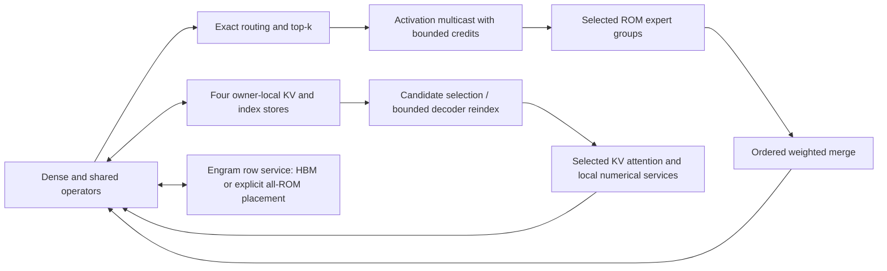

# DeepSeek V4.1: first-principles ROM/HBM redesign

**Updated objective:** the user subsequently retained **100 µs/token** as an
explicit feasibility target for wafer-scale and reticle-scale designs. Earlier
statements below that no target is selected describe the prior analysis stage.
The 40 µs expert sub-budget remains adjustable. See the
[physical limits study](DEEPSEEK_V41_PHYSICAL_LIMITS.md) for current scope.

Date: 2026-09-23. Status: **architecture candidate; feasibility unresolved**.
This is a separate design study, not a scaled Qwen machine. The scope is the
repository's pinned DeepSeek-V4.1-Flash model and its declared formats. It does
not claim to cover an unspecified V4.1 model variant. No new RTL implementation
or workload simulation is performed by this study.

**Latency-budget clarification:** the 100 µs token and 40 µs routed-expert
allocations below are sensitivity probes, not requirements. The checked routed
inventory is 4.512 GB/token; 112.8 TB/s follows only when serviced in 40 µs.
Start with the [traffic recalculation](DEEPSEEK_V41_TRAFFIC_RECALCULATION.md)
for the derivation, local-versus-external traffic distinction and latency sweep.
No final token-latency target has been selected.

## 1. Recommendation

Evaluate a **hierarchy of ROM expert groups with shared local compute**, coupled
to **owner-local CSA2 KV/index services**, and keep **Engram in a separately
accounted memory tier**. Use dense operator clusters between expert dispatch and
merge, and implement the same compute/numerical contracts in a strong HBM design.

The primary engineering candidate places ordinary immutable matrices in ROM and
Engram in HBM. Retain an all-ROM variant to validate full immutable placement and
its latency/energy tradeoff. Both are important: moving Engram out of ROM saves
capacity, but does not prove a several-fold performance advantage. Immutable
matrix execution remains the primary ROM validation in the hybrid variant.

Do not fix a die/wafer count or promise a 100 µs token before proving active-layer
bank service, numerical recurrence and communication. **100 µs is a design probe,
not an accepted target.** The pinned reference uses independent 32-value expert partials; this provides
a parallelization opportunity, but numerical and physical qualification is open.

## 2. Model inventory that drives the design

The pinned inference configuration and model profile agree on:

| Property | Value |
|---|---:|
| Layers | 40: 20 encoder, 20 decoder |
| Hidden width | 5,120 |
| Routed experts per layer / selected | 384 / 6 |
| Shared experts per layer | 1 |
| Expert intermediate width | 2,304 |
| Attention heads / dimension | 64 / 512 |
| Q low-rank width / O low-rank width | 1,280 / 1,024, with 8 O groups |
| Index heads / head dimension | 32 / 128 |
| Selected compressed entries | 512 |
| Sliding window | 128 tokens per layer |
| Reindex candidate bound | 2,048 blocks × 8 = 16,384 entries |
| Full checkpoint storage | 510.286 GB |
| Engram storage | 202.758 GB, 39.73% of checkpoint |
| Checkpoint with Engram elsewhere | 307.528 GB |
| Active ordinary decode weight bytes | 13.035 GB/token |
| Active routed expert weight bytes | 4.512 GB/token |
| Engram lookups | 48 rows × 264 B = 12,672 B/token |

Storage is packed checkpoint accounting, including retained draft/resident-only
objects; it is not active arithmetic demand. The metadata's aggregate parameter
counts do not replace byte inventory. Ordinary decode excludes speculative draft
work; if draft weights remain resident their capacity is still charged. Removing
them requires a new explicit deployment inventory.

A layer's expert bank holds 7.219 GB, but the selected six read only 112.804 MB.
Only **1.5625% of expert IDs are active for one token at a layer**. Installed
capacity and installed bank bandwidth therefore cannot be multiplied into a
single-token service rate without an access/placement proof.

## 3. Architecture and placement

**Expert groups.** Store multiple experts in a group's ROM and share its arithmetic
among active experts. Stripe each selected expert's K/output tiles over enough
independent local banks; a single expert must not be confined behind one narrow
port. Conversely, do not provide a full high-throughput compute engine for every
cold expert by default. Choose experts per group from worst-case simultaneous
selection and physical distance, then price collisions and queueing.

Map shared/dense operators near their consuming layer groups. Dense matrices are
read every token, so locality and persistent caching matter on both ROM and HBM.
Use explicit output and K-block placement, format/scale ownership, and deterministic
partial-reduction trees. A group may share compute across several layers, but the
activation route and the active layer's bank supply must be charged. A layer-local
organization leaves other layers' compute idle for a single user; a shared-compute
organization spends more on weight transport. Sweep that tradeoff rather than
crediting both perfect locality and global compute utilization.

**Traffic separation.** Keep weights local; multicast input activations only to
selected experts and broadcast shared operands along bounded trees. Return tagged
expert outputs, multiply by exact routing weights and merge in the required slot
order. Credit allocation must guarantee that faults, returns and acknowledgement
traffic can drain. Use separate control and data resources or proven arbitration.
No global collective over all capacity dies is necessary for every expert output.

**Single-token latency versus concurrency.** Multiple users can activate different
experts and make better use of capacity, but hot experts determine queue depth.
Use actual router traces when available; the current model labels router evidence
synthetic. Evaluate adversarial concentration in addition to uniform routing.
A pipeline can increase aggregate throughput without shortening a user's traversal.
Do not divide token latency by the number of occupied pipeline stages.

### Expert concentration changes the group choice

The executable [expert-group screen](../results/architecture/v41_expert_groups.json)
now tests arbitrary distinct six-expert routes and concentrated concurrent users.
For a **1 µs expert-layer allocation**, assume equivalent independent 256 B/cycle
ports, 1 GHz and 65% delivered bandwidth. These are illustrative requirements,
not characterized ROM macros. One packed expert needs 113 such ports. For a group
containing S experts, the worst single-user demand is `min(S, 6)` expert jobs;
across U unbatched users it is `U × min(S, 6)`.

| Experts/group | Groups/layer | ROM/group | Ports/group for worst route | Installed ports/layer |
|---|---:|---:|---:|---:|
| 1 | 384 | 18.80 MB | 113 | 43,392 |
| 6 | 64 | 112.80 MB | 678 | 43,392 |
| 16 | 24 | 300.81 MB | 678 | 16,272 |
| 64 | 6 | 1.203 GB | 678 | 4,068 |
| 384 | 1 | 7.219 GB | 678 | 678 |

Each group is independently provisioned for its own possible worst route; the
last column does **not** imply all groups are simultaneously hot. At 40 fully
separate layer placements, the 16-expert case installs 650,880 equivalent ports,
and the 64-expert case 162,720. Sharing them across layers requires a different
weight placement/interconnect and cannot be credited for free.

Pooling beyond six experts reduces provisioned service replication, but enlarges
the ROM region that must deliver to shared compute. At the assumed density and
2% reserve, 64 experts alone occupy about 131 mm² of ROM; a full layer about
785 mm², leaving almost no room on an 815 mm² die for its compute and wiring.
A full-layer group is therefore a bandwidth-pooling extreme, not a recommended
single-die implementation. Independent narrow banks per expert would also lose
the pooling benefit: all selected experts must access enough of the shared ports
through a demonstrated conflict-free layout. Packed profile bytes already include
the declared storage inventory; BF16-expanded storage would require a new budget.

A group sized for only one expert per microsecond can take six service intervals
when all selected experts land there. A queue preserves work but does not recover
the one-microsecond deadline. Four simultaneous unbatched users can demand 24
expert jobs in that group, or 451.215 TB/s. Batching the same expert can reuse
weights, but still needs separate compute and response-latency accounting.
Router traces are currently synthetic; uniform routing is not an acceptance case.

**Refined design decision:** carry 16- and 64-expert pooled groups as physical
study candidates, without selecting either. Reject a single-expert-width shared
engine as a guarantee of the 1 µs budget for arbitrary routes. Require a bank map,
local reduction/compute allocation, and bounded dispatch/return service for six
selected experts before accepting either group size. This is a necessary byte
service check; the numerical qualification below still applies even if it passes.
Reproduce with `python3 tools/audit_v41_expert_groups.py`.

## 4. Numerical structure: correction from the pinned reference

**Correction:** the whole-K bounds below describe a conditional lane mapping,
not a universal V4.1 dependency floor. Inspection of the pinned vendor kernel
shows independent 32-value expert partials. The architecture must follow that
structure before deciding whether recurrence rejects a target.

The selected experts can run in parallel, and their gate/up projections can run
in parallel. The down projection still depends on their nonlinear result. An
optimistic expert-only bound for a sequential grouped recurrence is:

`40 × (ceil(5120/g) + ceil(2304/g)) / clock`,

where g is the number of products per dependent rounded update. At 1 GHz and
one dependent update per cycle:

| g | Expert-only dependency floor |
|---|---:|
| 1 | 296.96 µs |
| 2 | 148.48 µs |
| 4 | 74.24 µs |

These omit shared experts, dense attention projections, routing, SiLU/clamping,
normalization, memory, communication and merge. Pipeline recurrence longer than
one cycle increases this bound. Native g4 support and the official numerical
contract must be checked; g4 is not automatically scalar bit equivalence.

Thus this whole-K g4 mapping does not fit a 40 µs expert allocation inside a
speculative 100 µs token. More output lanes alone do not fix that mapping.
The pinned reference already supplies independent K blocks; exploit them while
qualifying the local reduction and scale behavior. The
Qwen counterexample demonstrates why arbitrary reassociation cannot be declared
exact. Derive the V4.1 reference's actual scale, accumulation and rounding rules
before accepting any blocked alternative; matching a modified simulator is not
independent qualification.

For a 40 µs total expert allocation, each dependent layer gets 1 µs. That requires
**112.8 TB/s of active-layer expert delivery** and **424.7 TOp/s of arithmetic**.
At four products/update, 1 GHz and 65% utilization, it requires **81,668 physical
lanes in the active layer's compute group**. Each selected expert needs 18.8 TB/s
of local weight service. These are demanding local requirements; dividing by the
entire installed wafer count would conceal the bottleneck.

### What the pinned sources actually establish

At revision `dba1be0a40aa45a94ad051997016db3960a90277`, vendor
`inference/kernel.py:506–554` sets routed `block_K = 32`, clears `C_local` between
blocks, performs `T.gemm` on each block, applies activation and weight scales,
and accumulates the scaled partials into `C_local_accum` in K order. Activation
scales can cover multiple weight blocks. Independent partial computation is
structurally available; arbitrary reassociation of the final partial sum is not
thereby authorized. The tensor-core internal association and compiler fusion of
scale/add expressions are not specified by this Python source alone.

There are several distinct numerical paths in this repository:

| Source | Arithmetic structure | What it establishes |
|---|---|---|
| Pinned vendor FP4 kernel | 32-value tensor-core partial, then scaled ordered accumulation | External algorithm structure; native FP4 path is not yet qualified by our oracle |
| `runtime/reference/swiglu.py`, `_execute_mxfp4_linear` | Scalar ordered FP32 products inside 32-value scaled blocks, ordered addition of block partials | A deterministic repository reference; not proof of vendor bit equivalence |
| `runtime/reference/matrix.py` dense FP8 | 128-value scalar partials, balanced final sum | A different dense reference association; do not apply it indiscriminately to experts |
| `ot_a3_lane_pipelined.sv` | g1/g2/g4 updates inside its configured contraction | g4 exists for E2M1 × E4M3; its existence does not establish end-to-end numerical agreement |
| `runtime/reference/deepseek_v41_oracle.py` | Vendor-documented FP8 expert recast | Current external comparison path; explicitly not a verified native FP4 verdict |

For a **candidate** that computes all independent scalar 32-product partials in
parallel and then adds them in order, an optimistic dependency-only schedule is:

`projection cycles = 32 × product_recurrence + (K / 32) × partial_add_recurrence`.

Gate/up have 160 partials per output; down has 72. With both recurrence latencies
set to L, six experts in parallel, gate/up parallel, and down dependent, forty
layers require `40 × [(32 + 160) + (32 + 72)] × L` cycles:

| Recurrence latency L | Expert-only schedule at 1 GHz |
|---|---:|
| 1 cycle | 11.84 µs |
| 2 cycles | 23.68 µs |
| 3 cycles | 35.52 µs |

This is a conditional dependency screen with unlimited independent partial
engines, not a performance forecast or a universal vendor lower bound. It omits
scale/quantization service, nonlinear activation, finite compute and partial
storage, communication and other operators. At L=3 it leaves only 4.48 µs in the
40 µs expert allocation for all omitted expert service, so the margin is narrow.
The physical design must price the engines and buffering needed to realize it.

**Updated decision:** pursue parallel native-size partials with an ordered final
accumulator as the next feasibility candidate. Do not introduce a free balanced
expert reduction or claim scalar/g4/tensor-core equivalence. A 40 µs allocation
is no longer rejected solely by the whole-K calculation, but remains unproven.
The same numerical architecture is available to the HBM comparator.

Source hashes and arithmetic are retained in
[v41_numerical_structure.json](../results/architecture/v41_numerical_structure.json),
reproduced by `python3 tools/audit_v41_numerical_structure.py` with the pinned
vendor snapshot installed. No workload or RTL simulation is needed for this audit.

### Finite resources: what the parallel-partial schedule costs

The [finite-resource audit](../results/architecture/v41_partial_resources.json)
now charges gate/up and down separately, taking the maximum of compute, ordered
partial-add service, ROM service and numerical dependency within each phase,
then summing the two dependent phases. This assumes whole-producer dependencies;
it does not credit unproven gate-to-down streaming. MAC here means one product
and accumulation, or two arithmetic operations.

Six selected experts in one layer require:

| Resource demand | Quantity |
|---|---:|
| Scalar MAC updates | 212,336,640 |
| Native 32-value partials / ordered partial additions | 6,635,520 |
| Packed weights including scale inventory | 112,803,840 B |
| FP32 partial producer traffic | 26,542,080 B |
| Minimum average scalar lanes for 1 µs, 1 GHz, 65% utilization | 326,672 |
| Minimum average ordered-add lanes under the same assumptions | 10,209 |
| Minimum average equivalent 256 B/cycle ROM ports | 678 |

These scalar lanes replace the earlier **conditional g4** estimate of 81,668
for this numerical candidate. They are not interchangeable hardware counts.
Partial producer traffic is 26.54 TB/s at this deadline; writing and rereading all
partials would double the partial-memory traffic. A streaming schedule can avoid
full materialization but must prove its buffers, ordering and backpressure.
Gate/up full partial materialization is 17,694,720 B; down is 8,847,360 B.
Those phases can reuse storage; summing traffic does not imply both must remain
resident simultaneously.

At 524,288 scalar lanes and 16,384 ordered-add lanes, the necessary per-layer
bounds are:

| ROM ports | Recurrence | Necessary cycles at 1 GHz |
|---|---:|---:|
| 678 | 1 cycle | 999.864 |
| 678 | 3 cycles | 999.864 |
| 1,024 | 1 cycle | 662.019 |
| 1,024 | 3 cycles | 888.000 |

The minimum 678-port provision leaves virtually no margin in a 1,000-cycle
allocation. Provisioning 1,024 ports opens arithmetic margin but does not prove a
real schedule. The utilization assumptions, bank access, scale service, nonlinear
latency, dispatch and merge are still unqualified. With only 4,096 ordered-add
lanes, partial addition alone exceeds the deadline even with 524,288 scalar lanes
and 1,024 ports.

To expose the gap between service totals and scheduling, the audit also gives a
simple explicit arithmetic schedule: allocate one scalar partial engine per
32-value block for a batch of output rows, finish those partials, accumulate them
in order, then advance to the next batch. Reuse resources between gate/up and down.

| Output rows per batch | Peak scalar partial engines | Layer cycles, L=1 | Layer cycles, L=3 |
|---|---:|---:|---:|
| 2,048 | 327,680 | 4,248 | 12,744 |
| 8,192 | 1,310,720 | 1,184 | 3,552 |
| 16,384 | 2,621,440 | 592 | 1,776 |
| All outputs | 4,423,680 | 296 | 888 |

These are arithmetic-only schedules with ideal operands, not full latency upper
bounds. This conservative batch schedule is inefficient: its failure is not a
proof that every possible schedule fails. It shows why average lane counts do
not demonstrate the claimed performance. A practical candidate must overlap
partial production and ordered consumption with bounded buffers and shared lanes,
rather than instantiate millions of engines to recover the unlimited-parallelism
number. At L=3, even the unlimited arithmetic schedule uses 888 cycles before
omitted service.

**Decision:** retain the 1 µs expert-layer allocation only as a feasibility probe.
Next derive a finite streaming schedule and its buffer/port assignment. No area
closure is claimed: the Qwen tile-area seed does not characterize this different
scalar-partial and ordered-accumulator organization. Characterize its compute,
SRAM, ROM ports and wiring before selecting group size or die count. These resource
requirements apply equally to the HBM arithmetic comparator.

Reproduce with `python3 tools/audit_v41_partial_resources.py`. This is static
arithmetic and schedule construction, with no workload or RTL simulation.

## 5. KV and index architecture follows ownership

The four KV owners are layers **2, 8, 14 and 20**. Encoder owners use ratio-two
compression; the decoder's layer-20 owner supplies global KV at ratio one. There
are eight index-producing/reindex layers: **2, 8, 14, 20, 24, 28, 32 and 36**.
The four later decoder reindex stages are capped at 16,384 candidates.

Place each compressed KV/index object with its owner service. Reuse layers hold
references, not independently updated copies. Cache selected rows/candidates near
consumers, with explicit generation identity and immutable publication order.
Layer 20 also creates the candidate block set. Do not perform a full-context
index scan in every decoder layer or count reused KV as forty independent caches.
Keep each layer's sliding window local and separate from the shared compressed
store. Preserve candidate tie rules, duplicate handling and bounded reads.

The profile prices 890 bytes of shared main/index capacity per context position:
about **178 MB at 200K**, **890 MB at 1M**, before windows, allocator/ECC/metadata,
recurrent compressor state and replication. This is much smaller than immutable
weights but can be a concentrated bandwidth hotspot. Capacity efficiency does
not imply free multi-consumer delivery.

| Decode context | KV reads/token, all-ROM Engram scenario | Index-score items/token | Required index-item rate for 100 µs |
|---|---:|---:|---:|
| 8,192 | 11.928 MB | 1.704 million | 17.04 Gitems/s |
| 200,000 | 46.763 MB | 18.097 million | 180.97 Gitems/s |
| 1,000,000 | 182.763 MB | 82.097 million | 820.97 Gitems/s |

The HBM-Engram scenario adds 12,672 bytes to the charged mutable-memory path.
These are analytical inventory values, not a complete measured bus ledger.
An index item is not one MAC: expand dot products, head aggregation and selection
before sizing lanes. Preserve reference formats during key/query conversion.

## 6. Numerical, selection and hyper-connection services

At the 200K inventory point, the 100 µs design probe requires approximately:

- 15.73 Gattention-score items/s for 1,572,864 score elements/token;
- 6.60 Gnonlinear items/s;
- 5.71 Gnormalization items/s;
- 5.91 Gtop-k candidates/s;
- 256 M Sinkhorn element-iterations/s (1,280 elements × 20 iterations/token).

These different operations must not be summed or treated as equivalent scalar
instructions. Derive real dependency paths for sqrt-softplus routing, SiLU and
clamping, FP32 softmax, normalization and the four-way hyper-connection/Sinkhorn
work. Twenty dependent Sinkhorn iterations cannot be parallelized by multiplying
an element count by a global lane rate.

Use certified pipelined numerical services with exact fallback only if their
reference semantics, endpoint interfaces, ambiguity rate and worst-case queueing
are proven. Reuse deterministic intermediates where their lifetime and value are
identical. Share hardware only when the demand schedule leaves adequate capacity.
The existing serial function engines remain correctness anchors, not presumed
high-throughput implementations. Explicitly price head-of-line blocking and the
slowest fallback on the layer critical path.

## 7. Engram should have its own placement decision

Engram is 39.73% of the checkpoint but only 12.7 KB of nominal lookups per token.
Placing it all in high-bandwidth ROM compute regions is unlikely to be the best
capacity/performance allocation. The primary candidate uses HBM for Engram,
with a cache and banked gather engine at layers 1 and 14. Hash, gather, dequantize,
projection/gating and completion must all be charged. Low bytes do not imply low
latency: 48 random rows have transaction granularity, row conflict, network and
response-tail costs. Coalesce only where exact row identity permits it.

Retain an all-ROM row-addressed Engram option. It needs ROM capacity/repair and
random-row latency qualification but not expert-GEMM compute behind every row.
A host-resident alternative is a separately labeled system with measured host-link
service and matching comparator placement; it is not a free storage tier.

## 8. Capacity screen and why die count is not selected yet

Using existing assumed N5 ROM density, a 2% capacity reserve and 815 mm² planning
dies gives these **capacity-only lower counts**:

| ROM allocation per die | All-ROM checkpoint | Engram in HBM |
|---|---:|---:|
| 300 mm² | 186 dies | 112 dies |
| 400 mm² | 139 dies | 84 dies |
| 500 mm² | 112 dies | 67 dies |

These omit image/alignment reserves, replicas and exact bank allocation and do
not establish that the remaining area fits compute, SRAM, reduction, PHYs, control
or wiring. They should not be used as a finished chip count. At 400 mm²/die,
84 dies are about 68,460 mm² of logic silicon; 139 are about 113,285 mm². Packaging,
wafer defects/repair and inter-region boundaries materially affect the result.

The immediate search variables are ROM area fraction, experts per service group,
active banks per expert, compute reuse across layers, dense-operator replication,
KV-owner locality, Engram tier and group-to-group link topology. Enforce capacity,
active service and numerical dependencies together. Discard any candidate that
fits bytes only by assuming inactive regions contribute active bandwidth.

## 9. A fair HBM redesign and the several-fold objective

See the [target-free speedup conditions](DEEPSEEK_V41_SPEEDUP_CONDITIONS.md)
for the full-weight versus expert-only distinction, persistent-cache sensitivity,
and the unchanged-work limit on a 3× improvement. Expert bytes are only 34.6%
of the current active weight inventory; accelerating them alone does not
establish the system objective.

The HBM candidate uses persistent SRAM for dense/hot weights, bounded expert-tile
prefetch after routing, many independent HBM channels, and tiled GEMM reuse for
batches. Quantization scales and tails travel with weights. Keep KV owners and
Engram row engines just as optimized as in the ROM variant. Trace expert popularity
before selecting cache capacity; arbitrary future experts are not known before
the route result, and speculation consumes real bandwidth.

The active 13.035 GB/token gives the following ideal *uncached weight* bounds at
4.5 TB/s per hypothetical HBM die:

| HBM dies | Weight service floor | ROM target sufficient for 3× against that bound |
|---|---:|---:|
| 8 | 362.1 µs | ≤120.7 µs |
| 16 | 181.0 µs | ≤60.3 µs |
| 32 | 90.5 µs | ≤30.2 µs |
| 80 | 36.2 µs | ≤12.1 µs |
| 96 | 30.2 µs | ≤10.1 µs |

These are **not achieved HBM times or necessary ROM targets**. Real HBM execution
can be slower because of compute, communication and dependencies; cache can
reduce external weight bytes and invalidate this uncached bound. They illustrate
why comparing an 84–139-die ROM design only against eight HBM dies is not an
iso-area validation. Equal-area HBM may afford many more ports or more SRAM;
equal-power may permit fewer active resources. Evaluate both boundaries honestly.

A 3× advantage remains a requirement to test, **not a demonstrated feasibility
result**. ROM's plausible advantage is lower local weight latency/energy and
better use of storage area, especially with expert-local execution. The common
numerical dependency floor must be addressed on both systems; otherwise it can
hide much of the memory advantage. Do not assume all HBM bandwidth is concurrently
usable either—prove its placement and critical path under the same rules.

## 10. Prefill, speculation and additional scope

V4.1 prefill is not forty layers of ordinary decode applied to every prompt token.
Under CED, the twenty encoder layers plus decoder KV projection process the
prompt; the decoder performs bounded replay of the last 128 tokens. Build that
separate dependency/work graph and use matrix reuse. Keep encoder throughput,
first-token latency and steady decode latency separate.

Speculative/DSpark work needs draft execution, acceptance distribution, verification
and rollback accounting. Resident draft bytes already appear in the inventory;
no speculative tokens/s credit is taken here. The official inference configuration
also contains vision modules; those require a separate payload/work inventory and
service budget if they are part of the admitted deployment. This text does not
silently declare them implemented by the text-decode design.

## 11. Feasibility-first implementation gates

1. Freeze the deployment inventory and per-operator numerical contracts against
   pinned reference sources, including shared/reused objects and scale formats.
2. Derive complete per-layer dense, expert, attention, index, hyper-connection,
   Engram and selection work/traffic/dependencies; audit overlapping categories.
3. Enumerate local bank/compute/reduction placements. Prove active-region service,
   capacity, queue space and critical-path bounds, including skewed expert routes.
4. Evaluate the all-ROM and HBM-Engram variants against optimized HBM at equal
   area and equal power, with warm-cache and batch/context sensitivity.
5. Check macro density/ports/PVT/energy, local wire cost and physical collective
   latency. No transfer of ASAP7 clocks or sky130 density into N5 signoff.
6. Only for a surviving configuration, implement a complete selected-expert path
   and a KV-owner/reuse/reindex path, then qualify numerical services and integrate.
   Do not start this step while feasibility gates remain unresolved.

The first calculation is committed in
[v41_architecture_feasibility.json](../results/architecture/v41_architecture_feasibility.json),
reproduced with `python3 tools/audit_v41_architecture_feasibility.py`. It verifies
key official/profile geometry, separates resident and active bytes, derives expert
recurrence and local service requirements, and reports capacity/HBM sensitivities.
It is an auditable start to the full redesign; it does not certify a feasible die
configuration, numerical amendment, final latency or energy advantage.
