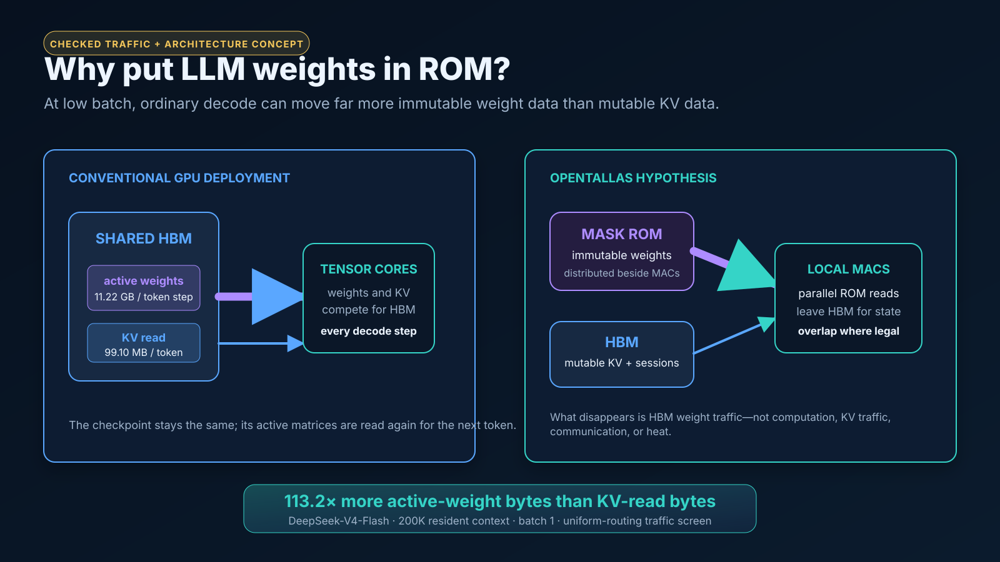
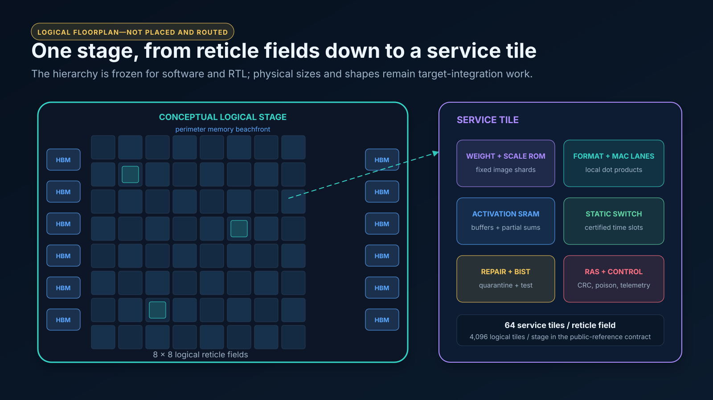
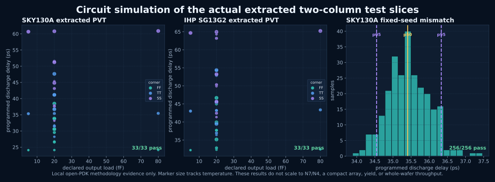
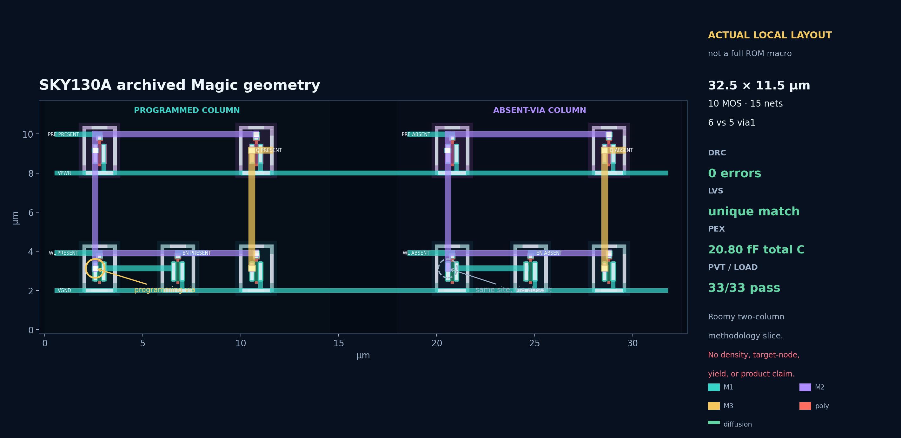
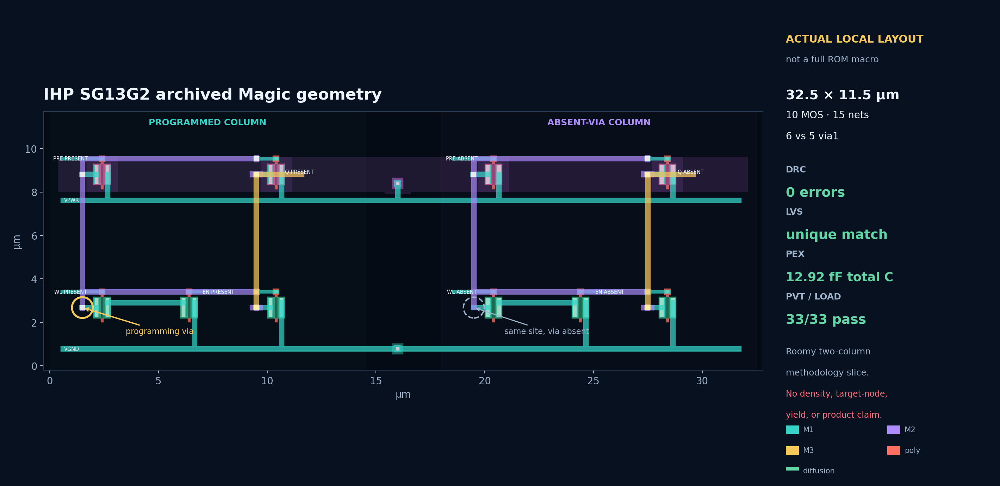
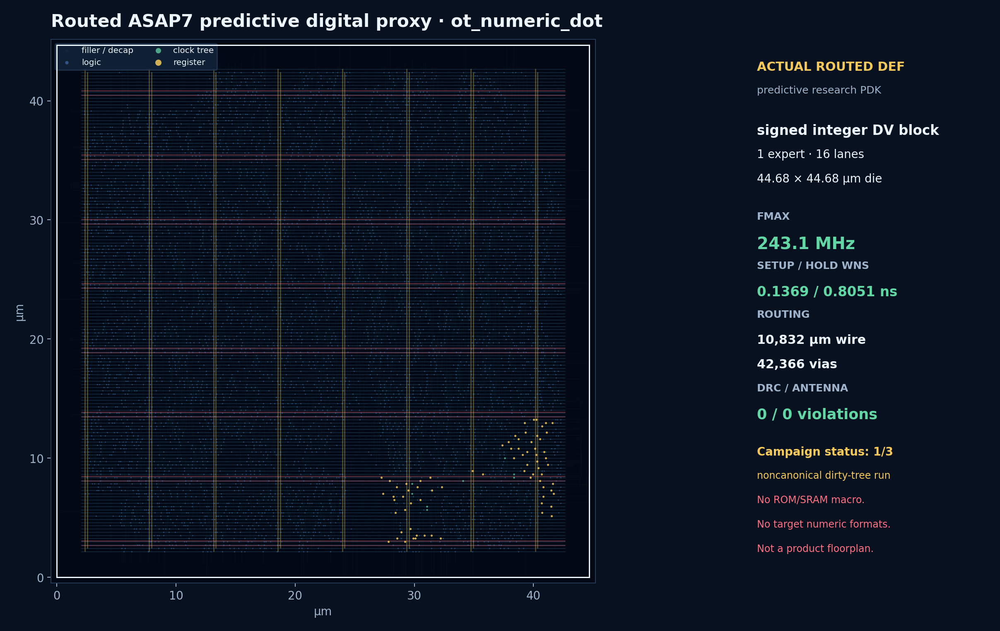
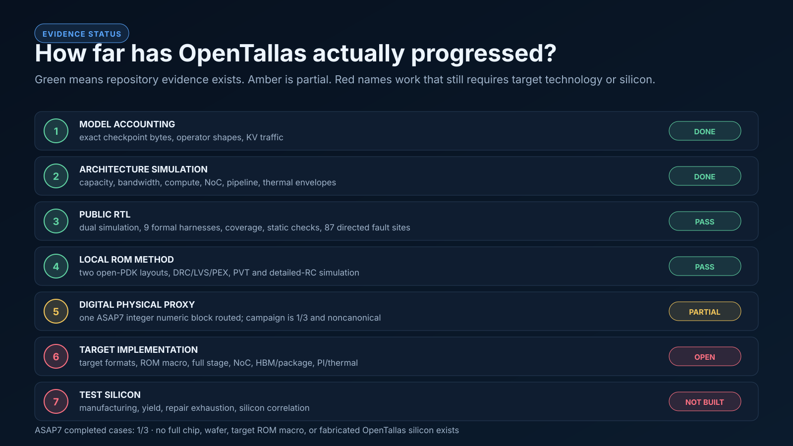

# OpenTallas, in plain English

[Why speed matters](VISION.md) · [Performance results](../README.md#performance-comparison) ·
[Documentation map](README.md) · [Specification](../spec/README.md)

Taalas reports that its fabricated HC1 accelerator generates **16,960 tokens/s** <!-- figure: 16,960 src="configs/hardware/technology.json#reference_parts.taalas_hc1.published_tokens_s_per_user.value" name="Taalas HC1 published per-user rate, overview" -->
per user on Llama 3.1 8B at batch one.
The result is first-party rather than independently benchmarked, but it makes
the central opportunity concrete: model-specific inference hardware can deliver
an order-of-magnitude change in interactive generation speed.

OpenTallas is an independent open research project that investigates how such
an architecture works, where its advantage comes from, and what would have to be
true for it to scale to larger models and longer contexts. It connects model
accounting, architecture studies, compiler/runtime semantics, public-reference
RTL, and circuit experiments. It is not a fabricated chip, a tapeout-ready
floorplan, or a measured product.


> **Current status:** model accounting, analytical architecture studies,
> synthesizable public-reference RTL, open-tool verification, local open-PDK ROM
> methodology slices, and one small predictive-PDK routed block exist. A target
> ROM macro, full physical stage, package, target numerical implementation, and
> OpenTallas silicon do not.

## The core idea in thirty seconds

An LLM generates each new token by reusing the same trained weight values with
new activations and an updated KV cache. GPUs keep the weights in writable HBM
because a general-purpose accelerator must be able to load a different model.
At low batch sizes, however, moving those weights from HBM again for every token
can take more time and energy than the arithmetic.

OpenTallas trades some of that flexibility for locality:

- **A conventional GPU** can load many models and update them freely, but must
  repeatedly service model-weight traffic from HBM.
- **An OpenTallas deployment** encodes one model representation's immutable
  weight bits and scales in local mask ROM. HBM remains available for the KV
  cache, activations, routing, and session state.
- **The computation still happens.** ROM does not remove attention, matrix
  multiplication, KV traffic, reductions, synchronization, power, or cooling.
- **Changing the checkpoint is expensive.** A materially different weight image
  requires different mask data or a separately justified personalization method.

OpenTallas is therefore aimed at mature, high-volume inference checkpoints—not
training, rapid fine-tuning, or a general replacement for GPUs.

## Why the speed matters

The objective is not speed for its own sake. A high token rate can spread fixed
infrastructure cost across more useful output, lowering the modeled cost per
token when utilization and system assumptions hold. It can also move reasoning
into the interactive loop: agentic projects can compress from minutes toward
seconds, and computer-use, robotics, voice, and generative interfaces can react
while their environment is still current.

If the same architectural principle transfers to video and world models, it
could also support continuously generated interactive environments rather than
offline clips. These applications depend on end-to-end latency, quality, safety,
and system integration—not tokens per second alone. The detailed argument and
its limits are in [Why instantaneous inference matters](VISION.md). The
[recent-world-model decode-shape audit](../results/world-model-landscape/REPORT.md)
tests that transfer against dated Atlas/RTFM source records and commit-pinned
open implementations;
it finds that causal history reuse helps algorithmically, but current spatial
query blocks generally remain compute-bound and therefore hide ROM weight
service.

### A small glossary

| Term | Plain-language meaning |
|---|---|
| Token | A model's unit of text, often a word fragment. During decode, one user normally receives tokens sequentially. |
| Weight | A trained numerical constant. The weight values are reused while activations and session state change. |
| KV cache | Per-session attention state retained from earlier tokens; it grows with context length and must remain writable. |
| HBM | High-bandwidth memory, usually stacked beside a processor package. It is writable and flexible, but capacity and bandwidth are shared resources. |
| Mask ROM | Read-only memory whose bits are encoded in manufacturing geometry. It can be read after fabrication but is not rewritten like RAM. |
| RTL | Synthesizable source code describing digital registers, logic, and their cycle-by-cycle behavior. |
| PDK | A process design kit: device models and layout rules for a semiconductor manufacturing process. A predictive PDK is research collateral, not a foundry process. |
| DRC / LVS / PEX | Checks that geometry obeys layout rules, matches its circuit schematic, and yields an extracted circuit including parasitics. |
| Per-user tokens/s | The generation rate seen by one active sequence. It is different from aggregate service throughput across many users. |

## Why language-model inference fits this architecture

Autoregressive decode has three properties that make the architecture worth
investigating:

1. **The same large weight set is reused for every generated token.** A busy
   service can reuse it billions of times over a checkpoint's useful life.
2. **Decode is sequential for each user.** At low batch, there is less opportunity
   to amortize one weight read across many independent users than in a large
   throughput batch.
3. **Most weights are immutable while the KV cache is not.** This makes a physical
   split between ROM weights and writable HBM state conceptually clean.

Mixture-of-experts models add a useful wrinkle: only selected experts are active
for a token. OpenTallas keeps expert identity and routing explicit rather than
pretending that every expert is read on every step.



### A concrete traffic example

For the checked DeepSeek V4 Flash representation at 200,000 resident context
tokens and batch one, the hardware-independent inventory reports:

| Per generated token | Checked traffic | previously published |
|---|---:|---:|
| Expected active weight read | 11.2176 GB | 11.2176 GB (unchanged) | <!-- figure: 11.2176 src="results/model-traffic/sweep.csv#active_weight_read_bytes_per_step" where="model=DeepSeek-V4-Flash-0731;context_tokens=200000;batch_size=1" scale="1e-9" name="Flash weight read/token, GB" -->
| KV read | **317.4564 MB** | ~~99.1018 MB~~ | <!-- figure: 317.4564 src="results/model-traffic/sweep.csv#kv_read_bytes_per_user_token" where="model=DeepSeek-V4-Flash-0731;context_tokens=200000;batch_size=1" scale="1e-6" name="Flash KV read/token, MB" -->
| Weight/KV-read ratio | **35.3358×** | ~~113.2×~~ | <!-- figure: 35.3358 src="results/model-traffic/sweep.csv#weight_to_kv_read_ratio" where="model=DeepSeek-V4-Flash-0731;context_tokens=200000;batch_size=1" name="Flash W:KV at 200K, B=1" -->

Those values come directly from
[`results/model-traffic/sweep.csv`](../results/model-traffic/sweep.csv) — row
`DeepSeek-V4-Flash-0731, 200000, 1`, columns `active_weight_read_bytes_per_step`
= 11,217,572,060, `kv_read_bytes_per_user_token` = 317,456,384 and
`weight_to_kv_read_ratio` = 35.33578981 — with the derivation explained in
[`results/model-traffic/REPORT.md`](../results/model-traffic/REPORT.md).
Regenerate both with `make model-traffic`.

> **RETRACTED: 113.2×.** The KV model's per-entry constants were corrected on
> 2026-08-30 (`entry_bytes` 583 → 1,024, `index_entry_bytes` 68 → 256) and an
> index-scan threshold at 8,001 tokens was withdrawn as an instrumentation
> artifact. DeepSeek KV read per token rose 3.20×, so the ratio fell from 113.2×
> to 35.3×. The corrected figure is independently confirmed by an **execution**
> of the released implementation at 200,000 tokens:
> [`results/abi3/deepseek_v4_reference_oracle_context_ladder.json`](../results/abi3/deepseek_v4_reference_oracle_context_ladder.json)
> → `context_ladder_summary.rungs[4]` measured 317,435,904 KV bytes per decode <!-- figure: 317,435,904 src="results/abi3/deepseek_v4_reference_oracle_context_ladder.json#context_ladder_summary.rungs[workload=TA-DS-CTX-200K-1].measured_kv_bytes_per_decode_step" name="executed KV bytes per decode step at 200K" -->
> step and reports `weight_to_kv_read_ratio_at_this_context` = 35.335. <!-- figure: 35.335 src="results/abi3/deepseek_v4_reference_oracle_context_ladder.json#context_ladder_summary.rungs[workload=TA-DS-CTX-200K-1].weight_to_kv_read_ratio_at_this_context" name="executed W:KV at 200K" -->

The 35.3× ratio is **not** a 35.3× speedup claim. It only identifies an unusually
large traffic term that a local immutable store could attack. The full result
still has to satisfy ROM service, HBM service, computation, communication,
capacity, power, cooling, and pipeline constraints.

### Why ROM rather than simply more SRAM or HBM?

HBM is valuable because it is writable and capacious, but every weight byte has
to cross a finite package/memory interface. On-chip SRAM is fast and writable,
but storing hundreds of gigabytes in SRAM consumes much more silicon area than
the architecture can casually assume. Mask ROM gives up rewritability and model
generality in exchange for the *possibility* of denser immutable storage and many
local read banks beside arithmetic.

That possibility is the architectural hypothesis, not a measured target-node
fact. ROM is not automatically fast merely because it is ROM. A real design must
show a compact macro, sense margins, sustained concurrent reads, power integrity,
repair, yield, and thermal closure. Embedded flash, eFuse, 3-D ROM, or other
nonvolatile choices would each need their own foundry-supported density, update,
test, and reliability study; OpenTallas does not silently substitute one for
another.

### Where the advantage becomes weaker

The hypothesis is strongest when a checkpoint is stable, utilization is high,
batch is small or moderate, and weight reads dominate mutable-state traffic. It
weakens when:

- a model or quantization format changes before mask/NRE cost can be amortized;
- training, fine-tuning, or arbitrary weight updates are required;
- large batches let a GPU amortize each weight read across many users;
- very long contexts make KV traffic and capacity dominant;
- collectives, arithmetic, power delivery, cooling, or package bandwidth bind
  before weight service does;
- demand is too small to justify model-specific silicon; or
- prefill or speculative decoding—not ordinary target decode—is the main workload.

This is why the repository sweeps context, batch, model, and hardware envelopes
instead of treating one headline point as universal.

## What happens to one token

The intended ordinary-decode path is:

1. The host submits a command bound to a model-image identity, session, token
   position, schedule epoch, and repair-map generation.
2. A stage acquires that session's layer-local KV/state shard from HBM.
3. Attention or recurrent state service runs, and an MoE layer obtains and checks
   its selected expert IDs.
4. The activation and route record are broadcast on a deterministic schedule.
5. Enabled dense/shared and routed-expert weight words are read from local ROM.
6. Tiles dequantize, multiply, accumulate, and reduce partial results in a frozen
   order.
7. The next layer's mutable state is committed only if the transaction has not
   been poisoned by an error.
8. The final hidden activation moves to the next physical stage or to an external
   terminal/sampling path.

The precise transaction contract is in
[`spec/ARCHITECTURE.md`](../spec/ARCHITECTURE.md). Tokenization, sampling policy,
API serving, and prompt prefill are deliberately outside the present performance
claim.

## How the logical machine is organized

The public architecture contract is hierarchical:

```text
deployment
└── one or more pipeline stages
    └── 8 × 8 logical reticle fields per stage
        └── 64 service tiles per field
            ├── weight and scale ROM shards
            ├── format/dequantization and MAC lanes
            ├── activation and partial-sum SRAM
            ├── deterministic switch/reduction endpoint
            └── repair, BIST, RAS, and control
```

That is 4,096 **logical** service tiles per public-reference stage. Reduced RTL
configurations preserve the protocols without pretending to instantiate a full
wafer. The diagram below is a teaching view of this hierarchy. It is deliberately
labelled as conceptual; its geometry is not a placement database.



The design rationale is to keep high-fanout immutable data near its consumers,
give mutable state a separate memory tier, and exploit a compile-time-known model
graph. Static schedules also make ordering and containment easier to reason about,
although real timing, congestion, repair paths, clocking, and power delivery still
require target physical design.

## What the current analysis says

The [analytical report](ANALYTICAL_REPORT.md) compares a redesigned
model-specific ROM machine with a general-purpose HBM machine, B200 or A100 on
NVLink, at equal silicon. Three results matter:

- **One user, large MoE model.** The ROM array is 2.3–5× faster per user at N5
  against B200. Most of that comes from specialisation: chip links built without
  a software stack, experts striped across ROM banks, and one layer per package.
  With the GPU's own NVLink, a ROM array roughly ties.
- **Many users, large MoE model.** With tens to about a thousand concurrent
  users, the gap widens to 2.8–8.5×. Every extra GPU user adds expert-weight
  reads; a ROM weight never moves.
- **Each side at its best.** Throughput differs by about 3×, and energy per
  token by 3–5× (13× on Qwen3-8B). At thousands of users both machines run out
  of arithmetic, and dense-KV models narrow the gap.

A small dense model such as Qwen3-8B is the extreme case. It fits on a few ROM
dies, so a single user runs about 19× faster than on B200, in line with the
Taalas HC1 part the model is checked against.

## What has actually been simulated or implemented

OpenTallas has several evidence layers. They answer different questions and
cannot be substituted for one another.

| Layer | Repository evidence | What it establishes | What it does not establish |
|---|---|---|---|
| Model accounting | Pinned configs, exact tensor-role inventories, operator shapes, KV and active-weight traffic | Reproducible work and storage counts for declared representations | Model quality, production routing traces, or achieved utilization |
| Architecture model | N7/A100 and N4/B300 iso-node sweeps over model, context, batch, and deterministic hardware envelopes (`results/iso-node/`), plus the N6/A100 and N5/B200 area-constrained roofline pair (`results/roofline/`), where both sides are held to equal silicon area and each chooses its own parallelism | Arithmetic consistency and sensitivity of the proposed dataflow; two validation gates against shipping parts | Measured ROM, GPU, package, thermal, cost, or product throughput. The A100 power gate passes at 1.15×; HC1 fails at 0.35–0.44× and its throughput reconstruction is capacity-infeasible, so every power/energy output remains a bounded model result rather than silicon evidence |
| NoC model | Cycle-approximate placement and hierarchical collective studies | Consequences of declared topology, payload, and schedule assumptions | Placed-and-routed target interconnect timing |
| Public RTL | Synthesizable `ot_*` hierarchy; Icarus and Verilator simulation; nine formal harnesses; static CDC/RDC checks; code/functional/FSM coverage; 87 directed RTL fault sites | Control, protocol, scheduling, integrity, containment, and reduced numeric-path behavior in the public-reference scope | A full target stage, macro integration, target formats, ATPG, or physical signoff |
| Open-PDK ROM method | SKY130A and IHP SG13G2 two-column layouts with local DRC/LVS/PEX, extracted PVT, and detailed-RC campaigns | A controlled-via ROM programming method can be laid out, extracted, and simulated in two public processes | Compact array density, target-node behavior, random-defect yield, or whole-wafer operation |
| Predictive digital physical proxy | One small `ot_numeric_dot` case routed in ASAP7 with timing/equivalence/DRC checks | Limited standard-cell and routing plausibility for that signed-integer block | ROM/SRAM, exact target formats, a stage/NoC, foundry signoff, or a complete campaign |

The campaign records—not this prose—are authoritative when results change.

## Circuit-level results and layout views

The transistor-level work uses deliberately roomy two-column test slices. One
column contains the programming via and one omits it, making the immutable bit
choice auditable. Both SKY130A and IHP SG13G2 variants have local zero-error DRC,
unique LVS, capacitance extraction, and 33/33 declared PVT/load cases. SKY130A
also has a 256/256 finite fixed-seed public-model mismatch campaign. Separate
detailed-RC campaigns cover five extraction styles and 165/165 electrical cases
per process.



These are the actual archived Magic geometries, rendered directly from their
`.mag` files—not generic “chip-like” artwork:

### SKY130A methodology slice



### IHP SG13G2 independent methodology slice



Neither process is used to scale a density or timing number into N7/N4. Their
value is methodological reproducibility and independent topology replication.

## The routed digital block

The view below is parsed from an archived final DEF for a small, one-expert,
16-lane signed-integer `ot_numeric_dot` block in the ASAP7 predictive research
platform. The retained case passed its declared timing, equivalence, detailed
route DRC, and antenna checks. It is one of three planned cases, was run from a
dirty worktree, and is therefore explicitly partial and noncanonical. It has no
ROM or SRAM macro and does not implement the target MXFP4/FP8/BF16/FP32 paths.



This is the closest current asset to the familiar “chip layout screenshot,” but
its label and scope matter more than its appearance.

## What exists today—and what does not



### Present in the repository

- exact released-representation storage, tensor-role, operator, and traffic
  inventories for the authoritative model studies;
- reproducible N7/A100 and N4/B300 analytical sweeps with component times,
  capacity endpoints, binding constraints, and uncertainty envelopes;
- a governed logical architecture, interfaces, numerical contract, firmware
  contract, RAS/repair/DFT plan, floorplan plan, requirements, and traceability;
- synthesizable reduced public-reference RTL and open-tool verification evidence;
- cycle-approximate NoC studies;
- two independently implemented local open-PDK ROM methodology slices and
  extracted circuit simulations; and
- one small routed predictive-PDK digital proxy.

### Not yet present

- a characterized target-node ROM bitcell or macro;
- a placed-and-routed full service tile, reticle field, stage, or wafer;
- target-format arithmetic PPA and numerical-quality correlation;
- extracted target NoC, clock, power-delivery, signal-integrity, HBM, package, or
  thermal closure;
- manufacturing defect, yield, repair-exhaustion, aging, or field-reliability data;
- a complete clean-baseline predictive physical campaign;
- measured A100/B300 runs for the exact declared deployment matrix; or
- fabricated OpenTallas test silicon or production silicon.

Consequently, the project can support “this architecture is specified, modeled,
and partially implemented in public proxies.” It cannot support “this chip has
been built” or “production silicon will deliver the central tokens/s number.”

## What evidence would change confidence most

The next meaningful gates are physical measurements, not more decorative
diagrams:

1. reproducible exact-model GPU baselines with HBM, compute, collective, power,
   and topology counters;
2. target-foundry ROM macro data for density, sustained read service, PVT/aging,
   sense margin, energy, repair, and DFT;
3. placed target-format arithmetic and a representative static NoC/clock cut;
4. HBM beachfront, package, power-delivery, cooling, and repair/yield studies;
5. compact-array extraction and a reticle-scale test vehicle; and
6. silicon correlation before any full-wafer product claim.

The owned questions and entry criteria are recorded in
[`results/PRE_NDA_READINESS.md`](../results/PRE_NDA_READINESS.md) and
[`docs/PRE_NDA_TECHNOLOGY_ROADMAP.md`](PRE_NDA_TECHNOLOGY_ROADMAP.md).

## Reproduce the public evidence

The analytical path is CPU-capable and does not download full model checkpoints:

```bash
python3 -m pip install -e .
python3 tools/profile_hf.py --all

make model-traffic     # results/model-traffic/  -- the traffic table above
python3 tools/run_roofline_studies.py --force  # results/roofline/ -- every figure in the analytical report
make roofline          # results/roofline/       -- the area-constrained pair

PYTHONPATH=src pytest -q tests/test_iso_node_studies.py tests/test_roofline.py
```

`make roofline` expands to `python3 tools/run_roofline_studies.py --force`. The
older iso-node study (`make iso-node`) now writes only the data that
implementation tools consume; its prose reports were retired.

**Every figure in this document is cited to one of those artifacts, by file and
by field or table-column name.** That is a rule now, not a habit:
[`docs/METHODOLOGY.md`](METHODOLOGY.md) §0. An audit on 2026-08-30 found 80 of
108 load-bearing figures across `docs/` stale, and found that the documents
which cited artifacts had self-corrected while the documents which cited nothing
had not.

Regenerate this visual gallery from the checked artifacts with:

```bash
python3 tools/render_public_assets.py
```

The full public RTL verification entry point is:

```bash
make verify
```

The open-PDK physical and SPICE campaigns require separately pinned PDKs and
tools; follow [`docs/OPEN_PDK_SELECTION.md`](OPEN_PDK_SELECTION.md) and the root
[`README.md`](../README.md) rather than treating the rendered PNGs as a substitute
for those runs.

## Suggested reading paths

For a non-specialist:

1. this overview;
2. the visual [`asset provenance contract`](assets/README.md);
3. the hardware-independent
   [`weight/KV traffic report`](../results/model-traffic/REPORT.md);
4. the [analytical report](ANALYTICAL_REPORT.md); and
5. the area-constrained roofline pair behind it,
   [`n6_vs_a100`](../results/roofline/n6_vs_a100/REPORT.md) and
   [`n5_vs_b200`](../results/roofline/n5_vs_b200/REPORT.md), each of which opens
   with a numbered "What the model says" list including its own retractions.

For an implementer:

1. [`spec/README.md`](../spec/README.md);
2. [`spec/ARCHITECTURE.md`](../spec/ARCHITECTURE.md) and
   [`spec/MICROARCHITECTURE.md`](../spec/MICROARCHITECTURE.md);
3. [`spec/NUMERICS.md`](../spec/NUMERICS.md),
   [`spec/FIRMWARE_COMPILER.md`](../spec/FIRMWARE_COMPILER.md), and
   [`spec/RAS_REPAIR_DFT.md`](../spec/RAS_REPAIR_DFT.md); and
4. the RTL, SPICE, and physical campaign records linked above.

For a reviewer of claims, start with
[`docs/METHODOLOGY.md`](METHODOLOGY.md),
[`docs/SOURCES.md`](SOURCES.md), and
[`docs/ASSUMPTIONS.md`](ASSUMPTIONS.md). They define which values are measured,
published, derived, assumed, or synthetic and where each type may be used.
