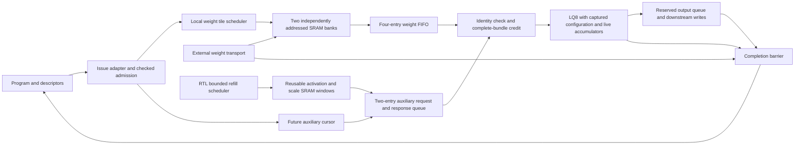

# Refined accelerator architecture and optimization report

Date: 2026-09-22. Status: architecture implementation in progress.
Implementation includes the G2 offset-alias correction after `46ec89f6`;
this report consolidates the completed checkpoints and next acceptance gates.

## Current review summary (2026-09-22)

The project has meaningful local optimizations and a substantially improved
runtime operand architecture, but significant system-level efficiency and
integration gaps remain. The implemented changes primarily qualify optional
G2/LQ8 runtime mode; they do not demonstrate an optimized accelerator across
all targets. The sections below retain historical checkpoints; this summary
supersedes their statements about running physical jobs.

The refined architecture separates operation admission, bounded tile transport,
local SRAM reuse, complete-operand issue credits, arithmetic and reserved output
drain. Tagged dual weight banks overlap refill with execution. Independent
auxiliary cursors and three reusable SRAM windows decouple memory latency from
compute. Generation ownership prevents stale responses from becoming current
operands; completion waits for queued outputs and external writes to drain.
These are implemented architectural improvements. Bounded resident-row weight reuse is now implemented (see the replay checkpoint
below); tiled multi-row scheduling and a complete deployment memory system remain planned.

| Verified change | Previous measurement | Refined measurement | Scope and limitation |
|---|---:|---:|---|
| Overlap weight refill and execution | 378,517 cycles | 326,833 cycles (13.65% lower) | Matched 92-case functional corpus; not model-token throughput |
| Right-size auxiliary queue | 2,560 bits, eight entries | 640 bits, two entries | 75% fewer payload/identity bits; 0.15% more cycles in the compared experiment |
| Reuse activation SRAM windows | 1,440 direct word deliveries | 480 activation fills | 66.7% less activation traffic for M=6,N=24,K=80; weights still repeat per row |
| Mapper synthesis area | 789.931 um² | 681.313 um² | 13.75% lower; adds one mapping startup stage |
| Scheduler synthesis area | 412.863 um² | 356.758 um² | 13.59% lower with unchanged planning latency |
| Mapper routed standard-cell area | 1,044.51 um² | 876.389 um² | 16.10% lower in initial optimized route; two fanout violations remain |

These comparisons use different experiments and must not be combined into one
system speedup. The latest recorded focused suite has 36 passing tests. The
loaded-program byte-transport campaign produces 584 matching accepted outputs
across success, faults, aborts and recovery. The broader LQ8 numerical regression
has 92 cases and 17,103 matching outputs. These are simulation results.

The completed ASAP7 TT routes at a 1 ns target are:

| Standalone design | Setup WNS (ns) | Hold WNS (ns) | Standard-cell area (um²) | Fanout violations |
|---|---:|---:|---:|---:|
| Baseline mapper | +0.103283 | +0.057078 | 1,044.510 | 0 |
| Optimized mapper, initial route | +0.391994 | +0.059846 | 876.389 | 2 |
| Optimized auxiliary scheduler | +0.118610 | +0.044861 | 468.208 | 4 |

All three report zero setup/hold, DRC, antenna, slew and capacitance violations.
The optimized routes therefore meet timing at this corner but do not yet pass
all physical checks. Their records retain overall `not_met`, also reflecting
failed pre-layout timing. No integrated G2 GHz claim follows. The mapper's flow
power estimate rises from 3.748 to 5.936 mW; this is not activity-qualified energy
per operation, and an energy improvement has not been established. Free-running
payload arithmetic needs workload-based switching evaluation. A smaller-clock-
cluster mapper reroute has been launched with the fanout limit held at 16; it
has now completed; see the clock-tree repair checkpoint below.

The two optimized route records and all seven retained artifacts per record
were checked against their hashes. Their source hashes match the committed
optimized snapshots and current production RTL. Evidence is retained in
`results/physical_abi3/asap7/runtime_byte_mapper/pnr_resetless_1ns.json` and
`results/physical_abi3/asap7/runtime_auxiliary_scheduler/pnr_optimized_1ns.json`.

The next work is ordered by architectural impact:

1. Complete descriptor-derived mapping, packed/strided weight transport and
   output-object writes. Qualify format/shape coverage through real dispatch,
   bounded transport and final-write completion.
2. Implement bounded multi-row execution that reuses resident weight tiles.
   Measure external bytes per useful output and accumulator capacity while
   preserving the specified sequential FP32 RNE behavior.
3. Establish a workload/resource budget for every supported target: dense/MoE,
   decode/prefill, attention/KV, vector/reduction, routing and distributed
   transport. Select memory banking, concurrency and queue depths from measured
   starvation, conflicts and service rates.
4. Optimize each selected component from routed critical paths: pipeline long
   arithmetic and address/control paths, reduce mux depth and fanout, and tune
   recurrence scheduling without silently changing numerical association.
   Evaluate added cycles and register/switching cost alongside frequency.
5. Recharacterize containing blocks and every target configuration. Require
   setup/hold and physical-rule closure, then report workload latency,
   throughput, traffic, area and activity-based energy together. ASAP7's initial
   1 GHz engineering target is not a universal target for other technologies.

Modern accelerator principles guide the design: local reuse, overlapped data
movement, bounded credits, explicit ownership and workload-driven resource
balance. All-target efficiency remains an acceptance requirement, not a result
already achieved.

## Assessment

The repository contains optimized blocks, but an efficient integrated accelerator
has not yet been demonstrated across all targets. The priority is to make data
movement, scheduling, numerical behavior and supporting-engine capacity work as
one system before tuning individual paths for frequency. Standalone GHz results
cannot establish the clock or throughput of the deployed G2 machine.

The work below primarily refines the G2/LQ8 runtime operand path. The full goal
still covers every supported target/configuration, including their distinct
memory, transport, precision and physical requirements. No all-target completion
or whole-chip performance claim is made.

## Previous architecture versus refined design

| Area | Previous execution path | Refined architecture | Current implementation status |
|---|---|---|---|
| Runtime delivery | G2 host writes globally disabled while busy; operands preloaded | Separate idle-only program loader from runtime operand transport | Connected in optional G2 runtime mode; bounded BF16 program-driven regression added |
| Storage feasibility | Finite staging cannot hold complete Qwen contractions | Tile large operations through bounded scratchpads while keeping accumulators live | Weight stream and activation windows cross storage boundaries during one live contraction; deployment address translation pending |
| Weight banks | Shared address and global read/write exclusion | Independent bank addresses, tagged ownership, opposite-bank refill | Two 512x128 SRAM wrappers verified |
| Prefetch | Fixed-latency reads assumed at arithmetic issue | Independent tile read cursor and finite FIFO | Four-entry weight FIFO; copies survive bank release and overwrite |
| Operand readiness | No original issue backpressure | Grant credit only for a complete, correctly identified operand bundle | LQ8 issue stalls, generation/address join and response timing verified |
| Auxiliary storage | Fixed windows or direct external-array responses | Three independently rebased, generation-tagged SRAM windows with exact fills | SRAM service and RTL refill scheduler tested on G2 auxiliary port; external transport modeled |
| Auxiliary requests | Initial runtime adapter requested only the current issue | Independent future-address cursor plus reserved response slots | Captured RTL geometry admission, cursor and two-entry queue integrated |
| Tile control | Behavioral controller in early integration test | Synthesizable reserve/fetch/fill/acquire scheduler | Integrated with SRAM and LQ8; external transport remains modeled |
| Reuse | Stream execution repeats weights for rows | Retain resident weights across activation rows | G2 replays packed weight rows up to 1,024 words; larger-row tiled scheduling remains pending |
| Numerical behavior | Multiple engines/prototypes use different reduction associations | Preserve sequential RNE or explicitly specify and qualify blocked association | Existing LQ8 numerical/fault corpus preserved; Qwen blocked implementation qualification pending |
| Output flow control | Fixed-throughput partial-write pulses | Reserve queue storage before final K-group issue; hold complete beats under ready/valid | Four-entry runtime output queue; six-row loaded-program stress passes |
| Completion | Arithmetic completion alone cannot prove external work has drained | Generation-owned completion waits for transport and final writes | Connected in G2; delayed drain, abort and restart tested through a loaded program |
| Physical optimization | Isolated block results and incomplete/stale coverage | Optimize selected architecture, then route containing blocks and every target configuration | Full recharacterization remains pending |

The independent cursor follows row/pass/K/column order with counters and adders.
Geometry admission captures command fields and computes scale strides once with
16 restoring-divider steps. The response queue reserves space before a request
leaves, preventing in-flight data from exceeding finite capacity. A join checks
generation and enabled-plane addresses before arithmetic issue. Existing tokens
drain during starvation; the operation and binary32 accumulator remain live.

The weight scheduler reserves a bank before requesting a burst. Only matching,
ordered, accepted response beats advance fill. Acquisition and refill walk
independently across alternating banks. A short final tile carries its exact
extent. Scheduler completion means tiles have been acquired, not that arithmetic
or writeback has completed. The connected operation lifetime controller enforces
that separation by waiting for transport and final-write drain acknowledgements.
The external producer of those acknowledgements must obey the contract.

## Refined architecture and remaining structural gaps

The selected organization uses coarse operation admission, local tile scheduling,
bounded operand storage and explicit completion ownership. These are the basis
for predictable throughput under variable memory latency. Decode favors column
parallelism; prefill should reuse resident weights across multiple rows with
independent accumulator contexts. The latter scheduling mode is still planned.

The diagram describes the connected runtime path, not a fully qualified deployed
machine. The auxiliary SRAM service is now RTL, tested on the G2 external auxiliary
port; its refill scheduler is RTL and deployment address translation remains modeled. Runtime output
writes now use a bounded ready/valid queue, with capacity reserved before the
final K-group issues. Completion checks internal queue emptiness as well as the
external write-drain acknowledgement. The legacy mode retains its pulse port. Runtime mode is opt-in
(`RUNTIME_OPERANDS=1`), eight-lane only; legacy staging remains the default.

Program-driven qualification exposed two dispatch contract defects, now fixed:
the adapter captured output slot 2 instead of ABI slot 4, and checked weights as
`[K,N]` instead of `[N,K]` for `A × transpose(B)`. A host-loaded, admitted
`M=1,N=8,K=80` BF16 program now executes through the actual sequencer and adapter.
Its signed, nonuniform operands match the functional Device's numerical output.
The fixture service explicitly packs ABI N-major weights into lane words; this
does not yet implement a general deployment-memory transport. General
view-offset translation, other formats/shapes and padded-column output bounds
still require qualification.

## Measured changes

All numbers below are functional RTL simulation or declared storage widths.
They are not routed frequency, measured silicon, model-token latency or power.

| Experiment | Baseline | Refined result | Interpretation |
|---|---:|---:|---|
| Serialized versus overlapped weight refill, matched 92-case corpus | 378,517 cycles | 326,833 cycles | 13.65% lower aggregate operation latency; same issued work and numerical verdicts |
| Current-issue auxiliary producer versus independent cursor, eight entries | 326,833 cycles | 320,212 cycles | 2.03% lower aggregate latency under a one-outstanding external service |
| Select two auxiliary entries instead of eight | 2,560 storage bits; 320,212 cycles | 640 storage bits; 320,692 cycles | 75% fewer queue data/identity bits for 0.15% higher aggregate latency |
| Replace behavioral tile controller with RTL burst scheduler | Prior checkpoint: 320,692 cycles | 320,824 cycles | Explicit burst handshakes/stalls now charged; implementation progress rather than an additional speedup |
| Add checked RTL admission | 320,824 cycles | 322,385 cycles | Pays command startup to reject invalid extents before transport |
| Capture configuration and assemble runtime service | 322,385 cycles | 322,385 cycles | No added corpus latency; inputs may change after launch without changing execution |
| Add completion drain barrier | 322,385 cycles | 323,397 cycles | Charges 1,012 cycles for delayed test acknowledgements; establishes truthful completion |

The two-entry queue is selected for the currently tested external service budget.
These experiments are successive source snapshots with different boundaries;
the percentages must not be added or presented as a single matched whole-system
speedup. More outstanding external requests could change the best queue depth.

Weight overlap fetched 88 additional words across the fault-containing corpus
in its matched comparison. Faster auxiliary delivery can issue additional
speculative bundles before a fault stops execution. Numerical outputs and fault
contracts still match; comparisons explicitly record that extra work. Queue
storage savings exclude cursor/control registers, SRAM, weight FIFO and final
operand delivery registers. Mapped area/energy savings remain unmeasured.

A correctness issue was also fixed: at K=65535 and group=2, 16-bit rounding in
the original lane produced zero operand words instead of 32768. A widened carry
now preserves the correct grouped count. Fifteen boundary configurations pass;
that focused test checks admitted geometry, not full-depth arithmetic.

## Verification and evidence

The latest LQ8 completion-barrier corpus passes 92 cases, 17,103 matching
outputs, 18 fault cases and 115,748 checks. Its evidence records 27 passing
focused tests; the added ABI adapter regression brings the focused suite to 28. Five output-queue capacity variants now bring it to 33. The actual G2 runtime-boundary test passes multi-tile arithmetic,
delayed transport/write drain, abort after issue and restart. It bypasses program
and descriptor dispatch by forcing adapter outputs and uses behavioral SRAM and
external services. Both G2 generate branches elaborate with existing warnings;
this is not a clean-warning lint or physical-closure claim.

Focused tests cover ownership, stale generations, wrong response indices,
incomplete bundles, independent stalls, finite capacity, bank overwrite after
FIFO copying, retained replay, reset/clear, configuration capture, scale and row
boundaries, partial tiles, address overflow and grouped-depth rounding.

Primary retained records:

- `results/rtl/a3_lq8_runtime_operands.json`: matched weight-overlap comparison.
- `results/rtl/a3_lq8_selected_auxiliary.json`: selected auxiliary capacity result.
- `results/rtl/a3_lq8_auxiliary_capacity.json`: two-versus-eight-entry comparison.
- `results/rtl/a3_lq8_operand_admission.json`: captured admission integration.
- `results/rtl/a3_lq8_weight_scheduler.json`: historical scheduler snapshot.
- `results/rtl/a3_lq8_checked_extent.json`: checked stream-length admission.
- `results/rtl/a3_lq8_configuration_capture.json`: stable versus mutated configuration.
- `results/rtl/a3_lq8_runtime_service.json`: assembled synthesizable service.
- `results/rtl/a3_lq8_completion_barrier.json`: numerical corpus with delayed drain.
- `results/rtl/a3_g2_runtime_boundary.json`: historical G2 boundary wiring test.
- `results/rtl/a3_g2_runtime_program.json`: loaded ABI program, numerical outputs,
  abort/transport fault propagation and restart.
- `results/rtl/a3_g2_runtime_output.json`: six-row loaded-program output
  backpressure, reservation stalls, completion gating and queued-result abort.
- `results/rtl/a3_g2_runtime_auxiliary.json`: six-row, 24-column program through
  reusable activation SRAM windows, output backpressure and fault recovery.
- `results/rtl/a3_runtime_auxiliary_windows.json`: focused window protocol and
  synchronous SRAM tests plus standalone lint.
- `results/rtl/a3_lq8_output_interface_regression.json`: 92-case LQ8 regression
  after adding the final-group preview; this harness does not contain the queue.

Each record identifies its tested sources. Older records remain historical when
sources change; they do not qualify the current tree automatically. Reproduction
commands and source/artifact digests are retained in the records and checkers.

## Optimization targets and acceptance gates

1. **Qualify production dispatch and output flow control.** Checked stream
   admission, G2 runtime transport and completion ownership are implemented.
   A bounded loaded-program regression now covers corrected ABI slots/layout
   and real sequencer completion/fault propagation. Extend shape/format and
   deployment-memory mapping coverage. Bounded output buffering and reservation
   before final-group issue are implemented; connect a real downstream write
   service that truthfully reports final-write acknowledgement.
   Acceptance requires reset, fault, cancellation and independent backpressure
   tests without stale credits, lost outputs or unexplained permanent stalls.
2. **Reusable activation and scale storage.** Replace external-array models with
   bounded SRAM service and address translation. The three-plane SRAM window
   service now exists and is tested through G2; its production refill
   scheduler is now RTL. Implement deployment address translation next. Measure bytes, bank conflicts,
   starvation and live capacity for all required planes.
3. **Multi-row weight reuse.** Schedule bounded independent accumulators around
   resident tiles for prefill; retain decode's column-parallel behavior. Require
   a measured reduction in external weight traffic with matching arithmetic.
4. **Numerical qualification.** Freeze the blocked association for the selected
   hardware and qualify it against the deployment contract. LQ8 equivalence
   does not automatically qualify Qwen's BLAS-associated blocked backend.
5. **Balance all engines and targets.** Budget tensor, vector, reduction,
   attention/KV, routing, control and transport service for dense/MoE,
   decode/prefill and distributed configurations. Calibrate supported workloads
   against instantiated resources and include finite buffers and overlap costs.
6. **High-frequency physical implementation.** Use 1.0 GHz as the initial ASAP7
   compute/local-control engineering target; explore 1.2–1.5 GHz only when it
   improves system results. These frequencies are unachieved targets. Establish
   appropriate targets separately for other technology nodes and domains.
   Optimize every selected component using routed critical paths: pipeline
   balance, recurrence scheduling, mux/fanout reduction and exact width pruning.
7. **Full physical and workload acceptance.** Recharacterize every instantiated
   target/configuration and containing block. Include clock tree, buffers,
   memories, area and control overhead; require setup/hold and physical-rule
   checks. Report cycles and frequency together, workload latency/throughput,
   traffic and activity-based energy. A standalone test or synthesis-only
   frequency does not meet this gate.

The architecture changes address the central problem: supplying useful work to
arithmetic within finite storage and explicit ownership. Remaining work is
substantial, especially production integration, reuse, numerical qualification
and complete physical coverage. The full optimization goal remains active.

## Completed implementation checkpoints

| Commit | Verified progress |
|---|---|
| `1b653f17` | Architecture report and runtime operand architecture checkpoint |
| `aa3a518c` | Checked stream extent in production RTL admission |
| `45eda823` | Captured LQ8 execution configuration; 251 register bits, no extra launch stage |
| `ee76dd04` | Assembled synthesizable eight-lane runtime operand service |
| `19b03edb` | Completion ownership across transport and output drain |
| `63090e65` | Optional G2 runtime wiring and boundary abort/restart validation |

The subsequent ABI dispatch correction captures slots 0/1/4 and decodes B as
`[N,K]`. Eight focused contract checks cover valid mapping, ignored extra slots,
stale-view rejection, mismatched K, zero N, descriptor faults and IRS ownership.
The program regression uses real host writes and no forced internal signals.

All listed commits were pushed to `token-path-end-to-end`. The configuration
capture and widened grouped-depth count are correctness improvements as well
as prerequisites for safe overlap. Runtime faults and abort reset the core and
suppress new partial results; already queued results drain and already committed
writes are not rolled back.

The next optimization decisions should be ranked by workload latency and bytes
moved per useful result. Pipelining follows architecture qualification, using
both initiation interval and routed frequency: a higher clock alone cannot
establish improved throughput or energy. Each supported configuration needs its
own measured memory, engine and transport budgets before selecting queue sizes,
replication factors and clock domains. No single topology or GHz target is
assumed optimal across all technologies and workloads.

## Reserved output queue checkpoint

Runtime G2 now exports `part_valid`/`part_ready`. A transfer atomically accepts
the lanes in `part_we` with their lane-local addresses, results and FP32
accumulators. While stalled, the entire payload remains stable. Four entries
store 3,104 payload bits at eight lanes, excluding occupancy/pointer control.
This is declared storage, not a mapped area estimate. Queue depth is configurable.

The lane exposes whether its next operand is the final K group; G2 reserves one
result beat when that group issues. Nonfinal products can continue accumulating
while the output queue is full. Credit depends on local registered occupancy,
not downstream ready, avoiding a combinational ready path back through the
arithmetic pipeline. Reservation and queued occupancy share one capacity budget;
unused reservations are released only when compute stops. On abort, existing
queued writes remain valid and drain, while new core results are suppressed.

The six-row BF16 program test observes 1,031 stalled-output cycles, 17 blocked
final-group issue cycles, and 152 correct accepted results across successful
runs and a queued-result abort. It explicitly holds the last result after compute
completion and external acknowledgements to verify the internal drain gate.
Five randomized queue tests cover depths 1/2/3/4/8, delayed production,
simultaneous events, cancellation and unreserved-result detection. The new
queue has clean standalone Verilator lint. These are functional checks; the
selected depth and the added output multiplexing/register cost still require
workload tuning and physical characterization. The separate 92-case numerical
regression retains 17,103 matching outputs, 18 faults, 115,748 checks and
323,397 aggregate cycles; that regression checks the LQ8 interface change,
while the six-row G2 test checks the queue integration.

## Reusable auxiliary SRAM checkpoint

`ot_a3_runtime_auxiliary_windows` implements three 256-word windows using two
64-bit SRAM macros and one 32-bit macro: 2 KiB of activations, 1 KiB of activation
scales and 2 KiB of weight scales. Each plane independently captures a full
32-bit base, exact extent and generation. Reads subtract the base and check
bounds before indexing SRAM. An incomplete fill is never resident; wrong
indices/generations fault. All enabled planes must be resident before accepting
a request. The complete response remains stable under consumer stalls, and
replacement cannot overwrite a pending response. A resident stream sustains
one accepted read per cycle with a ready consumer in the focused simulation.

The loaded-program fixture attaches this RTL service to G2's existing auxiliary
port and supplies bounded window refills from a modeled manager. For
`M=6,N=24,K=80`, the first successful operation makes 1,440 auxiliary requests
but fills just 480 activation words in two windows (256 and 224). This is a
threefold reuse factor and 66.7% fewer external activation words than direct
one-word-per-request delivery for this operation. It is not a whole-system
speedup or an all-plane bandwidth saving. The fixture still streams weights
for each row; multi-row weight reuse remains open.

The campaign validates 440 accepted outputs across successful execution,
explicit abort, transport fault, restart and an abort with a result queued.
Standalone tests exercise all three planes, scale reuse across activation-window
replacement, consecutive reads, held responses, full-address rebasing, bounds,
generations, malformed fills and clear. The focused suite now has 34 passing
tests; the new service has clean standalone lint. SRAM behavior is simulated;
new routed area, frequency and power remain unmeasured. Production window
scheduling, deployment byte-to-word mapping and scaled-format program coverage
are still required before promoting this service into a complete memory system.

## RTL auxiliary refill scheduler checkpoint

The fixture's behavioral miss-to-window controller has been replaced by
`ot_a3_auxiliary_window_scheduler`. It captures generation and service-word
bounds once per operation, selects a missing plane, validates its address, and
plans a page relative to the plane base. Separate registered stages handle
bounds, offset, page remainder and final burst geometry. No per-word divider or
multiplier is used. Unaligned bases do not cause reads before an object; final
bursts stop at the exact declared extent, including a legal end at 2^32.

The scheduler installs ownership before requesting a burst and publishes fills
only for the expected generation/serial tag and ordered index. Window install,
fetch and fill tolerate independent stalls. Clear requires coordinated
transport cancellation; stale or unsolicited responses fault. G2 now accepts
`runtime_service_fault`, allowing an attached auxiliary service to enter its
existing FE/ENGINE drain-and-complete path. Runtime integrations must connect
this input, or tie it low when no external service fault source exists.

The admitted M=6,N=24,K=80 program runs through the RTL scheduler and SRAM with
stalled external burst transport. Its first operation retains 480 fill words
for 1,440 reads. Eight transactions test success, explicit abort, weight-transport
fault, queued-output abort, auxiliary-transport fault and recovery; 584 accepted
outputs match the functional Device. Additional scheduling/transport cycles are
charged, not claimed as a speedup. Evidence:
`results/rtl/a3_g2_runtime_auxiliary_scheduler.json` and
`results/rtl/a3_auxiliary_window_scheduler.json`.

The focused suite has 35 passing tests, with clean standalone scheduler lint.
The controller and SRAM are connected outside the G2 wrapper through its public
auxiliary ports. The external burst source and admitted service-word bounds are
still supplied by the fixture. Production deployment byte/object translation,
scaled-format program coverage, transport integration, multi-row weight reuse
and routed physical characterization remain open. Earlier auxiliary-window
results describe the historical behavioral-manager checkpoint.

## Contiguous object-byte transport checkpoint

`ot_a3_operand_byte_mapper` now translates a bounded service-word refill request
into an object ID, 64-bit object-relative byte offset and exact byte length.
It captures immutable per-plane object/base/size/word-width records, supports
1/2/4/8-byte contiguous words, and rejects stale generations, invalid planes,
word-address overflow and byte ranges outside the object before asserting burst
valid. Offset scaling, base addition, end calculation and bounds validation use
separate registered stages. The final bounds verdict is registered before the
held transport request, removing the wide comparison from its ready/valid path.
No physical timing improvement is claimed without characterization.

The loaded-program auxiliary campaign now reads bytes from the deployment's
actual activation object. For BF16, the mapper requests two bytes per service
word and the external byte transport packs each response into the low 16 bits
of the auxiliary 64-bit word. This replaces direct indexing of prepacked
activation words. Object identity and the exact byte range are checked at the
transport boundary. The reference object bytes and source/artifact digests are
recorded in `results/rtl/a3_g2_runtime_byte_transport.json`.

The mapper passes 106 randomized/boundary mappings plus stale-generation and
invalid-plane checks, with standalone clean lint. The focused suite has 36
passing tests. Integrated coverage retains the six-row, 24-column BF16 program,
activation reuse, output backpressure, aborts, weight and auxiliary transport
faults, and restart. Evidence: `results/rtl/a3_operand_byte_mapper.json`.

This is a contiguous byte-word mapping primitive, not full deployment mapping.
The parent still supplies admitted mapping records. Hardware descriptor-to-record
construction, strided/sub-byte layouts, packed/tiled weight translation, general
view offsets, output-object writes, scaled-format program coverage and production
transport remain open. At that mapper checkpoint the G2 adapter still truncated high view
offset bits; the subsequent correction below closes that aliasing defect. Those gaps
must be resolved before general ABI deployment qualification. Multi-row weight
reuse and routed characterization remain required by the full optimization goal.

## G2 view-offset alias correction

The current G2 operand ports are 32-bit service addresses, but resolved ABI view
offsets are 64 bits. The prior adapter silently discarded the high half. A new
regression reproduced a launch for an offset of 2^32, which would address zero
instead of the intended view. The adapter now captures one overflow bit for
each required view and returns CAPABILITY before descriptor fetch or arithmetic
launch if any high bits are set. This adds three status bits, not a claimed
mapped-area result. Replaced views overwrite their own status; new view sets,
clear and consumed issues discard stale status. Ignored operand slots do not
poison the contraction's required views.

The adapter test now contains 12 contract checks, including high activation,
weight and output offsets and subsequent valid execution. The 36-test focused
suite and loaded-program numerical regressions pass. Source-bound evidence is
`results/rtl/a3_g2_issue_contract.json`. This prevents silent aliasing within the
current hardware limit; it does not implement wide-offset deployment mapping.
The full goal still requires descriptor-derived mapping records, packed/strided
weights, output-object writes, reuse and routed physical optimization.

## Byte-mapper physical optimization checkpoint

Matched ASAP7 TT synthesis/STA at a 1 ns target identified plane selection plus
subtraction and high-fanout payload enables as bottlenecks. The implementation
now registers plane selection before relative-address arithmetic and resets only
state, ownership and error flags. Payload registers are overwritten before
publication; feed-forward arithmetic avoids a global clear/enable mux on each
stage. Reset/clear still suppress all valid outputs. The separate selection
stage adds one mapping startup cycle; no burst is published before bounds pass.

Mapped cell area falls from 789.931 to 681.313 um² (13.75%), and cell count from
4,870 to 4,557. Pre-layout setup WNS improves from -1.6859 to -1.5765 ns but
**both designs miss the 1 ns target**. Unbuffered control fanout dominates the
revised pre-layout path. No achieved GHz claim follows from these results.
Feed-forward payload switching energy has not been measured. The physical
comparison is `results/physical_abi3/asap7/runtime_byte_mapper/comparison.json`;
source snapshots and complete synthesis/STA records are retained beside it.

All 36 focused tests pass. The loaded byte-transport campaign retains 584
matching outputs, 480 first-operation activation fills and 1,440 reads. Its
cumulative counter at final completion increases from 14,356 to 14,375 cycles
under the test's transport stalls; this is an area/control optimization with a
latency cost, not a claimed workload speedup. Full routes for baseline and
candidate were launched at 1 ns with max-transition and max-fanout 16 constraints
and remain in progress at this checkpoint. Their results, signal-integrity
checks and source hashes must be inspected before assessing closure. Wider
architecture integration and all-target physical coverage remain unfinished.

## Auxiliary scheduler control-area and mapper route checkpoint

The auxiliary refill scheduler now resets ownership/publication state and error
flags while allowing invalid payload registers to remain unreset. Mapping
records are overwritten on command capture; planning intermediates advance
through the existing CHECK/PLAN/SIZE stages without a global payload enable.
Published window fields remain held under stalls. This preserves refill planning
latency and the integrated campaign's exact cycle counters and numerical outputs.

Matched ASAP7 TT synthesis at 1 ns reduces scheduler mapped area from 412.863
to 356.758 um² (13.59%) and cells from 2,717 to 2,508. Pre-layout setup WNS
improves from -0.5576 to -0.4085 ns; both still miss 1 ns before physical repair.
The comparison and source snapshots are under
`results/physical_abi3/asap7/runtime_auxiliary_scheduler/`. An optimized full
route is running. Payload switching energy is unmeasured.

The original byte mapper's full route has now completed at the 1 ns target:
setup WNS +0.103283 ns, hold WNS +0.057078 ns, standard-cell area 1,044.51 um²,
zero setup/hold violations, and zero reported DRC, antenna, slew, capacitance and
fanout violations. The source hash matches `source_snapshots/baseline.sv`, and
all retained artifact hashes were checked. This is **baseline standalone routed
stage closure at the tested TT configuration**, not closure of the revised RTL
or integrated G2. The record's overall NOT_MET verdict remains because its
separate pre-layout STA stage fails; no verdict was overwritten. The optimized
mapper route remains active, so the 13.75% synthesis-area saving cannot yet be
claimed as a routed saving. Evidence: `runtime_byte_mapper/pnr_1ns.json` under
`results/physical_abi3/asap7/`, with reports and netlists beside it.

All 36 focused tests pass. Mapper coverage now clears every pipeline stage and
a stalled valid output, then verifies a fresh mapping, for 114 mapping cases
plus generation/plane refusal. The G2 byte-transport campaign still produces
584 accepted matching outputs with the same 14,375 final completion counter.
The full architecture, all-target optimization and physical coverage goals
remain unfinished.

## Clock-tree repair checkpoint

The mapper reroute with `--cts-cluster-size 12` eliminates both clock-leaf fanout
violations without changing the SDC fanout limit of 16 or 0.32 ns transition
limit. At ASAP7 TT and a 1 ns target, setup WNS is +0.386740 ns and hold WNS is
+0.058446 ns. Setup/hold path violations, slew/capacitance/fanout violations,
DRC and antenna counts are all zero. Routed standard-cell area is 888.112 um²,
14.97% below the 1,044.51 um² baseline, including the repaired clock tree.
This is standalone routed-stage closure; pre-layout STA still fails, so the
record's overall `not_met` verdict is preserved. The extrapolated flow Fmax is
not a validated operating point. Flow power is 6.235 mW, and no energy saving
is claimed.

The driver now accepts an explicit clock sink clustering size, rejects invalid
sizes or runs without PNR, copies configuration rather than changing defaults,
and records the selection in `place_and_route.clock_tree_config`. Tests verify
CLI rejection, unchanged signal-integrity constraints and byte-for-byte
reconstruction of the completed CTS12 route configuration. Source and retained
artifact hashes were verified. Evidence:
`results/physical_abi3/asap7/runtime_byte_mapper/pnr_optimized_cts12_1ns.json`.

The scheduler's four violations were traced to clock-leaf buffers, each with
17 loads against the limit of 16. A CTS12 reroute is running with the same
constraints. Its result remains unqualified until all finish checks are read.

A separate historical physical-driver regression still fails for the old G2
cluster config hash. Both the committed driver and the CTS-modified driver
produce the same mismatch. Removing the later-added
`SYNTH_MEMORY_MAX_BITS` config line reproduces that record's exact expected
hash, establishing the historical schema difference. The old record and test
have not been weakened or rewritten; historical config reconstruction needs
explicit version handling. Other physical-driver constraint and macro checks
are run separately from that known failure. The architecture integration,
weight-reuse and all-target optimization requirements remain open.

## Unscaled admission latency checkpoint

Unscaled commands previously executed all 16 restoring scale-divider steps even
though both resulting scale strides were discarded. Admission now selects the
three registered extent/check stages directly when both scale planes are off.
This reduces command-to-record latency from 19 to 3 cycles without changing
scaled admission, extent overflow checks, captured geometry or numerical order.
Tests cover 119 cases including clear at every calculation stage and a held
record on both paths, followed by fresh-command recovery. Standalone Verilator
lint is clean.

The loaded-program byte-transport campaign retains 584 matching outputs, 480
first-operation activation fills and 1,440 reads. Its final completion counter
falls from 14,375 to 14,357 under the existing independently stalled services;
this measured saving is smaller than summing startup reductions because phases
and stalls interact. Matched synthesis area stays 741.145 um². Pre-layout setup
WNS changes from -1.4174 to -1.3885 ns, with the revised worst path beginning at
clear. Neither meets 1 ns. Records and source snapshots are retained under
`results/physical_abi3/asap7/runtime_operand_admission/`; physical control repair
and routed validation remain necessary.

Source review confirms the next reuse change must separate resident weight
identity from monotonically advancing issue-stream identity. The current
scheduler addresses every issued word and the prefetcher releases each tile;
retaining a bank alone cannot replay it with the joiner's expected new stream
address. A reuse implementation must preserve per-output K order, carry both
identities, and measure traffic through the actual G2 path. No multi-row reuse
implementation is claimed by this admission change.

The scheduler CTS12 reroute has now completed: setup WNS
+0.128387 ns, hold WNS +0.045251 ns and standard-cell area
472.071 um². Setup/hold, fanout, slew, capacitance, DRC
and antenna violations are all zero at ASAP7 TT, 1 ns. The fanout limit remains
16. Source and retained artifact hashes pass verification. This establishes
standalone routed-stage closure, while the overall record remains `not_met`
because pre-layout STA fails. Evidence:
`runtime_auxiliary_scheduler/pnr_optimized_cts12_1ns.json`. The 36-test focused
runtime suite passes after the admission change.

## Admission control-area checkpoint

Admission now resets only ownership/publication state and error status. Command
capture initializes payload and divider state before use; the two extent
products advance from captured, held geometry without per-stage enables.
Published records remain stable under backpressure, and clear/reset revokes
publication even if invalid payload changes. This removes payload reset and
pipeline-enable overhead while preserving three-cycle unscaled and 19-cycle
scaled admission.

Matched ASAP7 TT synthesis at 1 ns reduces mapped area from 741.145 to
680.741 um² (8.15%) and sequential area from 194.847 to 150.583 um².
Pre-layout setup WNS improves from -1.3885 to -1.2075 ns; both fail the target,
and the revised worst path still starts at clear through command capture.
Matched baseline/candidate full routes use fanout 16, transition 0.32 ns and
CTS cluster size 12. They are running; no routed saving or timing closure is
claimed for admission yet. Switching energy is unmeasured.

All 36 focused runtime tests pass. Admission coverage now has 143 cases,
including clear and reset at every calculation stage and while holding a
record, followed by fresh-command recovery. Standalone lint is clean. The G2
byte-transport regression retains 584 matching outputs, 480 first-operation
activation fills, 1,440 reads and the exact 14,357 final completion counter.
Evidence and source snapshots are under
`results/physical_abi3/asap7/runtime_operand_admission/`, including
`control_comparison.json`. These component improvements do not resolve the
remaining deployment mapping, weight-reuse or all-target integration work.

The full numerical/fault campaign with integrated runtime service, completion
barrier and configuration mutation also passes: 92 cases, 17,103 matching
outputs, 18 faults and 115,748 checks. Its aggregate operation count is
323,316 cycles. This is a different harness from G2's
loaded-program counter. Source-bound evidence is
`results/rtl/a3_lq8_admission_control.json`.

## Bounded resident weight-row replay checkpoint

G2 runtime mode now reuses a packed weight row across activation rows when it
fits the two existing 512x128 SRAM banks (at most 1,024 words, or 16 KiB).
Rows up to 512 words use one bank; larger resident rows use a full first bank
and an exact-tail second bank. The scheduler fetches the row once, retains
ownership through intermediate rows, and releases each bank after its final
use. Single-row operations and weight rows beyond capacity retain the existing
streamed TILE_WORDS path. No additional weight SRAM is allocated.

Resident ownership and issue order now have separate tags. SRAM acquire/read/
release uses the original generation/address tag. The prefetch FIFO copies each
word with the current monotonically advancing issue-stream tag, so the operand
join continues checking exact stream identity while the underlying bank is
replayed. Backpressure cannot relabel queued words. Accumulation order, output
reservation and cancellation ownership are unchanged.

The generic runtime service enables this behavior only through
`REUSE_WEIGHT_ROWS`, default off because arbitrary service streams need not
repeat weights. G2's contraction path enables it through
`RUNTIME_WEIGHT_ROW_REUSE`, default on in runtime mode, consistent with its
shared B operand. `--no-weight-row-reuse` in the loaded-program checker provides
a matched baseline on the same sources. Runtime mode itself remains opt-in.
A registered local-column/depth product supplies the resident-row extent;
its control/register cost still requires physical characterization.

Seven focused scheduler-plus-bank-plus-FIFO tests cover resident lengths
1/31/32/512/513/1,024 and streamed fallback at 1,025, independent response/output
stalls, stream-tag order, exact fill counts, final bank release, cancellation
and fresh-generation recovery. The full focused suite now has 43 passing tests.
The actual G2 program covers abort, malformed weight/auxiliary transport,
queued-result drain and restart. This is bounded whole-row reuse, not tiled
multi-row compute scheduling for weight rows larger than SRAM capacity.

Matched loaded-program runs confirm first-operation weight fills fall from
1,440 to 240 (83.33% fewer) for M=6,N=24,K=80. With one response word per cycle,
both variants finish the campaign at counter 14,357. With one word every eight
cycles, streamed refill finishes at 50,311 versus 23,491 with resident replay
(53.31% lower). All four runs produce 584 matching outputs and preserve the
fault/abort/restart checks. This is a modeled transport sensitivity experiment;
the counters include startup, successful operations, faults and drain stalls,
not a whole-model throughput measurement. Evidence:
`results/rtl/a3_g2_weight_row_reuse_comparison.json` and its four referenced
source-bound records. Resident loading delays first use until the complete bank
is filled; larger bursts trade startup latency for fewer external refills.

The optimized admission route has also completed at ASAP7 TT, 1 ns:
setup WNS +0.055088 ns, hold WNS +0.049710 ns,
standard-cell area 723.503 um², and zero reported setup/hold,
slew/capacitance/fanout, DRC and antenna violations. Source and retained artifact
hashes pass. The record remains overall `not_met` due to pre-layout STA. The
matched baseline route is still active; routed area savings are not established.
Evidence: `runtime_operand_admission/pnr_control_cts12_1ns.json`.

## Matched admission routed comparison and bounded replay counters

Both admission variants now finish routing at ASAP7 TT, 1 ns, with CTS cluster
size 12, max fanout 16 and max transition 0.32 ns. Standard-cell area falls from
826.380 to 723.503 um² (12.45%). Setup WNS is +0.050442 / +0.055088 ns and hold
WNS +0.055910 / +0.049710 ns for baseline / optimized. Both have zero setup/hold,
slew/capacitance/fanout, DRC and antenna violations. Source and retained artifact
hashes were checked. Overall records remain `not_met` because pre-layout timing
fails. Flow power estimates are 27.882 / 21.593 mW; these are not workload energy
measurements. The full comparison is in
`runtime_operand_admission/control_comparison.json`.

The resident-row scheduler's row length and remaining-row counters are now
11 bits, matching the admitted 1,024-word bound. Full stream counts and addresses
remain 32 bits, and the reuse eligibility check still examines the full input.
This removes 42 register bits plus excess arithmetic/comparison width without
changing refill or replay timing. A 2,049-word streamed-fallback case explicitly
checks that high input bits cannot turn a nonresident row into a short replay.

Matched synthesis at 1 ns reduces the replay scheduler's mapped area from
340.459 to 298.831 um² (12.23%), cells from 2,535 to 2,232 and sequential area
from 116.378 to 100.456 um². Pre-layout WNS improves from -0.4280 to -0.2999 ns;
both still miss 1 ns. Matched full routes are running. This comparison isolates
counter widths within the replay scheduler; it does not price the complete
reuse service, its extra stream-tag capture or containing G2. Evidence and
source snapshots are under `runtime_weight_scheduler/`.

The matched `ROW_REUSE=0` scheduler maps to 228.658 um², so narrowed replay
adds 70.173 um² (30.69%) at this standalone boundary. This makes the architecture
tradeoff explicit: fewer external weight transfers require additional control.
The containing service's total area and routed clock still need measurement.
The latest integrated slow-weight campaign retains 584 matching outputs,
240 first-operation weight fills and the exact 23,491 completion counter.
All 44 focused runtime tests pass; standalone scheduler lint is clean.

## Integrated resident-capacity qualification

The loaded-program fixture now accepts `--depth` and uses distinct patterns
across local columns as well as lanes and K. Previously local-column patterns
were repeated, weakening its ability to detect a replay address alias. Activation
word/byte storage and mapper bounds now derive from depth. The same real ABI
program, SRAM, byte mapper, scheduler, arithmetic and fault/drain paths are used.

For six rows and 24 columns, depth 192 exercises a 576-word resident row across
both SRAM banks; depth 340 exercises 1,020 resident words with an exact second-
bank tail; depth 352 exercises 1,056 words and streamed fallback. All produce
584 matching accepted outputs over eight success/fault/abort transactions.
First-operation weight fills are 576, 1,020 and 6,336 respectively. The first
two reuse each resident row six times; the third deliberately refills all rows.

A matched depth-192 stream-only run fills 3,456 words versus replay's 576, but
its campaign completion counter is 31,145 versus replay's 31,838: replay is
2.23% slower under the fast modeled weight service. Complete-bank admission
adds startup latency even when bandwidth is plentiful. This evidence rules out
claiming universal latency improvement from reuse. Shorter initial resident
chunks or incremental read authorization need an explicit ownership protocol;
they cannot be implemented by simply reading an incomplete bank. The existing
capacity fallback and `RUNTIME_WEIGHT_ROW_REUSE` override remain available.
Evidence: the `a3_g2_runtime_byte_transport_depth192`, `depth340`, `depth352`
and `a3_g2_runtime_byte_transport_no_weight_reuse_depth192` JSON records under
`results/rtl/`.

A full route of `ot_a3_lq8_runtime_operands` with `REUSE_WEIGHT_ROWS=1` and both
`fakeram_512x128` macros is now running at the 1 ns ASAP7 TT target, with fanout
16, transition 0.32 ns and CTS cluster size 12. This will include admission,
cursors, queues, replay, ownership, SRAM and the operand join in one timing
boundary. It remains below the full G2 integration boundary and is not yet a
closure result. The two standalone weight-scheduler routes also remain active.

## Earlier resident-bank availability

Replay now splits a row to minimize the initial complete fill while keeping
the remainder within the second 512-word bank. With TILE_WORDS=32, the first
bank holds min(row_words, max(32, row_words-512)); the second holds the exact
remainder. Thus a 576-word row uses 64+512 rather than 512+64, and a 240-word
row uses 32+208 rather than one 240-word bank. Both still fit existing SRAM.
Publication remains whole-bank and ordered: no read of an incomplete bank is
allowed, and ownership/stream identities and final release are unchanged.

Matched integrated campaign counters improve from 31,838 to 31,574 at depth
192 with fast transport, and from 23,491 to 21,731 at depth 80 with an eight-
cycle weight response gap (7.49% lower). The depth-340 counter changes from
54,359 to 54,338; depth-352 streamed fallback stays at 55,487. Each retains
584 matching outputs and identical successful-operation weight-fill counts.
Depth-192 replay still trails stream-only's 31,145 counter by 1.38%, so the
fast-memory startup regression is reduced, not eliminated. All counters include
success, fault, abort and drain phases; none is a whole-model speedup.

The split requires control: bounded implementation synthesis area is 326.651
um² versus 298.831 for fixed splitting (+9.31%); pre-layout WNS is -0.8701 ns
versus -0.2999 ns. It remains smaller than the original wide-counter replay
scheduler (340.459 um²). A full route is running to assess repaired timing and
routed cost before accepting any frequency claim. The initial wide split
calculation is retained as a measured experiment (324.246 um², -1.0856 ns WNS);
the selected implementation uses the admitted range to implement subtraction
by bit selection. This latency/area/timing tradeoff remains explicit.

All 44 focused tests pass and standalone scheduler lint is clean. Boundary
tests now assert the first-bank split as well as data, tags, stalls, final
release and restart. Evidence is `results/rtl/a3_g2_early_resident_fill_comparison.json`.
The prior resident-capacity and stream/reuse comparisons now reference archived
records in `results/rtl/resident_reuse_before_early_fill/` so updated runs cannot
silently change their baseline. The full operand-service route launched before
this split still characterizes its recorded older source snapshot, not this
candidate. Complete G2 and all-target closure remain open.
