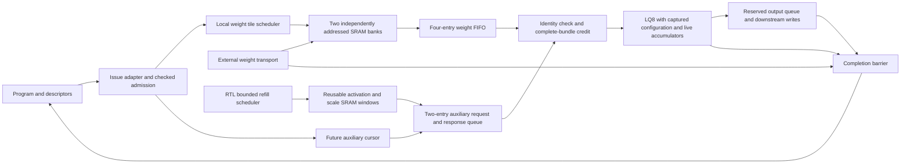

# Refined accelerator architecture and optimization report

Date: 2026-09-22. Status: architecture implementation in progress.
Implementation includes the G2 offset-alias correction after `46ec89f6`;
this report consolidates the completed checkpoints and next acceptance gates.

## Assessment

The repository contains optimized blocks, but an efficient integrated accelerator
has not yet been demonstrated across all targets. The priority is to make data
movement, scheduling, numerical behavior and supporting-engine capacity work as
one system before tuning individual paths for frequency. Standalone GHz results
cannot establish the clock or throughput of the deployed G2 machine.

The work below primarily refines the G2/LQ8 runtime operand path. The full goal
still covers every supported target/configuration, including their distinct
memory, transport, precision and physical requirements. No all-target completion
or whole-chip performance claim is made.

## Previous architecture versus refined design

| Area | Previous execution path | Refined architecture | Current implementation status |
|---|---|---|---|
| Runtime delivery | G2 host writes globally disabled while busy; operands preloaded | Separate idle-only program loader from runtime operand transport | Connected in optional G2 runtime mode; bounded BF16 program-driven regression added |
| Storage feasibility | Finite staging cannot hold complete Qwen contractions | Tile large operations through bounded scratchpads while keeping accumulators live | Weight stream and activation windows cross storage boundaries during one live contraction; deployment address translation pending |
| Weight banks | Shared address and global read/write exclusion | Independent bank addresses, tagged ownership, opposite-bank refill | Two 512x128 SRAM wrappers verified |
| Prefetch | Fixed-latency reads assumed at arithmetic issue | Independent tile read cursor and finite FIFO | Four-entry weight FIFO; copies survive bank release and overwrite |
| Operand readiness | No original issue backpressure | Grant credit only for a complete, correctly identified operand bundle | LQ8 issue stalls, generation/address join and response timing verified |
| Auxiliary storage | Fixed windows or direct external-array responses | Three independently rebased, generation-tagged SRAM windows with exact fills | SRAM service and RTL refill scheduler tested on G2 auxiliary port; external transport modeled |
| Auxiliary requests | Initial runtime adapter requested only the current issue | Independent future-address cursor plus reserved response slots | Captured RTL geometry admission, cursor and two-entry queue integrated |
| Tile control | Behavioral controller in early integration test | Synthesizable reserve/fetch/fill/acquire scheduler | Integrated with SRAM and LQ8; external transport remains modeled |
| Reuse | Stream execution repeats weights for rows | Retain resident weight tiles for bounded multi-row execution | Bank retain/replay verified; multi-row compute scheduling pending |
| Numerical behavior | Multiple engines/prototypes use different reduction associations | Preserve sequential RNE or explicitly specify and qualify blocked association | Existing LQ8 numerical/fault corpus preserved; Qwen blocked implementation qualification pending |
| Output flow control | Fixed-throughput partial-write pulses | Reserve queue storage before final K-group issue; hold complete beats under ready/valid | Four-entry runtime output queue; six-row loaded-program stress passes |
| Completion | Arithmetic completion alone cannot prove external work has drained | Generation-owned completion waits for transport and final writes | Connected in G2; delayed drain, abort and restart tested through a loaded program |
| Physical optimization | Isolated block results and incomplete/stale coverage | Optimize selected architecture, then route containing blocks and every target configuration | Full recharacterization remains pending |

The independent cursor follows row/pass/K/column order with counters and adders.
Geometry admission captures command fields and computes scale strides once with
16 restoring-divider steps. The response queue reserves space before a request
leaves, preventing in-flight data from exceeding finite capacity. A join checks
generation and enabled-plane addresses before arithmetic issue. Existing tokens
drain during starvation; the operation and binary32 accumulator remain live.

The weight scheduler reserves a bank before requesting a burst. Only matching,
ordered, accepted response beats advance fill. Acquisition and refill walk
independently across alternating banks. A short final tile carries its exact
extent. Scheduler completion means tiles have been acquired, not that arithmetic
or writeback has completed. The connected operation lifetime controller enforces
that separation by waiting for transport and final-write drain acknowledgements.
The external producer of those acknowledgements must obey the contract.

## Refined architecture and remaining structural gaps

The selected organization uses coarse operation admission, local tile scheduling,
bounded operand storage and explicit completion ownership. These are the basis
for predictable throughput under variable memory latency. Decode favors column
parallelism; prefill should reuse resident weights across multiple rows with
independent accumulator contexts. The latter scheduling mode is still planned.

The diagram describes the connected runtime path, not a fully qualified deployed
machine. The auxiliary SRAM service is now RTL, tested on the G2 external auxiliary
port; its refill scheduler is RTL and deployment address translation remains modeled. Runtime output
writes now use a bounded ready/valid queue, with capacity reserved before the
final K-group issues. Completion checks internal queue emptiness as well as the
external write-drain acknowledgement. The legacy mode retains its pulse port. Runtime mode is opt-in
(`RUNTIME_OPERANDS=1`), eight-lane only; legacy staging remains the default.

Program-driven qualification exposed two dispatch contract defects, now fixed:
the adapter captured output slot 2 instead of ABI slot 4, and checked weights as
`[K,N]` instead of `[N,K]` for `A × transpose(B)`. A host-loaded, admitted
`M=1,N=8,K=80` BF16 program now executes through the actual sequencer and adapter.
Its signed, nonuniform operands match the functional Device's numerical output.
The fixture service explicitly packs ABI N-major weights into lane words; this
does not yet implement a general deployment-memory transport. General
view-offset translation, other formats/shapes and padded-column output bounds
still require qualification.

## Measured changes

All numbers below are functional RTL simulation or declared storage widths.
They are not routed frequency, measured silicon, model-token latency or power.

| Experiment | Baseline | Refined result | Interpretation |
|---|---:|---:|---|
| Serialized versus overlapped weight refill, matched 92-case corpus | 378,517 cycles | 326,833 cycles | 13.65% lower aggregate operation latency; same issued work and numerical verdicts |
| Current-issue auxiliary producer versus independent cursor, eight entries | 326,833 cycles | 320,212 cycles | 2.03% lower aggregate latency under a one-outstanding external service |
| Select two auxiliary entries instead of eight | 2,560 storage bits; 320,212 cycles | 640 storage bits; 320,692 cycles | 75% fewer queue data/identity bits for 0.15% higher aggregate latency |
| Replace behavioral tile controller with RTL burst scheduler | Prior checkpoint: 320,692 cycles | 320,824 cycles | Explicit burst handshakes/stalls now charged; implementation progress rather than an additional speedup |
| Add checked RTL admission | 320,824 cycles | 322,385 cycles | Pays command startup to reject invalid extents before transport |
| Capture configuration and assemble runtime service | 322,385 cycles | 322,385 cycles | No added corpus latency; inputs may change after launch without changing execution |
| Add completion drain barrier | 322,385 cycles | 323,397 cycles | Charges 1,012 cycles for delayed test acknowledgements; establishes truthful completion |

The two-entry queue is selected for the currently tested external service budget.
These experiments are successive source snapshots with different boundaries;
the percentages must not be added or presented as a single matched whole-system
speedup. More outstanding external requests could change the best queue depth.

Weight overlap fetched 88 additional words across the fault-containing corpus
in its matched comparison. Faster auxiliary delivery can issue additional
speculative bundles before a fault stops execution. Numerical outputs and fault
contracts still match; comparisons explicitly record that extra work. Queue
storage savings exclude cursor/control registers, SRAM, weight FIFO and final
operand delivery registers. Mapped area/energy savings remain unmeasured.

A correctness issue was also fixed: at K=65535 and group=2, 16-bit rounding in
the original lane produced zero operand words instead of 32768. A widened carry
now preserves the correct grouped count. Fifteen boundary configurations pass;
that focused test checks admitted geometry, not full-depth arithmetic.

## Verification and evidence

The latest LQ8 completion-barrier corpus passes 92 cases, 17,103 matching
outputs, 18 fault cases and 115,748 checks. Its evidence records 27 passing
focused tests; the added ABI adapter regression brings the focused suite to 28. Five output-queue capacity variants now bring it to 33. The actual G2 runtime-boundary test passes multi-tile arithmetic,
delayed transport/write drain, abort after issue and restart. It bypasses program
and descriptor dispatch by forcing adapter outputs and uses behavioral SRAM and
external services. Both G2 generate branches elaborate with existing warnings;
this is not a clean-warning lint or physical-closure claim.

Focused tests cover ownership, stale generations, wrong response indices,
incomplete bundles, independent stalls, finite capacity, bank overwrite after
FIFO copying, retained replay, reset/clear, configuration capture, scale and row
boundaries, partial tiles, address overflow and grouped-depth rounding.

Primary retained records:

- `results/rtl/a3_lq8_runtime_operands.json`: matched weight-overlap comparison.
- `results/rtl/a3_lq8_selected_auxiliary.json`: selected auxiliary capacity result.
- `results/rtl/a3_lq8_auxiliary_capacity.json`: two-versus-eight-entry comparison.
- `results/rtl/a3_lq8_operand_admission.json`: captured admission integration.
- `results/rtl/a3_lq8_weight_scheduler.json`: historical scheduler snapshot.
- `results/rtl/a3_lq8_checked_extent.json`: checked stream-length admission.
- `results/rtl/a3_lq8_configuration_capture.json`: stable versus mutated configuration.
- `results/rtl/a3_lq8_runtime_service.json`: assembled synthesizable service.
- `results/rtl/a3_lq8_completion_barrier.json`: numerical corpus with delayed drain.
- `results/rtl/a3_g2_runtime_boundary.json`: historical G2 boundary wiring test.
- `results/rtl/a3_g2_runtime_program.json`: loaded ABI program, numerical outputs,
  abort/transport fault propagation and restart.
- `results/rtl/a3_g2_runtime_output.json`: six-row loaded-program output
  backpressure, reservation stalls, completion gating and queued-result abort.
- `results/rtl/a3_g2_runtime_auxiliary.json`: six-row, 24-column program through
  reusable activation SRAM windows, output backpressure and fault recovery.
- `results/rtl/a3_runtime_auxiliary_windows.json`: focused window protocol and
  synchronous SRAM tests plus standalone lint.
- `results/rtl/a3_lq8_output_interface_regression.json`: 92-case LQ8 regression
  after adding the final-group preview; this harness does not contain the queue.

Each record identifies its tested sources. Older records remain historical when
sources change; they do not qualify the current tree automatically. Reproduction
commands and source/artifact digests are retained in the records and checkers.

## Optimization targets and acceptance gates

1. **Qualify production dispatch and output flow control.** Checked stream
   admission, G2 runtime transport and completion ownership are implemented.
   A bounded loaded-program regression now covers corrected ABI slots/layout
   and real sequencer completion/fault propagation. Extend shape/format and
   deployment-memory mapping coverage. Bounded output buffering and reservation
   before final-group issue are implemented; connect a real downstream write
   service that truthfully reports final-write acknowledgement.
   Acceptance requires reset, fault, cancellation and independent backpressure
   tests without stale credits, lost outputs or unexplained permanent stalls.
2. **Reusable activation and scale storage.** Replace external-array models with
   bounded SRAM service and address translation. The three-plane SRAM window
   service now exists and is tested through G2; its production refill
   scheduler is now RTL. Implement deployment address translation next. Measure bytes, bank conflicts,
   starvation and live capacity for all required planes.
3. **Multi-row weight reuse.** Schedule bounded independent accumulators around
   resident tiles for prefill; retain decode's column-parallel behavior. Require
   a measured reduction in external weight traffic with matching arithmetic.
4. **Numerical qualification.** Freeze the blocked association for the selected
   hardware and qualify it against the deployment contract. LQ8 equivalence
   does not automatically qualify Qwen's BLAS-associated blocked backend.
5. **Balance all engines and targets.** Budget tensor, vector, reduction,
   attention/KV, routing, control and transport service for dense/MoE,
   decode/prefill and distributed configurations. Calibrate supported workloads
   against instantiated resources and include finite buffers and overlap costs.
6. **High-frequency physical implementation.** Use 1.0 GHz as the initial ASAP7
   compute/local-control engineering target; explore 1.2–1.5 GHz only when it
   improves system results. These frequencies are unachieved targets. Establish
   appropriate targets separately for other technology nodes and domains.
   Optimize every selected component using routed critical paths: pipeline
   balance, recurrence scheduling, mux/fanout reduction and exact width pruning.
7. **Full physical and workload acceptance.** Recharacterize every instantiated
   target/configuration and containing block. Include clock tree, buffers,
   memories, area and control overhead; require setup/hold and physical-rule
   checks. Report cycles and frequency together, workload latency/throughput,
   traffic and activity-based energy. A standalone test or synthesis-only
   frequency does not meet this gate.

The architecture changes address the central problem: supplying useful work to
arithmetic within finite storage and explicit ownership. Remaining work is
substantial, especially production integration, reuse, numerical qualification
and complete physical coverage. The full optimization goal remains active.

## Completed implementation checkpoints

| Commit | Verified progress |
|---|---|
| `1b653f17` | Architecture report and runtime operand architecture checkpoint |
| `aa3a518c` | Checked stream extent in production RTL admission |
| `45eda823` | Captured LQ8 execution configuration; 251 register bits, no extra launch stage |
| `ee76dd04` | Assembled synthesizable eight-lane runtime operand service |
| `19b03edb` | Completion ownership across transport and output drain |
| `63090e65` | Optional G2 runtime wiring and boundary abort/restart validation |

The subsequent ABI dispatch correction captures slots 0/1/4 and decodes B as
`[N,K]`. Eight focused contract checks cover valid mapping, ignored extra slots,
stale-view rejection, mismatched K, zero N, descriptor faults and IRS ownership.
The program regression uses real host writes and no forced internal signals.

All listed commits were pushed to `token-path-end-to-end`. The configuration
capture and widened grouped-depth count are correctness improvements as well
as prerequisites for safe overlap. Runtime faults and abort reset the core and
suppress new partial results; already queued results drain and already committed
writes are not rolled back.

The next optimization decisions should be ranked by workload latency and bytes
moved per useful result. Pipelining follows architecture qualification, using
both initiation interval and routed frequency: a higher clock alone cannot
establish improved throughput or energy. Each supported configuration needs its
own measured memory, engine and transport budgets before selecting queue sizes,
replication factors and clock domains. No single topology or GHz target is
assumed optimal across all technologies and workloads.

## Reserved output queue checkpoint

Runtime G2 now exports `part_valid`/`part_ready`. A transfer atomically accepts
the lanes in `part_we` with their lane-local addresses, results and FP32
accumulators. While stalled, the entire payload remains stable. Four entries
store 3,104 payload bits at eight lanes, excluding occupancy/pointer control.
This is declared storage, not a mapped area estimate. Queue depth is configurable.

The lane exposes whether its next operand is the final K group; G2 reserves one
result beat when that group issues. Nonfinal products can continue accumulating
while the output queue is full. Credit depends on local registered occupancy,
not downstream ready, avoiding a combinational ready path back through the
arithmetic pipeline. Reservation and queued occupancy share one capacity budget;
unused reservations are released only when compute stops. On abort, existing
queued writes remain valid and drain, while new core results are suppressed.

The six-row BF16 program test observes 1,031 stalled-output cycles, 17 blocked
final-group issue cycles, and 152 correct accepted results across successful
runs and a queued-result abort. It explicitly holds the last result after compute
completion and external acknowledgements to verify the internal drain gate.
Five randomized queue tests cover depths 1/2/3/4/8, delayed production,
simultaneous events, cancellation and unreserved-result detection. The new
queue has clean standalone Verilator lint. These are functional checks; the
selected depth and the added output multiplexing/register cost still require
workload tuning and physical characterization. The separate 92-case numerical
regression retains 17,103 matching outputs, 18 faults, 115,748 checks and
323,397 aggregate cycles; that regression checks the LQ8 interface change,
while the six-row G2 test checks the queue integration.

## Reusable auxiliary SRAM checkpoint

`ot_a3_runtime_auxiliary_windows` implements three 256-word windows using two
64-bit SRAM macros and one 32-bit macro: 2 KiB of activations, 1 KiB of activation
scales and 2 KiB of weight scales. Each plane independently captures a full
32-bit base, exact extent and generation. Reads subtract the base and check
bounds before indexing SRAM. An incomplete fill is never resident; wrong
indices/generations fault. All enabled planes must be resident before accepting
a request. The complete response remains stable under consumer stalls, and
replacement cannot overwrite a pending response. A resident stream sustains
one accepted read per cycle with a ready consumer in the focused simulation.

The loaded-program fixture attaches this RTL service to G2's existing auxiliary
port and supplies bounded window refills from a modeled manager. For
`M=6,N=24,K=80`, the first successful operation makes 1,440 auxiliary requests
but fills just 480 activation words in two windows (256 and 224). This is a
threefold reuse factor and 66.7% fewer external activation words than direct
one-word-per-request delivery for this operation. It is not a whole-system
speedup or an all-plane bandwidth saving. The fixture still streams weights
for each row; multi-row weight reuse remains open.

The campaign validates 440 accepted outputs across successful execution,
explicit abort, transport fault, restart and an abort with a result queued.
Standalone tests exercise all three planes, scale reuse across activation-window
replacement, consecutive reads, held responses, full-address rebasing, bounds,
generations, malformed fills and clear. The focused suite now has 34 passing
tests; the new service has clean standalone lint. SRAM behavior is simulated;
new routed area, frequency and power remain unmeasured. Production window
scheduling, deployment byte-to-word mapping and scaled-format program coverage
are still required before promoting this service into a complete memory system.

## RTL auxiliary refill scheduler checkpoint

The fixture's behavioral miss-to-window controller has been replaced by
`ot_a3_auxiliary_window_scheduler`. It captures generation and service-word
bounds once per operation, selects a missing plane, validates its address, and
plans a page relative to the plane base. Separate registered stages handle
bounds, offset, page remainder and final burst geometry. No per-word divider or
multiplier is used. Unaligned bases do not cause reads before an object; final
bursts stop at the exact declared extent, including a legal end at 2^32.

The scheduler installs ownership before requesting a burst and publishes fills
only for the expected generation/serial tag and ordered index. Window install,
fetch and fill tolerate independent stalls. Clear requires coordinated
transport cancellation; stale or unsolicited responses fault. G2 now accepts
`runtime_service_fault`, allowing an attached auxiliary service to enter its
existing FE/ENGINE drain-and-complete path. Runtime integrations must connect
this input, or tie it low when no external service fault source exists.

The admitted M=6,N=24,K=80 program runs through the RTL scheduler and SRAM with
stalled external burst transport. Its first operation retains 480 fill words
for 1,440 reads. Eight transactions test success, explicit abort, weight-transport
fault, queued-output abort, auxiliary-transport fault and recovery; 584 accepted
outputs match the functional Device. Additional scheduling/transport cycles are
charged, not claimed as a speedup. Evidence:
`results/rtl/a3_g2_runtime_auxiliary_scheduler.json` and
`results/rtl/a3_auxiliary_window_scheduler.json`.

The focused suite has 35 passing tests, with clean standalone scheduler lint.
The controller and SRAM are connected outside the G2 wrapper through its public
auxiliary ports. The external burst source and admitted service-word bounds are
still supplied by the fixture. Production deployment byte/object translation,
scaled-format program coverage, transport integration, multi-row weight reuse
and routed physical characterization remain open. Earlier auxiliary-window
results describe the historical behavioral-manager checkpoint.

## Contiguous object-byte transport checkpoint

`ot_a3_operand_byte_mapper` now translates a bounded service-word refill request
into an object ID, 64-bit object-relative byte offset and exact byte length.
It captures immutable per-plane object/base/size/word-width records, supports
1/2/4/8-byte contiguous words, and rejects stale generations, invalid planes,
word-address overflow and byte ranges outside the object before asserting burst
valid. Offset scaling, base addition, end calculation and bounds validation use
separate registered stages. The final bounds verdict is registered before the
held transport request, removing the wide comparison from its ready/valid path.
No physical timing improvement is claimed without characterization.

The loaded-program auxiliary campaign now reads bytes from the deployment's
actual activation object. For BF16, the mapper requests two bytes per service
word and the external byte transport packs each response into the low 16 bits
of the auxiliary 64-bit word. This replaces direct indexing of prepacked
activation words. Object identity and the exact byte range are checked at the
transport boundary. The reference object bytes and source/artifact digests are
recorded in `results/rtl/a3_g2_runtime_byte_transport.json`.

The mapper passes 106 randomized/boundary mappings plus stale-generation and
invalid-plane checks, with standalone clean lint. The focused suite has 36
passing tests. Integrated coverage retains the six-row, 24-column BF16 program,
activation reuse, output backpressure, aborts, weight and auxiliary transport
faults, and restart. Evidence: `results/rtl/a3_operand_byte_mapper.json`.

This is a contiguous byte-word mapping primitive, not full deployment mapping.
The parent still supplies admitted mapping records. Hardware descriptor-to-record
construction, strided/sub-byte layouts, packed/tiled weight translation, general
view offsets, output-object writes, scaled-format program coverage and production
transport remain open. At that mapper checkpoint the G2 adapter still truncated high view
offset bits; the subsequent correction below closes that aliasing defect. Those gaps
must be resolved before general ABI deployment qualification. Multi-row weight
reuse and routed characterization remain required by the full optimization goal.

## G2 view-offset alias correction

The current G2 operand ports are 32-bit service addresses, but resolved ABI view
offsets are 64 bits. The prior adapter silently discarded the high half. A new
regression reproduced a launch for an offset of 2^32, which would address zero
instead of the intended view. The adapter now captures one overflow bit for
each required view and returns CAPABILITY before descriptor fetch or arithmetic
launch if any high bits are set. This adds three status bits, not a claimed
mapped-area result. Replaced views overwrite their own status; new view sets,
clear and consumed issues discard stale status. Ignored operand slots do not
poison the contraction's required views.

The adapter test now contains 12 contract checks, including high activation,
weight and output offsets and subsequent valid execution. The 36-test focused
suite and loaded-program numerical regressions pass. Source-bound evidence is
`results/rtl/a3_g2_issue_contract.json`. This prevents silent aliasing within the
current hardware limit; it does not implement wide-offset deployment mapping.
The full goal still requires descriptor-derived mapping records, packed/strided
weights, output-object writes, reuse and routed physical optimization.

## Byte-mapper physical optimization checkpoint

Matched ASAP7 TT synthesis/STA at a 1 ns target identified plane selection plus
subtraction and high-fanout payload enables as bottlenecks. The implementation
now registers plane selection before relative-address arithmetic and resets only
state, ownership and error flags. Payload registers are overwritten before
publication; feed-forward arithmetic avoids a global clear/enable mux on each
stage. Reset/clear still suppress all valid outputs. The separate selection
stage adds one mapping startup cycle; no burst is published before bounds pass.

Mapped cell area falls from 789.931 to 681.313 um² (13.75%), and cell count from
4,870 to 4,557. Pre-layout setup WNS improves from -1.6859 to -1.5765 ns but
**both designs miss the 1 ns target**. Unbuffered control fanout dominates the
revised pre-layout path. No achieved GHz claim follows from these results.
Feed-forward payload switching energy has not been measured. The physical
comparison is `results/physical_abi3/asap7/runtime_byte_mapper/comparison.json`;
source snapshots and complete synthesis/STA records are retained beside it.

All 36 focused tests pass. The loaded byte-transport campaign retains 584
matching outputs, 480 first-operation activation fills and 1,440 reads. Its
cumulative counter at final completion increases from 14,356 to 14,375 cycles
under the test's transport stalls; this is an area/control optimization with a
latency cost, not a claimed workload speedup. Full routes for baseline and
candidate were launched at 1 ns with max-transition and max-fanout 16 constraints
and remain in progress at this checkpoint. Their results, signal-integrity
checks and source hashes must be inspected before assessing closure. Wider
architecture integration and all-target physical coverage remain unfinished.

## Auxiliary scheduler control-area and mapper route checkpoint

The auxiliary refill scheduler now resets ownership/publication state and error
flags while allowing invalid payload registers to remain unreset. Mapping
records are overwritten on command capture; planning intermediates advance
through the existing CHECK/PLAN/SIZE stages without a global payload enable.
Published window fields remain held under stalls. This preserves refill planning
latency and the integrated campaign's exact cycle counters and numerical outputs.

Matched ASAP7 TT synthesis at 1 ns reduces scheduler mapped area from 412.863
to 356.758 um² (13.59%) and cells from 2,717 to 2,508. Pre-layout setup WNS
improves from -0.5576 to -0.4085 ns; both still miss 1 ns before physical repair.
The comparison and source snapshots are under
`results/physical_abi3/asap7/runtime_auxiliary_scheduler/`. An optimized full
route is running. Payload switching energy is unmeasured.

The original byte mapper's full route has now completed at the 1 ns target:
setup WNS +0.103283 ns, hold WNS +0.057078 ns, standard-cell area 1,044.51 um²,
zero setup/hold violations, and zero reported DRC, antenna, slew, capacitance and
fanout violations. The source hash matches `source_snapshots/baseline.sv`, and
all retained artifact hashes were checked. This is **baseline standalone routed
stage closure at the tested TT configuration**, not closure of the revised RTL
or integrated G2. The record's overall NOT_MET verdict remains because its
separate pre-layout STA stage fails; no verdict was overwritten. The optimized
mapper route remains active, so the 13.75% synthesis-area saving cannot yet be
claimed as a routed saving. Evidence: `runtime_byte_mapper/pnr_1ns.json` under
`results/physical_abi3/asap7/`, with reports and netlists beside it.

All 36 focused tests pass. Mapper coverage now clears every pipeline stage and
a stalled valid output, then verifies a fresh mapping, for 114 mapping cases
plus generation/plane refusal. The G2 byte-transport campaign still produces
584 accepted matching outputs with the same 14,375 final completion counter.
The full architecture, all-target optimization and physical coverage goals
remain unfinished.
