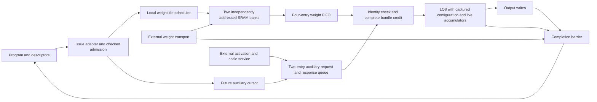

# Refined accelerator architecture and optimization report

Date: 2026-09-22. Status: architecture implementation in progress.
Implementation reviewed through commit `63090e65`; this report consolidates the
completed checkpoints and the next acceptance gates.

## Assessment

The repository contains optimized blocks, but an efficient integrated accelerator
has not yet been demonstrated across all targets. The priority is to make data
movement, scheduling, numerical behavior and supporting-engine capacity work as
one system before tuning individual paths for frequency. Standalone GHz results
cannot establish the clock or throughput of the deployed G2 machine.

The work below primarily refines the G2/LQ8 runtime operand path. The full goal
still covers every supported target/configuration, including their distinct
memory, transport, precision and physical requirements. No all-target completion
or whole-chip performance claim is made.

## Previous architecture versus refined design

| Area | Previous execution path | Refined architecture | Current implementation status |
|---|---|---|---|
| Runtime delivery | G2 host writes globally disabled while busy; operands preloaded | Separate idle-only program loader from runtime operand transport | Connected in optional G2 runtime mode; program-driven qualification pending |
| Storage feasibility | Finite staging cannot hold complete Qwen contractions | Tile large operations through bounded scratchpads while keeping accumulators live | Weight path crosses many tiles in one live contraction; activation scratchpad integration pending |
| Weight banks | Shared address and global read/write exclusion | Independent bank addresses, tagged ownership, opposite-bank refill | Two 512x128 SRAM wrappers verified |
| Prefetch | Fixed-latency reads assumed at arithmetic issue | Independent tile read cursor and finite FIFO | Four-entry weight FIFO; copies survive bank release and overwrite |
| Operand readiness | No original issue backpressure | Grant credit only for a complete, correctly identified operand bundle | LQ8 issue stalls, generation/address join and response timing verified |
| Auxiliary requests | Initial runtime adapter requested only the current issue | Independent future-address cursor plus reserved response slots | Captured RTL geometry admission, cursor and two-entry queue integrated |
| Tile control | Behavioral controller in early integration test | Synthesizable reserve/fetch/fill/acquire scheduler | Integrated with SRAM and LQ8; external transport remains modeled |
| Reuse | Stream execution repeats weights for rows | Retain resident weight tiles for bounded multi-row execution | Bank retain/replay verified; multi-row compute scheduling pending |
| Numerical behavior | Multiple engines/prototypes use different reduction associations | Preserve sequential RNE or explicitly specify and qualify blocked association | Existing LQ8 numerical/fault corpus preserved; Qwen blocked implementation qualification pending |
| Completion | Arithmetic completion alone cannot prove external work has drained | Generation-owned completion waits for transport and final writes | Connected in G2; delayed drain, abort and restart tested at adapter boundary |
| Physical optimization | Isolated block results and incomplete/stale coverage | Optimize selected architecture, then route containing blocks and every target configuration | Full recharacterization remains pending |

The independent cursor follows row/pass/K/column order with counters and adders.
Geometry admission captures command fields and computes scale strides once with
16 restoring-divider steps. The response queue reserves space before a request
leaves, preventing in-flight data from exceeding finite capacity. A join checks
generation and enabled-plane addresses before arithmetic issue. Existing tokens
drain during starvation; the operation and binary32 accumulator remain live.

The weight scheduler reserves a bank before requesting a burst. Only matching,
ordered, accepted response beats advance fill. Acquisition and refill walk
independently across alternating banks. A short final tile carries its exact
extent. Scheduler completion means tiles have been acquired, not that arithmetic
or writeback has completed. The connected operation lifetime controller enforces
that separation by waiting for transport and final-write drain acknowledgements.
The external producer of those acknowledgements must obey the contract.

## Refined architecture and remaining structural gaps

The selected organization uses coarse operation admission, local tile scheduling,
bounded operand storage and explicit completion ownership. These are the basis
for predictable throughput under variable memory latency. Decode favors column
parallelism; prefill should reuse resident weights across multiple rows with
independent accumulator contexts. The latter scheduling mode is still planned.

The diagram describes the connected runtime path, not a fully qualified deployed
machine. External activation/scale service is modeled in current tests. Output
writes still use a fixed-throughput interface; a bounded backpressured output
queue with issue-capacity reservation remains required. Runtime mode is opt-in
(`RUNTIME_OPERANDS=1`), eight-lane only; legacy staging remains the default.

Source review also finds a dispatch contract mismatch: the G2 issue adapter
checks weight dimensions as `[K,N]`, whereas the ABI tensor engine specifies
`[N,K]` for `A × transpose(B)`. The existing G2 test forces adapter outputs and
therefore cannot detect this. The next qualification must load an admitted
non-square program, reproduce and correct the mismatch, and verify descriptor
refusals and completion through the actual sequencer. General view-offset
translation and padded-column output bounds also require explicit qualification.

## Measured changes

All numbers below are functional RTL simulation or declared storage widths.
They are not routed frequency, measured silicon, model-token latency or power.

| Experiment | Baseline | Refined result | Interpretation |
|---|---:|---:|---|
| Serialized versus overlapped weight refill, matched 92-case corpus | 378,517 cycles | 326,833 cycles | 13.65% lower aggregate operation latency; same issued work and numerical verdicts |
| Current-issue auxiliary producer versus independent cursor, eight entries | 326,833 cycles | 320,212 cycles | 2.03% lower aggregate latency under a one-outstanding external service |
| Select two auxiliary entries instead of eight | 2,560 storage bits; 320,212 cycles | 640 storage bits; 320,692 cycles | 75% fewer queue data/identity bits for 0.15% higher aggregate latency |
| Replace behavioral tile controller with RTL burst scheduler | Prior checkpoint: 320,692 cycles | 320,824 cycles | Explicit burst handshakes/stalls now charged; implementation progress rather than an additional speedup |
| Add checked RTL admission | 320,824 cycles | 322,385 cycles | Pays command startup to reject invalid extents before transport |
| Capture configuration and assemble runtime service | 322,385 cycles | 322,385 cycles | No added corpus latency; inputs may change after launch without changing execution |
| Add completion drain barrier | 322,385 cycles | 323,397 cycles | Charges 1,012 cycles for delayed test acknowledgements; establishes truthful completion |

The two-entry queue is selected for the currently tested external service budget.
These experiments are successive source snapshots with different boundaries;
the percentages must not be added or presented as a single matched whole-system
speedup. More outstanding external requests could change the best queue depth.

Weight overlap fetched 88 additional words across the fault-containing corpus
in its matched comparison. Faster auxiliary delivery can issue additional
speculative bundles before a fault stops execution. Numerical outputs and fault
contracts still match; comparisons explicitly record that extra work. Queue
storage savings exclude cursor/control registers, SRAM, weight FIFO and final
operand delivery registers. Mapped area/energy savings remain unmeasured.

A correctness issue was also fixed: at K=65535 and group=2, 16-bit rounding in
the original lane produced zero operand words instead of 32768. A widened carry
now preserves the correct grouped count. Fifteen boundary configurations pass;
that focused test checks admitted geometry, not full-depth arithmetic.

## Verification and evidence

The latest LQ8 completion-barrier corpus passes 92 cases, 17,103 matching
outputs, 18 fault cases and 115,748 checks. Its evidence records 27 passing
focused tests. The actual G2 runtime-boundary test passes multi-tile arithmetic,
delayed transport/write drain, abort after issue and restart. It bypasses program
and descriptor dispatch by forcing adapter outputs and uses behavioral SRAM and
external services. Both G2 generate branches elaborate with existing warnings;
this is not a clean-warning lint or physical-closure claim.

Focused tests cover ownership, stale generations, wrong response indices,
incomplete bundles, independent stalls, finite capacity, bank overwrite after
FIFO copying, retained replay, reset/clear, configuration capture, scale and row
boundaries, partial tiles, address overflow and grouped-depth rounding.

Primary retained records:

- `results/rtl/a3_lq8_runtime_operands.json`: matched weight-overlap comparison.
- `results/rtl/a3_lq8_selected_auxiliary.json`: selected auxiliary capacity result.
- `results/rtl/a3_lq8_auxiliary_capacity.json`: two-versus-eight-entry comparison.
- `results/rtl/a3_lq8_operand_admission.json`: captured admission integration.
- `results/rtl/a3_lq8_weight_scheduler.json`: historical scheduler snapshot.
- `results/rtl/a3_lq8_checked_extent.json`: checked stream-length admission.
- `results/rtl/a3_lq8_configuration_capture.json`: stable versus mutated configuration.
- `results/rtl/a3_lq8_runtime_service.json`: assembled synthesizable service.
- `results/rtl/a3_lq8_completion_barrier.json`: numerical corpus with delayed drain.
- `results/rtl/a3_g2_runtime_boundary.json`: G2 wiring, arithmetic, abort and restart.

Each record identifies its tested sources. Older records remain historical when
sources change; they do not qualify the current tree automatically. Reproduction
commands and source/artifact digests are retained in the records and checkers.

## Optimization targets and acceptance gates

1. **Qualify production dispatch and output flow control.** Checked stream
   admission, G2 runtime transport and completion ownership are implemented.
   Next fix the descriptor-layout mismatch under a loaded ABI program and test
   real sequencer completion/fault propagation. Add bounded output buffering
   with capacity reserved before issue and truthful final-write acknowledgement.
   Acceptance requires reset, fault, cancellation and independent backpressure
   tests without stale credits, lost outputs or unexplained permanent stalls.
2. **Reusable activation and scale storage.** Replace external-array models with
   bounded SRAM service and address translation. Measure bytes, bank conflicts,
   starvation and live capacity for all required planes.
3. **Multi-row weight reuse.** Schedule bounded independent accumulators around
   resident tiles for prefill; retain decode's column-parallel behavior. Require
   a measured reduction in external weight traffic with matching arithmetic.
4. **Numerical qualification.** Freeze the blocked association for the selected
   hardware and qualify it against the deployment contract. LQ8 equivalence
   does not automatically qualify Qwen's BLAS-associated blocked backend.
5. **Balance all engines and targets.** Budget tensor, vector, reduction,
   attention/KV, routing, control and transport service for dense/MoE,
   decode/prefill and distributed configurations. Calibrate supported workloads
   against instantiated resources and include finite buffers and overlap costs.
6. **High-frequency physical implementation.** Use 1.0 GHz as the initial ASAP7
   compute/local-control engineering target; explore 1.2–1.5 GHz only when it
   improves system results. These frequencies are unachieved targets. Establish
   appropriate targets separately for other technology nodes and domains.
   Optimize every selected component using routed critical paths: pipeline
   balance, recurrence scheduling, mux/fanout reduction and exact width pruning.
7. **Full physical and workload acceptance.** Recharacterize every instantiated
   target/configuration and containing block. Include clock tree, buffers,
   memories, area and control overhead; require setup/hold and physical-rule
   checks. Report cycles and frequency together, workload latency/throughput,
   traffic and activity-based energy. A standalone test or synthesis-only
   frequency does not meet this gate.

The architecture changes address the central problem: supplying useful work to
arithmetic within finite storage and explicit ownership. Remaining work is
substantial, especially production integration, reuse, numerical qualification
and complete physical coverage. The full optimization goal remains active.

## Completed implementation checkpoints

| Commit | Verified progress |
|---|---|
| `1b653f17` | Architecture report and runtime operand architecture checkpoint |
| `aa3a518c` | Checked stream extent in production RTL admission |
| `45eda823` | Captured LQ8 execution configuration; 251 register bits, no extra launch stage |
| `ee76dd04` | Assembled synthesizable eight-lane runtime operand service |
| `19b03edb` | Completion ownership across transport and output drain |
| `63090e65` | Optional G2 runtime wiring and boundary abort/restart validation |

All listed commits were pushed to `token-path-end-to-end`. The configuration
capture and widened grouped-depth count are correctness improvements as well
as prerequisites for safe overlap. Runtime faults and abort reset the core and
suppress subsequent partial writes; already committed writes are not rolled back.

The next optimization decisions should be ranked by workload latency and bytes
moved per useful result. Pipelining follows architecture qualification, using
both initiation interval and routed frequency: a higher clock alone cannot
establish improved throughput or energy. Each supported configuration needs its
own measured memory, engine and transport budgets before selecting queue sizes,
replication factors and clock domains. No single topology or GHz target is
assumed optimal across all technologies and workloads.
