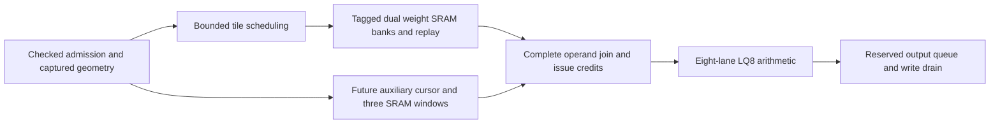
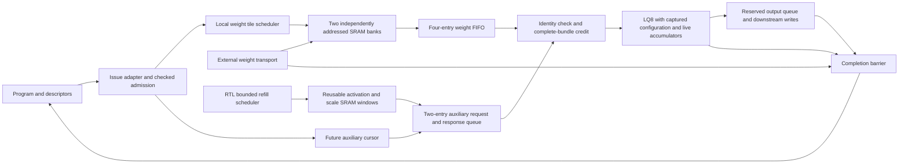

# Refined accelerator architecture and optimization report

Date: 2026-09-22. Status: architecture implementation in progress.
Implementation includes runtime tail masking (`7a01be96`) and the subsequent
descriptor stride capture; the current-source Sinkhorn route is retained. The opening review is current;
later checkpoints preserve the history of individual experiments.

## Current review summary (2026-09-22)

**The runtime architecture is substantially better, but significant architectural
and integration problems remain. The project is not yet demonstrated to be a
well-optimized accelerator across all targets.** Most new evidence qualifies
optional G2/LQ8 runtime mode, not the legacy default or every deployed engine.
This summary supersedes status statements in the historical checkpoints below.

The implemented architecture separates checked operation admission, bounded
transport, local SRAM reuse, complete-operand issue credits, arithmetic, and
reserved output drain. Two tagged 512x128 weight banks overlap refill and
execution and retain eligible weight rows for replay. Three auxiliary SRAM
windows retain activation and scale data. Independent future-address cursors
prepare operands before issue; generation ownership and cancellation/drain
contracts keep old responses out of new operations. Completion includes queued
outputs and transport drain. The arithmetic remains the actual eight-lane LQ8
implementation with its sequential FP32 RNE association.

The major verified changes relative to earlier recorded versions are:

| Change | Earlier version | Refined version | What the measurement establishes |
|---|---:|---:|---|
| Resident weight-row replay, M6/N24/K80 | 1,440 weight fills | 240 fills | 83.3% less first-operation weight traffic; fits existing banks |
| Replay plus earlier first-bank availability, slow weight service | 50,311 campaign cycles | 21,731 cycles | 56.8% fewer cycles with response gap 8; 584 matching outputs |
| Rolling activation window, M6/N56/K80 | 1,440 activation fills; 35,175 cycles | 720 fills; 30,723 cycles | 50% fewer fills and 12.66% fewer campaign cycles; 1,352 matching outputs |
| Rolling activation window, M6/N56/K352 | 8,896 fills; 160,789 cycles | 7,552 fills; 152,458 cycles | Helps deeper rows, but retention remains capacity-limited |
| Unscaled admission | 19 cycles | 3 cycles | Scaled admission retains 19 cycles |
| Auxiliary reservation queue | Two entries, 640 bits; 30,723 campaign cycles | Three entries, now 896 bits with shared generation; 24,995 cycles | 18.64% fewer cycles in N56/K80 G2; +256 storage bits versus original queue |
| Mapper routed standard-cell area | 1,044.510 um² | 888.112 um² | 14.97% lower; refined CTS12 route passes reported physical checks at 1 ns |
| Admission routed standard-cell area | 826.380 um² | 723.503 um² | 12.45% lower; both recorded routes pass physical checks at 1 ns |

These are separate source-bound experiments, not additive system speedups.
Campaign counters include faults, aborts, recovery and drain; they are not
whole-model inference latency. Rolling windows and runtime mode remain explicit
options. Weight replay is bounded to eligible rows of at most 1,024 words;
larger rows fall back to streaming and still repeat weight traffic across rows.

The cursor now retains absolute per-column scale addresses and uses local
payload enables. Matched standalone routes reduce standard-cell area from
642.468 to 568.897 um² (11.45%); setup slack improves from +0.043510 to
+0.166790 ns at 1 ns. The operand join resets only its ownership token, reducing
routed area from 553.253 to 461.749 um² (16.54%) at the same tested period.
Both refined routed stages have positive hold slack and zero reported physical
violations. The join has slightly less setup margin; its result is an area
improvement. Neither change adds request cycles. Evidence is retained in
`runtime_operand_cursor/routed_absolute_comparison.json` and
`runtime_operand_join/routed_payload_comparison.json` under
`results/physical_abi3/asap7/`.

The latest completed containing-block physical results are:

| Configuration | Tested period | Routed standard-cell area | Setup / hold WNS | Verdict |
|---|---:|---:|---:|---|
| Runtime operand service, split stream increment, CTS8 | 1 ns | 3,807.230 um², plus 5,586 um² SRAM macros | +0.009551 / +0.021035 ns | Passes all reported timing and physical checks |
| Sinkhorn, pipelined divider, direct handoffs, suppressed unused right-adder requests, CTS8 | 2 ns | 3,099.550 um² | +0.092189 / +0.027670 ns | Passes setup, hold, slew, capacitance, fanout, DRC and antenna checks |

Both are ASAP7 TT results for the recorded configurations. Sinkhorn establishes
500 MHz at this tested corner and block boundary; it does not establish a
whole-chip clock or other-corner closure. Its current source hashes and all
seven retained artifact hashes match. The older 2.4 ns CTS12 sum-handoff route
has two clock fanout failures; changing CTS and RTL together prevents attributing
the current area difference to one change. The service's latest critical path
runs from scheduler replay selection through tile extent to stream-base addition.
That is the next measured local timing target; a slack-extrapolated frequency
is not a validated operating point.

Compared with the preceding auxiliary one-hot service, shared weight generation
reduces routed standard-cell area from 3,810.960 to 3,716.890 um² (2.47%) and
shrinks the setup miss from 70.8 to 2.4 ps. Macro area is unchanged. This improves
the implementation but does not yet close the 1 ns target. No activity-qualified
energy benefit or all-target physical closure is claimed.

The LQ8 corpus passes 92 cases with 17,103 matching outputs, 18 exercised faults
and 115,748 checks. The current loaded G2 N56/K80 campaign passes 1,352 matching
outputs in 25,040 campaign cycles after stride capture, including output backpressure, refill, faults,
abort and recovery. Earlier 24,995-cycle queue results in the table isolate the
queue change before descriptor revisions. Reading C for checked shape/output
precision increased that checkpoint to 25,082 cycles; reducing auxiliary
descriptor reads from 18 to 9 SRAM beats then reduced it to 25,013. These are
campaign counts, not inference latency or directly additive speedups.

C now owns BF16/FP32 output precision and exported object/layout metadata,
including its two unsigned element strides. G2 now reads 96-byte prefixes for
A/B and a 128-byte prefix for C, totaling 10 auxiliary SRAM beats. The earlier
uniform 128-byte checkpoint used 12 beats; historical counts below retain their
original configurations.
Metadata remains valid through output drain. A cancellation-priority correction
prevents same-edge normal transitions from overriding clear; the 27-check adapter
regression cancels all six active states and verifies recovery. Actual bounded
output-object writes and stride translation remain unfinished. Runtime output
now masks padded tail lanes before enqueue; legacy consumers still need to
apply the published logical shape.

The divider rounding register and bounded exponent widths reduce matched routed
area from 1,347.020 to 1,181.750 um² (12.27%) and turn a 2 ns setup failure into
a pass for the standalone divider. Nontrivial division adds one cycle. Sinkhorn
handoffs remove controller bubbles: the 36-matrix pipelined-divider corpus drops
from 1,129,736 to 1,105,554 cycles (2.14%). Suppressing unused right-adder requests
reduces requests from 468 to 156 per valid matrix without a cycle change; it is
an activity reduction, not a measured energy percentage. Six arithmetic/protocol
tests cover 673 divisions, 36 matrices in both divider modes, reset and stalls.

Current evidence:

- [Loaded G2 campaign](../results/rtl/a3_g2_runtime_byte_transport_cols56_rolling_activation_auxdepth3_direct.json)
- [G2 cancellation regression](../results/rtl/a3_g2_issue_clear.json)
- [Operand service route](../results/physical_abi3/asap7/runtime_operand_service/pnr_weight_generation_cts12_1ns.json)
- [Current Sinkhorn route](../results/physical_abi3/asap7/sinkhorn_adder_activity/pnr_current_cts8_2ns.json)
- [Matched divider routes](../results/physical_abi3/asap7/fp32_div_round_stage/routed_comparison.json)

Architecture-first work proceeds in this order:

1. Complete descriptor-derived mapping, packed/strided weight transport and
   output-object writes through real bounded services. Qualify format/shape
   coverage and final-write acknowledgement through actual dispatch.
2. Extend retention beyond resident whole-row replay: bounded multi-row tile
   reuse, accumulator capacity and activation boundary/deep-row retention.
   Measure bytes per useful output without changing FP32 association.
3. Establish workload/resource budgets for every supported target: dense/MoE,
   decode/prefill, attention/KV, vector/reduction, routing and distributed
   transport. Choose banking, concurrency and queue depths from measured
   starvation, conflicts, occupancy and service rates.
4. Optimize each instantiated component from containing-block routed paths.
   Pipeline long arithmetic/address/control paths, localize high-fanout enables,
   and reduce selection depth. Count added cycles, registers and switching
   alongside frequency; preserve recurrence and backpressure semantics.
5. Recharacterize every target and containing block with memory and clock-tree
   costs. Require setup/hold and physical-rule closure, then compare workload
   latency, throughput, traffic, area and activity-based energy. The initial
   ASAP7 1 GHz target is not a universal target for other technologies.

Local reuse, overlapped data movement, bounded credits, explicit ownership and
balanced engines are the architectural direction. Full-target efficiency remains
an acceptance requirement, and the full optimization goal remains active.

## Workload-specific architecture targets

The following are design priorities and acceptance gates, not completed
implementations. Technology-specific clock/area budgets and measured service
rates must determine replication and queue sizes.

| Workload or subsystem | Architectural priority | Evidence required before component tuning is accepted |
|---|---|---|
| Dense decode | Keep weights streaming and columns busy with bounded prefetch | Bytes per output, lane starvation and latency under realistic memory stalls |
| Dense prefill | Reuse each weight tile across multiple rows with bounded accumulator storage | Traffic reduction for rows exceeding SRAM capacity, preserving sequential FP32 association |
| MoE | Balance expert dispatch, grouped work, weight locality and gather capacity | Expert skew, queue occupancy, overflow/backpressure and end-to-end token latency |
| Attention and KV | Coordinate cache layout, banking, append/read traffic and reductions | Long-context bandwidth, bank conflicts, cache-boundary correctness and sustained service rate |
| Vector and reduction | Match supporting-engine throughput to tensor production | Measured producer/consumer rates and transaction time including pipeline latency |
| Distributed transport | Bound outstanding transfers and retain operation ownership through drain | Congestion, delayed responses, cancellation/restart and completion after final writes |
| Every deployment/technology target | Bind descriptors, formats and engines to a realizable memory/clock organization | Current-source integrated functional coverage and routed setup/hold/physical closure |

Architecture acceptance comes first: actual descriptor-driven input/output
transport; deep-row reuse with an explicit accumulator budget; and balanced
service rates across engines. Component changes then follow measured containing
paths. A pipeline is retained only when its achieved clock and added cycles
improve the relevant latency or throughput within the area budget. For example,
the divider rounding stage adds one cycle per nontrivial division, with
673 arithmetic cases and 36 Sinkhorn matrices now covered. Matched standalone
routes establish its timing improvement; the current Sinkhorn route separately
qualifies the containing block at 2 ns with PIPELINED_DIVIDER=1. The module
default remains PIPELINED_DIVIDER=0; other parent configurations need their own
qualification.

## Assessment

The repository contains optimized blocks, but an efficient integrated accelerator
has not yet been demonstrated across all targets. The priority is to make data
movement, scheduling, numerical behavior and supporting-engine capacity work as
one system before tuning individual paths for frequency. Standalone GHz results
cannot establish the clock or throughput of the deployed G2 machine.

The work below primarily refines the G2/LQ8 runtime operand path. The full goal
still covers every supported target/configuration, including their distinct
memory, transport, precision and physical requirements. No all-target completion
or whole-chip performance claim is made.

## Previous architecture versus refined design

| Area | Previous execution path | Refined architecture | Current implementation status |
|---|---|---|---|
| Runtime delivery | G2 host writes globally disabled while busy; operands preloaded | Separate idle-only program loader from runtime operand transport | Connected in optional G2 runtime mode; bounded BF16 program-driven regression added |
| Storage feasibility | Finite staging cannot hold complete Qwen contractions | Tile large operations through bounded scratchpads while keeping accumulators live | Weight stream and activation windows cross storage boundaries during one live contraction; deployment address translation pending |
| Weight banks | Shared address and global read/write exclusion | Independent bank addresses, tagged ownership, opposite-bank refill | Two 512x128 SRAM wrappers verified |
| Prefetch | Fixed-latency reads assumed at arithmetic issue | Independent tile read cursor and finite FIFO | Four-entry weight FIFO; copies survive bank release and overwrite |
| Operand readiness | No original issue backpressure | Grant credit only for a complete, correctly identified operand bundle | LQ8 issue stalls, generation/address join and response timing verified |
| Auxiliary storage | Fixed windows or direct external-array responses | Three independently rebased, generation-tagged SRAM windows with exact fills | SRAM service and RTL refill scheduler tested on G2 auxiliary port; external transport modeled |
| Auxiliary requests | Initial runtime adapter requested only the current issue | Independent future-address cursor plus reserved response slots | Captured RTL geometry admission, cursor and three-entry direct queue integrated; shared operation generation |
| Tile control | Behavioral controller in early integration test | Synthesizable reserve/fetch/fill/acquire scheduler | Integrated with SRAM and LQ8; external transport remains modeled |
| Reuse | Stream execution repeats weights for rows | Retain resident weights across activation rows | G2 replays packed weight rows up to 1,024 words; larger-row tiled scheduling remains pending |
| Numerical behavior | Multiple engines/prototypes use different reduction associations | Preserve sequential RNE or explicitly specify and qualify blocked association | Existing LQ8 numerical/fault corpus preserved; Qwen blocked implementation qualification pending |
| Output flow control | Fixed-throughput partial-write pulses | Reserve queue storage before final K-group issue; hold complete beats under ready/valid | Four-entry runtime output queue; six-row loaded-program stress passes |
| Completion | Arithmetic completion alone cannot prove external work has drained | Generation-owned completion waits for transport and final writes | Connected in G2; delayed drain, abort and restart tested through a loaded program |
| Physical optimization | Isolated block results and incomplete/stale coverage | Optimize selected architecture, then route containing blocks and every target configuration | Full recharacterization remains pending |

The independent cursor follows row/pass/K/column order with counters and adders.
Geometry admission captures command fields and computes scale strides once with
16 restoring-divider steps. The response queue reserves space before a request
leaves, preventing in-flight data from exceeding finite capacity. A join checks
generation and enabled-plane addresses before arithmetic issue. Existing tokens
drain during starvation; the operation and binary32 accumulator remain live.

The weight scheduler reserves a bank before requesting a burst. Only matching,
ordered, accepted response beats advance fill. Acquisition and refill walk
independently across alternating banks. A short final tile carries its exact
extent. Scheduler completion means tiles have been acquired, not that arithmetic
or writeback has completed. The connected operation lifetime controller enforces
that separation by waiting for transport and final-write drain acknowledgements.
The external producer of those acknowledgements must obey the contract.

## Refined architecture and remaining structural gaps

The selected organization uses coarse operation admission, local tile scheduling,
bounded operand storage and explicit completion ownership. These are the basis
for predictable throughput under variable memory latency. Decode favors column
parallelism; prefill should reuse resident weights across multiple rows with
independent accumulator contexts. The latter scheduling mode is still planned.

The diagram describes the connected runtime path, not a fully qualified deployed
machine. The auxiliary SRAM service is now RTL, tested on the G2 external auxiliary
port; its refill scheduler is RTL and deployment address translation remains modeled. Runtime output
writes now use a bounded ready/valid queue, with capacity reserved before the
final K-group issues. Completion checks internal queue emptiness as well as the
external write-drain acknowledgement. The legacy mode retains its pulse port. Runtime mode is opt-in
(`RUNTIME_OPERANDS=1`), eight-lane only; legacy staging remains the default.

Program-driven qualification exposed two dispatch contract defects, now fixed:
the adapter captured output slot 2 instead of ABI slot 4, and checked weights as
`[K,N]` instead of `[N,K]` for `A × transpose(B)`. A host-loaded, admitted
`M=1,N=8,K=80` BF16 program now executes through the actual sequencer and adapter.
Its signed, nonuniform operands match the functional Device's numerical output.
The fixture service explicitly packs ABI N-major weights into lane words; this
does not yet implement a general deployment-memory transport. General
view-offset translation, other formats/shapes and padded-column output bounds
still require qualification.

## Measured changes

All numbers below are functional RTL simulation or declared storage widths.
They are not routed frequency, measured silicon, model-token latency or power.

| Experiment | Baseline | Refined result | Interpretation |
|---|---:|---:|---|
| Serialized versus overlapped weight refill, matched 92-case corpus | 378,517 cycles | 326,833 cycles | 13.65% lower aggregate operation latency; same issued work and numerical verdicts |
| Current-issue auxiliary producer versus independent cursor, eight entries | 326,833 cycles | 320,212 cycles | 2.03% lower aggregate latency under a one-outstanding external service |
| Select two auxiliary entries instead of eight | 2,560 storage bits; 320,212 cycles | 640 storage bits; 320,692 cycles | 75% fewer queue data/identity bits for 0.15% higher aggregate latency |
| Replace behavioral tile controller with RTL burst scheduler | Prior checkpoint: 320,692 cycles | 320,824 cycles | Explicit burst handshakes/stalls now charged; implementation progress rather than an additional speedup |
| Add checked RTL admission | 320,824 cycles | 322,385 cycles | Pays command startup to reject invalid extents before transport |
| Capture configuration and assemble runtime service | 322,385 cycles | 322,385 cycles | No added corpus latency; inputs may change after launch without changing execution |
| Add completion drain barrier | 322,385 cycles | 323,397 cycles | Charges 1,012 cycles for delayed test acknowledgements; establishes truthful completion |

The two-entry queue is selected for the currently tested external service budget.
These experiments are successive source snapshots with different boundaries;
the percentages must not be added or presented as a single matched whole-system
speedup. More outstanding external requests could change the best queue depth.

Weight overlap fetched 88 additional words across the fault-containing corpus
in its matched comparison. Faster auxiliary delivery can issue additional
speculative bundles before a fault stops execution. Numerical outputs and fault
contracts still match; comparisons explicitly record that extra work. Queue
storage savings exclude cursor/control registers, SRAM, weight FIFO and final
operand delivery registers. Mapped area/energy savings remain unmeasured.

A correctness issue was also fixed: at K=65535 and group=2, 16-bit rounding in
the original lane produced zero operand words instead of 32768. A widened carry
now preserves the correct grouped count. Fifteen boundary configurations pass;
that focused test checks admitted geometry, not full-depth arithmetic.

## Verification and evidence

The latest LQ8 completion-barrier corpus passes 92 cases, 17,103 matching
outputs, 18 fault cases and 115,748 checks. Its evidence records 27 passing
focused tests; the added ABI adapter regression brings the focused suite to 28. Five output-queue capacity variants now bring it to 33. The actual G2 runtime-boundary test passes multi-tile arithmetic,
delayed transport/write drain, abort after issue and restart. It bypasses program
and descriptor dispatch by forcing adapter outputs and uses behavioral SRAM and
external services. Both G2 generate branches elaborate with existing warnings;
this is not a clean-warning lint or physical-closure claim.

Focused tests cover ownership, stale generations, wrong response indices,
incomplete bundles, independent stalls, finite capacity, bank overwrite after
FIFO copying, retained replay, reset/clear, configuration capture, scale and row
boundaries, partial tiles, address overflow and grouped-depth rounding.

Primary retained records:

- `results/rtl/a3_lq8_runtime_operands.json`: matched weight-overlap comparison.
- `results/rtl/a3_lq8_selected_auxiliary.json`: selected auxiliary capacity result.
- `results/rtl/a3_lq8_auxiliary_capacity.json`: two-versus-eight-entry comparison.
- `results/rtl/a3_lq8_operand_admission.json`: captured admission integration.
- `results/rtl/a3_lq8_weight_scheduler.json`: historical scheduler snapshot.
- `results/rtl/a3_lq8_checked_extent.json`: checked stream-length admission.
- `results/rtl/a3_lq8_configuration_capture.json`: stable versus mutated configuration.
- `results/rtl/a3_lq8_runtime_service.json`: assembled synthesizable service.
- `results/rtl/a3_lq8_completion_barrier.json`: numerical corpus with delayed drain.
- `results/rtl/a3_g2_runtime_boundary.json`: historical G2 boundary wiring test.
- `results/rtl/a3_g2_runtime_program.json`: loaded ABI program, numerical outputs,
  abort/transport fault propagation and restart.
- `results/rtl/a3_g2_runtime_output.json`: six-row loaded-program output
  backpressure, reservation stalls, completion gating and queued-result abort.
- `results/rtl/a3_g2_runtime_auxiliary.json`: six-row, 24-column program through
  reusable activation SRAM windows, output backpressure and fault recovery.
- `results/rtl/a3_runtime_auxiliary_windows.json`: focused window protocol and
  synchronous SRAM tests plus standalone lint.
- `results/rtl/a3_lq8_output_interface_regression.json`: 92-case LQ8 regression
  after adding the final-group preview; this harness does not contain the queue.

Each record identifies its tested sources. Older records remain historical when
sources change; they do not qualify the current tree automatically. Reproduction
commands and source/artifact digests are retained in the records and checkers.

## Optimization targets and acceptance gates

1. **Qualify production dispatch and output flow control.** Checked stream
   admission, G2 runtime transport and completion ownership are implemented.
   A bounded loaded-program regression now covers corrected ABI slots/layout
   and real sequencer completion/fault propagation. Extend shape/format and
   deployment-memory mapping coverage. Bounded output buffering and reservation
   before final-group issue are implemented; connect a real downstream write
   service that truthfully reports final-write acknowledgement.
   Acceptance requires reset, fault, cancellation and independent backpressure
   tests without stale credits, lost outputs or unexplained permanent stalls.
2. **Reusable activation and scale storage.** Replace external-array models with
   bounded SRAM service and address translation. The three-plane SRAM window
   service now exists and is tested through G2; its production refill
   scheduler is now RTL. Implement deployment address translation next. Measure bytes, bank conflicts,
   starvation and live capacity for all required planes.
3. **Multi-row weight reuse.** Schedule bounded independent accumulators around
   resident tiles for prefill; retain decode's column-parallel behavior. Require
   a measured reduction in external weight traffic with matching arithmetic.
4. **Numerical qualification.** Freeze the blocked association for the selected
   hardware and qualify it against the deployment contract. LQ8 equivalence
   does not automatically qualify Qwen's BLAS-associated blocked backend.
5. **Balance all engines and targets.** Budget tensor, vector, reduction,
   attention/KV, routing, control and transport service for dense/MoE,
   decode/prefill and distributed configurations. Calibrate supported workloads
   against instantiated resources and include finite buffers and overlap costs.
6. **High-frequency physical implementation.** Use 1.0 GHz as the initial ASAP7
   compute/local-control engineering target; explore 1.2–1.5 GHz only when it
   improves system results. These frequencies are unachieved targets. Establish
   appropriate targets separately for other technology nodes and domains.
   Optimize every selected component using routed critical paths: pipeline
   balance, recurrence scheduling, mux/fanout reduction and exact width pruning.
7. **Full physical and workload acceptance.** Recharacterize every instantiated
   target/configuration and containing block. Include clock tree, buffers,
   memories, area and control overhead; require setup/hold and physical-rule
   checks. Report cycles and frequency together, workload latency/throughput,
   traffic and activity-based energy. A standalone test or synthesis-only
   frequency does not meet this gate.

The architecture changes address the central problem: supplying useful work to
arithmetic within finite storage and explicit ownership. Remaining work is
substantial, especially production integration, reuse, numerical qualification
and complete physical coverage. The full optimization goal remains active.

## Completed implementation checkpoints

| Commit | Verified progress |
|---|---|
| `1b653f17` | Architecture report and runtime operand architecture checkpoint |
| `aa3a518c` | Checked stream extent in production RTL admission |
| `45eda823` | Captured LQ8 execution configuration; 251 register bits, no extra launch stage |
| `ee76dd04` | Assembled synthesizable eight-lane runtime operand service |
| `19b03edb` | Completion ownership across transport and output drain |
| `63090e65` | Optional G2 runtime wiring and boundary abort/restart validation |

The subsequent ABI dispatch correction captures slots 0/1/4 and decodes B as
`[N,K]`. Eight focused contract checks cover valid mapping, ignored extra slots,
stale-view rejection, mismatched K, zero N, descriptor faults and IRS ownership.
The program regression uses real host writes and no forced internal signals.

All listed commits were pushed to `token-path-end-to-end`. The configuration
capture and widened grouped-depth count are correctness improvements as well
as prerequisites for safe overlap. Runtime faults and abort reset the core and
suppress new partial results; already queued results drain and already committed
writes are not rolled back.

The next optimization decisions should be ranked by workload latency and bytes
moved per useful result. Pipelining follows architecture qualification, using
both initiation interval and routed frequency: a higher clock alone cannot
establish improved throughput or energy. Each supported configuration needs its
own measured memory, engine and transport budgets before selecting queue sizes,
replication factors and clock domains. No single topology or GHz target is
assumed optimal across all technologies and workloads.

## Reserved output queue checkpoint

Runtime G2 now exports `part_valid`/`part_ready`. A transfer atomically accepts
the lanes in `part_we` with their lane-local addresses, results and FP32
accumulators. While stalled, the entire payload remains stable. Four entries
store 3,104 payload bits at eight lanes, excluding occupancy/pointer control.
This is declared storage, not a mapped area estimate. Queue depth is configurable.

The lane exposes whether its next operand is the final K group; G2 reserves one
result beat when that group issues. Nonfinal products can continue accumulating
while the output queue is full. Credit depends on local registered occupancy,
not downstream ready, avoiding a combinational ready path back through the
arithmetic pipeline. Reservation and queued occupancy share one capacity budget;
unused reservations are released only when compute stops. On abort, existing
queued writes remain valid and drain, while new core results are suppressed.

The six-row BF16 program test observes 1,031 stalled-output cycles, 17 blocked
final-group issue cycles, and 152 correct accepted results across successful
runs and a queued-result abort. It explicitly holds the last result after compute
completion and external acknowledgements to verify the internal drain gate.
Five randomized queue tests cover depths 1/2/3/4/8, delayed production,
simultaneous events, cancellation and unreserved-result detection. The new
queue has clean standalone Verilator lint. These are functional checks; the
selected depth and the added output multiplexing/register cost still require
workload tuning and physical characterization. The separate 92-case numerical
regression retains 17,103 matching outputs, 18 faults, 115,748 checks and
323,397 aggregate cycles; that regression checks the LQ8 interface change,
while the six-row G2 test checks the queue integration.

## Reusable auxiliary SRAM checkpoint

`ot_a3_runtime_auxiliary_windows` implements three 256-word windows using two
64-bit SRAM macros and one 32-bit macro: 2 KiB of activations, 1 KiB of activation
scales and 2 KiB of weight scales. Each plane independently captures a full
32-bit base, exact extent and generation. Reads subtract the base and check
bounds before indexing SRAM. An incomplete fill is never resident; wrong
indices/generations fault. All enabled planes must be resident before accepting
a request. The complete response remains stable under consumer stalls, and
replacement cannot overwrite a pending response. A resident stream sustains
one accepted read per cycle with a ready consumer in the focused simulation.

The loaded-program fixture attaches this RTL service to G2's existing auxiliary
port and supplies bounded window refills from a modeled manager. For
`M=6,N=24,K=80`, the first successful operation makes 1,440 auxiliary requests
but fills just 480 activation words in two windows (256 and 224). This is a
threefold reuse factor and 66.7% fewer external activation words than direct
one-word-per-request delivery for this operation. It is not a whole-system
speedup or an all-plane bandwidth saving. The fixture still streams weights
for each row; multi-row weight reuse remains open.

The campaign validates 440 accepted outputs across successful execution,
explicit abort, transport fault, restart and an abort with a result queued.
Standalone tests exercise all three planes, scale reuse across activation-window
replacement, consecutive reads, held responses, full-address rebasing, bounds,
generations, malformed fills and clear. The focused suite now has 34 passing
tests; the new service has clean standalone lint. SRAM behavior is simulated;
new routed area, frequency and power remain unmeasured. Production window
scheduling, deployment byte-to-word mapping and scaled-format program coverage
are still required before promoting this service into a complete memory system.

## RTL auxiliary refill scheduler checkpoint

The fixture's behavioral miss-to-window controller has been replaced by
`ot_a3_auxiliary_window_scheduler`. It captures generation and service-word
bounds once per operation, selects a missing plane, validates its address, and
plans a page relative to the plane base. Separate registered stages handle
bounds, offset, page remainder and final burst geometry. No per-word divider or
multiplier is used. Unaligned bases do not cause reads before an object; final
bursts stop at the exact declared extent, including a legal end at 2^32.

The scheduler installs ownership before requesting a burst and publishes fills
only for the expected generation/serial tag and ordered index. Window install,
fetch and fill tolerate independent stalls. Clear requires coordinated
transport cancellation; stale or unsolicited responses fault. G2 now accepts
`runtime_service_fault`, allowing an attached auxiliary service to enter its
existing FE/ENGINE drain-and-complete path. Runtime integrations must connect
this input, or tie it low when no external service fault source exists.

The admitted M=6,N=24,K=80 program runs through the RTL scheduler and SRAM with
stalled external burst transport. Its first operation retains 480 fill words
for 1,440 reads. Eight transactions test success, explicit abort, weight-transport
fault, queued-output abort, auxiliary-transport fault and recovery; 584 accepted
outputs match the functional Device. Additional scheduling/transport cycles are
charged, not claimed as a speedup. Evidence:
`results/rtl/a3_g2_runtime_auxiliary_scheduler.json` and
`results/rtl/a3_auxiliary_window_scheduler.json`.

The focused suite has 35 passing tests, with clean standalone scheduler lint.
The controller and SRAM are connected outside the G2 wrapper through its public
auxiliary ports. The external burst source and admitted service-word bounds are
still supplied by the fixture. Production deployment byte/object translation,
scaled-format program coverage, transport integration, multi-row weight reuse
and routed physical characterization remain open. Earlier auxiliary-window
results describe the historical behavioral-manager checkpoint.

## Contiguous object-byte transport checkpoint

`ot_a3_operand_byte_mapper` now translates a bounded service-word refill request
into an object ID, 64-bit object-relative byte offset and exact byte length.
It captures immutable per-plane object/base/size/word-width records, supports
1/2/4/8-byte contiguous words, and rejects stale generations, invalid planes,
word-address overflow and byte ranges outside the object before asserting burst
valid. Offset scaling, base addition, end calculation and bounds validation use
separate registered stages. The final bounds verdict is registered before the
held transport request, removing the wide comparison from its ready/valid path.
No physical timing improvement is claimed without characterization.

The loaded-program auxiliary campaign now reads bytes from the deployment's
actual activation object. For BF16, the mapper requests two bytes per service
word and the external byte transport packs each response into the low 16 bits
of the auxiliary 64-bit word. This replaces direct indexing of prepacked
activation words. Object identity and the exact byte range are checked at the
transport boundary. The reference object bytes and source/artifact digests are
recorded in `results/rtl/a3_g2_runtime_byte_transport.json`.

The mapper passes 106 randomized/boundary mappings plus stale-generation and
invalid-plane checks, with standalone clean lint. The focused suite has 36
passing tests. Integrated coverage retains the six-row, 24-column BF16 program,
activation reuse, output backpressure, aborts, weight and auxiliary transport
faults, and restart. Evidence: `results/rtl/a3_operand_byte_mapper.json`.

This is a contiguous byte-word mapping primitive, not full deployment mapping.
The parent still supplies admitted mapping records. Hardware descriptor-to-record
construction, strided/sub-byte layouts, packed/tiled weight translation, general
view offsets, output-object writes, scaled-format program coverage and production
transport remain open. At that mapper checkpoint the G2 adapter still truncated high view
offset bits; the subsequent correction below closes that aliasing defect. Those gaps
must be resolved before general ABI deployment qualification. Multi-row weight
reuse and routed characterization remain required by the full optimization goal.

## G2 view-offset alias correction

The current G2 operand ports are 32-bit service addresses, but resolved ABI view
offsets are 64 bits. The prior adapter silently discarded the high half. A new
regression reproduced a launch for an offset of 2^32, which would address zero
instead of the intended view. The adapter now captures one overflow bit for
each required view and returns CAPABILITY before descriptor fetch or arithmetic
launch if any high bits are set. This adds three status bits, not a claimed
mapped-area result. Replaced views overwrite their own status; new view sets,
clear and consumed issues discard stale status. Ignored operand slots do not
poison the contraction's required views.

The adapter test now contains 12 contract checks, including high activation,
weight and output offsets and subsequent valid execution. The 36-test focused
suite and loaded-program numerical regressions pass. Source-bound evidence is
`results/rtl/a3_g2_issue_contract.json`. This prevents silent aliasing within the
current hardware limit; it does not implement wide-offset deployment mapping.
The full goal still requires descriptor-derived mapping records, packed/strided
weights, output-object writes, reuse and routed physical optimization.

## Byte-mapper physical optimization checkpoint

Matched ASAP7 TT synthesis/STA at a 1 ns target identified plane selection plus
subtraction and high-fanout payload enables as bottlenecks. The implementation
now registers plane selection before relative-address arithmetic and resets only
state, ownership and error flags. Payload registers are overwritten before
publication; feed-forward arithmetic avoids a global clear/enable mux on each
stage. Reset/clear still suppress all valid outputs. The separate selection
stage adds one mapping startup cycle; no burst is published before bounds pass.

Mapped cell area falls from 789.931 to 681.313 um² (13.75%), and cell count from
4,870 to 4,557. Pre-layout setup WNS improves from -1.6859 to -1.5765 ns but
**both designs miss the 1 ns target**. Unbuffered control fanout dominates the
revised pre-layout path. No achieved GHz claim follows from these results.
Feed-forward payload switching energy has not been measured. The physical
comparison is `results/physical_abi3/asap7/runtime_byte_mapper/comparison.json`;
source snapshots and complete synthesis/STA records are retained beside it.

All 36 focused tests pass. The loaded byte-transport campaign retains 584
matching outputs, 480 first-operation activation fills and 1,440 reads. Its
cumulative counter at final completion increases from 14,356 to 14,375 cycles
under the test's transport stalls; this is an area/control optimization with a
latency cost, not a claimed workload speedup. Full routes for baseline and
candidate were launched at 1 ns with max-transition and max-fanout 16 constraints
and remain in progress at this checkpoint. Their results, signal-integrity
checks and source hashes must be inspected before assessing closure. Wider
architecture integration and all-target physical coverage remain unfinished.

## Auxiliary scheduler control-area and mapper route checkpoint

The auxiliary refill scheduler now resets ownership/publication state and error
flags while allowing invalid payload registers to remain unreset. Mapping
records are overwritten on command capture; planning intermediates advance
through the existing CHECK/PLAN/SIZE stages without a global payload enable.
Published window fields remain held under stalls. This preserves refill planning
latency and the integrated campaign's exact cycle counters and numerical outputs.

Matched ASAP7 TT synthesis at 1 ns reduces scheduler mapped area from 412.863
to 356.758 um² (13.59%) and cells from 2,717 to 2,508. Pre-layout setup WNS
improves from -0.5576 to -0.4085 ns; both still miss 1 ns before physical repair.
The comparison and source snapshots are under
`results/physical_abi3/asap7/runtime_auxiliary_scheduler/`. An optimized full
route is running. Payload switching energy is unmeasured.

The original byte mapper's full route has now completed at the 1 ns target:
setup WNS +0.103283 ns, hold WNS +0.057078 ns, standard-cell area 1,044.51 um²,
zero setup/hold violations, and zero reported DRC, antenna, slew, capacitance and
fanout violations. The source hash matches `source_snapshots/baseline.sv`, and
all retained artifact hashes were checked. This is **baseline standalone routed
stage closure at the tested TT configuration**, not closure of the revised RTL
or integrated G2. The record's overall NOT_MET verdict remains because its
separate pre-layout STA stage fails; no verdict was overwritten. The optimized
mapper route remains active, so the 13.75% synthesis-area saving cannot yet be
claimed as a routed saving. Evidence: `runtime_byte_mapper/pnr_1ns.json` under
`results/physical_abi3/asap7/`, with reports and netlists beside it.

All 36 focused tests pass. Mapper coverage now clears every pipeline stage and
a stalled valid output, then verifies a fresh mapping, for 114 mapping cases
plus generation/plane refusal. The G2 byte-transport campaign still produces
584 accepted matching outputs with the same 14,375 final completion counter.
The full architecture, all-target optimization and physical coverage goals
remain unfinished.

## Clock-tree repair checkpoint

The mapper reroute with `--cts-cluster-size 12` eliminates both clock-leaf fanout
violations without changing the SDC fanout limit of 16 or 0.32 ns transition
limit. At ASAP7 TT and a 1 ns target, setup WNS is +0.386740 ns and hold WNS is
+0.058446 ns. Setup/hold path violations, slew/capacitance/fanout violations,
DRC and antenna counts are all zero. Routed standard-cell area is 888.112 um²,
14.97% below the 1,044.51 um² baseline, including the repaired clock tree.
This is standalone routed-stage closure; pre-layout STA still fails, so the
record's overall `not_met` verdict is preserved. The extrapolated flow Fmax is
not a validated operating point. Flow power is 6.235 mW, and no energy saving
is claimed.

The driver now accepts an explicit clock sink clustering size, rejects invalid
sizes or runs without PNR, copies configuration rather than changing defaults,
and records the selection in `place_and_route.clock_tree_config`. Tests verify
CLI rejection, unchanged signal-integrity constraints and byte-for-byte
reconstruction of the completed CTS12 route configuration. Source and retained
artifact hashes were verified. Evidence:
`results/physical_abi3/asap7/runtime_byte_mapper/pnr_optimized_cts12_1ns.json`.

The scheduler's four violations were traced to clock-leaf buffers, each with
17 loads against the limit of 16. A CTS12 reroute is running with the same
constraints. Its result remains unqualified until all finish checks are read.

A separate historical physical-driver regression still fails for the old G2
cluster config hash. Both the committed driver and the CTS-modified driver
produce the same mismatch. Removing the later-added
`SYNTH_MEMORY_MAX_BITS` config line reproduces that record's exact expected
hash, establishing the historical schema difference. The old record and test
have not been weakened or rewritten; historical config reconstruction needs
explicit version handling. Other physical-driver constraint and macro checks
are run separately from that known failure. The architecture integration,
weight-reuse and all-target optimization requirements remain open.

## Unscaled admission latency checkpoint

Unscaled commands previously executed all 16 restoring scale-divider steps even
though both resulting scale strides were discarded. Admission now selects the
three registered extent/check stages directly when both scale planes are off.
This reduces command-to-record latency from 19 to 3 cycles without changing
scaled admission, extent overflow checks, captured geometry or numerical order.
Tests cover 119 cases including clear at every calculation stage and a held
record on both paths, followed by fresh-command recovery. Standalone Verilator
lint is clean.

The loaded-program byte-transport campaign retains 584 matching outputs, 480
first-operation activation fills and 1,440 reads. Its final completion counter
falls from 14,375 to 14,357 under the existing independently stalled services;
this measured saving is smaller than summing startup reductions because phases
and stalls interact. Matched synthesis area stays 741.145 um². Pre-layout setup
WNS changes from -1.4174 to -1.3885 ns, with the revised worst path beginning at
clear. Neither meets 1 ns. Records and source snapshots are retained under
`results/physical_abi3/asap7/runtime_operand_admission/`; physical control repair
and routed validation remain necessary.

Source review confirms the next reuse change must separate resident weight
identity from monotonically advancing issue-stream identity. The current
scheduler addresses every issued word and the prefetcher releases each tile;
retaining a bank alone cannot replay it with the joiner's expected new stream
address. A reuse implementation must preserve per-output K order, carry both
identities, and measure traffic through the actual G2 path. No multi-row reuse
implementation is claimed by this admission change.

The scheduler CTS12 reroute has now completed: setup WNS
+0.128387 ns, hold WNS +0.045251 ns and standard-cell area
472.071 um². Setup/hold, fanout, slew, capacitance, DRC
and antenna violations are all zero at ASAP7 TT, 1 ns. The fanout limit remains
16. Source and retained artifact hashes pass verification. This establishes
standalone routed-stage closure, while the overall record remains `not_met`
because pre-layout STA fails. Evidence:
`runtime_auxiliary_scheduler/pnr_optimized_cts12_1ns.json`. The 36-test focused
runtime suite passes after the admission change.

## Admission control-area checkpoint

Admission now resets only ownership/publication state and error status. Command
capture initializes payload and divider state before use; the two extent
products advance from captured, held geometry without per-stage enables.
Published records remain stable under backpressure, and clear/reset revokes
publication even if invalid payload changes. This removes payload reset and
pipeline-enable overhead while preserving three-cycle unscaled and 19-cycle
scaled admission.

Matched ASAP7 TT synthesis at 1 ns reduces mapped area from 741.145 to
680.741 um² (8.15%) and sequential area from 194.847 to 150.583 um².
Pre-layout setup WNS improves from -1.3885 to -1.2075 ns; both fail the target,
and the revised worst path still starts at clear through command capture.
Matched baseline/candidate full routes use fanout 16, transition 0.32 ns and
CTS cluster size 12. They are running; no routed saving or timing closure is
claimed for admission yet. Switching energy is unmeasured.

All 36 focused runtime tests pass. Admission coverage now has 143 cases,
including clear and reset at every calculation stage and while holding a
record, followed by fresh-command recovery. Standalone lint is clean. The G2
byte-transport regression retains 584 matching outputs, 480 first-operation
activation fills, 1,440 reads and the exact 14,357 final completion counter.
Evidence and source snapshots are under
`results/physical_abi3/asap7/runtime_operand_admission/`, including
`control_comparison.json`. These component improvements do not resolve the
remaining deployment mapping, weight-reuse or all-target integration work.

The full numerical/fault campaign with integrated runtime service, completion
barrier and configuration mutation also passes: 92 cases, 17,103 matching
outputs, 18 faults and 115,748 checks. Its aggregate operation count is
323,316 cycles. This is a different harness from G2's
loaded-program counter. Source-bound evidence is
`results/rtl/a3_lq8_admission_control.json`.

## Bounded resident weight-row replay checkpoint

G2 runtime mode now reuses a packed weight row across activation rows when it
fits the two existing 512x128 SRAM banks (at most 1,024 words, or 16 KiB).
Rows up to 512 words use one bank; larger resident rows use a full first bank
and an exact-tail second bank. The scheduler fetches the row once, retains
ownership through intermediate rows, and releases each bank after its final
use. Single-row operations and weight rows beyond capacity retain the existing
streamed TILE_WORDS path. No additional weight SRAM is allocated.

Resident ownership and issue order now have separate tags. SRAM acquire/read/
release uses the original generation/address tag. The prefetch FIFO copies each
word with the current monotonically advancing issue-stream tag, so the operand
join continues checking exact stream identity while the underlying bank is
replayed. Backpressure cannot relabel queued words. Accumulation order, output
reservation and cancellation ownership are unchanged.

The generic runtime service enables this behavior only through
`REUSE_WEIGHT_ROWS`, default off because arbitrary service streams need not
repeat weights. G2's contraction path enables it through
`RUNTIME_WEIGHT_ROW_REUSE`, default on in runtime mode, consistent with its
shared B operand. `--no-weight-row-reuse` in the loaded-program checker provides
a matched baseline on the same sources. Runtime mode itself remains opt-in.
A registered local-column/depth product supplies the resident-row extent;
its control/register cost still requires physical characterization.

Seven focused scheduler-plus-bank-plus-FIFO tests cover resident lengths
1/31/32/512/513/1,024 and streamed fallback at 1,025, independent response/output
stalls, stream-tag order, exact fill counts, final bank release, cancellation
and fresh-generation recovery. The full focused suite now has 43 passing tests.
The actual G2 program covers abort, malformed weight/auxiliary transport,
queued-result drain and restart. This is bounded whole-row reuse, not tiled
multi-row compute scheduling for weight rows larger than SRAM capacity.

Matched loaded-program runs confirm first-operation weight fills fall from
1,440 to 240 (83.33% fewer) for M=6,N=24,K=80. With one response word per cycle,
both variants finish the campaign at counter 14,357. With one word every eight
cycles, streamed refill finishes at 50,311 versus 23,491 with resident replay
(53.31% lower). All four runs produce 584 matching outputs and preserve the
fault/abort/restart checks. This is a modeled transport sensitivity experiment;
the counters include startup, successful operations, faults and drain stalls,
not a whole-model throughput measurement. Evidence:
`results/rtl/a3_g2_weight_row_reuse_comparison.json` and its four referenced
source-bound records. Resident loading delays first use until the complete bank
is filled; larger bursts trade startup latency for fewer external refills.

The optimized admission route has also completed at ASAP7 TT, 1 ns:
setup WNS +0.055088 ns, hold WNS +0.049710 ns,
standard-cell area 723.503 um², and zero reported setup/hold,
slew/capacitance/fanout, DRC and antenna violations. Source and retained artifact
hashes pass. The record remains overall `not_met` due to pre-layout STA. The
matched baseline route is still active; routed area savings are not established.
Evidence: `runtime_operand_admission/pnr_control_cts12_1ns.json`.

## Matched admission routed comparison and bounded replay counters

Both admission variants now finish routing at ASAP7 TT, 1 ns, with CTS cluster
size 12, max fanout 16 and max transition 0.32 ns. Standard-cell area falls from
826.380 to 723.503 um² (12.45%). Setup WNS is +0.050442 / +0.055088 ns and hold
WNS +0.055910 / +0.049710 ns for baseline / optimized. Both have zero setup/hold,
slew/capacitance/fanout, DRC and antenna violations. Source and retained artifact
hashes were checked. Overall records remain `not_met` because pre-layout timing
fails. Flow power estimates are 27.882 / 21.593 mW; these are not workload energy
measurements. The full comparison is in
`runtime_operand_admission/control_comparison.json`.

The resident-row scheduler's row length and remaining-row counters are now
11 bits, matching the admitted 1,024-word bound. Full stream counts and addresses
remain 32 bits, and the reuse eligibility check still examines the full input.
This removes 42 register bits plus excess arithmetic/comparison width without
changing refill or replay timing. A 2,049-word streamed-fallback case explicitly
checks that high input bits cannot turn a nonresident row into a short replay.

Matched synthesis at 1 ns reduces the replay scheduler's mapped area from
340.459 to 298.831 um² (12.23%), cells from 2,535 to 2,232 and sequential area
from 116.378 to 100.456 um². Pre-layout WNS improves from -0.4280 to -0.2999 ns;
both still miss 1 ns. Matched full routes are running. This comparison isolates
counter widths within the replay scheduler; it does not price the complete
reuse service, its extra stream-tag capture or containing G2. Evidence and
source snapshots are under `runtime_weight_scheduler/`.

The matched `ROW_REUSE=0` scheduler maps to 228.658 um², so narrowed replay
adds 70.173 um² (30.69%) at this standalone boundary. This makes the architecture
tradeoff explicit: fewer external weight transfers require additional control.
The containing service's total area and routed clock still need measurement.
The latest integrated slow-weight campaign retains 584 matching outputs,
240 first-operation weight fills and the exact 23,491 completion counter.
All 44 focused runtime tests pass; standalone scheduler lint is clean.

## Integrated resident-capacity qualification

The loaded-program fixture now accepts `--depth` and uses distinct patterns
across local columns as well as lanes and K. Previously local-column patterns
were repeated, weakening its ability to detect a replay address alias. Activation
word/byte storage and mapper bounds now derive from depth. The same real ABI
program, SRAM, byte mapper, scheduler, arithmetic and fault/drain paths are used.

For six rows and 24 columns, depth 192 exercises a 576-word resident row across
both SRAM banks; depth 340 exercises 1,020 resident words with an exact second-
bank tail; depth 352 exercises 1,056 words and streamed fallback. All produce
584 matching accepted outputs over eight success/fault/abort transactions.
First-operation weight fills are 576, 1,020 and 6,336 respectively. The first
two reuse each resident row six times; the third deliberately refills all rows.

A matched depth-192 stream-only run fills 3,456 words versus replay's 576, but
its campaign completion counter is 31,145 versus replay's 31,838: replay is
2.23% slower under the fast modeled weight service. Complete-bank admission
adds startup latency even when bandwidth is plentiful. This evidence rules out
claiming universal latency improvement from reuse. Shorter initial resident
chunks or incremental read authorization need an explicit ownership protocol;
they cannot be implemented by simply reading an incomplete bank. The existing
capacity fallback and `RUNTIME_WEIGHT_ROW_REUSE` override remain available.
Evidence: the `a3_g2_runtime_byte_transport_depth192`, `depth340`, `depth352`
and `a3_g2_runtime_byte_transport_no_weight_reuse_depth192` JSON records under
`results/rtl/`.

A full route of `ot_a3_lq8_runtime_operands` with `REUSE_WEIGHT_ROWS=1` and both
`fakeram_512x128` macros is now running at the 1 ns ASAP7 TT target, with fanout
16, transition 0.32 ns and CTS cluster size 12. This will include admission,
cursors, queues, replay, ownership, SRAM and the operand join in one timing
boundary. It remains below the full G2 integration boundary and is not yet a
closure result. The two standalone weight-scheduler routes also remain active.

## Earlier resident-bank availability

Replay now splits a row to minimize the initial complete fill while keeping
the remainder within the second 512-word bank. With TILE_WORDS=32, the first
bank holds min(row_words, max(32, row_words-512)); the second holds the exact
remainder. Thus a 576-word row uses 64+512 rather than 512+64, and a 240-word
row uses 32+208 rather than one 240-word bank. Both still fit existing SRAM.
Publication remains whole-bank and ordered: no read of an incomplete bank is
allowed, and ownership/stream identities and final release are unchanged.

Matched integrated campaign counters improve from 31,838 to 31,574 at depth
192 with fast transport, and from 23,491 to 21,731 at depth 80 with an eight-
cycle weight response gap (7.49% lower). The depth-340 counter changes from
54,359 to 54,338; depth-352 streamed fallback stays at 55,487. Each retains
584 matching outputs and identical successful-operation weight-fill counts.
Depth-192 replay still trails stream-only's 31,145 counter by 1.38%, so the
fast-memory startup regression is reduced, not eliminated. All counters include
success, fault, abort and drain phases; none is a whole-model speedup.

The split requires control: bounded implementation synthesis area is 326.651
um² versus 298.831 for fixed splitting (+9.31%); pre-layout WNS is -0.8701 ns
versus -0.2999 ns. It remains smaller than the original wide-counter replay
scheduler (340.459 um²). A full route is running to assess repaired timing and
routed cost before accepting any frequency claim. The initial wide split
calculation is retained as a measured experiment (324.246 um², -1.0856 ns WNS);
the selected implementation uses the admitted range to implement subtraction
by bit selection. This latency/area/timing tradeoff remains explicit.

All 44 focused tests pass and standalone scheduler lint is clean. Boundary
tests now assert the first-bank split as well as data, tags, stalls, final
release and restart. Evidence is `results/rtl/a3_g2_early_resident_fill_comparison.json`.
The prior resident-capacity and stream/reuse comparisons now reference archived
records in `results/rtl/resident_reuse_before_early_fill/` so updated runs cannot
silently change their baseline. The full operand-service route launched before
this split still characterizes its recorded older source snapshot, not this
candidate. Complete G2 and all-target closure remain open.

## Replay scheduler admission/control repair

The early-fill scheduler's pre-layout worst path began at command_words,
traversed the full range check and then drove payload-register enables. Command
capture now writes payload independently of that verdict; only registered
active state authorizes reserve/fetch/tile publication. Reset and clear revoke
ownership/publication state. Every accepted command initializes all payload
before use; invalid commands may change unpublished fields but never request
transport or acquire storage. Tests explicitly check those invalid-command
publication gates. No pipeline or command-startup cycle is added.

Matched ASAP7 TT synthesis area falls from 326.651 to 301.176 um² (7.80%),
and sequential area from 103.868 to 80.714 um². This is only 0.78% above the
fixed-split narrow scheduler's 298.831 um² while retaining the early-fill
latency benefit. Pre-layout WNS improves from -0.8701 to -0.6646 ns but still
fails 1 ns. A matched-constraint CTS12 route is running; no repaired frequency
or routed-area claim follows yet. Payload switching energy is unmeasured.

All 44 focused runtime tests pass and standalone scheduler lint is clean.
Loaded-program depth-192 fast transport, depth-80 slow transport and depth-352
fallback retain 584 matching outputs and exact final counters 31,574, 21,731
and 55,487. The early-fill comparison now points to archived pre-control records
in `results/rtl/resident_reuse_early_before_control/`, preserving its source and
record hashes as current evidence is refreshed. Physical evidence is
`runtime_weight_scheduler/prelayout_replay_control_1ns.json` with source snapshot
`source_snapshots/replay_control.sv`. Broader integration and all-target goals
remain unfinished.

## Routed fixed-split scheduler results and FIFO address placement

The historical fixed-split replay scheduler routes now both pass the inspected
ASAP7 TT 1 ns routed checks: setup/hold, slew/capacitance/fanout, DRC and antenna
violations are zero. Narrowing resident counters reduces routed standard-cell
area from 472.931 to 452.301 um² (4.36%), with setup WNS improving from
+0.008983 to +0.028176 ns. Hold WNS is +0.056632 / +0.055871 ns. Retained
artifact hashes and source snapshots were verified. Overall records still
report `not_met` because pre-layout timing fails. These characterize the
recorded fixed-split sources, not current early-fill logic. Evidence is under
`runtime_weight_scheduler/pnr_replay_{baseline,narrow}_cts12_1ns.json`.

The containing operand-service floorplan report identifies a path from weight
FIFO head selection to operand_credit through stream-address addition and
identity checking. This is an intermediate report, not final routed timing.
The service now selects `ABSOLUTE_STREAM_ADDRESS` in its prefetcher: each queued
weight captures stream_base+received_index on insertion, instead of computing
base+word_index after selecting the FIFO head. Bank read/release still uses the
original owner tag. The existing 64-bit tag carries generation and absolute
issue address, so no extra FIFO bits or issue stage is added. Default relative
mode remains for consumers using the old base-plus-index interface.

The two address modes are tested across eight row sizes, including both SRAM
banks, exact capacity, oversized fallback, independent stalls and cancellation.
The FIFO index still reports position within its tile; only the low stream-tag
bits change meaning when the explicit option is enabled. The full service's
operand join consumes the absolute field directly. A new 1 ns route with both
SRAM macros is running; no mapped-area or frequency improvement is claimed
for this change before its physical result. Earlier service and scheduler
routes remain bound to their recorded source snapshots.

Validation for absolute FIFO addresses passes 52 focused runtime tests plus
three G2 campaigns, each retaining 584 matching outputs and its exact previous
completion counter (21,731 slow-weight; 31,574 depth192; 55,487 fallback).
The full integrated LQ8 service campaign passes 92 cases, 17,103 matching outputs,
18 faults and 115,748 checks; source-bound evidence is
`results/rtl/a3_lq8_absolute_address.json`. This covers the generic streamed
service as well as G2 resident-replay checks. Source digests were verified
against the current tree. Physical closure of the revised service remains open.

## Scheduler extent-selection path reduction

The absolute-address service's intermediate floorplan worst path starts at
scheduler.tile_left and ends at scheduler.tile_base. Tile length previously
selected a 32-bit minimum of row remainder and stream remainder before clamping
to the bank limit. It now clamps the stream remainder first, then compares the
resulting 10-bit chunk with the 11-bit resident-row remainder. This preserves
both minima, including zero and partial tails, while removing the wide mux
before the variable-limit comparison and address update.

Matched scheduler synthesis area changes from 301.176 to 298.977 um², and
pre-layout setup WNS from -0.6646 to -0.5739 ns. No cycle or storage is added.
Both still fail 1 ns before physical repair. This is an incremental reduction
of a containing-service path identified in floorplan, not proof of routed
closure or clock improvement. Earlier live physical runs characterize their
captured source versions and do not validate this new expression.

Yosys SAT proves the old/new length expressions equivalent for every 32-bit
stream remainder, 11-bit row remainder and replay flag under bank limit <=512.
The proof covers this combinational expression only. Its source, log, command
and hashes are retained in `runtime_weight_scheduler/extent_proof/` and
`extent_comparison.json`. All 52 focused tests pass, standalone scheduler lint
is clean, and three loaded G2 campaigns retain 584 matching outputs each with
exact counters 21,731, 31,574 and 55,487. The complete architecture and all-target
physical goals remain unfinished.

## Multiple column passes expose activation replacement cost

The loaded-program checker now accepts `--cols` and packs external weights in
actual pass/K/local-column order, rather than assuming every local column fits
one interleave pass. For M=6,K=80, N=24/32/56 exercises one/two/three passes.
Distinct per-column patterns and the functional Device oracle check indexing;
the exact first-operation traffic oracle walks the admitted address order and
counts page misses, including repeated pages. The previous assertion that every
activation word was filled once applied only to the earlier single-pass fixture.

All three campaigns pass success, faults, aborts, queued output drain and restart.
N=32 produces 776 matching accepted outputs and N=56 produces 1,352; counters
are 23,074 and 35,175. Weight fills remain 320 and 560, with resident replay
across six rows. Activation fills are 960 and 1,440 for just 480 unique words,
versus 480 fills for N=24. Later column passes revisit pages evicted while
crossing the same row. This is an architectural retention bottleneck: preserving
both boundary pages or using row-aware windows can reduce traffic before adding
compute capacity. No improved retention implementation is claimed yet. Evidence:
`results/rtl/a3_g2_column_pass_campaign.json` and its source-bound records.

The historical early-fill scheduler route is complete at ASAP7 TT, 1 ns:
453.788 um² standard-cell area, +0.011893 ns setup WNS and +0.055627 ns hold WNS,
with zero setup/hold, slew/capacitance/fanout, DRC and antenna violations. It is
0.33% larger than the fixed-split narrow route (452.301 um²), much less than the
synthesis-only overhead. Source snapshot and retained artifact hashes pass.
Overall `not_met` remains due to pre-layout STA. This is the recorded early-fill
snapshot before subsequent control and extent edits, not current RTL closure.
Evidence: `runtime_weight_scheduler/pnr_replay_early_cts12_1ns.json`.

A new containing-service route now characterizes the latest verified absolute-
address and bounded-extent RTL with both SRAM macros. Older service routes remain
active and are not restarted. Complete G2 and all-target physical closure remain
unproven.

## Rolling activation windows reduce repeated fills

`ot_a3_auxiliary_window_scheduler.ACTIVATION_MISS_ALIGNED=1` now starts an
activation refill at the missed address, retaining up to 256 following words.
It uses the same SRAM and registered CHECK/PLAN/SIZE stages. Scale planes keep
base-relative fixed-page behavior. Captured object bounds and exact tails still
prevent reads before or beyond the admitted object; generation, ordered fill,
held publication, clear and fault contracts are unchanged. The generic default
remains fixed pages, and the loaded-program checker selects the measured policy
with `--activation-miss-aligned`. Integrators can choose based on access pattern;
this is not a universal cache-policy win.

Matched G2 campaigns (six rows) show:

| N / K | Activation fills fixed → rolling | Final campaign counter fixed → rolling | Matching outputs |
|---|---:|---:|---:|
| 32 / 80 | 960 → 720 | 23,074 → 21,601 | 776 |
| 56 / 80 | 1,440 → 720 | 35,175 → 30,723 | 1,352 |
| 56 / 352 | 8,896 → 7,552 | 160,789 → 152,458 | 1,352 |

The first two cases reduce activation traffic by 25% and 50%, without adding
SRAM; campaign cycles fall 6.38% and 12.66%. Deep rows still exceed a window and
remain a retention limitation. Counters include faults, aborts and drain; these
are modeled-service campaign results, not whole-model latency or energy claims.

Matched synthesis at ASAP7 TT, 1 ns costs 357.783 um² for fixed pages and
376.031 um² for rolling activation (+18.248 um², 5.10%). Pre-layout WNS is
-0.3522 / -0.3179 ns, so both fail before physical repair. A rolling-scheduler
route with CTS12, fanout16 and 0.32 ns transition limit is running. These new
same-source parameter comparisons should not be conflated with historical
fixed-page snapshots that have slightly different synthesis mapping.

All 53 focused tests pass; scheduler tests cover both policies, unaligned object
bases, exact tails, legal 2^32 end, all planes, input mutation, stalls, malformed
responses and cancellation. Standalone lint is clean. Six loaded-program runs
pass the functional Device oracle and protocol checks; source hashes match.
Evidence: `results/rtl/a3_g2_rolling_activation_comparison.json`, plus
`runtime_auxiliary_scheduler/prelayout_rolling{0,1}_1ns.json` and its shared source
snapshot. The prior column-pass comparison references archived records under
`results/rtl/activation_fixed_page_baseline/`, preserving its original digests.
Production descriptor mapping, wider retention, integrated physical closure and
all-target optimization remain open.

## Absolute scale cursor and replay-control route checkpoint

The operand cursor now holds the next absolute weight-scale address for each
local column. Accepted requests advance that column at a scale-group boundary;
the output selects a stored address without a subsequent scale-offset adder.
Disabled scaling, per-K scaling, grouped scaling, partial passes, stalls, clear
and modulo-32 address wrap are checked across interleave 1, 3 and 5. No request
or issue cycles were added. Standalone lint and all 62 focused tests pass.
The numerical corpus and loaded G2 campaign retain their matching outputs and
counters. Evidence: `results/rtl/a3_lq8_absolute_scale_cursor.json` and
`results/rtl/a3_g2_runtime_byte_transport_cols56_rolling_activation.json`.
The earlier rolling comparison now points to an exact archived record under
`results/rtl/before_absolute_scale_cursor/`, preserving its original digest.

Matched cursor synthesis snapshots and records are retained under
`results/physical_abi3/asap7/runtime_operand_cursor/`. Area is 476.446 / 474.083
um² for baseline / absolute addressing; setup WNS is -1.9173 / -2.1575 ns.
The worse start-control path prevents a timing-improvement claim. Matched CTS12
routes at 1 ns, fanout 16 and library transition constraints remain pending.

The completed historical replay-control scheduler route is retained at
`runtime_weight_scheduler/pnr_replay_control_cts12_1ns.json`, with its netlists,
reports and configuration. It characterizes `source_snapshots/replay_control.sv`,
before the bounded extent rewrite. Routed standard-cell area is 415.632 um²,
setup WNS -0.0222674 ns with 36 violating paths, and hold WNS +0.0518399 ns.
Reported slew, capacitance, fanout, DRC and antenna violations are zero. The
critical path runs from tile_left[9] to tile_base[28]. This result is a timing
failure despite its 8.41% area saving against the prior early-fill snapshot.
The later extent rewrite addresses that selection structure but still requires
routed confirmation. Retained artifact hashes have been checked.

## Containing-service routed bottleneck confirmed

The full runtime operand service's historical replay snapshot has completed
ASAP7 TT routing at 1 ns, including two 512x128 SRAM macros. Source hashes for
all ten RTL inputs match recorded commit `8380348e`; all seven retained artifact
hashes match. This snapshot predates the FIFO absolute-address, bounded-extent
and absolute scale-cursor changes, so it is a baseline for those revisions.

The route has 3,872.080 um² standard-cell area plus 5,586 um² of SRAM macro area.
Setup WNS is -0.109286 ns with 19 violating paths; hold WNS is +0.0218128 ns
with zero violations. Reported slew, capacitance, fanout, DRC and antenna
violations are zero. The design fails its 1 ns setup requirement. The flow's
901.48 MHz slack-derived estimate is not a separately validated operating point.

The critical path is `cursor.col[0]` to `auxiliary_request_ws[29]`: column
selection followed by scale-offset addition produces a 0.90929 ns arrival
against a 0.80000 ns output requirement. This final routed path confirms the
motivation for the already committed absolute per-column scale addresses;
it does not prove the replacement is faster. A new containing-service route
now measures current commit `c1d7d14e` with the same 1 ns, fanout-16, library
transition limit, CTS12 and two-macro configuration. Prior live revision runs
continue independently. If the current route still fails, its final paths will
determine whether to register the service request boundary or localize control.

Evidence: `runtime_operand_service/pnr_replay_cts12_1ns.json`, retained
`pnr_replay_cts12_1ns_artifacts/6_finish.rpt` and `replay_route_review.json` under
`results/physical_abi3/asap7/`. This is containing-service evidence, not full G2
or all-target closure.

## Cursor publication and payload control separation

The cursor previously used resettable flops for every geometry and address
register and placed column writes under a common reset/clear/start priority
chain. It now resets only `active` and `invalid_geometry`. Launch initializes
all geometry, counters and base addresses before asserting request validity;
per-column addresses are written at K=0 before any later K reads them. Each
column has a local accepted-request write enable. Clear/reset can leave or
capture unpublished payload, but revoke publication immediately through the
existing validity contract. No interface stages or issue cycles are added.
Consumers must continue to qualify payload with `request_valid`.

The 12 direct-index cursor cases now cover a complete restart after cancellation,
clear coincident with start, reset during an operation, and invalid launch
followed by valid recovery, in addition to stalls, scale groups and wraparound.
All 62 focused tests pass and standalone Verilator lint is clean. The integrated
numerical corpus passes 92 cases, 17,103 matching outputs, 18 exercised faults
and 115,748 checks; all recorded source hashes match. The loaded N56/K80 G2
campaign preserves 1,352 outputs, 720 activation fills, 560 weight fills and
counter 30,723. Its previous exact record is archived under
`results/rtl/before_cursor_local_control/`.

Matched ASAP7 TT, 1 ns synthesis area falls from 474.083 to 452.141 um² (4.63%);
sequential area falls from 195.605 to 150.640 um² (22.99%). Total mapped cell
count rises from 3,213 to 3,408, so the gain is cell-area reduction rather than
fewer cells. Pre-layout setup WNS improves from -2.1575 to -0.7314 ns; it still
fails, with the worst path now originating at internal state rather than start.
This is not routed timing closure. New standalone and two-SRAM containing-service
routes retain the existing 1 ns, CTS12, fanout16 and library transition limits.
Earlier source revisions continue their own live runs.

Evidence: `runtime_operand_cursor/local_control_comparison.json`, its paired
pre-layout records and `source_snapshots/local_control.sv`; numerical evidence
is `results/rtl/a3_lq8_cursor_local_control.json`. All-target characterization,
large-row reuse and deployment transport remain unfinished.

## Rolling activation scheduler routed acceptance

The miss-aligned activation scheduler has completed ASAP7 TT routing at 1 ns
with CTS12, fanout16 and the library transition limit. Routed setup WNS is
+0.228329 ns and hold WNS +0.0440081 ns, with zero setup/hold, slew,
capacitance, fanout, DRC and antenna violations. Standard-cell area is
495.545 um². All retained artifact hashes and the recorded RTL source hash
match. This closes the routed standalone checkpoint for the implemented rolling
window policy; the containing system and other targets remain unqualified.
The record's overall status stays `not_met` because pre-layout STA failed.
The reported slack-derived 1.296 GHz estimate is not a validated tighter clock.
Evidence: `runtime_auxiliary_scheduler/pnr_rolling_cts12_1ns.json` and its
retained artifacts under `results/physical_abi3/asap7/`.

## Auxiliary dispatch boundary and service-capacity selection

A registered auxiliary dispatch option now reserves an existing queue identity
slot before presenting it to the external service. This cuts the direct cursor
address/service output and ready path without another payload buffer. Separate
unsent and pending counts ensure no response is accepted before dispatch;
ordered responses and generation checks remain mandatory. Direct dispatch is
still the default because matched equal-capacity campaigns show lower latency.

G2 now exposes queue depth and dispatch policy as parameters. The checker accepts
`--auxiliary-depth` and `--registered-auxiliary-requests`, writes policy-specific
record names, and retains both values in evidence. This avoids source edits or
record overwrites when comparing policies. Runtime service/G2 default to three
reservations; the generic queue retains its two-slot direct default.

| N/K, M=6 | Direct depth2 cycles | Direct depth3 cycles | Registered depth3 cycles |
|---|---:|---:|---:|
| 56/80 | 30,723 | 24,995 | 28,802 |
| 56/352 | 152,458 | 130,960 | Not measured |

All five matched campaigns produce 1,352 matching outputs. First-operation
activation/weight fills stay 720/560 for K80 and 7,552/14,784 for K352. Three
slots reduce cycles by 18.64% and 14.10% respectively, with unchanged first-
operation traffic. These counters include aborts, faults and recovery, not
whole-model latency. Increasing capacity adds 320 payload/identity bits
(640 to 960). Matched standalone synthesis area rises from 408.708 to
598.758 um² for direct depth2/depth3, so this is an explicit area/latency tradeoff.

Registration at depth3 costs 662.297 um² and 15.23% more campaign cycles than
direct depth3. Its frequency would need to improve by more than 15.23% merely
to offset that cycle penalty in this campaign. Pre-layout WNS is -2.3173 ns
for direct depth3 and -2.7223 ns for registered depth3; both fail. A containing-
service direct-depth3 route is running. An earlier registered-depth2 route
characterizes its captured experimental snapshot, not the new default. No
routed timing/energy benefit is claimed for queue expansion or registration.

Queue tests cover depths 1/2/3/8 in both policies, independent service/output
stalls, full reservation before dispatch, rejected responses to undispatched
requests, stale/orphan responses, ordering, and clear/restart. All 66 focused
tests pass. The larger numerical corpus also exposed a checker assumption:
a same-edge numerical fault in every lane legitimately cancels its speculative
read. The preview assertion now permits a missing read only if every lane
reports a fault; ordinary read/address checks and final numerical/fault oracles
remain in place. This matches the existing lane writeback flush behavior rather
than changing arithmetic or fault semantics.

Evidence: `results/rtl/a3_auxiliary_dispatch_comparison.json`, policy-specific
G2 records, and `runtime_auxiliary_prefetch/dispatch_comparison.json` under
`results/physical_abi3/asap7/`. Large-row weight reuse still requires coordinated
accumulator/loop-order changes; queue depth does not solve that limitation.

Both depth-three numerical campaigns now pass 92 cases, 17,103 matching outputs,
18 faults and 115,748 checks. Aggregate operation cycles are 322,816 for direct
dispatch and 322,896 for registered dispatch; this behavioral auxiliary-service
model differs from the loaded G2 byte-transport campaign and must not be mixed
with its cycle totals. The registered run explicitly counts five fault-cancelled
speculative reads; the direct run counts zero. All retained corpus source hashes
match current files. Evidence: `results/rtl/a3_lq8_{direct,registered}_auxiliary_depth3.json`.

## Matched absolute scale cursor routes

The baseline and absolute-address cursor snapshots both complete routed
ASAP7 TT checks at 1 ns with CTS12, fanout16 and the same transition limit.
Baseline / absolute standard-cell area is 642.468 / 619.592 um² (3.56% lower);
setup WNS is +0.0435101 / +0.131598 ns and hold WNS
+0.0570399 / +0.0563845 ns. Both have zero setup/hold, slew, capacitance,
fanout, DRC and antenna violations. Retained artifact hashes match.

Thus the absolute-address rewrite improves routed area and setup margin at the
same clock despite its worse pre-layout result. These snapshots precede the
later local-control edit. They do not establish a tighter validated clock or
containing-service closure. Both records retain overall `not_met` because
pre-layout STA failed. Evidence: `runtime_operand_cursor/routed_absolute_comparison.json`
and its two route records under `results/physical_abi3/asap7/`.

## Join payload reset overhead reduction

The operand join now resets its pending ownership bit rather than both 288-bit
payload stages. Issue captures all planes atomically; pending qualifies the
following delivery edge. Clear/reset cancel pending transfer, and a new valid
issue overwrites payload before its lane token consumes it. Data while inactive
is unspecified, not reset to zero. Disabled scales still deliver zero. Identity
comparisons, credit reservation and two-edge delivery timing are unchanged.

Matched ASAP7 TT 1 ns synthesis area falls from 429.248 to 348.972 um² (18.70%);
sequential area falls from 218.729 to 168.341 um² (23.04%). Pre-layout setup WNS
improves from -2.2029 to -1.7696 ns, but still fails. Matched standalone routes
have been launched with unchanged CTS12/fanout16/transition constraints. This
is an area/control optimization, not yet a routed clock claim.

All 66 focused tests pass; the join test explicitly checks cancelled pending
payload, restart, reset and disabled scale delivery. Standalone lint is clean.
The loaded G2 N56/K80 campaign retains 1,352 matching outputs, 720 activation
fills, 560 weight fills and counter 24,995. Its prior exact record is archived
under `results/rtl/before_join_payload/`; the queue comparison references that
archive, preserving the original digest. Evidence: `runtime_operand_join/payload_comparison.json`
and paired snapshots/records under `results/physical_abi3/asap7/`.

The full integrated numerical corpus also passes 92 cases, 17,103 matching
outputs, 18 faults and 115,748 checks, retaining aggregate operation cycles
322,816. Its source hashes match current RTL. Evidence:
`results/rtl/a3_lq8_join_payload.json`. Containing-service characterization of
this join revision is still required after the ongoing source revisions finish;
standalone results cannot establish integrated closure.

## Cross-target current-source evidence audit

`python3 tools/audit_current_physical_evidence.py` now inventories routed
records in both physical views, separately checking current source hashes,
required retained artifact hashes, explicit setup/hold and physical-rule metrics,
and tested clock period. It never promotes slack-extrapolated Fmax to a verified
frequency. Retained snapshot sources require explicit binding to active RTL;
a matching snapshot hash alone cannot certify the current design. Records with
missing/nonfinite checks remain unverified. The tool does not infer coverage
through a current module graph from a historical top, since parameter/generate
elaboration and changed descendants can invalidate that inference.

At this checkpoint, 189 ASAP7 routed records contain 124 routed-check passes,
but only 53 also pass current-source and required-artifact verification. Of 16
SKY130 routed records, eight pass routed checks and two meet the additional
current-evidence checks. These are record counts, not module or target coverage
percentages; multiple configurations and historical versions repeat tops. Source,
artifact, missing-metric and violation categories overlap. The scan includes
existing worktree changes and therefore is not a claim about pristine HEAD.
The report retains each input record digest and exact configuration/constraints.

Current-source failures outside the runtime operand work include dependency-
check microsequencer configurations, FP32 division and Sinkhorn. Some lack
retained reports, so those records identify a recharacterization need but do
not supply a portable critical-path diagnosis. Probes and legacy blocks are
listed explicitly, not assumed to be deployed engines. The next cross-target
steps are to bind actual deployment configurations to elaborated tops, restore
missing critical-path evidence, and prioritize arithmetic/control revisions by
containing-block and workload cost. Existing live routes are not restarted.

Four regression tests reject stale sources, damaged artifacts, missing or
nonfinite checks and unbound snapshots, and verify frequency is derived only
from the tested period. Evidence:
`results/physical_abi3/current_evidence_audit.json`. This audit makes the remaining
coverage gaps explicit; it does not satisfy all-target physical completion.

## Cursor local-control route completes

The current cursor RTL with absolute scale addresses and local payload control
passes ASAP7 TT routed checks at 1 ns: standard-cell area 568.897 um², setup
WNS +0.166790 ns and hold WNS +0.0510321 ns. Setup/hold, slew, capacitance,
fanout, DRC and antenna violations are zero. All source and retained artifact
hashes match. Relative to the preceding absolute-address snapshot, routed area
falls 8.18% (619.592 to 568.897 um²), with setup slack improving from +0.131598 ns.
Relative to the original cursor, area falls 11.45% (642.468 to 568.897 um²).
These are standalone results at the same 1 ns period; the 1.200 GHz
slack-derived estimate is not a validated tighter clock. Overall `not_met`
remains due to failed pre-layout STA. Containing-service runs remain live.
Evidence: `runtime_operand_cursor/pnr_local_control_cts12_1ns.json` and the
updated `routed_absolute_comparison.json` under `results/physical_abi3/asap7/`.

## Divider comparison exploration: retain existing implementation

The existing pipelined divider already splits multiplication and comparison.
Its retained seeded 2.4 ns route reports a critical path from `lower_code[13]`
to `product_q[42]`, through midpoint preparation and multiplication. The composed
softmax/Sinkhorn path already instantiates the pipelined reduction twin; the
unmodified certifying Sinkhorn block is not evidence that no pipeline exists.

Two candidate rewrites reduce the comparison's 97-bit exponent-dependent
alignment to exact 49-bit leading-one alignment when top powers match. A second
candidate uses a balanced leading-zero normalization tree. Matched 1 ns ASAP7
synthesis gives baseline / narrow / balanced areas 1,121.627 / 1,046.669 /
1,023.577 um², but pre-layout setup WNS worsens from -1.2901 to -1.9287 /
-2.3928 ns. Both candidate divider runs pass 673 cases against the certifying
reference; the balanced run retains 35,335 candidate cycles versus 21,982
reference cycles. The candidates do not change the pipelined divider's schedule.

Neither rewrite is selected: active divider RTL remains unchanged. These are
area-reducing experiments with worse timing, not delivered high-clock
optimizations. The Sinkhorn Icarus bench also has a preexisting indefinite-width
random-expression concatenation that prevents elaboration; no containing-block
qualification is claimed. Snapshots, measurements and the balanced equivalence
log are retained in `results/physical_abi3/asap7/fp32_div_normalized_compare/`.
Future work should target the measured midpoint/multiply stage and evaluate
added iteration latency against a routed frequency improvement.

## Final-rounding divider pipeline candidate

The retained pipelined-divider route identifies `lower_code` to `product_q` as
the critical path. A new register boundary captures the final RNE midpoint and
its power before multiplication. It runs once after the bracket closes, adding
one cycle per nontrivial finite division rather than one cycle to every search
iteration. Argument refusals and zero results keep their fast path. The iterative
candidate comparison and final rounding rules are unchanged.

The 673-case divider equivalence suite passes with zero failures. Candidate
cycles rise from 35,335 to 36,001 (1.88%); the certifying reference takes 21,982.
Matched 1 ns synthesis area rises from 1,121.627 to 1,163.456 um² (3.73%), while
pre-layout setup WNS improves from -1.2901 to -1.2229 ns. This still fails the
1 ns target and does not establish a clock win. Matched baseline/candidate
routes at 2 ns with CTS12, fanout16 and library transition constraints are live.
Containing Sinkhorn equivalence now passes. No parent is switched from
its existing divider choice based on these preliminary results.

The containing Sinkhorn equivalence bench passes 35 matrices with the pipelined
divider selected. Matched Verilator runs take 1,073,995 baseline cycles and
1,092,715 candidate cycles, an increase of 18,720 (1.74%); the certifying
reference takes 641,128. This fixes the latency cost against the actual
containing workload; a routed frequency gain must exceed it to reduce elapsed
time in that comparison. The bench now drives/samples at negative edges and
uses explicit 8/23-bit random fields, removing active-edge races and an Icarus
elaboration failure. Two reproducible pytest cases pass the 673-division and
35-matrix equivalence suites. Evidence and source hashes are retained in
`results/physical_abi3/asap7/fp32_div_round_stage/`. Physical results remain
pending, and no GHz claim is made for this divider.

## Bounded divider powers recover pipeline area

The pipelined divider now stores finite operand powers in signed 9-bit
registers (-149..104), the rounding midpoint power in signed 9 bits
(-150..103), and product powers in signed 10 bits (conservative bound
-299..208). Explicit signed extension precedes the bounded midpoint/divisor
addition. Function calls sign-extend back to integer comparison arithmetic.
The numerical algorithm, phase transitions and latency are unchanged.

Both equivalence tests pass: 673 divider cases and 35 Sinkhorn matrices against
the certifying implementations. Matched synthesis at ASAP7 TT, 1 ns reduces
area from 1,163.456 to 1,117.644 um² (3.94%); sequential area is 120.226 um².
Pre-layout setup WNS improves from -1.2229 to -1.1291 ns but still fails. The
new area is slightly below the 1,121.627 um² pre-rounding-stage baseline.
A matched bounded-power route at 2 ns is running alongside the earlier baseline
and wide-power rounding-stage routes. No tighter operating clock or net elapsed-
time improvement is claimed. Evidence: `fp32_div_round_stage/bounded_power_comparison.json`
under `results/physical_abi3/asap7/`.

## Additional historical containing-service routes

Two source-recorded runtime-service revisions have completed at ASAP7 TT,
1 ns, CTS12 and two SRAM macros. FIFO absolute-address placement gives
3,791.270 um² standard-cell area, -0.115214 ns setup WNS (46 violations), and
+0.0197887 ns hold WNS. The subsequent bounded-extent rewrite gives
3,813.310 um², -0.0861517 ns setup WNS (19 violations), and +0.0259038 ns hold
WNS. Both have zero hold, slew, capacitance, fanout, DRC and antenna violations.
All retained artifact hashes match. The worst paths still end at the auxiliary
weight-scale service output, from cursor K state; both predate the absolute
scale cursor/local-control/three-slot/join revisions. These are timing failures,
not closure of current RTL. Compared with the original replay service's
3,872.080 um² and -0.109286 ns WNS, area improves but timing does not improve
monotonically. Evidence: `runtime_operand_service/historical_revision_comparison.json`
and retained route artifacts under `results/physical_abi3/asap7/`.

## Divider pipeline ownership and backpressure qualification

The arithmetic equivalence benches held output-ready high and reset only at
startup. A new directed protocol test closes that gap for the rounding-stage
pipeline: it resets during each of STEP_MUL, STEP_CMP, ROUND_MUL and ROUND_CMP,
waits to detect any escaped cancelled result, then completes a fresh division.
Eight results are held for seven cycles each while another command is presented;
ready must stay low and result/error/valid remain unchanged. A final case consumes
an output and accepts a replacement on the same edge. Directed results include
rounded 1/3, exact division, divide-by-zero refusal and zero input.

The test passes against current RTL. It adds no implementation change or clock
claim. Evidence: `results/rtl/a3_divider_pipeline_protocol.json` and
`tests/test_divider_pipeline_equivalence.py::test_divider_reset_and_output_backpressure`.
Physical baseline/candidate comparisons remain live. The absolute-scale runtime
service has reached detailed routing; later service and join revisions remain
in progress. No result is inferred from intermediate placement or routing logs.

## Share operation generation across auxiliary reservations

The runtime service already captures and owns one operation until clear. Its
three auxiliary entries therefore need only one 32-bit generation register,
rather than three identical copies. `SINGLE_GENERATION=1` enables that contract;
the generic queue retains per-entry generations by default. Full per-entry
addresses, response-order checking and generation rejection remain in place.
The shared register is captured when the empty queue accepts a request; no
new operation may mix with occupied entries. Clear/drain revoke queue ownership.

Three-slot data/identity storage falls from 960 to 896 bits. Same-source ASAP7
TT 1 ns synthesis, comparing the parameter disabled/enabled, gives 606.646 /
549.523 um² (9.42% lower), with pre-layout WNS -2.7223 / -1.9300 ns. Both fail
pre-layout timing. The older pre-parameter direct queue mapped to 598.758 um²;
the new runtime specialization is 8.22% smaller than that checkpoint too.
Physical timing and energy benefits remain unproven. A new containing-service
route includes the current absolute-address cursor, local cursor control,
three-slot direct queue, join payload reset reduction and shared generation.
Older runs continue against their recorded snapshots.

All 74 focused tests pass, including both dispatch policies, both generation
storage modes and depths 1/2/3/8. Standalone lint is clean. The loaded N56/K80
G2 campaign retains 1,352 matching outputs, 720 activation fills, 560 weight
fills and counter 24,995. Previous evidence is archived under
`results/rtl/before_shared_generation/`. Evidence:
`runtime_auxiliary_prefetch/shared_generation_comparison.json` and its paired
source-bound records under `results/physical_abi3/asap7/`.

The shared-generation integrated corpus also passes 92 cases, 17,103 matching
outputs, 18 faults and 115,748 checks, with the same aggregate operation cycles
322,816. All corpus and loaded G2 source hashes match current sources.
Evidence: `results/rtl/a3_lq8_shared_generation.json`. All-target architecture,
large-row reuse and complete physical qualification remain outstanding.

## Join payload route confirms area saving

The matched baseline and unreset-payload join routes complete at ASAP7 TT,
1 ns, CTS12 and fanout16. Routed standard-cell area falls from 553.253 to
461.749 um² (16.54%). Setup WNS is +0.212610 / +0.205734 ns and hold WNS
+0.0658206 / +0.0545622 ns. Both have zero setup/hold, slew, capacitance,
fanout, DRC and antenna violations. All retained artifact hashes match.
The implementation therefore saves routed area while retaining closure at
the tested period; it does not improve setup margin or prove a tighter clock.
Overall records remain `not_met` because pre-layout STA failed. Evidence:
`runtime_operand_join/routed_payload_comparison.json` and paired route artifacts
under `results/physical_abi3/asap7/`. The combined service route includes this
join revision but remains pending.

A bank-owner payload-reset experiment passes 74 focused tests, the 92-case
numerical corpus and loaded G2 with unchanged cycles/outputs. However, matched
synthesis area rises from 264.348 to 286.526 um² (8.39%), while pre-layout WNS
improves from -0.2711 to -0.0483 ns and still fails. The candidate is retained
only as a source-bound experiment; active bank-owner RTL is restored to the
baseline. No controller change is selected without containing-path evidence
that justifies its area cost. Evidence: `runtime_bank_owner/comparison.json`,
snapshots and candidate functional records under `results/physical_abi3/asap7/`.

## Absolute-scale containing-service route checkpoint

The historical absolute-scale service route completes at ASAP7 TT, 1 ns,
CTS12 and fanout16 with two 512x128 SRAM macros. Compared with the immediately
preceding extent revision, standard-cell area changes from 3,813.310 to
3,791.400 um², setup WNS improves from -0.086152 to -0.022618 ns, and setup
violations fall from 19 to one. Hold WNS is +0.020265 ns; reported hold,
slew, capacitance, fanout, DRC and antenna violations are zero. SRAM macro
area remains 5,586 um², separate from standard-cell area.

The worst setup path is now auxiliary queue head to operand credit, rather
than cursor state to the weight-scale output. This supports the address-path
change, while showing that issue-credit selection remains a containing-block
constraint. The route still fails its tested period. Its slack-derived
977.882 MHz estimate is not a validated operating frequency.

All retained artifact hashes and all ten source hashes were verified; sources
match recorded commit `c1d7d14e4d3e6f16155dcdbc0b28ff981267685e`.
This snapshot predates local cursor control, the three-entry queue, unreset join
payload and shared generation. It cannot certify their combined implementation.
Evidence: `results/physical_abi3/asap7/runtime_operand_service/` records
`pnr_absolute_scale_cts12_1ns.json`, its retained artifacts, and
`historical_revision_comparison.json`.

## Derive output precision from the deployment descriptor

The issue adapter previously read only A and B, and selected output precision
from `cfg_out_fp32`. It now reads C through the same descriptor-store port,
checks its header and M/N against A/B, derives BF16 or FP32 output selection,
and refuses unsupported output dtypes or scale bindings before array launch.
Logical N is retained independently of the existing lane-padded execution N.
The compatibility precision input remains present but cannot override C.

The focused adapter bench passes 20 checks, including conflicting host hints,
C shape/header/store faults and unsupported output formats/scales. The real
loaded G2 N56/K80 campaign passes all 1,352 expected outputs with backpressure,
fault, abort, write drain and recovery. First-operation weight/activation fills
remain 560/720; campaign cycles increase from 24,995 to 25,082. The added read
is an admission cost and has no claimed clock benefit. Evidence and the previous
source-bound record are retained in `results/rtl/a3_g2_output_descriptor_comparison.json`
and `results/rtl/before_output_descriptor/`.

This does not yet implement output-object byte writes, stride mapping, tail-lane
masking, numeric-descriptor scale geometry or descriptor-derived memory bounds.
Those remain deployment architecture requirements before broad component tuning.

## Bounded descriptor-prefix reads reduce admission overhead

The G2 array adapter consumes only bytes 0..95 of each A/B/C descriptor.
`ot_a3_g2_descriptor_store` now supports a compile-time auxiliary prefix length;
G2 selects three 256-bit words instead of six. The sequencer still reads all
192 bytes. Unread auxiliary tail words are zero, preventing stale data from
appearing as part of the shortened record. Default standalone behavior remains
six words. No SRAM capacity or additional payload buffer is required.

Each adapter descriptor read saves three cycles and three SRAM read beats;
A/B/C admission uses nine rather than eighteen beats. The loaded N56/K80
campaign falls from 25,082 to 25,013 cycles (0.275%) with 1,352 matching outputs
and unchanged first-operation weight/activation fills of 560/720. Fault/abort
phases are timing-sensitive, so total fill counts are not an inference metric.
The prefix bench tests lengths 1/3/6, exact SRAM read counts and latency,
simultaneous-master priority, descriptor bounds, zero tail, full reads after
short reads and reset cancellation. All four focused pytest cases pass and
Verilator descriptor-store lint is clean. This is verified control-traffic and
latency improvement; physical area, frequency and energy effects are unmeasured.
Evidence: `results/rtl/a3_g2_descriptor_prefix_comparison.json`.

## Historical service routes expose issue-credit selection

Three further ASAP7 TT 1 ns CTS12 service snapshots finish, each with two SRAM
macros (5,586 um² separate from standard cells). They are historical revisions,
not qualification of the combined current service.

| Snapshot | Standard cells (um²) | Setup WNS (ns) | Setup paths failing | Hold WNS (ns) | Other violations |
|---|---:|---:|---:|---:|---|
| Local cursor control, two direct auxiliary slots | 3,740.950 | -0.002501 | 1 | +0.019467 | None reported |
| Registered auxiliary dispatch, two slots | 3,772.620 | -0.025472 | 5 | +0.028377 | 13 slew |
| Three direct auxiliary slots, before join/shared generation | 3,972.320 | -0.059395 | 1 | +0.029437 | 2 fanout |

All have zero reported hold, capacitance, DRC and antenna violations. Their
worst setup paths start at weight-prefetch head (first two) or auxiliary queue
head (third) and end at operand credit. Registered request dispatch does not
resolve that issue-side selection/comparison path and is not selected by these
results. The current combined-service route remains pending. All retained
artifact hashes were verified; exact source manifests and recorded-commit
matches are retained in `runtime_operand_service/historical_revision_comparison.json`.
No slack-derived Fmax is promoted to an operating clock.

## Matched divider routes validate the rounding pipeline at 2 ns

All three ASAP7 TT, CTS12, fanout16 routes have completed. The original pipeline
has routed area 1,347.020 um², setup WNS -0.281717 ns and 38 failing paths.
The extra midpoint-register stage routes at 1,309.750 um² with +0.082792 ns
setup slack. Bounding the signed power registers reduces area further to
1,181.750 um² and gives +0.115352 ns setup and +0.057360 ns hold slack.
The refined implementation is 12.27% smaller than the original routed pipeline.
Both refined routed stages have zero setup/hold, slew, capacitance, fanout,
DRC and antenna violations. All retained artifact hashes were checked; the
bounded-power source hashes match current RTL. Overall records remain
`not_met` due to pre-layout timing failure.

This validates the standalone refined divider at the tested 2 ns (500 MHz)
period. It does not establish a faster clock from slack or qualify a containing
engine. The one-cycle cost per nontrivial division remains; existing tests show
673 equivalent divisions, 35 Sinkhorn matrices and reset/backpressure coverage.
No parent's divider choice has changed. Evidence:
`results/physical_abi3/asap7/fp32_div_round_stage/routed_comparison.json` and
three retained route records/artifact directories.

## One-hot auxiliary head reduces selection overhead

Historical containing-service routes identify FIFO-head selection followed by
identity comparison as the issue-credit critical path. The auxiliary queue now
uses a rotating one-hot head and parallel masked payload selection. It preserves
all reservation, response identity and cancellation contracts without adding an
issue cycle or duplicating payload. At three slots, one additional head bit
replaces binary head decoding. Generic depth 1/2/3/8 remains supported.

Matched three-slot/shared-generation synthesis reduces area from 549.523 to
533.484 um² (2.92%); pre-layout setup WNS improves from -1.930 to -0.749 ns.
Both pre-layout checks still fail. All 16 queue configurations pass, standalone
lint is clean, and the 92-case integrated corpus retains 17,103 matching outputs,
18 faults and 115,748 checks. Loaded G2 retains 25,013 cycles and 1,352 outputs.
A containing-service route is required before claiming clock improvement.
Evidence: `results/physical_abi3/asap7/runtime_auxiliary_onehot/` and
`results/rtl/a3_lq8_auxiliary_onehot.json`.

## Sinkhorn removes intra-group divider issue gaps

The Sinkhorn parent can consume a successful division and launch the next
element on the same edge. A 32-bit lookahead numerator is prepared during the
current division; lookahead advances on handoff as well, covering one-cycle
zero-numerator results after underflow. Error responses cannot launch new work.
The denominator and per-element arithmetic order stay unchanged. The default
divider remains the reference implementation.

Matched 36-matrix tests pass with both divider choices, including a new
underflow-to-zero case. Reference-divider cycles fall 759,229 to 744,721 (1.91%);
pipelined-divider cycles fall 1,129,736 to 1,115,228 (1.28%). Each saves 14,508
cycles. The full divider/equivalence/protocol pytest suite passes four tests.
With the pipelined divider selected, matched 2 ns synthesis area increases from
2,538.280 to 2,595.169 um² (2.24%); setup WNS improves -2.4381 to -2.1475 ns,
but both fail. This is a latency/area tradeoff pending matched parent routing,
not an area saving or a validated parent clock improvement. The numerical
association is unchanged. Evidence, baseline/candidate sources and logs:
`results/physical_abi3/asap7/sinkhorn_handoff/`.

Older cycle-ratio commentary in the Sinkhorn RTL header describes historical
stimulus and older arithmetic implementations. The source-bound comparisons
above supersede those values for the current 36-matrix corpus.

The combined cursor/depth3/join/shared-generation service with the old binary
head also finishes: 3,873.750 um² standard cells, setup WNS -0.036376 ns with
one failing path, hold WNS +0.025481 ns and three fanout violations. Reported
hold, slew, capacitance, DRC and antenna violations are zero. The worst setup
path starts at weight-prefetch head and ends at operand credit. This is a
failed 1 ns baseline, not closure. Retained artifact hashes were verified;
`runtime_operand_service/historical_revision_comparison.json` records its
source manifest. The one-hot auxiliary-head containing route remains live.

## Weight FIFO one-hot experiment rejected

The combined-service failure starts at the weight FIFO head, so its selection
was tested with the same rotating one-hot structure used for the auxiliary
queue. Matched ASAP7 TT 1 ns synthesis makes the weight prefetch larger:
885.703 to 897.817 um² (+1.37%). Setup WNS worsens from -0.934839 to
-1.632666 ns; both fail. The active weight-prefetch RTL is restored byte-for-byte
to baseline. No containing route was launched for this rejected candidate.
This result does not invalidate the separately measured auxiliary change;
the two FIFOs have different payload/control connectivity.

The candidate passed the original 19 prefetch/replay tests. The restored
baseline passes 21 tests after expanding standalone FIFO depths to 1/2/3/4/8.
The depth-one stimulus consumes the first word before waiting for a two-word
tile to release, then verifies the remaining copy survives bank overwrite;
waiting with both words stalled would exceed that queue's capacity. Larger
queues still test release while the complete tile remains stalled. Reset with
an in-flight response, exact identity, retention/replay and reservation bounds
remain covered. Evidence and rejected source snapshot:
`results/physical_abi3/asap7/runtime_weight_onehot/comparison.json`.

## Share generation ownership across the weight FIFO

The runtime owns one operation until clear. Its four-entry weight FIFO therefore
now selects `SINGLE_GENERATION=1`: one shared generation register replaces four
identical generation fields, while each word retains its absolute stream address.
This removes generation selection after the binary head without changing SRAM
ownership, replay, release, queue capacity or issue latency. Generic prefetch
keeps the mixed-generation implementation by default. The specialization requires
absolute stream identities and one generation across all acquired/queued tiles
until reset. The runtime's operation clear resets the prefetch before reuse.

Logical FIFO payload/identity storage falls from 812 to 716 bits including the
shared generation. Matched same-source synthesis at ASAP7 TT, 1 ns, reduces area
from 885.703 to 805.631 um² (9.04%); setup WNS improves -0.934839 to -0.609647 ns.
Both pre-layout checks still fail, and these numbers do not include a physical
SRAM timing qualification. The SRAM-inclusive containing-service route remains
the acceptance gate for clock improvement.

All 29 prefetch/replay tests pass. Loaded G2 retains 25,013 cycles, 1,352 matching
outputs and first-operation fills 560 weight / 720 activation. The integrated
92-case corpus retains 17,103 matching outputs, 18 faults, 115,748 checks and
322,816 aggregate operation cycles. Lint reports only existing unused signals.
Source-bound evidence: `results/physical_abi3/asap7/runtime_weight_generation/`
and `results/rtl/a3_lq8_weight_generation.json`; previous G2 evidence is archived
in `results/rtl/before_weight_generation/`.

## Sinkhorn parent cancellation and stalled-result qualification

The same-edge divider handoff now has direct parent-level protocol coverage
with both divider choices. Each run cancels all ten active controller states
and a same-edge division replacement, checks that cancelled results do not
escape after reset, and completes eleven fresh matrices against the certifying
implementation. Each run also holds successful and error outputs for 108 cycles
in total, checking stable matrix/error/valid and no command acceptance while
stalled. Error output must remain atomic and zero. Both tests pass; thousands
of divider handoffs are exercised. Evidence:
`results/rtl/a3_sinkhorn_handoff_protocol.json`.

The current physical inventory was regenerated after the recent source changes.
It records 202 ASAP7 routed experiments, of which 129 pass routed checks and
54 also match current sources and required artifacts; SKY130 retains 16/8/2.
These are record counts, not target coverage or signoff. The auditor now reads
`acceptance.status` for the overall flow verdict, preserving pre-layout failures
even when routed checks pass. Five auditor tests pass. Evidence:
`results/physical_abi3/current_evidence_audit.json`. All-target deployment
integration, numerical-mode coverage and containing-block closure remain open.

## Direct reduction handoff removes duplicate Sinkhorn state

Completed pair sums now directly launch the tree addition, and the completed
tree directly launches epsilon through the existing registered adder inputs.
This removes two issue states and three 32-bit intermediate registers without
changing FP32 association or error accumulation. Both divider choices remain
supported and the default is unchanged. The protocol test now cancels all eight
active states plus a divider handoff, with nine recovery comparisons and 90
stalled cycles per configuration; removed states are no longer sampled.

All six divider/Sinkhorn arithmetic and protocol tests pass. For the same
36-matrix corpus, reference-divider cycles decrease 744,721 to 735,047 and
pipelined-divider cycles decrease 1,115,228 to 1,105,554: 9,674 cycles saved in
each. Pipelined-divider synthesis area decreases 2,595.169 to 2,537.794 um²
(2.21%) and setup WNS improves from -2.147 to -0.946 ns at the 2 ns target.
Both still fail pre-layout timing. Existing live Sinkhorn routes precede this
reduction change and cannot qualify it. Source snapshots, including an exact
hash match to the measured source before comment cleanup, are retained under
`results/physical_abi3/asap7/sinkhorn_sum_handoff/`. No parent clock improvement
is claimed until its refined containing route passes.

## Auxiliary one-hot containing route: area saving, timing regression

The one-hot auxiliary-head service route completes at ASAP7 TT, 1 ns, CTS12
and fanout16. Against the preceding shared-generation/binary-head service,
standard-cell area falls 3,873.750 to 3,810.960 um² (1.62%). Both include two
512x128 SRAM macros with 5,586 um² macro area, separate from standard cells.
Setup WNS worsens -0.036376 to -0.070838 ns and failing paths rise from one
to eleven. Hold WNS is +0.019930 ns; three fanout violations remain. Reported
hold, slew, capacitance, DRC and antenna violations are zero.

The worst path still runs from weight-prefetch head to operand credit. Thus the
standalone auxiliary synthesis improvement does not establish integrated clock
improvement. Retain this result as an area/timing tradeoff, not closure. The
shared-weight-generation route targets the remaining generation mux and remains
live; its result is necessary before deciding whether the combined implementation
meets the target. No slack-extrapolated clock is accepted. All retained artifact
hashes and all ten source hashes match the recorded commit. Evidence:
`results/physical_abi3/asap7/runtime_operand_service/onehot_head_tradeoff.json`
and `pnr_onehot_head_cts12_1ns.json` with retained artifacts.

## Suppress unused right-adder requests in Sinkhorn

The right positive adder is only needed for the pair sum, but formerly received
zero-plus-zero requests for the tree and epsilon stages too. Its valid input is
now restricted to the pair stage and its operand registers hold between pair
requests. The left adder retains all required pair/tree/epsilon work. No cycles,
arithmetic order or output contracts change. Both divider choices pass all six
arithmetic/protocol pytest cases; protocol counters verify 468 left and 156 right
requests per valid matrix, versus 468 right requests previously.

This removes 312 redundant requests and repeated zero-operand injection per
valid matrix. The adder pipeline is not clock-gated, so no proportional switching
or energy saving is claimed. With pipelined divider selected, matched ASAP7 TT
2 ns synthesis area is essentially unchanged (2,537.794 to 2,536.452 um²), while
setup WNS worsens from -0.946 to -0.986 ns. Both fail. Existing live routes predate
this activity change and cannot qualify current parent timing. Evidence and
source snapshots: `results/physical_abi3/asap7/sinkhorn_adder_activity/`.

## Sinkhorn parent baseline meets timing but retains fanout violation

The matched parent baseline with `PIPELINED_DIVIDER=1`, before divider/sum
handoffs, completes at ASAP7 TT, 2.4 ns, CTS12 and fanout16. Routed standard-cell
area is 3,038.270 um², setup WNS +0.463780 ns and hold WNS +0.032021 ns.
There are no setup/hold, slew, capacitance, DRC or antenna violations, but one
maximum-fanout violation remains. The runner reports `acceptance.status=pass`
because its engineering verdict checks timing/DRC/antenna; `design.closed` is
false, and the stricter project acceptance also fails. This is timing success
at the tested period, not physical closure or a certified operating clock.

All retained artifact hashes and manifest source hashes were checked. The
parent source is a retained historical snapshot, not the current implementation.
Divider-handoff and sum-handoff routes remain in progress. No frequency is
inferred from positive slack. Evidence:
`results/physical_abi3/asap7/sinkhorn_handoff/routed_baseline_review.json` and
`pnr_baseline_cts12_2p4ns.json` with its retained artifacts.

## Runner verdict now enforces all routed physical checks

The physical driver previously permitted `acceptance.status=pass` with nonzero
slew, capacitance or fanout violations, even though `design.closed` rejected
those results. Its routed verdict now requires zero for all three in addition
to setup/hold, DRC and antenna checks. Missing, nonnumeric or nonfinite routed
metrics cannot pass. This aligns future run summaries with the project closure
criterion; it is a tooling correction, not a circuit improvement.

The physical environment, SDC/provenance and current-evidence audit tests finish
without failures; their existing environment/fixture skips remain. Regression
coverage independently injects every physical violation and missing/nonfinite
metric. Rechecking the unchanged Sinkhorn baseline correctly yields `not_met`,
with timing met and signal integrity not clean due to its one fanout violation.
Historical records and live runs retain their original driver provenance and
verdict; their raw metrics still require independent review. Evidence:
`results/physical_abi3/physical_verdict_regression.json`.

The divider-handoff candidate parent route also completes at 2.4 ns: area
3107.280 um², setup WNS +0.416412 ns and hold WNS
+0.026797 ns. Timing passes, but two fanout violations prevent physical
closure. Its legacy runner reports PASS; the stricter verdict now rejects such
results. The preceding baseline area is 3,038.270 um² with +0.463780 ns setup
slack and one fanout violation. Divider handoff is therefore a cycle/area tradeoff
at this tested period, not an integrated frequency gain. Later reduction and
activity revisions are not covered. All retained candidate artifact hashes
match. Evidence: `results/physical_abi3/asap7/sinkhorn_handoff/routed_handoff_comparison.json`.

## Separate clock-tree fanout repair from RTL timing optimization

Final reports identify all fanout failures in four recent containing-block
routes as clock-buffer outputs. Sinkhorn divider-handoff candidate buffers drive
21 and 19 sinks against the limit of 16. The one-hot auxiliary service has
clock buffers driving 19, 17 and 17 sinks. These are CTS implementation issues;
changing functional RTL merely to address those counts would target the wrong
cause. Operand-credit setup failures remain a separate RTL/placement problem.
All four final-report hashes and reported violation counts were verified.

A current Sinkhorn route is launched at 2 ns with CTS cluster size 8 instead
of 12, retaining max fanout16 and the library transition limit0.32ns. It includes
the divider handoff, direct sum handoff and right-adder request suppression.
Earlier2.4ns parent setup margin motivates this experiment, but does not prove
2ns closure or guarantee smaller clusters remove every clock violation. No
result is claimed until final setup/hold and all physical checks pass. Evidence:
`results/physical_abi3/asap7/clock_fanout_diagnosis.json`.

## Publish descriptor-owned output layout through drain

G2 now exposes `output_layout_valid`, `output_object`, `output_element_base`,
`output_rows`, `output_logical_cols`, `output_padded_cols` and `output_fp32`.
The object comes from C's descriptor header; shape/precision/base come from
captured admission state. No additional descriptor read or execution cycle is
added. The object payload is only meaningful when layout valid is asserted.
Ownership extends through array completion, which in runtime mode includes
queued-output and final-write drain. `runtime_generation` remains the associated
runtime identity. Refused operations never publish a valid layout.

The existing `part_addr` is still lane-local. A future writer must subtract
`output_element_base` to obtain the lane-local index before recovering row and
column using `output_padded_cols / LANES`; it must then apply logical columns,
view strides and byte scaling for the actual object address. Multiplying the
entire existing lane-local address by LANES incorrectly scales a nonzero view
base. The metadata ports do not themselves implement that translation, object
bounds, output writes or tail-lane masking. Full descriptor/stride transport
remains a required architecture step.

Four issue/prefix tests pass. The adapter test checks captured object stability
and layout revocation. The loaded N56/K80 G2 campaign checks descriptor-derived
object, base, shape, precision and ownership on every valid queued output,
including stalls and abort drain; all 1,352 outputs match at unchanged counter
25,013. Source hashes are verified. Evidence: `results/rtl/a3_g2_output_layout.json`;
previous G2 evidence is retained under `results/rtl/before_output_layout/`.

## Clear has priority over G2 adapter ownership transitions

The output-layout review exposed an existing cancellation bug: the adapter
assigned IDLE on clear, then executed normal view capture and state transitions
in the same sequential block, which could overwrite the cancellation. Clear
now excludes that normal work and suppresses issue-ready. Default pulses are
cleared, so a same-edge descriptor response, launch or completion cannot escape.
The descriptor producer still must drain outstanding untagged replies before
reuse after cancellation; this change does not add a response-generation field.

The expanded 27-check adapter regression cancels each of six active states
while issue/view/done inputs are asserted and verifies no later publication,
then recovers with fresh views. It fails on the previous adapter at DESC_A and
passes on the revision. All four issue/prefix pytest cases pass; loaded G2
retains 1,352 matching outputs and 25,013 cycles. Evidence:
`results/rtl/a3_g2_issue_clear.json`. No physical benefit is claimed.

## Shared weight generation and sum-handoff routes complete

At ASAP7 TT1ns CTS12, shared-weight-generation service area is 3,716.890 um²
versus 3,810.960 for the prior one-hot auxiliary revision (2.47% lower).
Setup WNS improves -0.070838 to -0.002412 ns, with three failing setup paths.
Hold WNS is +0.028076 ns; all reported hold, slew, capacitance, fanout, DRC and
antenna violations are zero. Macro area remains 5,586 um² for two banks. This
is a verified routed area gain and much smaller timing miss, but still not 1ns
closure. The reported slack-extrapolated 997.59MHz is not an operating point.

At2.4ns CTS12 the Sinkhorn direct-sum-handoff snapshot routes at3,048.300 um²,
versus3,107.280 for divider handoff alone (1.90% lower). Setup WNS is+0.493474ns
and hold WNS+0.029832ns. Timing passes; two fanout violations still prevent full
physical closure. This snapshot predates right-adder request suppression. All
retained artifact hashes were verified. Records and source manifests are linked
in `results/physical_abi3/asap7/weight_generation_and_sum_routes.json`.

## Current Sinkhorn closes the tested 2 ns configuration

The route previously pending in the historical checkpoints has completed.
With PIPELINED_DIVIDER=1 and CTS cluster size 8, the current implementation
passes the strict physical verdict at ASAP7 TT, 2 ns: 3,099.550 um² standard-cell
area, +0.092189 ns setup WNS and +0.027670 ns hold WNS, with zero reported setup,
hold, slew, capacitance, fanout, DRC and antenna violations. All five active-source
hashes and all seven retained artifact hashes were checked. This qualifies the
500 MHz block configuration only. The flow's 524.161 MHz estimate is not a tested
clock. Source/constraint manifests, netlists and final reports are retained in
`results/physical_abi3/asap7/sinkhorn_adder_activity/pnr_current_cts8_2ns.json`
and its companion artifact directory. The opening review incorporates this result.

## Shorten the scheduler extent-to-address path: candidate under routing

The remaining service setup path starts at scheduler replay selection and ends
at stream_base[28], through tile extent selection and the full-width address
addition. The candidate splits the increment at bit 10: the upper 22-bit
increment is calculated independently, while the selected ten-bit tile extent
feeds a ten-bit low sum and carry selection. This preserves modulo-32-bit
address arithmetic with no added register or issue cycle. It targets the
measured containing-block path, not an assumed standalone bottleneck.

All 80 focused scheduler, FIFO and row-replay tests pass. Replay coverage now
uses bases 100, 0x7ffffdf0 and 0xffff0000 across eight row sizes and all three
stream-tag/generation modes, exercising low-address carries and the bit-31
boundary with real bank ownership, stalls, cancellation and recovery. The
integrated LQ8 corpus passes 92 cases, 17,103 outputs, 18 exercised faults and
115,748 checks; source hashes match the retained record
`results/rtl/a3_lq8_split_stream_add.json`. A matched ASAP7 TT 1 ns CTS12 service
route is running under `build/physical_runtime_service_split_stream_add_route`,
with output `runtime_operand_service/pnr_split_stream_add_cts12_1ns.json`.
No timing or area improvement is claimed before that route completes; the
previous service route does not qualify this changed scheduler source.

## Mask logical output tails inside runtime G2

Runtime G2 now applies the descriptor's logical column count before enqueueing
an output beat. The arithmetic still executes the padded width, but padded lanes
no longer assert part_we. The complete masked beat remains stable under
backpressure and queued results retain their mask through abort/drain. The tail
mask is captured at launch; a 32-bit row-tail address advances only when a tail
beat is enqueued. This uses the array's common ordered lane schedule and avoids
runtime division, without adding queue latency or reducing credit capacity.
Launch reinitializes both values; no reset of invalid payload is required.

The loaded-program fixture now admits non-multiple-of-eight column counts,
constructs logical ABI descriptors and golden outputs, and separately pads the
external weight service. It rejects any output lane outside the logical shape
and checks all expected logical results, held beats, abort and recovery.
Nine adapter/prefix/output-queue tests pass. Current-source loaded campaigns:

| Logical / padded columns | Accepted campaign outputs | Campaign cycles | First weight / activation fills |
|---|---:|---:|---:|
| 9 / 16 | 224 | 11,363 | 160 / 480 |
| 53 / 56 | 1,280 | 25,013 | 560 / 720 |
| 56 / 56 | 1,352 | 25,013 | 560 / 720 |

Each campaign includes six-row contractions, output stalls, cancellation with
queued outputs, bad transport identities and recovery. The aligned case retains
its prior cycle count. The difference in output count reflects suppressed
padding, not a throughput increase. This is a correctness/transport architecture
improvement; it does not eliminate padded arithmetic, implement object writes
or validate nonzero output bases and arbitrary strides. Physical cost of the
added output control is not yet measured. Legacy runtime-disabled output is
unchanged. Evidence is retained in the three
`results/rtl/a3_g2_runtime_byte_transport_cols{9,53,56}_rolling_activation_auxdepth3_direct.json`
records, with the previous N56 record archived under `before_output_tail_mask/`.

## Capture descriptor strides for bounded output transport

The G2 issue adapter captures C's unsigned 32-bit stride0/stride1 as
`output_row_stride` and `output_col_stride`, published by the cluster under
`output_layout_valid` through arithmetic/output drain. Strides are in elements;
they are not inferred from the padded execution width. No stride multiplication
or object-address mapping is inserted into the arithmetic path. Payload is
captured before launch and remains immutable until the next admitted operation.

The ABI fields occupy descriptor bytes 112..119. G2 therefore selects four
256-bit auxiliary descriptor words (128 bytes), replacing its three-word prefix.
The sequencer still reads six words. This is 12 auxiliary SRAM beats across
A/B/C versus the earlier 9, and remains below the original 18. The adapter now
also rejects non-rank-two A/B/C descriptors instead of interpreting their first
two dimensions as a complete matrix.

Five focused pytest cases pass: the adapter has 30 checks, including all three
rank refusals, full-width stride capture, immutability and cancellation; the
prefix store now covers 1/3/4/6 words with arbitration, bounds and reset checks.
Loaded N9, N53 and N56 campaigns all pass descriptor stride checks on every
queued output, including stalls and abort drain. Accepted outputs remain
224/1,280/1,352; campaign cycles are 11,390/25,040/25,040 respectively. N53/N56
first-operation fills remain 560 weight and 720 activation words. The wider
prefix costs 27 campaign cycles; this is an architectural mapping prerequisite,
not a latency optimization. Previous records are archived in
`results/rtl/before_output_strides/` and current records retain source hashes.

The actual writer, object bounds and acknowledgement path remain required.
These ports do not yet establish end-to-end support for arbitrary strided
outputs. Functional rank/metadata checks do not qualify physical timing or
all-target deployment.

## Stream-address change meets setup; clock fanout remains

The matched split-stream-add route completes at ASAP7 TT 1 ns CTS12. Setup WNS
improves from -0.002412 to +0.010967 ns, with zero violating setup paths. Hold WNS
is +0.020029 ns with no violations. Standard-cell area changes from 3,716.890 to
3,737.520 um² (+0.56%); SRAM area remains 5,586 um². All source hashes and retained
artifact hashes match. This is a measured timing/area tradeoff, with no added
RTL cycles. One clock pin, `clkbuf_5_0__f_clk_regs/Y`, drives 20 sinks against a
limit of 16. Slew, capacitance, DRC and antenna counts are zero. The strict
verdict remains `not_met`; the 1,011.09 MHz flow estimate is not a tested clock.

A same-RTL CTS8 follow-up is running at the same 1 ns period and fanout limit.
Evidence: `results/physical_abi3/asap7/runtime_operand_service/split_stream_add_comparison.json`
and the retained `pnr_split_stream_add_cts12_1ns` record/artifacts.

## Bounded object writer and actual acknowledgement drain

`ot_a3_output_object_writer` now implements rank-two, ordered output transport
at the G2 part interface. It captures immutable object/generation/layout data,
checks lane-local execution identity and logical tail masks, and computes
object-relative byte offsets with incremental row/column cursors. BF16 and
FP32 use two/four bytes per element. Every active lane's complete element must
fit in the object before the whole beat is published. The write mask, offsets,
data and identity remain stable under backpressure. A matching generation
acknowledgement retires the request; wrong-generation replies fault without
releasing outstanding work. Bus errors fault the operation. Clearing requires
quiescent transport; abort does not roll back writes already accepted.

The implementation currently supports one outstanding atomic beat, with the
existing G2 reserved queue upstream. The external service must return exactly
one acknowledgement per accepted beat. After a fault, unissued queued results
can be consumed without publishing writes, while already published transactions
still drain. This establishes the bounded interface and correctness path, not
an optimal memory service rate; multiple outstanding tagged requests, bandwidth
sizing, physical characterization and integration into deployment wrappers remain
required. Object capacity is supplied by the test's trusted object binding;
MEMORY_OBJECT descriptor resolution is not yet connected.

The loaded G2 fixture's `--object-writes` mode connects this synthesizable writer
to real descriptor metadata and feeds its drained/error signals into operation
lifetime. Behavioral object memory applies the accepted byte writes, delays each
acknowledgement by 11 cycles, rejects duplicate writes and checks committed
bytes against the functional Device output. N53 completes 169 writes and 169
acknowledgements, with 1,280 matching campaign outputs in 25,101 cycles. No
completion bypasses outstanding writes. This includes tail masking, output
backpressure, abort with queued data and transport faults/recovery. The added
service is measured against the prior sink-only 25,040-cycle checkpoint; neither
count is inference latency. The external memory itself is behavioral.

Review of late write errors exposed a lifetime bug: service faults arriving
in DRAIN after arithmetic completion were not captured. DRAIN now records the
service error, including the final acknowledgement edge. The regression injects
that exact race. Thirteen focused writer/lifetime/queue/adapter/prefix tests
pass; writer tests cover both precisions, strided nonzero-base addressing,
atomic bounds including exact end, request stalls, tail/address violations,
wrong-generation acknowledgement, bus error and recovery. Loaded evidence:
`results/rtl/a3_g2_runtime_byte_transport_cols53_rolling_activation_auxdepth3_direct_object_writes.json`.
The standalone ASAP7 1 ns synthesis/STA baseline completes at 1,379.588 um²
with -10.119062 ns setup WNS and 1,108 violating endpoints. It is not suitable
for the target clock in this form. The failing baseline and setup/hold reports
are retained under `results/physical_abi3/asap7/output_object_writer/`.
Pipelining the measured paths and reducing address/control width are required
before this writer is deployment-ready; no physical performance benefit is
claimed from its functional integration.

## Reduce writer payload control and address width

The first writer timing report identifies a reset/ready-derived payload-enable
path with roughly 10.7 ns in two unbuffered control gates. The revision captures
command payload while inactive and beat payload while IDLE; valid state still
exclusively controls publication. Accepted beats alone advance the address
cursor. This removes reset/ready/error logic from the wide data/offset enables
without changing handshake or acknowledgement latency.

For 16-bit rows/columns and unsigned 32-bit element strides/base, the largest
admitted element address, scaled by at most four, is below 2^51. Row and column
cursors now use 51 bits and steps use 34 bits, with explicit unsigned extension
to the 64-bit transport interface. Invalid extra beats can never publish a
wrapped cursor. Both BF16/FP32 tests now exercise maximum unsigned strides as
well as bounds, tails, stalls, wrong acknowledgements, errors and recovery.

Matched ASAP7 1 ns synthesis reduces area 1,379.588 to 1,231.190 um² (10.76%),
and sequential area 345.779 to 307.288 um² (11.13%). Prelayout WNS improves
-10.119062 to -6.788245 ns but still fails. The new worst path is still dominated
by unbuffered control fanout, so a current-source CTS8 1 ns route is running to
measure the design after buffering/physical repair. No routed writer clock is
claimed. Evidence and exact source/report snapshots are retained under
`results/physical_abi3/asap7/output_object_writer/`.

The focused writer tests pass 14 checks per precision; the lifetime regression
also passes. Loaded G2 N53 retains 169 writes/acks, 1,280 matching outputs and
25,101 campaign cycles. All loaded evidence source hashes match. The prior
loaded record is archived under `results/rtl/before_writer_local_payload/`.
Outstanding depth and object-descriptor integration remain required architecture
work; this revision reduces implementation cost without claiming those gaps are
closed.

## Containing operand service closes at tested 1 ns

The CTS8 follow-up completes and passes the strict physical verdict at ASAP7
TT, 1 ns. Setup WNS is +0.009551 ns, hold WNS +0.021035 ns; setup/hold, slew,
capacitance, fanout, DRC and antenna violation counts are all zero. Standard-cell
area is 3,807.230 um², plus unchanged 5,586 um² SRAM macro area. Compared with
the same RTL at CTS12, fixing clock fanout adds 69.710 um² (1.87%). Compared with
the prior shared-generation implementation at CTS12, total cell area is 2.43%
higher; the earlier design failed setup. This qualifies this containing service
at 1 GHz for the recorded corner, not G2, all corners or all deployment targets.
All active source hashes and retained artifact hashes match. The flow estimate
of 1,009.64 MHz is not a tested frequency. Evidence:
`results/physical_abi3/asap7/runtime_operand_service/pnr_split_stream_add_cts8_1ns.json`.

## Overlap output writes with bounded ordered acknowledgement credits

The writer now defaults to four outstanding atomic beats, configurable from
1 to 256. It reuses its payload registers after request acceptance while a small
counter retains acknowledgement ownership. The upstream queue admits another
beat only with available write credit; no issued write is discarded on a fault.
Matching acknowledgements release credits, including a response on the request
acceptance edge. Wrong-generation responses fault without releasing a credit.
Drain requires both empty local processing and zero outstanding writes. After a
fault, queued unissued results drain without publication. A request already
published remains stable and must be accepted/acknowledged before completion.

This interface explicitly requires ordered, exactly-once acknowledgements from
the external memory service. Generation is operation identity, not a per-write
transaction identifier; out-of-order or duplicate-response tolerance requires a
different protocol. The loaded fixture now models an eight-entry ordered
acknowledgement queue with fixed delayed responses, so it can exercise overlap
rather than serialize the writer artificially.

Seventeen focused tests pass, including credit depths 1/2/4/8, exhausted-credit
stalls, same-edge request/ack, wrong-generation responses, late bus errors and
full fault drain. The matched loaded N53 runs each complete 169 writes and 169
acknowledgements, with 1,280 matching outputs. Four credits reduce output-stall
cycles 1,859 to 952 (48.79%) and reservation-stall cycles 34 to 26. Campaign
latency changes 25,101 to 25,087 cycles (0.056%); the large stall reduction does
not imply a comparable application speedup. First-operation weight/activation
fills remain 560/720. Exact records and source hashes are retained in
`results/rtl/a3_g2_runtime_byte_transport_cols53_rolling_activation_auxdepth3_direct_object_writes_depth{1,4}.json`.

The writer route already running covers the previous single-outstanding source
snapshot in `output_object_writer/local_payload/writer.sv`; it cannot qualify
this changed RTL. Current four-credit synthesis/STA completes at 1,230.611 um² versus
1,231.190 um² for the preceding single-credit design. Prelayout setup WNS
is -7.1451 ns versus -6.7882 ns; both fail 1 ns. The throughput change has
near-neutral synthesized area but no demonstrated physical timing benefit.
Evidence: `output_object_writer/prelayout_ordered_credits4_1ns.json`.
Object descriptor binding, deployment wrapper integration and current-source
physical closure remain unfinished.

## Routed writer evidence targets invariant bounds work

The earlier single-outstanding local-payload writer route completes at ASAP7 TT
1 ns CTS8: 1,613.350 um² standard-cell area, +0.000922 ns setup WNS and
+0.051571 ns hold WNS. All reported timing, fanout, slew, capacitance, DRC and
antenna violation counts are zero under its recorded constraints (fanout16 and
library transition limits). The strict verdict passes. Its source hash matches
`output_object_writer/local_payload/writer.sv`, not the current four-credit RTL;
all retained artifact hashes match. This shows physical buffering repairs the
large prelayout fanout delay, but its 0.92 ps setup margin leaves little room.
The route's actual critical path is write_fp32 to protocol_error through the
per-lane object bounds calculation. It does not qualify the whole G2 path.

The current revision computes `object_bytes - element_bytes` once on command
capture and retains an explicit subtraction-underflow flag. Each beat compares
its active-lane offsets against this last valid start, removing eight repeated
size additions and precision selection from the validation path. Exact object
end remains accepted; objects smaller than one element refuse before publication.
No issue stage or acknowledgement delay is added.

Matched four-credit synthesis area decreases 1,230.611 to 1,165.451 um² (5.29%).
Prelayout WNS changes -7.1451 to -7.0296 ns; it still fails and does not establish
routed timing. A current-source 1 ns CTS8 route is running, with unchanged
constraints relative to the earlier writer route. Evidence:
`results/physical_abi3/asap7/output_object_writer/prelayout_captured_bound_1ns.json`
and the completed `pnr_local_payload_cts8_1ns.json` with retained artifacts.

Seven focused writer/lifetime tests pass, including 15 checks per precision,
maximum unsigned strides, exact bounds, short-object subtraction underflow,
credit exhaustion and acknowledgement/error drain. Loaded N53 remains at
25,087 campaign cycles, 169 acknowledged writes and 1,280 matching outputs.
The current loaded record is source-hash verified; the prior depth-four record
is archived under `results/rtl/before_writer_captured_bound/`. Deployment object
binding and all-target integration/physical coverage remain outstanding.

## Verify late write failure through the loaded G2 completion path

The loaded object-write campaign now injects a bus error on the final output
acknowledgement only after arithmetic is idle and the runtime lifetime controller
has entered DRAIN. The error traverses the actual writer, lifetime, issue adapter
and sequencer and must produce an ENGINE trap. A fresh loaded operation then
must complete and match the golden output bytes. Completion checks continue to
require zero outstanding memory acknowledgements and an empty writer.

Both one-credit and four-credit configurations pass the expanded campaign:
253 writes and acknowledgements, 1,916 matching output elements and one exercised
late error with successful recovery. Campaign cycles are 36,602 and 36,589;
output-stall counts are 2,641 and 1,284 respectively. These counts include two
additional operations and are not directly comparable with the earlier
25,101/25,087-cycle campaigns. The earlier records are archived under
`results/rtl/before_late_write_fault_campaign/`.

An isolated mutation build removes only the lifetime controller's DRAIN
service_fault capture, reproducing the pre-fix behavior without modifying active
RTL. It passes the preceding campaign phases and fails at the final-write error
with `wrong completion error`. This proves the loaded regression detects the
late-error propagation bug rather than merely exercising an unrelated fault.
The mutation record includes active-source hashes, mutant hash, baseline-record
hash and failing output: `results/rtl/a3_g2_late_write_fault_mutation.json`.
Seventeen focused tests also pass. No new timing or latency optimization is
claimed from expanded verification; current writer routing remains live.

## Current four-credit writer closes at 1 ns with lower routed area

The current captured-bound, four-outstanding writer passes its ASAP7 TT 1 ns
CTS8 route: 1,483.980 um² standard-cell area, +0.038668 ns setup WNS and
+0.049168 ns hold WNS. All reported setup/hold, slew, capacitance, fanout, DRC
and antenna violation counts are zero under the recorded fanout16/library
transition constraints. Active-source and retained artifact hashes match.
Compared with the earlier local-payload single-outstanding route, area falls
1,613.350 to 1,483.980 um² (8.02%) and setup margin rises 0.922 to 38.668 ps.
This compares the combined credit/bounds changes; it does not isolate either
change's routed contribution. Tested operation is 1 GHz at this corner, not the
flow's extrapolated 1,040.22 MHz or an integrated G2 clock. Evidence:
`results/physical_abi3/asap7/output_object_writer/pnr_captured_bound_credits4_cts8_1ns.json`.

## Fetch stride metadata only for the output descriptor

A/B admission consumes header and shape within 96 bytes; C additionally needs
its strides within 128 bytes. The issue adapter now sends a short-prefix flag
with each descriptor request. The store captures that flag with pending request
identity, preserves sequencer priority, and zeroes all unread auxiliary words.
Its generic default retains the original fixed-prefix behavior. G2 selects
three words for A/B and four for C: ten SRAM beats instead of twelve, saving
two descriptor service cycles per admitted contraction before stall alignment.
Sequencer requests still fetch all six words.

Nine focused tests pass: eight store variants cover long/short prefixes,
queued arbitration, changing the prefix pin after capture, faults, bounds,
read counts, zero tail and reset; the adapter contract also passes. The loaded
N53 four-credit campaign drops 36,589 to 36,567 cycles while retaining 253
writes/acknowledgements, 1,916 matching output elements and late-write-error
recovery. First-operation fills remain 560 weight and 720 activation words.
The current source hashes match; the previous record is archived under
`results/rtl/before_selective_stride_prefix/`. This reduces admission traffic
and latency without discarding required C layout metadata. Current G2 physical
closure and the descriptor store's changed physical cost remain unmeasured.

## Integrate the object writer into synthesizable G2

`RUNTIME_OBJECT_WRITES=1` now instantiates the writer inside
`ot_a3_g2_cluster`, requires runtime operands, and uses `WRITE_OUTSTANDING`
(default four) for acknowledgement credits. Queue acceptance is gated by writer
readiness; the cluster directly includes writer errors in service faults and
writer drain in its completion barrier. The external `runtime_writes_drained`
contract remains an additional barrier for the surrounding transport. The writer
is cleared only when output-layout ownership ends, after accepted writes drain.
The memory request and response interfaces are now real cluster ports rather
than testbench-only wiring. Default-disabled mode retains the external partial
sink. `part_accepted` reports actual beat acceptance; with the internal writer
enabled, partial outputs are monitoring signals, not a second write channel.

The cluster takes a trusted object ID/capacity binding and captures capacity
at launch. A mismatch between that ID and C's descriptor produces a service
fault without writes. Host mutation after launch cannot replace the captured
bound. Resolving this trusted binding from MEMORY_OBJECT descriptors remains
required; the new ports do not claim that deployment gap is closed.

The loaded testbench now instantiates only the behavioral memory service; the
writer and lifetime wiring are synthesized cluster logic. The previous ten
phases retain exactly 36,567 cycles, 253 acknowledged writes and 1,916 matching
outputs. Added binding-fault/recovery phases expand the full campaign to
42,461 cycles, 295 writes/acknowledgements and 2,234 matching outputs. Every
operation changes the host capacity to zero after launch to verify capture.
The mismatched-object phase performs no writes and recovers. Late write faults,
tail masking, output stalls, queued abort drain and byte-memory golden checks
continue to pass. Writer-disabled N53 runtime also passes with 1,280 outputs
at 25,024 cycles. Twenty-one focused writer/lifetime/queue/descriptor/adapter
tests pass. Prior evidence is archived under `results/rtl/before_cluster_object_writer/`.

Standalone 1 ns writer and operand-service routes do not qualify this containing
G2 revision. Its integrated timing, clock-tree cost and deployment wrappers remain
required work. The implementation adds no pipeline stage in this integration;
its purpose is to make the bounded write/completion architecture real RTL.

## Recharacterize integrated runtime G2 and fix parameter elaboration order

A current-source integrated G2 physical run is now in progress at ASAP7 TT,
1 ns, CTS8, fanout16 and explicit library transition limits. It includes the
eight-lane LQ8 array, sequencer, program/descriptor/issue-record SRAMs, runtime
operand banks, reserved output queue and four-credit object writer. External
auxiliary windows and backing memory remain ports. The expected internal SRAM
inventory is five 256x128, two 2048x128 and two 512x128 macros (819,200 bits);
these counts must still be checked against the synthesized/placed netlist.
The invocation, ordered parameters, source hashes and expected memory inventory
are retained in `configs/hardware/g2_runtime_writer_physical.json`.

The first attempt failed before synthesis because the driver alphabetized
ORFS top-parameter overrides. ORFS derives the module after each override,
so it enabled RUNTIME_OBJECT_WRITES while RUNTIME_OPERANDS still had its default
zero value, triggering the valid RTL configuration guard. The driver now
preserves explicit parameter order; no guard was removed and no valid-design
behavior changed. A regression checks prerequisite-before-dependent ordering.
The corrected actual ORFS run passes hierarchy elaboration and proceeds into
synthesis. The original failure is retained as
`results/physical_abi3/asap7/a3_g2_runtime_writer/failed_parameter_order.json`;
the new output is `pnr_ordered_cts8_1ns.json`. The physical SDC/environment suite
passes with its environment-dependent skips. No integrated clock, area or
closure result exists yet.

The refreshed current evidence inventory reports 212 ASAP7 routed records,
133 passing raw routed checks and 57 with current-source/artifact verification.
123 records have source issues and 43 have artifact issues; categories overlap.
SKY130 has 16 routed records, eight raw passes and two current verified records.
These counts describe records, not unique blocks or deployment coverage.
Historical routes, source snapshots and best standalone values cannot establish
all-target completion. Evidence: `results/physical_abi3/current_evidence_audit.json`.

## Qualify strided nonzero-base output views through integrated G2

The program fixture can now build an actual admitted ABI output view with
nonzero element offset and unsigned row/column strides. The new N53 case uses
base 7, row stride 111 and column stride 2, with a 1,334-byte output object.
The output shape remains six by 53 and execution remains padded to 56. The
functional Device executes the same descriptor view before RTL comparison;
no test-only descriptor bit patch bypasses admission.

The loaded test subtracts the lane-local output base before recovering logical
row/column identity. Object writes are checked independently by decoding byte
addresses through the descriptor strides. All logical elements must be written
exactly once, and bytes outside the view remain at their sentinel value. This
covers leading offset bytes, inter-column gaps and row padding in addition to
the arithmetic tail mask. Captured-capacity mutation, mismatched object binding,
late write faults, abort drain and recovery remain in the campaign.

Both contiguous and strided configurations pass with 295 writes/acknowledgements,
2,234 matching output elements and 42,461 campaign cycles. This establishes no
extra cycle cost for this admitted strided view; it does not qualify all layouts,
precisions, dynamic extents or deployment object resolution. The synthesis RTL
is unchanged, so the live integrated G2 physical run remains source-consistent.
Current-source evidence is retained in
`results/rtl/a3_g2_runtime_byte_transport_cols53_rolling_activation_auxdepth3_direct_object_writes_depth4_strided_output.json`
and the matching contiguous record. The preceding contiguous record is archived
under `results/rtl/before_strided_output/`. The program generator records base,
strides and exact object capacity in both the RTL fixture and evidence.
