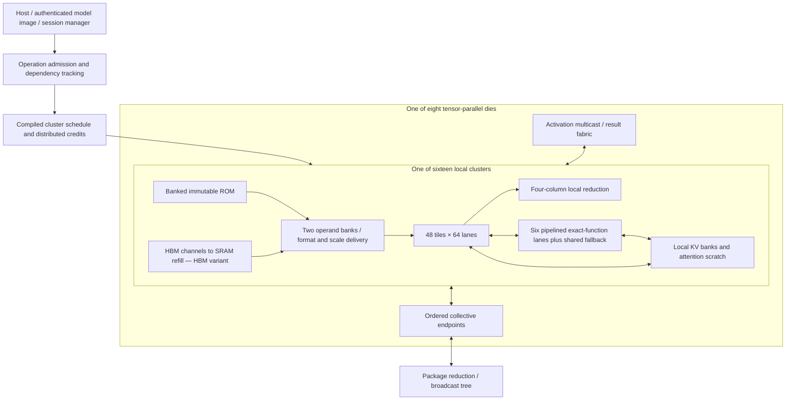

# ROM-first accelerator redesign for review

Date: 2026-09-23. Status: **proposed architecture, not an implemented or
performance-qualified design**. This proposal follows the
[top-down gap analysis](ROM_HBM_PERFORMANCE_GAP.md). It does not replace the
production configuration or authorize a new numerical contract.

## Feasibility correction: sequential recurrence rejects the latency target

**The first feasibility audit rejects the 85/75 µs performance point under the
unchanged whole-K sequential RNE contract.** The resource inequalities below
were necessary but incomplete: the assumed 65% lane utilization did not account
for per-output dependency chains at batch one.

Even with one dependent accumulation per cycle, unlimited parallel output columns
and zero attention, memory, control or communication delay, Qwen's linear chain
requires **888,832 cycles = 888.832 µs at 1 GHz**. This is 27.776× the allocated
32 µs linear phase. QKV has only 6,144 independent outputs and down projection
4,096, against 393,216 installed system lanes. More lanes do not shorten a
sequentially rounded dot product. Interleaving independent outputs hides pipeline
latency but does not remove this recurrence.

This bound assumes complete producer dependencies, as the proposal specifies.
Exotic exact multi-update-per-clock logic or a different streaming dependency
contract would require its own proof and area/timing model. It is not a bound
against all conceivable accelerators or vendor arithmetic.

The locality organization remains worth investigating, but **do not implement the
performance configuration yet**. Next compare the existing 128-element blocked
association, exact sequential alternatives and their numerical requirements.
The blocked tree is not bit-equivalent to sequential accumulation; the repository
already requires independent numerical qualification before acceptance. No
contract change is made here. In parallel, continue macro, collective and HBM
feasibility checks, which remain necessary even if recurrence is resolved.

Evidence: [dependency calculation](../results/architecture/redesign_recurrence_feasibility.json),
reproduced by `python3 tools/audit_redesign_recurrence_feasibility.py`. All following
85/75 µs budgets remain historical proposal targets, not accepted feasible points.

Further [blocked-accumulation feasibility analysis](ROM_REDESIGN_FEASIBILITY.md)
finds that block128 also exceeds the linear budget at the configured utilization
cap, and supplies a concrete counterexample to sequential bit equivalence.
No numerical or implementation alternative has been accepted yet.

## 1. Decision and performance contract

Build a **distributed digital accelerator with bank-local ROM, local mutable KV,
cluster scheduling and dedicated hierarchical reduction/collective networks**.
Reuse the compute and numerical-service interfaces for an HBM version, but give
HBM a reuse-oriented SRAM hierarchy and its own best workload mapping.

ROM's primary advantage is the removal of repeated external weight reads and
long-distance weight transport. It must retain that locality through the complete
execution path. A very fast ROM feeding a narrow global operand bus loses the
advantage before arithmetic begins.

The first complete validation is Qwen3-8B, BF16, batch-one decode at 8K context,
eight 815 mm² dies, one resident session. This is large enough to exercise real
weight/KV capacity and small enough to trace every bottleneck. It is a validation
vehicle, not the whole product scope: dense prefill, higher batches, long contexts,
MoE Flash/Pro, V4.1, vector work and distributed execution remain required.

**Performance objectives:**

- Primary: at least **3× lower measured token latency** than the best admitted
  equal-area HBM design on the agreed low-batch workloads, with identical model,
  numerical behavior, context and correctness qualification.
- Qwen engineering budgets: **85 µs/token** with phases charged serially; pursue
  **75 µs/token** only after a finite-buffer trace proves at least 10 µs of safe
  overlap within the layer. These are requirements, not projections.
- Report aggregate throughput, p50/p95/p99 latency, per-user latency, watts,
  J/token, silicon area and memory/package costs separately. No claim of 3× at
  every batch/context: HBM can amortize weight traffic, and ROM's advantage shrinks.
- Comparison sets: (A) identical-core HBM twin, including SRAM bought with freed
  ROM area; (B) independently optimized HBM under the same total area envelope;
  (C) the repository's vendor GPU configurations with their own topology choices.
  A win over A alone is not a win over B or C.

The accounting gives a useful but conditional result. An 85 µs ROM implementation
would exceed a specified 640-MiB-extra-SRAM/die HBM twin's *weight-only bandwidth
ceiling* by **3.19×**. Giving that twin every remaining square millimetre as ideal
weight-cache SRAM tightens ROM's required time for 3× to **78.56 µs**. Thus 85 µs
is insufficient to establish the broad objective. The 75 µs target clears this
particular stronger bound, but an independently redesigned HBM machine may do
better still. We will keep that comparison open rather than weaken HBM.

## 2. What changes architecturally

| Current limitation | Proposed organization | Why it helps / acceptance condition |
|---|---|---|
| Five-die pipeline serializes a user's traversal | Eight-die tensor group for the first low-latency ROM target | Concurrent matrix/KV shards; must pay collectives and replicated state |
| KV crosses a shared 4,608-B/cycle delivery path | KV banks beside attention consumers, with 16 independent cluster paths/die | Removes the global delivery bottleneck; bank conflict and whole-GQA reuse measured |
| Weights traverse generic delivery/control paths | ROM subarrays terminate in local format/scaling units and operand staging | High bandwidth is local; no assumed global terabyte bus |
| Fine-grained runtime work repeats descriptor resolution | Operation admission once, bounded local microprograms and tile credits | Removes command overhead while preserving operation identity, bounds and faults |
| Scalar reduction halves potential MXFP4 service | Four-column/cycle local reduction, separately sized upper tree | Low-precision MAC groups get a consumer that can keep up |
| Thousands of serial cycles per exact exponential | Pipelined certifying common path plus bounded exact fallback | Throughput target accompanied by fallback probability, bursts, area and proof |
| One generic fabric carries all traffic | Separate weight-local, activation/result, KV-local and control/collective service | Avoids shared hot spots; every bridge still has finite queues and credits |
| Clock optimized before system rates are fixed | 1 GHz compute/control requirement, independently qualified macro/PHY boundaries | Frequency and transaction initiation interval both enter the model |
| ROM advantages assessed against an undersized HBM path | HBM channel striping, adequate in-flight reads, persistent weight cache and GEMM reuse | Several-fold advantage must survive a competent HBM implementation |

## 3. Organization

Weights are striped across local subarrays in the same order as the consumer's
K traversal. Every cluster holds a slice of every layer it executes. A tile group
is reused across layers; there is no assumption that all layer-specific compute
is simultaneously active. The compiler must prove active-layer stripes engage
enough local ports; installed aggregate bandwidth is not sufficient evidence.

Use output-column sharding for independent products and whole KV-head ownership
where possible. Use K splitting only where the permitted accumulation order can
be preserved or an independently approved blocked contract exists. Pin reductions
to deterministic logical trees; placement changes must not silently reassociate
floating-point sums. The design cannot assume four grouped BF16 products when
the current lane supports one.

An activation multicast tree supplies cluster-local buffers; weights never cross
that tree in normal ROM execution. Partial and final results use bounded queues.
Cross-die traffic is activations, deterministic reductions and session/control
state. Links do not carry steady-state weights in the ROM profile.

## 4. Concrete Qwen performance configuration

The executable review configuration is
[`rom_hbm_review_v3.json`](../configs/architecture/rom_hbm_review_v3.json). Its
`rom_performance_variant` is the primary performance proposal. The smaller
512-tile/die, 150 µs version is retained as a bring-up sensitivity and explicitly
fails the threefold target.

| Resource | Performance proposal |
|---|---:|
| Dies / planning area | 8 × 815 mm² = 6,520 mm² |
| Assumed engineering clock | 1 GHz |
| Clusters per die | 16 |
| Compute tiles per cluster | 48 |
| BF16 lanes per tile / die | 64 / 49,152 |
| Tensor utilization requirement | 65% of arithmetic peak |
| Raw ROM per die | 2.108 GB including configured alignment/reserves |
| Local weight port per tile | 256 B/cycle, including format/scale service |
| Weight delivery utilization requirement | 65% of installed local port capacity |
| KV capacity per die | 160 MiB, enough for this one-session 8,256-position profile |
| Local KV delivery per cluster | 1,024 B/cycle, 75% delivered utilization |
| Attention / stream scratch per die | 16 MiB / 32 MiB |
| Exact-function lanes per die | 96, initiation interval one, 80% useful utilization |
| Exact fallback engines per die | 8, with measured latency and bounded demand |
| Cross-die collective target | ≤150 ns/event, including full payload and reduction |

The 256-B/cycle weight port requires two independently banked 128-B/cycle sources
or equivalent. Increasing the interface width in RTL does not create a ROM macro
port. Macro count, row geometry, sense-amplifier activity, bank conflicts, wires
and service timing must substantiate this requirement.

The KV interface requires eight 128-B/cycle source banks per active cluster and
adequate local QK/AV consumers. Bank placement must preserve whole K/V vectors
and reuse one KV head across its four Qwen query heads. With no GQA reuse, KV
traffic can grow fourfold and break the budget.

### Inclusive area allocations per die

| Allocation | mm² |
|---|---:|
| ROM, including configured capacity reserves | 224.72 |
| KV SRAM | 43.36 |
| 768 tensor tiles, legacy planning seed | 223.72 |
| Attention scratch | 4.34 |
| Stream scratch | 8.67 |
| Exact functions, tables, certification and fallback | 96.00 |
| Reduction and format conversion | 24.00 |
| Local fabrics and package endpoints | 60.00 |
| Control, management and integrity | 30.00 |
| Clock, power, repair and physical reserve | 60.00 |
| **Allocated** | **774.81** |
| **Unallocated within 815 mm²** | **40.19** |

These are allocation caps under existing N5 density assumptions. They are not
placed areas. In particular, the old tile-area seed has not priced the new wider
ports or bank topology. Replace it with nonoverlapping placed core/macro budgets;
charge all incremental logic and wiring within the caps or reject the point.
No double counting of a tile's included SRAM/reduction is permitted. The exact
function cap averages 1 mm² per fast lane including shared fallback, a requirement
that synthesis must test, not an established implementation cost.

At half the assumed ROM density, even the smaller bring-up version exceeds the
die area. This is a macro-density gate, not something controller tuning can fix.

## 5. Latency budget and dependency schedule

For Qwen at 8K, use 15.137 GB of active weights, 1.208 GB of KV, 15.137 Gop of
linear arithmetic **plus 4.832 Gop of QK/AV attention arithmetic**. The latter is
explicitly added because the analytical tensor inventory alone omitted it here.
There are 9,437,184 attention scores that may require exponential service.

| Phase | Necessary service floor at proposed rates | Allocated serial budget |
|---|---:|---:|
| Linear operators: local weights and compute | 14.81 µs weights; 29.61 µs compute | 32 µs |
| Attention: KV, QK and AV | 12.29 µs KV; 9.45 µs arithmetic | 16 µs |
| Exact functions, normalization and selection | 15.36 µs for one exp/score alone | 18 µs |
| Admission, dependencies and phase boundaries | Unqualified | 4 µs |
| 72 collectives | 10.8 µs at 150 ns/event | 12 µs |
| Reserve | — | 3 µs |
| **Target, charging phases serially** | **Not a predicted latency** | **85 µs** |

Floors do not prove the allocations. Layer sizes, load imbalance, fill/drain,
normalization, selection and contention must fit their remaining margins. In
particular, the exact-function phase has only 2.64 µs beyond score exponentials;
its additional work needs an explicit rate derivation.

The 75 µs objective requires recovering at least 10 µs through a measured
schedule. Candidate overlap is **across independent heads and score tiles within
one layer**: prepare QK for a later tile while a previously completed tile enters
certification or AV. Keep numerical ordering and all resource reservations.
Use tagged completion queues, retain uncommitted outputs on chip, and publish
only after all required tile results are valid. Do not start a dependent layer
from uncommitted partials. If the numerical contract requires a global maximum,
complete that pass first; no online-softmax reassociation is assumed.

The trace must charge a shared MAC array once, bound all queues and retain the
critical path through the slowest fallback. If 10 µs of overlap cannot be proved,
75 µs is withdrawn and the design has not met the stronger threefold target.

### Attention scratch and dataflow

Use a maximum pass, then exact offsets/exponentials, then the specified sum and
AV association. SRAM holds scores/probabilities as needed to avoid repeated QK
or HBM reads. Two 32-bit arrays for all 8K Qwen scores require approximately
9 MiB/die; 16 MiB permits metadata and tiling, subject to concurrent queue checks.
The GQA consumer reuses K/V locally across query heads. No global score tensor
round-trip is needed. Long-context profiles must resize or tile this scratch and
charge rereads; the 8K resource point fails 32K capacity and service checks.

### Collectives are a hard go/no-go condition

Each 24 KiB event payload takes at least 48 cycles through a 512-B/cycle endpoint.
The 150 ns target must include reduction traversal, serialization, return/broadcast,
clock-domain crossings and contention; the serializer time is not the collective
latency. A 64-B/cycle endpoint is categorically too narrow. At 1 µs/event, the
72-event cost is 72 µs and breaks the design budget.

Implement a small package tree with deterministic reduction order and explicit
striping. Do not infer this latency from an NVLink bandwidth label or a mesh hop
number. If package/PHY evidence cannot meet it, evaluate fewer tensor shards,
hybrid layer groups or wafer-local placement with *recomputed* capacity and token
latency. Pipeline grouping saves collective distance but adds serial traversal;
it is an alternative to price, not a free correction.

## 6. Exact numerical-service architecture

A collection of the existing serial exponential engines is not area-efficient
enough for the target service. Build a shared family of certified, deeply
pipelined common paths for exp, reciprocal/division, sigmoid and other required
functions; specialization is allowed only where the consumer's domain proves it.

For exponential:

1. Decode/classify and handle exact zero, range limits and domain errors.
2. Perform exact or bounded range reduction with an explicit error interval.
3. Evaluate a table-assisted polynomial or another interval-certified formulation
   in a pipeline; table sizes, coefficient precision and degree are design-search
   parameters, not yet selected constants.
4. Propagate conservative errors through reconstruction. Publish a result only
   when endpoint rounding agrees under the existing contract.
5. Send ambiguous cases to the exact iterative fallback, preserving argument,
   operation and request identity. Merge completions into deterministic order.

Consumers that require **unrounded interval endpoints** need a compatible
interface and proof; correctly rounded FP32 output alone is insufficient for
sqrt/softplus or other compositions. Preserve refusal codes, asynchronous reset,
backpressure, cancellation and stale-result rejection.

The common path's target is initiation interval one. Deep latency is acceptable
only when independent requests hide it and the complete layer's tail meets budget.
With 96 lanes and eight fallbacks per die, a 2,880-cycle fallback can sustain only
about **3.39×10⁻⁵** fallback fraction inside the 18 µs phase at the configured
80% fallback utilization. Target **≤10⁻⁵** on qualified traces, then test adversarial
bursts separately. An average miss rate does not bound the slowest head or p99.
Use per-cluster admission credits, a finite reorder buffer and an overflow policy
that stalls safely. Never substitute an uncertified result to maintain throughput.

The ongoing tail-fold experiment suggests an exact way to reduce serial fallback
work: its 4,200-case comparison preserved interval endpoints while reducing
aggregate service cycles. It is still isolated and lacks full qualification; this
proposal credits it with **no** extra throughput. Even a faster serial fallback
is not a replacement for the high-throughput common path.

Other services require separate budgets: index dots and head combination, ordered
sums, normalization, top-k, conversion, compression, Sinkhorn and selection. Share
arithmetic only when a workload schedule proves the port/queue capacity. Preserve
comparison tie rules and reduction associations. Approximate arithmetic remains
outside the approved contract.

## 7. ROM macro, placement and power architecture

Choose digital ROM feeding nearby digital compute for the primary implementation.
Do not select compute-in-ROM based on the earlier retracted area/bandwidth claim.
A precompute/select variant may be evaluated later only with its larger cells,
product-line capacitance, capacity and numerical contract accounted for.

Each cluster needs a bank directory mapping model objects to physical bank, row,
column and format. The immutable descriptor image specifies checksums, geometry,
scale placement, spares and repair status. Load/activate validates the image once;
per-operation admission validates ranges and resource ownership. The local ROM
request then carries a compact admitted object/offset/length plus operation epoch.
Runtime endpoints still refuse unauthorized or repaired-out ranges.

Physically partition ROM rows so consecutive K blocks stream into the local
operand ring. Replicate small hot constants when their byte/area cost is cheaper
than their broadcast cost. Replicate large experts only from measured routing
skew and a charged capacity budget. Cold banks are clock/power gated where the
macro supports it; simultaneous active-bank current, droop and thermal limits
bound the real service rate.

Require characterized macro views for capacity, latency, initiation interval,
energy per accessed row/bit, repair behavior and PVT corners. **ASAP7 standard-cell
ROM emulation and sky130 bitcell measurements do not establish an N5 ROM macro.**
Keep the macro-density assumption visible until suitable evidence exists.

Power validation uses model-driven activity through macro, format unit, operand
ring, MACs, accumulators and result transport. No energy credit for “weights do
not move”: weights move locally and that energy must be counted. Compare J/token
and watts against the matched HBM machine at equal workload and achieved rate.
An allocation fitting 815 mm² says nothing by itself about package cooling.

## 8. HBM architecture: a strong baseline and a useful product

The HBM version shares admitted-operation interfaces, tensor tiles, exact services
and deterministic reductions. Replace local ROM service with a banked SRAM
weight hierarchy fed by independently scheduled HBM channels.

- A matched twin keeps the same compute/KV allocation, adds 50 mm² of HBM PHY per
  die, and uses 640 MiB/die of additional persistent SRAM in place of ROM.
  The performance configuration allocates about **773.54 mm²/die** before the
  remaining area is assigned. Give the comparator the best useful allocation of
  that remainder; do not leave it intentionally idle.
- Keep dense hot matrices resident where capacity allows. Use distinct policies
  for persistent weights and transient double-buffered tiles. Charge metadata,
  ECC, associativity/conflicts and capacity lost to activation/scale buffers.
- Stripe bursts across real channel/bank mappings; coalesce gathers and preserve
  response IDs. At 4.5 TB/s, 1 GHz and 120-cycle assumed read latency, the whole
  die needs at least **540 KB of in-flight data**, approximately **8,438 64-byte
  transactions**, to cover the bandwidth-delay product. A controller with four
  outstanding reads is a building block, not the entire die's concurrency.
  Burst coalescing may reduce tag count but not in-flight bytes.
- Use output-stationary/reuse-capable execution for prefill and batches: one
  loaded weight tile serves multiple activation rows. Provision independently
  banked activation and accumulator storage. Handle tails and strides without
  silently rereading every weight per output row.
- Reserve HBM service for mutable KV and faults/draining; do not grant all ports
  simultaneously to weights and KV. Separate traffic classes with bounded
  starvation, and measure delivered useful bytes rather than bus occupancy.

At batch one, the HBM twin may service KV from its retained SRAM, so the strict
comparison in the calculator uses **HBM weight traffic only**, after an ideal
persistent cache hit on all additional SRAM bytes. This favors HBM and avoids
inventing KV traffic on a path the twin need not use.

The eight-die twin's remaining weight stream gives a 271.34 µs minimum at 36 TB/s.
That establishes 3.19× relative to 85 µs *only for the declared cache size*. With
all unused area ideally converted to weight SRAM, the floor falls to 235.69 µs,
requiring ROM ≤78.56 µs for 3×. The 75 µs target would imply at least 3.14× against
that particular bound if achieved. Neither number proves parity with an HBM design
that trades compute for still more SRAM or uses different technology/topology.
Evaluate that independent Pareto frontier as a release condition.

A particularly important alternative is an SRAM-heavy HBM system: Qwen's active
weights alone require about **489 mm² of ideal SRAM per die** across eight dies;
the complete checkpoint requires about **529 mm²/die**, before ECC/metadata and
reserves. This could fit only by reducing other allocations, potentially compute
and numerical services. If it becomes capacity-feasible, the external weight-read
bound disappears after warm-up. Compare its local SRAM bandwidth, remaining
compute, numerical service and power against ROM. ROM's advantage would then come
from denser weight storage leaving more area for useful engines and local ports,
not from a presumed compulsory HBM read. The required Pareto search must include
this challenger and warm-cache operation on both sides.

## 9. Extending to Flash, Pro, V4.1, long context and wafer systems

The same local-compute architecture scales, but the Qwen footprint and latency
must not be copied to larger models. Capacity first: at approximately 2.108 GB
raw ROM/die and 2% reserve, a simple checkpoint-only screen requires roughly
81 dies for Flash, 433 for Pro and 248 for all-ROM V4.1. These are *lower-bound
screens*: placement, replicated metadata, spare granules, tables, image reserves
and skew can increase counts. A wafer is a physical placement option, not a
license to replace serial work with aggregate bandwidth.

For MoE, use expert-group-local ROM and activation multicast to only the selected
experts. Place dense shared operators in a nearby service group. Within an expert,
stripe matrices over enough active banks and lanes to meet service time. Across
experts, schedule independent token work concurrently; dimension queues using the
busiest expert, not average load. Measure router traces and worst-case concentration.
Activation/output traffic, hot-expert stalls and merge order are mandatory costs.

Use hierarchical collectives: cluster-local, expert/tensor-group-local, then only
necessary cross-group results. Partition groups according to model dependencies
and real wire distance. Pro's capacity can force multiple wafers; cross-wafer
latency is charged on each dependent transition. No global all-reduce over every
installed die when only a small expert group is active.

Mutable KV/index placement is independent of immutable weights. For Flash at
200K, the existing inventory requires about 3.04 million attention scores and
67.2 million index-score items/token. At a 100 µs target those alone require
30.4 Gscore/s and 672 Gindex-items/s; an item can contain multiple products and
reductions. Instantiate index service beside its keys and deliver selected KV
locally. Before accepting a Flash target, expand each item into exact arithmetic,
traffic and dependency counts. Never treat item/s as MAC/s.

V4.1's approximately 203 GB Engram placement is a separate design choice. Keep
an explicit all-ROM variant and an HBM-resident-table variant; charge lookup
traffic, capacity, latency and energy identically for each comparator. Host
placement is another scenario with PCIe/network service, not a free capacity fix.

Long-context/multiple-session designs choose SRAM KV, HBM KV or a hierarchy from
capacity and access locality. More HBM capacity does not supply more local ports.
At 32K the Qwen one-session profile needs about four times its 8K KV and scratch
capacity; the present proposal is explicitly rejected without a new allocation.
At high batch, optimize aggregate throughput and p99 independently of low-batch
latency. A uniform “ROM always 3× faster” requirement is unsupported by physics.

## 10. Compiler, runtime and control contract

Compile operation-level schedules with immutable identity, legal ranges,
per-cluster shard map, scale offsets, bank layout, reduction order, bounded queue
use and expected completion work. Admit once, then let local controllers traverse
loops and stream tiles. Do not re-resolve tensor views or divide geometry for each
MAC pass. Double-buffer configuration and operands only where producer/consumer
ownership is explicit.

The global controller tracks coarse operations and dependency events. Cluster
controllers track tile credits and local completion. Preserve the current
four-range overflow rule until an alternative is separately proven: range
overflow cannot drop a dependency. Atomic reservation precedes younger issue;
retirement waits for acknowledged writes. Epoch tags invalidate stale completions
on reset/cancellation. Failures drain all accepted traffic before releasing storage.

The 4 µs control budget is aggressive relative to earlier serial-control records.
It is a redesign requirement, not a forecast from small counter optimizations.
Measure instruction admission, first-data latency, useful issue occupancy and final
commit separately. Compiler/runtime cycle costs must be derived from these events.

### Interface and queue decisions to implement first

Use decoupled ready/valid interfaces with bounded queues at every cluster edge.
An admitted operation carries an operation ID, epoch, shard, numerical-contract
ID, object bounds, and permitted output interval. Stream beats carry tile/sequence
ID, byte mask, last marker and error status. Numerical requests additionally carry
lane/head and destination slot. Completion carries status and acknowledged work,
not merely an arithmetic-done pulse. Widths are selected from the maximum admitted
deployment, with overflow refused; no fixed-width truncation is allowed.

Initial local queue proposal: two operand banks, two configuration slots, four
completed output tiles, and 64 ambiguous-function entries per cluster. These are
bounded starting points for queue simulation, not throughput assumptions. A
640-MiB persistent HBM cache is separate from transient operand banks and cannot
also be counted as in-flight storage. Credit reserves must ensure accepted faults
and write acknowledgements can drain even when new work is stopped.

Admission, execution and publication are distinct. A tile may execute speculatively
within an already admitted operation, but dependent public state changes only on
ordered completion. Reset increments/invalidate epochs and clears validity;
private payload may omit reset only if initialization-before-use is proven.
Independent clock domains use explicit CDC FIFOs and synchronized epoch handling.
A slower ROM macro uses interleaved banks only if aggregate service and energy
are measured; the compute clock does not force the macro to operate at 1 GHz.

### Power and energy acceptance proposal

In addition to 3× latency, target **at least 2× lower J/token** on the primary
low-batch workload, with both systems measured at their achieved operating points.
Since energy/token = average power × token latency, 3× speedup permits at most
1.5× comparator power to retain a 2× energy advantage. Package thermal and power
delivery limits remain independent hard constraints. Include static ROM/SRAM
periphery, HBM background power, PHYs, idle tiles and host service within the same
boundary. Pre-layout default toggle factors are insufficient to accept this gate.
No numerical power target is invented before the macro/activity budget exists.

## 11. Implementation changes and reviewable checkpoints

| Order | Change set / existing anchors | Completion evidence |
|---|---|---|
| 0 | Add this review configuration and resource/sensitivity calculator; retain v2 production contract | Reproducible numbers, explicit rejected points and unqualified rates |
| 1 | Extend analytical/cycle accounting: local paths, auxiliary demand, placement, shared-resource scheduling | Same counters/units/workload at analytical, cycle and RTL levels; no fitting the final total |
| 2 | Local ROM-to-tile path: `rtl/rom/ot_rom_read_service.sv`, `ot_rom_bank_array.sv`, runtime operands, bank ownership | Actual checkpoint payloads through admitted descriptors to arithmetic, repair/bounds/fault coverage, sustained bank service |
| 3 | Cluster-local KV/attention scratch and GQA reuse; `ot_a3_attention_*` | Full attention exact outputs and measured bytes; no hidden global bottleneck or rereads |
| 4 | Four-column reduction and wider local delivery; `ot_a3_tile64.sv`, tree endpoints and reduction units | Exact association, format/scale/tail coverage; measured initiation interval in containing cluster |
| 5 | Certified fast numerical services with fallback | Error proof, hard cases, exhaustive feasible domains, differential corpus, bounded queue/fallback bursts and complete consumers |
| 6 | Hierarchical issue, operation epochs and package collectives | Work conservation, deadlock/fault/reset qualification, measured collective latency and complete token critical path |
| 7 | HBM channel service, persistent cache and GEMM reuse | Same kernels/contracts; sustained read/write/acknowledgement bandwidth and independent equal-area tuning |
| 8 | Harden selected clusters and integrate hierarchy | Setup/hold/DRV/DRC/antenna and macro timing; current source hashes; activity-based power and package budgets |
| 9 | Expand dense/MoE/long-context/distributed deployments | Independent oracle correctness, calibrated complete-workload latency and energy on both designs |

Only checkpoint 0 is delivered by this proposal. Existing RTL improvements remain
useful inputs; they are not presumed to implement the new architecture. Preserve
current ABI behavior and review new interface parameters before switching defaults.
Commit each proven vertical path on `main`, with old/new counters and the measured
system effect. Keep experiments isolated until containing-engine qualification.

## 12. Acceptance, falsification and review decisions

The architecture is accepted for a workload only when:

1. Exact deployment capacity, numerical behavior and all issued operator families
   are qualified on both targets. No model change creates the apparent speedup.
2. Every required macro/port/queue/endpoint has a physical allocation and measured
   service contract. The complete schedule respects them under backpressure.
3. The source-current model predicts measured RTL cycles within the existing ±10%
   band, term by term; current containing-engine clocks qualify the time conversion.
4. The complete token meets the latency target and at least 3× over the best
   admitted matched HBM implementation, with the comparator independently tuned.
5. Area, workload power and energy meet explicit product/package limits; no
   macro-density or node-transfer assumption is relabeled as silicon evidence.

Reject or revise the point if any of these gates fail. Recorded sensitivities
reject insufficient ROM density, slow collectives, large fallback demand, or an
unresized 32K context. Half weight-port utilization breaks the smaller bring-up
configuration; the wider performance configuration can absorb that particular
loss because its linear compute floor is higher than its weight-service floor. Higher HBM
bandwidth tightens the speedup requirement rather than being excluded.

**Recommended review decision:** proceed with the ROM-local cluster architecture
and the eight-die Qwen validation scope, treat 85/75 µs as go/no-go engineering
budgets, and prioritize macro/local-service, exact-function and collective proofs
before another large sweep of isolated component optimizations. Keep HBM's
independent equal-area optimization as a mandatory comparison. The primary
uncertainties are numerical-service area/throughput, macro bandwidth/density,
collective latency and safe within-layer overlap; none is solved by this document.

## Reproduction

Run `python3 tools/evaluate_rom_hbm_redesign.py` to regenerate
[`results/architecture/rom_hbm_review_v3.json`](../results/architecture/rom_hbm_review_v3.json).
The evaluator checks capacity, area caps, service inequalities, cache-aware HBM
bounds and explicit failure sensitivities. A passing necessary-condition check is
not architecture acceptance: output fields for qualified latency and speedup remain
null. The 75 µs overlap target is intentionally not credited by the calculator.
