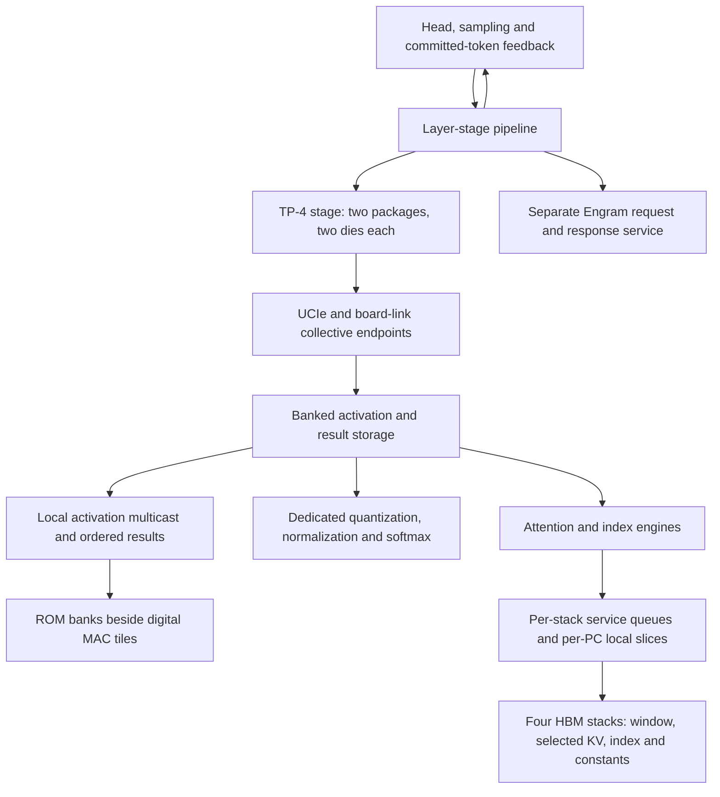

# DeepSeek-V4.1-Flash fabric: design review and proposed architecture

**Design priority clarified:** single-user decode latency comes first; multiuser throughput is secondary. See the [top-down design directive](../DEEPSEEK_V41_SINGLE_USER_DESIGN.md) for the selection process and acceptance gates.

Date: 2026-09-28. Baseline: main `fb1828b9`, plus explicitly identified candidate branch evidence below. **This is a proposal and blocker analysis, not a new throughput result.** Optimize measured single-user latency and sustainable multiuser throughput within the same physical die, storage and cooling budget. Do not select a target token rate and work backward from it.

## 1. Recommendation

Use **weight-stationary ROM banks with nearby digital MAC tiles**, banked activation storage and pipelined activation/result links. Share expensive activation stores, conversion pipelines and selected compute only within a physically bounded neighborhood. Keep dedicated normalization, quantization, softmax and reduction circuits. Compare strictly local compute with nearest-neighbor compute sharing at equal placed area, capacity and peak power. Do not assume a whole-die weight crossbar or a free 10% pooling overhead.

Independent users should stream through layer stages. This can fill otherwise idle local tiles without shipping weights across the die. A user's next autoregressive token still waits for its previous token's result and state commit. Optimize both that feedback latency and the stable interval between independent requests.

The current design's deepest problem is the absence of one common executable contract connecting **tensor placement → instructions → packets → memory ports → physical layout**. Fast component results do not yet form one feasible full-token schedule. Establish that contract before widening additional components.

## 2. Hierarchy and boundaries

These are logical traffic classes and placement boundaries. They are not extra unpriced physical networks.

| Boundary | Traffic | Proposed implementation | Required proof |
| --- | --- | --- | --- |
| ROM bank to MAC | Packed weights, scales | Fixed local wires; registered bounded bank selection if shared | Exact checkpoint-to-macro map, capacity, local route and energy |
| Within a compute neighborhood | Activations, accumulators, SFU results | Banked stores, registered multicast, destination credits | Port conflicts, fanout, simultaneous activity and exact rounding |
| HBM edge | Index, window/selected KV, constants; weights in comparator | Shared stack/PC service accounting; local PC slices, bounded outstanding bursts | Mixed-client throughput and fairness, not independent bandwidth ceilings |
| TP group | Activations and partial/results | Two-package relay or direct paths, explicit per-link queues, banked receive storage | Same compiled sequence, link occupancy, rank order and committed VM writes |
| Between layer stages | Residual state and split-expert transactions | Tagged forward and return messages; admission-controlled contexts | Integer ownership, reverse dependencies, expert skew and stable queues |
| Head and side services | Token feedback, Engram, ingest and control | Reserved progress resources and explicit state epochs | No cyclic wait, stale completion, tag reuse or starvation |

The modeled array has 28 TP-4 layer groups (112 dies), a four-die head group and 72 Engram table dies: 188 dies total. This is the existing model boundary, not a demonstrated feasible placement. Each TP group spans two packages. Package lane allocation is 52 TP, 14 stage-out, 14 stage-in, four switch and six spare lanes. Any revised allocation must conserve these lanes and account for both directions.

## 3. Findings that currently prevent a defensible final rate

### 3.1 Fractional expert placement is not an execution plan

The placement equalizes cumulative checkpoint bytes. All 27 stage cuts fall within routed-expert storage. The model then charges fractional expert time, although a token's selected experts can concentrate on one side. The full-shape exact emitter presently covers layer 0 within one TP group, not these stage cuts.

A candidate contiguous whole-expert map preserves ascending expert-ID order, but leaves only **4,914,108 bytes per die** at the tightest stage after modeled Engram spill. This excludes physical image padding and other unresolved overhead. The larger 67.9 MB candidate margin is before spill and cannot be used as free capacity.

For a split layer with early experts on A and later experts on B, a correctness-first sequence is:

1. A performs attention/router and its selected low-ID experts.
2. A sends normalized activation, selected IDs/gates and the ordered FP32 accumulator to B.
3. B applies its selected high-ID expert results in golden order and returns the accumulator.
4. A adds the shared expert last, completes the layer and forwards residual state.

The additional uncompressed useful traffic is **25,648 B forward and 5,120 B reverse per TP rank**, before the existing residual handoff. The reverse dependency is missing from the current model. This is a reference protocol, not the proposed final fast path.

**Design choice:** generate exact ownership first; compare (a) this ordered round trip, (b) moving or copying the small completion operators to B so the pipeline can continue forward, and (c) moving a stage boundary. Price any duplication, extra capacity or extra die. Contiguous expert IDs permit ordered continuation; arbitrary hash placement needs a reorder/merge mechanism and cannot reassociate FP32 additions.

### 3.2 The fast collective bench is not the emitted workload

The exact layer-0 builder emits 12 blocking collectives:

| Operation | Source 64-B VM words per die | Count |
| --- | ---: | ---: |
| q_a activation gather | 20 | 1 |
| KV projection gather | 8 | 1 |
| wo_b FP32 reduction | 320 | 1 |
| Shared and routed expert activation gathers | 36 | 7 |
| Router scores | 6 | 1 |
| Final y gather | 80 | 1 |
| Total | **686** | **12** |

The seven activation gathers contain BF16 values held in FP32 containers. The **471-cycle** candidate GW4 bench instead measures one proposed **266-word fused FP8-plus-scale descriptor**; its y gather takes 251 cycles. Those times cannot replace the emitted seven startups. The proposed packed descriptor still stores its codes inefficiently in VM containers and needs an actual packing/emission contract.

**Design choice:** first time the unchanged executable sequence. Then overlap each expert's BF16 activation transfer with other ready work, using bounded descriptors and real destination space. Pre-transfer FP8 quantization is a separate core/ISA packing contract to evaluate. Compare per-expert streaming with a fused descriptor that waits for all producers. Fusion is not automatically faster on the dependency path. Preserve per-expert BF16 w2 output rounding and ascending expert addition; preserve wo_b's `((r0+r1)+(r2+r3))` FP32 reduction before final rounding.

### 3.3 Endpoint service limits matter more than advertised link bandwidth

At 1.087 GHz, one 64-B VM word/cycle is **69.568 GB/s**; four write banks supply **278.272 GB/s**. The modeled T1 pair is about 171.3 GB/s and in-package UCIe is 4.2 TB/s/direction. Those link assumptions do not make the die's injection, receive, transpose or SRAM ports run that fast.

The collective RTL carries 512 payload bits plus tag/control/parity: 547 logical bits, before any PHY framing. For an n-word descriptor per source die, its relay algorithm sends n outgoing T1 records per die and 2n outgoing UCIe records per die: n of its own and n relayed from remote sources. A gather writes four source streams into VM. Count each of these copies and writes.

The full candidate has 128 credits for each source/parity domain, not one aggregate FIFO. At maximum one-record/cycle injection divided across two remote peers, minimum modeled round-trip latency alone implies roughly 140 in-flight records per peer. Relay and credit processing add latency. Deeper buffering must be selected from measured service and credit-return latency, then implemented in SRAM; it is not a substitute for bank throughput.

### 3.4 HBM service is fragmented across independently optimistic models

The physical stacks must serve index, window KV, selected compressed KV, RoPE and writes, plus every weight family in the HBM comparator. Existing behavioral W and K paths do not establish their mutual interference. The current K-side interface is much narrower than the per-PC index path.

| Object | Actual HBM representation | Consequence |
| --- | --- | --- |
| Window row | 528 payload B, 544-B pitched row | 17 sectors; a 128-row cold window reads 2,176 sectors |
| Selected compressed KV row | 288 B | Nine sectors; do not charge 528 B for its HBM read |
| Index key | 68 B in blocked code/scale layout | 262,144 local keys require 557,056 sectors |
| Canonical attention staging | Up to 640 expanded rows | Staging capacity is not HBM traffic |

Window rows currently reside on one stack for a given layer. One 32-B return/cycle gives a **2,176-cycle cold-refill floor**, even before latency/turnaround. The selected 512 CKV rows occupy 147,456 B across their owners; fetch each once and multicast packed data to consumers, charging network copies separately. Uniform ownership is an assumption; test concentrated selections.

A new pending source-pinned index-only gate (`a510bc4c`) reads 557,056 sectors exactly in **13,131 cycles**, or **42.423 sectors/cycle** across four stacks. This is below the model's roughly 103.5-sector/cycle effective ceiling. The collector has serial fill/valid/consume phases; its output cadence is a concrete bottleneck. A bounded pipelined collector fix is in progress. This measurement does not include competing KV/weight traffic.

**Design choice:** burst-capable, multiple-outstanding clients; local per-PC arbitration; reserved response-buffer credits; common stack timing and bandwidth accounting for all classes. Provide bounded progress to attention/control and fair remaining service to scans/weights. Use age and dependency readiness, not unbounded strict priority. Measure mixed traffic at the index-heavy layer before crediting overlap.

### 3.5 Local weight bandwidth and activation delivery need physical implementations

Specified lane counts imply **453,684 physical weight B/cycle** under current macro formats versus **348,288 useful B/cycle**. This is distributed local traffic, not a proposed central bus. The executable QE word and physical bank word differ. The default tile instantiation supplies 24,576 QE MAC/cycle versus the model's 264,960. Logical image coverage is insufficient without bank ownership and address depth.

The weight-dot RTL accepts a programmable weight input. It is digital compute adjacent to ROM; zero weight-delivery energy or multiplication inside a ROM bitcell is not established.

ME activation loading is another bottleneck: two K4096 loads through G4 cost 2,048 cycles per layer before compute. A candidate wider bank-major preload already reduces one small exact gate from 4,237 to 2,321 cycles, but the complete producer and routed multicast are not integrated. Replicating each small adapter's activation SRAM across every MAC group would consume roughly 81 mm² under one candidate ledger.

**Design choice:** multicast activation once into a bounded shared local store, with explicit consumer/read ports and registered delivery. Do not share weights globally. Select neighborhood size from routed timing, store port service and simultaneous power. Keep fixed tiles as the baseline; accept local sharing only if it improves the full schedule at equal budget.

### 3.6 The pin issue is localized but not fully resolved

The 32-PC flat arbiter exposed 40,332 I/O bits to 5,008 pin sites. A long PHY-edge strip can place the pins. A local one-PC request slice routes cleanly at 0.92 ns. Thus the original square-block failure is not proof of a fundamental system impossibility.

However, the revised power-accessible one-PC macro (`8a87c9ec`) still has one max-slew violation (337.19 ps versus 320 ps). Four-PC composition, full address width, real child timing, power access and the complete stack remain unproved. A 1.55-mm four-PC group repeated eight times also exceeds a 12-mm edge before extra channels.

**Design choice:** distribute PC slices along the PHY, register selection and return paths in small neighborhoods, and budget any second row or extra height. Characterize macro timing and power pins before composition. Bank collective storage into SRAM instead of routing enormous flop FIFOs. Passing pin placement, positive setup and a partial route are separate milestones; none alone closes the die.

## 4. Proposed flow control and concurrency contract

Every job and packet needs unambiguous user, token position/epoch, layer, operation, speculative slot, source rank and fragment identity. Derive field widths from admitted resident contexts and wrap policy. The current collective's zero-extended eight-bit sequence is insufficient to demonstrate arbitrary multiuser reuse. Widening tags changes wire/FIFO cost and requires renewed gates.

- Admit a transfer only after reserving its required destination storage or a bounded streaming window. Carry completion through the final SRAM write, not merely last-link reception.
- Separate request, response and progress/control dependencies using queues or virtual channels with explicitly reserved resources. They may share physical links; their capacities are counted once.
- Give relays real backpressure or admission credits. Current relay ports without ready need a documented reservation invariant.
- Compare descriptor identity, mode, count and `last` across ranks and against the expected operation. Reject stale or mismatched traffic.
- On fault, abort the entire participating group, reconcile credits, drain/invalidate old traffic and fence before tag reuse. One rank halting while peers wait is not recovery.
- For stage feedback, complete and release the old transaction at the head before admitting the next token for that same user. Do not retain a chain of buffers around the ring while waiting for its own feedback.
- Use separate per-user state and speculative epochs; rollback must invalidate the affected KV/activation state without consuming another user's completion.

These rules are proposed invariants. Validate the finite wait-for graph and adversarial backpressure, wrap, peer failure and two-user tests; do not call them a deadlock proof before verification.

## 5. Pipeline utilization and design selection

Let L include full token compute, transfers, sampling and state commit. Let II be the measured stable admission interval for independent users. For U homogeneous users, aggregate throughput cannot exceed `min(U/L, 1/II)`; filling the pipeline requires roughly `L/II` users plus adequate state and buffering. Arrival bursts and expert skew require a queue trace.

Report isolated and loaded per-user latency, aggregate emitted tokens/s, tail latency, stage occupancy, bank/link service, useful and issued MAC work, physical bytes, queue peaks and hottest-die power. ROM expert tiles can be idle in a latency-optimal single-user design. Multiuser filling can improve utilization but competes for the same ROM ports, KV buffers and links. Neither maximum MFU nor maximum MBU is the objective.

Evaluate three mappings in order: fixed local ROM/MAC tiles; limited adjacent-bank sharing; and the best feasible local pipeline schedule for multiple users. Use identical die counts, all memory overhead, cooling, arithmetic and workloads. Any extra capacity or replication is charged to both the design comparison and the matched HBM baseline.

## 6. Implementation and acceptance order

| Priority | Work | Completion gate |
| --- | --- | --- |
| P0 | One immutable ownership/layout manifest | Every tensor fragment, expert, scale and physical bank row accounted for; capacity includes spill, padding and metadata |
| P0 | Compile packets and resource use from the exact program | All emitted instructions, copies, rounding points, HBM requests and destination writes covered; no benchmark substitution |
| P1 | Real layer-0 TP group | Four-rank exact state with actual collective sequence, finite VM/activation ports and mixed weight-source mode |
| P1 | Two-stage split layer with two users | Experts selected on both sides, exact ordered accumulation, forward/return packets and stable bounded queues |
| P1 | Index-heavy layer with shared HBM | Pipelined collector plus window/selected KV, constants and comparator weights; exact output and measured contention |
| P1 | Representative physical neighborhoods | Local ROM/MAC, activation multicast, powered PC group and collective SRAM endpoint; full timing/DRC/slew constraints |
| P2 | Full array AR then MTP | All layers/head, feedback, context/rollback and Engram traffic exact; achieved-frequency cycles and accepted-token count |
| P2 | Matched ROM/HBM comparison and pipeline fill | Same program/arithmetic/area scope; all weight families classified; stable II and per-user tails under representative and concentrated expert routes |

The first useful result is an executable layer and split-stage slice whose traffic and routed resources agree. It can establish which optimization actually shortens the critical path. A defensible new token rate follows the integrated trace; this review deliberately assigns none.

## 7. Evidence sources and limitations

Main sources: `tools/v41_die_placement.py`, `tools/v41_rack_design.py`, `tools/arch_budget_v41.py`, `tools/arch_utilization_v41.py`, `runtime/prefill/v41_hbm_placement.py`, `rtl/chip/ot_chip_v41x_hbm3e_phy.sv`, and their architecture records. Link rates/latencies are modeled inputs, not measured PHY silicon.

Candidate evidence inspected on 2026-09-28, **not all merged into this document's baseline**:

- Stage ownership: `codex/v41-fullshape-emitter-binding`, `75129135`, `results/arch/v41_stage_owner_preflight.json`.
- Collective executable/bench comparison: `05ad9903`, `tools/hdc_replay_v41.py`, `results/rtl/v41_collective_gw4_banked.json`; layer-0 only, full die not routed.
- Physical boundaries: `codex/v41-die-physical-next`, `8a87c9ec`, `docs/V41X_DIE_PHYSICAL_PREFLIGHT.md`; powered macro remains not-met on slew.
- Index: `codex/v41-four-stack-verilator`, `a510bc4c`, `results/rtl/hdc_v41x_idx_four_stack_verilator.json`; index-only exact gate.
- ME preload: `d7e0e740`; small exact preload gate, full producer/store/network integration pending.
- Local ROM audit: executable QE/physical ptile formats and target lane arithmetic; comparison of ASAP7 macro areas with analytical N5 budgets does not establish physical fit.

All branch findings must remain scoped to their pinned sources when merged. Newer component passes may remove an individual blocker; they do not retrospectively validate earlier headline figures.
