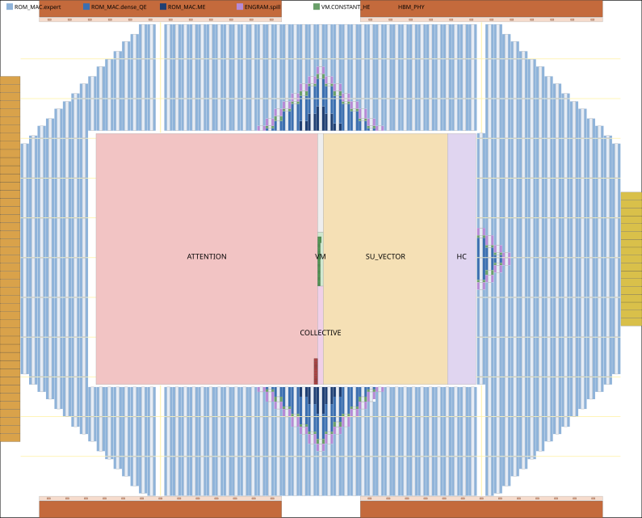

# V4.1 ROM layer die: integer macro map and packed floorplan

Status: rungs 2 and 3 of the [acceptance ladder](INTEGRATED_PHYSICAL_PLAN.md) for the DeepSeek-V4.1 ROM layer die. Rung 2 is integer placement. Rung 3 is a macro-packed floorplan, a proposal that has not been routed. It replaces the geometric reservation in [V41_PHYSICAL_FLOORPLAN.md](V41_PHYSICAL_FLOORPLAN.md). It does not replace the connectivity ledger.

| Gate | Result | Record |
|---|---|---|
| Integer macro map, all 112 layer dies | Every tensor slice bound to whole `ot_rom_8192x274_m8` macros. The payload equals the earlier audit on all 112 dies, byte for byte | `results/floorplan/v41_die_macromap_expanded_woa.json` |
| Named bank map, busiest die (stage 1 rank 3) | 13,798 macros, 1,675 entries, IDs contiguous | `results/floorplan/v41_die_bankmap_busiest_expanded_woa.json` |
| Capacity against the packed floorplan | **Closes**: 17,152 wide-macro slots against 14,203 required. The template holds the per-group maximum over every die. 1,474 pair rows are spare | `results/floorplan/v41_pack_expanded_woa.json` `capacity` |
| Placement legality (own checker) | 0 overlaps with halos, all inside the die, all ROM/SRAM on the joint site/track grid, all 46,315 checked ROM/SRAM pins on track | `legality` |
| Placement legality (OpenROAD, ORFS image) | 14,370 macros FIRM: 0 overlaps, 0 outside the die, 0 off the site grid | `results/floorplan/v41_pack_orfs_check_expanded_woa.json` |
| HBM3E PHY abstract | **Fails**. All 22,237 signal pins are off the M5 track because the abstract has 24 pin phases, so no origin can fix it. Its M4 power pins sit under its own M5 OBS, so pdngen PDN-0006 fails | `legality.abstract_defects`; ORFS record |
| Channels | Maximum utilisation 0.722 on the horizontal spine, 0.42 on the HBM corridors | `channels` |

Regenerate the records with:

```
S=~/.cache/huggingface/hub/models--deepseek-ai--DeepSeek-V4.1-Flash/snapshots/dba1be0a40aa45a94ad051997016db3960a90277
python3 tools/v41_floorplan_die_macromap.py --snapshot $S --output results/floorplan/v41_die_macromap_expanded_woa.json --bankmap-output results/floorplan/v41_die_bankmap_busiest_expanded_woa.json
python3 tools/v41_floorplan_die_macromap.py --snapshot $S --compact-woa --output results/floorplan/v41_die_macromap_compact_woa.json
python3 tools/v41_floorplan_pack.py --variant expanded_woa --output results/floorplan/v41_pack_expanded_woa.json --views-dir <dir>
python3 tools/v41_floorplan_orfs_check.py --run-dir <scratch> --output results/floorplan/v41_pack_orfs_check_expanded_woa.json [--pdn --psm --pdn-exclude "ot_hbm3e_* ASSUMED_*"]
python3 -m pytest tests/test_v41_floorplan_pack.py
```

`--views-dir` writes the DEF (COMPONENTS FIXED, REGIONS FENCE, soft BLOCKAGES) and the ORFS `MACRO_PLACEMENT_TCL`. Gzipped copies are committed under `results/floorplan/v41_pack_views/`, and the record pins their sha256 uncompressed.

## How the stage-17 deficit resolves

The 7,408,140-byte stage-17 "deficit" is measured against `rom_bytes_per_die` = 2,714,287,356 bytes. That figure is the checkpoint total divided by 188 dies, so it is a mean by construction. Any replicated or padded byte puts some die over it, and all 112 layer dies are over by 2.7–29.7 MB. It is not a physical capacity.

The physical limit is the number of ROM slots the die floorplan provides. The integer map binds every die's full payload to whole macros:

| | Expanded wo_a (adopted) | Compact wo_a |
|---|---:|---:|
| Macros, busiest die | 13,798 | 13,734 wide + 256 narrow (2-layer die) |
| ROM macro area, busiest die | 207.00 mm² | 206.84 mm² |
| Dies over the mean-byte model | 112 | 76 (max +17.1 MB) |
| Pair rows used in the packed die | 7,102 of 8,576 | 7,166 of 8,576 |

Both variants close. Pricing the change from mean bytes to slots: the busiest die needs 13,798 macros against the 17,152 slots the floorplan offers. The ROM macros cover 213 mm² of silicon and the ROM/MAC pair footprint is 360 mm². This is not a relaxation. The mean-byte budget was never a constraint that silicon imposes.

**Compact wo_a is not needed for capacity, and should not be adopted for it.** Physically it saves 0.16 mm² of macro area per die. It needs 64 decoder lanes that have not been synthesised. Its 104-bit macros waste a 274-bit-wide pair slot, so the packed die uses 64 more pair rows. Under the mean-byte model it still leaves 76 dies over. It remains exact and adds no latency (`b4b21c33`, 4,235 cycles). Adopt it only if a later port or bandwidth argument needs it.

Open items:
- Engram spill rows use the integer equal-row split (238,526 rows per die). Gather ports are not scheduled yet.
- Uncertain dense partitions stay fully replicated.
- There is no ECC. Adding it changes macro counts, not the structure.
- Each expert matrix uses 5,760 of 8,192 rows (70%). A 6144-deep ROM view from `tools/mem_compiler` would recover about 30% of expert macro area without changing the qtile mapping.

## Floorplan (31.8 × 25.63 mm, 814.98 mm²)



- **Edges.** Two HBM3E PHY abstracts (`ot_hbm3e_phy_v41x_aw30`, 12.0 × 0.833 mm) sit on each long edge, pins toward the core (R0 on the south edge, MX on the north). The east edge has 17 UCIe-A x64 modules (6.6 mm). The west edge has 45 SerDes lanes (18 mm). Neither link has a catalog LEF, so both are drawn as *assumed* rectangles from the ledger. Each PHY has a 216 µm service band with 12–13 KV-staging and queue SRAMs spread across its pseudo-channel windows.
- **Hub**, 18.81 × 12.42 mm. From west to east it holds ATTENTION (BF16 pool, QE window SRAMs on the east edge), then the VM column (COLLECTIVE, then VM centred on the core, then GATHER), then SU/VECTOR, then HC. The areas are the analytical ASAP7 placed areas: 233.7 mm² reserved against 229 required. The die RTL does not instantiate these widths (D2, see [V41_DIE_ENGINE_PROFILE.md](V41_DIE_ENGINE_PROFILE.md)). As elaborated, it has 1,536 block-dot and 32,864 BF16 MACs/cycle against the ledger's 1,059,840 and 166,656. COLLECTIVE still reserves the ledger's 8/2/4 area; D1 has since been accepted as 1/1/1, which frees about 0.5 mm².
- **ROM/MAC.** There are 71 column pairs laid out as `[ROM R0 | 158.5 µm MAC strip | ROM MY]`. Every ROM output edge faces its strip, and the address edges face an 8.64 µm gap. The pair pitch is 418.61 µm and the row pitch 120.96 µm (1.62 µm vertical halo). A 32.4 µm spine corridor runs every 16 rows. Strips total 132.34 mm² against the 130.68 mm² block-dot and mux reservation. Slots fill nearest-to-VM first: ME, then dense QE, constants, Engram spill, and experts last. The 1,474 unused pair rows are the far corners.
- **Grid.** Macro x is a multiple of 0.432 µm (0.054 site ∩ 0.048 M5 track). Macro y is a multiple of 2.16 µm (0.27 row ∩ 0.048 M4 track). Only R0 and MY are used, because MX would put the catalog M4 pins 12 nm off track. The core origin (10.8, 10.8) keeps the rows on the same grid.
- **PDN reservation.** The platform grid is M1/M2 followpins, M5 straps at a 2.16 µm pitch and M6 straps at 4.32 µm. Channel capacity also assumes 25% of M8/M9 goes to a die-level grid. That share is an assumption until IR analysis exists.
- **Area.** Hard macros take 279.2 mm² and the hub 233.7 mm². Channels and rings take 14.2 mm², edge I/O 65.0 mm² and HBM service 10.4 mm². **Whitespace is 132.1 mm²**, which includes 74.6 mm² of unused pair slots. That covers the ledger's 81.5 mm² overhead assumption (PLL, clock spine, DFT, host), which nothing else reserves.

## Longest crossings and pipeline stages

The wire model is `floorplans.wire_delay_model()`, fitted to routed ASAP7 express links: 0.5997 ps/µm plus 189.5 ps. At 920 ps with 60 ps uncertainty, one register-to-register segment spans 1,118 µm. Lengths are Manhattan distances.

| Crossing | Length (mm) | Registers | One-way cycles | Bits |
|---|---:|---:|---:|---:|
| COLLECTIVE → farthest SerDes lane | 24.91 | 22 | 23 | 512 |
| VM → farthest routed-expert strip | 20.47 | 18 | 19 | 512 (assumed spine) |
| COLLECTIVE → farthest UCIe module | 19.18 | 17 | 18 | 512 |
| HBM n1/s1 → ATTENTION window stage | 13.89 | 12 | 13 | 256 |
| INDEX partial (stack n0/s0) → SU selector | 13.84 | 12 | 13 | 32 |
| GATHER → farthest Engram spill macro | 13.36 | 11 | 12 | 264 |
| VM → farthest dense QE strip | 9.04 | 8 | 9 | 512 |
| VM → farthest ME (wo_a) strip | 7.69 | 6 | 7 | 128 |
| HBM n0/s0 → ATTENTION window stage | 5.77 | 5 | 6 | 256 |
| VM → COLLECTIVE | 1.34 | 1 | 2 | 2,048 |
| VM → ATTENTION P buffer | 0.14 | 0 | 0 | 128 |

For the single-user schedule (W7), every MoE layer pays activation broadcast plus result return to the farthest selected expert: up to 2 × 19 cycles. Dense projections pay 2 × 9 and wo_a pays 2 × 7. Each HBM window refill pays 13 cycles from the east stacks and 6 from the west. These numbers are the input to the latency schedule. They are not measured routes.

The large hub (the analytical BF16 and SU pools) sets most of these distances. Distributing BF16 and SU engines into the ROM field, or placing collective endpoints at the link edges, are the levers to price next.

## ORFS floorplan-only run

`tools/v41_floorplan_orfs_check.py` runs in the `openroad/orfs` image on the local host. It reads the platform tech LEF, the standard-cell LEF and every macro LEF, then builds the block from DEF components. It then runs `initialize_floorplan` on the asap7sc7p5t site with the platform `make_tracks`, applies the generated `place_inst` Tcl, and checks inside OpenROAD. The results:

- 14,370 FIRM macros: 0 overlaps, 0 outside the die, 0 off the site grid.
- `cut_rows` with the platform 2 µm halo leaves 6,507,433 row segments.
- The platform `BLOCKS_grid_strategy.tcl` pdngen fails with PDN-0006 on the HBM PHY. Its M4 power pins are blocked by its own M5 OBS.

**PDN (partial, with the HBM PHY and assumed link abstracts excluded):**
- **Full flat die: FAILED (OOM).** pdngen after `cut_rows` was killed at the 120 GB container limit (peak 125.6 GB, 1,992 s). A flat ASAP7 PDN for 815 mm² is infeasible, and die-level PDN needs hardened cluster abstracts (rung 4/5). Record: `results/floorplan/v41_pack_orfs_pdn_fulldie_expanded_woa.json`.
- **1.7 × 1.7 mm ROM/MAC window (104 macros), platform strategy:**
  - tapcell PASS (79,869 taps, 12,432 endcaps);
  - `check_placement` PASS;
  - pdngen PASS;
  - **PSM-0069 FAIL**: the macro M4 VDD straps are unconnected, because the platform ElementGrid connects only M5-M6.
  - Record: `v41_pack_orfs_pdn_window_blocks_expanded_woa.json`.
- **Same window with `tools/chip_assembly/tcl/pdn_v41_rom_die.tcl`** (the platform strategy plus an ElementGrid M4-M5 connect): pdngen PASS (11.05 M shapes). Its PSM verdict is in `v41_pack_orfs_pdn_window_expanded_woa.json` if present. The run was frozen by the root halt, and anything missing there was not finished.
- **The repo's `pdn_v41x_pdie.tcl`** fails PDN-0179 (M6 channel repair) on the same window.

**HBM PHY abstract fix (W3, `tools/mem_compiler/hbm_phy_gen.py` `write_lef_v41x`).**
- Snap each pseudo-channel window origin `wi*win+lo` to the 0.048 µm grid. The edge divided by 32 (375.003 µm) is not on the grid, which creates 24 pin phases.
- Expose power on M5/M6 or open the M5 OBS over the M4 straps.

The existing LEF is pinned by `tests/test_v41x_die_pnr.py`, so this change belongs to the die-assembly owner.

## HBM-only comparator die: delta for W3

No packed variant was built. These are the inputs W3 needs.

- **Stacks.** The comparator (`results/arch/v41_hbm_best.json`, `v41_hbm_switched.json`) has 99 dies, each with 4 HBM3E stacks at 3.6 TB/s. Four stacks is a recorded user decision. Streaming 1/G of the weights at 90% efficiency is the rate model's own assumption. This floorplan does not derive the stack count.
- **Area.**
  - Weight ROM and the ROM/MAC pair field go: 360 mm² of footprint and 213 mm² of macros.
  - Engines stay. The ledger's comparator logic is 628.3 mm²/die: the block-dot pool is no longer ROM-adjacent and becomes a pooled weight-stream engine fed from HBM.
  - The same four PHYs and shoreline remain, now serving weights plus KV/index. That needs weight-stream service regions per stack (queue SRAM sized from the weight-stream burst) instead of KV-only bands.
- **Floorplan shape.** Use the same hub template. Replace the ROM/MAC ring with four weight-engine quadrants, each fed by its nearest stack's service band over the vertical corridors. The 13-cycle east-stack crossing then sits on every weight fetch, not just KV. Either the engine quadrants sit under their own stacks, or that latency must be priced.
- **Stack count.** More stacks would need more beachfront than the 2 × 31.8 mm long edges. Four 12 mm PHYs already use 48 mm of the 63.6 mm. A fifth or sixth stack does not fit on the long edges without the short edges, which currently hold the link PHYs.

## Negative and open results

- The HBM PHY abstract fails pin access (24 phases) and PDN (PDN-0006), as above.
- Logic regions are analytical reservations. The RTL instantiates one narrow core (D2).
- The spine width is an assumption (512 activation + 256 result + 64 control bits) because the ledger has no activation-distribution edge. Utilisation is 0.722 at 32.4 µm, not counting over-ROM M6/M8.
- Hold, clock tree, IR/EM and thermal density are not evaluated.
- The per-group template is sized to the maximum over all dies. The 72 Engram dies (10,041 macros) and the 4 head dies (mean-model bytes) are listed in the macro map but not packed.
